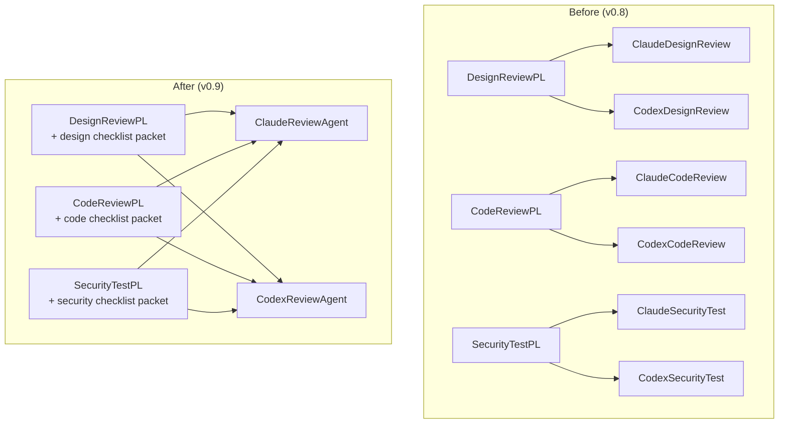

# ADR-001: Review/Test 워커 에이전트 통합 — Claude/Codex 2종으로 단일화하고 도메인은 PL packet으로 분리

## 상태

`Accepted` (2026-04-26)

## 컨텍스트

플러그인은 3개 리뷰 레인(설계 리뷰 · 구현 리뷰 · 보안 테스트)에서 각각 Claude/Codex 2 워커를 두어 총 6개 워커 에이전트를 운영해왔다.

```
agents/
├── ClaudeDesignReviewAgent.md     CodexDesignReviewAgent.md
├── ClaudeCodeReviewAgent.md       CodexCodeReviewAgent.md
└── ClaudeSecurityTestAgent.md     CodexSecurityTestAgent.md
```

6개 md를 정독한 결과 **실제 다른 부분은 4가지뿐**:
1. 체크리스트 (도메인별 검증 축)
2. 리뷰 스코프 (`docs/change-plans/**` vs `src/**+tests/**` vs `src/**+config/**+deploy/**+의존성`)
3. 출력 `category` enum (`adr-mismatch|design-quality` vs `style|runtime-bug|test-quality` vs `injection|trust-boundary|crypto|...`)
4. severity 보정 룰 (예: SecurityTestPL은 "credential hardcode = 자동 P0", DesignReviewPL은 "ADR 위반 = 자동 P0")

나머지(보고 정규화 스키마·Codex companion 실행 패턴·tool permission·"코드 수정 금지"·"독립 peer 수행" 원칙)는 6개 md에 거의 그대로 복사돼 있다. 이는 명백한 SSOT 위반이며, 새 리뷰 레인 추가 시 워커 md 2개를 또 만들어야 하는 비용도 상존한다.

또한 4가지 차이점은 모두 **PL의 책임 영역**이다 — 도메인 정의·체크리스트·severity 보정은 lane PL이 소유하고, 워커는 단순히 "Claude 모델 추론" 또는 "Codex GPT-5 추론"이라는 벤더 다양성만 제공해야 자연스럽다.

### 검토한 대안

**대안 A — 워커만 통합, PL도 단일화** (full unification): 1 ReviewPLAgent가 lane∈{design, code, security} 파라미터로 분기.
- 단점: lane invariant(보안 1차 layer fetch 의무·FIX 카운터 정책·라벨 매핑·model 강제)가 prompt에서 packet 작성자(Orchestrator) 책임으로 이동 → 빠뜨려도 즉시 안 잡힘. 보안 사고 비용을 고려하면 ROI 낮음. GitHub Actions(특히 `phase-gate-mergeable.yml`)의 lane별도 gate label 매핑은 외부에 그대로 남으므로 통합 절약은 PL 본문 1군데에 한정.
- 채택 안 함.

**대안 B — 워커 통합 + PL 3개 유지 + 공통 base 추출** (이 ADR이 채택하는 방향).

**대안 C — 현 상태 유지**: SSOT 위반·확장 비용 누적·6 md 동기화 부담 그대로. 채택 안 함.

## 결정

### 1. 워커 에이전트를 2종으로 통합한다

| 신규 | 대체 대상 | 책임 |
|---|---|---|
| `agents/ClaudeReviewAgent.md` | ClaudeDesignReview · ClaudeCodeReview · ClaudeSecurityTest | Claude 네이티브 시각으로 PL이 주입한 packet(체크리스트·스코프·category enum)에 따라 정적 리뷰 수행 |
| `agents/CodexReviewAgent.md` | CodexDesignReview · CodexCodeReview · CodexSecurityTest | Codex GPT-5 시각으로 동일 packet 기반 리뷰 수행 (codex-companion.mjs wrapper) |

기존 6개 워커 md는 **삭제한다**. 워커는 "벤더 다양성 peer"라는 단일 정체성을 갖는다.

### 2. PL 3개는 유지하되 공통 base를 추출한다

- `templates/review-pl-base.md` — severity 종합·dedup·noise 분류·보고 형식·Architect escalation 절차의 SSOT
- `agents/DesignReviewPLAgent.md` / `CodeReviewPLAgent.md` / `SecurityTestPLAgent.md` — base 템플릿 참조 1줄 + lane-specific 4가지(체크리스트 packet·FIX 카운터 정책·검증 스코프·다음 게이트 라벨)만 명시

### 3. 체크리스트를 외부 SSOT로 분리한다

- `templates/review-checklists/design.md` — Change Plan 완결성·ADR 정합성·Mapper↔Refactor 균형·구현 가능성·Test Contract 타당성
- `templates/review-checklists/code.md` — 레이어 계약·네이밍·경계 케이스·동시성·테스트 커버리지·Impl Manifest 정합
- `templates/review-checklists/security.md` — OWASP 9축 (Injection·Trust boundary·Auth·Credential·Crypto·PII·CVE·Config·Race)

PL은 lane 진입 시 해당 체크리스트를 읽어 워커 packet에 inline으로 주입한다.

### 4. 워커는 packet 누락 시 ESCALATE — 침묵 fallback 금지

PL packet에 체크리스트·스코프·category enum 중 하나라도 누락되면 워커는 generic review로 진행하지 않고 즉시 Orchestrator에 ESCALATE 신호를 반환한다. 이는 PL packet 완결성을 prompt 차원에서 강제하는 invariant policing 메커니즘이다.

### 5. 레인 명칭은 유지한다

"보안 테스트" 레인 명칭과 GitHub 라벨(`phase:보안-테스트`·`gate:security-test-pass`·`fix:보안-테스트-retry`)은 그대로 유지한다. 산업 관용("security testing"이 SAST 포함 표준 용어)과 GitHub Actions·CODEOWNERS 외부 SSOT 안정성을 우선한다.

## 결과

### 긍정

- **워커 md 6개 → 2개** (66% 감축). 새 리뷰 레인 추가 시 워커 신설 불필요 (PL packet만 작성)
- **severity·dedup·보고 형식 SSOT** 진정한 1군데 (`templates/review-pl-base.md`). 현재 3 PL md + 6 워커 md에 9번 복제된 표가 1번으로 줄어듦
- **체크리스트 SSOT 분리** (`templates/review-checklists/`). consumer overlay가 도메인별 체크리스트 추가·치환 가능
- **Claude/Codex 페어가 진정한 "벤더 다양성 peer"** — 도메인 어휘는 PL에 응집, 워커는 모델·실행 메커니즘만 전담
- **3 PL 명사 stable** — `DesignReviewPL` / `CodeReviewPL` / `SecurityTestPL` grep 가능, 세션 history 추적성 유지
- **lane invariant 보존** — model 강제·1차 layer fetch 의무·FIX 카운터 정책이 PL md 본문에 prompt-level로 남음

### 부정 / trade-off

- **PL packet 완결성이 게이트 품질을 결정** — 워커는 더 이상 fallback 체크리스트를 갖지 않음. 4번 항목(packet 누락 시 ESCALATE)으로 mitigate
- **워커 model 단일화** — 기존 6 워커는 각 lane별로 model을 따로 지정했으나(Claude는 Opus 4.7, Codex는 Haiku 4.5), 통합 후 워커는 lane-agnostic이라 model이 단일. 보안 lane에서 Opus 4.7이 필요하면 ClaudeReviewAgent도 Opus 4.7 — 비용 ↑. 이 비용은 SSOT 이득과 비교해 수용 가능 수준
- **마이그레이션 비용** — 9개 file 신규/수정·6개 file 삭제·6개 file 외부 참조 갱신. 일회성 비용

### 영향 범위

| 영역 | 변경 |
|---|---|
| 신규 파일 | `docs/adr/ADR-001-review-agent-unification.md`, `templates/review-pl-base.md`, `templates/review-checklists/{design,code,security}.md`, `agents/{Claude,Codex}ReviewAgent.md` |
| 수정 파일 | `agents/{DesignReview,CodeReview,SecurityTest}PLAgent.md` (슬림화), `agents/DocsAgent.md` (phase prefix 매핑), `CLAUDE.md` (agent tree·never-skippable 목록·write 권한 표), `docs/orchestrator-playbook.md` (스폰 시퀀스 다이어그램·핵심 의무 표·외부 의존성 표·세션 회고 테이블), `docs/plugin-design.md` (에이전트 enumeration), `CHANGELOG.md` (v0.9 entry) |
| 삭제 파일 | `agents/ClaudeDesignReviewAgent.md`, `agents/CodexDesignReviewAgent.md`, `agents/ClaudeCodeReviewAgent.md`, `agents/CodexCodeReviewAgent.md`, `agents/ClaudeSecurityTestAgent.md`, `agents/CodexSecurityTestAgent.md` |
| 영향 없음 | GitHub workflows (라벨 매핑 외부 SSOT 그대로), CODEOWNERS, Story file 섹션 규약, 1차 layer 자동화(Dependabot/CodeQL/Secret Scanning/Push Protection) |
| Consumer 영향 | overlay 측 `agents/Claude{Design,Code,SecurityTest}ReviewAgent.md` 또는 `Codex...` 오버라이드가 있다면 마이그레이션 필요. v0.9 CHANGELOG·migration-guide에 안내 |

## 해소 기준

N/A — permanent policy





## 관련 파일

- `agents/ClaudeReviewAgent.md` (신규)
- `agents/CodexReviewAgent.md` (신규)
- `agents/DesignReviewPLAgent.md` (슬림화)
- `agents/CodeReviewPLAgent.md` (슬림화)
- `agents/SecurityTestPLAgent.md` (슬림화)
- `templates/review-pl-base.md` (신규)
- `templates/review-checklists/design.md` (신규)
- `templates/review-checklists/code.md` (신규)
- `templates/review-checklists/security.md` (신규)
- `CLAUDE.md` (agent tree·never-skippable 목록·write 권한 표 갱신)
- `docs/orchestrator-playbook.md` (스폰 시퀀스·핵심 의무·외부 의존성·세션 회고 표 갱신)
- `docs/plugin-design.md` (agent enumeration 갱신)
- `agents/DocsAgent.md` (phase prefix 매핑 갱신)
- `CHANGELOG.md` (v0.9 entry)
