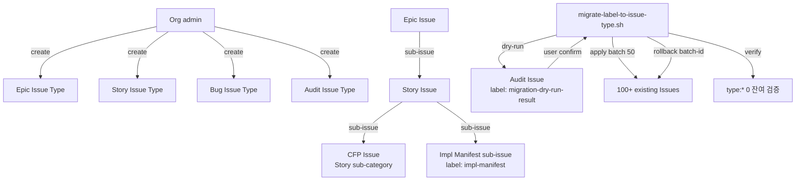

# ADR-049: Issue Types + Sub-issues Native Migration

## 상태

Proposed (2026-05-09) — CFP-140 carrier.
Amendment 1 (2026-06-15) — CFP-2251 carrier: type:* → native Issue Type 실 org cutover (additive 재구성). 아래 "## Amendment 1" 참조.
Amendment 2 (2026-06-15) — CFP-2252 carrier: native Issue Type cutover 완결 (type 정정 P0 + native-type 트리거 전환 + 라벨삭제 sequencing 완결 + §결정 5 graceful-fallback 인용 정정). 아래 "## Amendment 2" 참조.
Amendment 3 (2026-07-05) — CFP-2581 carrier: read-side cutover orphan 기록 + 라벨 삭제(A2-3) 안전 envelope 보강 (PC-4 phase-gate read-side OR-bridge + PC-5 native-null audit 선결조건 추가, documentary/additive). 아래 "## Amendment 3" 참조.

## 컨텍스트

codeforge 의 Issue 분류 = label hack `type:epic / type:story / type:bug` (3 entry, label-registry-v1) + impl-manifest sub-issue 표지 별도 axis. 그러나:

1. **GitHub Issue Types GA** (2025 Q4, org-level) — native type 부착 (REST `POST /repos/.../issues body {type: "Story"}`). 4 type max ~30 per org.
2. **GitHub Sub-issues GA** (2025) — parent-child 관계 + 1 parent only + max depth 8 levels.
3. **Projects v2 Hierarchy view GA** (2026-01) — roll-up + group by parent.
4. label `type:*` 와 native Issue Types 공존 가능하나 → drift / inconsistency 유발 (수동 label 부착 누락 / native type 부재 시 ambiguous). 이론적으로 cutover 가 자연스러운 evolution.

본 결정 = label hack → native Issue Types + sub-issues cutover. label-registry-v1 → v2 MAJOR bump. ADR-162 (governance-as-code) 와 별개 axis — Issue Types 의 schema 변경 + migration mechanism + label-registry contract version bump 가 core 결정.

**CFP 운영 의도** (Story §5.5 Q-3 사용자 확인 resolved): CFP 는 Story sub-category 로 유지 — 별도 native Issue Type 으로 분리하지 않음. label `type:cfp` 는 본 Story 시점 부재 (label-registry-v1 type 4 entry: epic/story/bug + impl-manifest sub-issue axis). CFP Issue 는 Story Issue Type 의 sub-category 로 운영 (Issue title prefix `[CFP-NNN]` + Story Issue Type 부착).

**Migration timing** (Story §5.5 Q-4 사용자 확인 resolved): mctrader debut audit complete 후 defer. Phase 1 PR = ADR + spec + skeleton + plan only (실 migration 0). Phase 2 PR step 2 = 사용자 explicit confirm 후 100+ Issue 일괄 변환.

## 결정

**1. native Issue Types 4 type 도입** — `templates/issue-types.yaml` 신설. org-level 정의:
   - `Epic` (사용자 요구사항 1건 = Milestone + Issue, 기존 label `type:epic` 대체)
   - `Story` (PR 1쌍 = Phase 1 + Phase 2, 기존 label `type:story` 대체. CFP 도 본 type 의 sub-category)
   - `Bug` (기존 label `type:bug` 대체)
   - `Audit` (CFP-140 신규 — governance audit Issue, 기존 label `audit` axis 와 별도)

   `impl-manifest` label 은 sub-issue 표지 별도 axis 로 잔존 (label-registry-v2 에 entry 유지).

**2. Sub-issues hierarchy 도입** — 3-level: Epic → Story → CFP/Sub-issue. `POST /repos/{owner}/{repo}/issues/{number}/sub_issues` API 활용. 1 parent only 원칙 (GitHub native enforcement). Projects v2 Hierarchy view 활용.

**3. label-registry-v1 → v2 MAJOR bump** — `docs/inter-plugin-contracts/label-registry-v1.md` `status: Active → Archived`, `docs/inter-plugin-contracts/label-registry-v2.md` 신설. v2 변경:
   - type:* 3 entry deprecate (epic / story / bug) — native Issue Types 로 대체
   - impl-manifest sub-issue 표지 axis 잔존
   - 신규 metadata: `replaced_by_native_issue_type: <type_name>` field (deprecate entry 명시)
   - phase / gate / fix / hotfix / audit / category label 영역 무변경

**4. migration script 신설** — `scripts/migrate-label-to-issue-type.sh`:
   - Mode: `--dry-run` (default) / `--apply` / `--rollback --batch-id <N>` / `--verify`
   - Idempotent: 2회 `--apply` = 1회 결과 (이미 변환 Issue skip)
   - Batch: `--batch-size 50` (rate limit 안전 마진 — 5000 pt/hr GraphQL 의 ~100 batch/hr cap 대비 50 batch + sleep 1s 적용)
   - Audit trail: 매 batch 결과 → audit Issue (label `migration-batch-<N>`)
   - Rollback: batch-id 단위만 (per-Issue rollback 미지원 — over-engineering 회피)

**5. story-init.yml Action 갱신** — Issue Form 제출 시 native Issue Types API 호출:
   - `POST /repos/{owner}/{repo}/issues body {type: "Story"}` (또는 Epic / Bug / Audit)
   - 기존 label `type:story` 미부착 (label-registry-v2)
   - org Issue Types 미활성 시 graceful fallback (label hack 사용 + warning log)

**6. github-issue-forms/*.yml 4 file 갱신** — `issue_type` field 추가 (audit / bug / story / cfp-reserve):
   - `audit.yml` → `issue_type: Audit`
   - `bug.yml` → `issue_type: Bug`
   - `story.yml` → `issue_type: Story`
   - `cfp-reserve.yml` → `issue_type: Story` (CFP = Story sub-category, sub-issue 로 parent Story 에 attach)

**7. subissue-from-impl-manifest.yml Action 갱신** — sub-issue API (`POST /repos/.../issues/{number}/sub_issues`) 사용. impl-manifest label 은 sub-issue 의 visual 표지 axis 유지.

**8. bootstrap-labels.sh 갱신** — type:* 3 entry 제거 (script 가 label-registry-v2 mirror).

**9. Migration timing** — mctrader debut audit complete 직후. Phase 1 PR = doc-only (label-registry-v2 신설 + ADR + spec). Phase 2 PR step 2 = 사용자 explicit confirm 후 실 migration 실행 (`--dry-run` → review → `--apply --batch-size 50` → `--verify`).

**10. Rollback 경로** — batch-id 단위. label-registry-v2 → v1 rollback = sibling sync revert PR (ADR-010 정합).

**11. ADR-008 amendment**: contract version bump (label-registry MAJOR bump) ≠ codeforge plugin SemVer MAJOR bump. label-registry-v1 → v2 = contract version-only bump (ADR-037 plugin version bump rule 와 별도 axis). 본 ADR 이 명시.

**12. consumer-side migration 면제** (본 Story scope):
   - mclayer org 만 본 Story 에서 migration. 다른 consumer org (mctrader 등) = audit complete 후 별도 migration CFP.
   - consumer-guide.md 에 label-registry MAJOR bump 영향 + migration plan 안내 (Phase 2 종료 후).

## Amendment 1 (CFP-2251, 2026-06-15) — type:* → native Issue Type 실 org cutover (additive)

ADR-049 본문 §결정 4 (migration script) + §결정 9 (migration timing) 의 **실 실행 결정**. 본문 §결정 1-12 본문 변경 0 (additive ratchet — 기존 결정 축소 없음). mctrader debut audit 후 defer 였던 실 cutover 를 mclayer org 에서 실행한다.

### A1-1. org 재구성 = ADDITIVE (사용자 결정 2026-06-15)

org Issue Type 실측 (2026-06-15, `gh api /orgs/mclayer/issue-types`):

| 기존 org type | id | 처리 |
|---|---|---|
| Task | 28762363 | 보존 (GitHub 기본, cutover 무관) |
| Bug | 28762364 | **재사용** (type:bug 매핑 — 신설 0) |
| Feature | 28762365 | 보존 (GitHub 기본, cutover 무관) |

신설 대상:

| 신설 type | 매핑 label | 처리 |
|---|---|---|
| Story | type:story | org POST 신설 |
| Epic | type:epic | org POST 신설 |

**Audit = deferred** — ADR-049 §결정 1 의 4-type 안 중 Audit 은 본 cutover 미포함 (사용자 결정). 별 CFP carrier 에서 신설. `templates/issue-types.yaml` `_deferred` block 에 박제.

### A1-2. 마이그레이션 대상 = type:* 부착 전체 487 이슈 (open+closed)

`scripts/migrate-label-to-issue-type.sh --dry-run` 실측 (2026-06-15):

| 매핑 | count |
|---|---|
| type:epic → Epic | 46 |
| type:story → Story | 415 |
| type:bug → Bug | 26 |
| **총 대상** | **487** |
| 이미 native type 보유 (skip) | 0 |

PR 은 제외 (REST issues endpoint `.pull_request == null` 필터). idempotent — 재실행 시 이미 변환된 이슈 skip.

### A1-3. label deprecate 타이밍 (transient dual-state — 물리 삭제는 S4 sequencing)

native Issue Type 부착 + `--verify` PASS 완료 (아래 A1-5 실행 결과). **단 type:* 라벨 물리 삭제는 본 Story 에서 하지 않는다** — `story-init.yml` 이 `type:story` 라벨로 트리거되므로 (Issue Form → label → workflow), 라벨을 선삭제하면 story-init 가 깨진다. 따라서:

1. org Story/Epic Issue Type 신설 (Bug 재사용) — **완료**
2. `migrate-label-to-issue-type.sh --apply --batch-size 50` — **완료**
3. `migrate-label-to-issue-type.sh --verify` (불일치 0) — **완료 (PASS)**
4. type:epic / type:story / type:bug 라벨 정의 물리 삭제 + `story-init.yml` 트리거의 native-type 전환 — **S4 (#2252, story-init.yml owner) 로 sequencing.**

**Transient dual-state 허용** (deprecated label + native type 공존) — ADR-049 §결정 11 의 "org Issue Types 미활성 시 graceful fallback = transient dual-state 허용" 과 정합. story-init.yml 의 trigger 가 native type 기준으로 전환 완료될 때까지 type:* 라벨은 존속한다. S4 종료 시점에 비로소 라벨 물리 삭제 + DI-1 invariant (native type + type:* label 동시 존재 금지) 완전 충족.

registry 는 본 Amendment 에서 type:epic/story/bug 에 `replaced_by_native_issue_type` + `deprecated: true` 마킹 추가 (신규 부착 금지 신호). **물리 삭제 ≠ deprecated 마킹** — 마킹은 본 Story 에서, 삭제는 S4 에서.

### A1-4. 실행 권한 경계

- **도구 빌드 + dry-run** = 구현 레인 (본 Amendment + script).
- **org Issue Type 신설 + --apply + (S4 의) label 물리 삭제** = Orchestrator 실행 영역 (org-mutating).

### A1-5. 실행 결과 (2026-06-15, Orchestrator 실행 — 기록용)

| 항목 | 결과 |
|---|---|
| org Story Issue Type 신설 | **완료** — id=34327613 |
| org Epic Issue Type 신설 | **완료** — id=34327614 |
| org Bug Issue Type 재사용 | id=28762364 (신설 0) |
| org type set (실행 후) | [Task, Bug, Feature, Story, Epic] (5-type, additive — 기존 3 보존) |
| migration `--apply` | 487 이슈 변환 (epic 46 / story 415 / bug 26) |
| migration `--verify` | **PASS — 487 정합, 0 불일치** |

**실측 결함 정정 (S4 evidence)**: 빌드 시 `apply_one` 의 부착 payload 가 `--field type_id=<id>` 였으나, REST 가 이를 **silent 무시** (HTTP 2xx 반환하나 type 미설정). 첫 `--apply` 가 487 "성공" 보고 후 `--verify` 가 487 MISMATCH 로 발각. payload 를 `-f type=<TypeName>` (이름 기반) 으로 정정 → 재apply → verify PASS. **동일 결함이 `story-init.yml` L556 (`--field type_id=`) 에도 존재** — 신규 Issue 의 native type 부착이 여태 silent 실패해 왔음. → **S4 (#2252, story-init.yml owner) 에서 정정 대상** (라벨 물리 삭제 + trigger native-type 전환과 동반).

## Amendment 2 (CFP-2252, 2026-06-15) — native Issue Type cutover 완결 (additive ratchet)

Epic #2244 의 최후 child Story (S4, self-host wrapper dogfood). Amendment 1 이 sequencing 으로 S4 에 미룬 **(a) type 정정 / (b) native-type 트리거 전환 / (c) 라벨 물리 삭제** 의 실 실행 완결. ADR-049 §결정 5 (story-init Action 갱신 + graceful fallback) + §결정 8 (bootstrap-labels) + Amendment 1 §A1-3 (라벨 삭제 S4 sequencing) 의 enforcement. 본문 §결정 1-12 + Amendment 1 본문 변경 0 (additive — graceful-fallback 인용 정정 1줄 제외, 아래 A2-0).

### A2-0. Amendment 1 graceful-fallback 인용 정정 (오인용 교정 — 상속 drift 차단)

Amendment 1 §A1-3 본문이 transient dual-state 허용을 "ADR-049 §결정 11 정합" 으로 인용했으나 **실측 결과 graceful fallback 실제 위치 = §결정 5** ("org Issue Types 미활성 시 graceful fallback (label hack 사용 + warning log)"). §결정 11 = ADR-008 amendment (contract version bump), §결정 12 = consumer migration 면제 — 둘 다 graceful fallback 과 무관. **정정**: graceful fallback 인용은 본 ADR 전체에서 **§결정 5** 가 정본. 본 정정은 오인용 교정으로 의미 무변경 (additive 무손상) — Amendment 1 본문은 historic-preserving 으로 inline edit 미수행, 본 A2-0 가 신규 SSOT.

### A2-1. type 정정 (P0 라이브 결함)

`story-init.yml` `Attach native Issue Type` step 의 부착 payload `--field type_id=<id>` = **REST 미존재 파라미터** (HTTP 2xx 반환하나 type 미설정 = silent drop). [SSOT: GitHub REST "Update an issue" — 파라미터 = `type`(string, 타입 이름), null=제거. "Without push access ... type changes are silently dropped"]. migrate-script L171 의 검증된 `-f type=<TypeName>` 패턴과 동일 결함 (Amendment 1 §A1-5 실측 선례). 6개월 잠복 — 신규 Issue native type 부착이 여태 silent 실패.

- **정정**: `-f "type=Story"` (이름 기반). 종전 id 기반 필드 사용 금지.
- **verify-after-write 추가**: PATCH 2xx ≠ 실제 부착 (push access 부족 시 silent drop) → 재read (`.type.name == "Story"`) 로 실측. 근본 원인 = write 후 검증 부재 → verify 가 동일 결함의 재발을 구조적으로 차단. push access 부족 시 warning + label fallback 의존 (§결정 5), story-init 무중단.

### A2-2. native-type 트리거 전환 (self-host 위험 1급)

- `on.issues.types` 에 `typed` 추가 (issues 이벤트 정식 activity type — native type 부착/UI type 부여 시 발화). [출처: GitHub Docs — Webhook events and payloads, issues event].
- if-expression **OR-bridge**: `github.event.issue.type.name == 'Story'` OR `contains(labels, 'type:story')` — 라벨삭제 후 native-type 으로 발화 보존 + transient 기간 dual catch + org type 미활성 consumer 는 라벨 분기 fallback (기존 동작 100% 보존, §결정 5 graceful).
- `phase:요구사항` AND 보존 — type 부착만으로 오발화 차단 (무관 Story type 이슈). null 안전 (type 미설정 = null → `== 'Story'` false, Actions null 비교 안전).
- **payload 가용성 abstention**: `github.event.issue.type.name` 의 webhook payload 노출 = GitHub 공식 문서 미명세 → Actions context 가용성 **확정 불가**. REST 응답엔 `issue.type` 존재 실측이나 webhook payload 미러는 공식 보증 부재. 본 가정은 라이브 canary (TC-13) 가 입증 gate — 입증 전 미확정 취급.
- expression truth-table 검증 = `scripts/lib/eval_story_init_trigger_expr.py` (TC-6~11 음성/양성, CI-gated `.github/workflows/story-init-trigger-expr-check.yml` non-required tier). actionlint 는 truth-value 미평가 (문법만) → 음성 조건 (Bug 오발화 차단 / phase gate / null 안전)은 본 harness 가 결정적 검증 (canary 입증 불가 영역, 역할 분리).

### A2-3. 라벨 물리 삭제 = 3단계 promotion invariant (Orchestrator org-mutating)

라벨 물리 삭제 (type:epic / type:story / type:bug 3종) = **org-mutating → Orchestrator 실행 영역** (`gh label delete`), 워크플로/스크립트 자동 삭제 아님. 다음 3단계를 순서대로 통과한 **후에만** 실행 (single-PR step-분리/confirm 양자택일 옵션 없음):

1. **merge** — 트리거 native-type 전환 (A2-2) + type 정정 (A2-1) 이 wrapper + templates 에 merge.
2. **production canary 증거 (blocking)** — TC-13 (type:story 라벨 미부착 + native "Story" type + phase:요구사항 만으로 story-init 발화) green run 로그. **이 증거 부재 시 라벨 삭제 금지** (payload 가용성 미확정이므로 canary 가 유일 입증 수단).
3. **삭제** — PC-1 (트리거 PR merge 확인) ∧ PC-2 (TC-13 canary green 로그) ∧ PC-3 (DI-1 직전 상태) 충족 시에만 `gh label delete` 3건.

**입증 실패 종착**: TC-13 canary 가 native-only 발화를 입증하지 못하면 → 라벨 영구 보존 (native+label 공존 = 안전 종착, story-init 무중단). 라벨 삭제는 native-only 발화 입증의 함수 — 입증 없이 삭제 절대 금지. 삭제 대상 = epic/story/bug 3종만 (native type 매핑 존재). type:improvement / type:adr-candidate / type:chore = 삭제 금지 (native type 부재, 본 Story scope 밖). DI-1 invariant 완전 충족 = 라벨삭제 단계 완료 시점.

### A2-4. 동반 결정 (cross-ref)

- **ADR-013 Amendment 7**: TARGET_REPO 하드코딩 4곳 (existence_check / branch create / PR create / Issue body URL) → project.yaml `github.story_ssot_repo` 파라미터화 (default `mclayer/codeforge-internal-docs`, 확장-only). consumer 분기 무변경.
- **ADR-066 §결정 2 cross-ref (Amendment 불요)**: existence_check 앞 PAT scope 사전검증 step (토큰 유효 → repo 접근 → `permissions.push` write proxy, codeforge family 한정, fail-closed). 기존 6 scope 무변경 — enforcement mechanism 만 추가 → 독립 Amendment 불요, cross-ref 만. fine-grained scope 정밀 introspection API 부재 → `permissions.push` 가 최선 신호 (abstention 명시).
- **#1046 / #2147 흡수**: #1046 (Create Phase 1 PR self-repo resolve) = pat_precheck 의 에러 locality + write-readiness probe 보강 (existence_check 가 이미 read probe 수행 — 단독 흡수 아님, sentinel pattern_count=1 보존). #2147 (reconcile 빈 §1 scaffold) = parse step body-치환 guard (`^Story SSOT: \[` 마크다운 링크 prefix + 요구사항 추출 0 → exit 1 fail-safe).

## Amendment 3 (CFP-2581, 2026-07-05) — read-side cutover orphan 기록 + 라벨 삭제 안전 envelope 보강 (documentary/additive)

CFP-2581 (`phase-gate-mergeable` 자동 Story-issue 인식) 설계 lane 이 firsthand 로 확인한 **A2-2 OR-bridge 의 read-side 미전파 gap** 을 A2-3 라벨 삭제 promotion invariant 의 선결조건으로 기록한다. 본 Amendment 는 **mechanism 무변경 documentary** — 기존 §결정 1-12 + Amendment 1/2 본문 변경 0, A2-3 안전 게이트에 PC-4/PC-5 를 append-only 로 강화한다.

### A3-1. read-side cutover orphan (firsthand)

Amendment 2 §A2-2 는 native-type 인식 OR-bridge (`github.event.issue.type.name == 'Story'` OR `contains(labels, 'type:story')`) 를 **story-init.yml 트리거에만** 적용했다. 그러나 canonical Story issue 를 직독하는 **다른** read 경로 — `phase-gate-mergeable.yml` — 의 predicate 2곳은 여전히 `type:story` **라벨** 검사에 머물러 있다:

| 위치 | predicate (현재) | 역할 |
|---|---|---|
| step-3 L113 | `issue.labels ... includes('type:story')` | linked issue 직독으로 phase/gate 라벨 채택 |
| deadlock-resolver `isLabelMismatchOnly` L330 | 동일 `type:story` 라벨 검사 | ADR-127 §K full-flow 증거(Story binding) 판정 |

즉 OR-bridge 는 **write/트리거 경로만** cutover 됐고 **read/게이트 판정 경로는 orphan** 이다. 이는 §A2-2 의 "라벨삭제 후 native-type 으로 발화 보존" 이 story-init 발화에는 성립하나 **phase-gate 직독에는 미보장** 임을 의미한다.

### A3-2. A2-3 라벨 삭제 선결조건 강화 — PC-4 신설 (read-side OR-bridge)

A2-3 는 라벨 물리 삭제를 PC-1(트리거 PR merge) ∧ PC-2(TC-13 story-init canary green) ∧ PC-3(DI-1 직전) 3단계로 게이트한다. 그러나 **PC-2 canary(TC-13)는 story-init 발화만 입증** 하고 phase-gate 직독은 검증 범위 밖이다.

라벨 삭제 후 L113/L330 이 label-only 인 채로 남으면: native type='Story' 이나 `type:story` 라벨이 없는 issue 를 링크한 **bare `#N` PR (현재 step-3 직독이 성립하는 부류 — #2559/#2580)** 마저 L113 predicate 가 false → 직독 실패 → **수동 미러로 회귀** (CFP-2581 이 제거하려는 friction 의 전면 재발).

→ **PC-4 신설**: 라벨 삭제 前, phase-gate read-side predicate 2곳(L113 step-3 + L330 deadlock-resolver)을 §A2-2 와 동일한 OR-bridge (`labels.includes('type:story') || issue.type?.name === 'Story'`, additive superset)로 전환 완료 + native-only issue + bare `#N` PR 직독 canary green 로그 확보. 미충족 시 라벨 삭제 금지 (A2-3 "입증 실패 = 라벨 영구 보존" 원칙 verbatim 답습).

### A3-3. native-null blocker — PC-5 신설 (native-type audit/backfill)

`#2563` 은 native `.type.name`=**null** (`type:story` 라벨만 보유 — A2-1 silent `type_id` drop 잔재 추정, RequirementsReviewPL firsthand `gh api` 실측). native-null issue 는 라벨 삭제 시 **label predicate ∧ OR-bridge 양쪽 실패** → 어느 read 경로로도 Story 로 인식 불가.

→ **PC-5 신설**: 라벨 삭제 前, native-type audit (전 Story issue `.type.name` 실측) 로 native-null 집합 = 0 확인 + backfill (`gh api ... -f type=Story` A2-1 verify-after-write 패턴). 이것이 DI-1(native type + `type:*` label 동시 존재 금지)의 실 완전 충족 조건 — native-null 잔존 상태에서 라벨 삭제 시 해당 issue 는 native type 도 label 도 없는 orphan 이 되어 DI-1 의 "native type 존재" 전제 위반.

### A3-4. CFP-2581 scope 경계 — native-type cutover 와 disjoint

CFP-2581 의 실 변경 = `phase-gate-mergeable.yml` L40 localRefs 정규식을 `owner/repo#N` (same-repo) 형태까지 확장하는 **PR↔canonical-issue 바인딩 파싱** 이다. 이는 "어떤 PR-body ref 형태가 유효 바인딩인가" 축으로, "무엇이 Story 인가" 를 판정하는 native-type predicate (L113/L330) 와 **직교(disjoint)** — 서로 다른 read 단계다. 따라서:

- read-side OR-bridge (Amendment 2 §A2-2 의 phase-gate 전파, 구 CFP-2581 요구사항 후보 (b)) 자체는 **CFP-2581 미실행** — A2-3 라벨 삭제 carrier 로 **defer**. 본 Amendment 는 그 선결조건(PC-4/PC-5)만 기록.
- CFP-2581 의 바인딩 파싱 확장은 `type:story` 라벨 존속 상태(현재)에서 즉시 실 friction(cross-repo ref PR 직독 skip)을 해소하며, native-type cutover 진행/보류와 무관하게 독립 유효.

**해소 기준**: A3-2/A3-3 의 PC-4/PC-5 는 A2-3 라벨 삭제가 실제 착수될 때 그 carrier 가 이행. 그 전까지는 label+native 공존(A2-3 안전 종착)이 유지되므로 read-side orphan 은 무해(latent) — 라벨이 존속하는 한 L113/L330 label predicate 는 정상 동작.

## 결과

### 긍정

- Issue 분류의 native type 보장 (label drift 차단)
- Projects v2 Hierarchy view 활용 가능 (Epic / Story / Sub-issue rollup)
- label-registry contract scope 축소 (type:* 3 entry deprecate → registry 더 명확)
- migration script idempotent + dry-run + rollback = production-grade migration ops 패턴

### 부정 / Trade-off

- label-registry-v1 → v2 MAJOR bump = contract version bump (sibling sync per ADR-010 의무)
- migration timing dependency = mctrader debut audit complete 의무 (사용자 directive)
- org Issue Types 미활성 시 graceful fallback (label hack 사용) = transient dual-state 허용
- Issue Type "Audit" 신규 도입 = 기존 audit label axis 와 명칭 중복 가능성 — `templates/issue-types.yaml` 의 description 명시 의무
- CFP 가 Story sub-category 유지 = sub-issue API 의존 (parent Story 에 attach) — Sub-issues GA 정합

### 영향 받는 영역

- `mclayer/plugin-codeforge` (wrapper):
  - `templates/issue-types.yaml` (신규)
  - `templates/github-issue-forms/{audit,bug,story,cfp-reserve}.yml` (4 file 갱신)
  - `templates/github-workflows/story-init.yml` (갱신)
  - `templates/github-workflows/subissue-from-impl-manifest.yml` (갱신)
  - `scripts/migrate-label-to-issue-type.sh` (신규)
  - `scripts/bootstrap-labels.sh` (갱신 — type:* 3 entry 제거)
  - `docs/inter-plugin-contracts/label-registry-v1.md` (status: Active → Archived)
  - `docs/inter-plugin-contracts/label-registry-v2.md` (신규)
  - `docs/inter-plugin-contracts/MANIFEST.yaml` (label-registry version bump entry 추가)

- `mclayer/plugin-codeforge-pmo` (sibling sync — ADR-010 정합. 현 `plugins/codeforge-pmo/`, 구 repo 삭제됨 2026-06-12):
  - `docs/inter-plugin-contracts/label-registry-v1.md` mirror sync (Active → Archived)
  - `docs/inter-plugin-contracts/label-registry-v2.md` mirror 신설

- consumer projects (mctrader 등):
  - 본 Story scope 0건 (audit complete 후 별도 migration CFP)
  - consumer-guide.md 안내 (Phase 2 종료 후 갱신)

### Migration data integrity (§11 정합)

- **DI-1**: 변환 후 Issue Type + label `type:*` 동시 존재 금지 (cutover invariant)
- **DI-2**: Sub-issue parent 1개 only (GitHub native enforcement)
- **DI-3**: Custom Properties allowed_values change 시 schema breaking — migration script + warning + validation period 의무 (ADR-162 정합)
- **DI-4**: ruleset name uniqueness (ADR-162 정합)

## 해소 기준

N/A — permanent policy



## 관련 파일

- `docs/stories/CFP-140.md` (Story file SSOT — internal-docs `wrapper/stories/CFP-140.md`)
- `docs/change-plans/cfp-140-ghec-governance.md` (Change Plan, internal-docs `wrapper/change-plans/cfp-140-ghec-governance.md`)
- `docs/adr/ADR-162-ghec-governance-as-code.md` (sibling — Rulesets / Required Workflows / Audit log)
- `docs/adr/ADR-008-inter-plugin-contract-versioning.md` (amended by 본 ADR — contract version bump 의 plugin SemVer 와 분리 명시)
- `docs/inter-plugin-contracts/label-registry-v1.md` → `label-registry-v2.md`
