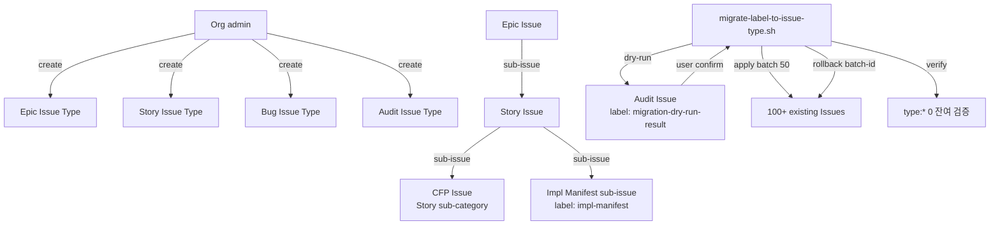

# ADR-049: Issue Types + Sub-issues Native Migration

## 상태

Proposed (2026-05-09) — CFP-140 carrier.

## 컨텍스트

codeforge 의 Issue 분류 = label hack `type:epic / type:story / type:bug` (3 entry, label-registry-v1) + impl-manifest sub-issue 표지 별도 axis. 그러나:

1. **GitHub Issue Types GA** (2025 Q4, org-level) — native type 부착 (REST `POST /repos/.../issues body {type: "Story"}`). 4 type max ~30 per org.
2. **GitHub Sub-issues GA** (2025) — parent-child 관계 + 1 parent only + max depth 8 levels.
3. **Projects v2 Hierarchy view GA** (2026-01) — roll-up + group by parent.
4. label `type:*` 와 native Issue Types 공존 가능하나 → drift / inconsistency 유발 (수동 label 부착 누락 / native type 부재 시 ambiguous). 이론적으로 cutover 가 자연스러운 evolution.

본 결정 = label hack → native Issue Types + sub-issues cutover. label-registry-v1 → v2 MAJOR bump. ADR-048 (governance-as-code) 와 별개 axis — Issue Types 의 schema 변경 + migration mechanism + label-registry contract version bump 가 core 결정.

**CFP 운영 의도** (Story §5.5 Q-3 사용자 확인 resolved): CFP 는 Story sub-category 로 유지 — 별도 native Issue Type 으로 분리하지 않음. label `type:cfp` 는 본 Story 시점 부재 (label-registry-v1 type 4 entry: epic/story/bug + impl-manifest sub-issue axis). CFP Issue 는 Story Issue Type 의 sub-category 로 운영 (Issue title prefix `[CFP-NNN]` + Story Issue Type 부착).

**Migration timing** (Story §5.5 Q-4 사용자 확인 resolved): mctrader debut audit complete 후 defer. Phase 1 PR = ADR + spec + skeleton + plan only (실 migration 0). Phase 2 PR step 2 = 사용자 explicit confirm 후 100+ Issue 일괄 변환.

## 결정

**1. native Issue Types 4 type 도입** — `templates/issue-types.yaml` 신설. org-level 정의:
   - `Epic` (사용자 요구사항 1건 = Milestone + Issue, 기존 label `type:epic` 대체)
   - `Story` (PR 1쌍 = Phase 1 + Phase 2, 기존 label `type:story` 대체. CFP 도 본 type 의 sub-category)
   - `Bug` (기존 label `type:bug` 대체)
   - `Audit` (CFP-140 신규 — governance audit Issue, 기존 label `audit` axis 와 별도)

   `impl-manifest` label 은 sub-issue 표지 별도 axis 로 잔존 (label-registry-v2 에 entry 유지).

**2. Sub-issues hierarchy 도입** — 3-level: Epic → Story → CFP/Sub-issue. `POST /repos/{owner}/{repo}/issues/{number}/sub_issues` API 활용. 1 parent only 원칙 (GitHub native enforcement). Projects v2 Hierarchy view 활용.

**3. label-registry-v1 → v2 MAJOR bump** — `docs/inter-plugin-contracts/label-registry-v1.md` `status: Active → Archived`, `docs/inter-plugin-contracts/label-registry-v2.md` 신설. v2 변경:
   - type:* 3 entry deprecate (epic / story / bug) — native Issue Types 로 대체
   - impl-manifest sub-issue 표지 axis 잔존
   - 신규 metadata: `replaced_by_native_issue_type: <type_name>` field (deprecate entry 명시)
   - phase / gate / fix / hotfix / audit / category label 영역 무변경

**4. migration script 신설** — `scripts/migrate-label-to-issue-type.sh`:
   - Mode: `--dry-run` (default) / `--apply` / `--rollback --batch-id <N>` / `--verify`
   - Idempotent: 2회 `--apply` = 1회 결과 (이미 변환 Issue skip)
   - Batch: `--batch-size 50` (rate limit 안전 마진 — 5000 pt/hr GraphQL 의 ~100 batch/hr cap 대비 50 batch + sleep 1s 적용)
   - Audit trail: 매 batch 결과 → audit Issue (label `migration-batch-<N>`)
   - Rollback: batch-id 단위만 (per-Issue rollback 미지원 — over-engineering 회피)

**5. story-init.yml Action 갱신** — Issue Form 제출 시 native Issue Types API 호출:
   - `POST /repos/{owner}/{repo}/issues body {type: "Story"}` (또는 Epic / Bug / Audit)
   - 기존 label `type:story` 미부착 (label-registry-v2)
   - org Issue Types 미활성 시 graceful fallback (label hack 사용 + warning log)

**6. github-issue-forms/*.yml 4 file 갱신** — `issue_type` field 추가 (audit / bug / story / cfp-reserve):
   - `audit.yml` → `issue_type: Audit`
   - `bug.yml` → `issue_type: Bug`
   - `story.yml` → `issue_type: Story`
   - `cfp-reserve.yml` → `issue_type: Story` (CFP = Story sub-category, sub-issue 로 parent Story 에 attach)

**7. subissue-from-impl-manifest.yml Action 갱신** — sub-issue API (`POST /repos/.../issues/{number}/sub_issues`) 사용. impl-manifest label 은 sub-issue 의 visual 표지 axis 유지.

**8. bootstrap-labels.sh 갱신** — type:* 3 entry 제거 (script 가 label-registry-v2 mirror).

**9. Migration timing** — mctrader debut audit complete 직후. Phase 1 PR = doc-only (label-registry-v2 신설 + ADR + spec). Phase 2 PR step 2 = 사용자 explicit confirm 후 실 migration 실행 (`--dry-run` → review → `--apply --batch-size 50` → `--verify`).

**10. Rollback 경로** — batch-id 단위. label-registry-v2 → v1 rollback = sibling sync revert PR (ADR-010 정합).

**11. ADR-008 amendment**: contract version bump (label-registry MAJOR bump) ≠ codeforge plugin SemVer MAJOR bump. label-registry-v1 → v2 = contract version-only bump (ADR-037 plugin version bump rule 와 별도 axis). 본 ADR 이 명시.

**12. consumer-side migration 면제** (본 Story scope):
   - mclayer org 만 본 Story 에서 migration. 다른 consumer org (mctrader 등) = audit complete 후 별도 migration CFP.
   - consumer-guide.md 에 label-registry MAJOR bump 영향 + migration plan 안내 (Phase 2 종료 후).

## 결과

### 긍정

- Issue 분류의 native type 보장 (label drift 차단)
- Projects v2 Hierarchy view 활용 가능 (Epic / Story / Sub-issue rollup)
- label-registry contract scope 축소 (type:* 3 entry deprecate → registry 더 명확)
- migration script idempotent + dry-run + rollback = production-grade migration ops 패턴

### 부정 / Trade-off

- label-registry-v1 → v2 MAJOR bump = contract version bump (sibling sync per ADR-010 의무)
- migration timing dependency = mctrader debut audit complete 의무 (사용자 directive)
- org Issue Types 미활성 시 graceful fallback (label hack 사용) = transient dual-state 허용
- Issue Type "Audit" 신규 도입 = 기존 audit label axis 와 명칭 중복 가능성 — `templates/issue-types.yaml` 의 description 명시 의무
- CFP 가 Story sub-category 유지 = sub-issue API 의존 (parent Story 에 attach) — Sub-issues GA 정합

### 영향 받는 영역

- `mclayer/plugin-codeforge` (wrapper):
  - `templates/issue-types.yaml` (신규)
  - `templates/github-issue-forms/{audit,bug,story,cfp-reserve}.yml` (4 file 갱신)
  - `templates/github-workflows/story-init.yml` (갱신)
  - `templates/github-workflows/subissue-from-impl-manifest.yml` (갱신)
  - `scripts/migrate-label-to-issue-type.sh` (신규)
  - `scripts/bootstrap-labels.sh` (갱신 — type:* 3 entry 제거)
  - `docs/inter-plugin-contracts/label-registry-v1.md` (status: Active → Archived)
  - `docs/inter-plugin-contracts/label-registry-v2.md` (신규)
  - `docs/inter-plugin-contracts/MANIFEST.yaml` (label-registry version bump entry 추가)

- `mclayer/plugin-codeforge-pmo` (sibling sync — ADR-010 정합):
  - `docs/inter-plugin-contracts/label-registry-v1.md` mirror sync (Active → Archived)
  - `docs/inter-plugin-contracts/label-registry-v2.md` mirror 신설

- consumer projects (mctrader 등):
  - 본 Story scope 0건 (audit complete 후 별도 migration CFP)
  - consumer-guide.md 안내 (Phase 2 종료 후 갱신)

### Migration data integrity (§11 정합)

- **DI-1**: 변환 후 Issue Type + label `type:*` 동시 존재 금지 (cutover invariant)
- **DI-2**: Sub-issue parent 1개 only (GitHub native enforcement)
- **DI-3**: Custom Properties allowed_values change 시 schema breaking — migration script + warning + validation period 의무 (ADR-048 정합)
- **DI-4**: ruleset name uniqueness (ADR-048 정합)

## 해소 기준

N/A — permanent policy



## 관련 파일

- `docs/stories/CFP-140.md` (Story file SSOT — internal-docs `wrapper/stories/CFP-140.md`)
- `docs/change-plans/cfp-140-ghec-governance.md` (Change Plan, internal-docs `wrapper/change-plans/cfp-140-ghec-governance.md`)
- `docs/adr/ADR-048-ghec-governance-as-code.md` (sibling — Rulesets / Required Workflows / Audit log)
- `docs/adr/ADR-008-inter-plugin-contract-versioning.md` (amended by 본 ADR — contract version bump 의 plugin SemVer 와 분리 명시)
- `docs/inter-plugin-contracts/label-registry-v1.md` → `label-registry-v2.md`
