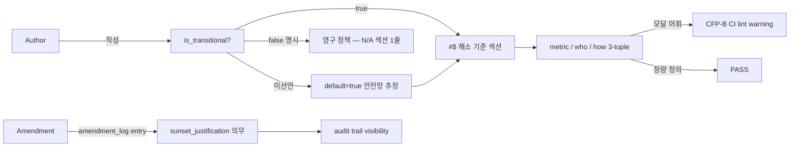

# ADR-058: ADR 해소 기준 섹션 의무화 + transitional 분류 frontmatter

## 상태

Accepted (2026-05-11). carrier_story = CFP-387.

## 컨텍스트

ADR-057 (Orchestrator Opus 필수화 + Sonnet→Opus rate-limit fallback) 가 측정 기준 없는 영구 안전망으로 굳어지는 위험이 brainstorming (Opus×Codex 3라운드, 2026-05-11) 에서 식별되었다. 합의 원칙 5 "안전망 측정가능 종료" 의 forcing function 가 필요하다.

직접 동인 정합 사례:
- ADR-057 은 Sonnet quota cascade 회피용 fallback 메커니즘으로 도입되었으나 본문에 해소 기준 (언제 fallback 정책을 archive 할 것인가) 부재. 6 agent Opus 상향도 ADR-042 §결정2 역전 (Sonnet mandate) 으로 도입되었으나 "Sonnet 으로 fully cover 가능 = role 재정의 시그널" 조건의 측정 기준 부재.
- 안전망이 합의된 도입 사유 (rate-limit cascade) 가 해소된 후에도 자동 expire 하지 않으면 영구 부채로 굳는다 (technical debt ratchet effect, Cunningham 1992 / Fowler 2003).

선행 연구:
- Architectural Decision Records (Nygard 2011, Henderson ADR templates 8k+ stars): `## Consequences` 섹션은 obligate 이나 sunset criteria 섹션 비-표준 — codeforge 자체 확장 필요.
- 입법 분야 sunset clause 패턴: 정책이 명시적 종료 조건 미충족 시 자동 expire. 본 ADR 의 `is_transitional` + 측정성 3-tuple 패턴과 구조 유사.
- Feature flag sunset (LaunchDarkly / Optimizely 운영 가이드): 도입 시 sunset criteria + owner + date 의무화. 안전망 ADR 도 동일 구조 차용 가능.

ADR template canonical SSOT = codeforge-design plugin `templates/adr.md` (실측 v0.6.0). wrapper repo 에 sibling 사본 0건 — canonical-only single source 처리 가능 (ADR-010 sibling sync 무발화).

## 결정

본 ADR 은 declaration only. 기계적 강제 (CI lint) 는 CFP-B (잠정) / 정책 첫 적용 사례 (ADR-057 amendment + KPI) 는 CFP-C (잠정) / 기존 안전망 ADR retroactive backfill 은 CFP-D (잠정) 별도 carrier 분리. evidence-enforceable 점진 적용 절차 정합.

### 결정 1 — frontmatter `is_transitional: true | false` 의무화

모든 신규 ADR + amendment 시 frontmatter 에 `is_transitional` 필드 명시. boolean only (enum 확장 — 예: pilot / safeguard / transitional 세분화 — 은 별도 ADR).

### 결정 2 — `## 해소 기준` 섹션 의무 (is_transitional=true 시)

transitional ADR 은 본문에 `## 해소 기준` 섹션 작성 의무. 위치 = "결과" 섹션 직후 / "다이어그램 (선택)" 또는 "관련 파일" 직전. `is_transitional: false` ADR 은 본 섹션을 "N/A — permanent policy" 1줄로 작성 (섹션 자체는 유지 — template 양식 일관성).

### 결정 3 — 측정성 3-tuple 의무 (metric / who / how)

`## 해소 기준` 섹션의 모든 entry 는 다음 3-tuple 정량 명시:

- **metric**: 측정 가능 신호 — rate / count / flag / date / KPI threshold 등. "충분히 안정화되면", "임시로", "한시적" 같은 모달 어휘 금지.
- **who**: 검증 주체 — CI script 이름 (예: `scripts/measure-rate-limit-fallback.sh`) / agent (예: GitOpsAgent) / human review team.
- **how**: 구체 검증 방법 — script path / dashboard URL / review checklist 항목 / GitHub Issue label query.

3-tuple 중 하나라도 모달 표현이면 declaration 미충족 → CFP-B CI lint enforce 모드에서 warning (Phase 1) / block (Phase 2).

### 결정 4 — 미선언 default = 안전망 추정 (safe direction)

`is_transitional` 필드 미선언 ADR 은 default = `true` (안전망 추정). 근거: 안전 방향 (보수적 분류) + brainstorming Phase 0 ResearcherAgent 결과 정합 + 본 ADR 이 anti-pattern 차단 forcing function 인 점.

CFP-B CI lint enforce 모드에서 missing field → warning. 작성자에게 explicit declaration 요구 (default 의존 회피).

본 결정은 §5.5 CL-1 옵션 A 채택. 옵션 B (default = 정책 추정) 거부 사유: 작성자 부담 최소화는 안전망 ADR 의 우발적 영구화 위험을 감수하는 trade-off — codeforge governance 의 정책 일관성 (안전 방향) 과 충돌.

### 결정 5 — Amendment 시 justification 의무 (CFP-1149 재정의 — 차단 logic → 약화 evidence requirement)

> **CFP-1149 (2026-05-21 KST)**: ADR-064 §결정 7 evidence-gated symmetric ratchet 재정의 (top-down ratchet 비대칭 제거) 에 따라, 본 §결정 5 의 sunset_justification 은 **"약화 차단 logic" 이 아니라 "약화 방향 evidence requirement"** 로 재정의됐다 — 강화 방향이 pattern_count / incident evidence 를 요구하듯, 약화 방향은 metric / 평가 / 환경 변화 / pattern obsolescence evidence 를 요구한다 (강화와 동등 1급 절차). **차단(block)이 아니라 evidence-gate**: evidence 있으면 약화 1급 허용. sibling carrier = ADR-064 Amendment 8.

`is_transitional: true` ADR amendment 시 amendment_log entry 에 sunset_justification (약화 evidence) 본문 명시 의무. count cap 미적용. (ADR-064 §결정 7 가 `is_transitional: false` governance ADR 의 약화 방향에도 동일 evidence-gate 적용 — symmetric scope.)

amendment_log entry schema:
```yaml
amendments:
  - by: "CFP-NNN"
    date: "YYYY-MM-DD"
    scope: "<변경 내용>"
    sunset_justification: "<왜 기존 sunset 미충족인지 — 외부 ADR 변경 / metric 측정 결과 부족 / 환경 변화 등 사유 명시>"
```

본 결정은 §5.5 CL-2 옵션 B 채택. 옵션 A (amendment count cap, 예: 3회 한도) 거부 사유:
- hard limit 이 정당한 amendment 까지 차단 위험 (예: 외부 의존 ADR 변경에 따른 sunset 기간 합법적 연장).
- justification 의무가 audit trail visibility 제공 + ratchet anti-pattern 식별 가능 (정책 self-doc).

옵션 C (A + B 결합) 거부 사유: 옵션 B 단독으로 ratchet visibility 충분, A 의 hard limit 위험 회피 우선.

### 결정 6 — 본 ADR 자기 분류 = `is_transitional: false` (self-defeat 회피)

본 ADR 은 정책 carrier 영구 정책. recursive sunset 회피. 패턴 정합 사례: ADR-042 (Agent model selection policy), ADR-016 (marketplace registration), ADR-013 (codeforge family dogfood-out) 등 governance carrier ADR.

**자기 분류 사유 명시 (Codex proactive check #1 권고 반영)**: 본 ADR 은 permanent policy 를 정의 (sunset criteria 자체의 양식·의무) 하므로 transitional 이 아니다. 본 ADR 의 효력 종료 조건은 본 ADR 의 supersede 또는 codeforge 의 ADR governance 자체 폐지뿐 — recursive sunset 의 무한 후행 회피.

### 결정 7 — 보안 ADR default = classification presumption (`is_transitional: false`)

보안 ADR (예: ADR-024 Story-scoped branch policy, ADR-030 Live Epic lane-entry policy, ADR-048 GHEC governance-as-code) 은 sunset criteria 적용 시 **classification presumption** = `is_transitional: false` (permanent). 보안 안전망의 우발적 expire 차단 우선.

> Security ADRs SHOULD default to `is_transitional: false` unless the ADR explicitly declares a temporary control, external dependency, or replacement condition (예: incident workaround / vendor risk mitigation / compensating control).

예외 선언 시 의무:
- 사유 본문 명시 — 임시 환경 / pilot rollout / 외부 ADR 의존 / temporary compensating control / incident workaround / vendor risk mitigation 등.
- 해소 기준 metric 은 "보안 후속 강화 ADR Accepted 시" 같이 외부 ADR 의존 명시 가능 — 단 의존 대상 ADR 식별자 (예: ADR-NNN) 명시 필수.

본 결정은 강한 의무 대신 **presumption** 으로 표현 — 보안 분야에도 명백히 transitional 인 compensating control / incident workaround / vendor risk mitigation 케이스가 존재함을 인정 (Codex proactive check #1 finding 반영).

SecurityArchitectAgent consult 결과 통합.

### 결정 8 — Declaration only (기계적 강제 분리)

본 ADR 은 정책 declaration only. 다음 영역은 별도 carrier 분리 — evidence-enforceable 점진 적용 절차 정합:

- **CFP-B (잠정)**: `scripts/check-adr-sunset-criteria.sh` CI lint + branch protection required check 추가. warning mode → enforce mode 단계 적용.
- **CFP-C (잠정)**: ADR-057 amendment 로 sunset criteria 본문 backfill + KPI dashboard (rate-limit fallback rate 측정 인프라). 본 정책 첫 적용 사례.
- **CFP-D (잠정)**: 기존 Active 잠재 안전망 ADR retroactive backfill — ADR-024 Amendment, ADR-027 Proposed→Accepted 전이 시점, ADR-030 Phase 1 require-only 등 후보. CodebaseMapper SubAgent 식별 목록 활용.

본 ADR 의 효력 발생 시점 = Accepted 직후 (선언 효력). CFP-B merge 까지는 author 자발적 준수 + DesignReview lane review 가 1차 안전망.

**임시 운영 문구 (Codex proactive check #1 권고 반영, CFP-B merge 까지 효력)**: DesignReview lane MUST flag missing/ambiguous sunset criteria on touched ADRs (본 Story 이후 진입하는 모든 ADR 변경 PR 에 적용). 모달 어휘 ("안정화되면", "임시", "한시적", "until further notice" 등) 우발 포함 검사 = DesignReview reviewer checklist 항목 추가 (CFP-B CI lint 정식 도입 전까지 manual gate).

### 결정 9 — ADR 능동 일몰(active sunset) 실행 절차 연결 (CFP-2061-S3, Amendment 2)

> **CFP-2061-S3 (2026-06-09 KST)**: §결정 1-5 는 sunset *기준* (분류 / 해소 기준 / 3-tuple / 약화 evidence-gate) 을 정의하나, **기준 충족 ADR 을 실제로 일몰시키는 단일·평시 실행 절차는 부재**했다. 본 §결정 이 그 실행 절차 SSOT 를 anchor 한다.

**실행 절차 SSOT**: `docs/domain-knowledge/domain/governance-principle/adr-active-sunset-procedure.md`. 단일·평시 sunset 6단계 (트리거 → 후보 판정 → `sunset_justification` 작성 → status 강등 → 역참조 갱신 → RESERVATION 잠금) + archive 강등 체크리스트(G2) + 역참조 안전 점검(G3, cross-repo 포함) 을 codify.

**§결정 5 와의 축 관계 (보완)**: §결정 5 약화 evidence-gate 는 "약화해도 되는가"를 *판정*하는 gate 다. 본 §결정 9 능동 sunset 절차는 그 판정 통과 후 "어떻게 집행하는가"를 정의하는 *집행* 절차다. 두 layer 는 disjoint 보완 — gate(판정) ↔ 절차(집행). 능동 sunset 절차는 §결정 5 evidence-gate 를 입력으로 받는다 (sunset 의 정당화 *내용* SSOT = §결정 5, 집행 *단계* SSOT = §결정 9 연결 문서).

**status 강등 방식 (carrier-preserved in-place)**: sunset 실행 = `sunset_status: Sunsetted` frontmatter 플래그 set + **파일 위치 유지** (`archive/adr/` 그대로, 별도 디렉터리 이동 0) + **본문 보존** (historical record + carrier 참조 포인터). top-level `status:` 는 ADR lifecycle layer 로 무변경 가능 — `sunset_status` 가 일몰 SSOT 신호 (disjoint layer). 전례 = ADR-076 (CFP-1186) / ADR-083 (CFP-1111 Wave 4) carrier-preserved sunset.

**"실 retire 0건" 정정**: Amendment 1 컨텍스트의 "실 retire 0건" 주장은 stale — ADR-076/083 carrier-preserved bulk sunset 2건 (β2 audit #1113 LOSSLESS) 이 이미 집행됨. 단 그 2건은 bulk paradigm replacement (ADR-097 §결정 3 경로) 였고 **단일·평시 절차는 여전히 부재** → 본 §결정 9 가 공백 충족. bulk sunset (9+ ADR 동시) 은 본 절차 비대상 — ADR-097 면제 channel 이 SSOT.

**mechanical enforcement = 후속 carrier (Wave 1 declarative-only)**: 역참조 dangling 차단 lint (`adr-sunset-crossref-dangling` warning tier 후보) 는 후속 carrier — `scripts/` + `templates/github-workflows/` 변경이 ADR-054 §결정 4/5 full-lane 강제를 유발하므로 본 carrier (doc-only fast-path) 에서 분리. pattern_count >= 2 재발 시 follow-up CFP MUST promote to mechanical (ADR-082 §결정 6 / ADR-070 §D5 retain pattern 답습).

ArchitectAgent (집행 §3 단계 1-5) + GitOpsAgent (RESERVATION 잠금 §3 단계 6) RACI 는 연결 문서 §7 SSOT.

## 결과

### 긍정

- 측정성 없는 영구 안전망 ADR 발생 차단 — declaration 의무로 forcing function 제공.
- amendment ratchet anti-pattern audit trail 가능 — justification 의무가 visibility 제공.
- ADR 작성자가 transitional 성격을 작성 단계에서 의식 — sunset 사고 (think) 의무화.
- evidence-enforceable 점진 적용 (declaration → CI lint → KPI dashboard) 의 자연스러운 단계 분리.
- 보안 ADR default permanent 권고로 우발적 expire 차단.

### 부정

- ADR 작성 부담 증가 — frontmatter 1 필드 + 본문 1 섹션 + 3-tuple 정량 정의.
- declaration only 단계는 mechanical enforcement 부재 (CFP-B merge 까지 우회 가능 — author 자발 + DesignReview 1차 안전망 의존).
- 본 정책 자체 적용성 검증은 첫 적용 사례 (ADR-057 amendment, CFP-C) merge 후에 확정.
- amendment justification 의무가 작성자 마찰 증가 — 단 ratchet visibility 효익이 마찰 비용 상회 (선행 연구 기반).

### Trade-off

- count cap (옵션 A) 거부로 amendment 횟수 자체는 무제한 — 정당한 amendment 보호 / ratchet 위험 audit 의존.
- 미선언 default = 안전망 (옵션 A) 채택으로 작성자 explicit declaration 요구 — 명시성 / 작성 부담 trade-off 에서 명시성 우선.

## 다이어그램



## 해소 기준

N/A — permanent policy. 본 ADR 은 `is_transitional: false` (permanent policy carrier). §결정 6 self-defeat 회피.

## 관련 파일

- `templates/adr.md` (codeforge-design plugin canonical, Phase 2 PR 대상) — frontmatter `is_transitional` + 본문 `## 해소 기준` 섹션 + 예시 3종 inline
- `CLAUDE.md` (wrapper, Phase 2 PR 대상) — "ADR (`docs/adr/` SSOT)" 섹션에 본 ADR 정책 링크 1-2줄
- `docs/adr/ADR-057-orchestrator-opus-mandate-and-sonnet-opus-fallback.md` — CFP-C (잠정) amendment 대상 (첫 적용 사례)
- 후속 carrier: CFP-B (CI lint enforce) / CFP-C (ADR-057 amendment + KPI) / CFP-D (retroactive backfill)
- `docs/adr/ADR-RESERVATION.md` — ADR-058 row reserved (CFP-387, 2026-05-11)
