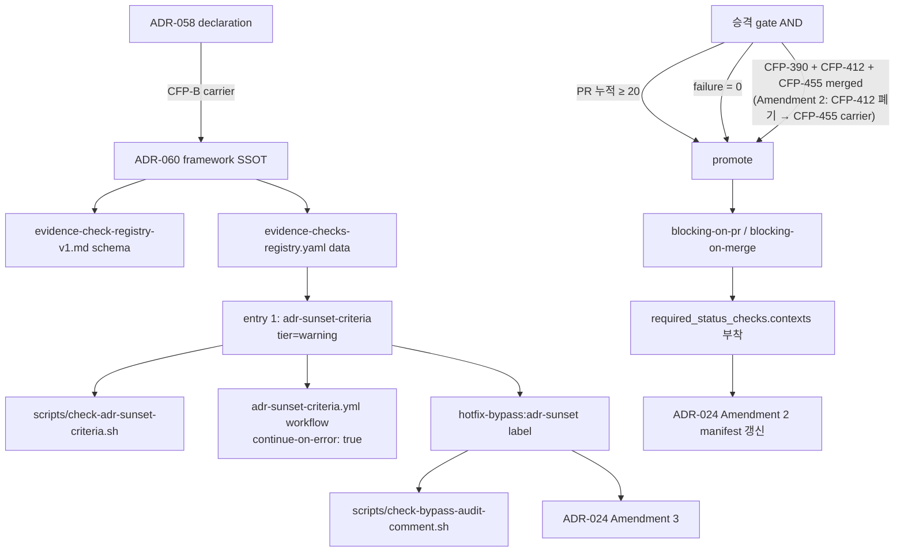

# ADR-060: Evidence-enforceable promotion framework — declaration → warning → enforce 점진 적용 SSOT

## 상태

Accepted (2026-05-11). carrier_story = CFP-389. parent Epic = CFP-388.

## 컨텍스트

ADR-058 (CFP-387, merged 2026-05-11 — internal-docs main `a59fc8a`) 가 ADR `## 해소 기준` 섹션과 `is_transitional` frontmatter 를 의무화했으나 **declaration only** 단계에 머물렀다. §결정 8 명시:

> 본 ADR 은 정책 declaration only. 기계적 강제 (CI lint) 는 CFP-B (잠정) / 정책 첫 적용 사례 (ADR-057 amendment + KPI) 는 CFP-C (잠정) / 기존 안전망 ADR retroactive backfill 은 CFP-D (잠정) 별도 carrier 분리.

본 ADR (ADR-060) 가 **CFP-B 잠정의 carrier** — declaration 의 첫 evidence-enforceable mechanical check 도입 + 모든 후속 evidence check 가 따를 **점진 적용 framework SSOT**.

### 직접 동인

1. **ADR-058 declaration 의 moral governance 한계**: 정책 선언 → 작성자 자발 준수 + DesignReview 1차 안전망 의존. CI mechanical enforcement 부재 시 ADR-057 같은 직접 동인 ADR 의 측정 기준 부재 위험이 재발.

2. **codeforge wrapper repo 의 governance 진화 패턴**: ADR-050 (parallel-epic-conflict-check.yml = warning mode prior art) / ADR-024 Amendment 2 (CFP-280 — branch protection drift detection) / ADR-041 (doc-locations.yaml SSOT) 가 모두 "선언 → 점진 enforce" 패턴 채택. 본 framework 가 패턴을 정형화.

3. **사용자 brainstorming 합의** (Opus×Codex 3-round, 2026-05-11): "안전망 측정가능 종료" 원칙 5 + "evidence-enforceable 점진 적용" 원칙 + "velocity-normalized metric" (throughput 가변 환경에서 sprint-주기 metric 회피).

4. **CFP-388 Epic 3 child Story 의 framework 정합 요구**: CFP-389 (본 framework SSOT) → CFP-390 (인벤토리 backfill = registry yaml row append) → CFP-391 (4-tier 정식 분류 amendment) 의 순차 의존. 3 Story 모두 본 framework registry 위에서 동작.

5. **Hotfix bypass channel 의 필요성**: enforce mode 진입 후 운영 장애 hotfix 가 정책 위반을 강제하는 경우, ADR-024 §결정 6 ("emergency hotfix 도 PR 경유 의무, no exception") + `enforce_admins: true` (CFP-70) 와 호환되는 **audit-trailed exception channel** 부재. 사용자 ESCALATE 결정 (CFP-389 iteration 2) = Option A — `hotfix-bypass:*` label family 도입 + ADR-024 Amendment 3 동반.

### 선행 연구 / prior art

- **Feature flag sunset (LaunchDarkly / Optimizely 운영 가이드)**: 도입 시 sunset criteria + owner + date 의무화. 측정성 3-tuple 패턴 차용.
- **입법 sunset clause 패턴**: 명시적 종료 조건 미충족 시 자동 expire. warning → enforce mode 전환 (=evidence check 의 sunset transition) 으로 변형.
- **CI/CD progressive enforcement (Spotify / Shopify code health migration 가이드)**: 신규 lint 도입 시 advisory → blocking on changed lines → blocking on full repo 3 단계 점진. 본 framework 의 4-tier 분류 (warning / blocking-on-PR / blocking-on-merge / hotfix-bypass) 의 직접 모델.
- **codeforge 내부 prior art**: ADR-050 parallel-epic-conflict-check.yml (non-blocking warning + PR comment + label) / ADR-024 Amendment 2 branch-protection-drift-check.yml (drift detection schedule + workflow_dispatch) 모두 본 framework workflow 양식의 1차 reference.

## 결정

### 결정 1 — Framework SSOT 위치 = `docs/inter-plugin-contracts/evidence-check-registry-v1.md`

evidence-enforceable framework 의 schema doc + 운영 룰 = **kind:registry** entry. 위치 = `docs/inter-plugin-contracts/evidence-check-registry-v1.md`. 분류 근거:

- ADR-058 §결정 8 의 framework declaration 을 mechanical 검증 가능한 **cross-cutting protocol** 로 변환 → kind:contract (lane plugin 간 typed schema) 아닌 kind:registry (wrapper-owned cross-cutting protocol) 정합.
- 기존 3 kind:registry (`comment-prefix-registry-v1` / `fix-event-v1` / `label-registry-v2`) 와 동일 위치 + 동일 lint chain (`check-doc-frontmatter.sh` + `check-doc-section-schema.sh`).
- `inter-plugin-contracts/MANIFEST.yaml` 의 `registries:` 블록에 entry 추가 (label_registry 패턴) — kind:contract `check-inter-plugin-contracts.sh` scope 외 (MANIFEST header `kind:contract files only` 명시 정합).

(§5.5 CL-1 — 권고 채택)

### 결정 2 — Registry data = `docs/evidence-checks-registry.yaml` (single SSOT)

본 framework 의 모든 evidence check entry 는 단일 yaml file `docs/evidence-checks-registry.yaml` 에 정의. schema 는 `evidence-check-registry-v1.md` SSOT. MANIFEST.yaml `registries:` 블록은 **versioning 추적 only** (label-registry-v1 → v2 패턴 reference, version bump 시 row append). data 자체는 yaml.

(§5.5 CL-1 추가 명시 — MANIFEST = versioning, yaml = data)

### 결정 3 — 4-tier enforcement enum (정식 도입)

evidence-checks-registry.yaml 의 각 entry 는 `current_tier` 필드 보유. enum:

| tier | 동작 | branch protection 영향 |
|---|---|---|
| `warning` | continue-on-error 또는 non-required check. PR comment / job summary 경고만. | required_status_checks.contexts 미부착 |
| `blocking-on-pr` | required check. PR merge 차단. | required_status_checks.contexts 부착 |
| `blocking-on-merge` | post-merge guard (예: phase-gate-mergeable). PR open 단계는 통과, merge 시점 차단. | required_status_checks.contexts 부착 |
| `hotfix-bypass` | bypass label 적용 PR 만 skip + audit comment 의무. label 부재 시 blocking-on-pr 등가. | required_status_checks.contexts 부착 (+ bypass workflow) |

본 ADR (CFP-389) 의 첫 entry = `warning` tier. 후속 Story (CFP-391) 가 본 enum 을 정식 명시 + 기존 entry retroactive 분류. 본 ADR 시점에서는 enum 정의만 제공, registry yaml 의 `current_tier` 필드는 optional (CFP-391 시점 required 전환 = MINOR bump).

### 결정 4 — 첫 entry = ADR sunset criteria lint (`scripts/check-adr-sunset-criteria.sh`)

evidence-checks-registry.yaml 의 첫 entry:

```yaml
- name: adr-sunset-criteria
  description: ADR-058 §결정 1-3 mechanical verification (is_transitional frontmatter + ## 해소 기준 섹션 + 측정성 3-tuple + 모달 어휘 1차 사전)
  detect_command: bash scripts/check-adr-sunset-criteria.sh
  workflow: templates/github-workflows/adr-sunset-criteria.yml
  current_tier: warning
  bypass_label: hotfix-bypass:adr-sunset
  bypass_audit_lint: bash scripts/check-bypass-audit-comment.sh
  promotion_criteria:
    pr_cumulative_min: 20
    failure_threshold: 0
    sibling_dependencies:
      - CFP-390
      - CFP-391
    evidence_artifacts:
      - github_actions_run_history_url
      - lint_failure_count_zero_proof
      - pr_cumulative_count_proof
  modal_anti_pattern_dictionary:
    version: "1.0"
    dictionary:
      - "안정화되면"
      - "임시"
      - "한시적"
      - "until further notice"
  introduced_by: CFP-389
  owner_adr: ADR-058
  carrier_adr: ADR-060
```

lint script 책임 4건 (Story §5.1 AC-4 정합):
- (a) ADR file 의 `is_transitional: true|false` frontmatter 필드 존재 검증
- (b) `## 해소 기준` 섹션 존재 검증
- (c) is_transitional=false 시 "N/A — permanent policy" 1줄 또는 동등 형식 허용
- (d) is_transitional=true 시 측정성 3-tuple (metric / who / how) 존재 검증 + 모달 어휘 1차 사전 4 표현 매치 검사

본 lint exit code = 0 (PASS) / 1 (FAIL — violation 1건 이상). bypass label 적용 PR 의 경우 workflow 가 lint 실행 자체를 skip (continue-on-error 무관, label 기반 conditional skip).

### 결정 5 — 첫 적용 = warning mode (continue-on-error)

`templates/github-workflows/adr-sunset-criteria.yml` 는 다음 양식:

- trigger: `pull_request` (opened / synchronize / reopened) — paths filter `docs/adr/**.md`
- 실행: `bash scripts/check-adr-sunset-criteria.sh <changed-ADR-files>`
- step: `pip install --user pyyaml` (default ubuntu-latest runner = python3 + pip 사전 설치, pyyaml 별도 install 의무 — lint script python yaml 의존성)
- `continue-on-error: true` 적용 → lint fail 이 PR merge 차단하지 않음
- branch protection `required_status_checks.contexts` 미부착 (ADR-024 Amendment 2 manifest 갱신 불필요)
- PR comment 자동 게시 — violation 발견 시 job summary + sticky comment 형태 (parallel-epic-conflict-check.yml 패턴 차용)
- `hotfix-bypass:adr-sunset` label 적용 PR = lint skip + audit comment 자동 발의 (별도 step)

운영 가이드 (§6.1.2 EC-B 정합):
- 첫 warning 출현 ≤ 14 days 동안 false positive ≥ 5건 발생 시 → workflow 일시 정지 (admin only) + ADR-060 §결정 보완 carrier 발의.
- solo-dev 환경 (CFP-72 reviewer count=0) → 사용자 본인 적극 체크 의무 (PR review 단계 GitHub Actions warning manual 확인).

### 결정 6 — 승격 gate (binary, AND condition)

warning → blocking-on-pr (또는 blocking-on-merge) 승격 조건 = **3 condition AND** (§5.1 AC-6 정합):

- **(a) PR 누적 ≥ 20**: ADR-060 merge 후 첫 main PR merge 일자부터 카운트 시작. `hotfix-bypass:adr-sunset` label 적용 PR 도 throughput metric 에 포함 (EC-C 정합).
- **(b) bypass label 외 failure count = 0**: warning mode 운영 기간 동안 `scripts/check-adr-sunset-criteria.sh` violation 카운트 = 0. bypass label 적용 PR 의 lint 결과 skip (failure 미카운트). 시뮬레이션 실패와 enforce failure 는 동일 의미로 통합 (별도 카운터 없음).
  - **measurement 방식**: failure count = **각 PR 의 final commit (= PR branch 의 최종 commit, merge 전략 squash/rebase/merge-commit 무관) 의 lint 결과** 기준 (PR 전체 commit history 또는 individual workflow run 누적 아님). PR 작성자가 warning manual 확인 → 다음 commit append 로 warning 해소 → PR merge 시점 final state = PASS = failure 미카운트. 정합: 운영 가이드 §결정 5 "사용자 본인 적극 체크 의무". P1-A `continue-on-error: true` × `failure_threshold=0` 잠재 deadlock 해소 — final commit 기준이면 warning mode 의 의도 (PR 진행 차단 X + final 정합 측정) 양립.
    - **final commit 정의 (merge 전략별 정합)**: GitHub PR UI 기준 PR branch 의 최종 commit (≈ `gh pr view --json commits | jq '.commits[-1].oid'` 결과). squash merge = 압축 전 PR head 기준 / rebase merge = PR head 기준 / merge-commit = PR head 기준 (생성된 merge commit 아님). main branch 의 post-merge commit 과 무관.
    - **workflow trigger 시점**: `pull_request` (synchronize / opened / reopened / labeled / unlabeled) — PR approval phase 에서만 실행. merge 후 재실행 X. 별도 post-merge lint 는 본 Story scope 외 (enforce 승격 carrier 또는 별도 carrier).
- **(c) sibling Story merged**: CFP-390 (인벤토리 backfill) + ~~CFP-391 (4-tier 정식 amendment)~~ → **CFP-412 (4-tier amendment 재예약 carrier, Amendment 1, 2026-05-11)** 모두 main merge 완료. 본 framework 가 multi-entry registry 로 운영되는 시점 정합. (see Amendment 1 — CFP-391 Issue #396 closed without delivery 2026-05-11, CFP-412 Issue #412 substitution)

승격 carrier (별도 CFP-NNN, 본 Story scope 외) 의 evidence 4 산출물 의무:
- (i) GitHub Actions 누적 run 결과 page URL (warning workflow 실행 이력)
- (ii) bypass label 외 failure count = 0 lint 출력 (gh CLI / API 결과 첨부)
- (iii) PR 누적 ≥ 20 카운트 (gh CLI / API 결과 첨부)
- (iv) **GitHub Actions outage runbook**: warning mode = `continue-on-error: true` 덕에 outage 시 PR 차단 X. enforce mode 진입 시점 = outage 발생 시 PR block / hotfix-bypass label 활용 / workflow manual disable 등 대응 절차 산출물 의무. 외부 의존 (GitHub Actions 가용성) 의 enforce mode 영향 분석 + manual fallback path 명시. (§7.4.1 DR 분석의 enforce 진입 시 후속 carrier scope.)
- (v) **Audit comment author 검증 lint 증거** (§결정 8 cross-ref): enforce 승격 carrier 가 `audit_comment_author_verification_lint` 의 실행 결과 (gh CLI / API 출력) 첨부 의무. comment author = `github-actions[bot]` 검증 lint 가 bypass label 적용 PR 의 audit comment spoofing 차단 — §7.2 STRIDE-LITE S1 강화 enforce 의무.
- (vi) **Sticky comment pattern 구현 증거** (§결정 8 cross-ref): enforce 승격 carrier 가 audit comment workflow 의 sticky pattern (기존 `[hotfix-bypass-audit]` comment update 또는 marker 기반 dedup) 도입 + 단일 PR 동일 workflow run 다회 시 at-most-once 보장 증거 (workflow yaml diff + test 출력) 첨부 의무.

본 6 산출물 부재 시 승격 carrier PR block. **자동화 카운터 인프라는 후속 carrier 책임** — 본 ADR 는 gate 정의만 제공.

### 결정 7 — Hotfix bypass channel = `hotfix-bypass:*` label family (audit-trailed exception)

운영 장애 hotfix 가 정책 위반을 강제하는 경우의 **audit-trailed exception channel**:

- **label naming**: `hotfix-bypass:<entry-name>` family. 첫 entry = `hotfix-bypass:adr-sunset` (본 Story).
- **권한자**: repo admin only. solo-dev 환경 = 사용자 본인 (mccho8865). contributor 추가 시 재논의.
- **PR 경유 의무 유지**: bypass label = lint skip only. push/merge 경로는 PR 경유 유지 — ADR-024 §결정 6 (`emergency hotfix 도 PR 경유, no exception`) + `restrictions: {users:[], teams:[], apps:[]}` (CFP-66) + `enforce_admins: true` (CFP-70) 와 호환.
- **label scope**: per-entry 한정. 본 entry (`adr-sunset`) bypass label 은 sunset criteria 관련 긴급 hotfix only. 다른 evidence check (CFP-390 인벤토리 추가) 는 자체 bypass label 정의 (registry entry `bypass_label` 필드 per-entry).
- **ADR-024 Amendment 3 동반 의무**: 본 ADR-060 §결정 7 = ADR-024 Amendment 3 (`hotfix-bypass:*` label family 가 ADR-024 §결정 6 의 audit-trailed exception channel 임을 명시) 의 carrier. Phase 1 PR 동반 (scope cohesion).
- **label-registry-v2 entry 추가**: `hotfix-bypass:adr-sunset` label = label-registry-v2 의 신규 entry. taxonomy = `bypass` tier (신규 tier 도입). label-registry MINOR bump (v2.0 → v2.1) — 별도 PR 또는 본 Phase 1 PR 동반 (ArchitectAgent 판단 — 본 Story scope 동반 권고). **본 결정은 label-registry-v2 의 `bypass` tier 신설 결정 carrier 역할 — label-registry sibling sync (ADR-010) 별도 follow-up 가능**.
- **(Amendment 3, CFP-449)** **audit 전용 채널 — 정책 회피 등록 차단 (ADR-064 §결정 5 ratchet 정합)**: `hotfix-bypass:*` label 은 운영 장애 hotfix 의 일회성 exception 통로이며, 정책 위반을 회피하는 영구 등록 채널이 아님. label 부착 PR 마다 audit comment 자동 발의 + quarterly merge audit log 집계 의무 (§결정 8 schema 정합). 사용한 entry 가 enforce 승격 carrier (별도 CFP-NNN) 진입 시 bypass label 적용 PR 누적 회수가 evidence 산출물 (`bypass_pr_count`) 검토 영역. dictionary 회피 의도 등록 시 sunset_justification 의무 (ADR-058 §결정 5 정합) — bypass channel = 운영 안전망, 정책 회피 통로 아님.

(§5.5 CL-4 RESOLVED — 사용자 Option A 채택 verbatim 반영)

### 결정 8 — Audit trail schema (P0-1 정합)

bypass label 적용 PR 마다 GitHub Actions bot 가 PR comment 1개 자동 append. comment body schema (단일 textual form, CI-parsable):

```
[hotfix-bypass-audit] PR=<number> label_applied_by=<user> reason=<bypass_reason_textbox> ADR_files=<comma-separated-paths> timestamp=<ISO8601>
```

- `PR` = PR number (정수)
- `label_applied_by` = label 적용한 GitHub user login (admin only — solo-dev = 사용자 본인)
- `reason` = PR description 내 `### Bypass reason` 섹션 textbox 본문 (workflow 가 추출, 부재 시 PR block 의무 — workflow level 검증)
- `ADR_files` = 본 PR 에서 변경된 `docs/adr/*.md` 경로 list (comma-separated)
- `timestamp` = ISO8601 UTC (Z suffix 의무 — fix-event-v1 schema clarification 정합)

**Re-entry 안전망 (EC-D 정합)**: bypass PR 의 변경 ADR 가 sunset criteria 누락 상태 (재귀 시나리오) 일 시 audit comment 에 `[sunset-criteria-deferred]` 태그 자동 추가 + 후속 보완 의무 자동 Issue 발의 (CFP-390 인벤토리 backfill scope 또는 별도 carrier).

**Audit log 집계**: bypass label 적용 PR list 가 `docs/audit/hotfix-bypass-log.md` (quarterly merge 시 자동 append) — 별도 carrier scope (CFP-390 인벤토리 또는 신규 carrier). 본 ADR 는 schema + bot comment 양식만.

**Audit assertion lint**: `scripts/check-bypass-audit-comment.sh` (본 Story Phase 2 PR 범위 내 신설 — §5.5 CL-A 권고 채택). bypass label 부착 PR 의 audit comment 1개 이상 존재 검증. 부재 시 PR block (workflow level conditional).

**Audit comment author 검증 (enforce 승격 carrier 의무)**: warning mode 단계 = 본 lint 가 comment 존재만 검증 (author = `github-actions[bot]` 검증 미수행 — advisory). enforce mode 승격 carrier (별도 CFP-NNN) 의 `evidence_artifacts` 에 `audit_comment_author_verification_lint` 항목 추가 의무 — author = `github-actions[bot]` 강화 검증 lint 신설. 수동 audit comment 위조 (PR submitter spoofing) 차단을 위한 enforce 진입 전 mandatory 조건.

**Sticky comment pattern (enforce 승격 carrier 의무)**: warning mode 단계 = audit comment automation 가 동일 PR 의 multiple workflow run 시 multiple comment 발의 가능 (at-least-once). enforce mode 승격 carrier 의 의무: sticky comment pattern 도입 (workflow 가 기존 `[hotfix-bypass-audit]` comment 1개 update 또는 marker 기반 dedup) — at-least-once → at-most-once 보장. warning mode 단계는 advisory only 정합 (Change Plan §11.6 / OpRiskArch consult 결과 acceptable).

### 결정 9 — 모달 어휘 1차 사전 = ADR-058 §결정 8 의 4 표현 only

evidence-checks-registry.yaml 의 `modal_anti_pattern_dictionary.version: "1.0"` 의 4 표현 verbatim:

- "안정화되면"
- "임시"
- "한시적"
- "until further notice"

확장 어휘 ("충분히" / "조만간" / "soon" / "TBD" 등) 는 본 Story scope 외. 별도 carrier (CFP-391 4-tier amendment 또는 신규 carrier) 가 `dictionary_version: "1.1"` 으로 MINOR bump 시 확장.

**Amendment chain SSOT 위치 (v1.1 carrier 의무)**: dictionary 확장 carrier (CFP-391 등) 가 어느 ADR 를 amendment 할지 분기:
- **추천 (default)**: **ADR-058 amendment** — ADR-058 §결정 8 이 declaration SSOT 의 owner. 4 표현 dictionary 자체는 ADR-058 원본. ADR-060 는 mechanical carrier (사전 verbatim 재인용 — 본 §결정 9 본문). v1.1 확장 = ADR-058 §결정 8 amendment N.
- **선택 (대안)**: **ADR-060 amendment** — framework SSOT (4-tier / 승격 gate / bypass channel) 자체 변경 동반 시 일체화. 단일 ADR amendment 로 처리.
- **registry yaml = version 추적 only**: `evidence-checks-registry.yaml` 의 `modal_anti_pattern_dictionary.version` field 는 추적 만 — 언어 정의 SSOT 아님. amendment chain 의 단일 진실 = ADR-058 (default) 또는 ADR-060 (대안 — framework 변경 동반 시).

**Substring → word boundary 전환 의무 (v1.1 도입 carrier)**: v1.0 시점 = substring match (예: `임시` 가 `임시저장` 부분 일치 → FAIL = false positive). 의도된 conservative direction (anti-pattern bias). v1.1 확장 어휘 도입 시점 = substring → word boundary regex 전환 의무 (한국어 morpheme-aware tokenizer 또는 `\b modal \b` ASCII fallback). false positive 누적 시 운영 가이드 (§결정 5 EC-B 14d/5건 trigger) 통한 manual disable 가능.

(§5.5 CL-5 ARCHITECT-RESOLVABLE — 4 표현 only 확정. EC-2 P0-3 ADR-058 모순 해소 verbatim.)

### 결정 10 — velocity-normalized metric (throughput 독립)

승격 gate 의 metric = "20+ PR 누적 무사고" — Story 수 / 일자 / sprint 의존 X.

근거:
- codeforge wrapper repo throughput 가변 (solo-dev, dogfood + consumer 작업 혼재).
- sprint-주기 metric (예: "2 sprint 안정 후 enforce") 은 throughput 변동 시 의도와 어긋남.
- PR 누적 = 변경 누적의 직접 신호 — false positive 검증 표본 수 보장.
- bypass label PR 도 throughput 카운트 (EC-C 정합) → bypass 빈도 자체가 throughput 의 일부, 별도 metric 분리 불필요.

### 결정 11 — Framework SSOT 자체는 영구 정책 (sunset 불가)

본 ADR (ADR-060) 자체 분류 = `is_transitional: false` (permanent policy carrier). ADR-058 §결정 6 self-defeat 회피 패턴 정합. 

본 ADR 의 효력 종료 조건 = 본 ADR 의 supersede 또는 codeforge 의 evidence-enforceable governance 자체 폐지. recursive sunset 의 무한 후행 회피.

단 본 framework 의 **개별 evidence check entry** (registry yaml row) 는 individual 하게 sunset 가능:
- warning tier 운영 중 lint script 자체가 deprecate 결정 → registry yaml row `status: deprecated` 또는 row 삭제.
- enforce mode 진입 후 framework 가 영구 운영 상태 진입 (= individual entry 의 mode transition, framework SSOT 자체 sunset 아님).

### 결정 12 — Declaration + first mechanical check 일체화 (CFP-B carrier)

본 ADR 는 ADR-058 §결정 8 의 CFP-B (잠정) carrier 역할:
- declaration (framework SSOT) + first mechanical check (ADR sunset lint) 일체 도입.
- 후속 carrier 분리:
  - **CFP-390 (인벤토리 backfill)** = registry yaml 의 추가 entry 도입 (도메인 추가).
  - **CFP-391 (4-tier 정식 amendment)** = `current_tier` 필드 required 전환 + tier enum 정식 분류 (schema MINOR bump).
  - **CFP-C 잠정 (ADR-057 amendment)** = ADR-057 sunset criteria 본문 backfill + KPI dashboard. 본 framework 위에서 운영 — 첫 적용 사례.
  - **CFP-D 잠정 (retroactive backfill)** = 기존 Active 잠재 안전망 ADR sunset criteria 본문 추가.

## 결과

### 긍정

- ADR-058 declaration 의 moral governance 단계 → mechanical enforcement 점진 진입 — framework SSOT 가 forcing function 제공.
- velocity-normalized metric 로 throughput 가변 환경 (solo-dev) 친화 + sprint-주기 회피.
- 4-tier enum 으로 향후 evidence check 도입 시 mode 표현력 확보 (warning → blocking-on-pr → blocking-on-merge → hotfix-bypass).
- hotfix bypass label 채널이 ADR-024 §결정 6 + `enforce_admins: true` 와 호환 — audit-trailed exception channel 정식 도입.
- audit trail 3중 안전망 (audit comment + audit log + audit lint assertion) 이 bypass 악용 차단 (EC-A 정합).
- kind:registry SSOT 분류로 wrapper-owned cross-cutting protocol 패턴 정합 — 기존 3 entry (`comment-prefix-registry-v1` / `fix-event-v1` / `label-registry-v2`) 와 일관성.

### 부정

- registry yaml 의 첫 entry 만 보유 (sunset criteria lint) — multi-entry 운영 시 schema 유효성은 CFP-390 / CFP-391 이후 확정.
- velocity-normalized metric "20+ PR 누적 무사고" 의 측정 자동화 인프라 미도입 — 승격 carrier 가 evidence 3 산출물 manual 제출 의무 (자동화는 별도 carrier).
- warning mode false positive 폭증 시 운영 가이드 (EC-B) 가 manual disable 의존 — admin 적극 개입 필요.
- solo-dev 환경 (CFP-72 reviewer count=0) 에서 warning mode 시각적 표시만 의존 (EC-F) — 사용자 본인 적극 체크 의무.
- audit log quarterly merge 자동화 부재 (별도 carrier) — 본 Story 는 schema + bot comment 양식만.
- ADR-024 Amendment 3 동반으로 governance ADR 변경 surface 확대 (label-registry MINOR bump 동반 시).

### Trade-off

- **declaration vs enforcement 단계 분리 (ADR-058 §결정 8 패턴)**: 한 Story 에서 declaration + enforcement + retroactive backfill 일체 도입 시 risk 분산 부족 + review burden 폭증. 본 ADR 는 declaration + first mechanical check 일체화, 후속 (CFP-390 / CFP-391) 가 incremental 확장 — 단계 분리의 cost (multi-Story 의존) vs visibility (각 Story 의 결정 surface 명확화) trade-off 에서 visibility 우선.
- **warning vs blocking 첫 도입 mode**: blocking 즉시 도입 시 mechanical enforcement 효과 즉시 발현 / false positive 영향 즉시 발현. warning 시작 + 승격 gate (= ADR-050 prior art 패턴) 채택 — 효과 지연 vs false positive risk mitigation 의 trade-off 에서 위험 회피 우선.
- **bypass label per-entry vs global**: 단일 global bypass label (e.g., `evidence-bypass:*`) 도입 시 사용 단순 / 악용 위험 확대. per-entry (`hotfix-bypass:adr-sunset` 등) → namespace 분리 + 권한 분리 가능 — 사용 복잡도 vs scope 통제 trade-off 에서 통제 우선.

## 대안

### 대안 B (거부) — bypass label 미도입

bypass 채널 부재 → 운영 장애 hotfix 시 ADR-024 `enforce_admins: true` + required check 통과 의무 = deadlock. 직접 push 금지 + bypass 부재 = hotfix 불가능. **거부 사유**: 실운영 시 deadlock 위험 + ADR-024 §결정 6 (emergency hotfix 도 PR 경유 의무) 가 hotfix 채널 자체 부정 아님 — bypass channel 정식 도입 = §결정 6 정합 + audit-trailed 보장.

### 대안 C (거부) — warning mode 영구 (enforce 미승격)

declaration → warning 까지만 도입, enforce mode 영구 미도입. **거부 사유**: warning mode = continue-on-error → mechanical enforcement 실효성 부재. ADR-058 declaration 의 moral governance 단계와 본질적으로 동일 — 점진 적용 의도 미충족. 승격 gate 정의 + 자동 승격 carrier path 가 framework 의 핵심.

### 대안 D (거부) — sprint-주기 metric (예: "2 sprint 안정")

sprint 주기 기반 promotion gate. **거부 사유**: codeforge wrapper repo throughput 가변 (solo-dev). sprint 정의 자체 모호 (별도 governance 부재). PR 누적 = 변경 누적의 직접 신호 + throughput 독립 — velocity-normalized 우위.

### 대안 E (거부) — 단일 global bypass label

`evidence-bypass:*` 단일 label 모든 evidence check skip 가능. **거부 사유**: scope 통제 부재 → 한 entry hotfix 가 모든 entry bypass 우회 위험. per-entry namespace 분리 + 권한 분리 (registry entry `bypass_label` 필드) 우위.

## 다이어그램



## 해소 기준

N/A — permanent policy. 본 ADR 은 `is_transitional: false` (permanent policy carrier — framework SSOT). §결정 11 self-defeat 회피.

단 본 framework 의 **개별 evidence check entry** 는 individual sunset 가능 — entry level 의 mode transition (warning → enforce) 은 framework 운영의 정상 동작이며 framework SSOT 자체 sunset 이 아님.

## 관련 파일

- `docs/inter-plugin-contracts/evidence-check-registry-v1.md` — framework SSOT (kind:registry schema doc, 결정 1)
- `docs/inter-plugin-contracts/MANIFEST.yaml` — `registries:` 블록 entry 추가 (결정 1)
- `docs/evidence-checks-registry.yaml` — registry data, 첫 entry = adr-sunset-criteria (결정 2 + 결정 4)
- `docs/doc-locations.yaml` — 신규 doc type `evidence_check_registry` row 추가 (ADR-041 §결정 정합, §5.5 CL-2)
- `docs/parallel-work/section-ownership.yaml` — 신규 entry: `evidence-checks-registry.yaml` parallel_edit=append-only (ADR-050 정합)
- `scripts/check-adr-sunset-criteria.sh` — lint 첫 구체 (결정 4)
- `scripts/check-bypass-audit-comment.sh` — audit assertion lint (결정 8)
- `templates/github-workflows/adr-sunset-criteria.yml` — warning mode workflow (결정 5)
- `docs/adr/ADR-024-story-scoped-branch-policy.md` — Amendment 3 동반 (결정 7)
- `CLAUDE.md` — 3 섹션 갱신 (ADR / GitHub Workflow / Inter-plugin Contract)
- `docs/adr/ADR-RESERVATION.md` — ADR-060 row reserved (CFP-389, 2026-05-11)
- 후속 carrier:
  - CFP-390 (인벤토리 backfill — registry yaml row append, ADR-060 **Amendment 1 carrier — 이미 발효**)
  - **CFP-391 (Issue #396, 2026-05-11 closed without delivery — 폐기 처리)** → **CFP-412 (Issue #412, 재예약 carrier)** 가 4-tier 정식 amendment 책임 (ADR-060 Amendment 2 + schema v1.0 → v1.1 MINOR bump)
  - **CFP-TBD (메타 anomaly lint carrier — Amendment 1 §결정 14 명시 의무, Codex P2-B 정합)**: 인벤토리 누락 시 anomaly 감지 메타 lint (`scripts/check-evidence-registry.sh` 또는 동등) 발의. CFP-390 Phase 1 PR merge 후 별도 CFP/Issue 발의.
  - CFP-C 잠정 (ADR-057 amendment + KPI dashboard — 첫 적용 사례)
  - CFP-D 잠정 (retroactive backfill — 기존 안전망 ADR sunset criteria 본문 추가)

## Amendment 1 (CFP-390, 2026-05-11)

본 Amendment 는 CFP-390 (인벤토리 backfill, Issue #395) 의 Phase 1 carrier 산출물.

ADR-060 framework SSOT 의 4 정정:

### Amendment 1-결정 6 (c) 정정 — `sibling_dependencies` CFP-391 → CFP-412 verbatim 정정

본 ADR §결정 6 (c) `sibling_dependencies` 의 의미 = warning → enforce 승격 전 main merge 의무 sibling Story. 원본 항목 `CFP-391` (Issue #396, 4-tier 정식 amendment 예상 carrier) 는 2026-05-11 시점 **closed without delivery** (Issue #396 close, 4-tier amendment 작업 미실행). 후속 carrier 재예약 = **CFP-412** (Issue #412 — 4-tier amendment 재예약 carrier).

따라서 `docs/evidence-checks-registry.yaml` 의 `entries[name=adr-sunset-criteria].promotion_criteria.sibling_dependencies` 다음과 같이 정정 의무 (본 Amendment 1 carrier PR 동반):

```yaml
sibling_dependencies:            # ADR-060 §결정 6 (c) — Amendment 1 정정
  - CFP-390  # 인벤토리 backfill — 본 Amendment 1 carrier (이미 발효)
  - CFP-412  # 4-tier amendment 재예약 carrier (CFP-391 #396 폐기 처리)
```

### Amendment 1-결정 12 정정 — 후속 carrier 목록 정정

본 ADR §결정 12 의 후속 carrier 목록 4 항목 중 CFP-391 항목 정정:

- **CFP-391 (4-tier 정식 amendment)** (원본 표기) →
- **CFP-391 (Issue #396 closed without delivery, 2026-05-11) → CFP-412 (Issue #412) 가 4-tier 정식 amendment carrier 재예약** (`current_tier` required 전환 + tier enum 정식 분류 + schema v1.0 → v1.1 MINOR bump)

본 정정은 ADR-058 §결정 9 amendment chain 정책 (framework SSOT 변경 동반 시 framework ADR amendment 정합) 정합. 4-tier amendment 자체는 framework SSOT 의 schema field semantic 변경 (`current_tier` optional → required) 동반 → ADR-060 amendment 가 정합 carrier.

### Amendment 1-결정 13 (신설) — 인벤토리 backfill SSOT (18 entry 그룹 A 등록 — FIX iter 1 정정 후)

> **Scope 한정**: 본 표는 CFP-389 / CFP-390 작업 시점 "기존 ad-hoc evidence check" 인벤토리만 포함. 후속 framework entry (예: CFP-393 가 추가한 `rate-limit-fallback-rate`) 는 표 scope 외 — 각 carrier ADR / Story 가 자체 registry row 등록을 책임진다.

본 CFP-390 = ADR-060 framework 의 첫 multi-entry registry 운영 진입. CodebaseMapper SubAgent perspective 통합 정밀 verify (scripts/check-*.sh 33개 + .github/workflows/ 20개 + templates/github-workflows/ 24개 전수 inspect) 결과 4-criteria (detect_command + workflow + owner_adr/contract + tier signal) PASS entry 18개 그룹 A 등록 (Codex Proactive Check #2/#6 FIND-3 정정 후 — owner_adr 정합 ADR/contract 명확 entry 만).

**Scope split 명시 (FIND-2 정정)**:
- **Phase 1 PR (본 carrier) = SSOT 만**: 본 §결정 13 표 + 그룹 B/C 분류 + sibling_dependencies field substitution (CFP-391 → CFP-412) + CLAUDE.md cross-ref. registry yaml 의 실제 row append 는 **수행하지 않음**.
- **Phase 2 PR scope = 본 §결정 13 표의 18 entry 실제 row append**: `docs/evidence-checks-registry.yaml` 의 schema v1.0 정합 row 작성. doc-only fast-path 적용 가능성 ArchitectAgent / DeveloperPL 후속 판단 (ADR-054 정합, 모호 시 full-lane).
- **tier 재계산 (FIND-4 정정)**: 실제 `templates/branch-protection-manifest.yaml` 부착 entry 만 `blocking-on-pr` / `blocking-on-merge` 분류. 미부착 entry = `warning` 일괄 하향. manifest 부착 = 2 entry (invariant-check / phase-gate-mergeable). doc-frontmatter-schema / doc-section-schema 는 manifest 부착 (row 3/4) 이나 owner_adr 모호로 FIND-3 그룹 B 강등.

**그룹 A — 18 entry SSOT (Phase 2 PR row append target)**:

| # | name | detect_command | workflow | owner_adr/contract | tier (final) |
|---|---|---|---|---|---|
| 1 | `lane-evidence-trail` | `bash scripts/check-lane-evidence.sh` | `.github/workflows/lane-evidence-check.yml` | ADR-031 §결정 3 + fix-event-v1 | `warning` (manifest 미부착) |
| 2 | `doc-locations-registry` | `bash scripts/check-doc-locations.sh --full` | `.github/workflows/doc-locations-check.yml` | ADR-041 | `warning` (manifest 미부착 — CLAUDE.md "5번째" narrative 와 drift, 별도 Issue 권고) |
| 3 | `marketplace-parity` | `bash scripts/check-marketplace-parity.sh` | `.github/workflows/marketplace-parity.yml` | ADR-016 / ADR-023 §결정 5 | `warning` |
| 4 | `invariant-check` | (workflow inline — 5 invariant 직접) | `.github/workflows/invariant-check.yml` | ADR-002 (footer pattern) + 다중 CFP (5/7/8/10) | `blocking-on-pr` (branch-protection-manifest row 2) |
| 5 | `phase-gate-mergeable` | (workflow inline — cross-repo Story fetch) | `.github/workflows/phase-gate-mergeable.yml` | ADR-031 §결정 3 + label-registry-v2 | `blocking-on-merge` (branch-protection-manifest row 1, dynamic checks.create) |
| 6 | `inter-plugin-contracts` | `bash scripts/check-inter-plugin-contracts.sh` | `.github/workflows/contract-lint.yml` job:`inter-plugin-contracts` | ADR-008 / ADR-010 / MANIFEST.yaml | `warning` |
| 7 | `inter-plugin-drift` | `bash scripts/check-inter-plugin-drift.sh` | `.github/workflows/contract-lint.yml` job:`inter-plugin-drift` | ADR-011 | `warning` |
| 8 | `comment-prefix-registry` | `bash scripts/check-comment-prefix.sh` | `.github/workflows/contract-lint.yml` job:`comment-prefix-registry` | comment-prefix-registry-v1 (kind:registry) | `warning` |
| 9 | `label-registry-sync` | `bash scripts/check-label-registry.sh` | `.github/workflows/contract-lint.yml` job:`label-registry-sync` | label-registry-v2 (kind:registry) | `warning` |
| 10 | ~~`marketplace-sync`~~ (retired CFP-457) | ~~`bash scripts/check-marketplace-sync.sh`~~ | ~~`.github/workflows/contract-lint.yml` job:`marketplace-sync`~~ | ~~ADR-016~~ | ~~`warning`~~ — see entry #5 `marketplace-parity` (CFP-50 / ADR-023) for SSOT |
| 11 | `dogfood-artifact-paths` | `bash scripts/check-dogfood-artifact-paths.sh` | `.github/workflows/dogfood-artifact-paths.yml` | ADR-013 / ADR-017 | `warning` |
| 12 | `superpowers-integration` | `bash scripts/check-superpowers-integration.sh` | `.github/workflows/superpowers-integration.yml` | ADR-028 / CFP-113 | `warning` |
| 13 | `superpowers-schema-drift` | `bash scripts/check-superpowers-schema-drift.sh` | `.github/workflows/superpowers-schema-drift.yml` | ADR-028 / CFP-121 | `warning` (scheduled quarterly + PR:paths) |
| 14 | `parallel-epic-conflict` | (workflow inline — PR file 교집합) | `.github/workflows/parallel-epic-conflict-check.yml` | ADR-050 | `warning` (continue-on-error prior art) |
| 15 | `branch-protection-drift` | (workflow inline — gh api + manifest diff) | `.github/workflows/branch-protection-drift-check.yml` | ADR-024 Amendment 2 | `warning` (weekly Mon 09:00 UTC cron) |
| 16 | `required-workflow-drift` | (workflow inline + `check-enterprise-admin.sh`) | `.github/workflows/required-workflow-drift-check.yml` | ADR-048 §결정 3 | `warning` (weekly Mon 10:00 UTC cron) |
| 17 | `rulesets-drift` | (workflow inline + `check-enterprise-admin.sh`) | `.github/workflows/rulesets-drift-check.yml` | ADR-048 §결정 1 | `warning` (daily 09:00 UTC cron) |
| 18 | `write-permission-redistribution` | `bash scripts/check-write-permission-redistribution.sh` | `.github/workflows/lint.yml` job:`write-permission-redistribution` | CFP-26 / ADR-009 (write 권한 invariant) | `warning` |

**tier 최종 분포**: `blocking-on-merge` 1 (phase-gate-mergeable) + `blocking-on-pr` 1 (invariant-check) + `warning` 16. manifest 부착 entry 만 blocking 분류.

**그룹 B — 보류 (별도 carrier 책임, 14 entry — FIND-3 강등 8 + 기존 6)**:

| name | 미충족 / 모호 | 처리 |
|---|---|---|
| `story-section-schema` | (c) **owner_adr 정합 ADR 미존재** — CFP-91 / CFP-94 비-ADR (FIND-3 강등) | 등록 보류 — CFP-412 schema v1.1 또는 별도 carrier 가 `owner_adr=null` 또는 `owner_contract` enum 도입 후 등록 |
| `doc-frontmatter-schema` | (c) **owner_adr 정합 ADR 미존재** — CFP-28 비-ADR (FIND-3 강등, manifest row 3 부착이나 owner_adr governance integrity 약함) | 동일 — schema v1.1 owner_adr=null 도입 후 등록 + 부착된 manifest row 와 tier 정합 별도 검토 |
| `doc-section-schema` | (c) **owner_adr 정합 ADR 미존재** — CFP-28 비-ADR (FIND-3 강등, manifest row 4 부착이나 owner_adr governance integrity 약함) | 동일 |
| `workflow-yaml-syntax` | (c) **owner_adr 정합 ADR 미존재** — CFP-34 비-ADR (FIND-3 강등) | 동일 |
| `consumer-scripts-manifest` | (c) **owner_adr 정합 ADR 미존재** — CFP-109 비-ADR (FIND-3 강등) | 동일 |
| `script-exec-bit` | (c) **owner_adr 정합 ADR 미존재** — CFP-74 invariant 비-ADR (FIND-3 강등) | 동일 |
| `markdown-internal-links` | (c) **owner_adr 정합 ADR 미존재** — CFP 미명시 (FIND-3 강등) | 동일 |
| `agent-frontmatter` | (c) ADR-042 = agent **model selection** policy 이지 agent frontmatter contract 의 owner 아님 — owner_adr 정합 ADR 미존재 (FIND-3 강등) | 동일 |
| `check-fix-evidence` | (b) workflow trigger 부재 (CFP-298 carrier 책임 — wrapper repo 미배치 가능성) | 등록 보류 — Phase 2 또는 별도 carrier 에서 workflow 도입 후 등록 |
| `check-no-atlassian` | (c) owner_adr 부재 (meta-governance) BUT detect_command 보유. workflow trigger 명확치 않음 | 등록 보류 — owner_adr 도입 후속 carrier 발의 권고 |
| `check-container-strategy` | (c) ADR-033 명확 BUT (b) workflow trigger 부재 — `container-image-scan.yml` consumer-only | 등록 보류 — consumer-only entry 분류 정책 명확화 후 |
| `check-domain-knowledge-schema` | (b) workflow trigger 명확치 않음 | 등록 보류 — workflow trigger 검증 후 |
| `check-review-verdict-v4` | (b) workflow trigger 명확치 않음 | 등록 보류 — workflow trigger 추가 도입 후 (CFP-137 후속) |
| `check-team-spec-schema` | (b) workflow trigger 명확치 않음 | 등록 보류 — workflow trigger 추가 도입 후 (CFP-137 후속) |

**그룹 C — 등록 제외 (4-criteria 미충족 / consumer-only / sub-utility)**:

- `check-codeforge-version-drift` — workflow 부재 (session-start CLI script, CLAUDE.md 세션 개시 의무 0번)
- `check-enterprise-admin` — sub-utility (rulesets-drift-check + required-workflow-drift-check 의 step, 단독 workflow 없음)
- `check-debut-audit-signals` / `check-debut-readiness` — consumer-specific (ADR-021 mctrader debut audit, wrapper governance scope 외)
- `check-doc-links` — `markdown-internal-links` (lint.yml inline) 와 중복
- bootstrap-*.sh / test-*.sh (30+) / audit-trail-fetch.sh / next-phase.sh / migrate-*.sh / post-merge-*.sh / sync-*.sh / retro-retry-helper.sh / check-lint.sh — not lint / helper / migration
- consumer-only workflow: live-test-guard.yml / live-deploy-approval.yml / live-secret-policy.yml / kill-switch-integration-test.yml / story-init.yml / story-section-1-immutable.yml / fix-ledger-sync.yml / subissue-from-impl-manifest.yml / reservation-cleanup.yml / check-plugin-version-bump.yml / container-image-scan.yml / retro-mandatory.yml / test.yml (CONSUMER_ONLY_WORKFLOWS 명시, invariant-check.yml SSOT)

본 그룹 A **18 entry** (FIX iter 1 정정 후 — owner_adr 정합 ADR/contract 명확 entry 만, 8 entry 그룹 B 강등) 의 registry yaml row append 는 **CFP-390 Phase 2 PR scope** (본 Amendment 1 = Phase 1 ADR 갱신 + 후속 carrier 정정 + 인벤토리 SSOT 확정). Phase 2 PR 진행 여부 = doc-only fast-path 가능성 ArchitectAgent / DeveloperPL 판단 (ADR-054 모호 시 full-lane).

### Amendment 1-결정 14 (신설) — 메타 anomaly lint 후속 carrier 의무 명시 (Codex P2-B 정합)

본 CFP-390 인벤토리 backfill = manual sweep. 후속 신규 evidence-enforceable 패턴 (script + workflow) 도입 시 registry 등록 누락 = governance drift 위험. Codex Proactive Check #4 P2-B (사전 수렴 시점 raised) finding 정합 — 본 Amendment 1 가 메타 anomaly lint 후속 carrier 의무 명시:

- **carrier 발의 의무**: CFP-390 Phase 1 PR merge 후 별도 CFP/Issue 발의. 본 Story scope 외.
- **carrier scope**: `scripts/check-evidence-registry.sh` (또는 동등) 신설 — registry yaml 미등록 신규 evidence-enforceable 패턴 (예: 신규 `.github/workflows/*.yml` + `scripts/check-*.sh` 동반 도입 PR) 자동 발견 lint.
- **trigger 추정**: `.github/workflows/evidence-registry-anomaly.yml` (pull_request:paths) — script/workflow file 변경 시 registry yaml 등록 누락 lint.
- **tier 추정**: `warning` (false positive 위험 — 새 lint script 가 production 정합 의제로 즉시 인식 부담).
- **owner_adr 후보**: ADR-060 (본 framework SSOT — meta lint 가 framework 의 안전망 강화 측면).

본 carrier 부재 시 = manual inventory sweep 정합 유지 (반복 CFP 비용). 본 Amendment 14 명시 = CFP-390 retro (§11) 의 reminder 1 항목 + 후속 발의 의무 SSOT 화.

## Amendment 2 (CFP-455, 2026-05-12)

본 Amendment 는 CFP-455 (4-tier enforcement 분류 정식화, Issue #455) 의 Phase 1 carrier 산출물. CFP-391 (Issue #396, closed without delivery 2026-05-11) / CFP-412 (Issue #412, post-merge-followup workflow false-positive close 2026-05-11) 의 재재예약 carrier — 4-tier amendment 정식 deliver.

### Amendment 2-결정 3 (변경) — `current_tier` 필드 optional → required 전환 명시

본 ADR §결정 3 의 4-tier enum 본문 "본 ADR (CFP-389) 의 첫 entry = `warning` tier. 후속 Story (CFP-391) 가 본 enum 을 정식 명시 + 기존 entry retroactive 분류. 본 ADR 시점에서는 enum 정의만 제공, registry yaml 의 `current_tier` 필드는 optional (CFP-391 시점 required 전환 = MINOR bump)." → **본 CFP-455 (4-tier 정식 amendment carrier, CFP-391 #396 / CFP-412 #412 폐기 후 재예약) 가 `current_tier` 필드 optional → required 전환을 정식 deliver**. schema doc `docs/inter-plugin-contracts/evidence-check-registry-v1.md` v1.0 → v1.1 MINOR bump 동반 + registry yaml `schema_version: "1.0"` → `"1.1"` header 갱신 동반.

**retroactive 분류 검증 의무**: 본 Amendment 2 시점 = 22/22 entry 모두 현행 `current_tier` 보유 verified (CodebaseMapper SubAgent perspective 정밀 verify, 2026-05-12). mechanical regression 0건 — 신규 메타 lint (`scripts/check-evidence-registry.sh`, Phase 2 PR scope) 가 schema 정합 mechanical 강제.

### Amendment 2-결정 6 (c) 정정 — `sibling_dependencies` field back-substitution (append)

본 ADR §결정 6 (c) 의 `sibling_dependencies` 의미 = warning → enforce 승격 전 main merge 의무 sibling Story. Amendment 1 시점 = `[CFP-390, CFP-412]` (CFP-391 → CFP-412 정정). CFP-412 Issue #412 도 closed without delivery (2026-05-11T15:41:42Z, post-merge-followup workflow false-positive close — PR #421 = CFP-393 rate-limit-fallback 작업, "Closes #412" reference 없음) — 4-tier amendment 0 commits. 본 Amendment 2 의 결정:

```yaml
sibling_dependencies:            # ADR-060 §결정 6 (c) — Amendment 2 정정 (CFP-455)
  - CFP-390  # 인벤토리 backfill — 본 Amendment 1 carrier (이미 발효)
  - CFP-412  # 4-tier amendment 재예약 carrier (CFP-391 #396 폐기 처리) — Amendment 1 정정 / CFP-412 자체도 #412 closed without delivery
  - CFP-455  # 4-tier 정식 amendment carrier (재재예약) — 본 Amendment 2 deliver
```

**append 결정 근거** (DataMigrationArch SubAgent + RequirementsPL Q2 권고 verbatim 채택):
- CFP-412 의 폐기 history 가 registry yaml 에서 visible 보존 (replace 시 invisible 위험).
- sibling 의도 ("4-tier amendment 가 main merge 의무") 보존 — append 로 chain 가시화.
- 폐기 carrier 의 trail 이 framework SSOT 의 governance integrity 강화.

### Amendment 2-결정 14 (정정) — 메타 anomaly lint 와 메타 schema validation lint 분리 (별도 entry 2종)

Amendment 1 §결정 14 의 메타 anomaly lint (인벤토리 누락 감지) 와 본 Amendment 2 가 도입 명시하는 메타 schema validation lint (`scripts/check-evidence-registry.sh`, 본 Story Phase 2 PR scope) 는 **scope 가 다른 별도 lint 2종**:

| lint | scope | trigger | tier |
|---|---|---|---|
| **메타 schema validation** (본 Story 도입) | registry yaml 자체 schema/일관성 검증 — 6 검증 (schema_version / entry required field / current_tier enum / bypass pair / name uniq / owner_adr+carrier_adr ADR file cross-ref) | `pull_request:paths` (registry yaml + contract md + lint script 변경 시) | `warning` (continue-on-error) |
| **메타 anomaly detection** (§결정 14 후속 carrier, 본 Story scope 외) | registry yaml 미등록 신규 evidence-enforceable 패턴 자동 발견 (신규 `.github/workflows/*.yml` + `scripts/check-*.sh` 동반 도입 PR) | `pull_request:paths` (workflows + scripts 변경 시) | `warning` (false positive 위험) |

**분리 근거** (RequirementsPL Q6 권고 verbatim 채택): 통합 시 lint script 복잡도 증가 + trigger paths 모호. 분리 시 각자 carrier 별도 (메타 schema validation = 본 Story CFP-455 / 메타 anomaly = §결정 14 후속 carrier).

### Amendment 2-결정 15 (신설) — 메타 lint exit-code 3-tier semantics (Codex AREA 1 정합)

`scripts/check-evidence-registry.sh` (Phase 2 PR scope) 의 exit code 의미:

| exit code | 의미 | 처리 |
|---|---|---|
| **0** | PASS — 모든 검증 통과 | normal continuation |
| **1** | validation FAIL — 1+ entry 가 schema 위반 (current_tier 부재 / enum 외 값 / bypass pair 위반 / name 중복 / owner_adr+carrier_adr ADR file 부재 등) | warning mode = continue-on-error (PR merge 가능) / blocking mode 승격 시 PR block |
| **2** | meta-error — tooling 오류 (yaml 파싱 실패 / pyyaml 미설치 / registry yaml 자체 file 부재 / ADR file glob unreadable 등) | warning / blocking 무관 = 명확한 error message 출력 + workflow job step fail (lint logic 실행 불가 상황 분리 명시) |

**근거**: validation FAIL 과 meta-error 의 semantic 분리 — meta-error 가 false-positive validation FAIL 로 위장되면 운영 신뢰도 추적 (ADR-060 §결정 5 EC-B 14d/5건 trigger) 가 왜곡. 3-tier semantics 도입 = false positive rate 측정의 무결성 보장.

### Amendment 2-결정 16 (신설) — warning-tier bypass_label policy (Codex AREA 2 (a) 정합)

본 ADR §결정 7 의 `bypass_label` 정책 명세화:

- **warning tier** = continue-on-error / non-blocking. bypass_label 적용은 의미 부적용 (skip 의미 없음 — 이미 PR block X). → `bypass_label` field = **optional** (omit 권고).
- **blocking-on-pr / blocking-on-merge / hotfix-bypass tier** = required check. bypass_label 의무 분리:
  - `blocking-on-pr` / `blocking-on-merge` = bypass_label optional (운영 장애 hotfix 시 도입 가능, 미도입 시 emergency-channel 부재 risk 분리 평가).
  - `hotfix-bypass` = bypass_label **required** (정의상 bypass channel SSOT).

**본 Story 의 메타 lint self-application entry** (Phase 2 PR scope) = warning tier → bypass_label omit. 정합: SecurityArch SubAgent spoofing 차단 invariant 강화 (bypass field 의 잘못된 의미 부여 회피).

### Amendment 2-결정 17 (신설) — Retroactive reclassification failure handling (Codex AREA 2 (b) 정합)

본 Amendment 2 의 `current_tier` required 전환 시점 = 22/22 entry 모두 현행 `current_tier` 보유 verified (CodebaseMapper SubAgent 정밀 verify). 단 future drift / human error 로 enum membership 위반 발견 시 (예: 신규 entry 가 `current_tier: hard_block` 사용자 alias 주입, registry yaml 의 retroactive corruption):

- **처리**: `scripts/check-evidence-registry.sh` exit 1 (validation FAIL) + PR block (blocking mode 승격 시) — **immediate fail**.
- **근거**: required tier 도입 의의 정합 — schema 정합 mechanical 강제가 framework SSOT 의 핵심. tolerant mode (warning continuation) 도입 시 required 의 mechanical 효력 무력화.
- **본 Story 단계 (warning mode)** = continue-on-error → PR merge 가능 but lint output 의 violation 명확 표시 + 운영 가이드 ADR-060 §결정 5 EC-B 14d/5건 trigger 적용. 실제 PR block 효과는 promotion carrier 시점 (별도 CFP-NNN, evidence 6 산출물 제출 시).

### Amendment 2-결정 18 (신설) — Marketplace/sibling sync necessity 명시 (Codex AREA 2 (c) 정합)

본 Amendment 2 의 schema v1.0 → v1.1 MINOR bump 시 sibling sync 의무 분석:

- **registry yaml** (`docs/evidence-checks-registry.yaml`) = wrapper-owned cross-cutting protocol (kind:registry, ADR-010 scope 외 = sibling sync 불필요).
- **schema doc** (`docs/inter-plugin-contracts/evidence-check-registry-v1.md`) = wrapper-owned canonical (ADR-010 scope 외 = sibling sync 불필요).
- **MANIFEST.yaml** = wrapper-owned cross-cutting registry list (sibling sync 불필요).
- **marketplace.json mirrored field sync**: schema v1.1 bump 동반 plugin.json MINOR bump (5.18.0 → 5.19.0, ADR-037 정합 — CFP-500 이 main 에서 5.18.0 차지 후 rebase 시 5.19.0 으로 re-bump) → ADR-063 §결정 1 atomic invariant (plugin.json + CHANGELOG.md + marketplace.json 동시 처리) 발효 → marketplace sync PR **의무** (별도 PR, codeforge PR merge 후 즉시 open·merge — ADR-063 §결정 2 chicken-and-egg 회피).

**정리**: kind:registry schema 변경 자체는 sibling sync 불필요 (Codex AREA 2 (c) 권고 정합). 단 plugin version MINOR bump 동반 시 marketplace.json mirrored field sync 가 ADR-063 invariant 로 의무. 본 Story Phase 2 PR (또는 Phase 1 PR) 의 plugin.json MINOR bump 와 같은 PR 안 처리.

### §결정 19 (Amendment 6, CFP-509 — 2026-05-13)

**Recurrence-based advisory promotion signal**: evidence-check-registry schema v1.2 의 `recurrence:` field 가 machine-usable recurrence metric 제공. `recurrence.count ≥ recurrence.threshold` 도달 시:

- **advisory mode** (기본): `recurrence.promotion_trigger: advisory` — PR comment 만 (warning tier 유지, blocking transition 없음). `[recurrence-threshold-reached]` marker 자동 발화.
- **auto_blocking mode**: `recurrence.promotion_trigger: auto_blocking` — 별도 carrier Story 가 actual `current_tier: warning → blocking-on-pr` 승격 평가 의무 (자동 transition 아님 — governance 보존).
- **none mode** (default): `recurrence.count` 누적만, advisory / blocking 모두 미발화.

본 §결정 = §결정 6 (warning → blocking 승격 gate) 의 supplementary signal — 기존 3 condition (pr_cumulative_min / failure_threshold / sibling_dependencies) 와 OR 관계 아님 (additional advisory). actual transition 은 여전히 별도 carrier 의무.

**CFP-490 lane-evidence-trail entry description-only `recurrence_count` 의 schema 흡수**: CFP-500 FIX-5 + CFP-451 transient 2회 historical evidence (description body 영역) → `recurrence.count: 2` schema-level 정식 표기. machine-usable 전환.

### Mermaid 다이어그램 동기화 (Amendment 2 — Codex AREA 4 정합)

본 ADR `## 다이어그램` Mermaid 의 `K -->|"CFP-390 + CFP-412 merged<br/>(Amendment 1: CFP-391 폐기 → CFP-412)"|` row 갱신 의무 (Amendment 2 시점 CFP-412 도 폐기 → CFP-455 carrier append):

본 Amendment 2 carrier PR 안에서 `## 다이어그램` 본문의 해당 row 를 `K -->|"CFP-390 + CFP-412 + CFP-455 merged<br/>(Amendment 2: CFP-412 폐기 → CFP-455 carrier)"|` 으로 갱신 (carrier PR 본 §결정 동반 직접 edit). Mermaid stale 차단 — diagram 이 §결정 6 (c) sibling_dependencies 의 SSOT 와 verbatim 정합.

## Amendment 7 (CFP-508, 2026-05-13)

본 Amendment 는 CFP-508 (evidence-registry-naming convention lint, Issue #508) 의 Phase 1 carrier 산출물. CFP-490 FU-2 carrier.

### §결정 20 (Amendment 7, CFP-508 — 2026-05-13)

**Entry name ↔ workflow file naming convention**: evidence-checks-registry entry 의 `name` field 와 `workflow:` field 의 file basename 자연스러운 divergence 허용 — multi-job workflow pattern 인정:

- **EXACT match (default)**: entry name = workflow basename (`.yml` 제외). 권장 패턴.
- **partial match**: entry name 이 workflow basename 의 substring 또는 vice versa. 자연스러운 변형 (e.g., `carrier-bootstrap` ↔ `carrier-bootstrap-check`). 허용.
- **multi-job pattern**: 단일 workflow file 안 여러 job 이 별개 evidence-check entry 로 등록 (e.g., `contract-lint.yml` 안 `inter-plugin-contracts` / `inter-plugin-drift` / `comment-prefix-registry` / `label-registry-sync` jobs). registry entry name = workflow job name (workflow file basename 과 무관). 허용.
- **Conservative no-rename policy**: 기존 entry 에 대한 workflow rename 금지 — CI history + branch protection `required_status_checks.contexts` 영향 회피. 신규 entry 도입 시만 EXACT match 권장.

**Lint enforcement** (`scripts/check-evidence-registry-naming.sh`):
- workflow file 존재 검증 의무 (templates/ 기준 file path 실제 존재).
- DRIFT (no match) entry = allowlist hardcode 의무 (별도 file rename 필요 시 후속 carrier Story).
- `github-actions-runtime` detect_command entry 는 workflow file 존재만 검증 (job name 무관).
- `Retired` status entry skip.
- Exit code 3-tier (ADR-060 Amendment 2 §결정 15): 0 PASS / 1 violation (workflow file 부재 OR allowlist 밖 DRIFT) / 2 meta-error (yaml parse 실패 / python3 미설치 등).

**DRIFT allowlist 10건** (CFP-508 audit 결과 — Conservative no-rename policy 첫 적용):

| entry name | workflow basename | pattern |
|---|---|---|
| `rate-limit-fallback-rate` | `rate-limit-fallback-kpi.yml` | basename divergence (rate vs kpi) |
| `lane-evidence-trail` | `lane-evidence-check.yml` | basename divergence (trail vs check) |
| `doc-locations-registry` | `doc-locations-check.yml` | basename divergence (registry vs check) |
| `inter-plugin-contracts` | `contract-lint.yml` | multi-job pattern (ADR-008/010) |
| `inter-plugin-drift` | `contract-lint.yml` | multi-job pattern (ADR-011) |
| `comment-prefix-registry` | `contract-lint.yml` | multi-job pattern (comment-prefix-registry-v1) |
| `label-registry-sync` | `contract-lint.yml` | multi-job pattern (label-registry-v2) |
| `marketplace-sync` | `contract-lint.yml` | Retired entry / multi-job pattern (CFP-457) |
| `write-permission-redistribution` | `lint.yml` | multi-job pattern (lint.yml shared job) |
| `evidence-registry-schema-validation` | `evidence-registry-check.yml` | basename divergence (schema-validation vs check) |

**ratchet 위반 0건** — lint scope 확장 (workflow file existence lint 의무 + DRIFT allowlist hardcode 10건) + framework 의 자연스러운 사용 사례 정식 인정 only (ADR-058 §결정 5 sunset_justification 의무 통과 — 강화 방향 amendment, framework SSOT permanent governance).

**sibling_dependencies append**: `[CFP-390, CFP-412, CFP-455, CFP-449, CFP-481, CFP-506, CFP-509, CFP-508]` (Amendment 2 §결정 6 (c) chain 정합).

## Amendment 8 (CFP-530, 2026-05-13)

본 Amendment 는 CFP-530 (Workflow yml `permissions:` block 일괄 hardening, Issue #530) 의 Phase 1 carrier 산출물. CFP-506 §11.1 entry 5 (workflow yml permissions block 일괄 hardening follow-up CFP) + CFP-520 retro carrier reference 종합 해소.

### §결정 21 (Amendment 8, CFP-530 — 2026-05-13)

**N번째 warning-tier entry 등록** — `workflow-permissions-block-presence`:

evidence-checks-registry.yaml 에 신규 row append (Phase 2 PR scope). framework 의 자연스러운 사용 사례 entry 추가 — schema 변경 0건 (Amendment 2 schema v1.1 정합 유지).

**Entry 필드 SSOT** (registry yaml row 형식):

```yaml
  - name: workflow-permissions-block-presence
    description: |
      Workflow yml top-level `permissions:` block 부재 mechanical lint.
      GitHub Actions least-privilege standard 정합 (Secure use reference) —
      `permissions:` 부재 시 GITHUB_TOKEN 의 모든 scope 자동 grant (over-privileged) →
      top-level block 명시 후 per-job override (granular least privilege) 패턴 강제.
      CFP-506 PR #519 CodeQL `actions/missing-workflow-permissions` query 권고 해소 carrier.
      Glob scope: `.github/workflows/*.yml` + `templates/github-workflows/*.yml`
      (`*.yaml` 확장자 제외 — fixture file 면제).
    detect_command: bash scripts/check-workflow-permissions-presence.sh
    workflow: templates/github-workflows/workflow-permissions-check.yml
    current_tier: warning  # ADR-060 §결정 5 — 첫 도입 = warning mode (continue-on-error: true)
    bypass_label: hotfix-bypass:workflow-permissions
    bypass_audit_lint: bash scripts/check-bypass-audit-comment.sh
    promotion_criteria:
      pr_cumulative_min: 20            # ADR-060 §결정 6 (a)
      failure_threshold: 0             # ADR-060 §결정 6 (b)
      sibling_dependencies: []         # 신규 entry — sibling 없음 (CFP-530 carrier self)
      evidence_artifacts:
        - github_actions_run_history_url
        - lint_failure_count_zero_proof
        - pr_cumulative_count_proof
    modal_anti_pattern_dictionary: {}  # 본 lint = schema 검증, modal phrase 검사 미포함
    introduced_by: CFP-530
    owner_adr: ADR-060                  # framework SSOT 직접 carrier
    carrier_adr: ADR-060                # self-carrier (Amendment 8)
    recurrence:
      count: 0
      promotion_trigger: none      # ADR-060 §결정 19 (Amendment 6) — schema v1.2 default
    status: Active
```

**Tier 매핑 SSOT — 16 file remediation surface** (Phase 2 PR scope, SecurityArch finalize T0-T7 framework 정합):

| File 그룹 | 개수 | 적용 tier | scope |
|---|---|---|---|
| 14 MISSING (read-only lint) | 14 | **T1 base** | `permissions: contents: read` |
| 2 JOB-LEVEL upgrade (`wording-ssot-check.yml` x2) | 2 | **T1 base** | `permissions: contents: read` (job-level → top-level move) |
| 2 `superpowers-schema-drift.yml` (.github + templates) | (이미 14 MISSING 안 포함) | **T1 top-level + T3 schedule job override** | top-level `contents: read` + schedule job `issues: write` (TH-7 sealed verdict 정합 — EC-4 job-level escalation 채택) |
| 1 pair `test.yml` (.github vs templates) | 2 file (의도적 divergence) | **T1 base** each | 양쪽 독립 hardening, mirror invariant 비대상 (Story §2.4) |

**TH-7 sealed verdict** (SecurityArch finalize): scheduled conditional issue create job 만 `issues: write` 권한 escalate — top-level `issues: write` 가 PR 경로까지 권한 확대 = least privilege 위반 회피 (Story §5.3 EC-4 정합).

**Hotfix-bypass label 명명**: `hotfix-bypass:workflow-permissions` — ADR-024 Amendment 3 §결정 6.A per-entry namespace 정합, **10번째 hotfix-bypass:* family member** (기존 9: adr-sunset / decision-principle-vocab / auto-phase-label / marketplace-atomic / worktree-first-{session-start-wire, pre-checkout, pre-commit-main-block, spawn-evidence-cwd} / claude-md-line-cap / sibling-pr-author-check). label-registry-v2 v2.5 same-MINOR sub-entry append 동반 (frontmatter `version` 미변경, sub-row only — ADR-008 §결정 SemVer rule 안 same MINOR 안 additive sub-entry 허용).

**Promotion criteria** (warning → blocking-on-pr, ADR-060 §결정 6 AND condition):
- (a) pr_cumulative_min: 20 PR 누적 (velocity-normalized — §결정 10)
- (b) failure_threshold: 0 bypass 외 failure
- (c) sibling_dependencies: [] (신규 entry — sibling 없음, 본 carrier self-application)

승격 평가 책임 = 별도 carrier Story (warning → blocking-on-pr transition 자동 아님, governance 보존 — Amendment 6 §결정 19 정합).

**ratchet 위반 0건** — enum 값 / tier 추가 / bypass channel 동작 변경 없음, framework 의 자연스러운 사용 사례 entry 추가 only (ADR-058 §결정 5 sunset_justification 의무 통과 — 강화 방향 amendment, framework SSOT permanent governance).

**sibling_dependencies append**: `[CFP-390, CFP-412, CFP-455, CFP-449, CFP-481, CFP-506, CFP-509, CFP-508, CFP-530]` (Amendment 2 §결정 6 (c) chain 정합).

**CFP-300 cross-ref** (third-party action SHA-pinning policy) — 직교 정책 결합: token scope 최소화 (본 Amendment 8) + action 신뢰성 immutable pinning (CFP-300) = supply chain security family AND 결합 완성. 두 정책 independent invariant 유지.

**Mermaid 다이어그램 동기화** (Amendment 2 §결정 6 (c) chain 정합): 본 ADR `## 다이어그램` Mermaid 의 carrier chain row 갱신은 추후 다이어그램 갱신 carrier 가 통합 처리 (현재 chain length 9 — CFP-530 까지 보존 의무).

### §결정 22 (Amendment 9, CFP-583 — 2026-05-13)

**7th warning-tier entry 등록** — `workflow-yaml-parse`:

CFP-578 retro 후속 audit 결과 6 workflow file (decision-principle-vocabulary / adr-sunset-criteria / auto-phase-label / worktree-first-pre-checkout / carrier-bootstrap-check / handoff-wording-check) 가 multi-line bash `BODY="${HEADER}\n\n` + 3-backtick fence + `${VAR}` interpolation 패턴으로 인해 yaml ScannerError 유발 → `pull_request` listener 미등록 → workflow startup_failure + jobs:[] empty + PR statusCheckRollup 0 attach. carrier merge 시점부터 zero-coverage 운영 sentinel — Amendment 3/4/5/6/7 framework SSOT 의 mechanical enforcement 가 false-PASS.

PR #581 evidence chain (3 runs, cfp-578 branch, event=push, conclusion=failure, jobs:[]): adb15b4 / 6c084d8 / dbd556f — workflow `name:` field path fallback (yml top parse 실패) + `pull_request` event 0건. RequirementsPL §1 진술의 H1/H2/H3 가설 모두 reject — root cause = yaml scanner block scalar 종료 모호성 (path filter / cache / dispatch race 영역 도달 전 단계 fail).

**Entry 필드 SSOT** (registry yaml row 형식, Phase 2 PR append target):

```yaml
  - name: workflow-yaml-parse
    description: |
      ADR-060 §결정 23 — workflow yml YAML scanner ambiguity 감지 carrier (CFP-583 sentinel).
      Multi-line bash `BODY="${HEADER}\n\n` + 3-backtick fence + `${VAR}` interpolation 패턴이
      PyYAML strict ScannerError + GitHub Actions Go parser jobs:[] silent fail 유발. 6 file
      재현 evidence (decision-principle-vocabulary / adr-sunset-criteria / auto-phase-label /
      worktree-first-pre-checkout / carrier-bootstrap-check / handoff-wording-check).
      validation: `python -c "import yaml; yaml.safe_load(open('<file>'))"` (PyYAML safe_load)
      + actionlint binary (Go 기반 GitHub Actions parser semantics 정합).
    detect_command: bash scripts/check-workflow-yaml-parse.sh
    workflow: templates/github-workflows/workflow-yaml-parse.yml
    current_tier: warning            # ADR-060 §결정 5 — 첫 도입 = warning mode
    bypass_label: hotfix-bypass:workflow-yaml-parse
    bypass_audit_lint: bash scripts/check-bypass-audit-comment.sh   # CFP-389 prior art reuse
    promotion_criteria:
      pr_cumulative_min: 20          # ADR-060 §결정 6 (a) / §결정 10 velocity-normalized
      failure_threshold: 0           # ADR-060 §결정 6 (b)
      sibling_dependencies: []       # 독립 entry — workflow self-app + 6 file 정정 외 의존 없음
      evidence_artifacts:
        - github_actions_run_history_url
        - lint_failure_count_zero_proof
        - pr_cumulative_count_proof
    introduced_by: CFP-583
    introduced_date: 2026-05-13
    owner_adr: ADR-060               # framework SSOT — workflow yml parse 정합의 정책 owner
    carrier_adr: ADR-060             # self-carrier (Amendment 9)
    recurrence:
      count: 6                       # 6 file 동시 actual broken (CFP-583 evidence)
      last_occurrence: "2026-05-13T00:00:00Z"
      threshold: 3                   # ADR-060 §결정 19 (Amendment 6) — advisory promotion signal
      promotion_trigger: advisory    # 6 >= 3 threshold 도달 → PR advisory comment
    status: Active
```

**Hotfix-bypass label 명명**: `hotfix-bypass:workflow-yaml-parse` — ADR-024 Amendment 3 §결정 6.A per-entry namespace 정합, **11번째 hotfix-bypass:* family member** (기존 10: adr-sunset / decision-principle-vocab / auto-phase-label / marketplace-atomic / worktree-first-{session-start-wire, pre-checkout, pre-commit-main-block, spawn-evidence-cwd} / claude-md-line-cap / sibling-pr-author-check / workflow-permissions). label-registry-v2 v2.6 same-MINOR sub-entry append 동반 (frontmatter `version` 미변경, sub-row only — ADR-008 §결정 SemVer rule 안 same MINOR 안 additive sub-entry 허용).

**Promotion criteria** (warning → blocking-on-pr, ADR-060 §결정 6 AND condition):
- (a) pr_cumulative_min: 20 PR 누적 (velocity-normalized — §결정 10)
- (b) failure_threshold: 0 bypass 외 failure (본 carrier PR merge 시점 = 0 발효 시작)
- (c) sibling_dependencies: [] (독립 entry — 6 file 정정 atomic Phase 2 PR scope 안 완결, 외부 carrier 미의존)

승격 평가 책임 = 별도 carrier Story (warning → blocking-on-pr transition 자동 아님, governance 보존 — Amendment 6 §결정 19 정합).

**framework legitimacy 회복**: 본 carrier 가 ADR-060 framework promotion gate (PR 누적 ≥ 20 + bypass 외 failure = 0 + sibling Story merged) 의 measurement 정당성 회복 — 6 affected entry (decision-principle-vocab / adr-sunset-criteria / auto-phase-label / worktree-first-pre-checkout / carrier-bootstrap / handoff-wording) 가 본 PR merge 후 actual PR-time enforce 발효 시작. 회복 전 시점의 measurement (PR 누적 / failure count) 는 broken-baseline 으로 retroactive 분리 (별도 carrier scope, Story §3.4 명시).

### §결정 23 (Amendment 9, CFP-583 — 2026-05-13)

**workflow yml BODY heredoc anti-pattern + 정상 패턴 SSOT** (forcing function for future workflow author + DesignReview lint reference):

GitHub Actions workflow yml 안 `run: |` block scalar 내부에서 multi-line bash `BODY="..."` 변수 assignment 작성 시 다음 패턴이 yaml scanner 의 block scalar 종료 모호성 유발 → ScannerError / jobs:[] silent fail.

#### 금지 (anti-pattern)

```yaml
run: |
  BODY="${HEADER}

  ```                  # ← yaml scanner 가 fence-start line 으로 오해
  ${LINT_OUT}          # ← yaml 가 새 key 시작으로 분류 시도 → ':' 부재 → ScannerError
  ```
  ..."
```

**금지 사유**: yaml block scalar (`|`) 안 모든 line 은 nominal "indented continuation". 그러나 0-indent backtick fence + 0-indent `${...}` 가 continuation interpretation 와 충돌 — PyYAML strict 는 `ScannerError: while scanning a simple key, could not find expected ':'`. GitHub Actions Go parser 는 lenient 하나 `jobs:` block 평가 시점에 silent fail (workflow startup_failure 패턴, jobs:[] empty + run status=failure).

#### 권장 (정상 패턴 2종)

**(A) printf format string + variable arg** (parallel-epic-conflict-check.yml healthy reference line 146-152):

```yaml
run: |
  BODY=$(printf '%s\n\n```\n%s\n```\n\n%s' \
    "$HEADER" "$LINT_OUT" "$FOOTER")
  gh pr comment "$PR_NUMBER" --body "$BODY"
```

**정당화**: printf format string 은 single-quoted (yaml scanner 가 단일 quoted scalar 로 인식, 내부 backtick / `${...}` 가 escape 영역 외). variable arg `"$HEADER"` 는 bash interpolation 영역 (yaml 미접근).

**(B) ANSI-C bash quoting `$'...'` + escape literal newline**:

```yaml
run: |
  BODY=$'## Header\n\n```\n'"$LINT_OUT"$'\n```\n\n'"$FOOTER"
  gh pr comment "$PR_NUMBER" --body "$BODY"
```

**정당화**: `$'...'` 는 ANSI-C quoted string (bash builtin). 내부 `\n` 가 literal newline 으로 escape. yaml scanner 영역에서는 single-quoted scalar 로 인식 — backtick fence 가 quoted scalar 안 포함되어 block scalar 종료 boundary 미접근.

**(C) external script call** (ADR-061 §결정 1 영역 적용 — multi-line > 5줄 시):

```yaml
run: |
  bash scripts/emit-comment-body.sh "$HEADER" "$LINT_OUT" "$FOOTER" > /tmp/body.md
  gh pr comment "$PR_NUMBER" --body-file /tmp/body.md
```

**정당화**: yaml 안에 multi-line bash 자체 부재. external `.sh` 또는 `.py` script 가 모든 escape 책임 흡수. ADR-061 §결정 1 의 yaml-shell 영역 extension (Python script convention 의 self-citation).

#### Lint enforcement

`scripts/check-workflow-yaml-parse.sh` (Phase 2 PR scope) 가 PyYAML safe_load + actionlint dual validation 으로 mechanical enforcement. warning tier 첫 도입 — `continue-on-error: true`. 4-tier promotion path (warning → blocking-on-pr) 는 별도 carrier (ADR-060 §결정 6 AND condition + §결정 19 advisory promotion signal).

#### ADR-061 cross-ref

ADR-061 §결정 1 (Python script-writing convention) 는 multi-line Python > 5줄 외부 .py 의무 + bash heredoc 금지. 본 §결정 23 = 동일 root cause family 의 yaml-shell heredoc 영역 extension (multi-line quoted string 안 backtick / `$` / `\` 가 transmission boundary 마다 다른 escape semantics 적용). ADR-061 신규 Amendment 영역은 별도 carrier — 본 ADR-060 §결정 23 가 워킹플로우 yml 영역 mechanical enforcement carrier (registry entry + script + workflow self-app).

## Amendment 10 (CFP-662, 2026-05-14)

### Amendment 10-결정 24 (신설) — 10번째 warning-tier entry `bootstrap-labels-precondition` 등록

**Carrier**: CFP-662 / Issue #670 / Story file `wrapper/stories/CFP-662.md` (codeforge-internal-docs SSOT).

**Direct trigger**: [RETRO-MCT-104] (#318, 2026-05-09 발생) — mctrader-data PR #14 의 `phase-gate-mergeable` CI check 초회 실행 FAIL. 원인 = mctrader-data repo 에 `phase:보안-테스트` / `gate:security-test-pass` label 부재. SecurityTestPLAgent 가 수동으로 `scripts/bootstrap-labels.sh` 실행 후 통과. PR merge ~20분 지연. 사용자 directive (2026-05-14): "워크플로우 레벨 fix (권장)" 명시.

**Background root cause**: CI gate 자체가 label set 부재를 사전 감지 못함 = root cause. consumer repo 가 codeforge plugin install 후 첫 PR open 시점에 codeforge 필수 label set (`phase:*` / `gate:*` / `type:*` / `hotfix-bypass:*` / `severity:*` / `audit:*` / `component:*`) 가 자동으로 보장되지 않음 — PR-time precondition check pattern 부재 (`templates/github-workflows/*.yml` 52 entry 중 `gh label create` 호출 workflow = `check-plugin-version-bump.yml` 1건만, 별도 axis).

**Entry 필드 SSOT** (registry yaml row 형식, Phase 2 PR append target):

```yaml
  - name: bootstrap-labels-precondition
    description: |
      ADR-060 Amendment 10 mechanical verification — consumer repo PR open 시 codeforge
      필수 label set (phase:* / gate:* / type:* / hotfix-bypass:* / severity:* / audit:* /
      component:*) 부재 자동 감지 + bootstrap-labels.sh idempotent 호출 (RETRO-MCT-104
      carrier, mctrader-data MCT-104 Phase 2 PR #14 2026-05-09 replay sentinel).
      PR-time precondition check pattern 의 첫 baseline (CFP-583 retro 후 framework
      legitimacy 회복 후 신규 entry 도입).
    detect_command: bash scripts/bootstrap-labels.sh   # CFP-662 Phase 2 — workflow body 본문 호출 대상
    workflow: templates/github-workflows/bootstrap-labels.yml   # CFP-662 Phase 2 신설
    current_tier: warning            # ADR-060 §결정 5 — 첫 도입 = warning mode
    bypass_label: hotfix-bypass:bootstrap-labels
    bypass_audit_lint: bash scripts/check-bypass-audit-comment.sh   # 1st-19th entry 동일 패턴
    promotion_criteria:
      pr_cumulative_min: 20          # ADR-060 §결정 6 (a) / §결정 10 velocity-normalized
      failure_threshold: 0           # ADR-060 §결정 6 (b)
      sibling_dependencies: []       # 독립 entry — bootstrap-labels.sh reuse + workflow self-app 외 의존 없음
      evidence_artifacts:
        - github_actions_run_history_url
        - lint_failure_count_zero_proof
        - pr_cumulative_count_proof
    modal_anti_pattern_dictionary: {}  # 본 lint = precondition check, modal phrase 검사 미포함
    introduced_by: CFP-662
    introduced_date: 2026-05-14
    owner_adr: ADR-060               # framework SSOT — PR-time precondition check pattern 의 정책 owner
    carrier_adr: ADR-060             # self-carrier (Amendment 10)
    recurrence:
      count: 1                       # MCT-104 Phase 2 mctrader-data PR #14 (2026-05-09) [empirical-source: spec PR #393 §"동인" + Issue #318]
      threshold: 3                   # ADR-060 §결정 19 (Amendment 6) — advisory promotion signal
      last_occurrence: 2026-05-09    # [empirical-source: mctrader-data PR #14 timestamp]
      promotion_trigger: advisory    # count=1 < threshold=3 → 발화 없음
    status: Active                   # Phase 2 PR carrier merge 후 Active 전환 (workflow self-app 시점)
```

**Hotfix-bypass label 명명**: `hotfix-bypass:bootstrap-labels` — ADR-024 Amendment 3 §결정 6.A per-entry namespace 정합, **20번째 hotfix-bypass:* family member** (기존 19: adr-sunset / decision-principle-vocab / auto-phase-label / marketplace-atomic / worktree-first-{session-start-wire, pre-checkout, pre-commit-main-block, spawn-evidence-cwd} / claude-md-line-cap / sibling-pr-author-check / workflow-permissions / workflow-yaml-parse / debate-convergence-quality / wording-dictionary / retro-mandatory-deployed / retro-alert-pickup / marketplace-description-verbatim / stop-time-continuous-confirm / marketplace-drift-detection). label-registry-v2 v2.13 → v2.14 PATCH 동반 (frontmatter `version` bump — schema 무변경 yaml row append, ADR-008 §결정 3 정합).

**Promotion criteria** (warning → blocking-on-pr, ADR-060 §결정 6 AND condition):
- (a) pr_cumulative_min: 20 PR 누적 (velocity-normalized — §결정 10)
- (b) failure_threshold: 0 bypass 외 failure (본 carrier PR merge 시점 = 0 발효 시작)
- (c) sibling_dependencies: [] (독립 entry — bootstrap-labels.sh reuse + workflow self-app + consumer-guide §2h.X 외 의존 없음)

승격 평가 책임 = 별도 carrier Story (warning → blocking-on-pr transition 자동 아님, governance 보존 — Amendment 6 §결정 19 정합).

**PR-time precondition check pattern 의 첫 baseline**: CFP-583 retro 후 framework legitimacy 회복 (workflow yml ScannerError 6 file 정정 완료) 직후 신규 entry 도입. 본 entry 는 기존 warning-tier 9개 entry (adr-sunset / decision-principle-vocab / auto-phase-label / claude-md-line-cap / sibling-pr-author-check / workflow-permissions / workflow-yaml-parse / debate-convergence-quality / wording-dictionary) 와 패턴 정합 — `continue-on-error: true` + `hotfix-bypass:*` per-entry namespace + `check-bypass-audit-comment.sh` reuse + ADR-060 §결정 5 default tier.

**ADR-061 §결정 1 외부 script convention pattern reuse**: workflow yml 본문 = `bash ${{ github.workspace }}/scripts/bootstrap-labels.sh` 단일 호출 (CFP-583 BODY heredoc anti-pattern 차단 — multi-line shell embed 회피, yaml scanner 영역 무관). script 자체는 209 line idempotent 3-fallback chain (`gh label create` → `gh label edit` → silent fail) 이미 보유 — workflow 신설 시 script 변경 0건.

**ADR-066 CODEFORGE_CROSS_REPO_PAT primary token 정합**: 90 day rotation lifetime / 최대 180 day. PAT scope min = `public_repo` (public consumer repo) 또는 `repo` (private consumer repo). Fallback = `GITHUB_TOKEN` (silent advisory degradation, PAT 부재 / scope 부족 시).

**Consumer-guide §2h.X 자동 install 절차 명시**: Edge Case #1 (consumer copy 미수행, CRITICAL) 해소 — `regen-agents.sh` no-clobber copy 자동 propagate + 신규 consumer onboarding 시 의무 step + §2c `cp ${CLAUDE_PLUGIN_ROOT}/codeforge/templates/github-workflows/*.yml .github/workflows/` glob 보존 (workflow file copy 자동 포함).

**ratchet 위반 0건** — enum 값 / tier 추가 / bypass channel 동작 변경 없음, framework 의 자연스러운 사용 사례 entry 추가 only (ADR-058 §결정 5 sunset_justification 의무 통과 — 강화 방향 amendment, framework SSOT permanent governance).

**sibling_dependencies append**: `[CFP-390, CFP-412, CFP-455, CFP-449, CFP-481, CFP-506, CFP-509, CFP-508, CFP-530, CFP-583, CFP-662]` (Amendment 2 §결정 6 (c) chain 정합).

**Mermaid 다이어그램 동기화** (Amendment 2 §결정 6 (c) chain 정합): 본 ADR `## 다이어그램` Mermaid 의 carrier chain row 갱신은 추후 다이어그램 갱신 carrier 가 통합 처리 (현재 chain length 11 — CFP-662 까지 보존 의무).

#### Cross-ref

- **RETRO-MCT-104**: #318 (2026-05-09 발생, priority:P2) — 본 Amendment 10 carrier 가 RETRO 해소 (Phase 1 PR open 후 #318 cross-ref comment + close, deduplication).
- **CFP-598**: bootstrap-labels.sh hotfix-bypass:* dynamic read 분기 (label-registry-v2 §3 yaml first-class backfill v2.7) — 본 entry 의 `hotfix-bypass:bootstrap-labels` 20번째 family member 가 dynamic read 분기 자동 흡수 (script 변경 0건, registry yaml row append 만).
- **CFP-474**: 6 mctrader repo prereq-check sweep (CLOSED, 2026-05-09) — 본 Story sentinel test 대상 (mctrader-data PR replay sentinel).
- **CFP-583**: workflow-yaml-parse warning tier 7번째 entry — 본 Amendment 10 이 framework legitimacy 회복 직후 신규 entry 도입 timing 정합 (broken workflow 영역 차단 완료 후 신규 entry 도입).

## Amendment 11 (CFP-442, 2026-05-14)

### Amendment 11-결정 25 (신설) — 5번째 warning-tier entry `evidence-registry-anomaly` 등록 + 메타 anomaly lint scope SSOT

**Carrier**: CFP-442 / Issue #442 / Story file `wrapper/stories/CFP-442.md` (codeforge-internal-docs SSOT, ADR-013 dogfood-out 정합).

**Direct trigger**: Amendment 1 §결정 14 (CFP-390, 2026-05-11) + Amendment 2 §결정 14 (CFP-455, 2026-05-12) 의 후속 carrier 의무 명시 — 메타 anomaly lint (inventory drift detection) 첫 deliver. 본 amendment 가 framework self-application 5-piece chain (CFP-389 declaration + CFP-390 inventory backfill + CFP-455 schema axis + CFP-508 naming convention + **CFP-442 inventory anomaly**) 완성.

**Background root cause**: ADR-060 framework 가 self-evolving SSOT — 신규 evidence-enforceable 패턴 (script + workflow + ADR carrier) 도입 시 registry yaml 등록 누락 = governance drift 위험. Amendment 1 §결정 13 의 manual inventory backfill (CFP-390) 정합 유지 = 반복 CFP 비용 (사용자 §1 verbatim 위험 인식). 본 lint = manual sweep 의 mechanical 대체 (Amendment 1 §결정 14 carrier 의무 deliver).

### 메타 anomaly lint scope SSOT (CFP-442 carrier — Story §1 + Change Plan §3 verbatim)

**sub-check 1** (registry yaml ↔ ADR-060 §결정 13 표 inventory parity):
- 입력: `docs/evidence-checks-registry.yaml` entries[] + `docs/adr/ADR-060-evidence-enforceable-promotion-framework.md` Amendment 1 §결정 13 표 Group A 18 entry SSOT
- 검증: 1:1 매핑 (registry 에 표 entry 누락 OR 표 에 registry entry 누락 시 anomaly)
- 예외: `status: Retired` entry skip (EC-6 — `marketplace-sync` retired entry inventory match 면제)
- 출력: violation list (missing entry name + 양방향 분류)

**sub-check 2** (4-criteria static analysis 후보 식별):
- 입력: `scripts/check-*.sh` glob (56 file [verified — CFP-442 §2 CodebaseMapper]) + `.github/workflows/*.yml` glob (51 file) + `templates/github-workflows/*.yml` glob (53 file)
- 4-criteria AND condition (Amendment 1 §결정 13 본문 verbatim):
  - (a) `detect_command` (script 또는 workflow inline)
  - (b) `workflow` GitHub Actions trigger 존재
  - (c) `owner_adr` (proper ADR-NNN) script header 또는 workflow comment 매칭
  - (d) `current_tier` signal (PR/merge 차단/경고 의지 — `continue-on-error` field 추출)
- 4 모두 True 시만 candidate 분류 (LLM judgment 미사용, deterministic — 사용자 §1 verbatim)
- 제외 prefix: bootstrap-/test-/audit-trail-/migrate-/post-merge-/sync-/helper- (Group C — 4-criteria 미충족 ad-hoc utility)
- 제외 path: ALLOWLIST 4-path (self-referential 회피)
- 출력: confirmed candidates (registry 미등록) list

**ALLOWLIST 4-path hardcode — 2-purpose serving** (F-CL-03 FIX iter 2 정정, EC-9 §결정 25 invariant):

ALLOWLIST 4-path 은 **두 목적** serving (multi-purpose semantic 명시 — ADR-068 I-3 guard placement intent 정합):

**(a) candidate 식별 false positive 회피** (3 paths — `collect_script_candidates()` + `collect_workflow_candidates()` exclude 대상):
- `scripts/check-evidence-registry-anomaly.sh` (sub-check 2 `scripts/check-*.sh` glob 매칭 — exclude 의무)
- `templates/github-workflows/evidence-registry-anomaly-check.yml` (sub-check 2 `templates/github-workflows/*.yml` glob 매칭 — exclude 의무)
- `.github/workflows/evidence-registry-anomaly-check.yml` (sub-check 2 `.github/workflows/*.yml` glob 매칭 — exclude 의무)
- ※ `scripts/lib/check_evidence_registry_anomaly.py` = **부적용** (sub-check 2 glob `scripts/check-*.sh` pattern 외 — `scripts/lib/*.py` 미매칭, candidate 후보 아님)

**(b) start-up time existence assertion** (4 paths 전체 — `assert_allowlist_files()` Python helper invoke 직후 검증 대상):
- 위 3 path + `scripts/lib/check_evidence_registry_anomaly.py` (Python helper 본체)
- 4 paths 모두 file 존재 의무 — 1+ 부재 시 exit 2 META-ERROR (drift detection forcing function, EC-9 정합)
- `scripts/lib/*.py` 는 candidate 후보 아니나 deployment 무결성 (Python helper 가 실제 file 로 존재) 검증 의무
- CFP-508 §결정 20 DRIFT allowlist hardcode 패턴 정합

**guard placement intent** (ADR-068 I-3 정합):
- `assert_allowlist_files()` = **unconditional** start-up time guard (Python helper invoke 시점 무조건 실행, sub-check 1/2 진입 전)
- (a) candidate exclude = **conditional** on sub-check 2 진입 path (sub-check 1 inventory parity 영역 외)
- (b) start-up assertion = **unconditional** + 4-path 전체 적용 (candidate exclude 의 3-path 와 별 axis)

**Exit code 3-tier** (Amendment 2 §결정 15 정합):
- `exit 0` = PASS (sub-check 1 mismatch 0 AND sub-check 2 candidate 0)
- `exit 1` = anomaly DETECTED (sub-check 1 OR sub-check 2 violation 1+)
- `exit 2` = META-ERROR — 3 분기:
  - (a) pyyaml 미설치 / Python lib import 실패
  - (b) registry yaml 파싱 실패 (yaml.YAMLError) — 메시지 = `META-ERROR: registry yaml parse failed — <file>:<line>:<col> <msg>`
  - (c) ADR-060 §결정 13 표 parse 실패 — 메시지 = `META-ERROR: ADR-060 §결정 13 inventory table unparseable — <reason: heading-mismatch | table-row-malformed | table-missing> at <anchor>`
  - (d) ALLOWLIST 4-path 부재 (EC-9 drift) — 메시지 = `META-ERROR: ALLOWLIST file 부재 — <path>`

**Entry 필드 SSOT** (registry yaml row 형식, Phase 2 PR append target):

```yaml
  - name: evidence-registry-anomaly
    description: |
      ADR-060 Amendment 11 §결정 25 — 메타 anomaly (inventory) lint.
      sub-check 1: registry yaml entries ↔ ADR-060 §결정 13 표 Group A 18 entry 1:1 inventory parity.
      sub-check 2: scripts/check-*.sh + .github/workflows/*.yml + templates/github-workflows/*.yml
                   4-criteria static analysis 후보 식별 + registry 미등록 감지.
      ALLOWLIST 4-path self-exempt + start-up time assertion (EC-9 정합).
      Exit code 3-tier (Amendment 2 §결정 15 정합).
    detect_command: bash scripts/check-evidence-registry-anomaly.sh
    workflow: templates/github-workflows/evidence-registry-anomaly-check.yml
    current_tier: warning            # ADR-060 §결정 5 — 첫 도입 = warning mode
    # bypass_label: omit             # Amendment 2 §결정 16 — warning tier optional
    promotion_criteria:
      pr_cumulative_min: 20          # ADR-060 §결정 6 (a) / §결정 10 velocity-normalized
      failure_threshold: 0           # ADR-060 §결정 6 (b)
      sibling_dependencies:                  # F-CL-01 FIX iter 2 — self-carrier CFP-442 제외 convention (prior art `evidence-registry-schema-validation` self CFP-455 미포함 + `adr-sunset-criteria` self CFP-389 미포함)
        - CFP-390
        - CFP-412
        - CFP-455
        - CFP-449
        - CFP-481
        - CFP-506
        - CFP-509
        - CFP-508
        - CFP-530
        - CFP-583
        - CFP-662
      evidence_artifacts:
        - github_actions_run_history_url
        - lint_failure_count_zero_proof
        - pr_cumulative_count_proof
    modal_anti_pattern_dictionary: {}  # 본 lint = inventory anomaly, modal phrase 검사 미포함
    introduced_by: CFP-442
    introduced_date: 2026-05-14
    owner_adr: ADR-060               # framework SSOT — inventory anomaly axis 의 정책 owner
    carrier_adr: ADR-060             # self-carrier (Amendment 11)
    recurrence:
      count: 0                       # CFP-442 첫 도입 — historical evidence 0건 (DataMigrationArch F-DM-004 Option A 권장)
      threshold: 3                   # ADR-060 §결정 19 (Amendment 6) — advisory promotion signal
      promotion_trigger: none        # count=0 < threshold=3 → 발화 없음 (Option A)
    status: Active                   # Phase 2 PR carrier merge 후 Active 전환 (workflow self-app 시점)
```

**Hotfix-bypass label 명명**: omit — Amendment 2 §결정 16 (warning tier = bypass_label optional, non-blocking 의미상 bypass 불필요).

**Promotion criteria** (warning → blocking-on-pr, ADR-060 §결정 6 AND condition):
- (a) `pr_cumulative_min: 20` PR 누적 (velocity-normalized — §결정 10)
- (b) `failure_threshold: 0` bypass 외 failure (본 carrier PR merge 시점 = 0 발효 시작)
- (c) `sibling_dependencies: [CFP-390, CFP-412, CFP-455, CFP-449, CFP-481, CFP-506, CFP-509, CFP-508, CFP-530, CFP-583, CFP-662]` (chain length **11** — Amendment 2 §결정 6 (c) chain 정합, self-carrier CFP-442 제외 — F-CL-01 FIX iter 2)

**sibling_dependencies self-exclusion convention** (F-CL-01 FIX iter 2 명시): self-carrier CFP (본 entry 의 경우 CFP-442) 는 `sibling_dependencies` 에서 제외 — 자기 promotion gate 평가 trigger 가 자기 PR merge tautology 회피. CFP-455 prior art 정합 verified:
- `evidence-registry-schema-validation` (carrier CFP-455) → `sibling_dependencies: []` (empty, self CFP-455 미포함, 주석 "독립 entry — schema validation, 외부 의존 없음")
- `adr-sunset-criteria` (carrier CFP-389) → `sibling_dependencies: [CFP-390, CFP-412, CFP-455]` (self CFP-389 미포함)

승격 평가 책임 = 별도 carrier Story (warning → blocking-on-pr transition 자동 아님, governance 보존 — Amendment 6 §결정 19 정합).

**framework self-application 5-piece chain 완성**: CFP-389 (framework declaration) → CFP-390 (인벤토리 backfill — §결정 13 표 SSOT) → CFP-455 (schema axis self-protection — `evidence-registry-schema-validation` entry) → CFP-508 (entry name ↔ workflow naming convention SSOT — §결정 20) → **CFP-442 (inventory axis self-evolution — 본 amendment)** = framework 가 **self-aware governance** 도달 (Story §6 ResearcherAgent verbatim). 이후 carrier = promotion gate 자동화 / advisory comment 자동 발화 등 별도 영역.

**ADR-061 §결정 1 외부 .py split 정합**: thin bash wrapper (8-10 lines) `scripts/check-evidence-registry-anomaly.sh` + Python helper (~280-380 lines) `scripts/lib/check_evidence_registry_anomaly.py`. CFP-455 prior art (`scripts/check-evidence-registry.sh` 9 lines + `scripts/lib/check_evidence_registry.py` 315 lines) verbatim mirror. heredoc multi-line Python inline anti-pattern 차단 (Windows Git Bash / MSYS2 / WSL 환경 backslash escape inconsistency 회피 — CFP-418 FIX iter 1 evidence).

**ADR-063 §결정 1 atomic invariant 발효**: plugin.json MINOR bump (5.65.0 → 5.66.0) + CHANGELOG.md `## [5.66.0]` entry append + marketplace.json `plugins[name=codeforge]` version + description mirror = 3-file atomic coordination 의무 (ADR-037 — 신규 lint script + workflow runtime 활성화 = governance behavior change MINOR 분류). marketplace sibling PR 선행 merge → wrapper Phase 2 PR merge (ADR-063 §결정 5 ordering). Amendment 1 §결정 9 ArchitectAgent §3.6 proactive self-check declare (review-verdict-v4 v4.5 `marketplace_sync_declared: true`) — 본 Change Plan §3.6 단락이 SSOT.

**DRIFT allowlist 자동 흡수**: CFP-508 §결정 20 entry name ↔ workflow basename naming convention partial match 허용 (Conservative no-rename policy). 본 entry `evidence-registry-anomaly` ↔ workflow basename `evidence-registry-anomaly-check.yml` substring "evidence-registry-anomaly" partial match — 별도 DRIFT allowlist hardcode 불필요 (자연 흡수).

**ratchet 위반 0건** — enum 값 / tier 추가 / bypass channel 동작 변경 없음, framework 의 자연스러운 사용 사례 entry 추가 + self-application 의무 deliver (ADR-058 §결정 5 sunset_justification 의무 통과 — 강화 방향 amendment, framework SSOT permanent governance).

**sibling_dependencies append**: `[CFP-390, CFP-412, CFP-455, CFP-449, CFP-481, CFP-506, CFP-509, CFP-508, CFP-530, CFP-583, CFP-662]` (chain length **11**, Amendment 2 §결정 6 (c) chain 정합, self-carrier CFP-442 제외 — F-CL-01 FIX iter 2 정정).

**Mermaid 다이어그램 동기화** (Amendment 2 §결정 6 (c) chain 정합): 본 ADR `## 다이어그램` Mermaid 의 carrier chain row 갱신은 추후 다이어그램 갱신 carrier 가 통합 처리 (현재 chain length **11** — CFP-662 까지 보존 의무, CFP-442 self-exclusion 정합).

#### Cross-ref

- **Amendment 1 §결정 14** (CFP-390 / 2026-05-11): 메타 anomaly lint 후속 carrier 의무 명시 — 본 Amendment 11 이 deliver.
- **Amendment 2 §결정 14** (CFP-455 / 2026-05-12): anomaly vs schema validation 분리 결정 — 본 Amendment 11 = anomaly axis deliver (schema validation = CFP-455 separate).
- **CFP-508 §결정 20** (Amendment 7 / 2026-05-13): entry name ↔ workflow basename partial match 정합. 본 entry 자동 흡수 (별도 hardcode 불필요).
- **CFP-509 Amendment 6 §결정 19**: schema v1.2 recurrence field — 본 entry recurrence `{count: 0, threshold: 3, promotion_trigger: none}` Option A.

## Amendment 12 (CFP-734, 2026-05-15)

### Amendment 12-결정 26 (신설) — KPI history accumulation 메커니즘 선택 결정 규칙 SSOT

**Carrier**: CFP-734 / Issue [mclayer/plugin-codeforge#734](https://github.com/mclayer/plugin-codeforge/issues/734) / Story file `wrapper/stories/CFP-734.md` (codeforge-internal-docs SSOT, ADR-013 dogfood-out 정합).

**Direct trigger**: codeforge 의 KPI snapshot JSON 들이 historical metric 누적을 3 상이 메커니즘으로 처리 중 (origin/main `git show` verify) — (a) `rate-limit-fallback` (CFP-453) = 별도 append-only `docs/kpi/rate-limit-fallback-history.jsonl` + `*.json` 안 `history_file` pointer + `scripts/measure-rate-limit-fallback.sh --history-out` (idempotent month-keyed), (b) `retro-alert-pickup-rate` (CFP-628) = embedded `"history": []` 배열 (`docs/kpi/retro-alert-pickup-rate.json` 내부) + `retro-alert-pickup-kpi.yml` 인라인 jq, (c) `marketplace-drift-rate` (CFP-673) = embedded `"gate_status_history"` 배열 (key 명 상이, `docs/kpi/marketplace-drift-rate.json` 내부). trend tooling 입력 계약이 KPI 마다 달라 일관성·테스트 격리·diff-noise 측면에서 비결정적.

**Background root cause**: 3 메커니즘 자체가 결함이 아니라, "어떤 KPI 가 어떤 패턴을 써야 하는가" 의 **결정 규칙 SSOT 부재** 가 결함이다 (Story §2 C-1). 새 KPI 작성자가 매번 ad-hoc 판단 → drift 영구 누적. 또한 3 메커니즘 중 어느 것도 "왜 이 패턴인가" 의 rationale 이 SSOT 에 명시돼 있지 않음 (Story §2.5 G-1 지식 공백). KPI history 누적은 ADR-060 framework 의 sunset gate 측정 (§결정 6 `N consecutive months` / rolling window 판정) 을 위한 **data-substrate 하위 영역** — 독립 설계 도메인이 아니므로 신규 ADR 가 아닌 본 framework 의 Amendment host 가 구조적으로 정합 (§결정 11 framework permanent SSOT 정합 — KPI history governance = framework 운영의 자연스러운 sub-decision).

#### 26.A — 결정 규칙 (decidable 입력 → pattern 출력)

**규칙 적용 범위 (scope boundary — 본 §결정 26 이 governance 하는 데이터 종류)**:

본 §결정 26 은 **metric-sample history** 만 규율한다 — 즉 *window 단위로 누적되는 KPI metric 측정값* (예: 월별 fallback rate / pickup rate / drift count 의 시계열 누적). 다음 두 데이터 종류는 **명시적으로 scope 외** (별개 semantic, 본 규칙 미적용):

- **gate-transition / lifecycle-status log** — gate 의 상태 전이 기록 (예: `marketplace-drift-rate.json` 의 `gate_status_history` = `{status, transitioned_at, reason, transitioned_by}` 형태의 warming→ready→sunset 상태 전이 audit log). metric 측정값의 시계열 누적이 *아님* (값이 아닌 상태 변화 사건 기록). `last_measured_value` 가 존재하지 않거나 history array 의 entry 가 metric 값이 아닌 상태 전이 record 이면 본 범위 외로 판정한다.
- **이미 별 ADR/contract 가 owner 인 비-KPI 시계열** (예: ADR-RESERVATION append, FIX Ledger row) — 본 framework KPI 도메인 외.

scope 외 데이터에 26.A~26.D 를 적용하지 않는다 (category error 방지 — state-transition-log 에 metric-history 패턴 규칙을 강제하면 잘못된 jsonl-migration verdict 발생). 해당 KPI 에 *metric-sample history* 가 신설되면 그 시점에 26.A 를 새로 적용한다 (26.D marketplace 행 참조).

KPI 의 metric-sample history 누적 패턴 선택은 다음 **결정 가능한 입력 2 변수** 로 deterministic 결정한다 (LLM judgment 미사용 — 두 입력 모두 관측 가능한 SSOT field 에서 기계적으로 도출):

| 입력 변수 | 정의 | 값 | **산정 source-of-truth (deterministic priority)** |
|---|---|---|---|
| `window_shape` | gate 판정에 쓰이는 history window 의 형태 | `rolling-multi-month` (예: 3-month rolling) / `single-fixed-window` (예: 1-month flat) | **(1) `docs/evidence-checks-registry.yaml` 해당 entry `sunset_gate` window 표현** (gate 판정의 실제 SSOT) → (2) 없으면 KPI JSON `window_months` → (3) 그래도 모호하면 26.B E-1. registry window 와 JSON `window_months` 가 불일치 (dual-window) 하면 **registry `sunset_gate` window 가 우선** (E-2) |
| `entry_cardinality` | metric history entry 1건의 구조 + 누적 성장 특성 | `multi-field-or-unbounded` (entry 가 다중 metric field 보유 OR 무한 누적 성장) / `flat-bounded` (단일/소수 field + 유한 소규모) | KPI JSON / jsonl 의 **선언·관측 가능한 entry field** 로 산정 — entry 최대 field 개수 + bounded/unbounded 누적 선언 (registry/json 의 declared schema). 주관적 "성장 가능성" 추정 금지 — 선언된 schema field 와 window 형태에서만 도출 |

**패턴 출력 규칙**:

| `window_shape` | `entry_cardinality` | 선택 패턴 |
|---|---|---|
| `rolling-multi-month` | `multi-field-or-unbounded` | **별도 append-only `docs/kpi/<kpi>-history.jsonl`** (+ snapshot `*.json` 안 `history_file` pointer + measure script `--history-out` idempotent month/window-keyed replace) |
| `rolling-multi-month` | `flat-bounded` | **별도 jsonl** (window_shape 가 rolling = 무한 누적 본질 — jsonl 우선, 26.B tie-break 정합) |
| `single-fixed-window` | `flat-bounded` | **embedded `"history"` 배열** (snapshot `*.json` 내부, 단일 file atomic read, pointer 불요) |
| `single-fixed-window` | `multi-field-or-unbounded` | **별도 jsonl** (entry_cardinality 가 확장/성장 본질 — jsonl 우선, 26.B tie-break 정합) |

규칙 1줄 요약: **`window_shape == rolling-multi-month` OR `entry_cardinality == multi-field-or-unbounded` 이면 별도 jsonl, 둘 다 아니면 (`single-fixed-window` AND `flat-bounded`) embedded `"history"` 배열.**

#### 26.B — Tie-break / fallback (E-1)

규칙 입력만으로 패턴이 자명하지 않은 KPI (예: window 은 1-month 선언이나 entry 가 multi-field rolling 의도 / 두 window 동시 보유) → **모호 시 별도 jsonl 채택**. 근거: jsonl 이 테스트 격리 (snapshot json 과 history file 분리 → 측정 로직 단위 테스트가 history 오염 없음) · 무한 확장성 · diff-noise 최소 (append-only) 측면에서 안전 방향 (ADR-064 §결정 1 best-effort / broad-coverage 정합 — fail-safe 가 격리·확장 우위 패턴).

**E-2 (dual-window KPI — mechanical priority)**: KPI 가 두 window 를 동시에 가지면 (예: JSON `window_months` 와 registry `sunset_gate` window 가 불일치) → 26.A source-of-truth priority 표 verbatim 적용 = **registry `sunset_gate` window 가 deterministic 우선** (display/JSON window 가 아닌 *gate 판정에 실제로 쓰이는 window*). registry `sunset_gate` window 가 rolling-multi-month 이면 `window_shape == rolling-multi-month` → 26.A → jsonl. 이 priority 가 부재하면 D-1 같은 registry/json window 불일치에서 작성자가 임의로 어느 window 를 쓸지 선택 (subjective drift) → 분류표 verdict 가 규칙에서 도출 불가능해진다.

**E-2.1 (dual-window 의 governing-window 자체가 미해소일 때 — 분류 보류 규칙)**: dual-window KPI 인데 registry window ↔ JSON window 불일치가 *아직 정정되지 않은 상태* (즉 어느 표현이 정정 후 최종 governing window 가 될지 별 follow-up CFP 로 위임된 상태) 라면 → 분류표 (26.D) 는 해당 KPI 를 **"분류 보류 (deferred)"** 로 기록하고, **26.B tie-break 의 안전 방향 = 잠정 jsonl** 을 적용하며, **최종 분류는 해당 window-불일치 정정 follow-up CFP (예: OOS-D1) 해소 후 26.A 로 재산정** 한다. 이 경우 분류표가 "정합 무변경" 같은 단정을 절대 발화하지 않는다 (window 불일치가 미해소인데 embedded 정합을 단정하면 곧 E-2 와 모순 + 정정 CFP 를 사실상 pre-judge — 26.E follow-up 경계 위반). 잠정 jsonl 은 *방향 권고* 일 뿐 즉시 마이그레이션 강제가 아니다 (실행은 OOS-migration / 해당 OOS follow-up CFP, data 0건이면 E-4 trivially 정합).

#### 26.C — 통일 history key 명 + grandfather 정책 (AC-2 / E-5)

- **신규 KPI**: embedded 패턴 채택 시 history 배열 key 명 = **`"history"`** 로 강제한다. `gate_status_history` 같은 변종 key 명 신규 도입 금지.
- **기존 entry grandfather**: 본 Amendment 발효 시점 기존 3 KPI 의 현행 key 명은 **grandfather** (즉시 rename 강제 아님). 규칙은 "신규 KPI 부터 적용 + 기존 KPI 는 분류표가 정렬 필요로 판정 시 별 follow-up CFP" 의 적용 시점을 명시한다 (E-5 — 기존 embedded 를 전부 jsonl 강제하면 ADR-064 §결정 5 폭발 → backward-compat 보장).
- **data 0건 trivially 정합 (E-4)**: 규칙 적용 결과가 패턴 변경을 요구해도 history data 가 0건이면 (`history: []` / 0-byte jsonl) "정렬 trivially 정합" 으로 분류 — 불필요한 follow-up CFP 양산 방지.

#### 26.D — 3-KPI 분류표 (AC-3)

> 표의 모든 verdict 는 26.A scope boundary + 26.A 패턴 규칙 + 26.B (E-2 / E-2.1) 에서 *기계적으로 도출* 가능해야 한다 (= 본 SSOT 의 존재 이유). 도출 과정을 verdict 칸에 명시한다.

| KPI | 도입 CFP | 현행 패턴 | 26.A scope | `window_shape` (source-of-truth) | `entry_cardinality` | 규칙 산정 패턴 | 규칙 적용 결과 (도출 경로 명시) |
|---|---|---|---|---|---|---|---|
| `rate-limit-fallback` | CFP-453 | 별도 `*-history.jsonl` + `history_file` pointer (`window_months: 3`) `[verified origin/main]` | **in-scope** (metric-sample history — sonnet_spawn/fallback rate 시계열) | `rolling-multi-month` (registry `rate-limit-fallback-rate` "3 month rolling window" = JSON `window_months: 3` 와 일치, dual-window 아님) | `multi-field-or-unbounded` (sonnet_spawn_total / fallback_count / fallback_rate_percent 등 multi-field, 월 누적 무한) | 별도 jsonl (26.A: rolling-multi-month → jsonl) | **정합 — 무변경**. 도출: in-scope ∧ window_shape=rolling-multi-month → 26.A 1줄규칙 = jsonl = 현행. jsonl precedent 자체 (ADR-057 Amendment 2 owner) |
| `retro-alert-pickup-rate` | CFP-628 | embedded `"history": []` (JSON `window_months: 1`) `[verified origin/main]` | **in-scope** (metric-sample history — pickup rate 시계열, value/numerator/denominator) | **dual-window 미해소** — registry `retro-alert-pickup-rate` `sunset_gate.metric` = "≥ 90% (**3 month rolling window**)" / `description` "3 month window" / `how` "gate_status 3 consecutive months → sunset" `[verified origin/main]` ↔ JSON `window_months: 1`. E-2 priority → governing = registry **rolling-multi-month**. 단 정정 미실행 (OOS-D1 위임) → **E-2.1 발동** | `flat-bounded` (value / numerator / denominator flat) | E-2 엄격 적용 시 rolling-multi-month → jsonl. **단 E-2.1 (governing-window 자체 미해소)** | **분류 보류 (deferred)**. 도출: dual-window ∧ window 불일치 미정정 → E-2.1 → 26.B tie-break **잠정 jsonl** (안전 방향 권고, 즉시 마이그레이션 강제 아님 — 현재 `history: []` 0건 = E-4 trivially 정합). **최종 분류는 OOS-D1 (registry↔JSON window 정정) 해소 후 26.A 재산정**. "정합 무변경" 단정 *불가* (E-2 와 모순 + OOS-D1 pre-judge 회피). key 명은 이미 `"history"` (26.C grandfather 무관) |
| `marketplace-drift-rate` | CFP-673 | embedded `"gate_status_history"` (1 entry: `{status: warming, transitioned_at: 2026-05-15, reason, transitioned_by}`) `[verified origin/main]` | **out-of-scope** — 유일 history array = `gate_status_history` = **gate-transition / lifecycle-status log** semantic (warming→ready→sunset 상태 전이 audit), metric-sample history *아님*; `last_measured_value: null` (누적 metric 측정값 0건) `[verified origin/main]` | N/A (scope 외 — 26.A 미적용) | N/A (scope 외) | **26.A 미적용** (scope boundary) | **26.A scope 외 — 본 규칙 미적용**. `gate_status_history` = gate-transition-log (≠ metric-sample-history). 향후 marketplace-drift 에 *metric-sample history* (예: 월별 `drift_issue_auto_create_count` 시계열) 가 신설되면 그 시점에 26.A 재적용. 현행 `gate_status_history` 의 key 명·표현 semantic 처리 (통일 여부/별 어휘) = **OOS-D2 별 follow-up CFP** (data-bearing 1 entry + ADR-063 atomic invariant + state-transition-log ↔ metric-history semantic 분리 결정 필요). 본 규칙은 marketplace 마이그레이션을 *함의하지 않음* (R-1 — scope 외이므로 jsonl 정렬 verdict 발화 자체가 category error) |

#### 26.E — 본 Amendment 미해소 영역 follow-up CFP 경계 (AC-5 / R-1 / ADR-064 §결정 5)

본 Amendment 는 **결정 규칙 SSOT + 분류표 + 통일 key 정책** 까지만 정의한다. 규칙이 정렬을 요구하는 항목의 **실제 실행은 각 독립 follow-up CFP** (독립 brainstorm + 독립 Story + 독립 PR — ADR-064 §결정 5 CFP-scope-unitary verbatim: "한 CFP 안에서 '경량 → full' 단계 채택 금지. 별개 CFP 분리는 허용"):

- **OOS-D2 (marketplace `gate_status_history` semantic 처리)** = 별 follow-up CFP. **본 §결정 26 scope 외 항목** (26.D marketplace 행 = "26.A 미적용"). OOS-D2 의 역할 = scope 외 데이터를 *어떻게 다룰지* 결정 (본 규칙이 결정하지 않음). 사유 3중 (각 독립적으로 별-CFP 강제): (1) **scope-out semantic** — `gate_status_history` = gate-transition / lifecycle-status log (≠ metric-sample-history); OOS-D2 가 "state-transition-log 를 별 어휘로 둘지 / metric-history 와 통일할지" 를 결정해야 함 (본 규칙은 이 결정을 하지 않음 — 26.A scope boundary), (2) **data-bearing** — origin/main 실측 `gate_status_history` 1 entry 보유 (status `warming`, transitioned 2026-05-15), 0-entry 아님 → 어떤 변경이든 데이터 변환 동반, (3) **ADR-063 atomic invariant 결합** — marketplace-drift 는 ADR-063 owner, schema bump 시 plugin.json/CHANGELOG.md/marketplace.json 3-file atomic coordination 의무. **본 규칙은 marketplace jsonl 마이그레이션을 함의하지 않는다** (scope 외 → R-1: THIS rule ⇒ no marketplace migration). 향후 marketplace-drift 에 metric-sample history 가 신설되면 그때 26.A 가 그 신규 history 에 새로 적용된다 (현행 `gate_status_history` 와 무관).
- **OOS-D1 (retro-alert registry/JSON window 불일치 정정)** = 별 follow-up CFP. **26.D retro-alert 행의 "분류 보류 (deferred)" 를 해소하는 선결 follow-up** — 본 §결정 26 의 분류 자체가 OOS-D1 미해소를 전제로 잠정 verdict (E-2.1) 만 발화하므로, OOS-D1 = 26.D retro-alert 최종 분류의 prerequisite. `docs/evidence-checks-registry.yaml` `retro-alert-pickup-rate` entry `sunset_gate.metric` = "retro-alert-pickup-rate ≥ 90% (3 month rolling window)" + `description` "3 month window" + `how` "gate_status 3 consecutive months = ok → sunset 판정" 인데 `docs/kpi/retro-alert-pickup-rate.json` + `retro-alert-pickup-kpi.yml` 은 `window_months: 1` 하드코딩 `[verified origin/main]`. 26.B E-2 (registry `sunset_gate` window deterministic 우선) 적용 시 governing window = registry **rolling-multi-month** → 26.A = jsonl 방향. 그러나 *어느 표현이 정정 후 SSOT 가 될지* (registry 를 1-month 로 정정 vs JSON/workflow 를 3-month 로 정정) 자체가 미결정 → 26.D 는 E-2.1 로 분류 보류 + 잠정 jsonl 만 기록. 정정 실행이 별 CFP 인 사유: registry `sunset_gate.metric`/`description`/`how` 는 `evidence-check-registry-v1` schema-lint 및 ADR-045 §D-5 owner semantics 와 결합 → gate 판정 window 의미 변경 = owner-ADR-coupled 변경, ADR-064 §결정 5 번들 금지 대상. OOS-D1 해소 후 26.A 로 retro-alert 최종 분류 재산정 (정정 결과가 1-month 로 수렴하면 single-fixed-window×flat-bounded → embedded `"history"` 정합 무변경; 3-month 로 수렴하면 rolling-multi-month → jsonl 정렬 필요 — *둘 다 26.A 에서 도출 가능*).
- **OOS-migration (실제 jsonl 마이그레이션 일반)** = 별 follow-up CFP. 규칙이 어떤 KPI 를 "jsonl 로 가야 한다" 분류해도 그 마이그레이션 실행 (schema bump + measure script + workflow rewrite) 은 본 Amendment scope 외.

**적용 시점**: 본 §결정 26 은 **Amendment 발효 후 신규/변경 KPI 부터 binding** (retroactive 강제 아님). 기존 3 KPI 의 분류표 (26.D) 상태: `rate-limit-fallback` = 현행 추인 (in-scope, 규칙 = 현행 jsonl), `retro-alert-pickup-rate` = **분류 보류** (dual-window 미해소 → E-2.1, 최종 분류는 OOS-D1 선결), `marketplace-drift-rate` = **26.A scope 외** (gate-transition-log, metric-sample-history 아님 → 본 규칙 미적용; semantic 처리 = OOS-D2). 어떤 기존 KPI 도 즉시 마이그레이션을 강제하지 않는다 (jsonl 방향 권고는 실행 follow-up CFP 위임 + data 0건 E-4 trivially 정합).

#### 26.F — 각 패턴 rationale (AC-4 — G-1 지식 공백 retroactive 해소)

| 패턴 | rationale (왜 이 패턴인가) |
|---|---|
| 별도 append-only jsonl | (1) **diff-noise 최소** — 한 줄=한 entry, append 만 → versioned JSON 의 전체 array 재작성 diff 회피. (2) **테스트 격리** — snapshot json (측정 로직 단위 테스트 대상) 과 history file 물리 분리 → 측정 테스트가 history 오염 없음. (3) **무한 확장성** — rolling multi-month 누적이 json 비대화 없이 file rotation/분리 용이. (4) grep/tail/jq stream 친화. 비용: 별도 file·`history_file` pointer·schema_version 동기화. ⇒ rolling/multi-field/unbounded 에서 우월. |
| embedded `"history"` 배열 | (1) **단일 file atomic read** — pointer 불요, snapshot 1회 read 로 history 동시 획득. (2) **단순성** — measure script 가 별도 file lifecycle 관리 불요. 비용: entry 추가마다 전체 json 재작성 → array diff-noise, 무한 누적 시 json 비대화, 측정 로직 테스트가 history array 와 결합. ⇒ single fixed-window·flat·소규모 유한에서 단순성 우월. |

#### 26.G — lane 분류 결과 (W-1 / AC-7 — ADR-054 §결정 1/4 근거)

- **형식 결정**: 신규 ADR 아닌 **ADR-060 Amendment 12** (KPI history 누적 = framework data-substrate 하위, 구조적 종속 — §결정 11 framework permanent SSOT host 정합).
- **lane 분류**: **doc-only fast-path** (ADR-054 §결정 1 표 verbatim — "SSOT 문서 변경 + 기존 ADR Amendment + src/tests 무변경"). 근거: (a) 신규 ADR 미도입 → ADR-054 §결정 4 (신규 ADR = full-lane 강제) **트리거 회피**, (b) src/tests 변경 0건 — 본 Amendment 는 declarative 규칙만 (measure script / workflow / KPI json 무변경), (c) `templates/github-workflows/**` 변경 0건 → ADR-054 §결정 5 (workflow 변경 = full-lane) 트리거 회피.
- **모호성 평가**: ADR-054 §결정 2 (모호 시 full-lane 강제) **미발동** — host 결정이 결정적 (framework 구조적 종속 + Story §6.3 ADR 정합성 점검 + Requirements §4.2 framing 이 ADR-060 Amendment 로 수렴). 신규 standalone ADR 채택은 framework SSOT 파편화 + full-lane 무익 강제로 *덜* 방어 가능한 선택.
- **ADR-RESERVATION**: 신규 ADR 미도입 → ADR-RESERVATION row 신규 append **불요** (Amendment 는 번호 예약 대상 아님). 신규 §결정 번호 = 26 (ADR-060 본문 §결정 1-12 + Amendment §결정 13-25 다음 sequential).

#### 26.H — mechanical enforcement 경계 (ADR-040 Amendment 3 §결정 7.C 정합)

본 §결정 26 = **declarative governance 규칙** (분류 판정·key 명·rationale). 즉시 mechanical enforcement 0건 (lint script / workflow 신설 없음 — doc-only fast-path 정합). 분류표 (26.D) 정합성을 신규/변경 KPI 에 대해 자동 검증하는 evidence-check entry (`kpi-history-pattern-conformance` 후보) 는 **별 follow-up CFP** 의 ADR-060 framework 자연스러운 entry 추가 영역 (본 Amendment scope 외 — ADR-040 Amendment 3 §결정 7.C retroactive 면제 / ADR-060 §결정 5 첫 도입 = warning). 본 Amendment 는 normative ADR-060 의 amendment 이나 신규 mechanical action 무도입 → `mechanical_enforcement_actions[]` 신규 entry append 불요 (기존 framework entry 변경 0건).

#### Cross-ref

- **ADR-054 §결정 1/2/4/5** (CFP-363 / 2026-05-10): doc-only fast-path 분류 — 본 Amendment = Amendment + src/tests/workflow 무변경 → doc-only fast-path. 신규 ADR 회피로 §결정 4 트리거 회피.
- **ADR-064 §결정 5** (CFP-445 / 2026-05-12): CFP-scope-unitary — 26.E follow-up CFP 경계가 verbatim 정합 (마이그레이션 번들 0건).
- **ADR-057 Amendment 2**: rate-limit jsonl extension owner — 26.D rate-limit 행이 jsonl precedent 으로 추인 (무충돌, registry "3 month rolling window" = JSON `window_months: 3` 일치 = dual-window 아님).
- **ADR-045 §D-5** (CFP-628): retro-alert KPI owner — 26.D retro-alert 행은 **추인이 아니라 "분류 보류 (deferred)"**. registry `sunset_gate` window (3-month rolling) ↔ JSON `window_months: 1` 불일치가 dual-window 이므로 E-2.1 발동 → 잠정 jsonl 권고 + 최종 분류는 OOS-D1 (window 불일치 정정, ADR-045 owner 영역 결합) 선결. 본 §결정 26 은 retro-alert 의 embedded 패턴을 추인하지 *않는다* (단정 시 E-2 와 모순).
- **ADR-063** (marketplace atomic invariant): marketplace-drift 결합 — 26.E OOS-D2 별 CFP 권고의 atomic invariant 결합 근거.
- **ADR-013** (dogfood-out): Story file = `mclayer/codeforge-internal-docs:wrapper/stories/CFP-734.md`. 정책 SSOT = `mclayer/plugin-codeforge` 본 ADR.
- **§결정 6 / §결정 11** (본 ADR 본문): sunset gate 측정이 history 누적을 암묵 전제 → KPI history governance = framework 하위 (Amendment host 구조적 정합 / framework permanent SSOT 정합).

## Amendment 13 (CFP-722, 2026-05-16)

### Amendment 13-결정 27 (신설) — 11번째 warning-tier entry `story-section-ownership` 등록 + lane-self-write-boundary mechanical-enforcement layer

**Carrier**: CFP-722 / Issue [mclayer/plugin-codeforge#722](https://github.com/mclayer/plugin-codeforge/issues/722) / Story file `wrapper/stories/CFP-722.md` (codeforge-internal-docs SSOT, ADR-013 dogfood-out 정합) / Change Plan `wrapper/change-plans/CFP-722.md`.

**Direct trigger**: CFP-688 Phase 2 sub-PR (b) 진행 중 (2026-05-15 KST) DeveloperPLAgent 가 Story §8 self-write 시 **destructive rewrite** — PR [mclayer/codeforge-internal-docs#441](https://github.com/mclayer/codeforge-internal-docs/pull/441) (closed-no-merge, additions:216 / deletions:850 / changes:1066). DeveloperPL owner boundary = §8/§8.5 only ([`codeforge:lane-self-write-boundary`](https://github.com/mclayer/plugin-codeforge/blob/main/skills/lane-self-write-boundary/SKILL.md) SSOT) 이나 §1.1/§2/§3/§4/§5/§6/§7/§9/§10 (Orchestrator fix-event-v1 monopoly CFP-32)/§13 (ArchitectPL verdict)/§14 (Orchestrator monopoly ADR-031) destructive 다수 침범. §1 verbatim invariant 만 우연히 보존 (`story-section-1-immutable.yml` 가 §1 만 cover). PR #441 close 후 Orchestrator inline append-only redo (PR #442, MERGED `5940799`)로 복구.

**Background root cause**: `story-section-1-immutable.yml` = §1 verbatim 영역만 mechanical guard. §2-§14 per-lane ownership matrix 위반 = mechanical detection 영역 외. `codeforge:lane-self-write-boundary` skill = normative SSOT (behavioral directive) — **mechanical enforcement layer 부재** 가 진짜 결함이다 (skill 자체 아님). cross-repo internal-docs Story PR 의 per-section diff ownership cross-validate 책임 lane 미지정 (CodeReview lane = plugin-codeforge code PR 영역). per-section ownership governance = evidence-enforceable framework 의 자연스러운 신규 warning-tier entry — 신규 standalone ADR 아닌 ADR-060 Amendment host 가 구조적으로 정합 (§결정 11 framework permanent SSOT 정합 — Amendment 3/4/5/10/11 선례 동형, 모두 신규 warning-tier entry = Amendment 형식).

#### 27.A — 결정 (신규 entry `story-section-ownership` + warning-tier)

`docs/evidence-checks-registry.yaml` 에 신규 entry `story-section-ownership` append (Phase 2 PR scope — schema_version `1.2` 무변경, row-append only). entry schema = 기존 `story-section-9-typed` entry 17-field verbatim 차용 (name / description / detect_command `bash scripts/check-story-section-ownership.sh` / workflow `templates/github-workflows/story-section-ownership-check.yml` / `current_tier: warning` / `bypass_label: hotfix-bypass:story-section-ownership` / `bypass_audit_lint` / `promotion_criteria{pr_cumulative_min:20, failure_threshold:0, sibling_dependencies:[], evidence_artifacts}` / `introduced_by: CFP-722` / `owner_adr: ADR-031` (lane-self-write-boundary ownership semantic source) / `carrier_adr: ADR-060` / `recurrence{count:0, promotion_trigger:none}` / `status`).

**tier = warning (ADR-060 §결정 5 첫 도입)**: `continue-on-error: true` workflow + script `sys.exit(0)` always. 모든 fixture (destructive PR #441 +216/-850 reproduction 포함) exit-code 0 — violations stdout-report only, never block PR.

#### 27.B — mechanical action ↔ §결정 binding (ADR-040 Amendment 3 §결정 7.B Pattern I)

**Mechanical enforcement**: `story-section-ownership` (status: warning) — 본 §결정 27 의 mechanical lint 는 `docs/evidence-checks-registry.yaml` 의 동명 entry SSOT. frontmatter `mechanical_enforcement_actions[]` (ADR-040 Amendment 3 §결정 7.A A안 list[object]) 의 단일 entry 와 binding. Amendment 12 (§결정 26 doc-only, mechanical action 0건) 와 상이 — 본 Amd13 = 신규 lint carrier 이므로 §결정 7.A mandate 적용 (ADR-060 frontmatter 에 `mechanical_enforcement_actions[]` field 신규 추가). detect/workflow/tier 의 entry-level SSOT = registry yaml (frontmatter 중복 보유 금지, ADR-040 §결정 7.A B안 거부 사유 정합).

#### 27.C — ratchet 방향 + sunset_justification (ADR-058 §결정 5)

ADR-058 §결정 5 의 trigger = **`is_transitional: true` ADR 의 amendment** 시 amendment_log `sunset_justification` 명시 의무. ADR-060 = `is_transitional: false` 영구 framework (frontmatter line 7 + §결정 11 permanent SSOT host) → §결정 5 trigger **자체 미해당** (약화/강화 방향 무관 — trigger 는 `is_transitional` 값 기준). 본 Amendment 13 = 강화 방향 (behavioral-directive-only `lane-self-write-boundary` skill → **+mechanical-enforcement-layer** 추가 = detection coverage 확대 ratchet-UP, 약화 0). amendment_log `sunset_justification: null` = 선행 강화-방향 amendment (Amendment 3/4/5/10/11, ADR-040 Amd) 와 정합. **별개 개념 주의**: ADR-064 의 "약화 방향 차단" self-application narrative 은 ADR-064-specific ratchet concept 이며 ADR-058 §결정 5 의 `is_transitional`-based trigger 정의와 분리 (혼합 금지).

#### 27.D — ADR-031 / CFP-32 / ADR-013 cross-ref only (재정의 0건)

본 §결정 27 = 기존 ownership 정책의 mechanical-enforcement layer 추가. 다음은 cross-ref only — ownership semantic 신설/재정의 0건:

- **ADR-031 §결정 1 FROZEN + Amendment 1 (CFP-275)**: §14 Lane Evidence = Orchestrator self-write monopoly. Amendment 1 = Orchestrator-owned delegate subagent 의 §14 write 도 "Orchestrator self-write" 정의 포함 (mechanism-level subagent 경유여도 ownership identity = Orchestrator; lane plugin agent 자체 임의 §14 직접 append 만 금지 — lane plugin spawn ≠ Orchestrator-owned delegate spawn). 본 lint 의 monopoly attribution = 이 정의 검증 (lane-plugin-direct = FAIL / Orchestrator + Orchestrator-owned delegate subagent = PASS).
- **CFP-32 fix-event-v1 Amendment (CFP-275)**: §10 FIX Ledger Orchestrator monopoly (행 삭제·수정·재정렬 금지) — §14 와 동형 delegate-subagent 정의. monopoly INV-DI-2 (ANY base-row mutation = candidate violation) 의 근거.
- **ADR-013 dogfood-out**: codeforge family Story file = `mclayer/codeforge-internal-docs:<plugin>/stories/` — cross-repo 경계 (충돌 아님, dual-deployment scope 정의). SEC-F1 trust-minimal (per-repo self-app, ZERO cross-repo fetch/PAT) 가 이 경계의 보안 invariant.

#### 27.E — blocking-on-pr 승격 target (FUTURE labeled option — STANDARD ship)

본 Amendment = warning-tier 만 ship (ADR-060 §결정 5 framework warning-first 준수). promotion_criteria = ADR-060 §결정 6 **STANDARD threshold** (`pr_cumulative_min: 20` / `failure_threshold: 0`). data-loss severity (PR #441 미검출 merge 시 ~700 LOC upstream lane work 영구 손실 risk) 가 expedited promotion gate 를 정성적으로 정당화하나 — 본 Amendment 는 expedited gate 를 **encode 하지 않는다**. ADR-064 §결정 1 CFP-scope-unitary ("한 CFP 안 '경량 → full' 단계 채택 금지") 정합 — expedited-gate 는 prose/registry comment 의 **FUTURE labeled option** 으로만 기록, 별 follow-up CFP 의 독립 brainstorm + Story + PR 영역. blocking-on-pr 승격 precondition 1 항목: internal-docs CODEOWNERS 부재 (cross-repo bypass-authz path 가 incident-carrier repo 에서 inoperative — warning-tier 동안은 무의미하나 blocking 승격 시 해소 필요).

#### 27.F — lane 분류 (ADR-054 §결정 5)

**full-lane** (doc-only fast-path **부적격**). 근거: 신규 `scripts/check-story-section-ownership.sh` + `scripts/lib/check_story_section_ownership.py` + `templates/github-workflows/story-section-ownership-check.yml` + `.github/workflows/` self-app + `tests/fixtures/` 동반 → ADR-054 §결정 5 (workflow/script 변경 = full-lane) 트리거. Phase 1 PR (doc §1-§7 + Change Plan + 본 ADR Amd13) + Phase 2 PR (script/lib/2 workflow/registry row/skill cross-ref/ownership-yaml/regression entry/fixture). 신규 standalone ADR 미도입 → ADR-RESERVATION row append 불요 (Amendment = 번호 예약 대상 아님, Amendment 12 §26.G 선례 동형). 신규 §결정 번호 = 27 (본문 §결정 1-12 + Amendment §결정 13-26 다음 sequential).

#### Cross-ref

- **ADR-031 §결정 1 + Amendment 1 (CFP-275)** / **CFP-32 fix-event-v1 Amendment (CFP-275)**: §14/§10 monopoly + delegate-subagent ownership 정의 — 본 lint attribution 규칙의 ground truth (cross-ref only, 재정의 0건).
- **ADR-013 (dogfood-out)**: cross-repo Story file 경계 — SEC-F1 trust-minimal per-repo self-app.
- **ADR-005 (byte-identical mirror)**: wrapper template ↔ self-app byte-identity = `sibling-workflow-parity` 자동 강제 (신규 parity check 불요). internal-docs adapted self-app = 의도적 path divergence (`*/stories/*.md`) 만, SHA-pin 양 deployment 동일 (internal-docs 의 unpinned actions = 선재 incidental defect, 답습 금지).
- **ADR-061 §결정 1**: thin-wrapper bash + scripts/lib python SSOT (NO heredoc) — story-section-9-typed precedent 동형.
- **ADR-040 Amendment 3 §결정 7.A/7.B**: frontmatter `mechanical_enforcement_actions[]` + 본문 §결정 27 reference (Pattern I) — Amendment 12 doc-only 면제와 상이 (신규 lint carrier).
- **ADR-058 §결정 5**: `is_transitional` 기준 trigger — `is_transitional: false` 영구 framework 이므로 미해당 + 강화 방향 (ADR-064 self-application 과 별개).
- **ADR-064 §결정 1**: CFP-scope-unitary — 27.E expedited-gate = FUTURE option 만 (경량→full 번들 금지).
- **§결정 5 / §결정 6 / §결정 11** (본 ADR 본문): warning-first / standard promotion threshold / framework permanent SSOT host — 본 Amendment 정합.

## Amendment 14 (CFP-963, 2026-05-19 KST)

### Amendment 14-결정 28 (신설) — 12번째 warning-tier entry `codex-network-scope-presence` 등록 + ADR-081 Amendment 4 §결정 D1.D 본문 확장의 mechanical enforcement layer

**Carrier**: CFP-963 / Issue [mclayer/plugin-codeforge#963](https://github.com/mclayer/plugin-codeforge/issues/963) / Story file `wrapper/stories/CFP-963.md` (codeforge-internal-docs SSOT, ADR-013 dogfood-out 정합) / Change Plan `wrapper/change-plans/cfp-963-codex-network-scope.md`.

**Direct trigger**: ADR-081 Amendment 4 (CFP-963) 가 §결정 D1.D 본문 `sandbox_network_required: <bool>` boolean toggle → `network_scope: <4-tier enum>` strict ratchet-up codify (4-tier: `offline` / `repo-fetch-only` / `web-fetch` / `offline_substitution_declared`). ADR-040 Amendment 3 §결정 7.A self-application 정합 — ADR-081 frontmatter `mechanical_enforcement_actions[]=[]` → list[object] entry `codex-network-scope-presence` 전환 (declaration-only retain 본문 유지 + presence-grep warning lint = 보완 관계 = 상충 0, CFP-722 story-section-ownership / CFP-841 corpus-claim-verify 선례 동형).

**Background root cause**: ADR-081 §D5 declaration-only retain invariant (Amendment 1/2/3 `mechanical_enforcement_actions[]=[]` precedent) 는 boilerplate composition 본문 변경 (mechanical injection layer) 의 robustness risk 회피 목적 — 본문은 declaration-only 유지. 그러나 spawn-prompt 본문 안 `network_scope` field **presence-grep heuristic** 자체 = static doc analysis 영역 (CFP-722 §10 ownership lint / CFP-841 corpus annotation 동형 — declaration ≠ presence verification axis, 보완 관계). framework warning-tier entry `codex-network-scope-presence` 도입 = ADR-081 본문 변경 0건 (D5 SSOT 보존 invariant 정합) + spawn-prompt 작성 시 `network_scope` field 누락 grep-detect = warning advisory (false-positive risk 명시, reviewer responsibility — semantic adequacy 검증 불가).

#### 28.A — 결정 (신규 entry `codex-network-scope-presence` + warning-tier)

`docs/evidence-checks-registry.yaml` 에 신규 entry `codex-network-scope-presence` append (Phase 2 PR scope — schema_version `1.2` → `1.3` MINOR bump 동반, 신규 optional schema field `network_scope_actual` codify §14 Lane Evidence 13번째 optional field carrier). entry schema = 기존 `parallel-work-sentinel-pickup` (CFP-966) / `channel-drift-detection` (CFP-932) / `story-section-ownership` (CFP-722) entry verbatim 차용 (name / description / detect_command `bash scripts/check-codex-network-scope.sh` / workflow `templates/github-workflows/codex-network-scope-presence.yml` / `current_tier: warning` / `bypass_label: hotfix-bypass:codex-sandbox-substitution` / `bypass_audit_lint` / `promotion_criteria{pr_cumulative_min:20, failure_threshold:0, sibling_dependencies:[], evidence_artifacts}` / `introduced_by: CFP-963` / `owner_adr: ADR-081-Amendment-4` (D1.D body 확장 source) / `carrier_adr: ADR-060` / `recurrence{count:0, threshold:3, promotion_trigger:none}` / `status: deferred-followup` (Phase 2 actual lint script + workflow + bats fixture wire 후 `Active`)).

**tier = warning (ADR-060 §결정 5 첫 도입)**: `continue-on-error: true` workflow + script `sys.exit(0)` always. 모든 fixture (CX-963-3 P2 boundary mandate fixture pair `tests/fixtures/codex_spawn_prompt_{with,without}_network_scope.txt` 포함) exit-code 0 — violations stdout-report only, never block PR.

**ADR-068 I-3 unconditional guard placement 정합**: boolean grace 영역 (`sandbox_network_required: <bool>` legacy) = **unconditional advisory** — lint flag gating 없이 무조건 `[legacy-boolean-detected]` PR comment + exit 0. ADR-081 Amendment 4 D1.D.legacy_grace_window 본문 정합.

#### 28.B — mechanical action ↔ §결정 binding (ADR-040 Amendment 3 §결정 7.B Pattern I)

**Mechanical enforcement**: `codex-network-scope-presence` (status: deferred-followup) — 본 §결정 28 의 mechanical lint 는 `docs/evidence-checks-registry.yaml` 의 동명 entry SSOT. ADR-060 frontmatter `mechanical_enforcement_actions[]` (Amendment 13 carrier 동형 — Amendment 14 entry append) + ADR-081 frontmatter `mechanical_enforcement_actions[]` list[object] 양 binding. detect/workflow/tier 의 entry-level SSOT = registry yaml (frontmatter 중복 보유 금지, ADR-040 §결정 7.A B안 거부 사유 정합).

**dual-binding rationale**: ADR-081 Amendment 4 = declaration source (spawn-prompt boilerplate body) / ADR-060 Amendment 14 = enforcement source (framework warning-tier entry). 양 ADR `mechanical_enforcement_actions[]` 안 동일 `action: codex-network-scope-presence` entry 보유 — entry name verbatim binding (ADR-040 §결정 7.A 정합). 동일 mechanical action 이 두 normative ADR 의 declaration source ↔ enforcement source axis 양 면 binding 영역 첫 사례 (parallel-work-sentinel-pickup = ADR-073 single-binding / story-section-ownership = ADR-031 single-binding / channel-drift-detection = ADR-063 + reconcile-protocol-v1 binding precedent).

#### 28.C — entry scope + false-positive risk + self-meta loop avoidance

**Lint scope**:
- Codex worker spawn-prompt 본문 안 `network_scope:` field presence-grep heuristic (4-tier enum value `offline` / `repo-fetch-only` / `web-fetch` / `offline_substitution_declared` membership check OR boolean legacy `sandbox_network_required: <bool>` advisory grace)
- Story §10 `[codex-substitution-scope-declared: <scope-enum>]` / `[codex-sandbox-fallback: <fail-mode>]` marker 의 enum 정합 (membership check 만 — 6-enum fail-mode = `api_missing` / `version_skew` / `enterprise_blocked` / `gh_api_network_blocked` / `manual_substitution_declared` / `inline_orchestrator_verify_only` playbook L1349 정합)
- §14 Lane Evidence row 의 optional `network_scope_actual` field 의 4-tier enum 정합 (field present 시만 검증, omit-on-N/A pattern backward-compat default)

**False-positive risk 명시**:
- 어휘 grep heuristic 한정 (`network_scope:` / `sandbox_network_required:` / `[codex-*]` marker prefix line-anchor)
- **semantic adequacy 검증 불가** — `network_scope: web-fetch` declare 와 실제 spawn-prompt 본문 안 actual `gh api` / cross-repo `git fetch` 호출 사이 의미 정합 검증은 lint 영역 외 (reviewer responsibility)
- 4-tier enum value 의 의미 분류 (예: `offline` 영역에서 spawn-prompt 본문에 실제 web-fetch 호출 명시) = lint 검증 영역 외 (D7.a digest-parse 동형 — semantic precision 불가, FP risk acknowledged)
- boolean legacy ↔ 4-tier enum mapping ambiguity (예: `sandbox_network_required: true` ↔ {repo-fetch-only, web-fetch} 양 mapping 가능) = advisory only (warning tier 정합)

**self-meta loop 회피**: 본 lint workflow 자체의 PR (예: `codex-network-scope-presence.yml` 수정 PR / Phase 2 scripts/check-codex-network-scope.{sh,py} 수정 PR) 에 `hotfix-bypass:codex-sandbox-substitution` 부착 시 본 lint step skip — `scripts/check-bypass-audit-comment.sh` audit lint 의무 (CFP-389 prior art 단일 lint reuse). **carrier_story self-exempt**: 본 entry 도입 carrier (CFP-963) Story file 자체의 Phase 1+2 PR 은 carrier 영역 bootstrap-exempt 정합 (ADR-062 §결정 8 self-application precedent / CFP-722 §결정 27 carrier-Story exemption 동형).

#### 28.D — ADR-081 / ADR-052 / ADR-070 cross-ref only (재정의 0건)

본 §결정 28 = 기존 정책의 mechanical enforcement layer 추가. 다음은 cross-ref only — semantic 신설/재정의 0건:

- **ADR-081 Amendment 4 §결정 D1.D**: `network_scope: <4-tier enum>` body 확장 SSOT. 본 lint 의 검증 대상 declaration source. D5 declaration-only retain invariant + 본 §결정 28 enforcement = 보완 관계 (declaration ≠ presence verification axis, 상충 0).
- **ADR-052 Amendment 8**: substitution path 3-enum cross-matrix SSOT. 본 lint 의 Story §10 `[codex-substitution-scope-declared: *]` marker 검증 = Amendment 8 substitution-scope-declared marker (1회/spawn) 의 presence-grep 측면.
- **ADR-070 Amendment 3 §결정 1 expansion**: substitution scope codify SSOT. 본 lint 의 Story §10 `[codex-sandbox-fallback: <fail-mode>]` marker 검증 = Amendment 3 fail-mode 6-enum membership 측면.
- **playbook §3.10 (CFP-963 graceful degradation step pair sub-section 신설)**: step (a) detect → step (b) declare + verify-before-trust 5 sub-scope full apply → step (c) Story §10 marker + §14 `network_scope_actual` field. 본 lint 의 step (c) Story §10 marker 검증 + §14 field 검증 binding.

#### 28.E — blocking-on-pr 승격 target (FUTURE labeled option — STANDARD ship)

본 Amendment = warning-tier 만 ship (ADR-060 §결정 5 framework warning-first 준수). promotion_criteria = ADR-060 §결정 6 **STANDARD threshold** (`pr_cumulative_min: 20` / `failure_threshold: 0`). codex worker spawn-prompt declaration 부재 → Codex finding evidence ground-truth verify 실패 risk (CFP-946 8-occurrence sentinel re-entry) — 본 entry 가 그 risk 의 mechanical detection layer. 그러나 본 Amendment 는 expedited gate 를 **encode 하지 않는다**. ADR-064 §결정 1 CFP-scope-unitary ("한 CFP 안 '경량 → full' 단계 채택 금지") 정합 — expedited-gate 는 prose/registry comment 의 **FUTURE labeled option** 으로만 기록, 별 follow-up CFP 의 독립 brainstorm + Story + PR 영역.

#### 28.F — lane 분류 (ADR-054 §결정 5)

**full-lane** (doc-only fast-path **부적격**). 근거: 신규 `scripts/check-codex-network-scope.sh` + `scripts/lib/check_codex_network_scope.py` + `templates/github-workflows/codex-network-scope-presence.yml` + `.github/workflows/` self-app + `tests/bats/test_codex_network_scope.bats` + `tests/fixtures/codex_spawn_prompt_{with,without}_network_scope.txt` (CX-963-3 P2 boundary fixture pair mandate) 동반 → ADR-054 §결정 5 (workflow/script 변경 = full-lane) 트리거. Phase 1 PR (3 ADR Amendments + 2 contract MINOR + MANIFEST row catch-up + SSOT doc + Story §1-§7 + Change Plan) + Phase 2 PR (script/lib/2 workflow/registry row/bats/fixture pair/bootstrap parity). 신규 standalone ADR 미도입 → ADR-RESERVATION row append 불요 (Amendment = 번호 예약 대상 아님, Amendment 13 §27.F 선례 동형). 신규 §결정 번호 = 28 (본문 §결정 1-12 + Amendment §결정 13-27 다음 sequential).

#### Cross-ref

- **ADR-081 Amendment 4 §결정 D1.D** + **ADR-081 §D5 declaration-only retain** — 본 entry 의 declaration source + enforcement axis 보완 관계 (상충 0). carrier Amendment 4 frontmatter `mechanical_enforcement_actions[]` list[object] 동일 entry binding (dual-binding pattern 첫 사례).
- **ADR-052 Amendment 8** + **ADR-070 Amendment 3 §결정 1 expansion** — substitution path 3-enum cross-matrix + fail-mode 6-enum playbook L1349 정합 (cross-ref only, 재정의 0건 — CFP-966 lesson "신규 unique drift value 회피" 정합).
- **ADR-024 Amendment 9** (CFP-963 동반) — §결정 6.A per-entry namespace 44번째 family member `hotfix-bypass:codex-sandbox-substitution` (historical-with-template-count convention citation per Codex TP#2 F-CX-963-A P2 calibration — active concrete 42 + CFP-825 template 43 historical = 44 new, Amendment 6 §결정 6.A.2 prior art 정합).
- **ADR-005 (byte-identical mirror)**: wrapper template ↔ self-app byte-identity = `sibling-workflow-parity` 자동 강제 (신규 parity check 불요).
- **ADR-061 §결정 1**: thin-wrapper bash + scripts/lib python SSOT (NO heredoc) — parallel-work-sentinel-pickup / channel-drift-detection / story-section-ownership precedent 동형.
- **ADR-040 Amendment 3 §결정 7.A/7.B**: frontmatter `mechanical_enforcement_actions[]` + 본문 §결정 28 reference (Pattern I) — Amendment 12 doc-only 면제와 상이 (신규 lint carrier).
- **ADR-058 §결정 5**: `is_transitional` 기준 trigger — `is_transitional: false` 영구 framework 이므로 미해당 + 강화 방향 (ADR-064 self-application 과 별개).
- **ADR-064 §결정 1**: CFP-scope-unitary — 28.E expedited-gate = FUTURE option 만 (경량→full 번들 금지).
- **ADR-068 I-3** (unconditional vs conditional guard placement): boolean grace = unconditional advisory (lint flag gating 부재, `[legacy-boolean-detected]` warn + exit 0 무조건) — ADR-081 Amendment 4 D1.D.legacy_grace_window 정합.
- **ADR-068 I-5** (dimensional empirical grounding, Amendment 1): D1.D.legacy_grace_window 의 `pr_cumulative_min: 20` ratchet trigger = ADR-060 §결정 6(b) default precedent-aligned (dimension category: count, units: merged-PR-count-with-enum-only-network-scope-usage, empirical-source: ADR-060 22 entry retroactive verified prior art, conservative ratchet).
- **§결정 5 / §결정 6 / §결정 11** (본 ADR 본문): warning-first / standard promotion threshold / framework permanent SSOT host — 본 Amendment 정합.
- **§결정 19** (Amendment 6 recurrence schema v1.2): 본 entry `recurrence{count:0, threshold:3, promotion_trigger:none}` default — sentinel-driven 도입 아닌 ratchet 확장 carrier (CFP-722 §결정 27 → CFP-966 parallel-work-sentinel-pickup recurrence count=2 sentinel 영역 vs 본 entry count=0 default 영역 분리, parallel-work-sentinel-pickup precedent verbatim 차용 = schema shape 정합).

## Amendment 15 (CFP-1306, 2026-05-25 KST)

### Amendment 15-결정 29 (신설) — 13번째 warning-tier entry `parallel-anchors-checked-presence` 등록 + ADR-068 I-2 review-verdict layer realization Wave 3 mechanical enforcement

**Carrier**: CFP-1306 / Issue [mclayer/plugin-codeforge#1306](https://github.com/mclayer/plugin-codeforge/issues/1306) / Bundle A.A1.

**Direct trigger**: ADR-068 I-2 cross-module propagation completeness 의 review-verdict layer realization — Wave 1 (CFP-1291, CodeReviewPLAgent.md prose anchor) → Wave 2 (CFP-1303, review-verdict-v4 v4.9 `findings[].parallel_anchors_checked[]` optional array field schema codify) → Wave 3 = 본 carrier mechanical lint enforcement. ADR-060 3-tier promotion canonical 사례 (declaration → warning → enforce).

#### 29.A — 결정 (신규 entry `parallel-anchors-checked-presence` + warning-tier)

`docs/evidence-checks-registry.yaml` 에 신규 entry `parallel-anchors-checked-presence` append.

**3-state semantic** (ADR-068 I-2 review-verdict layer realization):
- `absent` → exit 1 (WARNING) — candidate finding (category in 5 pattern_type closed-set) 에 `parallel_anchors_checked` field 누락
- `present + clean` → exit 0 (PASS) — 모든 entry `matched: false` (clean enumeration evidence)
- `present + matched` → exit 0 (PASS) — 1+ entry `matched: true` (parallel anchor found, advisory)

**5 pattern_type enum closed-set** (review-verdict-v4 v4.9 SSOT L55):
`local_remote` / `client_server` / `read_write` / `forward_reverse` / `enum_closure`

**tier = warning (ADR-060 §결정 5 첫 도입)**: `continue-on-error: true` workflow. violations = stdout-report only, PR merge 영향 0.

**AC-13** (DR iter 1): Markdown fenced ` ```yaml ` block extraction before `yaml.safe_load`.
**AC-14** (DR iter 1): non-array `parallel_anchors_checked` (dict/string/null) → WARNING advisory + skip.
**AC-15** (DR iter 1): `pattern_type` lives inside `parallel_anchors_checked[]` items, NOT `findings[].type`.

#### 29.B — mechanical action ↔ §결정 binding

**Mechanical enforcement**: `parallel-anchors-checked-presence` (status: warning, Phase 1+2 동시 wire per CFP-1334 precedent) — `docs/evidence-checks-registry.yaml` 동명 entry SSOT.

**dual-binding**: ADR-068 I-2 = declaration source / ADR-060 Amendment 15 = enforcement source. CFP-963 Amendment 14 dual-binding pattern 답습.

**ADR-061 Amendment 3 (CFP-1497 CodeQL ReDoS guard) 정합**: literal string containment only — no backtracking regex on multi-line content. Line-by-line parse (split on newline, ops on single line).

#### 29.C — TDD stash proof (ADR-082 §결정 11.A, CFP-1334 mandate)

12 TC bats RED→GREEN stash proof:
- RED: `git stash push -- tests/fixtures/cfp-1306/` → bats = 12/12 FAIL (fixture absence)
- GREEN: `git stash pop` → bats = 12/12 PASS

#### 29.D — Cross-ref

- **ADR-068 I-2** — cross-module propagation completeness declaration source. Wave 3 review-verdict layer realization.
- **review-verdict-v4 v4.9** (CFP-1303) — `findings[].parallel_anchors_checked[]` schema carrier.
- **ADR-024 Amendment 14** — §결정 6.A.7 per-entry namespace 90번째 family member `hotfix-bypass:parallel-anchors-checked-presence`.
- **ADR-061 §결정 1** — thin bash wrapper + scripts/lib Python SSOT (NO heredoc). Amendment 3 (CFP-1497 ReDoS guard) 정합.
- **ADR-040 Amendment 3 §결정 7.A/7.B** — frontmatter `mechanical_enforcement_actions[]` + 본문 §결정 29 reference.
- **ADR-058 §결정 5** — `is_transitional: false` 영구 framework trigger 미해당 + 강화 방향.
- **ADR-064 §결정 1** — CFP-scope-unitary (Wave 3 enforcement 단독 carrier).
- **CFP-1291** (Wave 1 prose) + **CFP-1303** (Wave 2 schema) — Wave lineage.
