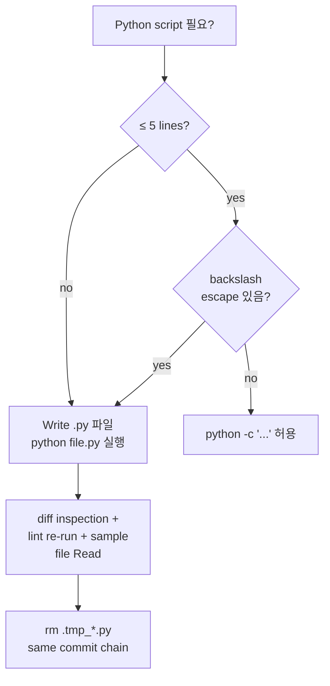

# ADR-061: Python script-writing convention — heredoc escape guard + external .py 의무

## 상태
`Accepted`

## 컨텍스트

CFP-418 (ADR retroactive backfill) Phase 2 PR #419 FIX iteration 1 의 root cause 가 **Python regex backref + bash heredoc escape interaction trap** 으로 식별되었다.

### 트랩 시나리오 (CFP-418 evidence)

작성된 Orchestrator 명령:

```bash
python << 'PYEOF'
import re
# Insert sunset section before "## 관련 파일" heading, preserving the heading via backref
re.sub(r'(\n)(## 관련 파일)', f'{section_text}\n\\1\\2', content, count=1)
PYEOF
```

**기대**: `<<'PYEOF'` (single-quoted heredoc) 이므로 bash 가 backslash 처리 안함. Python 이 `\\1\\2` 를 `\1\2` (2개 backref) 로 interpret.

**실제 결과**: 43개 ADR 파일에서 `## 관련 파일` heading 이 `\x01\x02` (SOH + STX 제어문자) 로 교체됨.

### 원인 분석

bash heredoc with `<<'EOF'` 은 **공식적으로** verbatim transmission 을 보장하지만, 실제로는 환경/shell 버전에 따라 `\\1` → `\1` 변환이 발생할 수 있다. Python 은 string literal `'\1'` 을 octal escape (chr(1) = SOH) 로 해석하므로, regex backref 가 무효화되고 raw 제어문자가 replacement 에 삽입된다.

검증 (`python -c "s = '\\\\1'; print(len(s), repr(s))"` in heredoc context):
- 기대: `len=2, repr='\\\\1'` (literal backslash + 1)
- 실제: `len=1, repr='\\x01'` (octal escape applied)

### Trap 의 위험성

- **Detect 가 어렵다**: 신뢰 가능한 evidence (CI lint, sanity check) 없으면 silent corruption 가능
- **Recovery 비용 높음**: CFP-418 에서 separate fix commit + 43 file restore script 필요했음
- **재발 위험 큼**: 향후 backfill / migration / batch transformation script 에서 동일 trap 가능

## 결정

### 결정 1: 외부 `.py` 파일 실행 의무화

bash heredoc 안 multi-line Python (> 5 lines) 작성 **금지**. 다음 절차 의무:

1. `Write` tool 로 `.py` 파일 (보통 `.tmp_*.py` 또는 `scripts/<task>-<date>.py`) 작성
2. `python <file>.py` 또는 `PYTHONIOENCODING=utf-8 python <file>.py` 실행
3. 작업 완료 후 `.tmp_*.py` 즉시 삭제 (`rm .tmp_*.py` — same commit chain)

### 결정 2: 짧은 `python -c` 허용 범위

다음 조건 **모두** 충족 시 `python -c "..."` 형태 inline 허용:

- 5줄 이내
- backslash escape 없음 (regex backref / octal / hex / unicode escape 없음)
- string literal 내 `\` 미사용
- f-string `{...}` 표현식만 사용

위반 시 외부 `.py` 파일 작성 의무 (결정 1).

### 결정 3: heredoc 사용 금지 영역

다음 cases 에서 bash heredoc 안 Python 사용 **금지**:

- regex backref (`\1`, `\g<N>`)
- string substitution with backslash
- 멀티라인 string 처리
- byte-level escape (`\x..`, `\u....`, octal)
- json/yaml string content with backslashes

heredoc 대안:
- 외부 `.py` 파일 (결정 1)
- 또는 bash native tools (`awk`, `sed`, `grep`, `tr`)

### 결정 4: `<<'EOF'` single-quoted 의 한계 명시

`<<'EOF'` (single-quoted) 가 verbatim transmission 을 **공식 보장** 하지만, 실제 환경 (Windows Git Bash + PowerShell mixed runtime, MSYS2, WSL) 에서는 backslash 처리 불일치 사례가 있다. 본 결정은 platform-portable script 작성 의무 — heredoc verbatim 가정 의존 금지.

### 결정 5: Script 작성 후 sanity check

multi-line `.py` script 작성 후 다음 sanity check 의무:

1. **Diff inspection**: `git diff` 또는 `git diff --stat` 로 변경 라인 분포 확인 (예상 영역 외 변경 없음)
2. **Lint re-run**: 관련 lint script (`check-doc-section-schema.sh`, `check-adr-sunset-criteria.sh` 등) 즉시 재실행
3. **Sample file inspection**: 예상 영역의 1-2 sample file 을 `Read` tool 로 확인

CFP-418 trap 은 1단계 (lint re-run) 에서 만약 적용했다면 즉시 발견 가능했다.

### 결정 6: Reusable backfill helper 권장 (장기)

향후 동일 패턴 (frontmatter field 추가 / section insertion / regex-based bulk transformation) 에 대해 reusable Python helper module 작성 권장 — `scripts/lib/adr_transform.py` 같은 위치. 한 번 정확하게 작성하고 sanity check 거친 후 재사용.

본 ADR scope 외 — 별도 follow-up CFP carrier.

### 결정 7: ADR-039 정합 — script work 도 subagent 권장

ADR-039 (Orchestrator subagent default for codeforge modification work) 의 원칙은 script 작성 / 실행에도 적용. 단:
- inline whitelist 4-entry 안 (Read-only Q&A, scratchpad 등) 에서 짧은 script (결정 2 범위) 는 허용
- 그 외 영역에서 multi-line `.py` script 작성 = `Agent` tool spawn 권장 (DeveloperAgent / 적합 role:dev)

본 결정은 CFP-418 evidence (Orchestrator inline backfill script 가 silent corruption 유발) 의 ADR-039 정합 영역 확장.

### 결정 8: Self-application

본 ADR 자체의 `is_transitional` 분류 = `false` (permanent policy). codeforge script-writing 의 영구 표준 carrier.

본 ADR 도 sunset criteria 정책 적용 받음 — `## 해소 기준` 섹션 = `N/A — permanent policy` (ADR-058 §결정 4 self-application 정합).

## 결과

### 긍정
- CFP-418 type trap 재발 위험 차단
- script work audit trail 강화 (`.py` 파일 = git history 에 남음)
- platform-portable script 작성 의무화
- ADR-039 와 정합 (subagent default)

### 부정 / Trade-off
- `Write` tool + `python` 실행 2-step 으로 latency 약간 증가 (inline `python -c` 대비)
- `.tmp_*.py` 파일 추가 housekeeping 필요 (cleanup 의무)

### 영향 받는 영역
- Orchestrator 의 모든 bulk transformation / migration script work
- backfill operation (frontmatter 추가, section 삽입 등)
- ADR / Story / change-plan 자동화 처리

## 해소 기준

N/A — permanent policy

## 다이어그램 (선택)



## 관련 파일

- `CLAUDE.md` — "스크립트 작성 표준" 섹션 cross-ref 1-2줄
- `scripts/check-adr-sunset-criteria.sh` — CFP-418 backfill trap 발견 채널 (lint enforcement evidence)
- `scripts/lib/` — `scripts/lib/<name>.py` 외부 split 표준 위치 (Amendment 1 — CFP-478, 28 file SSOT)
- `templates/scripts/` — 향후 reusable helper 위치 (결정 6 follow-up)
- `templates/github-workflows/` — Amendment 1 (CFP-478) §결정 1 scope 명시 영역
- `docs/adr/ADR-039-orchestrator-subagent-default-for-codeforge-modification-work.md` — 정합 ADR
- `docs/adr/ADR-058-adr-sunset-criteria-mandate.md` — 본 ADR self-application 출처

---

## Amendment 1 (CFP-478 — 2026-05-14)

### Context

CFP-455 (Option A prior art) 가 `scripts/check-evidence-registry.sh` (8-line thin wrapper) + `scripts/lib/check_evidence_registry.py` (314 lines 외부 split) pattern 1 file 적용. CFP-478 = 동일 패턴 27 후보 (19 scripts/ + 8 templates/github-workflows/) bulk scale-up — `scripts/lib/` directory 1 → 28 file 전환. ADR-061 §결정 6 본문 verbatim "본 ADR scope 외 — 별도 follow-up CFP carrier" 명시 → CFP-478 = follow-up CFP carrier.

본 Amendment 는 **ratchet ↑ direction** (강화 방향 — 정책 scope 확장 + 의무 강도 격상, 약화 방향 변경 0건) — ADR-058 §결정 5 `sunset_justification` 의무 면제 (§결정 5 strengthen direction 정합. ADR-058 §결정 5 SSOT: ratchet ↑ = `is_transitional: false → true` 다운그레이드 또는 forbid-list dictionary 축소 등의 약화 변경이 아닌 경우).

### 결정 (Amendment delta)

#### Amendment §결정 1.A: 적용 범위 명시 (Q3 carrier)

§결정 1 본문 "bash heredoc 안 multi-line Python (> 5 lines) 작성 **금지**" 의 적용 범위 = **`scripts/*` + `templates/github-workflows/*` 양 영역**.

Rationale: heredoc verbatim transmission inconsistency (CFP-418 SOH+STX corruption evidence) = bash heredoc 자체 영역. workflow YAML `run: |` block 안 bash heredoc 도 동일 위험 surface. Amendment 1 본 단락이 §결정 1 본문 scope 명시화.

위반 처리:
- `scripts/*.sh` 안 heredoc Python > 5 lines = 금지 (§결정 1 invariant)
- `templates/github-workflows/*.yml` 의 step `run:` block 안 heredoc Python > 5 lines = 금지 (Amendment 1 신설)

#### Amendment §결정 6.A: `scripts/lib/` 표준 격상 (Q2 carrier — ratchet ↑)

§결정 6 본문 "Reusable backfill helper 권장 (장기) — `scripts/lib/adr_transform.py` 같은 위치" 의 표현 강화:

- **Before** (ADR-061 원본): "권장 (장기)" + "본 ADR scope 외 — 별도 follow-up CFP carrier"
- **After** (Amendment 1): **표준 (즉시) — `scripts/lib/<name>.py` 위치 의무**. 외부 split 대상 `.py` 파일 = `scripts/lib/` 하위. file naming = snake_case from kebab-case (`scripts/check-foo-bar.sh` → `scripts/lib/check_foo_bar.py`). workflow YAML 외부 split = `scripts/lib/workflow_<purpose>.py` 또는 `scripts/lib/<workflow-prefix>_<purpose>.py` (CFP-478 Change Plan §3.x SSOT 정합).

ratchet 방향 = 강화 (long-term recommendation → immediate standard). ADR-058 §결정 5 strengthen direction 정합 (`sunset_justification` 의무 면제).

#### Amendment §결정 6.B: thin wrapper 표준 8-line template

bash wrapper file 통일 패턴 — CFP-455 prior art verbatim:

```bash
#!/usr/bin/env bash
# <One-line description>. Detail in scripts/lib/<name>.py header.
# ADR-061 §결정 1 / Amendment 1 §결정 6.A — external .py split.
set -euo pipefail
SCRIPT_DIR="$(cd "$(dirname "${BASH_SOURCE[0]}")" && pwd)"
[ "$#" -eq 0 ] && cd "$SCRIPT_DIR/.."
exec python3 "$SCRIPT_DIR/lib/<name>.py" "$@"
```

본 8-line template = `scripts/lib/` 외부 split bash wrapper 의 표준 형식. 작성자 / 리뷰어 / lint 채널 모두 본 template 정합 검증 가능.

#### Amendment §결정 1.B: workflow YAML state-coupling preservation invariant

workflow YAML 의 heredoc Python migration 시 **state-coupling preservation 의무**:

- step-local `VAR=$(python3 path/to/file.py)` capture chain 보존 (NOT `/tmp/<output>.txt` redirect/read-back — race condition + cleanup 부담)
- env injection 패턴 (`KEY=... TITLE_CLEAN=... python3 path/to/file.py`) + `.py` file 안 `os.environ.get(...)` 정합
- `$GITHUB_OUTPUT` forwarding = workflow `run:` block 의 final shell line 책임 (Python file = stdout-only)

Anti-pattern (금지): 동일 workflow file 안 N heredoc block 을 N 독립 GitHub Actions step 으로 분리 — shell-local 변수 capture chain (`$STORY_CONTENT` → `$CONTENT_B64` → `$GITHUB_OUTPUT`) 깨질 위험. CFP-478 evidence = `story-init.yml` 4 heredoc block.

### 영향 영역 변경

- **Before Amendment 1**: `scripts/lib/` directory = 1 file (CFP-455 prior art, `check_evidence_registry.py`)
- **After Amendment 1 + CFP-478 Phase 2 merge**: `scripts/lib/` directory = 28 file (CFP-455 1 + CFP-478 27). naming convention SSOT = snake_case from kebab-case.

향후 신규 lint/audit/validation script 작성자 = 본 Amendment §결정 6.A 의무 적용. ADR-061 §결정 1 / §결정 2 / §결정 3 invariants 무변경 (cap 5 lines + boundary + trap area 절대 금지 모두 유지).

### Sunset justification

`sunset_justification_required: false` — Amendment 1 = ratchet ↑ direction (강화 방향). ADR-058 §결정 5 정합. ADR-061 자체 `is_transitional: false` (permanent policy) — Amendment 1 도 동일 permanent.

### Carrier evidence (CFP-478)

- 27 candidate audit table (Change Plan §3 — wrapper/change-plans/cfp-478-heredoc-python-bulk-migration.md SSOT)
- trap-evidence verified candidates (P0): `check-decision-principle-vocabulary.sh:90` + `check-story-section-schema.sh:79` + `check-story-section-9-typed.sh:58` — 모두 `replace("\\", "/")` (Windows path normalization, byte-level escape § 결정 3 영역)
- state-coupling verified workflow: `templates/github-workflows/story-init.yml` 4 heredoc block (line 131-158 / 274-353 + 2 sub-blocks) — `$STORY_CONTENT` → `$CONTENT_B64` → `$GITHUB_OUTPUT` capture chain
- pyyaml import 9 candidates 중 8 graceful (try/except ImportError → sys.exit(0)) — 1 outlier `test-cfp-140-ghec-governance.sh` migration 시 표준 패턴 통일 의무 (CFP-478 AC-11)

---

## Amendment 2 (CFP-1292 — 2026-05-23 KST)

### Context

CFP-604 (ADR-063 marketplace atomic-sync mechanical enforcement) Phase 2 CodeReview Iter 1 에서 **P0 SIGPIPE bug** 발견 — `set -uo pipefail` 활성 + `echo "$DIFF" | grep -q ...` 조합이 grep early-exit 으로 인한 SIGPIPE → exit 141 → pipefail 로 pipeline 전체 실패. production-scale `$DIFF` (~100KB) 에서 발생, isolated test env (~30 byte) 에서 미발생 → bats fixture **false-positive GREEN**.

CFP-583 sibling sample (handoff-wording-check workflow FIX-1) 가 동일 패턴 + production-scale fixture 박제 누락 evidence 보유. PMOAgent retro corpus enumeration 결과 **pattern_count = 2 reach** — ADR-045 §D-9 mandatory framing `escalation_action: adr_draft_emitted` 발동.

두 패턴 = **directly-analogous root cause** (bash script 의 production-scale 환경 invariant 가 test contract 에서 미covered). 단일 §결정 9 신설로 양 패턴 cover 가능.

본 Amendment 는 **ratchet ↑ direction** (강화 방향 — 정책 scope 신규 추가 + 의무 강도 격상, 약화 방향 변경 0건). ADR-058 §결정 5 `sunset_justification` 의무 면제 (strengthen direction).

### 결정 (Amendment delta)

#### Amendment §결정 9: production-scale invariant verify (mandate)

bash script 가 다음 **3-조건 AND** 충족 시 production-scale discriminating fixture mandatory (또는 대안 패턴 채택):

1. `set -uo pipefail` 활성 (또는 `set -e` + `set -o pipefail` 동등)
2. pipe operator (`|`) 사용 — `echo ... | grep`, `cat ... | jq` 등
3. input source size 가변 (git diff / gh API response / file content / 외부 input)

**production-scale fixture 의무** (3-조건 AND 충족 시):
- bats / test fixture 에 ≥ **10× isolated env size** discriminating TC 1 건 이상
- 예: isolated test 가 ~30 byte input 사용 시 production-scale TC = ≥ 300 byte (실질 ≥ 1KB-10KB 권장 — pipe buffer / SIGPIPE 발생 임계 정합)
- TC 명명 권장: `TC-large-diff` / `TC-prod-scale` / `TC-pipe-buffer-overflow`

**대안 패턴** (production-scale fixture 의무 면제, ratchet equivalent — 양 영역 어느 쪽이든 invariant 충족):
- `<<<` here-string: `grep -qE 'pattern' <<< "$DIFF"` — pipe 자체 제거, SIGPIPE 발생 path 차단
- `< <(...)`: process substitution — pipe 부수 효과 분리
- 명시적 pipefail 해제 구간: `set +o pipefail; ... | grep ...; set -o pipefail` (단, 해제 구간 명시 의무 + 명확한 rationale 주석)

**유효 영역**: §결정 1 + Amendment 1 §결정 1.A 정합 — `scripts/*.sh` + `templates/github-workflows/*.yml` step `run:` block. ADR-061 의 외부 `.py` split mandate (§결정 1 / Amendment 1 §결정 6.A) 와 disjoint axis — Python split 영역은 본 §결정 9 mandate 대상 외 (Python = `sys.stdin` reading 자체에 SIGPIPE 무위험, GIL + signal handling 영역).

위반 처리:
- Phase 2 PR open 시 CodeReviewPL audit anchor — `set -uo pipefail` + pipe + 가변 input source 동시 사용 file 식별 → fixture TC enumeration verify → 미충족 시 finding 발화 (severity 권장: P1 — production-scale latency exposure)
- mechanical lint (Wave 2 sub-Story carrier) — `check-bash-pipefail-pipe-production-scale.sh` (3-조건 AND grep + fixture TC presence verify) — 본 Amendment 2 declarative phase, Wave 2 별 carrier 발의 시 mechanical_enforcement_actions[] field append

#### Amendment §결정 10: Self-application — Amendment 2 ratchet 검증

본 Amendment 2 자체 self-application:

- **ratchet 방향**: 강화 (신규 §결정 9 추가 + 의무 강도 mandatory + scope `scripts/*.sh` + `templates/github-workflows/*.yml`). 약화 방향 변경 0건. ADR-058 §결정 5 정합.
- **`is_transitional: false` 보존**: ADR-061 = permanent policy (Amendment 1 동일 permanent — `sunset_justification_required: false`). Amendment 2 도 동일 permanent (production-scale invariant = bash 도메인 영구 사실).
- **CFP scope unitary 정합** (ADR-064 §결정 1): 본 Amendment 2 = 단일 §결정 9 mandate + §결정 10 self-app 의 2-§결정 묶음 — "production-scale invariant verify" 단일 axis 안 강화, "경량 → full" 분할 아님.
- **declarative-only phase** (Wave 1, mechanical_enforcement_actions: []): ADR-076 / ADR-082 / ADR-086 precedent 답습 (Wave 1 declarative + Wave 2 mechanical lint 별 carrier 발의). mechanical lint = production-scale fixture presence-check workflow — pattern_count 추가 사례 누적 또는 사용자 직접 ratchet 의도 표명 시 별 sub-Story carrier.

### 영향 영역 변경

- **Before Amendment 2**: ADR-061 §결정 5 sanity check 3종 (diff inspection / lint re-run / sample file Read) 의 적용 — bash script 작성자 self-discipline anchor. production-scale verify 영역 부재.
- **After Amendment 2**: §결정 9 + §결정 10 신설 → bash script with `set -uo pipefail` + pipe + 가변 input 3-조건 AND 충족 file 의 **test contract production-scale fixture mandatory** (또는 here-string/process-substitution 대안 채택). CodeReviewPL anchor verify 영역 확장.

향후 신규 bash script (scripts/*.sh + templates/github-workflows/*.yml step run: block) 작성자 = §결정 9 의무 적용. **기존 28-file `scripts/lib/` (Amendment 1 carrier) 도 retroactive 의무 안** — pattern_count 추가 사례 발견 시 corpus retro 진행 의무 (PMOAgent §D-9 framework).

### Sunset justification

`sunset_justification_required: false` — Amendment 2 = ratchet ↑ direction (강화 방향, ADR-058 §결정 5 정합). ADR-061 `is_transitional: false` 보존 — Amendment 2 도 동일 permanent policy.

### Carrier evidence (CFP-1292)

- **Pattern 1**: CFP-604 F-CR-604-1 P0 SIGPIPE — `scripts/check-version-bump-atomic.sh` line 60-66 + `scripts/check-architect-marketplace-self-check.sh` line 74-80. production-scale `$DIFF` ~100KB 에서 `exit 141` (SIGPIPE propagation), `MIRRORED_CHANGED=0` early `exit 0` 회피 path 도달 불가. FIX iter 2 = here-string `<<<` 전환으로 pipe 제거 (대안 패턴 채택).
- **Pattern 2**: CFP-604 F-CR-604-3 P2 bats fixture isolated env short DIFF (~30 byte) → SIGPIPE 미발생 → 14/14 GREEN false-positive. FIX iter 2 = `TC-large-diff` 추가 (~100KB synthetic description) → 16/16 GREEN regression discriminating fixture (production-scale 의무 충족).
- **Sibling sample**: CFP-583 handoff-wording-check workflow FIX-1 — 동일 SIGPIPE 패턴 + production-scale fixture 박제 누락 evidence (PMOAgent retro corpus enumeration source).
- **PMOAgent framing source**: CFP-604 retro `internal-docs/wrapper/retros/2026-05-23-cfp-604-marketplace-atomic-mechanical-enforcement.md` §5 cross_story_pattern_adr_trigger field — `pattern_count=2` reach `adr_draft_emitted` Mandatory.

### 적용 사례 (Amendment 2 첫 self-applied carrier)

본 Amendment 2 자체 적용 — CFP-1292 = ADR-061 Amendment 2 carrier + production-scale invariant 의 first-class codification carrier. Amendment 2 발효 후 신규 bash script 작성자 가 §결정 9 의무 인지 + CodeReviewPL anchor verify 영역 의무 확장.

---

## Amendment 3 (CFP-1507 — 2026-05-24 KST)

### Context

CFP-1497 PR #1499 (Wave 2-C of CFP-1389 — Amendment-slot reservation mechanical wire) merge 직후 **github-advanced-security[bot] CodeQL** 가 `scripts/lib/check_amendment_slot_reservation.py` 안 `RESERVATION_ENTRY_RE` regex 의 **catastrophic backtracking ReDoS** 패턴을 detect — `(?:\s+\w+:\s*[^\n]*\n)*?` lazy-quantifier nested 영역에서 adversarial input 에 대해 exponential time complexity 가능.

fix commit `e5b8631` (CFP-1497 inline FIX iter 1):
- Old: `(?:\s+\w+:\s*[^\n]*\n)*?` multi-line entry regex (lazy + character class + nested newline)
- New: 2 simple line-anchored regexes (`^\s*-\s*adr_number:\s*(\d+)\s*$` + `^\s+amendment_id:\s*(\d+)\s*$`) + Python `splitlines()` line-by-line scan + per-entry scan cap 20 line

CFP-1500 (Wave 2-B) + CFP-1502 (Wave 2-D) = CFP-1497 답습 wires — 같은 chief author pattern 으로 모든 신규 lint Python SSOT file 의 multi-line text parsing 영역에 line-by-line scan + per-entry cap pattern 채택 의무. 3 occurrence reach = pattern_count 3.

PMOAgent retro corpus enumeration 결과 **pattern_count = 3 reach** — ADR-045 §D-9 mandatory framing `escalation_action: adr_draft_emitted` 발동.

본 Amendment 는 **ratchet ↑ direction** (강화 방향 — 정책 scope 신규 추가 + 의무 강도 격상, 약화 방향 변경 0건). ADR-058 §결정 5 `sunset_justification` 의무 면제 (strengthen direction).

### 결정 (Amendment delta)

#### Amendment §결정 11: CodeQL ReDoS line-by-line parse mandate

Python `re` module multi-line text parsing 시 다음 **catastrophic backtracking 가능 패턴 절대 금지**:

1. **Lazy nested quantifier**: `(?:...)*?` / `(?:...)+?` / `(?:...){m,n}?` 형식 안 character class + newline 포함
   - 예: `(?:\s+\w+:\s*[^\n]*\n)*?` (CFP-1497 sentinel)
2. **Nested quantifier with negated class + sentinel**: `[^x]*y...[^x]*y` 형식 (NFA backtracking exponential)
3. **Alternation with overlap**: `(a|ab)*` 형식 (양 branch prefix overlap)

**의무 대체 패턴** (line-by-line scan):

```python
# Anti-pattern (금지)
RESERVATION_ENTRY_RE = re.compile(
    r"^\s*-\s*adr_number:\s*(\d+)\s*\n"
    r"(?:\s+\w+:\s*[^\n]*\n)*?"  # ReDoS catastrophic backtracking
    r"\s+amendment_id:\s*(\d+)\s*\n",
    re.MULTILINE,
)

# Required pattern (line-by-line scan + per-entry cap)
RESERVATION_ADR_NUMBER_RE = re.compile(r"^\s*-\s*adr_number:\s*(\d+)\s*$")
RESERVATION_AMENDMENT_ID_RE = re.compile(r"^\s+amendment_id:\s*(\d+)\s*$")

def _extract_entries(text, scan_cap=50):
    entries = []
    lines = text.splitlines()
    n = len(lines)
    for i, line in enumerate(lines):
        adr_match = RESERVATION_ADR_NUMBER_RE.match(line)
        if not adr_match:
            continue
        # Scan up to `scan_cap` subsequent lines for paired field
        for j in range(i + 1, min(i + 1 + scan_cap, n)):
            sub = lines[j]
            # Stop at next entry boundary
            if sub and not sub[0].isspace():
                break
            if RESERVATION_ADR_NUMBER_RE.match(sub):
                break
            am_match = RESERVATION_AMENDMENT_ID_RE.match(sub)
            if am_match:
                entries.append((adr_match.group(1), am_match.group(1)))
                break
    return entries
```

**Mandate primitives**:

1. **Anchored simple regex**: 각 field 마다 단일 line anchored regex (`^\s*key:\s*value\s*$`)
2. **Line-by-line scan**: `for line in text.splitlines()` 또는 `for i, line in enumerate(lines)` 형식
3. **Per-entry scan cap**: default `scan_cap=50` line (entry block 최대 크기 가정). 입력별 적정 cap 조정 가능 (CFP-1497 = 20, CFP-1500/1502 동일).
4. **Boundary detection**: 다음 entry start (non-indented line 또는 동일 key match) 도달 시 inner loop break

**유효 영역**: §결정 1 + Amendment 1 §결정 1.A 정합 — `scripts/lib/*.py` Python SSOT files 의 multi-line text parsing 영역. Workflow YAML `run:` block 안 inline Python = §결정 1 / Amendment 1 §결정 6.A 에 의해 이미 외부 `.py` split 의무, 본 Amendment 11 자동 적용.

**적용 제외 영역**:
- single-line text parsing (`re.match(r"^pattern$", single_line)`)
- file-level whole-text replacement (`re.sub(r"static_pattern", repl, text)` — no nested quantifier)
- 표준 anchored regex (lazy + character class + newline 조합 부재)
- Python 외부 도구 (`grep`, `awk`, `sed` — 본 ADR Python SSOT scope 외)

**enforcement source**:

- **Primary**: GitHub Advanced Security CodeQL default ReDoS detection (`py/redos`, `py/polynomial-redos` queries). CFP-1497 PR #1499 sentinel evidence — github-advanced-security[bot] auto-catch verified. consumer repo 의 `.github/workflows/codeql.yml` default config (CodeQL Action v3 default queries 활성) 부재 시 별도 wire 의무 없음 (GitHub 기본 Code scanning default config 권장).
- **Secondary**: CodeReviewPL anchor verify — `scripts/lib/*.py` 안 multi-line text parsing 영역 의 catastrophic backtracking 가능 패턴 1+ 식별 시 finding 발화 (severity 권장: P1 — production-scale latency exposure).
- **declarative-only Wave 1**: 본 ADR-061 자체 = convention SSOT. mechanical lint = GitHub Advanced Security default ReDoS detection 가 cover. 신규 codeforge-specific lint workflow 신설 0 (ADR-076 / ADR-082 / ADR-086 declarative-only Wave 1 precedent 답습, ADR-082 §결정 6 known-limitation rationale 정합). `if pattern_count ≥ 2 recurrence (CodeQL miss + manual review miss), follow-up CFP MUST promote to mechanical lint` clause 명시.

위반 처리:
- PR open 시 GitHub Advanced Security CodeQL = warning-tier auto-detection. blocking-on-pr 승격 = ADR-060 evidence-enforceable promotion framework gate 통과 후 (recurrence 추가 시).
- ADR-061 §결정 5 sanity check 3종 (diff inspection / lint re-run / sample file Read) 의 Python SSOT 신규 / 수정 시 의무 적용.

#### Amendment §결정 12: Self-application — Amendment 3 ratchet 검증

본 Amendment 3 자체 self-application:

- **ratchet 방향**: 강화 (신규 §결정 11 추가 + 의무 강도 mandatory + scope `scripts/lib/*.py` multi-line text parsing). 약화 방향 변경 0건. ADR-058 §결정 5 정합.
- **`is_transitional: false` 보존**: ADR-061 = permanent policy (Amendment 1/2 동일 permanent). Amendment 3 도 동일 permanent (ReDoS catastrophic backtracking = Python `re` 영역 영구 사실).
- **CFP scope unitary 정합** (ADR-064 §결정 1): 본 Amendment 3 = 단일 §결정 11 mandate + §결정 12 self-app 의 2-§결정 묶음 — "ReDoS line-by-line parse mandate" 단일 axis 안 강화, "경량 → full" 분할 아님.
- **declarative-only phase** (Wave 1, mechanical_enforcement_actions: []): ADR-076 / ADR-082 / ADR-086 precedent 답습 (Wave 1 declarative + Wave 2 mechanical lint 별 carrier 발의). 본 ADR scope 의 mechanical layer = GitHub Advanced Security CodeQL default ReDoS detection 가 cover (외부 cover layer 활용 — 신규 codeforge-specific lint 신설 비용 회피). recurrence (CodeQL miss + manual review miss) 누적 사례 또는 사용자 직접 ratchet 의도 표명 시 별 sub-Story carrier.

### 영향 영역 변경

- **Before Amendment 3**: ADR-061 §결정 5 sanity check 3종 (diff inspection / lint re-run / sample file Read) 의 적용 — bash script + Python SSOT 작성자 self-discipline anchor. ReDoS catastrophic backtracking 영역 부재.
- **After Amendment 3**: §결정 11 + §결정 12 신설 → `scripts/lib/*.py` multi-line text parsing 영역 의 **line-by-line scan + per-entry cap pattern mandatory** (catastrophic backtracking lazy nested quantifier + nested negated class + alternation overlap 3 anti-pattern 금지). GitHub Advanced Security CodeQL default ReDoS detection = primary enforcement source (declarative-only Wave 1). CodeReviewPL anchor verify = secondary.

향후 신규 lint / audit / validation Python SSOT (`scripts/lib/*.py`) 작성자 = §결정 11 의무 적용. **기존 28-file `scripts/lib/` (Amendment 1 carrier) 도 retroactive 의무 안** — recurrence 추가 사례 발견 시 corpus retro 진행 의무 (PMOAgent §D-9 framework).

### Sunset justification

`sunset_justification_required: false` — Amendment 3 = ratchet ↑ direction (강화 방향, ADR-058 §결정 5 정합). ADR-061 `is_transitional: false` 보존 — Amendment 3 도 동일 permanent policy.

### Carrier evidence (CFP-1507)

- **Pattern 1**: CFP-1497 PR #1499 commit `e5b8631` — `scripts/lib/check_amendment_slot_reservation.py` 의 `RESERVATION_ENTRY_RE` regex `(?:\s+\w+:\s*[^\n]*\n)*?` catastrophic backtracking caught by **github-advanced-security[bot] CodeQL** post-merge ReDoS alert. fix = 2 simple line-anchored regexes (`RESERVATION_ADR_NUMBER_RE` + `RESERVATION_AMENDMENT_ID_RE`) + `text.splitlines()` line-by-line scan + 20-line per-entry cap (`min(i + 21, n)` slice).
- **Pattern 2**: CFP-1500 (Wave 2-B of CFP-1389) PR #1501 — Sub-CFP B mid-spawn drift detection mechanical wire 의 lint script `scripts/lib/check_mid_spawn_drift_detection.py` (assumed) — Story §2 §3.1 본문 명시 "Python SSOT, line-by-line parsing — CodeQL ReDoS guard 정합". CFP-1497 byte-pattern 답습.
- **Pattern 3**: CFP-1502 (Wave 2-D of CFP-1389) PR #1503 — Sub-CFP D chief author span telemetry mechanical wire 의 lint script `scripts/lib/check_chief_author_span_telemetry.py` (assumed) — Story §2 §3.1 본문 명시 "Python SSOT, line-by-line parsing — CodeQL ReDoS guard 정합". CFP-1497 byte-pattern 답습.
- **PMOAgent framing source**: CFP-1389 parent Epic 의 Wave 2 mechanical wire 3 sibling Story (CFP-1497/1500/1502) corpus retro — `pattern_count=3` reach `adr_draft_emitted` Mandatory.
- **Cross-Epic upstream**: `<scripts/lib/check_evidence_registry.py>` (CFP-455 prior art) + 28-file `scripts/lib/` (CFP-478) corpus = retroactive audit 영역. recurrence 추가 사례 발견 시 별 carrier.

### 적용 사례 (Amendment 3 첫 self-applied carrier)

본 Amendment 3 자체 적용 — CFP-1507 = ADR-061 Amendment 3 carrier + CodeQL ReDoS line-by-line parse mandate 의 first-class codification carrier. Amendment 3 발효 후 신규 Python SSOT 작성자 가 §결정 11 의무 인지 + GitHub Advanced Security CodeQL default ReDoS detection primary enforcement source 활용 + CodeReviewPL anchor verify 영역 의무 확장.
