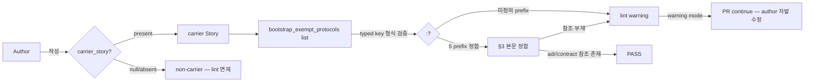

# ADR-062: Carrier Story bootstrap dependency 룰

## 상태

Accepted (2026-05-12). carrier_story = CFP-407.

## 컨텍스트

**carrier Story** 란 본인이 정의하는 protocol / convention / lint / contract 의 **첫 적용 사례**가 되는 Story. 4 known 사례:

| Story | Protocol carrier | 자력 mitigation 방식 |
|---|---|---|
| CFP-138 | retro-mandatory.yml workflow + ADR-045 | retro PR open 후 workflow 활성 |
| CFP-274 | TodoWrite progress visualization + ADR-038 | TodoWrite 직접 미호출 진행 후 활성 |
| CFP-387 | ADR-058 sunset criteria + check-adr-sunset-criteria.sh | declaration only Phase, lint warning mode |
| CFP-391 | debate-protocol-v1 + ADR-059 | `worker_dialog_rounds=0` bootstrap caveat verbatim |

**self-application paradox**: carrier Story 가 자기 protocol 적용 시 chicken-and-egg — protocol 정의 (ADR / contract / lint script) 가 아직 merge 미반영 / CI 미활성 상태에서 본인이 protocol 준수 의무를 가지면 Story merge 진입 자체 차단.

**현재 패턴**: 4 Story 모두 carrier 본인이 verdict 본문 / Story §9 / Phase 1 PR description 에 "본 Story 가 carrier 이므로 자기 protocol 미적용" 을 **수동으로** 명시. 자동 검증 0건. 다음 carrier Story 가 같은 회피 룰을 잊으면 lane 진입 차단 또는 게이트 false-fail.

선행 연구:
- Compiler self-hosting (Rust / Go / TypeScript): 신규 언어 기능이 컴파일러 자체 코드에 적용되기까지 bootstrap stage 분리 (Stage 0 = 이전 컴파일러 / Stage 1 = 자체 컴파일 / Stage 2 = self-hosted). carrier Story 의 phase 분리 (declaration → warning → enforce, ADR-058 §결정 8) 와 구조 유사.
- Feature flag carrier (LaunchDarkly / Optimizely): 신규 flag 도입 시 flag 자체의 metadata (owner / sunset / default) 가 flag 활성 전부터 frontmatter 의무. carrier Story 의 frontmatter `carrier_story` field 패턴 정합.
- Policy-as-Code (OPA / Conftest): Rego policy 자체의 lint policy 도 같은 framework 로 표현 가능 — self-application 패턴. evidence-enforceable framework (ADR-060) 와 정합.

**어휘 disambiguation** (PL §6.5 권고):
- "carrier" = **protocol carrier Story** (codeforge 컨텍스트). Telecom carrier / mobile carrier 의미 무관.
- "bootstrap" = **self-application bootstrap**. server bootstrap / `scripts/bootstrap-consumer.sh` / git bootstrap 의미 무관.

## 결정

본 ADR 은 declaration only. 기계적 강제 (CI lint enforce mode) 는 별도 후속 carrier CFP 분리. evidence-enforceable 점진 적용 절차 (ADR-060) 정합 — declaration → warning → enforce 3 단계.

### 결정 1 — frontmatter `carrier_story: <KEY>` 의무 + `bootstrap_exempt_protocols: [...]` typed key list

carrier Story frontmatter 에 다음 2 필드 명시:

```yaml
carrier_story: CFP-NNN          # 본 Story 가 자신이 carrier 인 protocol 의 carrier_story 자기 자신과 동일한 값
bootstrap_exempt_protocols:     # 자기 자신 적용 면제 protocol typed key list
  - "adr:ADR-NNN"
  - "contract:debate-protocol-v1"
  - "policy:todowrite-progress-visualization"
```

> **주의**: 본 frontmatter 의 `carrier_story` 필드는 ADR frontmatter 의 `carrier_story` 필드 (각 ADR 의 carrier Story KEY 참조 — 예: ADR-058 의 `carrier_story: CFP-387`) 와 **다른 의미**다. Story frontmatter 에서는 "본 Story 자기 자신이 carrier 인지 + 어느 protocol 의 carrier 인지" 를 self-declaration 한다. **일관성을 위해 본 Story 의 `carrier_story` 값은 자기 자신 KEY 와 동일하게 설정** (예: CFP-407 의 frontmatter 는 `carrier_story: CFP-407`). non-carrier Story 는 본 필드 미선언 — default = `null` (carrier 아님).

#### typed key 형식 (PL §5.5 CL-1 (c) 채택)

`bootstrap_exempt_protocols` 의 list 원소는 `"<type>:<identifier>"` 형식의 string. 채택 사유: 4 사례 중 CFP-274 의 carrier 는 `policy:todowrite-progress-visualization` 으로 ADR 아닌 policy 도 포괄 필요 — typed prefix 가 disambiguation + 확장성 동시 제공.

**type prefix 표준 (v1.0)**:
- `adr:` — ADR-NNN identifier (예: `adr:ADR-062`)
- `contract:` — inter-plugin contract name (예: `contract:debate-protocol-v1`, `contract:review-verdict-v4`)
- `policy:` — codeforge wrapper policy (예: `policy:todowrite-progress-visualization`)
- `workflow:` — GitHub workflow file (예: `workflow:retro-mandatory.yml`)
- `script:` — script name (예: `script:check-carrier-bootstrap.sh`)

추가 type prefix 도입 = 별도 ADR amendment. 미정의 prefix 사용 = lint warning.

multi-carrier Story (1 Story 가 2+ protocol 동시 도입) 는 list 원소 2+ 허용.

#### 4 known carrier retroactive backfill 매핑 (참조용 — backfill 자체는 본 Story scope 외)

| Story | carrier_story 값 | bootstrap_exempt_protocols |
|---|---|---|
| CFP-138 | `CFP-138` | `["adr:ADR-045", "workflow:retro-mandatory.yml"]` |
| CFP-274 | `CFP-274` | `["adr:ADR-038", "policy:todowrite-progress-visualization"]` |
| CFP-387 | `CFP-387` | `["adr:ADR-058", "script:check-adr-sunset-criteria.sh"]` |
| CFP-391 | `CFP-391` | `["adr:ADR-059", "contract:debate-protocol-v1"]` |
| CFP-407 | `CFP-407` | `["adr:ADR-062"]` (self-application 첫 사례) |

> retroactive backfill PR 은 별도 후속 CFP (CFP-418 패턴 참조). 본 ADR §결정 6 sunset 미요구 (declaration only).

### 결정 2 — `scripts/check-carrier-bootstrap.sh` warning mode lint

ADR-058 의 `check-adr-sunset-criteria.sh` 구현 패턴 1:1 차용. 검증 scope (PL §5.5 CL-2 (b) 채택):

- **(a) frontmatter field 정합**:
  - `carrier_story` 필드 존재 시 string 타입 + Story KEY 형식 (`<prefix>-<number>`) 검증
  - `bootstrap_exempt_protocols` 필드 존재 시 list of string 타입 + 각 원소가 `"<type>:<identifier>"` 형식 + type prefix 가 표준 5 prefix (`adr|contract|policy|workflow|script`) 중 하나 검증
- **(b) §3 본문 정합**: `carrier_story` 가 자기 자신 KEY 와 동일하면 (= 본 Story 가 carrier 임을 self-declare), §3 "관련 ADR" 본문에 `bootstrap_exempt_protocols` list 의 `adr:` 또는 `contract:` prefix 원소 모두 참조되어야 함 (§3 ADR 목록에 부재 시 warning)

`script:` / `workflow:` / `policy:` prefix 는 §3 본문 정합 미검증 (§3 = ADR 전용). 작성자가 §3 본문에 명시 권고는 본문 본 결정 안내 문구.

lint tier = **warning** (ADR-060 §결정 5 — 첫 도입 = warning mode). `continue-on-error: true`. PR block 미발생.

### 결정 3 — Story template frontmatter schema 갱신 (`templates/story-page-structure.md`)

Frontmatter 표준 필드 표에 2 row append:

| 필드 | 타입 | required | 의미 |
|---|---|:-:|---|
| `carrier_story` | string \| null | optional | ADR-062 §결정 1 — 본 Story 가 carrier 인 경우 자기 자신 KEY (예: `CFP-407`). non-carrier = 미선언 (default `null`) |
| `bootstrap_exempt_protocols` | list of typed key | optional | ADR-062 §결정 1 — typed key list 형식 `"<type>:<identifier>"`, 5 prefix (`adr|contract|policy|workflow|script`) |

`story-init.yml` Action 의 Issue Form parser 영향 = **없음**. Issue Form (`templates/github-issue-forms/story.yml`) 의 input 항목 변경 0건. 본 2 필드는 작성자가 Story file 직접 편집 시 명시 (carrier Story 작성 시점에 작성자 의식적 선언 = forcing function).

후속 carrier CFP 가 Issue Form 통합 (carrier checkbox UI) 별도 검토 가능 — 본 Story scope 외 (Non-goal NG-3).

### 결정 4 — CI workflow 신설 (`templates/github-workflows/carrier-bootstrap-check.yml`)

ADR-058 사례 `adr-sunset-criteria.yml` 신설 패턴 정합 (PL §5.5 CL-3 채택). 기존 `story-section-schema.yml` 확장 거부 — 분리된 workflow 가 (i) blast radius 좁고, (ii) 후속 enforce mode 승격 시 single-file 변경, (iii) workflow naming = "이 lint 가 어느 ADR 의 forcing function 인지" 1:1 매핑.

workflow tier = **warning** (continue-on-error: true), `paths` filter = `docs/stories/<KEY>.md`, sticky PR comment 발화. ADR-058 의 `adr-sunset-criteria.yml` 와 step 구조 동일 (changed-files detect → bypass label check → lint → comment) — bypass channel은 본 ADR scope 외 (4 known carrier 중 0건이 bypass 필요 — 후속 carrier 가 도입 시 추가).

### 결정 5 — `docs/evidence-checks-registry.yaml` 1 row append

ADR-060 §결정 8 evidence-check registry 등록 의무 정합. entry 신설:

```yaml
- name: carrier-bootstrap
  description: |
    ADR-062 §결정 1-2 mechanical verification — carrier Story frontmatter
    `carrier_story` + `bootstrap_exempt_protocols` typed key list 정합 +
    §3 본문 ADR/contract 참조 정합.
  detect_command: bash scripts/check-carrier-bootstrap.sh
  workflow: templates/github-workflows/carrier-bootstrap-check.yml
  current_tier: warning
  # bypass_label: omit — 4 known carrier 중 0건 bypass 필요, 후속 carrier 가 도입 시 추가
  promotion_criteria:
    pr_cumulative_min: 20
    failure_threshold: 0
    sibling_dependencies: []
    evidence_artifacts:
      - github_actions_run_history_url
      - lint_failure_count_zero_proof
      - pr_cumulative_count_proof
  modal_anti_pattern_dictionary: {}  # 본 lint = schema 검증, modal phrase 검사 미포함
  introduced_by: CFP-407
  owner_adr: ADR-062
  carrier_adr: ADR-062  # self-carrier
  status: Active
```

### 결정 6 — 본 ADR 자기 분류 = `is_transitional: false`

본 ADR 은 carrier Story 패턴이 codeforge 운영 중 영구적으로 발생하는 self-application paradox 의 governance policy 를 정의한다. 따라서 permanent policy = `is_transitional: false`. ADR-058 §결정 6 self-defeat 회피 패턴 정합.

본 정책의 효력 종료 조건 = 본 ADR 의 supersede 또는 codeforge 의 carrier Story 패턴 자체 폐지 (예: bootstrap dependency 의 plugin platform-level 해결). recursive sunset 무한 후행 회피.

### 결정 7 — Declaration only (기계적 enforcement 분리)

본 ADR 은 정책 declaration + warning mode lint 까지. 다음 영역은 별도 후속 carrier 분리 — evidence-enforceable 점진 적용 절차 정합:

- **enforce mode 승격**: `scripts/check-carrier-bootstrap.sh` warning → blocking 전환 (PR block). 승격 gate = ADR-060 §결정 6 (pr_cumulative_min=20 + failure_threshold=0 + evidence 3 산출물).
- **retroactive backfill**: CFP-138 / CFP-274 / CFP-387 / CFP-391 frontmatter `carrier_story` + `bootstrap_exempt_protocols` retroactive 갱신. Story file `§1 invariant` (`story-section-1-immutable.yml`) 와 별개 frontmatter scope — 별도 CFP (CFP-418 패턴 참조).
- **GitHub Issue Form 통합**: `story.yml` 에 carrier checkbox 추가 — 작성자 편의.
- **lane 진입 자동 차단**: carrier 미선언 시 Phase 1 PR open 차단 (preflight integration).
- **consumer overlay 확장**: `.claude/_overlay/project.yaml` carrier policy 확장 가능성.

### 결정 8 — 본 CFP-407 Story 자체의 self-application

본 ADR-062 도입 carrier = CFP-407 자신. 따라서 CFP-407 의 Story frontmatter 는:

```yaml
carrier_story: CFP-407
bootstrap_exempt_protocols:
  - "adr:ADR-062"
```

self-declare. **self-application 첫 적용 사례** — 본 lint 의 first execution target 이 자기 자신 carrier Story 가 됨. lint scope (§결정 2 (b)) 의 §3 본문 정합 검증이 본 ADR-062 §3 의 `adr:ADR-062` 참조 존재 검증으로 closure.

본 self-application 검증 = `scripts/test-check-carrier-bootstrap.sh` fixture case 1 (carrier present + protocol reference in §3 → PASS) 로 자동화.

## 결과

### 긍정

- 4 Story 반복 패턴 (manual mitigation) 의 자동 검증 진입점 확보 — 작성자가 carrier Story 작성 시점에 self-declaration 의무화.
- typed key list (`adr:`, `contract:`, `policy:`, `workflow:`, `script:`) 가 protocol 종류 disambiguation + 확장성 동시 제공.
- ADR-058 / ADR-060 패턴 1:1 차용 = 학습 비용 최소화, 구현 패턴 검증 완료.
- evidence-enforceable 점진 적용 (declaration → warning → enforce) 자연스러운 단계 분리.
- self-application 첫 적용 사례 (CFP-407 자체) 가 lint의 first execution target = 즉시 검증 closure.

### 부정

- carrier Story 작성 시점 frontmatter 2 필드 + protocol 참조 본문 정합 검증 부담.
- declaration only 단계는 enforce mode 부재 (warning mode + author 자발성 + DesignReview 1차 안전망 의존).
- typed key prefix 미정의 신규 prefix (예: `agent:`) 도입 시 ADR amendment 필요.
- 4 known carrier 의 retroactive backfill 미동반 = lint 실행 시 기존 4 Story warning 0건 (frontmatter 미선언 → default `null` 처리, lint 면제). 본 비대칭이 신규 carrier 작성 시점 안전망 = 1차 효과 충분.

### Trade-off

- typed key (옵션 c) 채택으로 plain string (옵션 a) 대비 작성 길이 증가 — disambiguation / 확장성 효익이 작성 비용 상회.
- 분리 workflow (CL-3 신설) 채택으로 기존 workflow 확장 (옵션 b) 대비 workflow 수 증가 — single-file blast radius / 1:1 매핑 효익이 file 수 비용 상회.
- declaration only (§결정 7) 채택으로 즉시 enforce 부재 — phased rollout 안전성 우선.

## 다이어그램



## 해소 기준

N/A — permanent policy. 본 ADR 은 `is_transitional: false` (permanent policy carrier). §결정 6 self-defeat 회피.

## 관련 파일

- `templates/story-page-structure.md` — frontmatter 표준 필드 표 2 row append (§결정 3)
- `scripts/check-carrier-bootstrap.sh` (신설) — warning mode lint (§결정 2)
- `scripts/test-check-carrier-bootstrap.sh` (신설) — 3 fixture case (§결정 8 self-application + §결정 2 (b) §3 본문 정합 + 미정의 prefix warning)
- `templates/github-workflows/carrier-bootstrap-check.yml` (신설) — CI workflow (§결정 4)
- `docs/evidence-checks-registry.yaml` — 1 row append (§결정 5)
- `docs/adr/ADR-058-adr-sunset-criteria-mandate.md` — 구현 패턴 template
- `docs/adr/ADR-060-evidence-enforceable-promotion-framework.md` — declaration → warning → enforce 점진 적용 SSOT
- `docs/adr/ADR-RESERVATION.md` — ADR-062 row (CFP-407, 2026-05-12 reserved → active)
- 후속 carrier (별도 CFP 잠정): enforce mode 승격 / retroactive backfill / Issue Form 통합 / lane preflight 통합 / consumer overlay 확장
