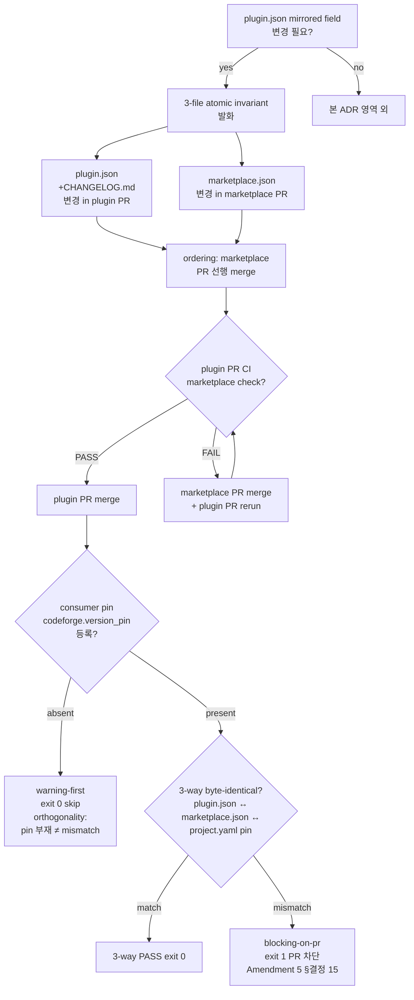

# ADR-063: Marketplace ↔ plugin.json atomic invariant — 3-file coordination

## 상태
`Accepted`

## 컨텍스트

codeforge plugin family 의 version bump 는 3 파일 (`.claude-plugin/plugin.json`, `CHANGELOG.md`, `mclayer/marketplace/.claude-plugin/marketplace.json`) 에 mirrored 정보를 보유한다. ADR-016 (marketplace sibling sync policy) 은 mirrored field 4종 (`name`/`version`/`description`/`author`) sync 의무를 정의하지만, **bump 시 3 file 의 atomic coordination invariant** 는 미명시.

### 3-Wave drift evidence (CFP-387 / CFP-418 / CFP-423 retro)

| Story | Drift 양상 | 감지 channel | Recovery |
|---|---|---|---|
| **CFP-387** | Phase 2 PR 시 marketplace-parity chicken-and-egg — wrapper plugin.json 5.11.0 + codeforge-design 0.7.0 새로 bump 됐으나 marketplace.json 미sync (5.10.0 + 0.6.0). PR CI fail. | `check-marketplace-parity.sh` post-PR-open | marketplace sync PR 선행 merge → Phase 2 PR re-run |
| **CFP-418** | 해당 없음 (backfill, version bump 없음) — Wave count 제외 | — | — |
| **CFP-423** | pre-existing CFP-393 drift — marketplace 5.15.0 sync 완료 but plugin.json 5.14.0 + CHANGELOG.md 5.14.0 정체 (이전 PR drift). PR CI fail. | `check-marketplace-sync.sh` (CFP-34) post-PR-open + `invariant-check` plugin.json↔CHANGELOG mismatch | 본 PR이 5.16.0 catch-up + sync 합쳐 처리 |

3회 누적 drift 의 공통 root cause:
- mirrored field bump 시 3 file 의 **atomic update 의무 미명시**
- bump를 한 file 만 수행하고 sibling sync 가 deferred / dropped 되면 lint 가 사후 감지만 가능
- 작성 시점 (Write 단계) 의 atomic 강제 mechanism 부재

### 기존 CI lint 의 한계

- `check-marketplace-parity.sh` (CFP-50 / ADR-023) — plugin.json ↔ marketplace.json 동치성 검증. **PR open 후 fire**. SSOT 사후 감지 channel (CFP-457 cleanup 후 단독 유지).
- ~~`check-marketplace-sync.sh`~~ — **deprecated CFP-457** (동일 영역 redundant coverage 였음, marketplace-parity 로 통합).
- `invariant-check` — plugin.json ↔ CHANGELOG.md 동치성 (version field).
- **Gap**: 3 file atomic invariant (작성 시점 강제) + ordering rule (marketplace sync PR vs plugin PR merge 순서) 미정의.

### 사용 시나리오

**Case A: 새 PR이 plugin.json version 변경**
- plugin.json + CHANGELOG.md 변경은 같은 PR 안에 함께 처리 (기존 `invariant-check` enforce)
- marketplace.json 은 별도 PR (mclayer/marketplace 다른 repo) — sibling sync PR 의무
- 본 PR과 sibling sync PR 의 **ordering**: marketplace sync 선행 merge → plugin PR merge (현재 관행)
- 또는 concurrent merge (atomic, drift 0-window) — 사용자 결정 영역

**Case B: marketplace.json 만 변경 (외부 정책 만 갱신)**
- plugin.json 영향 없음 (예: description 마이너 fix, CFP-378 #40 사례)
- ADR-016 sibling sync 단독 발화

**Case C: plugin.json 만 변경, marketplace.json 미sync**
- **Anti-pattern** — 본 ADR로 차단 대상
- CFP-387 / CFP-393 / CFP-423 drift 의 직접 원인

## 결정

### 결정 1: 3-file atomic invariant 명시 — bump 시 3 file 동시 처리 의무

mirrored field (`name`/`version`/`description`/`author`) 중 하나 이상 변경 시 다음 3 file 의 atomic coordination 의무:

| File | Repo | 변경 의무 |
|---|---|---|
| `.claude-plugin/plugin.json` | plugin repo (예: `mclayer/plugin-codeforge`) | mirrored field 변경 |
| `CHANGELOG.md` | plugin repo | 해당 version entry 추가 (version field 변경 시) |
| `.claude-plugin/marketplace.json` | `mclayer/marketplace` | 해당 plugin entry mirrored field 동일 |

3 file 중 어느 하나만 변경하고 나머지를 deferred / dropped 하면 invariant 위반 = drift 발생.

### 결정 2: PR ordering — marketplace sync 선행 merge 권장

cross-repo coordination 으로 인해 single atomic transaction 불가능. 다음 ordering 채택:

1. **(권장)** marketplace sync PR open + merge 선행
2. plugin PR open (`check-marketplace-parity.sh` PASS — marketplace 가 이미 최신)
3. plugin PR merge

또는 concurrent merge 가능 (drift 0-window):

1. marketplace sync PR + plugin PR 양쪽 open
2. plugin PR CI 의 marketplace check 는 fail 상태 — branch protection bypass 또는 admin override 필요
3. marketplace sync PR merge → 즉시 plugin PR CI re-run → PASS → merge

**Anti-pattern (금지)**:
- plugin PR merge 먼저 → marketplace 가 drift 상태로 main 에 노출 → 다음 PR 들이 모두 CI fail (CFP-387 chicken-and-egg 사례)

### 결정 3: 작성 단계 sanity check — pre-commit 권장

bump 작업 수행 시 다음 sanity check 의무 (ADR-061 §결정 5 정합):

1. plugin.json version + description 변경 직후 `bash scripts/check-marketplace-parity.sh` local 실행 → drift 확인 (사실상 fail 가능 — marketplace 가 미sync)
2. CHANGELOG.md 해당 version entry 작성
3. **즉시** marketplace sync 작업 시작 (별도 worktree / repo 에서 marketplace.json 변경 + PR open)
4. 3 file PR 모두 open 후 ordering (결정 2) 적용

선행 sanity check 없이 plugin PR open → CI fail → 사후 recovery 패턴은 마찰 비용이 높음 (rebase + force-push + re-run).

### 결정 4: bypass channel — 긴급 hotfix

production 장애 / security incident 대응 시 atomic invariant 일시 bypass 가능:

- `hotfix-bypass:marketplace-atomic` label (ADR-024 Amendment 3 hotfix-bypass family 정합)
- bypass 후 24시간 이내 marketplace sync PR open + merge 의무
- bypass 발생 시 `docs/audit/` 에 audit row 의무

본 channel 은 audit-trailed exception only — 정상 운영에서 사용 금지.

### 결정 5: 기존 CI lint 보존 + 신규 lint follow-up

기존 `check-marketplace-parity.sh` (CFP-50 / ADR-023) 는 본 ADR 의 atomic invariant 사후 감지 channel 로 유지. (`check-marketplace-sync.sh` 는 CFP-457 cleanup 으로 deprecated — marketplace-parity 와 redundant coverage 였음.) 신규 작성 시점 enforce (예: pre-commit hook, PR open 시점 cross-ref check) 는 별도 follow-up CFP carrier:

| Lint | 현재 | 신규 (별도 carrier) |
|---|---|---|
| plugin.json ↔ CHANGELOG | `invariant-check` workflow | 그대로 |
| plugin.json ↔ marketplace.json | `check-marketplace-parity.sh` post-PR | pre-commit hook (local) 권장 |
| sublayer enumeration (defense-in-depth) | 부재 | **[defense-in-depth-sublayer-registry-v1](../inter-plugin-contracts/defense-in-depth-sublayer-registry-v1.md)** (CFP-709 / ADR-075) — id=1 PR-time CI atomic (CFP-441 / `check-version-bump-atomic.sh` + `version-bump-atomic-check.yml`) / id=2 local pre-push advisory (CFP-447 / `pre-push.sh.sample` + `PRE_PUSH_BLOCKING=1`) / id=3 local pre-push auto-rebase guidance (CFP-477 / `pre-push-auto-rebase.sh.sample` + `PRE_PUSH_AUTO_REBASE=1` env, advisory abort + 4-line guidance, hook 안 직접 `git pull --rebase` 실행 금지). 향후 sublayer 추가 시 registry row append 만 — 본 ADR-063 본문 영향 0건. |

### 결정 6: ADR-016 vs ADR-063 분리 — scope 명확화

- **ADR-016 (marketplace sibling sync policy)**: marketplace.json 에 plugin 등록 의무 + mirrored field 4종 정의. **무엇을 sync 하는지** 정의.
- **ADR-063 (본 ADR — atomic invariant)**: bump 시 3 file 동시 처리 + PR ordering. **어떻게 sync 하는지 + 작성 단계 invariant** 정의.

본 ADR 은 ADR-016 의 amendment 가 아닌 별도 정책 — ADR-016 의 sync mechanism 을 atomic 으로 강제하는 layer.

### 결정 7: ADR-061 §결정 5 정합 — sanity check 3종 적용

ADR-061 §결정 5 (script-writing sanity check) 와 정합 — version bump 작업도 다음 3종 sanity check 의무:

- diff inspection: `git diff --stat` 로 plugin.json + CHANGELOG.md 변경 확인
- lint re-run: `bash scripts/check-marketplace-parity.sh` 즉시 실행 (drift 사전 확인)
- sample inspection: marketplace.json mirrored field 확인 (`gh api /repos/mclayer/marketplace/contents/.claude-plugin/marketplace.json` 또는 직접 fetch)

### 결정 8: Self-application

본 ADR 자체 분류 = `is_transitional: false` (영구 정책). codeforge plugin family 의 영구 atomic coordination 표준.

본 ADR 도입 시점에 marketplace.json sync PR 의무 (3-file atomic) — 본 PR 자체가 version bump 동반하면 self-application 첫 사례.

### 결정 9: ArchitectAgent Phase 1 marketplace sync proactive self-check trigger (Amendment 1, CFP-597)

**Context (proactive vs reactive 시점 갭)**: 기존 §결정 1-8 = 작성/PR-open 단계 invariant + 사후 감지 channel (`check-marketplace-parity.sh`). codeforge-design lane 의 ArchitectAgent (chief author) 가 Phase 1 산출물 commit 시점에 mirrored field diff 를 인지하지 못하면 — Change Plan / verdict packet / Phase 2 PR open 모두 거친 후에야 reactive lint 가 fire. CFP-534 sentinel #3 evidence (12:10 codeforge-pmo plugin.json 0.1.1 → 0.1.2 PATCH bump 동반 marketplace.json sync 부재 → workflow FAIL reactive 감지) 가 본 gap 식별.

**ADR-065 boundary 보존**: ADR-065 (non-marketplace 7-item self-check) §결정 5 = "marketplace 영역 self-check 는 ADR-063 SSOT — 본 ADR scope 외" + "cross-ref only — 중복 codification 회피". 본 결정 9 = ADR-063 SSOT 안 marketplace 영역 ArchitectAgent self-check trigger codify. ADR-065 §결정 1 7-item 을 8-item 으로 확장하는 대신 ADR-063 본문에서 통합 — SSOT drift 차단.

**3-layer proactive forcing function**:

| Layer | 시점 | 책임 주체 | Mechanism |
|---|---|---|---|
| 1 | ArchitectAgent §3 commit 직전 | ArchitectAgent (codeforge-design chief author) | `git diff <plugin>/.claude-plugin/plugin.json` mirrored field 4종 (`name` / `version` / `description` / `author`) 변경 감지 self-check |
| 2 | Change Plan §13 declarative declare | ArchitectAgent (산출물 작성) | `marketplace_sync_required: <bool>` + `mirrored_fields_changed: [<enum>]` + `triggering_plugins[]` sub-row 의무 (silent skip 금지 — `false` 일 때도 명시 declare) |
| 3 | Phase 2 PR open 시점 | Orchestrator (monopoly) | Change Plan §13 lookup → `marketplace_sync_required: true` 감지 시 GitOpsAgent (codeforge-pmo) spawn → marketplace sync PR open + merge (ordering = §결정 2 권장 — marketplace PR 선행 merge) |

기존 reactive channel (`check-marketplace-parity.sh`) 은 defense-in-depth 로 보존. 본 결정 9 = 작성 시점 인식 forcing function 추가.

**ArchitectAgent §3.6 self-check 행위** (codeforge-design plugin sibling carrier):
1. `git diff` 로 Phase 1 산출물 안 `<plugin>/.claude-plugin/plugin.json` mirrored field 4종 비교
2. 변경된 field enum 도출 → `mirrored_fields_changed[]` (예: `[version]`, `[version, description]`)
3. Change Plan §13 sub-row 채움 — `marketplace_sync_required` (bool) + `mirrored_fields_changed[]` + `triggering_plugins[]` (변경 영향 받은 plugin 명단)
4. NA 케이스 (mirrored field diff 0건) = `marketplace_sync_required: false` 명시 declare 의무 (silent skip 차단)

**Change Plan §13 sub-row schema**:
```yaml
marketplace_sync_required: <bool>            # NEW (ADR-063 Amendment 1 / CFP-597)
mirrored_fields_changed: [<enum: name|version|description|author>]
triggering_plugins:
  - <plugin-name> (<bump-kind: MAJOR|MINOR|PATCH>)
```

**review-verdict-v4 v4.5 schema MINOR bump** (carrier: ADR-008 §결정 2 "새 선택 필드 추가"):
```yaml
marketplace_sync_declared: <bool>   # NEW (ADR-063 Amendment 1 / CFP-597, v4.5 MINOR)
                                     # ArchitectPL verdict packet 안 marketplace sync trigger declare 결과
                                     # true = Change Plan §13 declare 채움 완료 (true 또는 false 명시), false = §13 declare 누락
                                     # 적용 lane: design lane 만 (code/security lane = optional, omit 가능)
```

ADR-065 의 `mechanical_self_check_passed` 와 **별도 boolean field** 운영 (verdict packet 안 분리된 marker) — ADR-063 marketplace 영역 ↔ ADR-065 non-marketplace 영역 boundary 정합.

**Orchestrator → GitOpsAgent §3.6 spawn flow** (Phase 2 PR open 시점, ADR-039 subagent monopoly 정합):
- Orchestrator inline 행위 = Change Plan §13 lookup + spawn 결정 (Inline whitelist "Status report" 정합)
- GitOpsAgent §3.6 (codeforge-pmo sibling carrier, Phase 2 deliverable) = marketplace repo worktree 신설 + marketplace.json sync + PR open + ordering 강제

**Self-application 첫 사례 (본 carrier)**:
본 ADR-063 Amendment 1 도입 PR 자체가 codeforge-design / codeforge-pmo / codeforge-review 3 plugin.json mirrored field (`version`) bump 동반 — Amendment 1 first applied case 시연 의무. Change Plan §13 declare + verdict packet `marketplace_sync_declared: true` + GitOpsAgent spawn 5-row trigger_chain evidence 모두 충족 시 self-application 성공.

**Hotfix bypass**: §결정 4 `hotfix-bypass:marketplace-atomic` label 그대로 — Amendment 1 별도 bypass channel 미도입 (단일 label family 유지).

### 결정 10: Self-application — Amendment 1 ratchet 검증

본 Amendment 1 = 강화 방향 only (proactive layer 추가 + invariant 강도 상승). ADR-064 self-application top-down ratchet 정합 — 약화 방향 (예: proactive trigger 약화 / boundary 이동 / scope 축소) 미해당. ADR-058 §결정 5 sunset_justification = frontmatter 명시 (`N/A — permanent governance policy. ADR-064 §self-application top-down ratchet 정합. ADR-058 §결정 5 약화 방향 발의 차단 logic 통과.`).

본 ADR-063 amendment 발의 시 매번 ratchet 방향 검증 의무 — 강화 방향만 허용.

### 결정 11: Description proactive lint mandate (Amendment 2, CFP-631)

**Context (Amendment 1 design-time + reactive lint 갭)**: Amendment 1 (§결정 9) = ArchitectAgent §3.6 self-check + Change Plan §13 declare + Orchestrator → GitOpsAgent spawn 3-layer 모두 design-time forcing function. 기존 reactive lint = `check-marketplace-parity.sh` warning tier post-PR 사후 감지. 두 layer 사이 PR-time mechanical enforce 영역 부재 — author 가 Amendment 1 self-check skip 또는 sibling sync drift 시점 author 인식 부재 시 reactive lint 가 작동하기까지 mirror drift 가 main 노출 가능.

**6 sample 누적 drift evidence** (CFP-619 retro §5.2 SSOT):

| Sample | CFP | Drift 유형 | 감지 channel | Recovery |
|---|---|---|---|---|
| 1 | CFP-387 | 초기 marketplace registration policy drift | post-PR `check-marketplace-parity.sh` | manual sibling PR |
| 2 | CFP-393 | KPI workflow description sync gap | post-PR `check-marketplace-parity.sh` | manual sibling PR |
| 3 | CFP-423 | Python script convention description gap | post-PR `check-marketplace-parity.sh` | manual sibling PR |
| 4 | CFP-597 | ADR-063 Amendment 1 도입 시점 description 동기화 | self-application 1st case | atomic sync 동반 |
| 5 | CFP-612 | description over-escape quote bug (`\&#34;...\&#34;`) | post-PR FAIL + commit 54509bd 별도 PR | manual fix-up commit |
| 6 | CFP-619 | description summary vs verbatim drift (PR #102 → #103) | post-PR FAIL → commit `c199dee` "byte-identical fix" follow-up | manual byte-identical fix follow-up PR |

**Blocking-on-pr tier 직접 시작 근거** (Codex Touchpoint #2 P1 #1 inline 정정):
- ADR-060 §결정 5 default warning-mode 의 **explicit exception** (사용자 directive Story §1)
- ADR-060 §결정 19 (Amendment 6, CFP-509) `auto_blocking` manual gate path — `recurrence.count: 6` + `threshold: 6` + `promotion_trigger: auto_blocking` 명시 (manual carrier-driven transition)
- §결정 6 AND-condition (PR cumulative ≥20 / failure_threshold 0 / sibling deps) 의 의의는 본 carrier Story 자체가 별도 promotion carrier 역할 합병으로 충족 — actual transition 의무 통과
- ADR-060 Amendment 2 §결정 16 (warning-tier `bypass_label` policy) 와 무관 (해당 §결정 = warning tier optional bypass_label, 본 결정 11 = blocking tier mandatory bypass_label)

**Mandate**:
- mirrored field `description` 의 PR-time mechanical proactive lint 의무 (wrapper plugin.json description ↔ marketplace.json `plugins[codeforge].description` byte-identical verify)
- tier: blocking-on-pr — ADR-060 §결정 5 default warning explicit exception (사용자 directive Story §1 + 6 sample 누적 evidence base) + §결정 19 (Amendment 6) auto_blocking manual gate, 위 "Blocking-on-pr tier 직접 시작 근거" 블록 참조
- bypass channel: `hotfix-bypass:marketplace-description-verbatim` label (ADR-024 Amendment 3 §결정 6.A per-entry namespace family member #16)

**Carrier components**:
- `scripts/check-marketplace-description-verbatim.sh` — bash lint script (algorithm: PR diff 안 description 변경 감지 → 변경 있을 때만 jq extract + byte compare + diff snippet emit)
- `templates/github-workflows/marketplace-description-verbatim.yml` — canonical workflow SSOT (ADR-005 invariant)
- `.github/workflows/marketplace-description-verbatim.yml` — byte-identical mirror
- `docs/evidence-checks-registry.yaml` entry `marketplace-description-verbatim` (blocking-on-pr tier, recurrence count=6, last_occurrence=2026-05-14)
- `docs/inter-plugin-contracts/label-registry-v2.md` v2.8 → v2.9 PATCH (§3 yaml hotfix-bypass:* 16번째 family member append)

**2-layer proactive forcing function** (Amendment 1 + Amendment 2 layered):

| Layer | 시점 | Mechanism |
|---|---|---|
| Amendment 1 (CFP-597) | Phase 1 산출물 commit 직전 (design-time) | ArchitectAgent §3.6 self-check + Change Plan §13 declarative declare + Orchestrator → GitOpsAgent §3.6 spawn |
| **Amendment 2 (본 결정 11, CFP-631)** | **pull_request event (PR-time)** | **GitHub Actions workflow `marketplace-description-verbatim.yml` 자동 enforce — `scripts/check-marketplace-description-verbatim.sh` byte-identical verify + 실패 시 PR 차단 (blocking-on-pr)** |

기존 reactive layer (`check-marketplace-parity.sh` warning) 도 defense-in-depth 로 보존 — 본 Amendment 2 가 author 인식 시점과 PR open 시점 사이 gap 을 mechanical lint 로 cover.

**Algorithm overview** (`check-marketplace-description-verbatim.sh`):
1. `git diff "${BASE_REF}..HEAD" -- .claude-plugin/plugin.json` 으로 description field 변경 감지 — 변경 없음 → exit 0 skip (false alarm 차단)
2. wrapper plugin.json description extract (`jq -r '.description'`)
3. marketplace.json fetch (`gh api`) + plugins[codeforge].description extract
4. byte-identical compare (`[[ "$P_DESC" == "$M_DESC" ]]`)
5. mismatch → diff snippet + exit 1
6. match → exit 0 (PASS)

**Error handling** (exit code 2 = environment error): jq missing / gh api fail / json malformed — actionable message + install / auth instruction.

**Bypass discipline** (ADR-024 Amendment 3 §결정 6.A 정합):
- `hotfix-bypass:marketplace-description-verbatim` label 부착 시 workflow skip
- bypass audit comment 자동 발의 (gh pr comment) — 24시간 이내 marketplace sync 의무 명시
- bypass 발생 시 `docs/audit/` 에 audit row 의무

본 channel 은 audit-trailed exception only — 정상 운영에서 사용 금지.

### 결정 12: Self-application — Amendment 2 ratchet 검증 + 본 carrier 첫 적용 사례

**Ratchet 검증**: 본 Amendment 2 = 강화 방향 only (PR-time mechanical enforce layer 추가 + invariant 강도 상승 — description field warning tier post-PR → blocking-on-pr PR-time). ADR-064 self-application top-down ratchet 정합 — 약화 방향 (예: PR-time enforce skip / warning 다운그레이드 / scope 축소) 미해당. ADR-058 §결정 5 sunset_justification = frontmatter `is_transitional: false` permanent governance policy 유지.

**Self-application 첫 사례 (본 carrier)**:
본 ADR-063 Amendment 2 도입 PR 자체가 wrapper plugin.json mirrored field 2종 (`version` 5.47.0 → 5.48.0 MINOR + `description` tail append Amendment 2 carrier note) bump 동반 — Amendment 2 first applied case 시연 의무. marketplace sibling sync PR 선행 merge → wrapper Phase 1 PR merge ordering 강제. Phase 2 PR (lint script + workflow yml 도입) merge 후 future PR 부터 본 lint 활성 — Phase 1 PR 자체는 lint 영역 외 (chicken-and-egg 회피, ADR-063 §결정 2 anti-pattern 정합 운영).

**Future amendment 발의 검증**: 본 ADR-063 amendment 발의 시 매번 ratchet 방향 검증 의무 — 강화 방향만 허용. Amendment 3+ 도입 시 (a) description 외 mirrored field 추가 PR-time enforce (예: keywords field 등 신규 mirrored field expansion) (b) lint frequency 강화 (예: per-commit hook) (c) 6 lane plugin description 확장 — 모두 강화 방향 후보. 약화 방향 (description warning tier 다운그레이드 / blocking 해제 / scope 축소) 미허용.

### 결정 13: 정기 detection 의무 (reactive scheduled channel — 4th defense layer, **Phase 2 carrier 의무**) (Amendment 3, CFP-627)

**Phase 1 / Phase 2 boundary 명시 (ADR-067 §결정 3 cross-lane RESET 차원 전환 정합, ADR-068 I-1 boundary completeness)**:

본 §결정 13 = **declarative SSOT mandate** — Phase 1 PR (본 doc-only fast-path PR) scope. **artifact 도입 (`scripts/check-marketplace-drift.sh` + `templates/github-workflows/marketplace-drift-detection.yml` + `.github/workflows/marketplace-drift-detection.yml` + `docs/evidence-checks-registry.yaml` entry) = Phase 2 PR scope (별도 carrier)**. evidence-registry-naming-check VIOLATION 회피 + Phase 1 doc-only fast-path (ADR-054) 정합 + boundary completeness (Phase 1 declarative vs Phase 2 artifact mechanical 분리 의도 회복) 동시 충족.

**Phase 2 carrier 의무 명시** — 본 §결정 13 mandate 가 effective 하려면 Phase 2 carrier PR 이 반드시 follow-up 으로 open + merge 의무. ADR-067 §결정 3 cross-lane RESET 차원 전환 정합 — 본 Phase 1 PR 의 max FIX 3/3 도달 시 Phase 2 carrier defer = scope unitary (ADR-064 §결정 1.3 정합) — 별도 Story 분리.

**Context (proactive vs reactive 시점 갭 — 4-tuple reproduce evidence)**: §결정 1-12 (Amendment 1 §결정 9 + Amendment 2 §결정 11 포함) 가 모두 **proactive** (변경 시점 enforce — ArchitectAgent §3.6 self-check, PR-open `check-marketplace-parity.sh`, PR-time `version-bump-atomic-check.yml`, PR-time `check-marketplace-description-verbatim.sh`) 채널만 cover. drift 가 변경 시점 외 (rebase / 별도 PR / direct commit / version collision resolve) 발생 시 사후 detection 부재 = root cause. 4-tuple reproduce evidence:

| # | Story | Drift 양상 | Window |
|---|---|---|---|
| 1 | **CFP-609** (PR #613) | marketplace 만 5.43.0 sync, wrapper plugin.json bump 누락 → CFP-598 Phase 2 가 5.42.0 → 5.44.0 정정 동시 sync 의무 발생 | 변경 시점 직후 |
| 2 | **CFP-612** (PR #618) | Wave 5 정상 sync (정상 control sample) | — |
| 3 | **CFP-610 Story 2** (PR #616) | commit `f3391d4` "plugin.json 5.45.0 → 5.46.0 MINOR" 기재 + marketplace.json codeforge entry 5.46.0 declared 후에도 wrapper plugin.json 5.45.0 stuck — **3rd reproduce** | 3 day window (PR merge ~ 자동 정정) |
| 4 | **본 session live verify** (2026-05-14 KST) | marketplace 5.47.0 (CFP-619 sibling sync 결과) vs wrapper 5.45.0 (origin/main HEAD `97c0d06`) drift live observed | 자연 해소 within session |

**Amendment 1 + Amendment 2 proactive channel 의 한계**: Amendment 1 의 ArchitectAgent §3.6 self-check + Amendment 2 의 PR-time description verbatim lint 는 ArchitectAgent 영역 외 (직접 commit / FIX rebase / version collision resolve) drift 발생 시 차단 부재. description 외 mirrored field 3종 (`name` / `version` / `author`) 의 작성 시점 외 drift 도 PR-time channel 미cover. 본 §결정 13 reactive scheduled detection 추가가 4-layer defense 완성.

본 §결정 13 = **reactive scheduled detection 의무 normative**.

**4-layer defense 구성**:

| Layer | 시점 | 책임 주체 | Mechanism | 출처 |
|---|---|---|---|---|
| 1 (proactive) | ArchitectAgent §3 commit 직전 | ArchitectAgent (codeforge-design chief author) | `git diff` mirrored field 4종 self-check | §결정 9 Amendment 1 |
| 2 (proactive) | Change Plan §13 declarative declare | ArchitectAgent (산출물 작성) | `marketplace_sync_required: <bool>` declare 의무 | §결정 9 Amendment 1 |
| 3 (proactive) | PR-time `pull_request` event | GitHub Actions | `marketplace-description-verbatim.yml` (description) + `version-bump-atomic-check.yml` (version) PR 차단 | §결정 11 Amendment 2 + §결정 5 |
| 4 (reactive) | 24h scheduled cron + manual workflow_dispatch | GitHub Actions scheduler | `scripts/check-marketplace-drift.sh` + Issue auto-create | **§결정 13 Amendment 3 (본 결정)** |

**구체 의무 — Phase 2 carrier scope (별도 Story)**:

본 6 의무 모두 Phase 2 carrier 영역. Phase 1 PR (본 doc-only fast-path) 에서는 declarative mandate 만 codify. Phase 2 carrier PR 이 본 의무들의 artifact 구현 의무 (ADR-067 §결정 3 cross-lane RESET 차원 전환 정합 — Phase 1 + Phase 2 atomic 합병 시도 회피).

1. **Script** (Phase 2): `scripts/check-marketplace-drift.sh` 가 codeforge family 7 plugin (wrapper + 6 lane) mirrored field 4종 (`name` / `version` / `description` / `author`) 정기 비교. CFP-50 base script (`scripts/check-marketplace-parity.sh`) 의 `source` wrap pattern (lib 분리 X — 80줄 diff 로직 중복 0건).
2. **Workflow** (Phase 2): `.github/workflows/marketplace-drift-detection.yml` 가 24h cron (`0 0 * * *` UTC) + `workflow_dispatch` manual fallback 양 channel 활성. `templates/github-workflows/marketplace-drift-detection.yml` 와 byte-identical self-app (ADR-005 정합).
3. **Issue auto-create** (Phase 2): drift detected 시 `gh issue create` 자동 발의 — label `codeforge-improvement` + `drift-detection` + `phase:선정중` 표준. dedup 정책 = per-unique-`(plugin, field)` signature (active Issue lookup 후 동일 signature exist 시 skip — `gh issue list --label drift-detection --state open`).
4. **PAT scope** (Phase 1 declarative + Phase 2 grant): `CODEFORGE_CROSS_REPO_PAT` 의 marketplace `contents:read` grant 필수 (ADR-066 Amendment 2 §결정 2 scope minimum 4종 정합). Phase 1 declarative SSOT mandate (본 §결정 13) + Phase 2 PR 진입 전 사용자 manual grant blocker.
5. **Bypass channel** (Phase 1 declarative + Phase 2 label-registry append): `hotfix-bypass:marketplace-drift-detection` label (ADR-024 Amendment 3 §결정 6.A per-entry namespace) = audit comment 자동 발의 channel. §결정 4 `hotfix-bypass:marketplace-atomic` (proactive atomic invariant 영역) 과 분리. Phase 1 declarative + Phase 2 carrier 가 label-registry-v2 yaml row append + bootstrap-labels.sh 실 활성.
6. **Evidence-enforceable framework** (Phase 2): `docs/evidence-checks-registry.yaml` entry `marketplace-drift-detection` (warning tier, ADR-060 §결정 5 첫 도입 정합, **Amendment 4 ratchet UP: recurrence.count: 5 / threshold: 5 / promotion_trigger: warning_first** — Amendment 3 도입 시점 3/3/advisory → CFP-686 Amendment 4 후 5/5/warning_first, 5-tuple reproduce evidence 정합). Phase 2 carrier PR 이 registry row append.

   **5-tuple reproduce evidence (Amendment 4 ratchet 근거, CFP-686)**:
   1. **CFP-609** (PR #613, 2026-05-14) — marketplace 5.43.0 sync, wrapper plugin.json bump 누락 → CFP-598 P2 정정
   2. **CFP-612** (PR #618, 2026-05-14) — 정상 sync (control sample)
   3. **CFP-610 Story 2** (PR #616, commit `f3391d4`, 2026-05-14) — marketplace 5.46.0 declared, wrapper 5.45.0 stuck (**3rd reproduce**)
   4. **CFP-673 session prep verify** (2026-05-14 KST) — Phase 2 carrier 진입 시점 initial baseline observed
   5. **CFP-673 sub-PR (b) PR #682 CI fail live** (2026-05-15 KST) — marketplace-parity workflow 가 plugin.json 5.63.0 ↔ marketplace 5.64.0 drift 검출 (Phase 2 carrier 가 본래 검출하려던 패턴 자체 실시간 발생, **5th reproduce**)
7. **Edge case 분기** (Phase 2 implement 의무):
   - **E-1 PAT 미갱신 (401 auth failure, fail-closed manual blocker)**: `gh api` 401 → script exit 2 → `codeforge-kpi-infra-error` label Issue 발의 (drift Issue 와 별도 분기). 사용자 PAT 재발급 의무 — 다음 cron run 자동 회복 불가 (rate-limit 과 분리 처리).
   - **E-2 marketplace schema drift (registration leak)**: marketplace.json `plugins[]` 안 codeforge family plugin entry 결손 → `[MARKETPLACE-DRIFT] codeforge family registration leak — <plugin-name>` Issue 발의 (ADR-016 §결정 1 family scope violation).
   - **E-3 drift 0건 idempotent**: silent success (Issue 발의 0건, workflow status `success`).
   - **E-4 API 호출 실패 — 3 분기 (DesignReview FIX iter 1 F-DR-005 ADR-068 I-3 guard placement intent 정합)**: `gh api` / `gh issue list` 응답 코드별도 분기 처리. 단일 "fail-closed" 추상화 회피 — drift detection semantics 분기 강제 의무.
     - **E-4a 401 (PAT expired, fail-closed manual blocker)**: workflow FAIL + `codeforge-kpi-infra-error` Issue 발의. 사용자 PAT 재발급 의무 — 다음 cron run 자연 회복 불가. E-1 과 동일 분기.
     - **E-4b 429 (rate-limit exceeded, fail-open silent retry)**: warning log + workflow status `success` (silent dedup 회복). 다음 cron run (24h 후) 자연 회복 — silent duplicate Issue 발의 차단 보다 false-negative 단기 허용 우선 (rate-limit 5000 req/h per-PAT vs 8 req/cron 0.16% util — 419 status occurrence 자체가 외부 traffic surge signal). guard placement intent = invariant 우선순위 = false-positive Issue 발의 (회복 후 cron run 자동 detection) > false-negative 단기 (24h delay).
     - **E-4c 5xx / network error (fail-closed-with-retry within same run)**: in-run retry 3회 (exponential backoff 1s/2s/4s) 후 모두 실패 시 workflow FAIL + `codeforge-kpi-infra-error` Issue 발의. transient network spike 회복 patch — 다음 cron 까지 (24h) 대기 회피.
   - **E-5 dedup pagination (>30 active drift Issues)**: `gh issue list` default page size 30 → `--limit=100` 또는 paginate-all. 일치 signature 1건 발견 시 lookup skip + dedup PASS.
   - **E-6 concurrency race (24h cron + workflow_dispatch 동시 trigger)**: `concurrency: group: marketplace-drift-detection` + `cancel-in-progress: false` (Phase 2 진행 보장) — race 차단 mechanism.
   - **E-7 prior Issue signature malform (fail-open)**: 활성 Issue body signature substring schema drift / manual edit → match 부재 분기. fail-open (신규 Issue 발의 + warning log) — silent skip 금지.

**SLA window evidence-based justification (24h derived default)** [empirical-source: ADR-063 Amendment 3 carrier Story §1 motivation + spec §"Researcher" concept #3]:

| Dimension | Value | Evidence |
|---|---|---|
| Drift frequency observed (rate) | 1-3 days/drift cycle | CFP-609 / CFP-612 / CFP-610 Story 2 / CFP-619 4-tuple reproduce window |
| Cron interval (latency) | 24h (`0 0 * * *` UTC) | drift frequency 와 일치 + workflow cost 절감 (hourly = 720 runs/month vs daily = 30 runs/month, 24× saving) |
| GitHub Actions schedule SLA variance (latency) | ± 1h (peak hour 지연) | GitHub Actions docs verbatim: "scheduled events may be delayed during periods of high loads of GitHub Actions workflow runs" — https://docs.github.com/en/actions/using-workflows/events-that-trigger-workflows#schedule (F-DR-006 fix) |
| Effective drift detection latency (latency) | ≤ 25h | 24h cron + 1h variance |
| Family scope (count) | 7 plugin (wrapper + 6 lane) | ADR-016 §결정 1 verbatim |
| Mirrored field per plugin (count) | 4 (`name` / `version` / `description` / `author`) | ADR-063 §결정 1 verbatim |
| `gh api` call per cron run (count) | 8 (1 marketplace fetch + 7 plugin.json fetch) | calc: 7 plugins + 1 aggregate marketplace.json fetch |
| GitHub API rate limit (rate) | 5000 req/h per-PAT | GitHub REST API docs: https://docs.github.com/en/rest/overview/rate-limits-for-the-rest-api (authenticated rate limit verbatim) |
| Rate limit headroom (count) | > 99% (8 / 5000 = 0.16% util) | calc: 8 calls/24h = negligible |

**ADR-068 boundary completeness invariants 5종 self-check** (ADR-068 Amendment 1 정합):
- **I-1 API contract semantic completeness**: 7-plugin family scope (script PLUGINS array) ↔ ADR-016 §결정 1 family scope 7 plugin = mirror invariant. mirrored field 4종 = ADR-063 §결정 1 verbatim mirror.
- **I-2 cross-module propagation**: ADR-063 / ADR-066 / ADR-016 / ADR-060 cross-ref 의무 (Amendment 3 본문 + frontmatter `related_adrs` + Change Plan §4).
- **I-3 unconditional vs conditional guard placement intent**: E-4 3-branch 분기 (DesignReview FIX iter 1 F-DR-005 정합). 401 = fail-closed (manual blocker). 429 = fail-open (silent retry 다음 cron). 5xx/network = fail-closed-with-retry (in-run retry 3회). single "fail-closed" 추상화 회피 — drift detection semantics 분기 강제. guard placement intent = invariant 우선순위 명시.
- **I-4 wording SSOT**: ADR-064 §결정 3.7 forbid-list 12 어휘 (`docs/wording-dictionary.md` SSOT) 회피 의무 — 본 §결정 13 본문 lint clean.
- **I-5 dimensional empirical grounding**: 위 SLA window 표 9-row dimension 각 `[empirical-source]` 명시 (drift frequency = 4-tuple reproduce window / cron interval = derived default + cost calc / API rate limit = GitHub REST API docs URL / schedule SLA = GitHub Actions docs URL — F-DR-006 fix).

### 결정 14: Self-application — Amendment 3 ratchet 검증 + mechanical enforcement 두번째 사례

본 Amendment 3 = 강화 방향 only (reactive scheduled detection layer 추가 = invariant 강도 상승, 3-layer proactive (Amendment 1 + Amendment 2) → 4-layer defense). ADR-064 self-application top-down ratchet 정합 — 약화 방향 (예: cron interval 연장 / dedup 정책 약화 / scope 축소) 미해당. ADR-058 §결정 5 sunset_justification = frontmatter 명시 (`N/A — permanent governance policy. ADR-064 §self-application top-down ratchet 정합 (Amendment 3 = 강화 방향 only, reactive scheduled detection layer 추가). ADR-058 §결정 5 약화 방향 발의 차단 logic 통과.`).

**Mechanical enforcement 두번째 self-application 사례** (ADR-040 Amendment 3 §결정 7 정합): frontmatter `mechanical_enforcement_actions[]` row append (`marketplace-drift-detection` entry, binding_decision: 13, tier: warning). ADR-063 자체가 normative ADR (category = `Team & Process` governance 영역 cross-ref) → mechanical enforcement actions 의무 영역. Amendment 2 §결정 11 carrier 가 첫 mechanical enforcement self-application 사례 (description verbatim lint, blocking-on-pr tier) — 본 Amendment 3 가 두번째 사례 (drift detection, warning tier).

본 ADR-063 amendment 발의 시 매번 ratchet 방향 검증 의무 — 강화 방향만 허용.

### 결정 15: 3-way version atomic invariant — consumer pin layer 확장 (Amendment 5, CFP-820)

**Context (publisher-side only 한계)**: §결정 1-14 (Amendment 1-4 포함) = 모두 **wrapper-side publishing-time** 영역만 cover — 3-file atomic invariant (plugin.json + CHANGELOG.md + marketplace.json) 은 publisher 가 SSOT 를 3 file 에 redundantly 표현하는 영역. **consumer 가 어떤 wrapper plugin version 으로 작동 중인가** 의 runtime provenance 영역은 미codify. consumer pin SSOT 부재 시 — 어떤 version 으로 reconcile / upgrade / debug 했는지 추적 불가 + publisher/registry drift 가 consumer 에 도달했는지 감지 채널 부재. Epic CFP-699 §1 WHY (사용자 directive 2026-05-14 KST verbatim) "consumer 에서 버전을 한 곳에만 잘 유지하고 있다면 어긋날 일도 없고. 사용자에게 물어볼 일은 따로 없는 거 같아." = 본 §결정 15 root motivation (결정 분기 박제 아닌 결정 분기 자체 제거 — 단일 consumer pin SSOT 로 drift 발생 불가능 구조).

본 §결정 15 = **3-way version atomic invariant normative**.

**Phase 1 / Phase 2 boundary 명시 (ADR-068 I-1 boundary completeness, ADR-067 §결정 3 cross-lane RESET 차원 전환 정합)**:

본 §결정 15 = **declarative SSOT mandate** — Phase 1 PR (declarative doc-only) scope. **artifact 도입 (`scripts/check-3way-version-parity.sh` + `templates/github-workflows/version-3way-atomic.yml` + `.github/workflows/version-3way-atomic.yml` byte-identical self-app + `docs/evidence-checks-registry.yaml` entry + `docs/inter-plugin-contracts/label-registry-v2.md` MINOR) = Phase 2 PR scope (별도 carrier)**. ADR-054 doc-only fast-path 정합 + boundary completeness (Phase 1 declarative vs Phase 2 artifact mechanical 분리 의도 회복) 동시 충족. Phase 2 carrier PR open 시 frontmatter `mechanical_enforcement_actions[]` actual wire + evidence-checks-registry row append 의무.

**3-way invariant 정의**:

| Layer | File | Repo | 영역 |
|---|---|---|---|
| publisher | `.claude-plugin/plugin.json` `.version` | plugin repo (예: mclayer/plugin-codeforge) | publishing-time (§결정 1 base — 변경 0) |
| registry | `.claude-plugin/marketplace.json` `.plugins[name=codeforge].version` | mclayer/marketplace | publishing-time (ADR-016 sibling sync — 변경 0) |
| **consumer (신규)** | `.claude/_overlay/project.yaml` `.codeforge.version_pin.version` | consumer project repo | **runtime pin (본 §결정 15 신설)** |

`CHANGELOG.md` 는 3-way 미포함 — wrapper plugin.json 의 same-PR sibling (기존 `invariant-check` workflow 가 plugin.json ↔ CHANGELOG version field 이미 enforce, §결정 1 base scope). 4-way 로 확장하면 중복 coverage (ADR-064 minimal-change 위배) — 3-way (publisher ↔ registry ↔ consumer pin) 가 최소 충분 set.

**3-way invariant**: 3 layer 모두 byte-identical version string (exact-string match — semver normalize 안 함, `5.81.0` ≠ `5.81` ≠ `v5.81.0` 모두 mismatch. publisher SSOT 가 canonical, consumer verbatim mirror 의무).

**Consumer pin location FORM (사용자 confirm 2026-05-17 KST)**: `.claude/_overlay/project.yaml` `codeforge.version_pin` block (기존 `codeforge:` block sibling sub-key — 기존 SSOT 확장, 신규 file 0, consumer 1-file 정책 정합, project-config-schema MINOR). 별도 file (`.wrapper-plugin-pin.yaml`) / runtime artifact (`installed_plugins.json`) / hidden config root (`.codeforge/version-pin.yaml`) = 기각 (consumer 1-file 정책 위배 / 의도 declare semantic mismatch — CFP-820 Story §3.1.3 ALTERNATIVE 표 SSOT).

**Fallback semantic (사용자 confirm 2026-05-17 KST) — orthogonality invariant**:

`codeforge.version_pin 가용성` (consumer 가 `codeforge.version_pin` 을 등록했는가 = enforce 가능 여부) 과 `version 정합성` (`codeforge.version_pin` 값이 publisher/registry 와 일치하는가 = drift 존재 여부) 은 **ORTHOGONAL 2 조건** — 동일 fallback 에 conflate 금지 (CFP-745 FIX Iter 2 base-absent≠marker-absent verified-true precedent 답습). conflate 시 결함: `codeforge.version_pin` 미등록 신규 consumer 즉시 blocking = onboarding 마찰 (false-positive) 또는 `codeforge.version_pin` 등록 consumer 실 drift 가 warning 약화 (false-negative).

| | `codeforge.version_pin` 가용성 = absent | `codeforge.version_pin` 가용성 = present |
|---|---|---|
| version = match | warning-first (skip, exit 0) | PASS (exit 0) |
| version = mismatch | warning-first (`codeforge.version_pin` 부재 시 mismatch 판정 불성립 — 비교 대상 없음, false-positive 차단) | **blocking FAIL (exit 1, blocking-on-pr)** |

- `codeforge.version_pin` 미등록 = warning-only (lint skip + warn message `"consumer codeforge.version_pin SSOT 미등록 — codeforge.version_pin 등록 후 3-way enforce 활성"` + exit 0). ADR-027 Amendment 2 `bootstrap.fallback_mode` 패턴 답습 (onboarding 마찰 0)
- `codeforge.version_pin` 등록 후 mismatch = blocking-on-pr (exit 1, PR 차단). drift 0 strict enforce (등록 영역)

**3-way lint = read-only by design (write surface 0)**:
- publisher plugin.json = same-repo local read (PR checkout, auth 불요)
- registry marketplace.json = `gh api repos/mclayer/marketplace/contents/.claude-plugin/marketplace.json` — ADR-066 §결정 2 5-scope set 중 **`marketplace contents:read`** (Amendment 2 이미 grant) reuse
- consumer project.yaml = same-repo local read (auth 불요)
- ADR-066 Amendment 3 `reconcile-target-repos contents:write + pull_requests:write` **미사용** (lint = compare-only, write 0, PR open 0) → 추가 PAT grant 0 invariant (least-privilege 정합)

**Sanity guard 6-tuple (marketplace fetch 시, CFP-745 retro carry (i) 첫 carrier reference impl)**: (1) size > 40000 (2) JSON parse (3) 4-field parity (4) 6 non-codeforge byte-identical (5) git diff stat single-line (6) global version pattern unique. ADR-070 verify-before-trust + CFP-745 carry (j) `gh api blob sha` empty-detection 사전 단계.

**E-4 fetch failure 3-branch (ADR-068 I-3 guard placement intent — §결정 13 E-4 패턴 답습)**: 401 = fail-closed (PAT expired manual blocker, exit 2 actionable) / 429 = fail-open (rate-limit, warning log + exit 0 다음 run 회복) / 5xx·network = fail-closed-with-retry (in-run 3회 exponential backoff 1s/2s/4s 후 exit 2). single "fail-closed" 추상화 회피.

**reconcile-protocol-v1 v1.4 → v1.5 동반** (§4.3 (e) trigger 발동 — `version_handshake` placeholder → active + 3 stale placeholder 정정. kind:registry sibling sync 면제 ADR-010 §결정 2). **ADR-027 Amendment 4 동반** (consumer adoption protocol — `codeforge.version_pin` schema detection 의무 codify, 신규 ADR 아닌 Amendment — ADR collision 회피 CFP-820 Story §3.1.5 판정).

**Bypass channel**: `hotfix-bypass:version-3way-atomic` label (ADR-024 Amendment 3 §결정 6.A per-entry namespace family member, Phase 2 label-registry-v2 MINOR carrier). bypass audit comment 자동 발의 (24h 이내 3-way sync 의무 명시). audit-trailed exception only — 정상 운영 사용 금지.

**ADR-068 boundary completeness invariants 5종 self-check** (ADR-068 Amendment 1 정합):
- **I-1 API contract semantic completeness**: 3-way invariant = (publisher↔registry↔consumer pin) 명시 완결. CHANGELOG.md 미포함 사유 명시 (same-PR sibling 기존 enforce). Phase 1 declarative vs Phase 2 artifact boundary 명시.
- **I-2 cross-module propagation**: ADR-063 / ADR-016 / ADR-066 / ADR-076 / ADR-027 / ADR-037 cross-ref 의무 (본문 + frontmatter related_adrs + CFP-820 Change Plan §4). reconcile-protocol-v1 §4.3 (e) → v1.5 → MANIFEST sync propagation 완결.
- **I-3 unconditional vs conditional guard placement intent**: E-4 3-branch (401 fail-closed / 429 fail-open / 5xx fail-closed-with-retry) + `codeforge.version_pin` 가용성 absent/present conditional guard (orthogonality 2×2). single "fail-closed" 추상화 회피 — guard placement intent 명시.
- **I-4 wording SSOT**: ADR-064 §결정 3 forbid-list dictionary 13 어휘 (`docs/wording-dictionary.md` SSOT) 회피 — 본 §결정 15 본문 lint clean. "version pin" = 외부 표준 도메인 용어 (npm package-lock / Helm chart / terraform provider — CFP-820 Story §6.1), 거버넌스 freeze 어휘 "박제"/"못 박기"/"freezing" 미사용 (Epic §1 WHY verbatim 인용은 user-input 변조 금지 보존, 본문 신규 거버넌스 문장 = "명문화"/"확정"/"codify").
- **I-5 dimensional empirical grounding**: sanity guard count = 6 [empirical-source: CFP-745 marketplace_sync_5_81.py 6-guard pattern]. size guard 하한 > 40000 [empirical-source: CFP-745 marketplace.json byte size + empty-blob e69de29b incident]. 3-way layer count = 3 [empirical-source: §결정 1 3-file - CHANGELOG same-PR sibling + consumer pin 1 추가]. retry count = 3회 1s/2s/4s [empirical-source: §결정 13 E-4c verbatim].

### 결정 16: Self-application — Amendment 5 ratchet 검증 + mechanical enforcement 세번째 사례

본 Amendment 5 = 강화 방향 only (publisher↔registry 2-way → publisher↔registry↔consumer pin 3-way invariant 확장 = scope 확장 + invariant 강도 상승). ADR-064 self-application top-down ratchet 정합 — 약화 방향 (예: 3-way → 2-way 축소 / consumer pin layer 제거 / blocking → warning 다운그레이드) 미해당. ADR-058 §결정 5 sunset_justification = frontmatter 명시 (`N/A — permanent governance policy. ADR-064 §self-application top-down ratchet 정합 (Amendment 5 = 3-way 확장 강화 방향 only). ADR-058 §결정 5 약화 방향 발의 차단 logic 통과.`).

**Mechanical enforcement 세번째 self-application 사례** (ADR-040 Amendment 3 §결정 7 정합): frontmatter `mechanical_enforcement_actions[]` row append (`version-3way-atomic` entry, binding_decision: 15, tier: blocking-on-pr, carrier_phase: 2). ADR-063 자체가 normative ADR (category = `Team & Process` governance 영역) → mechanical enforcement actions 의무 영역. Amendment 2 §결정 11 (description verbatim, blocking-on-pr) = 첫 사례 / Amendment 3 §결정 13 (drift detection, warning) = 두번째 사례 / 본 Amendment 5 §결정 15 (3-way version atomic, blocking-on-pr) = 세번째 사례. Phase 1 = declarative SSOT mandate only (artifact = Phase 2 carrier — ADR-067 §결정 3 cross-lane RESET 차원 전환 정합, Phase 1 + Phase 2 atomic 합병 시도 회피).

**Blocking-on-pr tier 직접 시작 근거** (Amendment 2 §결정 11 precedent 답습):
- ADR-060 §결정 5 default warning-mode 의 explicit exception (Epic CFP-699 §1 WHY 사용자 directive — drift 0 invariant)
- ADR-060 §결정 19 (Amendment 6, CFP-509) `auto_blocking` manual gate path (carrier-driven transition — 본 Story-6 자체가 carrier)
- 3-Wave drift evidence (§결정 13 4-tuple reproduce) 의 consumer-side 확장 — publisher drift 가 consumer 에 도달하는 4th defense layer

본 ADR-063 amendment 발의 시 매번 ratchet 방향 검증 의무 — 강화 방향만 허용.

### 결정 17: Mirrored field × channel matrix 확장 (Amendment 6 / CFP-906)

**Context**: §결정 1 (3-file atomic invariant — plugin.json + CHANGELOG.md + marketplace.json) + §결정 15 (Amendment 5 / CFP-820 — publisher↔registry↔consumer 3-way version atomic invariant). 본 Amendment 6 (CFP-906 Wave 4 sub-Epic #1 Story-1, Epic CFP-882) = multi-version channel 운영 시 **mirrored field × channel matrix 확장**.

**Mandate**:

- `mclayer/marketplace/.claude-plugin/marketplace.json` `plugins[name=codeforge].channels[]` **array 신설** (per-channel version snapshot)
- mirrored field 4종 (§결정 1) 의 channel 별 분리 정책:

  | Field | Channel 별 분리 여부 | 근거 |
  |---|---|---|
  | `name` | **불변** (모든 channel 동일) | identity 영역 |
  | `version` | **channel 별 분리** (per-channel version snapshot) | 본 Amendment 6 §결정 17 핵심 |
  | `description` | **불변** (모든 channel 동일) | ADR-063 §결정 11 description verbatim PR-time lint 정합 (Amendment 2, CFP-631) |
  | `author` | **불변** (모든 channel 동일) | identity 영역 |

- family scope 7 plugin (wrapper + codeforge-{requirements, design, develop, test, review, pmo}) 의 marketplace.json entry **모두 동일 channels[] structure 의무** (ADR-016 §결정 1 + Amendment 3 family_7_plugin_atomic × channel pin invariant 정합)
- marketplace sibling sync PR = `channels[]` array 변경 시 의무 발화 (§결정 3 sync trigger 의 channel 차원 확장)

**marketplace.json `channels[]` schema** (Amendment 6 후):

```yaml
plugins:
  - name: codeforge
    description: "..."  # mirrored (channel 무관 — §결정 1 + §결정 11)
    author: "..."       # mirrored (channel 무관 — §결정 1)
    source: { ... }     # marketplace.json 자체 SSOT (mirror 대상 아님 — §결정 2)
    # === Amendment 6 §결정 17 신설 — channel × version matrix ===
    channels:
      - tier: stable
        version: "5.83.0"
      - tier: beta
        version: "5.84.0-beta.1"
      - tier: canary
        version: "5.85.0-canary.1"
```

**3-way version invariant × channel 차원 확장** (§결정 15 mirror):

- **publisher**: per-channel branch/tag (`origin/stable` `origin/beta` `origin/canary` 또는 동등 tagging convention) — Wave 4 sub-Epic #1 Story-2 carrier 시점 publisher convention 확정
- **registry**: `marketplace.json plugins[name=codeforge].channels[tier=<C>].version` (본 Amendment 6 §결정 17 신설)
- **consumer**: `.claude/_overlay/project.yaml codeforge.channel.tier: <C>` 선언 + 동 file `codeforge.version_pin.version` (§결정 15 Amendment 5 consumer pin layer) — channel 선언 시 publisher `<C>`-branch version ↔ registry channels[tier=`<C>`].version ↔ consumer pin 3-way byte-identical

**marketplace.json channels[] supply-chain trust**:

- channels[] field = **wrapper-canonical SSOT** (label-registry-v2 v2.30 `channel:*` 3-label = enum SSOT — `channel:stable` / `channel:beta` / `channel:canary` 외 enum 값 invalid)
- marketplace.json channels[] = **mirror only** (3rd party PR channels[] tampering 방지 — wrapper SSOT enforce, marketplace 측 sibling PR review 의무)
- ADR-076 §결정 9.4 channel selection authority asymmetry 정합 (canary tier admin tier 권장 advisory)

**Story-1 scope (declare)**: 본 §결정 17 = declarative SSOT mandate. 실 marketplace.json `channels[]` field 추가 = Wave 4 sub-Epic #1 Story-2 (runtime UpgradeAgent multi-channel dispatch carrier) 영역. Story-1 = ADR + contract MINOR bump + project-config-schema MINOR + label-registry MINOR — declare layer only (marketplace.json 자체 변경 0, plugin.json bump 0 — `marketplace_sync_declared: false`).

**Bypass channel**: `hotfix-bypass:marketplace-atomic` label (§결정 4) reuse — channel matrix 별도 bypass 신설 0 (single bypass family 보존, ADR-024 Amendment 3 §결정 6.A per-entry namespace 영역에서 별도 family member 신설 회피 = minimal-change ADR-064).

**Ratchet 강화 only**: mirrored field 4종 scope 의 channel 차원 자동 확장 (scope 확장) — scope 축소 0. channel 차원 축소 (예: per-channel mirrored field merge / channels[] supply-chain trust 약화 / channel:* enum 축소) = ADR-058 §결정 5 sunset_justification 3-tuple (metric / who / how) 의무.

**Cross-references**:

- ADR-076 §결정 9 (3-tier channel taxonomy declaration) — 본 Amendment 6 의 sibling carrier
- ADR-016 §결정 1 + Amendment 3 (family_7_plugin_atomic × channel pin invariant) — 본 Amendment 6 의 family-side sibling carrier
- reconcile-protocol-v1 v1.7 §4.10 `multi_version_channel_pin_binding` — 본 Amendment 6 의 contract carrier (`registry_channel_matrix` block + `three_way_channel_invariant` block)
- §결정 15 (Amendment 5, CFP-820) — 3-way version atomic invariant 의 publisher↔registry↔consumer 영역 base — 본 §결정 17 의 channel 차원 확장 base layer
- §결정 11 (Amendment 2, CFP-631) — description verbatim PR-time lint 정합 (channel 별 description 불변 invariant)
- label-registry-v2 v2.30 (3 `channel:*` label + 신규 category enum `channel`) — channels[] enum SSOT

### 결정 18-A: Self-application — Amendment 6 ratchet 검증

> **번호 disambiguation (CFP-2173)**: 본 §결정 18-A = Amendment 6 self-application. 과거 단일 "§결정 18" 이 Amendment 7 의 family-scope 결정(아래 §결정 18-B)과 번호 충돌하여 suffix 로 분리함. 정수 §결정 19~27 은 불변.

본 Amendment 6 = 강화 방향 only (mirrored field 4종 scope 의 channel 차원 자동 확장 = scope 확장 + invariant 강도 상승 — 3-way version invariant 위에 channel 차원 추가). ADR-064 self-application top-down ratchet 정합 — 약화 방향 (예: channel matrix 축소 / per-channel mirrored field merge / channels[] supply-chain trust 약화 / single channel 으로 회귀) 미해당. ADR-058 §결정 5 sunset_justification = frontmatter 명시 (`N/A — permanent governance policy. ADR-064 §self-application top-down ratchet 정합 (Amendment 6 = mirrored field × channel matrix 확장 강화 방향 only). ADR-058 §결정 5 약화 방향 발의 차단 logic 통과.`).

**Story-1 declare layer scope invariant**: Amendment 6 본문 = declarative SSOT mandate only. mechanical enforcement (channels[] schema lint + per-channel description verbatim re-check + 3-way channel invariant lint) = Wave 4 sub-Epic #1 Story-2 carrier (runtime UpgradeAgent multi-channel dispatch 영역, 별도 CFP). frontmatter `mechanical_enforcement_actions[]` Amendment 6 row append = Story-2 carrier 시점 (Phase 1 = declare-only invariant, ADR-076 §결정 9 + ADR-067 §결정 4 sequential ordering 정합).

본 ADR-063 amendment 발의 시 매번 ratchet 방향 검증 의무 — 강화 방향만 허용.

### 결정 18-B: family scope 7 → 9 plugin 확장 + MAJOR atomic bump invariant (Amendment 7 / CFP-1059)

**Context (family scope 확장 + MAJOR break 위험)**: 기존 §결정 1 family scope = wrapper + 6 lane = **7 plugin**. ADR-023 Amendment 1 + ADR-087 + ADR-088 로 lane plugin 이 6 → 8 로 확장 (`codeforge-deploy` + `codeforge-deploy-review` 신설) 됨에 따라 family scope 도 wrapper + 8 lane = **9 plugin** 으로 확장된다. 단일 plugin 만 MAJOR bump 후 sibling 8 plugin 이 미bump 상태로 mixed install 되면 lane plugin family compatibility break (예: `codeforge-deploy` v2.0 + `codeforge-design` v1.x → Story §3 ↔ Story §12 contract mismatch) 가 발생한다.

**family scope 확장 (7 → 9 plugin)**:
- 기존 §결정 1 family scope (wrapper + 6 lane = 7 plugin) → wrapper + 8 lane = **9 plugin** 확장.
- 신설 lane = `codeforge-deploy` + `codeforge-deploy-review` (ADR-023 Amendment 1 + ADR-087 + ADR-088 정합).

**MAJOR atomic bump invariant**:
- MAJOR version bump 시 9 plugin 모두 **동시 MAJOR bump 의무** — `CHANGELOG.md` `BREAKING:` section 9 file + `marketplace.json` 9 entry 동시 sync.
- 신규 label `hotfix-bypass:marketplace-atomic-major` (기존 `hotfix-bypass:marketplace-atomic` 와 분리된 별도 family member).
- MAJOR bump 시 단일 plugin 만 bump 후 sibling 8 plugin 미bump = family compatibility break = invariant 위반.

**MINOR / PATCH bump = 본 invariant 영역 외**:
- MINOR / PATCH bump 은 본 MAJOR atomic invariant 영역 밖 — §결정 1 의 per-plugin sibling sync 보존 (per-plugin 독립 bump 허용).

**3-way version invariant × MAJOR atomic cross-axis**:
- §결정 15 (Amendment 5) 의 3-way version invariant × MAJOR atomic invariant cross-axis = publisher (per-plugin MAJOR bump) × registry (`marketplace.json` 9 entry MAJOR sync) × consumer (`codeforge.version_pin.version` 9 plugin pin 동시 갱신) = 3-way × 9-plugin matrix.

**Ratchet 강화 방향 only**:
- 7 plugin → 9 plugin scope 확장 + MAJOR atomic invariant codify = scope 확장 + invariant 강도 상승 (강화 방향 only).
- ADR-058 §결정 5 / ADR-064 §self-application top-down ratchet 정합 — 약화 방향 (family scope 축소 / MAJOR atomic bump invariant 약화) 미해당.

(번호 disambiguation, CFP-2173: 본 결정은 frontmatter amendment 7 이 원래 "§결정 18" 로 carrier 했던 substantive 결정의 본문 SSOT. Amendment 6 self-application 은 §결정 18-A.)

### 결정 19: Tier 분리 — marketplace atomic invariant Tier scope 명확화 (Amendment 8 / CFP-1179)

**Context**: §결정 1 (3-file atomic invariant — plugin.json + CHANGELOG.md + marketplace.json) 는 wrapper 와 lane plugin 의 구분 없이 단일 scope 로 기재. imperative changelog walk 패러다임 (CFP-1111 / ADR-097) 도입 후 walk 단위가 **Tier 1 (wrapper bundle walk = `walk-bundle-7-plugins.sh`)** vs **Tier 2 (lane per-walk = `walk-single-plugin.sh`)** 로 분리됨 — atomic invariant scope 도 Tier 별 명확화 필요.

**Tier 1 (wrapper bundle)**:
- plugin = `codeforge` (wrapper) — 상수 `WRAPPER_PLUGIN`
- atomic scope = §결정 1 3-file 보존: `plugin.json` + `CHANGELOG.md` + `marketplace.json`
- family_atomic = True — ADR-016 family-scope bundle walk 의무 (`walk-bundle-7-plugins.sh`) 보존
- §결정 13 (Amendment 3) 4-layer defense scope = **Tier 1 만** (Tier 2 per-walk detection = deferred follow-up)

**Tier 2 (lane per-walk)**:
- plugin = lane plugin (현 walk-infra roster = `TOPOLOGICAL_ORDER` 의 wrapper 외 전체: `codeforge-requirements` / `codeforge-design` / `codeforge-review` / `codeforge-develop` / `codeforge-test` / `codeforge-pmo`) — 상수 `LANE_PLUGINS` = `frozenset(TOPOLOGICAL_ORDER) - {WRAPPER_PLUGIN}` (single roster SSOT, dual-roster drift 차단)
- atomic scope = 2-file: `plugin.json` + `marketplace.json` (자기 publishing 정합)
- family_atomic = False — per-plugin 독립 walk 허용 (`walk-single-plugin.sh`)
- **단**, 자기 `plugin.json` ↔ `marketplace.json` 2-file atomic 은 유지 (자기 publishing 정합 invariant)
- `CHANGELOG.md` = Tier 2 atomic 미포함 (per-plugin CHANGELOG.md 는 walk source SSOT 로 ADR-092 영역 — marketplace atomic coordination 밖)

**cross-Tier 의존 (topological gate)**:
- Tier 2 lane plugin 이 Tier 1 wrapper 의 특정 min version 을 요구하는 경우 `min_prerequisite_version` manifest (ADR-096) 경유
- `walk_plan.py` `resolve_min_prereq_topological()` 함수 재사용 (재구현 금지 — DRY invariant)
- cross-Tier 의존이 없는 lane bump 는 topological gate 비발동 (즉시 per-plugin walk 가능)

**MAJOR-atomic 비약화 (Amendment 7 §결정 18-B 보존)**:
- Amendment 7 §결정 18-B 의 "MAJOR bump 시 family 전체 동시 MAJOR atomic" invariant 는 본 Tier 분리로 **약화되지 않음**.
- MAJOR bump 은 Tier 무관 family bundle (family_atomic) 경로 강제 — 즉 MAJOR bump 시 Tier 2 lane 도 Tier 1 bundle walk 로 강제 routing (per-walk 독립 금지).
- Tier 2 per-walk 독립성 (`family_atomic = False`) 은 **MINOR / PATCH bump 영역에만** 적용 (§결정 1 "MINOR/PATCH = per-plugin sibling sync" invariant 정합). `atomic_scope_for_tier` 의 per-tier base scope = MINOR/PATCH 영역.
- 따라서 Tier 분리 = scope 명확화 (강화 방향), MAJOR-atomic invariant 약화 0 (ADR-058 §결정 5 정합).

**CFP-1059 9-plugin family 정합 (deferred follow-up)**:
- Amendment 7 §결정 18-B 이 family scope 를 7 → **9 plugin** (codeforge-deploy + codeforge-deploy-review, ADR-087/088 Accepted) 확장.
- 현 walk-infra (`TOPOLOGICAL_ORDER`, ADR-096 §결정 2) 는 7-plugin DAG 가정 — deploy lane 의 DAG 위치 (의존성 방향) 결정 + `TOPOLOGICAL_ORDER` / `min_prerequisite_version` manifest 9-plugin 확장 = **별도 follow-up CFP** (deploy lane lifecycle 의존성 분석 필요, 본 Story scope 외).
- `LANE_PLUGINS` 가 `TOPOLOGICAL_ORDER` 에서 derive 하므로, 그 follow-up 에서 `TOPOLOGICAL_ORDER` 9-plugin 확장 시 본 Tier classification roster 자동 정합 (수동 동기화 0 — drift 차단).

**구현 상수/함수 (ADR-061 Python SSOT)**:
- `scripts/lib/walk_plan.py` section `(g) tier classification (CFP-1179)` 절:
  - `TIER_1_WRAPPER = "tier_1_wrapper"`, `TIER_2_LANE = "tier_2_lane"` 상수
  - `WRAPPER_PLUGIN = "codeforge"`, `LANE_PLUGINS = frozenset(TOPOLOGICAL_ORDER) - {WRAPPER_PLUGIN}` (derive — single roster SSOT)
  - `classify_tier(plugin_name: str) -> str`: TIER_1_WRAPPER / TIER_2_LANE 반환, 알 수 없는 plugin → `ValueError` (fail-closed — ADR-083 fail-closed-unknown 선례 정합, silent default 금지)
  - `atomic_scope_for_tier(tier: str) -> AtomicScope`: `AtomicScope(files=..., family_atomic=...)` 반환
  - `AtomicScope` frozen dataclass: `files: tuple` + `family_atomic: bool`

**ADR-016 boundary**:
- ADR-016 family-scope 재정의 (7 → 9 plugin, CFP-1059 Amendment 7 정합) = β4 별도 carrier (out of scope here)
- 본 §결정 19 = ADR-063 atomic scope 의 **Tier 분리 명확화** only (cross-ref)

**Tier 2 per-walk detection**:
- §결정 13 Amendment 3 4-layer defense (marketplace-drift-detection workflow) = Tier 1 만 적용 (현행)
- Tier 2 per-plugin walk 에 대한 detection layer = deferred follow-up (별도 CFP) — `mechanical_enforcement_actions[]` 에 신규 entry 추가 0 (Phase 1 declare-only, ADR-076 §결정 9 + ADR-067 §결정 4 sequential ordering 정합)

### 결정 20: Self-application — Amendment 8 ratchet 검증

본 Amendment 8 = **scope 명확화 / 강화 방향** — atomic scope 모호 (단일 scope) → Tier 1 / Tier 2 명시 (scope 명확화 + invariant 강도 강화). 약화 요소 0건:

- Tier 1 atomic scope = §결정 1 3-file invariant **보존** (약화 0)
- Tier 2 family_atomic = False = 기존에 명시되지 않았던 lane plugin 의 per-plugin 허용 명시 (scope 명확화 — Tier 2 가 family atomic 의무 없음을 명시 + 2-file atomic 보존으로 보호 수준 유지)
- min_prerequisite_version topological gate = cross-Tier 의존 보호 추가 (강화 방향)
- fail-closed classify_tier = 알 수 없는 plugin 명시적 에러 (ADR-083 정합 강화)

ADR-064 self-application top-down ratchet 정합 — 약화 방향 (예: Tier 1 atomic scope 축소 / family_atomic 강제 해제 / classify_tier silent-default 도입) 미해당. ADR-058 §결정 5 `sunset_justification` = frontmatter 명시 (`N/A — permanent governance policy. ADR-064 §self-application top-down ratchet 정합 (Amendment 8 = atomic scope Tier 분리 명확화 강화 방향 only). ADR-058 §결정 5 약화 방향 발의 차단 logic 통과.`).

**Mechanical enforcement**: Tier 2 per-walk detection layer = Phase 1 declare-only (deferred follow-up). `mechanical_enforcement_actions[]` Amendment 8 row append = 별도 CFP (Phase 2 carrier 시점). ADR-040 Amendment 3 §결정 7.C retroactive 면제 정합 (본 Amendment 8 이후 신설 entry 의무).

본 ADR-063 amendment 발의 시 매번 ratchet 방향 검증 의무 — 강화 방향만 허용.

### 결정 21: Change Plan §13 marketplace sync 선언 검증 lint mandate (Gap A — Amendment 9 / CFP-604)

**Context (presence gap — 선언 mandate 와 검증 부재의 비대칭)**: §결정 9 (Amendment 1) Layer 2 = ArchitectAgent 가 Change Plan §13 에 `marketplace_sync_required: <bool>` + `mirrored_fields_changed[]` + `triggering_plugins[]` sub-row 를 **declarative declare** 할 의무를 codify 했다 (silent skip 금지 — `false` 도 명시). 그러나 그 선언의 **presence/completeness 를 검증하는 mechanical channel 이 부재**하다 — author 가 §13 sub-row 자체를 누락하거나 `marketplace_sync_required: true` 만 적고 `mirrored_fields_changed[]` 를 비워둬도 감지 0. 이것이 **presence gap** — 선언 의무는 mandate 됐으나 선언의 존재 자체가 검증되지 않는 결함 클래스 (origin audit #1270 의 latency gap 과 disjoint — §6.1 Researcher 개념 명명 정합).

본 §결정 21 = **§13 marketplace sync 선언 검증 lint mandate normative**.

**Phase 1 / Phase 2 boundary 명시 (§결정 13 Amendment 3 선례 답습, ADR-068 I-1 boundary completeness)**:

본 §결정 21 = **declarative SSOT mandate** — Phase 1 PR scope. **artifact 도입 (`scripts/check-architect-marketplace-self-check.sh` + `templates/github-workflows/architect-marketplace-self-check.yml` + `.github/workflows/architect-marketplace-self-check.yml` byte-identical self-app + `docs/evidence-checks-registry.yaml` entry) = Phase 2 PR scope**. 단 CFP-604 는 spec §7 scope_manifest 대로 Phase 1 + Phase 2 를 단일 Story (1 Story = 2 PR) 가 수행 — §결정 13 Amendment 3 의 "별도 Story 분리" 와 다르다. Phase 2 PR open 시 frontmatter `mechanical_enforcement_actions[]` 의 `architect-marketplace-self-check` entry actual wire + evidence-checks-registry row append 의무.

**Mandate**:

- **lint 대상**: PR 이 `.claude-plugin/plugin.json` mirrored field 4종 (`name` / `version` / `description` / `author`) 중 1+ 변경 시 — `git diff "${BASE_REF}..HEAD" -- .claude-plugin/plugin.json` (`check-version-bump-atomic.sh` line 51-66 diff 감지 패턴 재사용).
- **검증 항목**:
  1. **presence** — Change Plan §13 에 `marketplace_sync_required:` field 가 explicit 하게 (`true` 또는 `false`) 선언되어 있는가.
  2. **completeness** — `marketplace_sync_required: true` 인 경우 `mirrored_fields_changed[]` non-empty AND `triggering_plugins[]` non-empty.
- **tier**: warning (ADR-060 §결정 5 framework default — Gap A 는 presence 검증으로 author 인식 forcing function 성격, blocking 직접 시작 근거인 누적 6-sample drift evidence (§결정 11) 는 Gap B 영역 — Gap A 는 신규 lint 로 warning baseline 진입).
- **bypass channel**: `hotfix-bypass:architect-marketplace-self-check` label (ADR-024 Amendment 3 §결정 6.A per-entry namespace family member, Phase 2 label-registry-v2 MINOR carrier).

**False-positive 차단 (doc-only fast-path / Change Plan 부재 Story)**:

ADR-054 doc-only fast-path Story 는 Change Plan 을 산출하지 않는다. 또한 dogfood variant 에서 Change Plan 은 `mclayer/codeforge-internal-docs/<plugin-folder>/change-plans/<slug>.md` 에 위치 (`docs/doc-locations.yaml` `change_plan` entry) — wrapper repo PR-time lint 가 cross-repo Change Plan 을 참조할 수 없다. 이 2 상황에서 lint 가 fail 하면 false-positive. 차단 메커니즘:

1. PR 에 `phase:문서` 또는 doc-only fast-path label (ADR-054 carrier) 부착 → lint skip (PASS, exit 0).
2. plugin.json mirrored field diff 0건 → lint skip (PASS, exit 0 — `check-version-bump-atomic.sh` line 68-71 패턴).
3. Change Plan file 자체가 PR diff 에 없고 (cross-repo dogfood scenario) plugin.json mirrored field diff 도 0건 → lint 영역 외 (skip). plugin.json mirrored field diff 가 있는데 같은 PR 에 Change Plan 변경이 없으면 — **2 가지 mutually-exclusive 분기** (FIX iter 1 / P1, F-3 정정 — cross-repo dogfood-out case 처리 명시): **(A) wrapper-self case** = 동일 PR 에 Change Plan 동반 동일 repo (예: wrapper plugin-codeforge 안 `docs/change-plans/<slug>.md`) — Change Plan 부재 시 warning emit. **(B) cross-repo dogfood-out case** (CFP-604 자체가 그 사례 — Change Plan 이 `mclayer/codeforge-internal-docs/<plugin-folder>/change-plans/<slug>.md` 에 위치, ADR-013 dogfood-out policy) — Phase 2 lint 가 다음 3 신호 중 1+ 검출 시 §13 검증 skip + **conditional warning emit** ("외부 repo Change Plan 으로 위임 — manual verify 권고, 또는 sibling PR 직접 검증"): (i) PR description 안 `Change Plan: <URL>` link follow (CFP-820 `check-3way-version-parity.sh` cross-repo fetch 패턴 답습 — `gh api repos/mclayer/codeforge-internal-docs/contents/<path>` 로 cross-repo §13 block fetch 시도). (ii) PR body 또는 Issue body 안 `dogfood-out:true` marker 검출 (`grep -E "^dogfood-out:\s*true" <(gh pr view --json body -q .body)`). (iii) ADR-054 doc-only fast-path label 부착 (이미 step 2 cover). (A) vs (B) 결정 = PR description / Issue body 안 cross-repo link 또는 `dogfood-out:true` marker 의 presence — 둘 다 부재 시 default (A) wrapper-self case 로 처리. silent skip 금지 (skip 시에도 reason 명시 message emit, §2.2 "silent 0, user-visible" 도메인 불변식 정합).

**Algorithm overview** (`check-architect-marketplace-self-check.sh`, Phase 2 carrier):
1. `git diff "${BASE_REF}..HEAD" -- .claude-plugin/plugin.json` — mirrored field 4종 변경 감지. 변경 0건 → exit 0 ("plugin.json mirrored field 무변경 — §13 선언 검증 영역 외").
2. doc-only fast-path label / `phase:문서` 감지 → exit 0 ("doc-only fast-path — Change Plan 부재 정상").
3. Change Plan file locate (PR diff 안 `change-plans/*.md` 또는 doc-locations.yaml 경로) → 부재 시 **분기** (FIX iter 1 / P1, F-3 carrier): **(A) wrapper-self case** (PR description / Issue body 안 cross-repo `Change Plan: <URL>` link AND `dogfood-out:true` marker 모두 부재) → warning ("mirrored field 변경 PR 인데 Change Plan §13 선언 부재"). **(B) cross-repo dogfood-out case** (PR description 안 cross-repo Change Plan link 검출 OR PR body / Issue body 안 `dogfood-out:true` marker 검출) → **conditional warning** ("외부 repo Change Plan 으로 위임 — manual verify 권고") + cross-repo fetch 시도 (CFP-820 `check-3way-version-parity.sh` 패턴 답습, `gh api repos/<owner>/<repo>/contents/<path>` 로 §13 block fetch — 성공 시 step 4-5 동형 검증, 실패 시 conditional warning 유지). default (분기 신호 모두 부재) = (A) wrapper-self case.
4. §13 block parse — `marketplace_sync_required:` field presence 검증 → 부재 시 warning.
5. `marketplace_sync_required: true` → `mirrored_fields_changed[]` + `triggering_plugins[]` non-empty 검증 → 미충족 시 warning.
6. 전부 충족 → exit 0 (PASS).

#### Step 1.5: Decision rule for `marketplace_sync_required` (Amendment 10, CFP-1403)

Step 1 의 mirrored field 변경 감지 결과로 Step 4 declaration 값을 결정하는 **deterministic algorithm**. Amendment 9 (§결정 21) 가 `marketplace_sync_required` field 의 **선언 presence + completeness 검증** mandate 를 codify 했다면, 본 Step 1.5 (Amendment 10) 는 그 **선언 값 자체의 결정 알고리즘** 을 codify 한다 (presence check → value algorithm 강화).

본 sub-section 의 위치 = "Algorithm overview Step 1 ↔ Step 4 사이 자연 위치" — Step 1 (mirrored field detection 입력) ↔ Step 4 (`marketplace_sync_required:` field presence 출력) 사이의 결정 규칙 layer.

**동기 (CFP-1334 retro evidence base)**:

CFP-1334 retro F-PL-1334-02 + F-DR-1334-03 P2 advisory = `marketplace_sync_required` determination borderline (`true` vs `declaration_only_wave_1` 분기 불명확). Amendment 9 가 "선언이 있는가" 만 검증하므로, 잘못된 값 (예: mirrored field 1+ 변경 PR 에 `false` 선언) 은 silent pass — Amendment 10 = 값 자체의 정합성 codify.

**Rule (a) — Mirrored field change → required mandate (deterministic)**:

mirrored field 4종 (`name` / `version` / `description` / `author`) 중 **1+ 변경 감지 시 `marketplace_sync_required: true` 자동 추론**. 모든 semver tier 포함 — MAJOR / MINOR / PATCH / version-only bump 모두 `version` 변경 = mirrored field change → `true`.

**Rule (a) sub-clause — Violation detection (declarative SSOT, F-SA-1403-01 source)**:

mirrored field 4종 1+ 변경 감지 AND author 가 `marketplace_sync_required: false` 명시 = **Rule (a) deterministic mandate 위반**. 본 sub-clause = **declarative SSOT only** — mechanical wire (lint script `false` case detection) = Phase 2 / 별도 CFP carrier 영역 (현재 `check-architect-marketplace-self-check.sh` Step 5 가 `true` case completeness 만 검증, `false` case violation detection 은 미wire). Mitigation = §결정 22 Gap B `check-version-bump-atomic.sh` (blocking-on-pr) 실값 parity 가 **실효 차단 layer** — Rule (a) 위반 author 의 mistaken `false` 선언이 실제로 marketplace.json drift 를 유발하려는 순간 §결정 22 가 plugin PR merge 를 차단. declarative SSOT (본 sub-clause) + blocking-on-pr layer (§결정 22) = layered defense.

**Rule (b) — `marketplace_sync_required` field 4 enum closed-set (open_extension: false)**:

- `true` — Rule (a) 충족 (mirrored field 1+ 변경 감지). marketplace sibling sync PR 선행 merge 의무 (§결정 2 ordering).
- `declaration_only_wave_1` — wrapper plugin source code (`.claude-plugin/plugin.json` 등 mirrored field 영역) 미touch + Phase 1 PR declarative SSOT scope. 후속 carrier (Phase 2 PR 또는 별도 CFP) 시 `true` promote 의무 (ADR-082/070/077/078/097 Wave 1 declaration-only precedent 정합).
- `sibling_story_scope` — sibling Story 영역에서 plugin.json bump 진행, 본 Story scope 외 (별 PR 에서 mirrored field 변경 + marketplace sync 처리).
- `cross_repo_dogfood_out` — cross-repo dogfood-out flow 진행 (예: `mclayer/marketplace` repo PR 이 별도 진행), 본 wrapper PR scope 외. PR description `dogfood-out:true` marker 동반 의무 (Step 3 (B) cross-repo case 정합).
- `doc_only_fast_path` — ADR-054 doc-only fast-path 영역, `src/` + `tests/` + `.claude-plugin/` 변경 0건 (`phase:문서` label 동반).

**`open_extension: false`** — 5번째 enum value 시도 시 Rule (b) closed-set 위반. 신규 enum value 도입 = 별도 ADR Amendment 신설 의무 (예: Amendment 11 으로 enum 5번째 값 추가 필요 시 carrier Story 별도 발의). **CFP-1403 Story §5.3 EC-8 정합** (closed-set invariant 보존 — F-SA-1403-03 source).

**Rule (c) — Owner clarification (SSOT)**:

`marketplace_sync_required` field 작성 owner = **ArchitectAgent (chief author)** §3.6 mechanical sync self-check (ADR-065 7-item checklist row 8). Orchestrator 가 직접 작성하는 영역 아님 (Issue body "Orchestrator §3.6" stale wording 정정 — **CFP-1403 retro Pivot 1 source**). DesignReviewPL audit perspective 가 cross-check (review-responsibility skill matrix 정합). ArchitectAgent Phase 2 design lane = chief author 영역, Orchestrator = §13 declarative declare 의 read-only consumer (Phase 2 PR open 시 marketplace sibling sync PR open coordination).

**Rule (d) — Dogfood self-application carrier (META)**:

본 Amendment 10 자체가 Rule (a)/(b)/(c) 의 **첫 적용 carrier** (META self-app dogfood).

- Phase 1 PR (본 ADR Amendment 10 + Change Plan + Story §3/§7/§11/§13 sub-section 작성, doc-only ADR change) — mirrored field 4종 (`.claude-plugin/plugin.json` `name`/`version`/`description`/`author`) **0건 변경** → Rule (a) 미충족 → `marketplace_sync_required: declaration_only_wave_1` 또는 `doc_only_fast_path` (ArchitectAgent §3.6 self-check 결정 — 본 Story 가 ADR-054 doc-only fast-path 영역인지 phase:문서 label 부착 여부 따라 분기).
- Phase 2 PR (만약 lint script `check-architect-marketplace-self-check.sh` `false` case detection wire 또는 workflow 변경 시) — mirrored field 변경 0건 = `declaration_only_wave_1` 유지. Option B (declaration-only Wave 1) 선택 시 Phase 2 PR 자체 발생 0 → 본 Story 전체가 Phase 1 단일 PR 영역 (TestContractArch §8 verdict 정합).

**Cross-reference (boundary clarity, F-SA-1403-02 source)**:

- **cross-repo `mclayer/marketplace` PR injection scenario** = **§결정 2** (ordering policy: marketplace sibling sync PR 先 merge) + **§결정 22** (Gap B blocking-on-pr `check-version-bump-atomic.sh` 실값 parity, marketplace.json 의 byte-identical mirror parity 검증) 영역. **Amendment 10 scope 외** — Amendment 10 = wrapper PR 안 `marketplace_sync_required` field **선언 값 결정** layer, cross-repo marketplace PR 의 실제 sync 실행 / state verify 는 §결정 2 + §결정 22 영역.
- mirrored field 4종 closed-set invariant (§결정 1) **보존** — 5종 확장 시 별도 ADR Amendment 의무 (Rule (b) `open_extension: false` 와 isomorphic, CFP-1403 Story §5.3 EC-8 정합).

**FACT FIX note (ArchitectAnalyst Phase 1 deputy verdict, SSOT)**:

ADR-063 amendments[] 1~9 **CONSECUTIVE (gap 0건)** — frontmatter row 30~79 direct Read verification. Story CFP-1403 §5.6 RequirementsPL synthesis "Amendment 4/7 missing 정합 보존" 가정 = **false**. Amendment 10 = **sequential next slot** (Amd 9 → Amd 10), no missing precedent. RequirementsPL synthesis 의 가정은 frontmatter direct Read 없이 발화된 stale claim — Phase 2 design lane strict-verify-gate (ADR-082 §결정 9 verify-before-cite) 정정. Story §3 mirror 시 본 FACT FIX 명시 의무.

**Error handling** (exit code 2 = environment error): jq / yq missing — actionable install instruction (§결정 11 `check-marketplace-description-verbatim.sh` error handling 패턴 답습).

### 결정 22: Release merge 시 marketplace 정합 mechanical 강제 — Gap B SSOT 명문화 (Amendment 9 / CFP-604)

**Context (latency gap — 선언은 됐으나 sync 실행 지연)**: origin audit #1270 = marketplace.json codeforge entry 가 plugin.json 의 5-release (6.0.5 → 6.3.0) 동안 lag. 핵심: **선언은 됐다** (CHANGELOG 가 sync 의무 명시) — 누락된 것은 sync PR 의 **실행/타이밍**. 이것이 **latency gap** — §결정 21 의 presence gap 과 disjoint 결함 클래스 (§6.1 Researcher 개념 명명 SSOT). latency gap 의 enforce 메커니즘은 presence gap 과 다르다 — PR-time blocking + reactive scheduled detection 의 합집합으로만 완전 cover 된다.

본 §결정 22 = **release merge 시 marketplace 정합 mechanical 강제의 SSOT 명문화 normative**.

**naive predicate 의 §결정 2 모순 명문화**:

#1270 의 naive framing — "open sibling marketplace sync PR 부재 시 plugin PR merge 차단" — 은 **§결정 2 (marketplace sync 先 merge 권장) 와 직접 모순**한다:
- §결정 2 ordering 준수 시 marketplace sync PR 은 plugin PR merge **이전에 이미 merged** 상태 (open 아님).
- 따라서 "open sibling PR 존재" 를 predicate 로 하면 정상 ordering 하에서 **항상 fail** 한다.

이 모순은 본 ADR-063 의 ordering 정책 (§결정 2) 자체와 충돌하므로, Gap B 의 mechanical 강제 predicate 는 "open sibling PR existence" 가 아닌 **marketplace.json 실값 parity** 로 확정한다.

**Gap B SSOT predicate 확정 — marketplace.json 실값 parity (blocking-on-pr)**:

plugin PR 의 mirrored field 값이 `mclayer/marketplace` origin/main 의 marketplace.json 에 **이미 byte-identical 반영**됨을 plugin PR merge 전 검증한다. ordering 정책 (§결정 2) 준수 시 marketplace sync PR 선행 merge 로 이 조건이 자연 충족 — paradox 없음. PR 수 비의존 (실값 비교) 이므로 bulk catch-up sync (EC-2) 도 자동 cover.

**verify-before-trust 정정 — Gap B 의 절반은 이미 mechanical**:

`check-version-bump-atomic.sh` (CFP-441, **blocking-on-pr**, `version-bump-atomic-check.yml` 경유) Step 3/4 가 이미 plugin.json ↔ marketplace.json 의 **version + description** parity 를 검증하며 mismatch 시 `exit 1` 로 PR 을 차단하고 §결정 2 ordering recovery guidance 를 출력한다 [verified: `scripts/check-version-bump-atomic.sh` line 124-160]. 즉 Gap B 의 "version mirrored field 미정합 시 merge 전 blocking" 은 **이미 존재**한다. Gap B 의 진짜 잔여 = 다음 3종 결함:

| 잔여 결함 | 현재 상태 | §결정 22 mandate |
|---|---|---|
| **(a) gh-skip silent hole** | `check-version-bump-atomic.sh` Step 3 도입부 — `gh` CLI 미설치 / `gh auth status` 실패 / `gh api` marketplace fetch 실패 시 **`exit 0` silent skip** (line 105-122, 3종 — Step 3 헤더 line 105 부터 silent skip 경로 구간 시작) | **3-way 분기 (CI fail-loud + consumer self-hosted runner / non-CI graceful skip with warning)** — `version-bump-atomic-check.yml` 은 GitHub Actions runner 에서 실행, `gh` 는 항상 가용. 3 silent skip path 의 분기 규칙: **(i) CI 환경 (`$CI == true` AND `$GITHUB_ACTIONS == true`) = `exit 2` fail-loud** (environment error, workflow FAIL — GitHub-hosted runner 영역). **(ii) consumer self-hosted runner / non-CI 환경 (`$CI` 또는 `$GITHUB_ACTIONS` 미설정) = `exit 0` graceful skip + stderr warning emit** (silent skip 금지 — 보수적 warning fallback, `>&2 echo "⚠ check-version-bump-atomic: <reason> — local advisory skip"`). bypass 라벨 미요구 (warning skip path = advisory tier). FIX iter 1 (P1, F-2) 정정 = Change Plan §7 risk 1 의 "보수적 warning emit (silent skip 금지) fallback" 채택을 본 ADR 본문 명문화 — drift 해소. local 실행 (CI 외 + self-hosted runner) 에서는 기존 `exit 0` skip 의 **silent 성격 제거** + stderr warning 의무 (pre-commit advisory 성격 보존하면서도 §2.2 "silent 0, user-visible" 도메인 불변식 정합). |
| **(b) name/author 축 미검증** | Step 4 는 `description` 만 parity 검증 — `name`/`author` 는 `check-version-bump-atomic.sh` 에서 미검증. `name`/`author` 는 `check-marketplace-parity.sh` (warning tier, post-PR) 만 cover | **`check-version-bump-atomic.sh` Step 4 를 mirrored field 4종 전부로 확장** — `name`/`author` parity 도 mismatch 시 `exit 1`. mirrored field 4종 (§결정 1 verbatim) 의 blocking-on-pr coverage 완결. |
| **(c) Gap B SSOT 부재** | Gap B 가 `check-version-bump-atomic.sh` 에 의해 cover 됨이 어떤 SSOT 에도 "Gap B 해소" 로 명시되어 있지 않음 — 미래 동일 audit (#1270 류) 재발 시 참조점 부재 | **본 §결정 22 가 Gap B SSOT** — "release merge 시 marketplace 정합 = `check-version-bump-atomic.sh` (blocking-on-pr, mirrored field 4종 parity) PR-time blocking + `check-marketplace-drift.sh` (§결정 13 reactive cron) 의 합집합" 으로 명문화. |

**신규 script 0 — 기존 check 승격이 올바른 설계 (review-responsibility dedup)**:

Gap B 에 신규 `check-marketplace-sync-blocking.sh` 를 만들면 `check-version-bump-atomic.sh` / `check-3way-version-parity.sh` / `check-marketplace-parity.sh` 와 검증 대상이 중복된다 (`codeforge:review-responsibility` dedup 위반 + ADR-064 minimal-change 위배). 따라서 Gap B = **신규 script 0** — 기존 `check-version-bump-atomic.sh` 의 (a) silent hole 차단 + (b) name/author 축 확장만 수행한다. 신규 workflow 0 (기존 `version-bump-atomic-check.yml` 재사용), 신규 evidence-checks-registry entry 0, 신규 bypass label 0 (§결정 4 `hotfix-bypass:marketplace-atomic` 기존 family member reuse).

**latency 잔여 영역 — PR-time gate 의 원리적 한계**:

§결정 22 의 PR-time blocking 은 "marketplace 가 미정합인데 plugin PR 이 먼저 merge 되려는" 시나리오를 차단한다. 그러나 "marketplace sync PR 이 영영 안 올라옴" (#1270 의 latency 그 자체) 은 plugin PR merge **후** 발생하므로 PR-time gate 로는 원리적으로 못 막는다. 그 잔여 영역은 **§결정 13 (Amendment 3) reactive scheduled detection** (`check-marketplace-drift.sh`, 24h cron) 이 ≤ 25h 안에 detection 한다. 즉 **Gap B 의 완전 해소 = §결정 22 PR-time blocking + §결정 13 reactive cron 의 합집합** — 본 §결정 22 가 이 합집합을 Gap B SSOT 로 명문화한다.

**dedup 표 (Gap B ↔ 기존 marketplace lint 6종)**:

| 기존 lint | tier | Gap B 와의 관계 |
|---|---|---|
| `check-version-bump-atomic.sh` | blocking-on-pr | **Gap B 의 PR-time carrier** — 본 §결정 22 가 (a) silent hole 차단 + (b) name/author 확장으로 강화 |
| `check-marketplace-parity.sh` | warning | post-PR 사후 감지 (defense-in-depth 보존) — Gap B 의 blocking 영역은 `check-version-bump-atomic.sh` 가 흡수 |
| `check-marketplace-description-verbatim.sh` | blocking-on-pr | description 단독 PR-time enforce — `check-version-bump-atomic.sh` Step 4 description 검증과 layered (description 은 byte-identical strict, 양쪽 보존 = defense-in-depth) |
| `check-3way-version-parity.sh` | blocking-on-pr | publisher↔registry↔consumer **version** 3-way — disjoint (consumer pin layer 포함, Gap B 는 publisher↔registry 2-way mirrored field 4종) |
| `check-marketplace-drift.sh` | warning, cron | **Gap B 의 reactive carrier** — PR-time gate 가 못 막는 latency 잔여 영역 |
| `check-channel-drift.sh` | warning, cron | channel 3-tuple drift — disjoint (channel 차원, Gap B 는 channel 무관 mirrored field) |

### 결정 23: Self-application — Amendment 9 ratchet 검증

본 Amendment 9 = **강화 방향 only**. 약화 요소 0건:

- §결정 21 (Gap A) = §결정 9 Amendment 1 의 declarative declare 의무에 검증 lint 추가 (presence gap 해소 — mechanical channel 신설, scope 확장).
- §결정 22 (Gap B) = 기존 `check-version-bump-atomic.sh` 의 silent skip hole 차단 (silent → user-visible, invariant 강도 상승) + mirrored field parity 축 4종 확장 (description 만 → 4종 전부, scope 확장).
- §결정 23 = Amendment 9 ratchet 검증 절 (Amendment 1/2/3/5/6/8 의 §결정 10/12/14/16/18/20 self-application 절 동형).

ADR-064 self-application top-down ratchet 정합 — 약화 방향 (예: Gap A lint warning 다운그레이드 / silent skip hole 복원 / mirrored field parity 축 축소 / §결정 22 PR-time blocking 해제) 미해당. ADR-058 §결정 5 sunset_justification = frontmatter 명시 (`N/A — permanent governance policy. ADR-064 §self-application top-down ratchet 정합 (Amendment 9 = declarative → mechanical 강화 방향 only). ADR-058 §결정 5 약화 방향 발의 차단 logic 통과.`).

**Self-application 첫 사례 (본 carrier)**: 본 CFP-604 Story 의 Phase 2 PR 자체가 wrapper plugin.json mirrored field 2종 (`version` MINOR bump + `description` tail append Amendment 9 carrier note) bump 동반 — Amendment 9 가 enforce 하는 §결정 22 marketplace 정합 강제를 자기 자신에 적용 (dogfood). marketplace sibling sync PR 선행 merge → wrapper Phase 2 PR merge ordering 강제 (§결정 2). Change Plan §13 declare (`marketplace_sync_required: true`) → 본 §결정 21 Gap A lint 의 첫 검증 대상.

본 ADR-063 amendment 발의 시 매번 ratchet 방향 검증 의무 — 강화 방향만 허용.

### 결정 24: lane plugin source 형식 git-subdir 전환 + 무핀 정책 + 단일-repo 시대 Tier 2 atomic scope 재정의 (Amendment 11, CFP-2174)

**Context (Epic #2151 모노레포 통합 — ADR-118 D6 예약 carrier)**: S1~S4 (CFP-2152/2158/2159/2170) 로 8 lane plugin 콘텐츠가 wrapper repo `plugins/codeforge-<lane>/` 하위로 이력 보존 흡수 완료 (wrapper main `ad720901` 기준). 본 결정은 marketplace 의 plugin **취득 경로(source)** 를 단일 repo 형식으로 전환하고, 그에 따라 atomic invariant 의 cross-repo scope 를 재정의한다. ADR-118 D6 이 "ADR 예약 2건 중 2번째 = ADR-063 Amendment (source 필드 형식, S5 carrier)" 로 본 Amendment 를 예약했다.

**(a) source 형식 — lane 8 entry git-subdir 전환**:

```diff
- "source": { "source": "github", "repo": "mclayer/plugin-codeforge-<lane>" }
+ "source": { "source": "git-subdir", "url": "mclayer/plugin-codeforge", "path": "plugins/codeforge-<lane>" }
```

- `path` ↔ plugin.json `name` 1:1 (ADR-118 D3 — 디렉터리 = 정식 plugin name).
- wrapper 엔트리 `codeforge` 는 **github source 유지** (repo 루트 자체가 plugin — git-subdir 비대상).
- 엔트리 수 9 + 각 entry identity (name/version/description/author + spawn 식별자) 불변.

**(b) 무핀 정책 — ref/sha 생략 (default branch HEAD 추종)**:

| 근거 | 내용 |
|---|---|
| version 식별 SSOT | 플랫폼 version resolution 1순위 = plugin.json `version` (공식 문서 "Version resolution and release channels") — version 문자열이 캐시 교체 trigger. sha 없이도 release discipline 은 §결정 1/19 atomic invariant 가 담당 |
| sha 핀 = 마찰 재생산 | self-hosted 동일 repo 를 가리키므로 sha 핀 시 lane 콘텐츠 갱신마다 marketplace sha 재핀 sync PR 필요 — Epic #2151 이 측정·제거한 cross-repo sync 마찰 (strict bypass 누적 109회) 의 부분 재현 |
| 핀 강도 동등 이전 | 현행 github source 도 ref/sha 무핀 (default branch HEAD 추종) — 본 전환으로 핀 강도 변화 0 (약화 아님) |
| open path | supply-chain 요구 격상 시 sha 핀 도입 = **강화 방향 Amendment** 로 가능 |

**(c) Tier 2 단일-repo 경로 차원 재정의 (§결정 19 위에 갱신) — 용어 분리 의무**:

- **용어 분리 (동음이의 혼용 금지)**: §결정 19 의 "Tier 2 atomic scope 2-file" = `plugin.json` + `marketplace.json` (marketplace coordination invariant — 불변 보존). 본 (c) 가 다루는 "lane repo-내 release 파일 2종" = `plugins/<name>/.claude-plugin/plugin.json` + `plugins/<name>/CHANGELOG.md` (ADR-092 CHANGELOG 영역 — atomic scope 아님). 양자는 별개 개념이다.
- lane 의 repo-내 release 파일 2종이 S1~S4 흡수로 wrapper repo 안에 위치 — lane bump 와 wrapper bump 가 **단일 repo 단일 PR 로 원자화 가능** (종전: lane repo PR + marketplace PR 2-repo coordination).
- cross-repo coordination 잔여 = `mclayer/marketplace/.claude-plugin/marketplace.json` **1축뿐** — drift surface 축소 (강화).
- §결정 2 ordering **불변**: marketplace sync PR 선행 merge → plugin repo (wrapper) PR merge.

**(d) source 필드 ≠ mirrored field**: source 교체 단독은 mirrored field 4종 (name/version/description/author) 외 — 3-file atomic trigger 아님. 동반 version bump 는 §결정 21 Step 1.5 Rule (a) 정상 trigger (`marketplace_sync_required: true`).

**(e) family scope 9-plugin 불변**: Amendment 7 §결정 18-B 보존 — 본 전환은 scope 변경 없음. (인용 주의: 과거 Amendment 7 frontmatter 표기 "§결정 18 신설" 과 본문 `### 결정 18`(Amendment 6 self-application 점유) 사이 결정 번호 충돌이 pre-existing 했으나, CFP-2173 으로 suffix 분리 해소 — Amendment 7 family-scope 결정 = §결정 18-B, Amendment 6 self-application = §결정 18-A.)

**(g) Tier 1 (wrapper) atomic scope 재정의 — CHANGELOG 축 ADR-092 위임 (direction: weaken, evidence-gate 통과)**:

- **재정의**: Tier 1 atomic scope = `plugin.json` + `marketplace.json` **2-file** + CHANGELOG 축 = **ADR-092 위임** (ADR-092 Amendment 1 §결정 3 sibling — wrapper 루트 CHANGELOG 동결 codify: wrapper version 이력 SSOT = plugin.json version + git history + marketplace.json mirror). §결정 1 의 "CHANGELOG.md entry 의무" 와 §결정 19 Tier 1 "3-file 보존" 은 wrapper 에 한해 본 (g) 로 갱신된다. lane plugin (Tier 2) 의 `plugins/<name>/CHANGELOG.md` self-owned 의무 = 전부 보존 (ADR-092 §결정 1).
- **direction: weaken 1건 (Tier 1 한정) — ADR-058 §결정 5 evidence-gate 3종**: ① de-bloat 4차 merge 사실 (#1967/#1972/#1975 — 루트 `CHANGELOG.md` → `archive/CHANGELOG-legacy.md` 동결) ② `invariant-check.yml` 주석 "(CHANGELOG 동결로 #2 version-match / #7 migration-parity 제거 — prune)" (version-match 검증 기 제거) ③ wrapper bump 2회 선례 (6.13.0 PR #2136 / 6.14.0 PR #2135 — CHANGELOG 없이 merge). 즉 본 (g) = **letter ↔ 현실 drift 의 사후 codify** (신규 약화 행위 0건 — 약화는 de-bloat 캠페인에서 기 merge). tier-downgrade-justification 마커 = carrier commit message 포함.
- **복원 경로**: wrapper changelog 재개 시 ADR-092 §결정 3 폐지 + 본 (g) 폐지 amendment (강화 방향) 로 가능.

**(f) 실측 게이트 의무 (Epic hard gate)**: source 전환 merge 후 이 머신 실측 게이트 G0~G4 (Story CFP-2174 §7 + Change Plan `cfp-2174-marketplace-subdir` 절차 SSOT — G0 로컬 clone 신선화 / G1 9 plugin 갱신 / G2 캐시 + fresh-install 표본 / G3 spawn 식별자 무변경 / G4 check_bootstrap 통과) **전부 PASS 전 S6 (lane repo archive — 비가역) 진입 금지**. FAIL 시 rollback = marketplace source 를 github 형식으로 복원하는 신규 PR (version 필드는 복원 금지 — wrapper/design bump 가 이미 main 인 경우 parity 보존 의무). S6 전 lane repo 생존 구간 한정 완전 가역 (ADR-118 D1).

### 결정 25: Self-application — Amendment 11 ratchet 검증 + 첫 적용 사례

**Ratchet 검증**: 본 Amendment 11 = **(a)~(f) 강화/중립 + (g) 부분 weaken 1건 (evidence-gate 통과)**:

- (b) 무핀 = 현행 github source 와 핀 강도 동등 (중립 이전) — 핀 의무가 존재한 적 없으므로 해제 아님.
- (c) Tier 2 단일-repo 경로 차원 = cross-repo drift surface 2-repo → 1축 축소 (강화). mirrored field 4종 scope / Tier 구분 / §결정 2 ordering / §결정 4 bypass 채널 전부 보존.
- (f) 실측 게이트 = 신규 forcing function 추가 (강화) — S6 비가역 진입 전 게이트 의무.
- **(g) Tier 1 CHANGELOG 축 ADR-092 위임 = 부분 weaken 1건** — 단 기 merge 된 동결 사실의 **사후 codify** (신규 약화 행위 0). ADR-058 §결정 5 evidence-gate 3종 (de-bloat 4차 merge / invariant-check prune 주석 / bump 선례 2회) + ADR-092 Amendment 1 sibling 동반 + tier-downgrade-justification 마커 + 복원 경로 명시 — 3-tuple 충족.

ADR-064 self-application top-down ratchet 정합 — 추가 약화 방향 (git-subdir → 분산 repo 회귀 / ordering 해제 / 게이트 생략 후 S6 진입 / lane CHANGELOG 의무 약화) 미해당. ADR-058 §결정 5 sunset_justification = frontmatter 명시.

**Self-application 첫 사례 (본 carrier)**: 본 CFP-2174 자체가 wrapper plugin.json `version` 6.14.0 → 6.15.0 MINOR (배포 토대 변경 — ADR-037 behavior-affecting MINOR) + design plugin `version` 0.22.0 → 0.23.0 MINOR (S4 CFP-2170 design CHANGELOG `[Unreleased]` 가 "버전 할당 = Epic #2151 S5 release 시점" 으로 명시 위임한 항목 해소) bump 동반 — §결정 2 ordering (marketplace sync PR 선행 merge → wrapper PR merge) + §결정 21 Rule (a) (`marketplace_sync_required: true`, `mirrored_fields_changed: [version]`) 첫 적용. 나머지 7 lane = version 불변 (콘텐츠 델타 = S2 contract mirror + S3 CI 삭제뿐 — 에이전트/CLAUDE.md/매니페스트 무변경 실측, bump 불요). G0~G4 실측 결과 = Story CFP-2174 §9 기록 의무.

### 결정 26: post-merge local activation 책임 = Orchestrator — `claude plugin update` CLI 직접 실행 (Amendment 12, CFP-2203)

**Context (CFP-2191 오안내 사고 — activation 책임 공백)**: 기존 §결정 1~25 는 publishing-time invariant (3-file atomic + ordering + lint 4-layer) 를 cover 하나, **bump PR merge 후 로컬 plugin cache 활성화** 단계의 책임 주체가 미정의였다. CFP-2191 마무리에서 Orchestrator 가 미지원 슬래시 명령 `/plugins update` 를 사용자에게 안내 → 사용자가 실행 불가 → 활성화 차단 (오안내 사고). 과거 메모리 lore "활성화엔 /plugins update 필요" (CFP-2134 / CFP-2161) = 부정확 표기 — 본 결정이 정정한다. 사용자 directive 2026-06-13: "다음부터 이런 안내 없이 너가 업데이트할 수 있도록 해라."

**검증된 사실 (슬래시 명령 부재)** `[verified: Claude Code 2.1.175 — claude plugin update --help 실측]`:
- `/plugins update` 슬래시 명령은 **미지원** (CFP-2191 차단 근본 원인).
- 정본 = 터미널 CLI `claude plugin update <plugin>@mclayer` — help verbatim: "Update a plugin to the latest version (restart required to apply)", default scope = `user`.

**Mandate (post-merge local activation 책임 layer)**:

| 항목 | 내용 |
|---|---|
| 실행 시점 | plugin version bump 포함 PR merge 직후 — merge 사실은 `mergedAt` 확인 (ADR-073 verify-before-assert 정합) |
| 책임 주체 | **Orchestrator** (사용자 아님) — 터미널 CLI `claude plugin update <plugin>@mclayer` 직접 실행 |
| 실측 의무 | 실행 후 로컬 plugin cache 반영 실측 (갱신된 version 확인) — 출력 무검증 단정 금지 (ADR-119) |
| 사용자 보고 | **업데이트 액션 요구 금지** — 보고 1줄만 ("plugin update 실행 완료, 적용 = 다음 세션") |
| 적용 시점 | 다음 세션 재시작 시 (CLI help verbatim "restart required to apply") |

**기존 결정 무변경**: §결정 1 (3-file atomic) / §결정 2 (ordering) / §결정 21 (Rule a~d) 포함 §결정 1~25 전부 byte-unchanged — 본 결정 26 = publishing-time invariant 체인 끝에 post-merge local activation 책임 layer 1단 추가 (defense chain: 작성 시점 → PR-time → merge ordering → **post-merge activation**).

**CLAUDE.md 동반 carrier**: 마켓플레이스 동기화 단락 1줄 append (D1, 본 CFP-2203) — Orchestrator 매 턴 자기검열 정책 layer 에 동일 mandate 박제.

### 결정 27: Self-application — Amendment 12 ratchet 검증

본 Amendment 12 = **강화 방향 only**. 약화 요소 0건:

- §결정 26 = 기존 publishing-time invariant 위에 post-merge local activation 책임 layer 추가 (책임 공백 해소 — scope 확장, 기존 결정 무변경).
- §결정 27 = Amendment 12 ratchet 검증 절 (Amendment 1/2/3/5/6/8/9/11 의 §결정 10/12/14/16/18/20/23/25 self-application 절 동형).

ADR-064 self-application top-down ratchet 정합 — 약화 방향 (예: activation 책임 사용자 재이관 / cache 실측 의무 해제 / 미지원 슬래시 명령 안내 복원) 미해당. ADR-058 §결정 5 sunset_justification = frontmatter 명시.

**본 carrier 의 invariant 비발동 declare**: 본 CFP-2203 = doc-only (CLAUDE.md + 본 ADR 2-file, version bump 0) — §결정 1 3-file atomic invariant + marketplace sibling sync PR **비발동** (§결정 21 Rule (b) enum `doc_only_fast_path`). Amendment 12 첫 적용 사례 = 본 carrier 이후 최초의 plugin version bump 포함 PR merge 시점 (Story §9 또는 해당 Story 기록 의무).

본 ADR-063 amendment 발의 시 매번 ratchet 방향 검증 의무 — 강화 방향만 허용.

## 결과

### 긍정
- 3-Wave drift 패턴 차단 — atomic invariant 명시화
- CFP-387 chicken-and-egg + CFP-393 catch-up drift 재발 차단
- ADR-016 + ADR-037 + 본 ADR-063 = version bump triplet 완성 (무엇 / 의미 / 방법)

### 부정 / Trade-off
- bump 작업 cost 증가 — 항상 marketplace sync PR 병행 필요
- cross-repo coordination overhead (다중 worktree / PR 관리)
- 긴급 hotfix 시 bypass 채널 의존

### 영향 받는 영역
- 모든 plugin family version bump 작업 (wrapper + 6 lane plugin)
- marketplace sync PR open 의무 (Phase 2 PR pair → Phase 2 PR triplet)
- 별도 follow-up: pre-commit hook / 신규 atomic lint
- **(Amendment 5 §결정 15)** consumer 영역 확장 — consumer `.claude/_overlay/project.yaml codeforge.version_pin` 등록 시 publisher↔registry↔consumer 3-way version invariant enforce (`codeforge.version_pin` 미등록 = warning-first, ADR-027 Amendment 4 동반). reconcile-protocol-v1 v1.4 → v1.5 §4.3 (e) trigger 발동 (version_handshake active)

## ADR-073 cross-ref (Orchestrator verify-before-assert)

본 ADR 의 marketplace ↔ wrapper plugin.json atomic invariant 영역 = **cross-repo state verify 영역** (mclayer/marketplace ↔ mclayer/plugin-codeforge). ADR-073 (Orchestrator verify-before-assert, CFP-622, 2026-05-14) §결정 1 cross-repo state 단정 의무 영역 정합 — Orchestrator 가 marketplace state / plugin.json state 단정 시 ADR-073 §결정 1 `git fetch origin` + `git show origin/main:<path>` direct verify + `verified-via` annotation 의무 적용.

| Layer | ADR | 영역 |
|---|---|---|
| Source of truth | **ADR-063 (본 ADR)** | marketplace ↔ plugin.json atomic invariant — **what** to sync |
| Sync policy | ADR-016 | marketplace registration + mirrored field 4종 SSOT — **how** to register |
| Verify discipline | ADR-073 | cross-repo state 단정 시 verify-before-assert 의무 — **how** to verify before asserting |

본 ADR 영역에서 Orchestrator 또는 ArchitectAgent 가 marketplace state 인용 시 ADR-073 §결정 1 의무 발화. 예: "marketplace.json codeforge entry version = 5.54" 단정 = `git fetch origin && git show origin/main:.claude-plugin/plugin.json` (마켓플레이스 repo clone 시) 또는 `gh api repos/mclayer/marketplace/contents/.claude-plugin/marketplace.json` direct verify + `verified-via` annotation 의무.

## 해소 기준

N/A — permanent policy

## 다이어그램 (선택)



## 관련 파일

- `CLAUDE.md` — version bump 표준 cross-ref
- `scripts/check-marketplace-parity.sh` — 사후 감지 SSOT (CFP-50 / ADR-016 / ADR-023). CFP-457 cleanup 후 단독 유지 (`check-marketplace-sync.sh` CFP-34 deprecated).
- `scripts/check-marketplace-description-verbatim.sh` — Amendment 2 carrier (CFP-631 / 결정 11 — description PR-time mechanical enforce)
- `templates/github-workflows/marketplace-description-verbatim.yml` — Amendment 2 canonical workflow SSOT (ADR-005 byte-identical mirror invariant)
- `.github/workflows/marketplace-description-verbatim.yml` — Amendment 2 self-app mirror
- `docs/evidence-checks-registry.yaml` — Amendment 2 entry `marketplace-description-verbatim` (blocking-on-pr tier, recurrence count=6)
- `docs/inter-plugin-contracts/label-registry-v2.md` — Amendment 2 carrier `hotfix-bypass:marketplace-description-verbatim` 16번째 family member (v2.8 → v2.9 PATCH)
- `docs/adr/ADR-016-marketplace-registration-policy.md` — sibling sync policy
- `docs/adr/ADR-037-plugin-version-bump-rule.md` — version semantics SSOT
- `docs/adr/ADR-024-story-scoped-branch-policy.md` — hotfix-bypass label family (Amendment 3)
- `docs/adr/ADR-061-python-script-writing-convention.md` — sanity check 3종 정합
- `docs/adr/ADR-060-evidence-enforceable-promotion-framework.md` — §결정 5 default warning exception + §결정 19 (Amendment 6, CFP-509) auto_blocking manual gate (Amendment 2 carrier evidence base — blocking-on-pr 직접 시작 근거 SSOT)
- `docs/inter-plugin-contracts/reconcile-protocol-v1.md` — Amendment 5 §결정 15 동반 (v1.4 → v1.5 §4.3 (e) trigger — version_handshake placeholder → active. CFP-820 carrier)
- `docs/project-config-schema.md` — Amendment 5 §결정 15 consumer pin location (`codeforge.version_pin` block MINOR — FORM (b) 사용자 confirm)
- `docs/adr/ADR-027-consumer-adoption-protocol.md` — Amendment 5 §결정 15 동반 (ADR-027 Amendment 4 — consumer adoption protocol version pin schema detection)
- `docs/adr/ADR-066-pat-rotation-policy.md` — Amendment 5 §결정 15 cross-ref (§결정 2 marketplace contents:read reuse, Amendment 3 write scope 미사용 — 추가 grant 0)
- `docs/adr/ADR-070-codex-verify-before-trust.md` — Amendment 5 §결정 15 sanity guard 6-tuple + gh api blob sha empty-detection (CFP-745 carry (i)/(j) lineage)
- `scripts/check-architect-marketplace-self-check.sh` — Amendment 9 §결정 21 carrier (CFP-604 — Gap A §13 선언 검증 lint, Phase 2 PR scope)
- `templates/github-workflows/architect-marketplace-self-check.yml` — Amendment 9 §결정 21 canonical workflow SSOT (Phase 2, ADR-005 byte-identical mirror invariant)
- `.github/workflows/architect-marketplace-self-check.yml` — Amendment 9 §결정 21 self-app mirror (Phase 2)
- `scripts/check-version-bump-atomic.sh` — Amendment 9 §결정 22 carrier (CFP-604 — Gap B: gh-skip silent hole 차단 + name/author 축 확장, Phase 2 PR scope, 신규 script 0)
- `docs/inter-plugin-contracts/label-registry-v2.md` — Amendment 9 carrier `hotfix-bypass:architect-marketplace-self-check` 70번째 family member (v2.50 → v2.51 MINOR)
- `scripts/check-3way-version-parity.sh` — Amendment 5 carrier (CFP-820 / §결정 15 — 3-way version parity PR-time read-only lint, Phase 2 carrier)
- `templates/github-workflows/version-3way-atomic.yml` + `.github/workflows/version-3way-atomic.yml` — Amendment 5 canonical workflow SSOT + self-app mirror (ADR-005 byte-identical, Phase 2 carrier)
- `docs/evidence-checks-registry.yaml` — Amendment 5 entry `version-3way-atomic` (blocking-on-pr tier, Phase 2 carrier)
- `docs/inter-plugin-contracts/label-registry-v2.md` — Amendment 5 carrier `hotfix-bypass:version-3way-atomic` family member (MINOR, Phase 2 carrier)
