# ADR-091 — ArchitectLane DDD vocabulary governance

## Amendment 1 (2026-05-21 KST, carrier CFP-1117 sibling CFP-1126)

> ADR-042 Amendment 10 정합 — AggregateArch + ModuleArch 통합 (Amendment 8 partial retroactive rollback) 반영.

### 변경 영역

1. **§결정 1 Hybrid mapping 표 정정** — AggregateArchitect Domain Service entry 제거. ModuleArchitect entry 확장:
   - Before: `Domain Service (7 SubAgent + 3 sub-tuple)` = SecurityArch / InfraOpArch / TestContractArch / **AggregateArch** / APIContractArch / **ModuleArch** / DataArch + CodebaseMapper / Refactor / ArchitectAnalyst
   - After: `Domain Service (6 SubAgent + 3 sub-tuple)` = SecurityArch / InfraOpArch / TestContractArch / APIContractArch / **ModuleArch (unified mandate — module-level boundary + aggregate-level boundary)** / DataArch + CodebaseMapper / Refactor / ArchitectAnalyst

2. **§결정 5 Bounded Context governance scope 정정** — agent frontmatter `bounded_context` + `ddd_pattern` field 의무 대상:
   - Transitional (현재) = 15 agent (AggregateArch file 존재, Wave 2 deprecation 대기)
   - Eventual = 14 agent (Wave 2 deprecation 후, AggregateArch file 삭제 + ModuleArch unified)
   - Story-2 (#1119) scope = 14 agent 전수 (AggregateArch 미포함 — file deprecation 동반 처리 또는 Wave 2 sibling carrier)

3. **§결정 7 INV-5 forcing function scope** — S5 (#1122) deputy-mandate matrix 4-way RACI 정정:
   - Before: 4-way (Security/InfraOp/TestContract × **Aggregate**/Data/Module/APIContract) = 12 cells
   - After: 3-way (Security/InfraOp/TestContract × Data/**Module (unified)**/APIContract) = 9 cells. 또는 ModuleArch column 안 aggregate-axis row 흡수 명시

### Cross-ref

- ADR-042 Amendment 10 (carrier CFP-1126, 2026-05-20 KST) — primary sibling
- ADR-058 §결정 5 — sunset_justification 의무 (강화 방향 ratchet, axis dedup carrier 변경)
- ADR-082 Amendment 5 §결정 1 sub-scope (1-C) — 구조적 원인 #2 (chief + 12+ agent advocacy vs 1 user weight 비대칭) 흡수

### 정정 invariant 보존

- agent 신설 0 / rename 0 (CFP-1117 본 invariant 보존)
- 본 Amendment 1 = ADR-091 declaration scope 정정 only (ratchet 강화 — Amendment 10 정합 + axis dedup)
- mechanical_enforcement_actions 3 entry 보존 (`ubiquitous-language-drift-check`, `bounded-context-presence-check`, `ddd-pattern-frontmatter-check`)
- vocabulary theater 차단 forcing function (INV-5) 정합 보존 — S5 RACI matrix scope 만 정정

## Amendment 2 (2026-05-21 KST, carrier CFP-1117-S3 #1120)

> §결정 6 enforcement layer Wave 2 mechanical wire — `mechanical_enforcement_actions` 3 entry 가 Wave 1 declaration-only (S1 LAND) → S3 Phase 2 **actual mechanical wire** 전환.

### 변경 영역

§결정 6 enforcement layer 의 2번째 tier (**Template lint**) 가 declaration-only Wave 1 → mechanical enforce Wave 2 로 전환됨. ADR-082 §결정 6 retain pattern 정합 (declaration → wire transition 추적성 보존).

### S3 (#1120) mechanical wire artifact enumeration

| Artifact | Path | 비고 |
|---|---|---|
| Story template DDD block | `templates/story-page-structure.md` §ubiquitous_language | bounded_context + ddd_terms (glossary anchor 정합) + glossary_ref. DDD 영역 touching 시 의무 (CONDITIONAL) |
| lint 1 (ubiquitous language) | `scripts/check-ubiquitous-language.sh` + `scripts/lib/check_ubiquitous_language.py` | glossary term presence (anchor >= 50) + Story ddd_terms ↔ glossary drift. wrapper-local |
| lint 2 (bounded context presence) | `scripts/check-bounded-context-presence.sh` + `scripts/lib/check_bounded_context_presence.py` | document-level bounded_context declaration presence + enum. wrapper-local |
| lint 3 (ddd pattern frontmatter) | `scripts/check-ddd-pattern-frontmatter.sh` + `scripts/lib/check_ddd_pattern_frontmatter.py` | ArchitectLane agent frontmatter bounded_context + ddd_pattern field + enum. **cross-plugin** (codeforge-design agents/*.md, path-parameterized — design plugin CI 또는 wrapper-가-design-clone 호출) |
| workflow 3 | `templates/github-workflows/{ubiquitous-language-drift,bounded-context-presence,ddd-pattern-frontmatter}.yml` + `.github/workflows/` self-app byte-identical | warning tier (continue-on-error) + bypass label + sticky comment (adr-sunset-criteria.yml 패턴 답습) |
| evidence-checks-registry | `docs/evidence-checks-registry.yaml` 3 entry status `Active` | owner_adr ADR-091 / carrier_adr ADR-060, warning tier |
| label-registry | `docs/inter-plugin-contracts/label-registry-v2.md` v2.42 → v2.43 | 3 hotfix-bypass:* family member (61/62/63번째) + MANIFEST.yaml ratchet |

### ddd_pattern enum (S2 비자명 #3 carrier)

§결정 1 base role 3종 (`Authority Pair` / `Domain Service` / `Subdomain Specialist`) + S2 sub-classification 6종 (`authority-pair-aggregate-root` / `authority-pair-chief-author` / `domain-service` / `domain-service-boundary-axis-unified` / `domain-service-sub-tuple` / `subdomain-specialist`) 모두 lint enum 허용. sub-classification 허용 = 표현력 보존 (false precision 회피, §결정 1 rationale 정합).

### vocabulary theater 차단 (INV-5) mechanical enforce 증거

3 lint 모두 violation 감지 시 **실제 fail signal (exit 1)** emit (single nominal 아님 — INV-5 정합). warning mode 는 workflow `continue-on-error: true` 가 PR merge 미차단 보장. self-verify TEST1 (포착력: bad enum / field 누락 / glossary drift catch) + TEST2 (false positive 0: 정상 agent / clean Story PASS + ADR-RESERVATION 면제) 통과.

### lint scope 결정 rationale

- `ubiquitous-language` + `bounded-context-presence` = **wrapper-local** 자족 (docs/glossary.md + docs/stories / docs/change-plans / docs/adr).
- `ddd-pattern-frontmatter` = **cross-plugin** (codeforge-design plugin agent file = 별도 repo, wrapper = 0 core agent ADR-009). path-parameterized — design plugin CI 가 `bash <wrapper>/scripts/check-ddd-pattern-frontmatter.sh agents/*.md` 호출 또는 wrapper workflow 가 design repo clone 후 호출. clone 실패 = graceful degradation (warning + skip, PR merge 미차단). top-level line-based field 추출 (전체 YAML 파싱 회피 — agent description 멀티라인 콜론 robust).

### design Change Plan sibling cross-ref (별 repo)

§결정 7 INV-5 의 Change Plan DDD field (§bounded_context_boundary + §affected_aggregates) = **codeforge-design plugin `templates/change-plan.md`** (별도 repo sibling). 본 S3 task scope 외 — Orchestrator 가 design worktree 에서 별도 처리 (sibling carrier). 본 ADR §결정 6/§결정 7 mechanical wire 와 disjoint (wrapper-local lint 3 + design template = 별도 repo).

### 정정 invariant 보존

- agent 신설 0 / rename 0 (CFP-1117 본 invariant 보존)
- 본 Amendment 2 = declaration-only Wave 1 → mechanical enforcement Wave 2 wire (ratchet 강화 — scope 무변경)
- §결정 6 enforcement layer 1번째 tier (Agent prompt S2) + 3번째 tier (review-verdict-v4 enum S4) 영역 본문 무변경 (본 Amendment = 2번째 tier Template lint wire 한정)
- mechanical_enforcement_actions 3 entry name 보존 (artifact path 주석만 갱신)

## Amendment 3 (2026-06-29 KST, carrier CFP-2453)

> **§결정 4 consumer scope 승격** — consumer application BC 어휘 사전(lexicon/concept-dictionary) **생산·유지 *활동*** 을 표준 lane 산출물로 승격. ratchet 강화(scope 확대 + forcing function 확장). `is_transitional: false` 정합 — sunset_justification 비대상.

### 변경 영역

**(A) §결정 4 consumer scope 승격 (활동 표준화)**

§결정 4 가 consumer application BC glossary 를 "downstream Epic, 별도 CFP" 로 **content 작성을 defer** 하되 그 **생산·유지 활동의 표준은 부재**했다. 본 Amendment 가 그 활동을 표준화:

- consumer application BC 어휘 SSOT = `docs/domain-knowledge/domain/<area>/lexicon.md` (동음/유의/반의 관계) + `concept-dictionary.md` (개념별 정의/불변식/위치). owner = DomainAgent (codeforge-requirements, 기존 `domain/**` 권한 내 — glob 변경 0).
- §결정 4 SSOT 표의 application BC 행 `mctrader-hub/docs/glossary.md` = consumer-specific 예시로 **cross-ref 유지** (표준 경로는 위 `docs/domain-knowledge/domain/<area>/` — consumer 개별 overlay 가 노출 경로 매핑). content 작성(실 어휘) = 여전히 consumer downstream Epic 영역 (defer 유지) — 본 Amendment 는 **활동/machinery 표준만** 제정, content 미작성.
- 생산 트리거 = bootstrap 1회 (4-plane multi-agent 수집 — "수집 단계 ↔ 최종 편집 owner(DomainAgent)" 분리 의무) + per-Story 증분 (capture-gate §1.3 term-drift routing, ADR-129 Amendment 1 정합).

**(B) §결정 6/§결정 7 stale `mechanical_enforcement_actions` "Active" 정정 (firsthand falsify)**

frontmatter `mechanical_enforcement_actions` 3 entry (`ubiquitous-language-drift-check` / `bounded-context-presence-check` / `ddd-pattern-frontmatter-check`) 의 "Active" 선언이 **stale** 임을 명문 정정한다: 해당 base lint 3종(`scripts/check-ubiquitous-language.sh` / `check-bounded-context-presence.sh` / `check-ddd-pattern-frontmatter.sh`)은 **현 monorepo 에 부재** (`[verified]` CFP-2453 ArchitectPL firsthand `ls` 실측 — CFP-1117-S3 #1151 로 landed → prune 캠페인 #1972/#2110 으로 삭제). frontmatter entry 주석을 `# Active` → `# DECLARED Active but PRUNED (#1972/#2110, monorepo 부재) — CFP-2453 Amendment 3 stale 정정` 으로 갱신 (별 carrier 가 actual 재구현 또는 entry 정리 — 본 Amendment 는 stale 사실 박제 + 정정 의무 명시).

→ 귀결: CFP-2453 의 `lexicon-drift-check` 는 이 base lint 의 **"확장(extension)" 이 아니라 "신규(archetype clone)"** 다 (확장할 base 부재). archetype = `responsibility-marker-drift` 4-piece (CFP-2428 / ADR-131 Amendment 1, `[verified]` 전부 실재) — **established 패턴 복제이지 parallel novel system 아님** (ADR-131 Amendment 1 = "신규 ADR 0, 기존 거버넌스 내 새 layer established pattern 추가" 선례 답습). warning-tier + continue-on-error + non-required + path-filter skip 금지(required Pending trap 회피, ADR-099/ADR-128/§결정 7 chain 선례).

**(C) R6 명문 invariant 추가 — BC-vocabulary-scope separation**

§결정 4 Published Language 분리를 외부 표준(ANSI/NISO Z39.19 vocabulary boundary — inspiration 인용, conformance 아님)으로 재확인하는 **명문 invariant**:

> **INV-R6 (BC-vocabulary-scope separation)**: application BC lexicon (consumer 측 `docs/domain-knowledge/domain/<area>/`) 과 governance BC glossary (wrapper 측 `docs/glossary.md`) 는 **분리된 controlled vocabulary** 다. content duplication 금지, cross-ref(RT-like link) only. 한쪽 entry 가 다른 쪽을 정의하지 않는다. ADR-091 §결정 4 + ADR-013 §결정 1 dogfood-out 정합.

### 보존 의무 (W-3 — 약화 0)

- **§결정 3** 동음이의 2-entry explicit-separate (한 entry 두 의미 통합 금지) — lexicon `relation: homonym` schema 가 상속. **불변**.
- **§결정 4** Published Language 분리 (content 복제 금지, cross-ref only) — 본 Amendment 가 흐리지 않는다 (INV-R6 가 명문 강화). **불변**.
- **§결정 7** vocabulary theater 차단 forcing function (INV-5) — D5(동음이의 entry 사용처 인용)가 application BC 재적용 (`usage_citations` 1급 schema 필드 — mechanical presence-check + DomainAgent semantic 이원화). **강화 확장**.

### 방향

ratchet 강화 (scope 확대 + INV-R6 신규 + INV-5 application-BC 확장). 약화 0 — `is_transitional: false` (`sunset_justification: null`) 정합, ADR-058 §결정 5 비대상.

---

## 상태

`Reserved (2026-05-20 KST)` — CFP-1117 Story-1 carrier (charter ADR). Phase 1 docs PR LAND 시 `Accepted` 전이. ArchitectAgent direct write per ADR-070 / CFP-578 chief author precedent (ADR-086 sibling 답습). ADR-079 KST `+09:00` ISO 8601 zoned governance display layer 정합.

## 컨텍스트

### 동인 (3 layer)

**Layer 1 — empirical 동인**: mctrader/codeforge 의 cross-repo Story 진행 중 차등 해석 + FIX 루프 lesson 6회 누적 (MCT-170 / MCT-177 / MCT-179 / MCT-180 / MCT-184 / MCT-185 Phase 0 verify pattern 재현). 암묵적 BC/Aggregate 결정이 ADR 에 명시 안 됨 → 신규 agent / member 합류 시 interpretation drift surface.

**Layer 2 — CFP-1086 baseline 위 systematic layer 부착**: CFP-1086 가 4-way RACI matrix (Security/InfraOp/TestContract × Aggregate/Data/Module/APIContract) 완료. AggregateArch / ModuleArch / TestContractArch 가 이미 DDD-adjacent vocab 사용 (aggregate invariant / bounded context / layered/hexagonal/clean). 본 ADR = 그 위에 **explicit DDD layer 부착** (어휘 격상 + governance SSOT codify). agent 신설 0건 / rename 0건 / model 변경 0건.

**Layer 3 — Codex BIG CONCERN (vocabulary theater 차단)**: 단순 "agent description 에 DDD 단어 박는" 작업은 실패. 어휘 emit 이 (a) spawn decision (b) review findings (c) ADR acceptance criteria 를 실제로 변경하지 않으면 = document 만 향상 / runtime lesson 해소 = 0. **본 ADR §결정 7 가 forcing function 정의**.

### CFP-1086 LAND 정합 (verify-via)

- `gh issue view 1086 --json state,labels` = CLOSED + phase:완료
- `ls plugin-codeforge-design/agents/` = 15 file (7 permanent SubAgent + ArchitectPL + ArchitectAgent + 3+1 CONDITIONAL deputy + 3 sub-tuple) — 구 lane repo 좌표, 현 `plugins/codeforge-design/agents/` (repo 삭제됨 2026-06-12)
- `Read(docs/adr/ADR-086-*.md)` = Accepted
- skills/deputy-mandate/SKILL.md = 4-way RACI matrix 활성

### Codex Q2-Q6 합성 결과 (verbatim 인용)

- **Q2 Hybrid**: PL/Architect = Authority Pair / 6 SubAgent + 3 sub-tuple = Domain Service / 3+1 CONDITIONAL deputy = Subdomain Specialist
- **Q3 Top 10**: mctrader retroactive ADR annotation = ADR-029~033 + 영향도 기준 5 추가 (downstream Epic, 본 ADR 영역 외)
- **Q4 Subdomain Specialist + "which subdomain under threat"**: deputy spawn rationale 어휘 transition
- **Q5 양쪽 다**: PL = metaphor only / ArchitectLane 산출물 = real Aggregate (consistency boundary)
- **Q6 Prompt + Template lint + review-verdict enum**: consumer CI gate 별도 CFP

### Codex BIG CONCERN

> Vocabulary theater 위험 — agent 가 DDD 단어 emit 하면서 기존 implicit decision flow 유지. **forcing function 의무**: 어휘 emit 이 spawn decision · review findings · ADR acceptance criteria 를 실제로 변경해야 함.

## 결정

### §결정 1 — agent ↔ DDD pattern Hybrid mapping (Q2 합의)

ArchitectLane 15 agent 를 3 DDD role 로 매핑한다.

| Agent | DDD role | 어휘 |
|---|---|---|
| ArchitectPLAgent | Authority Pair (Aggregate Root metaphor) | supervised authority cluster — Story 단위 plan consistency boundary 의 supervisor |
| ArchitectAgent | Authority Pair (Chief Author) | multi-source synthesizer — Story 단위 산출물 (Change Plan + ADR draft) = real Aggregate (consistency boundary) author |
| SecurityArchitectAgent | Domain Service | 보안 설계 specialized judgment contributor (§7.1-§7.3 / §7.5-§7.6) |
| InfraOperationalArchitectAgent | Domain Service | 운영 리스크 specialized judgment contributor (§7.4) |
| TestContractArchitectAgent | Domain Service | §8 Test Contract specialized judgment contributor |
| AggregateArchitectAgent ⚠ | Domain Service | RDB OLTP aggregate invariant / 트랜잭션 경계 specialized judgment contributor |
| APIContractArchitectAgent | Domain Service | transport (REST/GraphQL/gRPC/WebSocket) + API versioning specialized judgment contributor |
| ModuleArchitectAgent ⚠ | Domain Service | module boundary / layered / hexagonal / clean / DDD bounded context (module-level) specialized judgment contributor |
| DataArchitectAgent | Domain Service | 빅데이터 OLAP specialized judgment contributor |
| CodebaseMapperAgent | Domain Service (sub-tuple) | fact source 변호자 — file structure / API surface / dependency graph 만 인용 |
| RefactorAgent ⚠ | Domain Service (sub-tuple) | refactoring 옹호자 — decoupling / pattern / interface 분리 3 카테고리 ⚠ (CFP-2364 / ADR-042 Amendment 13 — + reusability(d) 4 카테고리 확장. ⚠ CFP-2539 / ADR-042 Amendment 18 — (d)reusability *측정* 축(중복/공통추출/DRY/duplication-ratio) 구현 리팩터링(Story C) 소관 이동 → 구조 3축 + repo-분해 구조 escalation(설계-시점) 존치; 측정 축 제외 후 유효 축은 재차 구조 3축 계열. 본 표 = 결정-시점 frozen 보존, 현행 SSOT = RefactorAgent.md / deputy-mandate SKILL.md) |
| ArchitectAnalystAgent | Domain Service (sub-tuple) | prior art / industry pattern analyst |
| LiveOpsDeputyAgent | Subdomain Specialist | live ops subdomain 활성 시만 spawn — "which subdomain under threat = live ops" |
| LiveOrderingDeputyAgent | Subdomain Specialist | live ordering subdomain 활성 시만 spawn — "which subdomain under threat = live ordering" |
| ProductionEvidenceDeputyAgent | Subdomain Specialist | production cutover subdomain 활성 시만 spawn — "which subdomain under threat = production evidence" |

> ⚠ **Amendment 1 정합** (2026-05-21 KST): ADR-042 Amendment 10 carrier CFP-1126 정합 — AggregateArchitectAgent **deprecated** (mandate carry-over to ModuleArchitectAgent), ModuleArchitectAgent **unified mandate** (module-level boundary + aggregate-level boundary 통합 advocate). 본 표 transitional 보존 (15 agent), eventual 14 agent = AggregateArch row 제거 + ModuleArch row 의 "DDD bounded context (module-level)" → "module-level + aggregate-level boundary" 확장. CONDITIONAL applicability `project.yaml aggregate_arch.applicable: bool` 보존 (ModuleArch carry-over). 자세한 변경 영역 = 본 ADR 상단 `## Amendment 1` section 참조.

**Rationale (Q2 Codex verbatim)**: 단일 DDD 패턴을 모든 agent 에 강제 = 너무 rigid + false precision. PL/Architect = authority pair (plan consistency), 대부분 deputy = Domain Service (specialized judgment contributor), conditional deputy = Subdomain Specialist (live operational subdomain 활성 시만 spawn). "Plugin = BC, PL = Aggregate Root, SubAgent = Entity" 강한 매핑은 거부 (Agent = process participant ≠ domain object).

### §결정 2 — deputy spawn rationale 어휘 transition (Q4 합의)

ArchitectPLAgent 의 deputy spawn 결정 시 rationale 어휘를 다음과 같이 transition:

- **Before**: "perspective-contributor" (보수 / 혁신 / 위협 등 perspective)
- **After**: "which subdomain under threat" (subdomain decision is at risk → Subdomain Specialist spawn)

CFP-1086 4-way RACI matrix ⚠ (Security/InfraOp/TestContract × Aggregate/Data/Module/APIContract) 위에 **layer 만 추가** — 4-way matrix 본문 변경 0건 (RACI 자체 = R/A/C/I 4-column). 단, **Story 단위 deputy spawn rationale 출력 형식**이 "which subdomain under threat" enum 어휘 명시 의무.

> ⚠ **Amendment 1 정합** (2026-05-21 KST): ADR-042 Amendment 10 정합 — 4-way RACI matrix → 3-way (Security/InfraOp/TestContract × Data/**Module (unified)**/APIContract) = 9 cells. AggregateArch column 흡수 (mandate carry-over to ModuleArch unified mandate). S5 (#1122) deputy-mandate matrix update scope. 자세한 = 본 ADR 상단 `## Amendment 1` section 참조.

**Rationale (Q4 Codex verbatim)**: "perspective under threat" 를 DDD 어휘로 sharpen. Deputy = contributor 유지, BC Owner 아님 (Story 가 multiple BC 가로지를 수 있음 → advisory expertise ≠ contextual authority). option (C) deputy = BC Owner = overreach 로 거부.

### §결정 3 — Aggregate metaphor 2-layer explicit separate (Q5 합의)

"Aggregate" 어휘를 2 layer 로 explicit separate. 이는 동음이의 (governance BC ↔ application BC) 충돌 차단 의무.

| Layer | Aggregate 의미 | 적용 |
|---|---|---|
| **Layer A (governance BC, PL metaphor)** | supervised authority cluster — ArchitectPLAgent 가 6 deputy + chief author 산출물 통합하는 supervisor 의 metaphor only | ArchitectPLAgent role description 에 명시 (S2 agent frontmatter `ddd_pattern: Authority Pair (Aggregate Root metaphor)`) |
| **Layer B (governance BC, ArchitectLane 산출물 = real Aggregate)** | Change Plan + ADR draft + §8 Test Contract + §11 데이터 마이그레이션 = real consistency boundary. **§1-§11 + BC classification + aggregate impacts + language choices + risks + ADR rationale 가 handoff 전 cohere 해야 함** | ArchitectAgent 산출물 검증 의무 — DesignReviewPL 의 review-verdict-v4 finding type `aggregate_violation` (S4 신설) 가 cross-validate |

mctrader application BC 의 Aggregate (DDD Aggregate root in domain model) 은 **별도 BC**. `docs/glossary.md` (S1) 에서 명시 분리 (3 distinct semantics entry).

**Rationale (Q5 Codex verbatim)**: PL = Aggregate Root 는 supervised authority 의 metaphor only. Change Plan + ADR draft 산출물 자체는 real consistency boundary. 핵심 invariant: §1-§11 + BC classification + aggregate impacts + language choices + risks + ADR rationale 가 handoff 전 cohere 해야 함. CFP 가 "agent control metaphor" vs "artifact consistency boundary" 를 explicit separate 해야 함.

### §결정 4 — Published Language 분리 (codeforge + mctrader 2 SSOT) ⚠

> ⚠ **Amendment 3 정합** (2026-06-29 KST): 본 §결정 4 consumer application BC scope 가 어휘 사전(lexicon/concept-dictionary) **생산·유지 활동 표준** 으로 승격 — content 작성은 여전히 consumer downstream Epic defer (cross-ref only, Published Language 분리 불변). SSOT 표의 mctrader application BC 행 `mctrader-hub/docs/glossary.md` = consumer-specific 예시로 cross-ref 유지 (표준 경로 = `docs/domain-knowledge/domain/<area>/lexicon.md` + `concept-dictionary.md`). 자세한 = 본 ADR 상단 `## Amendment 3` section 참조.

| BC | Published Language SSOT |
|---|---|
| codeforge governance BC | `plugin-codeforge/docs/glossary.md` (본 ADR Story-1 신규) |
| mctrader application BC | `mctrader-hub/docs/glossary.md` (downstream Epic, 별도 CFP) |

동음이의 (Aggregate / Module / Repository 등) 의 의미 충돌 차단. 양 glossary 가 cross-reference (link only, content duplication 금지).

**Rationale (Researcher Phase 0 합의 + Codex Q5 정합)**: governance BC ↔ application BC 어휘 충돌 (codeforge "Aggregate" = supervised authority cluster ↔ mctrader "Aggregate" = DDD Aggregate root) 동음이의 → Published Language 분리 의무. ADR-013 codeforge-family-dogfood-out-policy 정합 (codeforge 가 자신 사용 ≠ 외부 discipline 채택 = self-application 위반 0).

### §결정 5 — Bounded Context governance + 15 agent frontmatter field 의무 ⚠

> ⚠ **Amendment 1 정합** (2026-05-21 KST): ADR-042 Amendment 10 정합 — 15 agent (transitional, 현재) / 14 agent (eventual, Wave 2 AggregateArch file deprecation 후). Story-2 (#1119) scope = 14 agent 전수 (AggregateArch 미포함). 자세한 = 본 ADR 상단 `## Amendment 1` section 참조.

15 agent 전수 frontmatter 에 다음 2 field 의무:

```yaml
bounded_context: codeforge-governance  # governance BC | application BC (downstream) | shared-kernel | ...
ddd_pattern: Authority Pair | Domain Service | Subdomain Specialist  # §결정 1 enum (16 agent role 정합)
```

S2 LAND 시 15 agent 전수 field 채워짐 (null 금지). lint script `scripts/check-ddd-pattern-frontmatter.sh` 가 warning tier 로 검증 (S3 신설).

**Rationale**: agent 가 어느 BC 안에서 작동하는지 + 어느 DDD pattern role 인지 explicit declare = vocabulary theater 차단 forcing function (§결정 7 정합). field 누락 = "어휘 emit 만, decision flow 변경 0" anti-pattern surface.

### §결정 6 — enforcement layer 3-tier (Q6 합의)

DDD vocabulary enforcement = 3-tier:

1. **Agent prompt (S2)** — 14 agent 본문에 DDD 어휘 injection (frontmatter field + role description 안)
2. **Template lint (S3 — Wave 2 mechanical wire 완료, Amendment 2 정합)** — `scripts/check-ubiquitous-language.sh` + `scripts/check-bounded-context-presence.sh` + `scripts/check-ddd-pattern-frontmatter.sh` 3 entry warning tier. mechanical_enforcement_actions 3 entry (`ubiquitous-language-drift-check` / `bounded-context-presence-check` / `ddd-pattern-frontmatter-check`) = Wave 1 declaration-only (S1) → S3 Phase 2 actual mechanical wire (lint script + workflow + evidence-checks-registry Active). 상세 artifact enumeration = 본 ADR `## Amendment 2` section 참조. (구 entry name `check-ddd-vocabulary.sh` = S3 구현 시 `check-ubiquitous-language.sh` 로 확정 — evidence-checks-registry entry name `ubiquitous-language-drift-check` 정합.)
3. **review-verdict-v4 enum (S4)** — finding type 3 신설: `bc_violation` / `aggregate_violation` / `ubiquitous_language_drift` (v4.7 → v4.8 MINOR bump)

**Consumer CI gate 제외** — vocabulary 가 1 CFP cycle stabilize 후 별도 CFP 진입 (Codex Q6 "premature" 정합).

**Rationale (Q6 Codex verbatim)**: prompt 만으로는 drift + agent compliance inconsistent. Template lint = mechanical structure / reviewer finding type = semantic accountability. Consumer CI gate (option D) = premature — vocabulary 가 적어도 1 CFP cycle stabilize 후 진입.

### §결정 7 — Vocabulary theater 차단 forcing function (INV-5) ⚠

> ⚠ **Amendment 1 정합** (2026-05-21 KST): 본 §결정 7 의 forcing function 검증 대상 중 S5 deputy-mandate matrix scope = ADR-042 Amendment 10 정합 — 4-way RACI matrix → 3-way (AggregateArch column 흡수, ModuleArch unified column). cross-validate mechanism (review-verdict-v4 `bc_violation` / `aggregate_violation` / `ubiquitous_language_drift` finding type) 본문 변경 0건 (forcing function 자체 보존). 자세한 = 본 ADR 상단 `## Amendment 1` section 참조.

> ⚠ **Amendment 3 정합** (2026-06-29 KST): 본 §결정 7 INV-5 forcing function 이 application BC 로 확장 — D5(동음이의 entry 사용처 인용)가 `usage_citations` 1급 schema 필드로 재적용 (mechanical presence-check + DomainAgent semantic 이원화). forcing function 자체 본문 변경 0건 (강화 확장만). 자세한 = 본 ADR 상단 `## Amendment 3` section 참조.

본 ADR 의 핵심 forcing function. 6 Story acceptance criteria 각각 "어휘 emit ↔ spawn/review/ADR criteria 변경" 검증항목 1건 이상 의무. **본 ADR Phase 2 PR5 LAND gate** = mctrader ADR-031 golden-path worked example (S6) 의 FINAL VERDICT 섹션이 다음 5 영역에 대해 evidence enumeration 명시:

1. **Story field 변경 evidence** — Story §ubiquitous_language 안 BC + Aggregate 명시 변경
2. **deputy spawn rationale 변경 evidence** — "which subdomain under threat" 어휘 transition 적용
3. **Change Plan DDD field 변경 evidence** — §bounded_context_boundary + §affected_aggregates 안 explicit BC + Aggregate 명시
4. **review-verdict finding 변경 evidence** — `bc_violation` / `aggregate_violation` / `ubiquitous_language_drift` finding type 신설 + 실 emit 사례 1건 이상
5. **ADR acceptance criteria 변경 evidence** — 본 ADR-091 § 결정 N + golden-path before/after diff 가 mctrader ADR-031 의 4-Layer 모델 (line 499-524) 위에 OHS (Layer 2 data /v1 REST API endpoint) + ACL (Layer 1 거래소 어댑터 → market Protocol 구현) 시연

**OQ-1 / OQ-2 미결**: 본 ADR 발의 시점에 ADR-064 forbid-list dictionary 확장 (anti-pattern only — 예: "Big Ball of Mud" design intent 표현 금지) + ADR-068 boundary completeness invariants I-6 신설 후보 (`bounded_context_explicit`) 는 **Phase 1 packet 안 결정**. S1 LAND 직전 Codex feedback 수렴 후 본 §결정 7 amendment 추가 의무.

## 결과

### 긍정

- ArchitectLane 산출물 의 DDD discipline consistent — 신규 agent / member 합류 시 interpretation drift 차단
- 어휘 격상 (perspective-contributor → Subdomain Specialist) = deputy spawn rationale 정확도 향상
- Published Language 분리 = governance BC ↔ application BC 동음이의 충돌 차단
- review-verdict-v4 v4.8 finding type 3 enum = semantic accountability mechanism 첫 도입
- lint 3 entry Wave 1 wire = vocabulary theater 차단 mechanical forcing function

### 부정 / trade-off

- 9 ADR amendment ripple (ADR-080 + ADR-064 + ADR-068 후보) → ratchet 강화 방향만 허용 (ADR-058 §결정 5)
- agent frontmatter field 추가 = lint warning 누적 시 alert fatigue 우려 — warning tier 1차 + Wave 2 promotion gate (ADR-060 framework)
- Subdomain 분류 정치적 합의 어려움 = upstream = 분류 기준만 / downstream = repo-by-repo 실 분류 (R2 mitigation)
- agent 신설 0건이므로 ADR-086 5-checklist self-application 의무 verification (Story-1 packet 안) — framework 통과 confirm 의무 (5-checklist 모든 axis 통과 시 본 CFP 진행)

### trade-off (vocabulary theater 차단 trade-off)

본 ADR = "어휘 emit + forcing function" 동시 시공. 어휘만 emit (forcing function 부재) = vocabulary theater 실패 / forcing function 만 (어휘 부재) = decision flow 변경 가능하나 신규 member 합류 시 onboarding 비용 누적. **양쪽 다 시공 = ADR-068 boundary completeness invariants precedent 답습 (5 invariants 모두 적용해야 효과)**.

## 해소 기준

N/A — permanent policy (is_transitional: false). DDD vocabulary = 영구 governance 정책. 약화 방향 차단 ratchet (ADR-058 §결정 5 정합).

amendment 시 sunset_justification 의무 — ratchet 강화 방향만 허용 (예: lint warning → blocking promotion / finding type 추가 / glossary entry 추가 / 새 agent role enum 추가).

## 관련 파일

- `docs/glossary.md` (S1 신규)
- `docs/domain-knowledge/concept/bounded-context.md` (S1 신규)
- `docs/domain-knowledge/concept/ubiquitous-language.md` (S1 신규)
- `docs/domain-knowledge/concept/aggregate.md` (S1 신규)
- `docs/domain-knowledge/concept/4-layer-architecture.md` (S1 신규)
- `plugin-codeforge-design/agents/*.md` × 15 (S2 갱신)
- `templates/story-page-structure.md` (S3 §ubiquitous_language)
- `plugin-codeforge-design/templates/change-plan.md` (S3 §bounded_context_boundary + §affected_aggregates)
- `scripts/check-ubiquitous-language.sh` + `scripts/check-bounded-context-presence.sh` + `scripts/check-ddd-pattern-frontmatter.sh` (S3 신설 — 구 명칭 check-ddd-vocabulary.sh 가 check-ubiquitous-language.sh 로 확정, evidence-checks-registry entry name 정합) + `scripts/lib/check_{ubiquitous_language,bounded_context_presence,ddd_pattern_frontmatter}.py` (ADR-061 외부 .py)
- `templates/github-workflows/{ubiquitous-language-drift,bounded-context-presence,ddd-pattern-frontmatter}.yml` (S3 신설)
- `docs/inter-plugin-contracts/review-verdict-v4.md` (S4 v4.7 → v4.8 MINOR bump)
- `docs/inter-plugin-contracts/MANIFEST.yaml` (S4 row update)
- `skills/deputy-mandate/SKILL.md` (S5 Subdomain Specialist layer)
- `examples/ddd-golden-path-mct031.md` (S6 신규)
- `docs/evidence-checks-registry.yaml` (S3 3 row append, warning tier)
- `docs/inter-plugin-contracts/label-registry-v2.md` (S3 v2.42 → v2.43 MINOR bump + 3 hotfix-bypass label entry — S1 작성 시점 v2.37→v2.38 stale snapshot, parallel session CFP-1059/1086 merge 로 baseline v2.42 진전) + `docs/inter-plugin-contracts/MANIFEST.yaml` row ratchet
- `CLAUDE.md` (S5 ArchitectLane 단락 DDD 어휘 정렬 amendment)
- `docs/adr/ADR-080-agent-role-terminology-deputy-subagent.md` (S1 amendment 후보, DDD pattern 매핑 명문화)
- `docs/adr/ADR-064-decision-principle-mandate.md` (S1 amendment 후보, OQ-1 결정 후)
- `docs/adr/ADR-068-boundary-completeness-invariants.md` (S1 amendment 후보, OQ-2 결정 후)

## Amendment 후보 (Phase 1 packet 안 결정)

본 ADR 발의 직후 S1 Phase 1 PR LAND 직전 다음 amendment 결정 (Codex feedback 수렴 후):

1. **ADR-080 DDD pattern 매핑 amendment** — deputy / SubAgent terminology 의 DDD pattern (Authority Pair / Domain Service / Subdomain Specialist) 매핑 명문화. ratchet 강화 방향 (terminology 정확도 향상).
2. **ADR-064 Trace 1 forbid-list 확장 (OQ-1)** — anti-pattern only (예: "Big Ball of Mud" 가 design intent 로 채택 표현 금지). 어휘 자체 forbid 아님 (vocabulary 의도 보존).
3. **ADR-068 I-6 신설 (OQ-2)** — boundary completeness 5 invariants 위에 6번째 invariant `bounded_context_explicit` 신설 (Story 가 multi-BC 가로지를 시 explicit declare 의무). ratchet 강화 방향 (5 → 6 invariants).

## ADR-086 5-checklist self-application (의무, agent 신설 0건 confirmation)

ADR-086 framework 의무 적용. 본 CFP 가 agent 신설 0건이지만 framework 통과 confirm 의무.

| Axis | Check | 결과 |
|---|---|---|
| 1. 결정 영역 axis | 본 CFP 가 어느 axis 결정인지? | **agent vocabulary layer** (신설/rename/축소 아님) — 5-checklist 적용 영역 외 |
| 2. cost analysis | 신규 agent 신설 시 cost? | N/A — 신설 0건 |
| 3. consumer impact | consumer overlay 변경 영향? | N/A — wrapper 단독 SSOT, consumer CI gate 제외 (Q6 합의) |
| 4. sibling cross-ref | sibling ADR conflict? | ADR-080 / ADR-064 / ADR-068 amendment 후보 = ratchet 강화 방향만 (충돌 0) |
| 5. deferred carrier path | 본 CFP 후속 carrier? | mctrader downstream Epic (별도 CFP, BC charter + Top 10 ADR annotation + mctrader glossary SSOT) |

**5-checklist 통과** — agent 신설 0건이므로 framework axis 1 영역 외, axis 4 sibling cross-ref + axis 5 deferred carrier path 만 적용. 본 CFP 진행 가능.

## 다이어그램 (선택) ⚠

> ⚠ **Amendment 1 정합** (2026-05-21 KST): 본 다이어그램 transitional 보존 (15 agent). Eventual = AggregateArch 노드 제거 + ModuleArch 노드 label 확장 ("module boundary + aggregate-level boundary unified"). 자세한 = 본 ADR 상단 `## Amendment 1` section 참조.

```mermaid
graph TB
    subgraph "codeforge governance BC"
        PL[ArchitectPLAgent<br/>Authority Pair / Aggregate Root metaphor]
        Architect[ArchitectAgent<br/>Authority Pair / Chief Author]
        PL --> Architect
        Architect --> Sec[SecurityArchitectAgent<br/>Domain Service]
        Architect --> InfraOp[InfraOperationalArchitectAgent<br/>Domain Service]
        Architect --> TC[TestContractArchitectAgent<br/>Domain Service]
        Architect --> Agg[AggregateArchitectAgent<br/>Domain Service]
        Architect --> API[APIContractArchitectAgent<br/>Domain Service]
        Architect --> Mod[ModuleArchitectAgent<br/>Domain Service]
        Architect --> Data[DataArchitectAgent<br/>Domain Service]
        Architect -.spawn on demand.-> LiveOps[LiveOpsDeputyAgent<br/>Subdomain Specialist]
        Architect -.spawn on demand.-> LiveOrd[LiveOrderingDeputyAgent<br/>Subdomain Specialist]
        Architect -.spawn on demand.-> ProdEvid[ProductionEvidenceDeputyAgent<br/>Subdomain Specialist]
        Architect --> Mapper[CodebaseMapperAgent<br/>Domain Service / sub-tuple]
        Architect --> Refactor[RefactorAgent<br/>Domain Service / sub-tuple]
        Architect --> Analyst[ArchitectAnalystAgent<br/>Domain Service / sub-tuple]
    end

    subgraph "mctrader application BC (별 SSOT, downstream Epic)"
        AppBC[Aggregate = DDD Aggregate root in domain model]
    end

    PL -.Published Language separate.-> AppBC

    style PL fill:#ffd
    style Architect fill:#ffd
    style LiveOps fill:#fee
    style LiveOrd fill:#fee
    style ProdEvid fill:#fee
```


