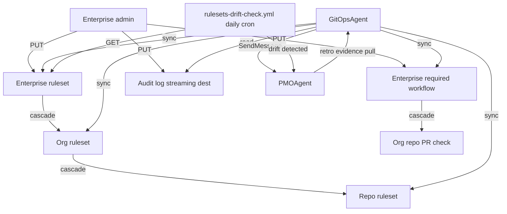

# ADR-162: GitHub Enterprise Cloud Governance-as-Code

## 상태

Proposed (2026-05-09) — CFP-140 carrier.

## 컨텍스트

codeforge 의 governance 결정 (branch protection / required workflow / audit trail) 은 ADR-024 (story-scoped branch policy) + ADR-031 (lane spawn evidence trail) + 각 lane plugin 의 self-write 책임 표 에 분산되어 있다. 그러나:

1. **ADR-024 의 main 직접 push 차단** = 수동 GitHub UI 설정 또는 ad-hoc `gh api repos/.../branches/main/protection` 호출 — drift 검출 mechanism 부재.
2. **Required Workflow** = consumer-side manual copy (`templates/github-workflows/` 11 yml → consumer `.github/workflows/`) — version drift 발생 시 silent broken state.
3. **Audit log evidence** = Story §14 Lane Evidence (ADR-031) 가 self-reported. GitHub 측 actual audit log 와 cross-validate mechanism 없음 → tampering 감지 불가.
4. **GHEC governance feature (rulesets / required workflows / audit log streaming) 모두 GA** (2024 Q3-Q4) — codeforge 가 활용하지 않으면 enterprise 가치 미실현.

본 결정 = 위 3 영역 (ruleset / required workflow / audit log) 을 IaC + drift detect + cross-validate 패턴으로 통합. Issue Types + sub-issues 1st-class 전환은 별개 axis (label-registry MAJOR bump 영향) — ADR-049 단독.

## 결정

**1. Rulesets-as-code 3-layer 도입** — `templates/rulesets/{repo,org,enterprise}-default.json` 3 file 신설. JSON spec ↔ live state 매핑은 GitHub REST API (`PUT /repos/{owner}/{repo}/rulesets/{ruleset_id}` / `/orgs/{org}/rulesets/...` / `/enterprises/{enterprise}/rulesets/...`). 우선순위 = enterprise > org > repo (cascade). 동일 ruleset name 은 3-layer 간 금지 (sync-rulesets.sh validate 단계 의무).

**2. Custom Properties ABAC 도입** — `templates/custom-properties.yaml` 신설. 4 property 시작:
   - `criticality` (allowed: `high` / `medium` / `low`, default: `medium`)
   - `story_key_prefix` (string, e.g., `CFP` / `MCT`)
   - `component` (allowed: 다중 — overlay 정의)
   - `live_touching` (boolean, default: `false`)
ruleset `conditions[].repository_property` 로 targeting (예: `criticality=high` repo 만 stricter rule cascade).

**3. Required Workflows enterprise sync 도입** — `templates/required-workflows-spec.yaml` 신설. core 6 workflow 등록:
   - `phase-gate-mergeable.yml`
   - `phase-label-invariant.yml`
   - `story-section-1-immutable.yml`
   - `fix-ledger-sync.yml`
   - `lane-evidence-check.yml`
   - `post-merge-followup.yml`
   target = `all` (enterprise) 또는 `with property:<key>=<value>` (Custom Properties ABAC). per-consumer drift 감지 시 PMOAgent 로 SendMessage escalation.

**4. Audit log streaming + evidence cross-validate 도입** — `templates/audit-log-events-spec.md` 신설. event 분류:
   - **review_verdict**: `pl_recommendation` write, `decision_state` transition (review-verdict v4 packet, ADR-035)
   - **lane_evidence**: Story §14 row append (ADR-031)
   - **fix_ledger**: Story §10 FIX event (fix-event-v1 contract)
   - **governance_change**: ruleset / required workflow / Custom Properties write (본 ADR scope)
GraphQL Audit Log API (`enterprise.auditLog`, 5000 pt/hr) + REST `/orgs/{org}/audit-log` (100/page). 외부 SIEM destination (Splunk / Datadog / Azure Event Hubs / AWS S3) = enterprise admin one-time setup — codeforge scope 외 (consumer-guide 안내만).

**5. drift-check workflow 신설** — `templates/github-workflows/rulesets-drift-check.yml` (daily cron). 3-layer ruleset JSON spec ↔ live state diff 계산. drift 발견 시 SendMessage to PMOAgent + audit Issue (label `drift-detected`).

**6. enterprise admin role gate 신설** — `scripts/check-enterprise-admin.sh` prerequisite. enterprise-level governance ops (Area 1 enterprise ruleset / Area 2 enterprise required workflow / Area 3 enterprise audit log GraphQL) 진입 전 fail-fast.

**7. Trust boundary 정의 (Story §7.1 정합)**:
   - **B-1**: Enterprise admin token ↔ GitOpsAgent (Area 1-3 enterprise-level)
   - **B-2**: GitHub Audit Log API ↔ codeforge governance trace (read-only, GitOpsAgent 만 read)
   - **B-3**: Custom Properties ABAC 경계 (org admin 만 property write — GitHub native)
   - **B-4**: external SIEM destination ↔ enterprise admin (codeforge 비-touch)

**8. ADR-024 amendment**: ruleset 으로 main 직접 push 차단 의 IaC 보강. 기존 manual branch protection 결정 무손상 — drift detect 추가만.

**9. ADR-031 amendment**: §14 Lane Evidence row 와 GitHub Audit Log API event 1:1 cross-validate 의무. retro evidence pull = peer SendMessage (GitOpsAgent → audit-trail-fetch.sh).

**10. GitOpsAgent mandate 4 area 확장 (codeforge-pmo plugin SSOT)**: rulesets / custom-properties / required-workflows-spec / audit-log-events-spec ownership. self-write boundary 7 row (Area 1: 3 row + Area 2: 1 row + Area 3: 2 row + Area 4: deferred to ADR-049).

## 결과

### 긍정

- ADR-024 manual branch protection drift 차단 (daily drift-check)
- consumer-side workflow version drift 차단 (enterprise required workflow)
- Story §14 Lane Evidence tampering 감지 가능 (audit log cross-validate)
- ADR-009 wrapper agent 0 invariant 무손상 (GitOpsAgent mandate 확장 = lane plugin 영역)
- mclayer org repo 만 enterprise child = blast radius limited (env isolation)

### 부정 / Trade-off

- enterprise admin role 의존 (GHEC default mode + enterprise admin token 부재 시 graceful skip — graceful degradation 패턴)
- audit log retention 180일 default → retro window > 180일 시 fail-soft (retro file note "audit window exceeded")
- GraphQL 5000 pt/hr rate limit → batch + cursor pagination 의무
- 3-layer ruleset 75 한도 → 90% threshold (68개) warning + drift-check daily count monitor 의무
- 외부 SIEM destination 통합 = consumer-side (enterprise admin one-time setup) — codeforge 가 통합 안 함

### 영향 받는 영역

- `mclayer/plugin-codeforge` (wrapper): 본 ADR file + CLAUDE.md "Lane plugin self-write boundary" 표 codeforge-pmo row 갱신
- `mclayer/plugin-codeforge-pmo` (canonical — 현 `plugins/codeforge-pmo/`, 구 repo 삭제됨 2026-06-12): GitOpsAgent.md mandate 11 → 14 area 확장 + CLAUDE.md self-write 표 7 row 추가
- `templates/rulesets/**` (3 file 신규)
- `templates/custom-properties.yaml` (신규)
- `templates/required-workflows-spec.yaml` (신규)
- `templates/audit-log-events-spec.md` (신규)
- `templates/github-workflows/rulesets-drift-check.yml` (신규)
- `scripts/{sync-rulesets,sync-required-workflows,audit-trail-fetch,check-enterprise-admin}.sh` (4 file 신규)
- `docs/inter-plugin-contracts/MANIFEST.yaml` (sub-CFP — kind:registry 신규 entry 검토 후속)

### Operational risk (§7.4 정합)

- DR / failover: enterprise audit log streaming destination 장애 → GraphQL/REST API fallback (codeforge 측 비-의존)
- Cancel-on-disconnect: migration script `--apply` SIGTERM → 진행 중 batch 완료 후 graceful exit
- Clock skew: **N/A** (GHEC API server-side timestamp)
- Rate limit: GraphQL 5000 pt/hr → batch + cursor pagination
- Env isolation: mclayer org = single enterprise child org

## 해소 기준

N/A — permanent policy



## 관련 파일

- `docs/stories/CFP-140.md` (Story file SSOT — internal-docs `wrapper/stories/CFP-140.md` 정합)
- `docs/change-plans/cfp-140-ghec-governance.md` (Change Plan, internal-docs `wrapper/change-plans/cfp-140-ghec-governance.md`)
- `docs/adr/ADR-024-story-scoped-branch-policy.md` (amended by 본 ADR)
- `docs/adr/ADR-031-lane-spawn-evidence-trail.md` (amended by 본 ADR)
- `docs/adr/ADR-049-issue-types-native-migration.md` (sibling, Issue Types 단독)
- `mclayer/plugin-codeforge-pmo/agents/GitOpsAgent.md` (mandate 4 area 확장)
- `mclayer/plugin-codeforge-pmo/CLAUDE.md` (self-write 표 7 row 추가)
