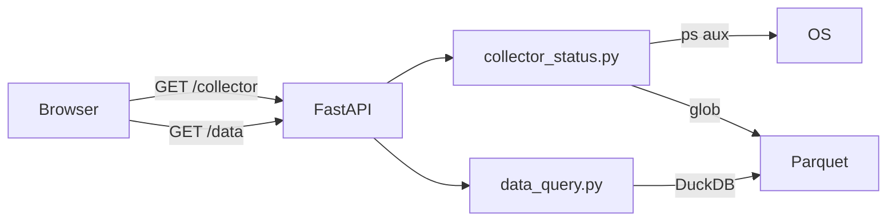

# ADR-010: Dashboard Web Interface (FastAPI + Jinja2 + Bootstrap 5)

## 상태
Accepted

## 컨텍스트
수집 상태 모니터링과 수집된 데이터 조회를 위한 웹 인터페이스가 필요했다.
백테스트 결과 조회용 대시보드(`/`, `/runs`, `/run/{id}`)가 이미 존재했으며
동일 스택에 `/collector`(수집 상태)와 `/data`(데이터 조회) 페이지를 추가하는 방식을 택했다.

## 결정
FastAPI + Jinja2 템플릿 + Bootstrap 5 (dark theme)로 서버사이드 렌더링 방식의 대시보드를 구현한다.

### 구현 범위
- `/collector` — CollectorService 프로세스 상태, 심볼별 row 수, 오늘의 Parquet 파일 목록
- `/api/collector/status` — JSON API
- `/data` — DuckDB로 Parquet 조회, 결과 테이블 렌더링
- `/api/data/query` — JSON API (MAX_ROWS=200)

### 기술 선택 근거
| 옵션 | 선택 이유 |
|------|-----------|
| FastAPI | 이미 백테스트 대시보드에 사용 중, 재사용성 |
| Jinja2 SSR | 클라이언트 JS 최소화, 단순한 모니터링 UI에 적합 |
| Bootstrap 5 dark | 기존 대시보드와 일관성 유지 |
| DuckDB | ADR-003에서 결정된 쿼리 엔진 재사용 |

## 결과
- ✅ 기존 FastAPI 앱에 라우트 추가로 빠른 구현
- ✅ DuckDB hive-partitioned Parquet 조회 재사용
- ⚠️ SSR이므로 실시간 업데이트는 30초 자동 새로고침으로 처리 (WebSocket 미사용)

## 다이어그램

## 관련 파일
- `src/mctrader/dashboard/server.py`
- `src/mctrader/dashboard/collector_status.py`
- `src/mctrader/dashboard/data_query.py`
- `src/mctrader/dashboard/templates/collector.html`
- `src/mctrader/dashboard/templates/data.html`
