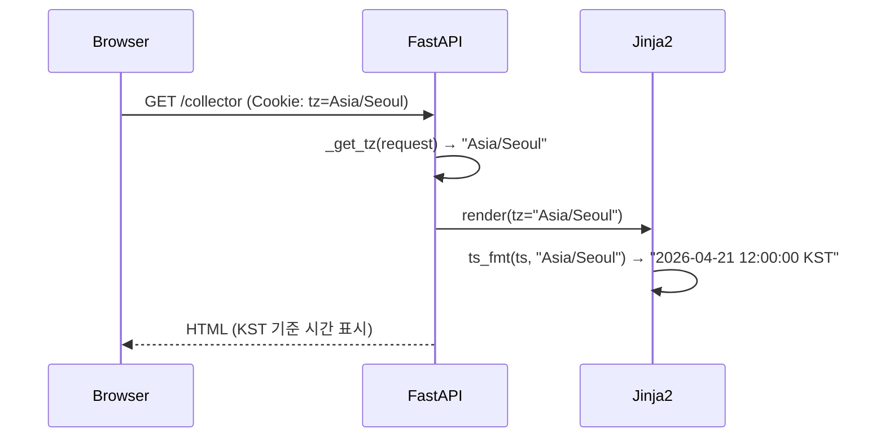

# ADR-011: 서버사이드 타임존 변환 (zoneinfo + cookie 기반 선택)

## 상태
Accepted

## 컨텍스트
대시보드에 UTC와 KST 기준 타임스탬프가 혼재해 가독성이 떨어졌다.
Airflow Web UI처럼 사용자가 타임존을 선택하면 모든 시간 표시가 해당 기준으로 변환되어야 했다.

## 결정
- 타임존 선택: navbar dropdown → `tz` 쿠키 저장 (`max-age=31536000`, 1년)
- 서버사이드 변환: Python `zoneinfo` (stdlib, 3.9+) 로 epoch ms → 포맷된 문자열
- Jinja2 커스텀 필터 `ts_fmt(tz_name)` 로 템플릿에서 직접 호출
- 지원 타임존: `UTC`, `Asia/Seoul` (KST)

### 클라이언트사이드 변환 미채택 이유
- JS `Intl.DateTimeFormat` 은 브라우저마다 포맷이 다름
- SSR 대시보드에서 서버가 이미 데이터를 갖고 있으므로 서버 변환이 자연스러움
- 클라이언트 컴퓨팅 부담 최소화 (사용자 요구사항)

### 구현 핵심
```python
# zoneinfo 기반 변환
from zoneinfo import ZoneInfo

def _ts_fmt(value, tz_name="UTC"):
    if value is None:
        return "—"
    ts_ms = value * 1000 if value <= 1e12 else value
    dt = datetime.fromtimestamp(ts_ms / 1000, tz=ZoneInfo(tz_name))
    abbrev = _TZ_ABBREV.get(tz_name, tz_name)
    return dt.strftime(f"%Y-%m-%d %H:%M:%S {abbrev}")

# 쿠키 읽기
def _get_tz(request: Request) -> str:
    tz = request.cookies.get("tz", "UTC")
    return tz if tz in _SUPPORTED_TZ else "UTC"
```

## 결과
- ✅ 모든 타임스탬프 컬럼이 선택된 타임존 기준으로 일관되게 표시
- ✅ 페이지 새로고침 없이 쿠키 변경 후 reload로 즉시 반영
- ✅ 잘못된 `tz` 쿠키 값은 자동으로 UTC fallback
- ⚠️ 현재 UTC, KST 두 가지만 지원 (Tokyo, New York 등 추가 가능)

## 다이어그램



## 관련 파일
- `src/mctrader/dashboard/server.py` — `_ts_fmt`, `_get_tz`, `_SUPPORTED_TZ`
- `src/mctrader/dashboard/templates/base.html` — navbar dropdown + `setTz()` JS
- `src/mctrader/dashboard/templates/collector.html`
- `src/mctrader/dashboard/templates/data.html`
