# ADR-050: Multi-Repo Hierarchical Story Key System

## 상태

Accepted (2026-05-09) — CFP-342 carrier.

## 컨텍스트

Multi-repo consumer (mctrader 첫 사례 — 1 hub + 5 impl repo) 가 모든 Story file 을 hub repo flat namespace 에 저장하는 현행 패턴은 두 가지 페인 포인트를 야기:

1. **가독성 손상**: `MCT-107` 키만으로는 어느 impl repo 작업인지 식별 불가
2. **Locality 위반**: `mctrader-market` 구현 상세가 `mctrader-hub`에 저장됨. 작업 히스토리가 코드와 분리되어 maintenance 부담 누적

ADR-020 Amendment 1 (CFP-81) 가 도입한 Mode B (hub-centralized) 는 본 패턴의 *조직적 결정* SSOT 이지만, **mechanism layer** (file 자동 라우팅 / counter 발급 / cross-repo bidirectional linking) 는 미정의. Mode B 를 manual 운영 시:
- Story file 위치 결정 사람이 매번 판단
- Key sequence 충돌 방지 사람이 매번 검사
- Hub story → impl repo story 위임 링크 수동 보존

본 결정 = ADR-020 Mode B 의 **automation backbone** 도입. consumer 가 `project.yaml` 한 블록만 선언하면 codeforge plugin 이 hub vs impl repo 결정 / counter 발급 / file routing / bidirectional linking 자동 수행.

**Why now**: mctrader debut audit timing — 첫 cross-repo Epic Story 진행 시점에 본 시스템 가치 폭발. Phase 1 = schema + 문서 (본 ADR carrier), Phase 2 = mechanism 구현 (별도 follow-up CFP scope, Q5.5-Q1 사용자 결정).

## 결정

### 결정 1: `codeforge.stories` 블록 opt-in schema (기존 동작 보존)

`.claude/_overlay/project.yaml` 에 신규 top-level 블록 `codeforge.stories.*` 도입. **opt-in only** — single-repo consumer 또는 기존 multi-repo consumer (mctrader 현행 MCT-1~MCT-111 flat) 는 본 블록 부재 시 변경 0건 동작.

```yaml
codeforge:
  stories:
    hub:
      key_pattern: "{prefix}-{seq:03d}"   # 또는 자유 format string
      story_dir: docs/stories
      template: hub-story.md
    repo_key_pattern: "{prefix}-{seq:03d}"
    counters:
      path: .codeforge/counters.json
      lock: file
    repos:
      - name: <repo-name>                 # required, repo 식별자
        role: governance | implementation # required, enum
        path: <local-absolute-path>       # implementation 시 required, sibling checkout 위치
        github: <owner/repo>              # implementation 시 required
        story_dir: docs/stories           # default
        components: [<comp1>, <comp2>]    # implementation 시 권장 (target repo 결정 fallback)
        creates_repo_stories: true|false  # governance role 의 경우 false
```

**활성화 트리거**: `codeforge.stories.repos[]` 에 1개 이상 entry 선언 시 multi-repo 모드 활성. 부재 시 single-repo flat 모드 유지.

**Schema validation**: `overlay/hooks/validate_config.py` `SCHEMA_RULES` table 에 신규 entry 추가 — `codeforge` / `codeforge.stories` / `codeforge.stories.hub.*` / `codeforge.stories.counters.*` / `codeforge.stories.repos` (list-of-dict) / 각 repo entry 의 sub-field. nested list-of-dict validation 신규 helper `_is_list_of_repo_entries()` 도입 (현재 `_is_list_of_str` 만 존재).

### 결정 2: Hub story (`story_scope: hub`) + Repo story (`story_scope: repo`) frontmatter 분리

Story file frontmatter 에 신규 4 필드 도입. 기존 frontmatter (`key` / `title` / `status` / `type` / `github_issue` / `epic_dependencies` / `epic_owner_repo`) 와 backward-compat — 신규 필드 부재 시 legacy 동작 유지.

| 필드 | 타입 | 적용 | 의미 |
|---|---|---|---|
| `story_scope` | enum | 모든 story | `hub` / `repo` / `legacy-hub` (CFP-342 후 신규 작성 시 의무) |
| `repo` | string | `story_scope: repo` 시 required | impl repo 이름 (`project.yaml repos[].name` 정합) |
| `hub_story` | string \| null | `story_scope: repo` 시 optional | parent hub story KEY. 단독 repo story = `null` |
| `delegates` | list of dict | `story_scope: hub` 시 의무 | `[{story_key, repo, path, status}]` — hub → impl 위임 링크 |

**Hub story 본문 섹션** (간소화 — `templates/hub-story.md` 신설):
- Background (배경·문제·도메인 이유)
- Direction (결정 경계·결과·cross-repo 제약)
- Delegation (table: Repo | Story | Responsibility)
- Acceptance Gates (위임 repo story 존재 / ADR / cross-repo contract)
- Links (delegated 목록)

**Repo story 본문 섹션** (`templates/repo-story.md` 신설):
- Background (repo-local 문제 + hub direction 링크)
- Implementation Scope (변경 대상 file/module)
- Technical Design (구현 상세)
- Acceptance Criteria
- Test Plan
- Links (Hub / ADRs)

기존 `templates/story-page-structure.md` 의 §1-§14 strict mode = 단일 repo Story (예: CFP-342 자체) 또는 Mode A consumer 적용. Multi-repo consumer 의 hub / repo story 는 본 결정의 simplified 템플릿 사용.

### 결정 3: `.codeforge/counters.json` file-lock counter 메커니즘

Hub repo root 의 `.codeforge/counters.json` 가 각 repo 별 독립 시퀀스 SSOT. **GitHub Issue 번호에 의존하지 않음** — offline 작동 + Story file 선행 생성 보장.

```json
{
  "version": 1,
  "prefix": "MCT",
  "counters": {
    "<hub-repo>":   { "next": 112 },
    "<impl-repo-1>": { "next": 1 },
    "<impl-repo-2>": { "next": 1 }
  },
  "reservations": {}
}
```

**Lock 정책**:
- Phase 1 = file-system lock 표준 명시 (cross-platform `filelock` library 사용 권장 — POSIX `fcntl` + Windows `msvcrt` 통합)
- Phase 2 = 실제 implementation 결정 (별도 follow-up CFP scope per Q5.5-Q1)
- 본 ADR scope = lock semantic 정의 — write 시 acquire / 발급 후 release / parser 충돌 시 reconcile

**Reconciliation rule** (race-resilience):
- Counter 발급 직전 `Glob(<repo>/<story_dir>/<PREFIX>-*.md)` 으로 file-system max 확인
- counter `next` < file-system max+1 시 자동 보정 (counter `next = max+1`)
- counter `next` >= file-system max+1 시 counter 신뢰 (정상 path)
- 기존 파일명 reconciliation 실패 (parse error 등) → 별도 audit log + Orchestrator escalate

**Concurrent creation**: 단일 lock 으로 sequential 직렬화. 동일 repo 동시 2 story 생성 시도 시 1개 success / 1개 retry. Retry 정책 (automatic backoff vs user notify) 은 Phase 2 implementation 결정 (Spec U2 미결).

### 결정 4: Agent target repo 결정 순서 (frontmatter → component fallback)

Agent (RequirementsPL / DesignAgent / DeveloperPL 등) 가 작업할 target repo 를 다음 priority 로 결정:

1. **Frontmatter primary**: Story file frontmatter 의 `story_scope: repo` + `repo: <name>` 명시 → 해당 repo 직접 지정
2. **Hub fallback**: `story_scope: hub` → hub repo (governance role)
3. **Component fallback** (legacy / 명시 부재): GitHub Issue 의 `component:*` label → `project.yaml repos[].components` mapping
4. **ESCALATE**: 1-3 모두 실패 (mapping ambiguous / repo 미존재) → Orchestrator 경유 사용자 명시 요청

**Component multi-mapping 처리**: 동일 component 가 N (>=2) repo 의 `components[]` 에 등장 시 → mapping ambiguous → ESCALATE 발화 의무 (Spec E6).

### 결정 5: Backward compat — `story_scope` 없는 기존 story = `legacy-hub` 처리

기존 mctrader MCT-1 ~ MCT-111 (story_scope 없음) 은 다음 룰로 무손상 보존:

- **Rename / move 절대 금지** — 기존 file path / git history / commit chain 유지
- **Frontmatter 자동 추가 X** — touched 시 author 가 manual 옵트인 (Spec Q5.5-Q5 — 사용자 결정 default = manual)
- **Agent fallback**: frontmatter 부재 = `story_scope: legacy-hub` 묵시 처리 (= hub repo 작업, 결정 4 step 2 와 동일 effect)
- **Hub counter 초기화**: `next = 112` (mctrader 사례) — 기존 file-system max + 1
- **Impl counter 초기화**: `next = 1` (각 impl repo 첫 story 발행 시점)

**Legacy → Multi-repo 전환 시점 강제 X**: consumer 가 `project.yaml` `codeforge.stories.repos[]` 선언 후에도 기존 hub flat story 진행 가능. 신규 story 부터만 multi-repo system 활성 (Mode B 자동화).

### 결정 6: ADR-020 Mode B 의 automation layer 정합

ADR-020 Amendment 1 §결정 8 Mode B (hub-centralized) 가 본 시스템의 **default 사용 시나리오**.

- **Mode A (repo-local) 정합**: `codeforge.stories.repos[]` 에 `role: implementation` repo 만 declare + `creates_repo_stories: true` → 각 repo 자체 story_dir 보유 (Mode A automation)
- **Mode B (hub-centralized) 정합**: `role: governance` 1개 + `role: implementation` N개 + 각 impl repo `creates_repo_stories: true` → hub story (governance) + repo story (impl) 분리 (mctrader 패턴, 본 시스템 default)
- **Mode C (mechanical Epic) 정합**: ADR-020 Amendment 2 §Mode C 와 직교 — mechanical batch 는 child story Issue 미발행 + parent Story §11 link 모음. 본 시스템의 hub story 는 substantive 결정 carrier — Mode C 와 별 axis (Mode C = wrapper / hub 단일 owner, hub story `delegates[]` 미사용)

**§결정 9 (Joint-phase narrow form) 정합**: 1 Story 가 multi-repo 의 joint Phase N PR 보유 가능. 본 시스템에서 = hub story `delegates[]` 다중 entry → 각 impl repo story 가 동일 Story 의 일부 phase 진행. PR title / commit footer 가 동일 Story key reference (예: `mctrader-data#MCT-001` + `mctrader-engine#MCT-002` 가 hub `mctrader-hub#MCT-112` 의 joint Phase 2).

**ADR-020 Amendment 3 cross-ref**: 본 ADR-050 가 ADR-020 Mode B 의 implementation backbone 임을 ADR-020 Amendment 3 (별도 단순 cross-ref) 가 명시.

## 거부된 대안

### 대안 A: ADR-020 Amendment 3 단일 — 별도 ADR 미신설

ADR-020 의 Amendment 3 로 본 시스템 mechanism 모두 흡수.

- **거부 사유**:
  - ADR-020 = *조직 패턴* SSOT (where Story files live), 본 시스템 = *mechanism* SSOT (how to create / route / link)
  - 두 도메인 분리 시 향후 mechanism evolution (Phase 2 mechanism 구현 / U1 CLI / U2 concurrency policy) 이 ADR-020 본문 hijack
  - Researcher §6 (MADR multi-repo 패턴) + Analyst §5.5 Q2 양쪽 모두 분리 권장
  - ADR-020 Amendment 1+2 가 이미 substantial — Amendment 3 가 mechanism 까지 carry 시 ADR readability 손상

### 대안 B: Story prefix multi (예: `MCT-DATA-001`)

각 impl repo 별 prefix 세그먼트 (`{prefix}-{repo-id}-{seq}`) 도입.

- **거부 사유**:
  - 가독성 손상 (key length 증가, GitHub renderer auto-link 깨짐)
  - 기존 prefix 호환 불가 (`MCT-` → `MCT-DATA-` migration cost)
  - File 위치 자체가 namespace 충분 (Atlassian / Linear 표준 — Researcher §6.2 (1) 정합)

### 대안 C: Counter 발급을 GitHub Issue 번호와 sync

`mctrader-data#001` = GitHub Issue #1 / `mctrader-data#002` = #2 형식으로 1:1 alignment.

- **거부 사유**:
  - Offline 작동 불가 (Issue 발행 전 story 생성 불가)
  - Story 와 Issue 의 lifecycle 동결 (story 만 closed / Issue 만 closed 케이스 처리 어려움)
  - Cross-repo 시 Issue 번호 collision 발생 (각 repo 자체 시퀀스)
  - `.codeforge/counters.json` 이 더 race-resilient + version control friendly

### 대안 D: Counter 를 hub repo `.claude-work/` 디렉터리에 저장 (gitignored)

Counter file 을 ephemeral cache 로 처리.

- **거부 사유**:
  - Counter SSOT 가 git history 부재 시 audit trail 불가
  - Multi-developer collaboration 시 counter drift (각자 local cache)
  - `.codeforge/` (committed) vs `.claude-work/` (ephemeral) 분리 의도와 모순 (Spec §5.6 #1)

### 대안 E: 모든 변경 = Phase 1 PR 단일 (mechanism 포함)

Schema + 문서 + counter mechanism + Story dispatcher 모두 단일 PR.

- **거부 사유**:
  - Phase 1 PR scope 비대 (검토 부담 + risk 증가)
  - mctrader debut audit timing 정합 — schema 우선 land 후 mctrader Story 진행 가능 (mechanism 은 follow-up)
  - User explicit decision (Q5.5-Q1) = 분리

## 결과

### 긍정

- **Locality 원칙 보존**: 스토리가 코드 옆에 위치 (각 impl repo 자체 history 소유)
- **가독성 향상**: `mctrader-data#MCT-001` cross-repo reference 가 GitHub native auto-link
- **Offline 작동**: GitHub Issue 의존 없음 — story 선행 생성 가능
- **Backward compat**: 기존 mctrader MCT-1~MCT-111 무영향 (rename/move 0)
- **Consumer extensibility**: 다른 multi-repo consumer 가 `project.yaml` 선언만으로 동일 체계 사용 (codeforge plugin 변경 0)
- **Mode B 자동화**: ADR-020 Mode B manual 운영 부담 제거

### 부정 / Trade-off

- **`project.yaml` 복잡도 증가**: 신규 schema block 1개 (`codeforge.stories.*`) — opt-in 으로 single-repo consumer 영향 0
- **Schema validation 코드 증가**: `validate_config.py` SCHEMA_RULES 신규 ~10 entry + nested list-of-dict helper
- **Phase 2 mechanism 구현 의존**: schema 만으로는 manual 운영 (counter 자동 발급 / agent target 결정 자동화 미적용 — follow-up CFP scope)
- **ADR-041 update 의무**: `docs/doc-locations.yaml` 의 `story_file` row 에 `multi_repo_hub` / `multi_repo_impl` variants 추가 (Phase 1 PR scope)
- **Counter file race risk**: file lock semantic 만 정의 — 실제 implementation 결함 시 counter drift 가능 (Phase 2 implementation 의 핵심 risk, Spec U2 미결)

### 영향 받는 영역 (Phase 1 PR scope)

| Area | File | 변경 |
|---|---|---|
| Schema | `docs/project-config-schema.md` | §2 schema YAML 에 `codeforge.stories.*` 블록 추가, §3 multi-repo 예시 추가, §4a Read 전담 신규 entry |
| Schema | `overlay/hooks/validate_config.py` | SCHEMA_RULES 신규 entry + `_is_list_of_repo_entries()` helper |
| Schema | `overlay/_overlay/project.yaml.example` | commented `codeforge.stories` 블록 추가 (옵트인 marker) |
| Templates | `templates/story-page-structure.md` | frontmatter 4 필드 명시 추가 (`story_scope` / `repo` / `hub_story` / `delegates`) |
| Templates | `templates/hub-story.md` | (신규) Hub story 템플릿 |
| Templates | `templates/repo-story.md` | (신규) Repo story 템플릿 |
| Doc | `docs/consumer-guide.md` | §3 신규 sub-section "multi-repo story key 활성화" |
| Doc | `docs/doc-locations.yaml` | `story_file` row 에 `multi_repo_hub` + `multi_repo_impl` variants 추가 |
| ADR | `docs/adr/ADR-020-cross-repo-epic-pattern.md` | Amendment 3 cross-ref 추가 (단순 1 단락) |

### 영향 없음 (확인 의무)

- `templates/github-workflows/{phase-gate-mergeable,subissue-from-impl-manifest,post-merge-followup,retro-mandatory}.yml` — Story file 단위 invariant. multi-repo path 변화 없음
- `docs/inter-plugin-contracts/*.md` — review-verdict / requirements-output / design-output 등. story file 위치는 contract field outside
- 6 lane plugin agent file — agent target repo 결정 로직 추가 = 별도 lane plugin CFP scope (codeforge-requirements / codeforge-design 자체 결정)

### Phase 2 (mechanism 구현) — 별도 follow-up CFP scope

- `templates/github-workflows/story-init.yml` 의 multi-repo branch 추가 (현재 single-repo 가정 line 5)
- `scripts/codeforge-story-counter.{sh,py}` 신설 — counter 발급 + lock + reconciliation
- `scripts/codeforge-story-create.{sh,py}` 신설 — Story 생성 dispatcher
- Counter file lock library 의존성 결정 (`filelock` vs custom `fcntl`)
- Agent prompt multi-repo target 결정 로직 추가 (lane plugin 자체 결정)

## 6 deputy synthesis (audit trail)

본 결정은 codeforge-design lane 의 6 deputy 통합 산출물을 ArchitectAgent (chief author) 가 합성. 각 deputy 핵심 input:

| Deputy | §섹션 input | 핵심 채택 / 반박 |
|---|---|---|
| **CodebaseMapperAgent** | as-is `validate_config.py` SCHEMA_RULES table 구조 + `story-init.yml` Action 의 single-repo line 5 가정 + 기존 `docs/doc-locations.yaml` taxonomy | 채택: opt-in 블록 형식 = 기존 schema validator 패턴 정합. 반박 없음 |
| **RefactorAgent** | 결합도 감소 = `codeforge.stories` 블록 단일 entry-point + template 분리 (hub-story.md / repo-story.md) | 채택: opt-in only = 기존 single-repo flow 무손상. Template 분리 = `story-page-structure.md` 의 strict mode 와 simplified mode coexistence |
| **SecurityArchitectAgent** | Trust boundary B1 (`project.yaml repos[].path` arbitrary local path) + B2 (`.codeforge/counters.json` git tracking) | 채택: B1 = plugin 이 path 를 shell execute 안 함 + read-only filesystem access only. B2 = committed (audit trail) — credential 미포함. §7.5 민감 데이터 = N/A (path = non-secret), §7.7 위협-완화 매핑 = path traversal 방지 (filesystem read 시 path canonicalize). U8 (path security 강화) 는 별도 CFP scope |
| **TestContractArchitectAgent** | AC-1 ~ AC-8 8개 + invariant I1 (counter monotonic) / I2 (file ↔ counter consistency) / I3 (story_scope ↔ file location) / I4 (delegates ↔ repo story bidirectional) / I5 (legacy backward compat) | 채택: §8 Test Contract 8 AC + 5 invariant. 반박: AC-4(c) reconciliation 의 lockfile-based reconcile = Phase 2 implementation detail (본 ADR scope = semantic 만) |
| **DataMigrationArchitectAgent** | §11 Migration: legacy MCT-1~111 backward compat (rename/move 0) + counter 초기화 (hub `next: 112`, impl `next: 1`) + `story_scope` opt-in (manual) + `superseded_by` optional | 채택: 모든 결정. 반박: legacy story 의 `superseded_by` field = optional (사용자 결정), invariant 강제 X |
| **OperationalRiskArchitectAgent** | §7.4: counter file lock (concurrent creation race) + atomic write (rename pattern) + reconciliation rule (file-system max ↔ counter `next`) + Phase 2 retry policy | 채택: lock semantic 명시 + reconciliation rule 정의. **CONDITIONAL N/A**: §7.4.1 (DR / disconnect — multi-repo 가 networked dependency 아님), §7.4.4 (rate limit — local file ops 만), §7.4.5 (env isolation — hub repo 단일). §7.4.2 (cancel-on-disconnect) + §7.4.3 (clock sync) = N/A |

### 6 deputy 7-row mandate matrix 충족 (CFP-46 / ADR-014)

| §섹션 sub | Owner | Coverage |
|---|---|---|
| §7.1 Trust boundary | SecurityArch | B1 (path) + B2 (counter file) 명시 |
| §7.2 Threat model | SecurityArch | STRIDE-LITE: Tampering (counter file) / Information Disclosure (path leak) — minimal 위험 |
| §7.3 Auth/authz | SecurityArch | N/A — local file ops only, no auth |
| **§7.4 Operational risk** | **OpRiskArch** | **§7.4.1-§7.4.5: counter race (active) / DR (N/A) / clock (N/A) / rate (N/A) / env (N/A)** |
| §7.5 민감 데이터 | SecurityArch | N/A — path = non-secret |
| §7.6 위협↔완화 매핑 | SecurityArch | path canonicalize (traversal 방지) + file lock (counter race 방지) |
| §11 Schema/Migration | DataMigrationArch | legacy backward compat + counter 초기화 + frontmatter opt-in |
| **§11.6 Idempotency (CONDITIONAL)** | **DataMigrationArch primary + OpRiskArch consult** | **counter increment idempotency: file lock + reservation slot + retry-safe** |
| §8 Test Contract | TestContractArch | AC-1~AC-8 + I1-I5 |

## 다이어그램

```mermaid
graph TD
    Consumer[Consumer project.yaml] -->|opt-in| StoriesBlock[codeforge.stories block]
    StoriesBlock --> Validator[validate_config.py<br/>SCHEMA_RULES check]
    StoriesBlock -->|repos&#91;&#93;| HubRepo[Hub repo<br/>role: governance]
    StoriesBlock -->|repos&#91;&#93;| ImplRepos[Impl repos<br/>role: implementation]
    HubRepo -->|stores| HubStory[Hub Story<br/>story_scope: hub<br/>delegates&#91;&#93;]
    ImplRepos -->|stores| RepoStory[Repo Story<br/>story_scope: repo<br/>repo: name<br/>hub_story: KEY]
    HubStory -.->|bidirectional link| RepoStory
    HubRepo -->|counter SSOT| Counters[.codeforge/counters.json<br/>file lock]
    Counters -->|increment| HubStory
    Counters -->|increment| RepoStory
    LegacyStory[Legacy MCT-1~111<br/>story_scope absent] -->|treated as| LegacyHub[story_scope: legacy-hub<br/>fallback to hub repo]
    Agent[Agent target repo logic] -->|priority 1| FrontmatterRepo[story_scope: repo + repo: name]
    Agent -->|priority 2| FrontmatterHub[story_scope: hub]
    Agent -->|priority 3| ComponentLabel[component:* label<br/>repos&#91;&#93;.components mapping]
    Agent -->|priority 4| Escalate[ESCALATE to user]
```



## 관련 파일

- [`docs/project-config-schema.md`](../project-config-schema.md) §2 schema 확장
- [`docs/consumer-guide.md`](../consumer-guide.md) §3 신규 sub-section
- [`docs/doc-locations.yaml`](../doc-locations.yaml) `story_file` row variants 확장
- [`templates/story-page-structure.md`](../../templates/story-page-structure.md) frontmatter 4 필드
- [`overlay/hooks/validate_config.py`](../../overlay/hooks/validate_config.py) SCHEMA_RULES 신규 entry
- [ADR-020](ADR-020-cross-repo-epic-pattern.md) cross-repo Epic 패턴 (Amendment 3 cross-ref)
- [ADR-041](ADR-041-doc-location-registry.md) doc location registry (multi_repo_hub/impl variants)
- [ADR-013](ADR-013-codeforge-family-dogfood-out-policy.md) dogfood-out policy (consumer 자유 결정 root)
- Spec: [`<internal-docs>/design/specs/2026-05-09-multi-repo-hierarchical-story-keys-design.md`](https://github.com/mclayer/codeforge-internal-docs/blob/main/design/specs/2026-05-09-multi-repo-hierarchical-story-keys-design.md)
- Change Plan: [`<internal-docs>/wrapper/change-plans/cfp-342-multi-repo-story-keys.md`](https://github.com/mclayer/codeforge-internal-docs/blob/main/wrapper/change-plans/cfp-342-multi-repo-story-keys.md)
- Story: [`<internal-docs>/wrapper/stories/CFP-342.md`](https://github.com/mclayer/codeforge-internal-docs/blob/main/wrapper/stories/CFP-342.md)
