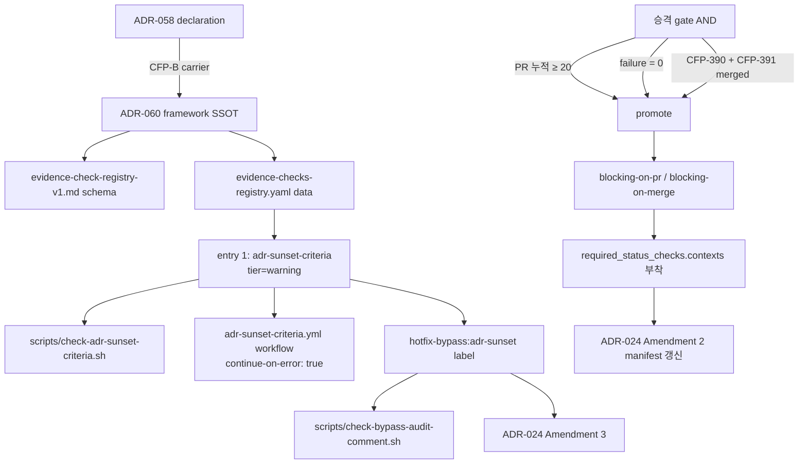

# ADR-060: Evidence-enforceable promotion framework — declaration → warning → enforce 점진 적용 SSOT

## 상태

Accepted (2026-05-11). carrier_story = CFP-389. parent Epic = CFP-388.

## 컨텍스트

ADR-058 (CFP-387, merged 2026-05-11 — internal-docs main `a59fc8a`) 가 ADR `## 해소 기준` 섹션과 `is_transitional` frontmatter 를 의무화했으나 **declaration only** 단계에 머물렀다. §결정 8 명시:

> 본 ADR 은 정책 declaration only. 기계적 강제 (CI lint) 는 CFP-B (잠정) / 정책 첫 적용 사례 (ADR-057 amendment + KPI) 는 CFP-C (잠정) / 기존 안전망 ADR retroactive backfill 은 CFP-D (잠정) 별도 carrier 분리.

본 ADR (ADR-060) 가 **CFP-B 잠정의 carrier** — declaration 의 첫 evidence-enforceable mechanical check 도입 + 모든 후속 evidence check 가 따를 **점진 적용 framework SSOT**.

### 직접 동인

1. **ADR-058 declaration 의 moral governance 한계**: 정책 선언 → 작성자 자발 준수 + DesignReview 1차 안전망 의존. CI mechanical enforcement 부재 시 ADR-057 같은 직접 동인 ADR 의 측정 기준 부재 위험이 재발.

2. **codeforge wrapper repo 의 governance 진화 패턴**: ADR-050 (parallel-epic-conflict-check.yml = warning mode prior art) / ADR-024 Amendment 2 (CFP-280 — branch protection drift detection) / ADR-041 (doc-locations.yaml SSOT) 가 모두 "선언 → 점진 enforce" 패턴 채택. 본 framework 가 패턴을 정형화.

3. **사용자 brainstorming 합의** (Opus×Codex 3-round, 2026-05-11): "안전망 측정가능 종료" 원칙 5 + "evidence-enforceable 점진 적용" 원칙 + "velocity-normalized metric" (throughput 가변 환경에서 sprint-주기 metric 회피).

4. **CFP-388 Epic 3 child Story 의 framework 정합 요구**: CFP-389 (본 framework SSOT) → CFP-390 (인벤토리 backfill = registry yaml row append) → CFP-391 (4-tier 정식 분류 amendment) 의 순차 의존. 3 Story 모두 본 framework registry 위에서 동작.

5. **Hotfix bypass channel 의 필요성**: enforce mode 진입 후 운영 장애 hotfix 가 정책 위반을 강제하는 경우, ADR-024 §결정 6 ("emergency hotfix 도 PR 경유 의무, no exception") + `enforce_admins: true` (CFP-70) 와 호환되는 **audit-trailed exception channel** 부재. 사용자 ESCALATE 결정 (CFP-389 iteration 2) = Option A — `hotfix-bypass:*` label family 도입 + ADR-024 Amendment 3 동반.

### 선행 연구 / prior art

- **Feature flag sunset (LaunchDarkly / Optimizely 운영 가이드)**: 도입 시 sunset criteria + owner + date 의무화. 측정성 3-tuple 패턴 차용.
- **입법 sunset clause 패턴**: 명시적 종료 조건 미충족 시 자동 expire. warning → enforce mode 전환 (=evidence check 의 sunset transition) 으로 변형.
- **CI/CD progressive enforcement (Spotify / Shopify code health migration 가이드)**: 신규 lint 도입 시 advisory → blocking on changed lines → blocking on full repo 3 단계 점진. 본 framework 의 4-tier 분류 (warning / blocking-on-PR / blocking-on-merge / hotfix-bypass) 의 직접 모델.
- **codeforge 내부 prior art**: ADR-050 parallel-epic-conflict-check.yml (non-blocking warning + PR comment + label) / ADR-024 Amendment 2 branch-protection-drift-check.yml (drift detection schedule + workflow_dispatch) 모두 본 framework workflow 양식의 1차 reference.

## 결정

### 결정 1 — Framework SSOT 위치 = `docs/inter-plugin-contracts/evidence-check-registry-v1.md`

evidence-enforceable framework 의 schema doc + 운영 룰 = **kind:registry** entry. 위치 = `docs/inter-plugin-contracts/evidence-check-registry-v1.md`. 분류 근거:

- ADR-058 §결정 8 의 framework declaration 을 mechanical 검증 가능한 **cross-cutting protocol** 로 변환 → kind:contract (lane plugin 간 typed schema) 아닌 kind:registry (wrapper-owned cross-cutting protocol) 정합.
- 기존 3 kind:registry (`comment-prefix-registry-v1` / `fix-event-v1` / `label-registry-v2`) 와 동일 위치 + 동일 lint chain (`check-doc-frontmatter.sh` + `check-doc-section-schema.sh`).
- `inter-plugin-contracts/MANIFEST.yaml` 의 `registries:` 블록에 entry 추가 (label_registry 패턴) — kind:contract `check-inter-plugin-contracts.sh` scope 외 (MANIFEST header `kind:contract files only` 명시 정합).

(§5.5 CL-1 — 권고 채택)

### 결정 2 — Registry data = `docs/evidence-checks-registry.yaml` (single SSOT)

본 framework 의 모든 evidence check entry 는 단일 yaml file `docs/evidence-checks-registry.yaml` 에 정의. schema 는 `evidence-check-registry-v1.md` SSOT. MANIFEST.yaml `registries:` 블록은 **versioning 추적 only** (label-registry-v1 → v2 패턴 reference, version bump 시 row append). data 자체는 yaml.

(§5.5 CL-1 추가 명시 — MANIFEST = versioning, yaml = data)

### 결정 3 — 4-tier enforcement enum (정식 도입)

evidence-checks-registry.yaml 의 각 entry 는 `current_tier` 필드 보유. enum:

| tier | 동작 | branch protection 영향 |
|---|---|---|
| `warning` | continue-on-error 또는 non-required check. PR comment / job summary 경고만. | required_status_checks.contexts 미부착 |
| `blocking-on-pr` | required check. PR merge 차단. | required_status_checks.contexts 부착 |
| `blocking-on-merge` | post-merge guard (예: phase-gate-mergeable). PR open 단계는 통과, merge 시점 차단. | required_status_checks.contexts 부착 |
| `hotfix-bypass` | bypass label 적용 PR 만 skip + audit comment 의무. label 부재 시 blocking-on-pr 등가. | required_status_checks.contexts 부착 (+ bypass workflow) |

본 ADR (CFP-389) 의 첫 entry = `warning` tier. 후속 Story (CFP-391) 가 본 enum 을 정식 명시 + 기존 entry retroactive 분류. 본 ADR 시점에서는 enum 정의만 제공, registry yaml 의 `current_tier` 필드는 optional (CFP-391 시점 required 전환 = MINOR bump).

### 결정 4 — 첫 entry = ADR sunset criteria lint (`scripts/check-adr-sunset-criteria.sh`)

evidence-checks-registry.yaml 의 첫 entry:

```yaml
- name: adr-sunset-criteria
  description: ADR-058 §결정 1-3 mechanical verification (is_transitional frontmatter + ## 해소 기준 섹션 + 측정성 3-tuple + 모달 어휘 1차 사전)
  detect_command: bash scripts/check-adr-sunset-criteria.sh
  workflow: templates/github-workflows/adr-sunset-criteria.yml
  current_tier: warning
  bypass_label: hotfix-bypass:adr-sunset
  bypass_audit_lint: bash scripts/check-bypass-audit-comment.sh
  promotion_criteria:
    pr_cumulative_min: 20
    failure_threshold: 0
    sibling_dependencies:
      - CFP-390
      - CFP-391
    evidence_artifacts:
      - github_actions_run_history_url
      - lint_failure_count_zero_proof
      - pr_cumulative_count_proof
  modal_anti_pattern_dictionary:
    version: "1.0"
    dictionary:
      - "안정화되면"
      - "임시"
      - "한시적"
      - "until further notice"
  introduced_by: CFP-389
  owner_adr: ADR-058
  carrier_adr: ADR-060
```

lint script 책임 4건 (Story §5.1 AC-4 정합):
- (a) ADR file 의 `is_transitional: true|false` frontmatter 필드 존재 검증
- (b) `## 해소 기준` 섹션 존재 검증
- (c) is_transitional=false 시 "N/A — permanent policy" 1줄 또는 동등 형식 허용
- (d) is_transitional=true 시 측정성 3-tuple (metric / who / how) 존재 검증 + 모달 어휘 1차 사전 4 표현 매치 검사

본 lint exit code = 0 (PASS) / 1 (FAIL — violation 1건 이상). bypass label 적용 PR 의 경우 workflow 가 lint 실행 자체를 skip (continue-on-error 무관, label 기반 conditional skip).

### 결정 5 — 첫 적용 = warning mode (continue-on-error)

`templates/github-workflows/adr-sunset-criteria.yml` 는 다음 양식:

- trigger: `pull_request` (opened / synchronize / reopened) — paths filter `docs/adr/**.md`
- 실행: `bash scripts/check-adr-sunset-criteria.sh <changed-ADR-files>`
- step: `pip install --user pyyaml` (default ubuntu-latest runner = python3 + pip 사전 설치, pyyaml 별도 install 의무 — lint script python yaml 의존성)
- `continue-on-error: true` 적용 → lint fail 이 PR merge 차단하지 않음
- branch protection `required_status_checks.contexts` 미부착 (ADR-024 Amendment 2 manifest 갱신 불필요)
- PR comment 자동 게시 — violation 발견 시 job summary + sticky comment 형태 (parallel-epic-conflict-check.yml 패턴 차용)
- `hotfix-bypass:adr-sunset` label 적용 PR = lint skip + audit comment 자동 발의 (별도 step)

운영 가이드 (§6.1.2 EC-B 정합):
- 첫 warning 출현 ≤ 14 days 동안 false positive ≥ 5건 발생 시 → workflow 일시 정지 (admin only) + ADR-060 §결정 보완 carrier 발의.
- solo-dev 환경 (CFP-72 reviewer count=0) → 사용자 본인 적극 체크 의무 (PR review 단계 GitHub Actions warning manual 확인).

### 결정 6 — 승격 gate (binary, AND condition)

warning → blocking-on-pr (또는 blocking-on-merge) 승격 조건 = **3 condition AND** (§5.1 AC-6 정합):

- **(a) PR 누적 ≥ 20**: ADR-060 merge 후 첫 main PR merge 일자부터 카운트 시작. `hotfix-bypass:adr-sunset` label 적용 PR 도 throughput metric 에 포함 (EC-C 정합).
- **(b) bypass label 외 failure count = 0**: warning mode 운영 기간 동안 `scripts/check-adr-sunset-criteria.sh` violation 카운트 = 0. bypass label 적용 PR 의 lint 결과 skip (failure 미카운트). 시뮬레이션 실패와 enforce failure 는 동일 의미로 통합 (별도 카운터 없음).
  - **measurement 방식**: failure count = **각 PR 의 final commit (= PR branch 의 최종 commit, merge 전략 squash/rebase/merge-commit 무관) 의 lint 결과** 기준 (PR 전체 commit history 또는 individual workflow run 누적 아님). PR 작성자가 warning manual 확인 → 다음 commit append 로 warning 해소 → PR merge 시점 final state = PASS = failure 미카운트. 정합: 운영 가이드 §결정 5 "사용자 본인 적극 체크 의무". P1-A `continue-on-error: true` × `failure_threshold=0` 잠재 deadlock 해소 — final commit 기준이면 warning mode 의 의도 (PR 진행 차단 X + final 정합 측정) 양립.
    - **final commit 정의 (merge 전략별 정합)**: GitHub PR UI 기준 PR branch 의 최종 commit (≈ `gh pr view --json commits | jq '.commits[-1].oid'` 결과). squash merge = 압축 전 PR head 기준 / rebase merge = PR head 기준 / merge-commit = PR head 기준 (생성된 merge commit 아님). main branch 의 post-merge commit 과 무관.
    - **workflow trigger 시점**: `pull_request` (synchronize / opened / reopened / labeled / unlabeled) — PR approval phase 에서만 실행. merge 후 재실행 X. 별도 post-merge lint 는 본 Story scope 외 (enforce 승격 carrier 또는 별도 carrier).
- **(c) sibling Story merged**: CFP-390 (인벤토리 backfill) + CFP-391 (4-tier 정식 amendment) 모두 main merge 완료. 본 framework 가 multi-entry registry 로 운영되는 시점 정합.

승격 carrier (별도 CFP-NNN, 본 Story scope 외) 의 evidence 4 산출물 의무:
- (i) GitHub Actions 누적 run 결과 page URL (warning workflow 실행 이력)
- (ii) bypass label 외 failure count = 0 lint 출력 (gh CLI / API 결과 첨부)
- (iii) PR 누적 ≥ 20 카운트 (gh CLI / API 결과 첨부)
- (iv) **GitHub Actions outage runbook**: warning mode = `continue-on-error: true` 덕에 outage 시 PR 차단 X. enforce mode 진입 시점 = outage 발생 시 PR block / hotfix-bypass label 활용 / workflow manual disable 등 대응 절차 산출물 의무. 외부 의존 (GitHub Actions 가용성) 의 enforce mode 영향 분석 + manual fallback path 명시. (§7.4.1 DR 분석의 enforce 진입 시 후속 carrier scope.)
- (v) **Audit comment author 검증 lint 증거** (§결정 8 cross-ref): enforce 승격 carrier 가 `audit_comment_author_verification_lint` 의 실행 결과 (gh CLI / API 출력) 첨부 의무. comment author = `github-actions[bot]` 검증 lint 가 bypass label 적용 PR 의 audit comment spoofing 차단 — §7.2 STRIDE-LITE S1 강화 enforce 의무.
- (vi) **Sticky comment pattern 구현 증거** (§결정 8 cross-ref): enforce 승격 carrier 가 audit comment workflow 의 sticky pattern (기존 `[hotfix-bypass-audit]` comment update 또는 marker 기반 dedup) 도입 + 단일 PR 동일 workflow run 다회 시 at-most-once 보장 증거 (workflow yaml diff + test 출력) 첨부 의무.

본 6 산출물 부재 시 승격 carrier PR block. **자동화 카운터 인프라는 후속 carrier 책임** — 본 ADR 는 gate 정의만 제공.

### 결정 7 — Hotfix bypass channel = `hotfix-bypass:*` label family (audit-trailed exception)

운영 장애 hotfix 가 정책 위반을 강제하는 경우의 **audit-trailed exception channel**:

- **label naming**: `hotfix-bypass:<entry-name>` family. 첫 entry = `hotfix-bypass:adr-sunset` (본 Story).
- **권한자**: repo admin only. solo-dev 환경 = 사용자 본인 (mccho8865). contributor 추가 시 재논의.
- **PR 경유 의무 유지**: bypass label = lint skip only. push/merge 경로는 PR 경유 유지 — ADR-024 §결정 6 (`emergency hotfix 도 PR 경유, no exception`) + `restrictions: {users:[], teams:[], apps:[]}` (CFP-66) + `enforce_admins: true` (CFP-70) 와 호환.
- **label scope**: per-entry 한정. 본 entry (`adr-sunset`) bypass label 은 sunset criteria 관련 긴급 hotfix only. 다른 evidence check (CFP-390 인벤토리 추가) 는 자체 bypass label 정의 (registry entry `bypass_label` 필드 per-entry).
- **ADR-024 Amendment 3 동반 의무**: 본 ADR-060 §결정 7 = ADR-024 Amendment 3 (`hotfix-bypass:*` label family 가 ADR-024 §결정 6 의 audit-trailed exception channel 임을 명시) 의 carrier. Phase 1 PR 동반 (scope cohesion).
- **label-registry-v2 entry 추가**: `hotfix-bypass:adr-sunset` label = label-registry-v2 의 신규 entry. taxonomy = `bypass` tier (신규 tier 도입). label-registry MINOR bump (v2.0 → v2.1) — 별도 PR 또는 본 Phase 1 PR 동반 (ArchitectAgent 판단 — 본 Story scope 동반 권고). **본 결정은 label-registry-v2 의 `bypass` tier 신설 결정 carrier 역할 — label-registry sibling sync (ADR-010) 별도 follow-up 가능**.

(§5.5 CL-4 RESOLVED — 사용자 Option A 채택 verbatim 반영)

### 결정 8 — Audit trail schema (P0-1 정합)

bypass label 적용 PR 마다 GitHub Actions bot 가 PR comment 1개 자동 append. comment body schema (단일 textual form, CI-parsable):

```
[hotfix-bypass-audit] PR=<number> label_applied_by=<user> reason=<bypass_reason_textbox> ADR_files=<comma-separated-paths> timestamp=<ISO8601>
```

- `PR` = PR number (정수)
- `label_applied_by` = label 적용한 GitHub user login (admin only — solo-dev = 사용자 본인)
- `reason` = PR description 내 `### Bypass reason` 섹션 textbox 본문 (workflow 가 추출, 부재 시 PR block 의무 — workflow level 검증)
- `ADR_files` = 본 PR 에서 변경된 `docs/adr/*.md` 경로 list (comma-separated)
- `timestamp` = ISO8601 UTC (Z suffix 의무 — fix-event-v1 schema clarification 정합)

**Re-entry 안전망 (EC-D 정합)**: bypass PR 의 변경 ADR 가 sunset criteria 누락 상태 (재귀 시나리오) 일 시 audit comment 에 `[sunset-criteria-deferred]` 태그 자동 추가 + 후속 보완 의무 자동 Issue 발의 (CFP-390 인벤토리 backfill scope 또는 별도 carrier).

**Audit log 집계**: bypass label 적용 PR list 가 `docs/audit/hotfix-bypass-log.md` (quarterly merge 시 자동 append) — 별도 carrier scope (CFP-390 인벤토리 또는 신규 carrier). 본 ADR 는 schema + bot comment 양식만.

**Audit assertion lint**: `scripts/check-bypass-audit-comment.sh` (본 Story Phase 2 PR 범위 내 신설 — §5.5 CL-A 권고 채택). bypass label 부착 PR 의 audit comment 1개 이상 존재 검증. 부재 시 PR block (workflow level conditional).

**Audit comment author 검증 (enforce 승격 carrier 의무)**: warning mode 단계 = 본 lint 가 comment 존재만 검증 (author = `github-actions[bot]` 검증 미수행 — advisory). enforce mode 승격 carrier (별도 CFP-NNN) 의 `evidence_artifacts` 에 `audit_comment_author_verification_lint` 항목 추가 의무 — author = `github-actions[bot]` 강화 검증 lint 신설. 수동 audit comment 위조 (PR submitter spoofing) 차단을 위한 enforce 진입 전 mandatory 조건.

**Sticky comment pattern (enforce 승격 carrier 의무)**: warning mode 단계 = audit comment automation 가 동일 PR 의 multiple workflow run 시 multiple comment 발의 가능 (at-least-once). enforce mode 승격 carrier 의 의무: sticky comment pattern 도입 (workflow 가 기존 `[hotfix-bypass-audit]` comment 1개 update 또는 marker 기반 dedup) — at-least-once → at-most-once 보장. warning mode 단계는 advisory only 정합 (Change Plan §11.6 / OpRiskArch consult 결과 acceptable).

### 결정 9 — 모달 어휘 1차 사전 = ADR-058 §결정 8 의 4 표현 only

evidence-checks-registry.yaml 의 `modal_anti_pattern_dictionary.version: "1.0"` 의 4 표현 verbatim:

- "안정화되면"
- "임시"
- "한시적"
- "until further notice"

확장 어휘 ("충분히" / "조만간" / "soon" / "TBD" 등) 는 본 Story scope 외. 별도 carrier (CFP-391 4-tier amendment 또는 신규 carrier) 가 `dictionary_version: "1.1"` 으로 MINOR bump 시 확장.

**Amendment chain SSOT 위치 (v1.1 carrier 의무)**: dictionary 확장 carrier (CFP-391 등) 가 어느 ADR 를 amendment 할지 분기:
- **추천 (default)**: **ADR-058 amendment** — ADR-058 §결정 8 이 declaration SSOT 의 owner. 4 표현 dictionary 자체는 ADR-058 원본. ADR-060 는 mechanical carrier (사전 verbatim 재인용 — 본 §결정 9 본문). v1.1 확장 = ADR-058 §결정 8 amendment N.
- **선택 (대안)**: **ADR-060 amendment** — framework SSOT (4-tier / 승격 gate / bypass channel) 자체 변경 동반 시 일체화. 단일 ADR amendment 로 처리.
- **registry yaml = version 추적 only**: `evidence-checks-registry.yaml` 의 `modal_anti_pattern_dictionary.version` field 는 추적 만 — 언어 정의 SSOT 아님. amendment chain 의 단일 진실 = ADR-058 (default) 또는 ADR-060 (대안 — framework 변경 동반 시).

**Substring → word boundary 전환 의무 (v1.1 도입 carrier)**: v1.0 시점 = substring match (예: `임시` 가 `임시저장` 부분 일치 → FAIL = false positive). 의도된 conservative direction (anti-pattern bias). v1.1 확장 어휘 도입 시점 = substring → word boundary regex 전환 의무 (한국어 morpheme-aware tokenizer 또는 `\b modal \b` ASCII fallback). false positive 누적 시 운영 가이드 (§결정 5 EC-B 14d/5건 trigger) 통한 manual disable 가능.

(§5.5 CL-5 ARCHITECT-RESOLVABLE — 4 표현 only 확정. EC-2 P0-3 ADR-058 모순 해소 verbatim.)

### 결정 10 — velocity-normalized metric (throughput 독립)

승격 gate 의 metric = "20+ PR 누적 무사고" — Story 수 / 일자 / sprint 의존 X.

근거:
- codeforge wrapper repo throughput 가변 (solo-dev, dogfood + consumer 작업 혼재).
- sprint-주기 metric (예: "2 sprint 안정 후 enforce") 은 throughput 변동 시 의도와 어긋남.
- PR 누적 = 변경 누적의 직접 신호 — false positive 검증 표본 수 보장.
- bypass label PR 도 throughput 카운트 (EC-C 정합) → bypass 빈도 자체가 throughput 의 일부, 별도 metric 분리 불필요.

### 결정 11 — Framework SSOT 자체는 영구 정책 (sunset 불가)

본 ADR (ADR-060) 자체 분류 = `is_transitional: false` (permanent policy carrier). ADR-058 §결정 6 self-defeat 회피 패턴 정합. 

본 ADR 의 효력 종료 조건 = 본 ADR 의 supersede 또는 codeforge 의 evidence-enforceable governance 자체 폐지. recursive sunset 의 무한 후행 회피.

단 본 framework 의 **개별 evidence check entry** (registry yaml row) 는 individual 하게 sunset 가능:
- warning tier 운영 중 lint script 자체가 deprecate 결정 → registry yaml row `status: deprecated` 또는 row 삭제.
- enforce mode 진입 후 framework 가 영구 운영 상태 진입 (= individual entry 의 mode transition, framework SSOT 자체 sunset 아님).

### 결정 12 — Declaration + first mechanical check 일체화 (CFP-B carrier)

본 ADR 는 ADR-058 §결정 8 의 CFP-B (잠정) carrier 역할:
- declaration (framework SSOT) + first mechanical check (ADR sunset lint) 일체 도입.
- 후속 carrier 분리:
  - **CFP-390 (인벤토리 backfill)** = registry yaml 의 추가 entry 도입 (도메인 추가).
  - **CFP-391 (4-tier 정식 amendment)** = `current_tier` 필드 required 전환 + tier enum 정식 분류 (schema MINOR bump).
  - **CFP-C 잠정 (ADR-057 amendment)** = ADR-057 sunset criteria 본문 backfill + KPI dashboard. 본 framework 위에서 운영 — 첫 적용 사례.
  - **CFP-D 잠정 (retroactive backfill)** = 기존 Active 잠재 안전망 ADR sunset criteria 본문 추가.

## 결과

### 긍정

- ADR-058 declaration 의 moral governance 단계 → mechanical enforcement 점진 진입 — framework SSOT 가 forcing function 제공.
- velocity-normalized metric 로 throughput 가변 환경 (solo-dev) 친화 + sprint-주기 회피.
- 4-tier enum 으로 향후 evidence check 도입 시 mode 표현력 확보 (warning → blocking-on-pr → blocking-on-merge → hotfix-bypass).
- hotfix bypass label 채널이 ADR-024 §결정 6 + `enforce_admins: true` 와 호환 — audit-trailed exception channel 정식 도입.
- audit trail 3중 안전망 (audit comment + audit log + audit lint assertion) 이 bypass 악용 차단 (EC-A 정합).
- kind:registry SSOT 분류로 wrapper-owned cross-cutting protocol 패턴 정합 — 기존 3 entry (`comment-prefix-registry-v1` / `fix-event-v1` / `label-registry-v2`) 와 일관성.

### 부정

- registry yaml 의 첫 entry 만 보유 (sunset criteria lint) — multi-entry 운영 시 schema 유효성은 CFP-390 / CFP-391 이후 확정.
- velocity-normalized metric "20+ PR 누적 무사고" 의 측정 자동화 인프라 미도입 — 승격 carrier 가 evidence 3 산출물 manual 제출 의무 (자동화는 별도 carrier).
- warning mode false positive 폭증 시 운영 가이드 (EC-B) 가 manual disable 의존 — admin 적극 개입 필요.
- solo-dev 환경 (CFP-72 reviewer count=0) 에서 warning mode 시각적 표시만 의존 (EC-F) — 사용자 본인 적극 체크 의무.
- audit log quarterly merge 자동화 부재 (별도 carrier) — 본 Story 는 schema + bot comment 양식만.
- ADR-024 Amendment 3 동반으로 governance ADR 변경 surface 확대 (label-registry MINOR bump 동반 시).

### Trade-off

- **declaration vs enforcement 단계 분리 (ADR-058 §결정 8 패턴)**: 한 Story 에서 declaration + enforcement + retroactive backfill 일체 도입 시 risk 분산 부족 + review burden 폭증. 본 ADR 는 declaration + first mechanical check 일체화, 후속 (CFP-390 / CFP-391) 가 incremental 확장 — 단계 분리의 cost (multi-Story 의존) vs visibility (각 Story 의 결정 surface 명확화) trade-off 에서 visibility 우선.
- **warning vs blocking 첫 도입 mode**: blocking 즉시 도입 시 mechanical enforcement 효과 즉시 발현 / false positive 영향 즉시 발현. warning 시작 + 승격 gate (= ADR-050 prior art 패턴) 채택 — 효과 지연 vs false positive risk mitigation 의 trade-off 에서 위험 회피 우선.
- **bypass label per-entry vs global**: 단일 global bypass label (e.g., `evidence-bypass:*`) 도입 시 사용 단순 / 악용 위험 확대. per-entry (`hotfix-bypass:adr-sunset` 등) → namespace 분리 + 권한 분리 가능 — 사용 복잡도 vs scope 통제 trade-off 에서 통제 우선.

## 대안

### 대안 B (거부) — bypass label 미도입

bypass 채널 부재 → 운영 장애 hotfix 시 ADR-024 `enforce_admins: true` + required check 통과 의무 = deadlock. 직접 push 금지 + bypass 부재 = hotfix 불가능. **거부 사유**: 실운영 시 deadlock 위험 + ADR-024 §결정 6 (emergency hotfix 도 PR 경유 의무) 가 hotfix 채널 자체 부정 아님 — bypass channel 정식 도입 = §결정 6 정합 + audit-trailed 보장.

### 대안 C (거부) — warning mode 영구 (enforce 미승격)

declaration → warning 까지만 도입, enforce mode 영구 미도입. **거부 사유**: warning mode = continue-on-error → mechanical enforcement 실효성 부재. ADR-058 declaration 의 moral governance 단계와 본질적으로 동일 — 점진 적용 의도 미충족. 승격 gate 정의 + 자동 승격 carrier path 가 framework 의 핵심.

### 대안 D (거부) — sprint-주기 metric (예: "2 sprint 안정")

sprint 주기 기반 promotion gate. **거부 사유**: codeforge wrapper repo throughput 가변 (solo-dev). sprint 정의 자체 모호 (별도 governance 부재). PR 누적 = 변경 누적의 직접 신호 + throughput 독립 — velocity-normalized 우위.

### 대안 E (거부) — 단일 global bypass label

`evidence-bypass:*` 단일 label 모든 evidence check skip 가능. **거부 사유**: scope 통제 부재 → 한 entry hotfix 가 모든 entry bypass 우회 위험. per-entry namespace 분리 + 권한 분리 (registry entry `bypass_label` 필드) 우위.

## 다이어그램



## 해소 기준

N/A — permanent policy. 본 ADR 은 `is_transitional: false` (permanent policy carrier — framework SSOT). §결정 11 self-defeat 회피.

단 본 framework 의 **개별 evidence check entry** 는 individual sunset 가능 — entry level 의 mode transition (warning → enforce) 은 framework 운영의 정상 동작이며 framework SSOT 자체 sunset 이 아님.

## 관련 파일

- `docs/inter-plugin-contracts/evidence-check-registry-v1.md` — framework SSOT (kind:registry schema doc, 결정 1)
- `docs/inter-plugin-contracts/MANIFEST.yaml` — `registries:` 블록 entry 추가 (결정 1)
- `docs/evidence-checks-registry.yaml` — registry data, 첫 entry = adr-sunset-criteria (결정 2 + 결정 4)
- `docs/doc-locations.yaml` — 신규 doc type `evidence_check_registry` row 추가 (ADR-041 §결정 정합, §5.5 CL-2)
- `docs/parallel-work/section-ownership.yaml` — 신규 entry: `evidence-checks-registry.yaml` parallel_edit=append-only (ADR-050 정합)
- `scripts/check-adr-sunset-criteria.sh` — lint 첫 구체 (결정 4)
- `scripts/check-bypass-audit-comment.sh` — audit assertion lint (결정 8)
- `templates/github-workflows/adr-sunset-criteria.yml` — warning mode workflow (결정 5)
- `docs/adr/ADR-024-story-scoped-branch-policy.md` — Amendment 3 동반 (결정 7)
- `CLAUDE.md` — 3 섹션 갱신 (ADR / GitHub Workflow / Inter-plugin Contract)
- `docs/adr/ADR-RESERVATION.md` — ADR-060 row reserved (CFP-389, 2026-05-11)
- 후속 carrier:
  - CFP-390 (인벤토리 backfill — registry yaml row append, ADR-060 Amendment 1)
  - CFP-391 (4-tier 정식 amendment — `current_tier` required 전환 + tier enum 정식, ADR-060 Amendment 2 + schema MINOR bump)
  - CFP-C 잠정 (ADR-057 amendment + KPI dashboard — 첫 적용 사례)
  - CFP-D 잠정 (retroactive backfill — 기존 안전망 ADR sunset criteria 본문 추가)
