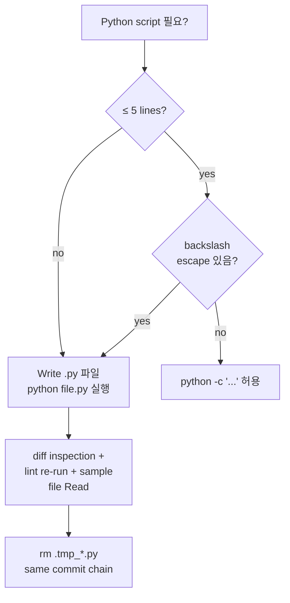

# ADR-061: Python script-writing convention — heredoc escape guard + external .py 의무

## 상태
`Accepted`

## 컨텍스트

CFP-418 (ADR retroactive backfill) Phase 2 PR #419 FIX iteration 1 의 root cause 가 **Python regex backref + bash heredoc escape interaction trap** 으로 식별되었다.

### 트랩 시나리오 (CFP-418 evidence)

작성된 Orchestrator 명령:

```bash
python << 'PYEOF'
import re
# Insert sunset section before "## 관련 파일" heading, preserving the heading via backref
re.sub(r'(\n)(## 관련 파일)', f'{section_text}\n\\1\\2', content, count=1)
PYEOF
```

**기대**: `<<'PYEOF'` (single-quoted heredoc) 이므로 bash 가 backslash 처리 안함. Python 이 `\\1\\2` 를 `\1\2` (2개 backref) 로 interpret.

**실제 결과**: 43개 ADR 파일에서 `## 관련 파일` heading 이 `\x01\x02` (SOH + STX 제어문자) 로 교체됨.

### 원인 분석

bash heredoc with `<<'EOF'` 은 **공식적으로** verbatim transmission 을 보장하지만, 실제로는 환경/shell 버전에 따라 `\\1` → `\1` 변환이 발생할 수 있다. Python 은 string literal `'\1'` 을 octal escape (chr(1) = SOH) 로 해석하므로, regex backref 가 무효화되고 raw 제어문자가 replacement 에 삽입된다.

검증 (`python -c "s = '\\\\1'; print(len(s), repr(s))"` in heredoc context):
- 기대: `len=2, repr='\\\\1'` (literal backslash + 1)
- 실제: `len=1, repr='\\x01'` (octal escape applied)

### Trap 의 위험성

- **Detect 가 어렵다**: 신뢰 가능한 evidence (CI lint, sanity check) 없으면 silent corruption 가능
- **Recovery 비용 높음**: CFP-418 에서 separate fix commit + 43 file restore script 필요했음
- **재발 위험 큼**: 향후 backfill / migration / batch transformation script 에서 동일 trap 가능

## 결정

### 결정 1: 외부 `.py` 파일 실행 의무화

bash heredoc 안 multi-line Python (> 5 lines) 작성 **금지**. 다음 절차 의무:

1. `Write` tool 로 `.py` 파일 (보통 `.tmp_*.py` 또는 `scripts/<task>-<date>.py`) 작성
2. `python <file>.py` 또는 `PYTHONIOENCODING=utf-8 python <file>.py` 실행
3. 작업 완료 후 `.tmp_*.py` 즉시 삭제 (`rm .tmp_*.py` — same commit chain)

### 결정 2: 짧은 `python -c` 허용 범위

다음 조건 **모두** 충족 시 `python -c "..."` 형태 inline 허용:

- 5줄 이내
- backslash escape 없음 (regex backref / octal / hex / unicode escape 없음)
- string literal 내 `\` 미사용
- f-string `{...}` 표현식만 사용

위반 시 외부 `.py` 파일 작성 의무 (결정 1).

### 결정 3: heredoc 사용 금지 영역

다음 cases 에서 bash heredoc 안 Python 사용 **금지**:

- regex backref (`\1`, `\g<N>`)
- string substitution with backslash
- 멀티라인 string 처리
- byte-level escape (`\x..`, `\u....`, octal)
- json/yaml string content with backslashes

heredoc 대안:
- 외부 `.py` 파일 (결정 1)
- 또는 bash native tools (`awk`, `sed`, `grep`, `tr`)

### 결정 4: `<<'EOF'` single-quoted 의 한계 명시

`<<'EOF'` (single-quoted) 가 verbatim transmission 을 **공식 보장** 하지만, 실제 환경 (Windows Git Bash + PowerShell mixed runtime, MSYS2, WSL) 에서는 backslash 처리 불일치 사례가 있다. 본 결정은 platform-portable script 작성 의무 — heredoc verbatim 가정 의존 금지.

### 결정 5: Script 작성 후 sanity check

multi-line `.py` script 작성 후 다음 sanity check 의무:

1. **Diff inspection**: `git diff` 또는 `git diff --stat` 로 변경 라인 분포 확인 (예상 영역 외 변경 없음)
2. **Lint re-run**: 관련 lint script (`check-doc-section-schema.sh`, `check-adr-sunset-criteria.sh` 등) 즉시 재실행
3. **Sample file inspection**: 예상 영역의 1-2 sample file 을 `Read` tool 로 확인

CFP-418 trap 은 1단계 (lint re-run) 에서 만약 적용했다면 즉시 발견 가능했다.

### 결정 6: Reusable backfill helper 권장 (장기)

향후 동일 패턴 (frontmatter field 추가 / section insertion / regex-based bulk transformation) 에 대해 reusable Python helper module 작성 권장 — `scripts/lib/adr_transform.py` 같은 위치. 한 번 정확하게 작성하고 sanity check 거친 후 재사용.

본 ADR scope 외 — 별도 follow-up CFP carrier.

### 결정 7: ADR-039 정합 — script work 도 subagent 권장

ADR-039 (Orchestrator subagent default for codeforge modification work) 의 원칙은 script 작성 / 실행에도 적용. 단:
- inline whitelist 4-entry 안 (Read-only Q&A, scratchpad 등) 에서 짧은 script (결정 2 범위) 는 허용
- 그 외 영역에서 multi-line `.py` script 작성 = `Agent` tool spawn 권장 (DeveloperAgent / 적합 role:dev)

본 결정은 CFP-418 evidence (Orchestrator inline backfill script 가 silent corruption 유발) 의 ADR-039 정합 영역 확장.

### 결정 8: Self-application

본 ADR 자체의 `is_transitional` 분류 = `false` (permanent policy). codeforge script-writing 의 영구 표준 carrier.

본 ADR 도 sunset criteria 정책 적용 받음 — `## 해소 기준` 섹션 = `N/A — permanent policy` (ADR-058 §결정 4 self-application 정합).

## 결과

### 긍정
- CFP-418 type trap 재발 위험 차단
- script work audit trail 강화 (`.py` 파일 = git history 에 남음)
- platform-portable script 작성 의무화
- ADR-039 와 정합 (subagent default)

### 부정 / Trade-off
- `Write` tool + `python` 실행 2-step 으로 latency 약간 증가 (inline `python -c` 대비)
- `.tmp_*.py` 파일 추가 housekeeping 필요 (cleanup 의무)

### 영향 받는 영역
- Orchestrator 의 모든 bulk transformation / migration script work
- backfill operation (frontmatter 추가, section 삽입 등)
- ADR / Story / change-plan 자동화 처리

## 해소 기준

N/A — permanent policy

## 다이어그램 (선택)



## 관련 파일

- `CLAUDE.md` — "스크립트 작성 표준" 섹션 cross-ref 1-2줄
- `scripts/check-adr-sunset-criteria.sh` — CFP-418 backfill trap 발견 채널 (lint enforcement evidence)
- `templates/scripts/` — 향후 reusable helper 위치 (결정 6 follow-up)
- `docs/adr/ADR-039-orchestrator-subagent-default-for-codeforge-modification-work.md` — 정합 ADR
- `docs/adr/ADR-058-adr-sunset-criteria-mandate.md` — 본 ADR self-application 출처
