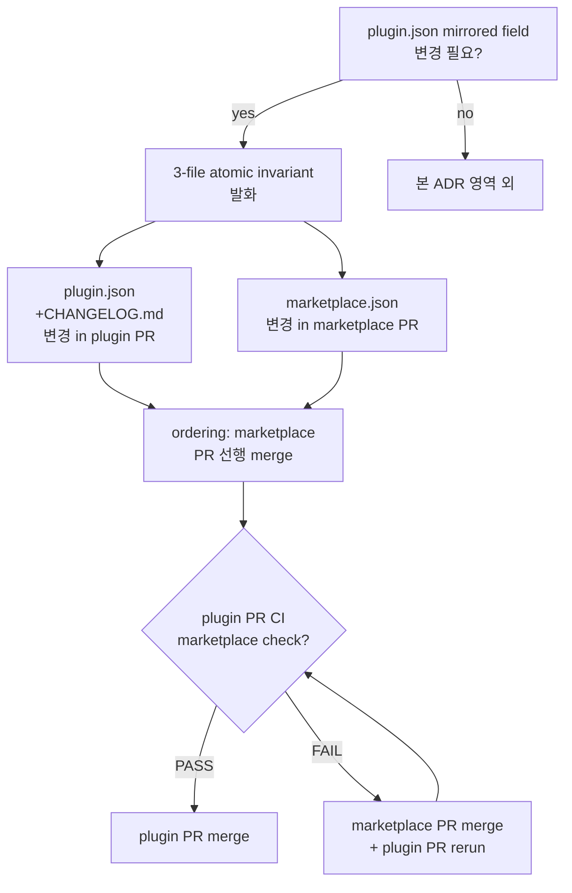

# ADR-063: Marketplace ↔ plugin.json atomic invariant — 3-file coordination

## 상태
`Accepted`

## 컨텍스트

codeforge plugin family 의 version bump 는 3 파일 (`.claude-plugin/plugin.json`, `CHANGELOG.md`, `mclayer/marketplace/.claude-plugin/marketplace.json`) 에 mirrored 정보를 보유한다. ADR-016 (marketplace sibling sync policy) 은 mirrored field 4종 (`name`/`version`/`description`/`author`) sync 의무를 정의하지만, **bump 시 3 file 의 atomic coordination invariant** 는 미명시.

### 3-Wave drift evidence (CFP-387 / CFP-418 / CFP-423 retro)

| Story | Drift 양상 | 감지 channel | Recovery |
|---|---|---|---|
| **CFP-387** | Phase 2 PR 시 marketplace-parity chicken-and-egg — wrapper plugin.json 5.11.0 + codeforge-design 0.7.0 새로 bump 됐으나 marketplace.json 미sync (5.10.0 + 0.6.0). PR CI fail. | `check-marketplace-parity.sh` post-PR-open | marketplace sync PR 선행 merge → Phase 2 PR re-run |
| **CFP-418** | 해당 없음 (backfill, version bump 없음) — Wave count 제외 | — | — |
| **CFP-423** | pre-existing CFP-393 drift — marketplace 5.15.0 sync 완료 but plugin.json 5.14.0 + CHANGELOG.md 5.14.0 정체 (이전 PR drift). PR CI fail. | `check-marketplace-sync.sh` (CFP-34) post-PR-open + `invariant-check` plugin.json↔CHANGELOG mismatch | 본 PR이 5.16.0 catch-up + sync 합쳐 처리 |

3회 누적 drift 의 공통 root cause:
- mirrored field bump 시 3 file 의 **atomic update 의무 미명시**
- bump를 한 file 만 수행하고 sibling sync 가 deferred / dropped 되면 lint 가 사후 감지만 가능
- 작성 시점 (Write 단계) 의 atomic 강제 mechanism 부재

### 기존 CI lint 의 한계

- `check-marketplace-parity.sh` — plugin.json ↔ marketplace.json 동치성 검증. **PR open 후 fire**.
- `check-marketplace-sync.sh` — 동일 영역, redundant coverage.
- `invariant-check` — plugin.json ↔ CHANGELOG.md 동치성 (version field).
- **Gap**: 3 file atomic invariant (작성 시점 강제) + ordering rule (marketplace sync PR vs plugin PR merge 순서) 미정의.

### 사용 시나리오

**Case A: 새 PR이 plugin.json version 변경**
- plugin.json + CHANGELOG.md 변경은 같은 PR 안에 함께 처리 (기존 `invariant-check` enforce)
- marketplace.json 은 별도 PR (mclayer/marketplace 다른 repo) — sibling sync PR 의무
- 본 PR과 sibling sync PR 의 **ordering**: marketplace sync 선행 merge → plugin PR merge (현재 관행)
- 또는 concurrent merge (atomic, drift 0-window) — 사용자 결정 영역

**Case B: marketplace.json 만 변경 (외부 정책 만 갱신)**
- plugin.json 영향 없음 (예: description 마이너 fix, CFP-378 #40 사례)
- ADR-016 sibling sync 단독 발화

**Case C: plugin.json 만 변경, marketplace.json 미sync**
- **Anti-pattern** — 본 ADR로 차단 대상
- CFP-387 / CFP-393 / CFP-423 drift 의 직접 원인

## 결정

### 결정 1: 3-file atomic invariant 명시 — bump 시 3 file 동시 처리 의무

mirrored field (`name`/`version`/`description`/`author`) 중 하나 이상 변경 시 다음 3 file 의 atomic coordination 의무:

| File | Repo | 변경 의무 |
|---|---|---|
| `.claude-plugin/plugin.json` | plugin repo (예: `mclayer/plugin-codeforge`) | mirrored field 변경 |
| `CHANGELOG.md` | plugin repo | 해당 version entry 추가 (version field 변경 시) |
| `.claude-plugin/marketplace.json` | `mclayer/marketplace` | 해당 plugin entry mirrored field 동일 |

3 file 중 어느 하나만 변경하고 나머지를 deferred / dropped 하면 invariant 위반 = drift 발생.

### 결정 2: PR ordering — marketplace sync 선행 merge 권장

cross-repo coordination 으로 인해 single atomic transaction 불가능. 다음 ordering 채택:

1. **(권장)** marketplace sync PR open + merge 선행
2. plugin PR open (`check-marketplace-sync.sh` / `check-marketplace-parity.sh` PASS — marketplace 가 이미 최신)
3. plugin PR merge

또는 concurrent merge 가능 (drift 0-window):

1. marketplace sync PR + plugin PR 양쪽 open
2. plugin PR CI 의 marketplace check 는 fail 상태 — branch protection bypass 또는 admin override 필요
3. marketplace sync PR merge → 즉시 plugin PR CI re-run → PASS → merge

**Anti-pattern (금지)**:
- plugin PR merge 먼저 → marketplace 가 drift 상태로 main 에 노출 → 다음 PR 들이 모두 CI fail (CFP-387 chicken-and-egg 사례)

### 결정 3: 작성 단계 sanity check — pre-commit 권장

bump 작업 수행 시 다음 sanity check 의무 (ADR-061 §결정 5 정합):

1. plugin.json version + description 변경 직후 `bash scripts/check-marketplace-parity.sh` local 실행 → drift 확인 (사실상 fail 가능 — marketplace 가 미sync)
2. CHANGELOG.md 해당 version entry 작성
3. **즉시** marketplace sync 작업 시작 (별도 worktree / repo 에서 marketplace.json 변경 + PR open)
4. 3 file PR 모두 open 후 ordering (결정 2) 적용

선행 sanity check 없이 plugin PR open → CI fail → 사후 recovery 패턴은 마찰 비용이 높음 (rebase + force-push + re-run).

### 결정 4: bypass channel — 긴급 hotfix

production 장애 / security incident 대응 시 atomic invariant 일시 bypass 가능:

- `hotfix-bypass:marketplace-atomic` label (ADR-024 Amendment 3 hotfix-bypass family 정합)
- bypass 후 24시간 이내 marketplace sync PR open + merge 의무
- bypass 발생 시 `docs/audit/` 에 audit row 의무

본 channel 은 audit-trailed exception only — 정상 운영에서 사용 금지.

### 결정 5: 기존 CI lint 보존 + 신규 lint follow-up

기존 `check-marketplace-sync.sh` + `check-marketplace-parity.sh` 는 본 ADR 의 atomic invariant 사후 감지 channel 로 유지. 신규 작성 시점 enforce (예: pre-commit hook, PR open 시점 cross-ref check) 는 별도 follow-up CFP carrier:

| Lint | 현재 | 신규 (별도 carrier) |
|---|---|---|
| plugin.json ↔ CHANGELOG | `invariant-check` workflow | 그대로 |
| plugin.json ↔ marketplace.json | `check-marketplace-parity.sh` post-PR | pre-commit hook (local) 권장 |
| 3-file atomic 강제 | 부재 | `check-version-bump-atomic.sh` (신규, 별도 CFP) |

### 결정 6: ADR-016 vs ADR-063 분리 — scope 명확화

- **ADR-016 (marketplace sibling sync policy)**: marketplace.json 에 plugin 등록 의무 + mirrored field 4종 정의. **무엇을 sync 하는지** 정의.
- **ADR-063 (본 ADR — atomic invariant)**: bump 시 3 file 동시 처리 + PR ordering. **어떻게 sync 하는지 + 작성 단계 invariant** 정의.

본 ADR 은 ADR-016 의 amendment 가 아닌 별도 정책 — ADR-016 의 sync mechanism 을 atomic 으로 강제하는 layer.

### 결정 7: ADR-061 §결정 5 정합 — sanity check 3종 적용

ADR-061 §결정 5 (script-writing sanity check) 와 정합 — version bump 작업도 다음 3종 sanity check 의무:

- diff inspection: `git diff --stat` 로 plugin.json + CHANGELOG.md 변경 확인
- lint re-run: `bash scripts/check-marketplace-parity.sh` 즉시 실행 (drift 사전 확인)
- sample inspection: marketplace.json mirrored field 확인 (`gh api /repos/mclayer/marketplace/contents/.claude-plugin/marketplace.json` 또는 직접 fetch)

### 결정 8: Self-application

본 ADR 자체 분류 = `is_transitional: false` (영구 정책). codeforge plugin family 의 영구 atomic coordination 표준.

본 ADR 도입 시점에 marketplace.json sync PR 의무 (3-file atomic) — 본 PR 자체가 version bump 동반하면 self-application 첫 사례.

## 결과

### 긍정
- 3-Wave drift 패턴 차단 — atomic invariant 명시화
- CFP-387 chicken-and-egg + CFP-393 catch-up drift 재발 차단
- ADR-016 + ADR-037 + 본 ADR-063 = version bump triplet 완성 (무엇 / 의미 / 방법)

### 부정 / Trade-off
- bump 작업 cost 증가 — 항상 marketplace sync PR 병행 필요
- cross-repo coordination overhead (다중 worktree / PR 관리)
- 긴급 hotfix 시 bypass 채널 의존

### 영향 받는 영역
- 모든 plugin family version bump 작업 (wrapper + 6 lane plugin)
- marketplace sync PR open 의무 (Phase 2 PR pair → Phase 2 PR triplet)
- 별도 follow-up: pre-commit hook / 신규 atomic lint

## 해소 기준

N/A — permanent policy

## 다이어그램 (선택)

## 관련 파일

- `CLAUDE.md` — version bump 표준 cross-ref
- `scripts/check-marketplace-parity.sh` — 사후 감지 (CFP-50 / ADR-016 / ADR-023)
- `scripts/check-marketplace-sync.sh` — 동일 영역 (CFP-34)
- `docs/adr/ADR-016-marketplace-registration-policy.md` — sibling sync policy
- `docs/adr/ADR-037-plugin-version-bump-rule.md` — version semantics SSOT
- `docs/adr/ADR-024-story-scoped-branch-policy.md` — hotfix-bypass label family (Amendment 3)
- `docs/adr/ADR-061-python-script-writing-convention.md` — sanity check 3종 정합
