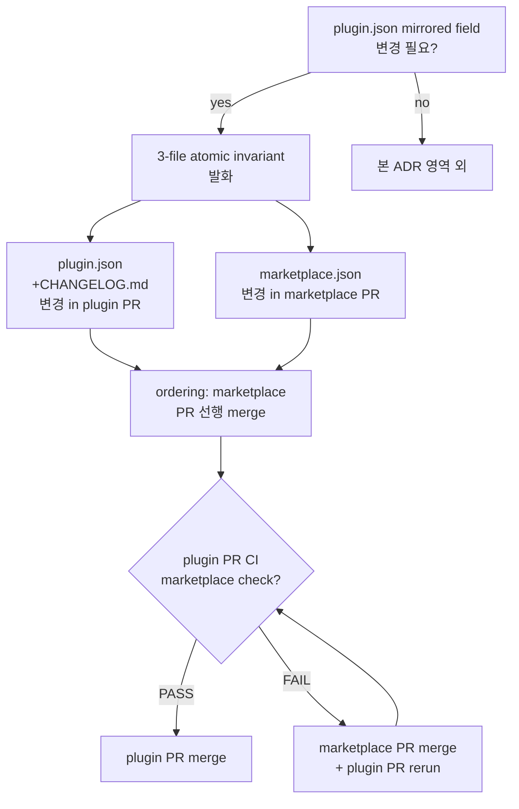

# ADR-063: Marketplace ↔ plugin.json atomic invariant — 3-file coordination

## 상태
`Accepted`

## 컨텍스트

codeforge plugin family 의 version bump 는 3 파일 (`.claude-plugin/plugin.json`, `CHANGELOG.md`, `mclayer/marketplace/.claude-plugin/marketplace.json`) 에 mirrored 정보를 보유한다. ADR-016 (marketplace sibling sync policy) 은 mirrored field 4종 (`name`/`version`/`description`/`author`) sync 의무를 정의하지만, **bump 시 3 file 의 atomic coordination invariant** 는 미명시.

### 3-Wave drift evidence (CFP-387 / CFP-418 / CFP-423 retro)

| Story | Drift 양상 | 감지 channel | Recovery |
|---|---|---|---|
| **CFP-387** | Phase 2 PR 시 marketplace-parity chicken-and-egg — wrapper plugin.json 5.11.0 + codeforge-design 0.7.0 새로 bump 됐으나 marketplace.json 미sync (5.10.0 + 0.6.0). PR CI fail. | `check-marketplace-parity.sh` post-PR-open | marketplace sync PR 선행 merge → Phase 2 PR re-run |
| **CFP-418** | 해당 없음 (backfill, version bump 없음) — Wave count 제외 | — | — |
| **CFP-423** | pre-existing CFP-393 drift — marketplace 5.15.0 sync 완료 but plugin.json 5.14.0 + CHANGELOG.md 5.14.0 정체 (이전 PR drift). PR CI fail. | `check-marketplace-sync.sh` (CFP-34) post-PR-open + `invariant-check` plugin.json↔CHANGELOG mismatch | 본 PR이 5.16.0 catch-up + sync 합쳐 처리 |

3회 누적 drift 의 공통 root cause:
- mirrored field bump 시 3 file 의 **atomic update 의무 미명시**
- bump를 한 file 만 수행하고 sibling sync 가 deferred / dropped 되면 lint 가 사후 감지만 가능
- 작성 시점 (Write 단계) 의 atomic 강제 mechanism 부재

### 기존 CI lint 의 한계

- `check-marketplace-parity.sh` (CFP-50 / ADR-023) — plugin.json ↔ marketplace.json 동치성 검증. **PR open 후 fire**. SSOT 사후 감지 channel (CFP-457 cleanup 후 단독 유지).
- ~~`check-marketplace-sync.sh`~~ — **deprecated CFP-457** (동일 영역 redundant coverage 였음, marketplace-parity 로 통합).
- `invariant-check` — plugin.json ↔ CHANGELOG.md 동치성 (version field).
- **Gap**: 3 file atomic invariant (작성 시점 강제) + ordering rule (marketplace sync PR vs plugin PR merge 순서) 미정의.

### 사용 시나리오

**Case A: 새 PR이 plugin.json version 변경**
- plugin.json + CHANGELOG.md 변경은 같은 PR 안에 함께 처리 (기존 `invariant-check` enforce)
- marketplace.json 은 별도 PR (mclayer/marketplace 다른 repo) — sibling sync PR 의무
- 본 PR과 sibling sync PR 의 **ordering**: marketplace sync 선행 merge → plugin PR merge (현재 관행)
- 또는 concurrent merge (atomic, drift 0-window) — 사용자 결정 영역

**Case B: marketplace.json 만 변경 (외부 정책 만 갱신)**
- plugin.json 영향 없음 (예: description 마이너 fix, CFP-378 #40 사례)
- ADR-016 sibling sync 단독 발화

**Case C: plugin.json 만 변경, marketplace.json 미sync**
- **Anti-pattern** — 본 ADR로 차단 대상
- CFP-387 / CFP-393 / CFP-423 drift 의 직접 원인

## 결정

### 결정 1: 3-file atomic invariant 명시 — bump 시 3 file 동시 처리 의무

mirrored field (`name`/`version`/`description`/`author`) 중 하나 이상 변경 시 다음 3 file 의 atomic coordination 의무:

| File | Repo | 변경 의무 |
|---|---|---|
| `.claude-plugin/plugin.json` | plugin repo (예: `mclayer/plugin-codeforge`) | mirrored field 변경 |
| `CHANGELOG.md` | plugin repo | 해당 version entry 추가 (version field 변경 시) |
| `.claude-plugin/marketplace.json` | `mclayer/marketplace` | 해당 plugin entry mirrored field 동일 |

3 file 중 어느 하나만 변경하고 나머지를 deferred / dropped 하면 invariant 위반 = drift 발생.

### 결정 2: PR ordering — marketplace sync 선행 merge 권장

cross-repo coordination 으로 인해 single atomic transaction 불가능. 다음 ordering 채택:

1. **(권장)** marketplace sync PR open + merge 선행
2. plugin PR open (`check-marketplace-parity.sh` PASS — marketplace 가 이미 최신)
3. plugin PR merge

또는 concurrent merge 가능 (drift 0-window):

1. marketplace sync PR + plugin PR 양쪽 open
2. plugin PR CI 의 marketplace check 는 fail 상태 — branch protection bypass 또는 admin override 필요
3. marketplace sync PR merge → 즉시 plugin PR CI re-run → PASS → merge

**Anti-pattern (금지)**:
- plugin PR merge 먼저 → marketplace 가 drift 상태로 main 에 노출 → 다음 PR 들이 모두 CI fail (CFP-387 chicken-and-egg 사례)

### 결정 3: 작성 단계 sanity check — pre-commit 권장

bump 작업 수행 시 다음 sanity check 의무 (ADR-061 §결정 5 정합):

1. plugin.json version + description 변경 직후 `bash scripts/check-marketplace-parity.sh` local 실행 → drift 확인 (사실상 fail 가능 — marketplace 가 미sync)
2. CHANGELOG.md 해당 version entry 작성
3. **즉시** marketplace sync 작업 시작 (별도 worktree / repo 에서 marketplace.json 변경 + PR open)
4. 3 file PR 모두 open 후 ordering (결정 2) 적용

선행 sanity check 없이 plugin PR open → CI fail → 사후 recovery 패턴은 마찰 비용이 높음 (rebase + force-push + re-run).

### 결정 4: bypass channel — 긴급 hotfix

production 장애 / security incident 대응 시 atomic invariant 일시 bypass 가능:

- `hotfix-bypass:marketplace-atomic` label (ADR-024 Amendment 3 hotfix-bypass family 정합)
- bypass 후 24시간 이내 marketplace sync PR open + merge 의무
- bypass 발생 시 `docs/audit/` 에 audit row 의무

본 channel 은 audit-trailed exception only — 정상 운영에서 사용 금지.

### 결정 5: 기존 CI lint 보존 + 신규 lint follow-up

기존 `check-marketplace-parity.sh` (CFP-50 / ADR-023) 는 본 ADR 의 atomic invariant 사후 감지 channel 로 유지. (`check-marketplace-sync.sh` 는 CFP-457 cleanup 으로 deprecated — marketplace-parity 와 redundant coverage 였음.) 신규 작성 시점 enforce (예: pre-commit hook, PR open 시점 cross-ref check) 는 별도 follow-up CFP carrier:

| Lint | 현재 | 신규 (별도 carrier) |
|---|---|---|
| plugin.json ↔ CHANGELOG | `invariant-check` workflow | 그대로 |
| plugin.json ↔ marketplace.json | `check-marketplace-parity.sh` post-PR | pre-commit hook (local) 권장 |
| 3-file atomic 강제 | 부재 | `check-version-bump-atomic.sh` (신규, 별도 CFP) |

### 결정 6: ADR-016 vs ADR-063 분리 — scope 명확화

- **ADR-016 (marketplace sibling sync policy)**: marketplace.json 에 plugin 등록 의무 + mirrored field 4종 정의. **무엇을 sync 하는지** 정의.
- **ADR-063 (본 ADR — atomic invariant)**: bump 시 3 file 동시 처리 + PR ordering. **어떻게 sync 하는지 + 작성 단계 invariant** 정의.

본 ADR 은 ADR-016 의 amendment 가 아닌 별도 정책 — ADR-016 의 sync mechanism 을 atomic 으로 강제하는 layer.

### 결정 7: ADR-061 §결정 5 정합 — sanity check 3종 적용

ADR-061 §결정 5 (script-writing sanity check) 와 정합 — version bump 작업도 다음 3종 sanity check 의무:

- diff inspection: `git diff --stat` 로 plugin.json + CHANGELOG.md 변경 확인
- lint re-run: `bash scripts/check-marketplace-parity.sh` 즉시 실행 (drift 사전 확인)
- sample inspection: marketplace.json mirrored field 확인 (`gh api /repos/mclayer/marketplace/contents/.claude-plugin/marketplace.json` 또는 직접 fetch)

### 결정 8: Self-application

본 ADR 자체 분류 = `is_transitional: false` (영구 정책). codeforge plugin family 의 영구 atomic coordination 표준.

본 ADR 도입 시점에 marketplace.json sync PR 의무 (3-file atomic) — 본 PR 자체가 version bump 동반하면 self-application 첫 사례.

### 결정 9: ArchitectAgent Phase 1 marketplace sync proactive self-check trigger (Amendment 1, CFP-597)

**Context (proactive vs reactive 시점 갭)**: 기존 §결정 1-8 = 작성/PR-open 단계 invariant + 사후 감지 channel (`check-marketplace-parity.sh`). codeforge-design lane 의 ArchitectAgent (chief author) 가 Phase 1 산출물 commit 시점에 mirrored field diff 를 인지하지 못하면 — Change Plan / verdict packet / Phase 2 PR open 모두 거친 후에야 reactive lint 가 fire. CFP-534 sentinel #3 evidence (12:10 codeforge-pmo plugin.json 0.1.1 → 0.1.2 PATCH bump 동반 marketplace.json sync 부재 → workflow FAIL reactive 감지) 가 본 gap 식별.

**ADR-065 boundary 보존**: ADR-065 (non-marketplace 7-item self-check) §결정 5 = "marketplace 영역 self-check 는 ADR-063 SSOT — 본 ADR scope 외" + "cross-ref only — 중복 codification 회피". 본 결정 9 = ADR-063 SSOT 안 marketplace 영역 ArchitectAgent self-check trigger codify. ADR-065 §결정 1 7-item 을 8-item 으로 확장하는 대신 ADR-063 본문에서 통합 — SSOT drift 차단.

**3-layer proactive forcing function**:

| Layer | 시점 | 책임 주체 | Mechanism |
|---|---|---|---|
| 1 | ArchitectAgent §3 commit 직전 | ArchitectAgent (codeforge-design chief author) | `git diff <plugin>/.claude-plugin/plugin.json` mirrored field 4종 (`name` / `version` / `description` / `author`) 변경 감지 self-check |
| 2 | Change Plan §13 declarative declare | ArchitectAgent (산출물 작성) | `marketplace_sync_required: <bool>` + `mirrored_fields_changed: [<enum>]` + `triggering_plugins[]` sub-row 의무 (silent skip 금지 — `false` 일 때도 명시 declare) |
| 3 | Phase 2 PR open 시점 | Orchestrator (monopoly) | Change Plan §13 lookup → `marketplace_sync_required: true` 감지 시 GitOpsAgent (codeforge-pmo) spawn → marketplace sync PR open + merge (ordering = §결정 2 권장 — marketplace PR 선행 merge) |

기존 reactive channel (`check-marketplace-parity.sh`) 은 defense-in-depth 로 보존. 본 결정 9 = 작성 시점 인식 forcing function 추가.

**ArchitectAgent §3.6 self-check 행위** (codeforge-design plugin sibling carrier):
1. `git diff` 로 Phase 1 산출물 안 `<plugin>/.claude-plugin/plugin.json` mirrored field 4종 비교
2. 변경된 field enum 도출 → `mirrored_fields_changed[]` (예: `[version]`, `[version, description]`)
3. Change Plan §13 sub-row 채움 — `marketplace_sync_required` (bool) + `mirrored_fields_changed[]` + `triggering_plugins[]` (변경 영향 받은 plugin 명단)
4. NA 케이스 (mirrored field diff 0건) = `marketplace_sync_required: false` 명시 declare 의무 (silent skip 차단)

**Change Plan §13 sub-row schema**:
```yaml
marketplace_sync_required: <bool>            # NEW (ADR-063 Amendment 1 / CFP-597)
mirrored_fields_changed: [<enum: name|version|description|author>]
triggering_plugins:
  - <plugin-name> (<bump-kind: MAJOR|MINOR|PATCH>)
```

**review-verdict-v4 v4.5 schema MINOR bump** (carrier: ADR-008 §결정 2 "새 선택 필드 추가"):
```yaml
marketplace_sync_declared: <bool>   # NEW (ADR-063 Amendment 1 / CFP-597, v4.5 MINOR)
                                     # ArchitectPL verdict packet 안 marketplace sync trigger declare 결과
                                     # true = Change Plan §13 declare 채움 완료 (true 또는 false 명시), false = §13 declare 누락
                                     # 적용 lane: design lane 만 (code/security lane = optional, omit 가능)
```

ADR-065 의 `mechanical_self_check_passed` 와 **별 boolean field** 운영 (verdict packet 안 분리된 marker) — ADR-063 marketplace 영역 ↔ ADR-065 non-marketplace 영역 boundary 정합.

**Orchestrator → GitOpsAgent §3.6 spawn flow** (Phase 2 PR open 시점, ADR-039 subagent monopoly 정합):
- Orchestrator inline 행위 = Change Plan §13 lookup + spawn 결정 (Inline whitelist "Status report" 정합)
- GitOpsAgent §3.6 (codeforge-pmo sibling carrier, Phase 2 deliverable) = marketplace repo worktree 신설 + marketplace.json sync + PR open + ordering 강제

**Self-application 첫 사례 (본 carrier)**:
본 ADR-063 Amendment 1 도입 PR 자체가 codeforge-design / codeforge-pmo / codeforge-review 3 plugin.json mirrored field (`version`) bump 동반 — Amendment 1 first applied case 시연 의무. Change Plan §13 declare + verdict packet `marketplace_sync_declared: true` + GitOpsAgent spawn 5-row trigger_chain evidence 모두 충족 시 self-application 성공.

**Hotfix bypass**: §결정 4 `hotfix-bypass:marketplace-atomic` label 그대로 — Amendment 1 별도 bypass channel 미도입 (단일 label family 유지).

### 결정 10: Self-application — Amendment 1 ratchet 검증

본 Amendment 1 = 강화 방향 only (proactive layer 추가 + invariant 강도 상승). ADR-064 self-application top-down ratchet 정합 — 약화 방향 (예: proactive trigger 약화 / boundary 이동 / scope 축소) 미해당. ADR-058 §결정 5 sunset_justification = frontmatter 명시 (`N/A — permanent governance policy. ADR-064 §self-application top-down ratchet 정합. ADR-058 §결정 5 약화 방향 발의 차단 logic 통과.`).

본 ADR-063 amendment 발의 시 매번 ratchet 방향 검증 의무 — 강화 방향만 허용.

### 결정 11: Description proactive lint mandate (Amendment 2, CFP-631)

**Context (Amendment 1 design-time + reactive lint 갭)**: Amendment 1 (§결정 9) = ArchitectAgent §3.6 self-check + Change Plan §13 declare + Orchestrator → GitOpsAgent spawn 3-layer 모두 design-time forcing function. 기존 reactive lint = `check-marketplace-parity.sh` warning tier post-PR 사후 감지. 두 layer 사이 PR-time mechanical enforce 영역 부재 — author 가 Amendment 1 self-check skip 또는 sibling sync drift 시점 author 인식 부재 시 reactive lint 가 작동하기까지 mirror drift 가 main 노출 가능.

**6 sample 누적 drift evidence** (CFP-619 retro §5.2 SSOT):

| Sample | CFP | Drift 유형 | 감지 channel | Recovery |
|---|---|---|---|---|
| 1 | CFP-387 | 초기 marketplace registration policy drift | post-PR `check-marketplace-parity.sh` | manual sibling PR |
| 2 | CFP-393 | KPI workflow description sync gap | post-PR `check-marketplace-parity.sh` | manual sibling PR |
| 3 | CFP-423 | Python script convention description gap | post-PR `check-marketplace-parity.sh` | manual sibling PR |
| 4 | CFP-597 | ADR-063 Amendment 1 도입 시점 description 동기화 | self-application 1st case | atomic sync 동반 |
| 5 | CFP-612 | description over-escape quote bug (`\&#34;...\&#34;`) | post-PR FAIL + commit 54509bd 별도 PR | manual fix-up commit |
| 6 | CFP-619 | description summary vs verbatim drift (PR #102 → #103) | post-PR FAIL → commit `c199dee` "byte-identical fix" follow-up | manual byte-identical fix follow-up PR |

**Blocking-on-pr tier 직접 시작 근거** (Codex Touchpoint #2 P1 #1 inline 정정):
- ADR-060 §결정 5 default warning-mode 의 **explicit exception** (사용자 directive Story §1)
- ADR-060 §결정 19 (Amendment 6, CFP-509) `auto_blocking` manual gate path — `recurrence.count: 6` + `threshold: 6` + `promotion_trigger: auto_blocking` 명시 (manual carrier-driven transition)
- §결정 6 AND-condition (PR cumulative ≥20 / failure_threshold 0 / sibling deps) 의 의의는 본 carrier Story 자체가 별도 promotion carrier 역할 합병으로 충족 — actual transition 의무 통과
- ADR-060 Amendment 2 §결정 16 (warning-tier `bypass_label` policy) 와 무관 (해당 §결정 = warning tier optional bypass_label, 본 결정 11 = blocking tier mandatory bypass_label)

**Mandate**:
- mirrored field `description` 의 PR-time mechanical proactive lint 의무 (wrapper plugin.json description ↔ marketplace.json `plugins[codeforge].description` byte-identical verify)
- tier: blocking-on-pr — ADR-060 §결정 5 default warning explicit exception (사용자 directive Story §1 + 6 sample 누적 evidence base) + §결정 19 (Amendment 6) auto_blocking manual gate, 위 "Blocking-on-pr tier 직접 시작 근거" 블록 참조
- bypass channel: `hotfix-bypass:marketplace-description-verbatim` label (ADR-024 Amendment 3 §결정 6.A per-entry namespace family member #16)

**Carrier components**:
- `scripts/check-marketplace-description-verbatim.sh` — bash lint script (algorithm: PR diff 안 description 변경 감지 → 변경 있을 때만 jq extract + byte compare + diff snippet emit)
- `templates/github-workflows/marketplace-description-verbatim.yml` — canonical workflow SSOT (ADR-005 invariant)
- `.github/workflows/marketplace-description-verbatim.yml` — byte-identical mirror
- `docs/evidence-checks-registry.yaml` entry `marketplace-description-verbatim` (blocking-on-pr tier, recurrence count=6, last_occurrence=2026-05-14)
- `docs/inter-plugin-contracts/label-registry-v2.md` v2.8 → v2.9 PATCH (§3 yaml hotfix-bypass:* 16번째 family member append)

**2-layer proactive forcing function** (Amendment 1 + Amendment 2 layered):

| Layer | 시점 | Mechanism |
|---|---|---|
| Amendment 1 (CFP-597) | Phase 1 산출물 commit 직전 (design-time) | ArchitectAgent §3.6 self-check + Change Plan §13 declarative declare + Orchestrator → GitOpsAgent §3.6 spawn |
| **Amendment 2 (본 결정 11, CFP-631)** | **pull_request event (PR-time)** | **GitHub Actions workflow `marketplace-description-verbatim.yml` 자동 enforce — `scripts/check-marketplace-description-verbatim.sh` byte-identical verify + 실패 시 PR 차단 (blocking-on-pr)** |

기존 reactive layer (`check-marketplace-parity.sh` warning) 도 defense-in-depth 로 보존 — 본 Amendment 2 가 author 인식 시점과 PR open 시점 사이 gap 을 mechanical lint 로 cover.

**Algorithm overview** (`check-marketplace-description-verbatim.sh`):
1. `git diff "${BASE_REF}..HEAD" -- .claude-plugin/plugin.json` 으로 description field 변경 감지 — 변경 없음 → exit 0 skip (false alarm 차단)
2. wrapper plugin.json description extract (`jq -r '.description'`)
3. marketplace.json fetch (`gh api`) + plugins[codeforge].description extract
4. byte-identical compare (`[[ "$P_DESC" == "$M_DESC" ]]`)
5. mismatch → diff snippet + exit 1
6. match → exit 0 (PASS)

**Error handling** (exit code 2 = environment error): jq missing / gh api fail / json malformed — actionable message + install / auth instruction.

**Bypass discipline** (ADR-024 Amendment 3 §결정 6.A 정합):
- `hotfix-bypass:marketplace-description-verbatim` label 부착 시 workflow skip
- bypass audit comment 자동 발의 (gh pr comment) — 24시간 이내 marketplace sync 의무 명시
- bypass 발생 시 `docs/audit/` 에 audit row 의무

본 channel 은 audit-trailed exception only — 정상 운영에서 사용 금지.

### 결정 12: Self-application — Amendment 2 ratchet 검증 + 본 carrier 첫 적용 사례

**Ratchet 검증**: 본 Amendment 2 = 강화 방향 only (PR-time mechanical enforce layer 추가 + invariant 강도 상승 — description field warning tier post-PR → blocking-on-pr PR-time). ADR-064 self-application top-down ratchet 정합 — 약화 방향 (예: PR-time enforce skip / warning 다운그레이드 / scope 축소) 미해당. ADR-058 §결정 5 sunset_justification = frontmatter `is_transitional: false` permanent governance policy 유지.

**Self-application 첫 사례 (본 carrier)**:
본 ADR-063 Amendment 2 도입 PR 자체가 wrapper plugin.json mirrored field 2종 (`version` 5.47.0 → 5.48.0 MINOR + `description` tail append Amendment 2 carrier note) bump 동반 — Amendment 2 first applied case 시연 의무. marketplace sibling sync PR 선행 merge → wrapper Phase 1 PR merge ordering 강제. Phase 2 PR (lint script + workflow yml 도입) merge 후 future PR 부터 본 lint 활성 — Phase 1 PR 자체는 lint 영역 외 (chicken-and-egg 회피, ADR-063 §결정 2 anti-pattern 정합 운영).

**Future amendment 발의 검증**: 본 ADR-063 amendment 발의 시 매번 ratchet 방향 검증 의무 — 강화 방향만 허용. Amendment 3+ 도입 시 (a) description 외 mirrored field 추가 PR-time enforce (예: keywords field 등 신규 mirrored field expansion) (b) lint frequency 강화 (예: per-commit hook) (c) 6 lane plugin description 확장 — 모두 강화 방향 후보. 약화 방향 (description warning tier 다운그레이드 / blocking 해제 / scope 축소) 미허용.

### 결정 13: 정기 detection 의무 (reactive scheduled channel — 4th defense layer, **Phase 2 carrier 의무**) (Amendment 3, CFP-627)

**Phase 1 / Phase 2 boundary 명시 (ADR-067 §결정 3 cross-lane RESET 차원 전환 정합, ADR-068 I-1 boundary completeness)**:

본 §결정 13 = **declarative SSOT mandate** — Phase 1 PR (본 doc-only fast-path PR) scope. **artifact 도입 (`scripts/check-marketplace-drift.sh` + `templates/github-workflows/marketplace-drift-detection.yml` + `.github/workflows/marketplace-drift-detection.yml` + `docs/evidence-checks-registry.yaml` entry) = Phase 2 PR scope (별 carrier)**. evidence-registry-naming-check VIOLATION 회피 + Phase 1 doc-only fast-path (ADR-054) 정합 + boundary completeness (Phase 1 declarative vs Phase 2 artifact mechanical 분리 의도 회복) 동시 충족.

**Phase 2 carrier 의무 명시** — 본 §결정 13 mandate 가 effective 하려면 Phase 2 carrier PR 이 반드시 follow-up 으로 open + merge 의무. ADR-067 §결정 3 cross-lane RESET 차원 전환 정합 — 본 Phase 1 PR 의 max FIX 3/3 도달 시 Phase 2 carrier defer = scope unitary (ADR-064 §결정 1.3 정합) — 별 Story 분리.

**Context (proactive vs reactive 시점 갭 — 4-tuple reproduce evidence)**: §결정 1-12 (Amendment 1 §결정 9 + Amendment 2 §결정 11 포함) 가 모두 **proactive** (변경 시점 enforce — ArchitectAgent §3.6 self-check, PR-open `check-marketplace-parity.sh`, PR-time `version-bump-atomic-check.yml`, PR-time `check-marketplace-description-verbatim.sh`) 채널만 cover. drift 가 변경 시점 외 (rebase / 별 PR / direct commit / version collision resolve) 발생 시 사후 detection 부재 = root cause. 4-tuple reproduce evidence:

| # | Story | Drift 양상 | Window |
|---|---|---|---|
| 1 | **CFP-609** (PR #613) | marketplace 만 5.43.0 sync, wrapper plugin.json bump 누락 → CFP-598 Phase 2 가 5.42.0 → 5.44.0 정정 동시 sync 의무 발생 | 변경 시점 직후 |
| 2 | **CFP-612** (PR #618) | Wave 5 정상 sync (정상 control sample) | — |
| 3 | **CFP-610 Story 2** (PR #616) | commit `f3391d4` "plugin.json 5.45.0 → 5.46.0 MINOR" 기재 + marketplace.json codeforge entry 5.46.0 declared 후에도 wrapper plugin.json 5.45.0 stuck — **3rd reproduce** | 3 day window (PR merge ~ 자동 정정) |
| 4 | **본 session live verify** (2026-05-14 KST) | marketplace 5.47.0 (CFP-619 sibling sync 결과) vs wrapper 5.45.0 (origin/main HEAD `97c0d06`) drift live observed | 자연 해소 within session |

**Amendment 1 + Amendment 2 proactive channel 의 한계**: Amendment 1 의 ArchitectAgent §3.6 self-check + Amendment 2 의 PR-time description verbatim lint 는 ArchitectAgent 영역 외 (직접 commit / FIX rebase / version collision resolve) drift 발생 시 차단 부재. description 외 mirrored field 3종 (`name` / `version` / `author`) 의 작성 시점 외 drift 도 PR-time channel 미cover. 본 §결정 13 reactive scheduled detection 추가가 4-layer defense 완성.

본 §결정 13 = **reactive scheduled detection 의무 normative**.

**4-layer defense 구성**:

| Layer | 시점 | 책임 주체 | Mechanism | 출처 |
|---|---|---|---|---|
| 1 (proactive) | ArchitectAgent §3 commit 직전 | ArchitectAgent (codeforge-design chief author) | `git diff` mirrored field 4종 self-check | §결정 9 Amendment 1 |
| 2 (proactive) | Change Plan §13 declarative declare | ArchitectAgent (산출물 작성) | `marketplace_sync_required: <bool>` declare 의무 | §결정 9 Amendment 1 |
| 3 (proactive) | PR-time `pull_request` event | GitHub Actions | `marketplace-description-verbatim.yml` (description) + `version-bump-atomic-check.yml` (version) PR 차단 | §결정 11 Amendment 2 + §결정 5 |
| 4 (reactive) | 24h scheduled cron + manual workflow_dispatch | GitHub Actions scheduler | `scripts/check-marketplace-drift.sh` + Issue auto-create | **§결정 13 Amendment 3 (본 결정)** |

**구체 의무 — Phase 2 carrier scope (별 Story)**:

본 6 의무 모두 Phase 2 carrier 영역. Phase 1 PR (본 doc-only fast-path) 에서는 declarative mandate 만 codify. Phase 2 carrier PR 이 본 의무들의 artifact 구현 의무 (ADR-067 §결정 3 cross-lane RESET 차원 전환 정합 — Phase 1 + Phase 2 atomic 합병 시도 회피).

1. **Script** (Phase 2): `scripts/check-marketplace-drift.sh` 가 codeforge family 7 plugin (wrapper + 6 lane) mirrored field 4종 (`name` / `version` / `description` / `author`) 정기 비교. CFP-50 base script (`scripts/check-marketplace-parity.sh`) 의 `source` wrap pattern (lib 분리 X — 80줄 diff 로직 중복 0건).
2. **Workflow** (Phase 2): `.github/workflows/marketplace-drift-detection.yml` 가 24h cron (`0 0 * * *` UTC) + `workflow_dispatch` manual fallback 양 channel 활성. `templates/github-workflows/marketplace-drift-detection.yml` 와 byte-identical self-app (ADR-005 정합).
3. **Issue auto-create** (Phase 2): drift detected 시 `gh issue create` 자동 발의 — label `codeforge-improvement` + `drift-detection` + `phase:선정중` 표준. dedup 정책 = per-unique-`(plugin, field)` signature (active Issue lookup 후 동일 signature exist 시 skip — `gh issue list --label drift-detection --state open`).
4. **PAT scope** (Phase 1 declarative + Phase 2 grant): `CODEFORGE_CROSS_REPO_PAT` 의 marketplace `contents:read` grant 필수 (ADR-066 Amendment 2 §결정 2 scope minimum 4종 정합). Phase 1 declarative SSOT mandate (본 §결정 13) + Phase 2 PR 진입 전 사용자 manual grant blocker.
5. **Bypass channel** (Phase 1 declarative + Phase 2 label-registry append): `hotfix-bypass:marketplace-drift-detection` label (ADR-024 Amendment 3 §결정 6.A per-entry namespace) = audit comment 자동 발의 channel. §결정 4 `hotfix-bypass:marketplace-atomic` (proactive atomic invariant 영역) 과 분리. Phase 1 declarative + Phase 2 carrier 가 label-registry-v2 yaml row append + bootstrap-labels.sh 실 활성.
6. **Evidence-enforceable framework** (Phase 2): `docs/evidence-checks-registry.yaml` entry `marketplace-drift-detection` (warning tier, ADR-060 §결정 5 첫 도입 정합, recurrence.count: 3 / threshold: 3 / promotion_trigger: advisory). Phase 2 carrier PR 이 registry row append.
7. **Edge case 분기** (Phase 2 implement 의무):
   - **E-1 PAT 미갱신 (401 auth failure, fail-closed manual blocker)**: `gh api` 401 → script exit 2 → `codeforge-kpi-infra-error` label Issue 발의 (drift Issue 와 별 분기). 사용자 PAT 재발급 의무 — 다음 cron run 자동 회복 불가 (rate-limit 과 분리 처리).
   - **E-2 marketplace schema drift (registration leak)**: marketplace.json `plugins[]` 안 codeforge family plugin entry 결손 → `[MARKETPLACE-DRIFT] codeforge family registration leak — <plugin-name>` Issue 발의 (ADR-016 §결정 1 family scope violation).
   - **E-3 drift 0건 idempotent**: silent success (Issue 발의 0건, workflow status `success`).
   - **E-4 API 호출 실패 — 3 분기 (DesignReview FIX iter 1 F-DR-005 ADR-068 I-3 guard placement intent 정합)**: `gh api` / `gh issue list` 응답 코드별 분기 처리. 단일 "fail-closed" 추상화 회피 — drift detection semantics 분기 강제 의무.
     - **E-4a 401 (PAT expired, fail-closed manual blocker)**: workflow FAIL + `codeforge-kpi-infra-error` Issue 발의. 사용자 PAT 재발급 의무 — 다음 cron run 자연 회복 불가. E-1 과 동일 분기.
     - **E-4b 429 (rate-limit exceeded, fail-open silent retry)**: warning log + workflow status `success` (silent dedup 회복). 다음 cron run (24h 후) 자연 회복 — silent duplicate Issue 발의 차단 보다 false-negative 단기 허용 우선 (rate-limit 5000 req/h per-PAT vs 8 req/cron 0.16% util — 419 status occurrence 자체가 외부 traffic surge signal). guard placement intent = invariant 우선순위 = false-positive Issue 발의 (회복 후 cron run 자동 detection) > false-negative 단기 (24h delay).
     - **E-4c 5xx / network error (fail-closed-with-retry within same run)**: in-run retry 3회 (exponential backoff 1s/2s/4s) 후 모두 실패 시 workflow FAIL + `codeforge-kpi-infra-error` Issue 발의. transient network spike 회복 patch — 다음 cron 까지 (24h) 대기 회피.
   - **E-5 dedup pagination (>30 active drift Issues)**: `gh issue list` default page size 30 → `--limit=100` 또는 paginate-all. 일치 signature 1건 발견 시 lookup skip + dedup PASS.
   - **E-6 concurrency race (24h cron + workflow_dispatch 동시 trigger)**: `concurrency: group: marketplace-drift-detection` + `cancel-in-progress: false` (Phase 2 진행 보장) — race 차단 mechanism.
   - **E-7 prior Issue signature malform (fail-open)**: 활성 Issue body signature substring schema drift / manual edit → match 부재 분기. fail-open (신규 Issue 발의 + warning log) — silent skip 금지.

**SLA window evidence-based justification (24h derived default)** [empirical-source: ADR-063 Amendment 3 carrier Story §1 motivation + spec §"Researcher" concept #3]:

| Dimension | Value | Evidence |
|---|---|---|
| Drift frequency observed (rate) | 1-3 days/drift cycle | CFP-609 / CFP-612 / CFP-610 Story 2 / CFP-619 4-tuple reproduce window |
| Cron interval (latency) | 24h (`0 0 * * *` UTC) | drift frequency 와 일치 + workflow cost 절감 (hourly = 720 runs/month vs daily = 30 runs/month, 24× saving) |
| GitHub Actions schedule SLA variance (latency) | ± 1h (peak hour 지연) | GitHub Actions docs verbatim: "scheduled events may be delayed during periods of high loads of GitHub Actions workflow runs" — https://docs.github.com/en/actions/using-workflows/events-that-trigger-workflows#schedule (F-DR-006 fix) |
| Effective drift detection latency (latency) | ≤ 25h | 24h cron + 1h variance |
| Family scope (count) | 7 plugin (wrapper + 6 lane) | ADR-016 §결정 1 verbatim |
| Mirrored field per plugin (count) | 4 (`name` / `version` / `description` / `author`) | ADR-063 §결정 1 verbatim |
| `gh api` call per cron run (count) | 8 (1 marketplace fetch + 7 plugin.json fetch) | calc: 7 plugins + 1 aggregate marketplace.json fetch |
| GitHub API rate limit (rate) | 5000 req/h per-PAT | GitHub REST API docs: https://docs.github.com/en/rest/overview/rate-limits-for-the-rest-api (authenticated rate limit verbatim) |
| Rate limit headroom (count) | > 99% (8 / 5000 = 0.16% util) | calc: 8 calls/24h = negligible |

**ADR-068 boundary completeness invariants 5종 self-check** (ADR-068 Amendment 1 정합):
- **I-1 API contract semantic completeness**: 7-plugin family scope (script PLUGINS array) ↔ ADR-016 §결정 1 family scope 7 plugin = mirror invariant. mirrored field 4종 = ADR-063 §결정 1 verbatim mirror.
- **I-2 cross-module propagation**: ADR-063 / ADR-066 / ADR-016 / ADR-060 cross-ref 의무 (Amendment 3 본문 + frontmatter `related_adrs` + Change Plan §4).
- **I-3 unconditional vs conditional guard placement intent**: E-4 3-branch 분기 (DesignReview FIX iter 1 F-DR-005 정합). 401 = fail-closed (manual blocker). 429 = fail-open (silent retry 다음 cron). 5xx/network = fail-closed-with-retry (in-run retry 3회). single "fail-closed" 추상화 회피 — drift detection semantics 분기 강제. guard placement intent = invariant 우선순위 명시.
- **I-4 wording SSOT**: ADR-064 §결정 3.7 forbid-list 12 어휘 (`docs/wording-dictionary.md` SSOT) 회피 의무 — 본 §결정 13 본문 lint clean.
- **I-5 dimensional empirical grounding**: 위 SLA window 표 9-row dimension 각 `[empirical-source]` 명시 (drift frequency = 4-tuple reproduce window / cron interval = derived default + cost calc / API rate limit = GitHub REST API docs URL / schedule SLA = GitHub Actions docs URL — F-DR-006 fix).

### 결정 14: Self-application — Amendment 3 ratchet 검증 + mechanical enforcement 두번째 사례

본 Amendment 3 = 강화 방향 only (reactive scheduled detection layer 추가 = invariant 강도 상승, 3-layer proactive (Amendment 1 + Amendment 2) → 4-layer defense). ADR-064 self-application top-down ratchet 정합 — 약화 방향 (예: cron interval 연장 / dedup 정책 약화 / scope 축소) 미해당. ADR-058 §결정 5 sunset_justification = frontmatter 명시 (`N/A — permanent governance policy. ADR-064 §self-application top-down ratchet 정합 (Amendment 3 = 강화 방향 only, reactive scheduled detection layer 추가). ADR-058 §결정 5 약화 방향 발의 차단 logic 통과.`).

**Mechanical enforcement 두번째 self-application 사례** (ADR-040 Amendment 3 §결정 7 정합): frontmatter `mechanical_enforcement_actions[]` row append (`marketplace-drift-detection` entry, binding_decision: 13, tier: warning). ADR-063 자체가 normative ADR (category = `Team & Process` governance 영역 cross-ref) → mechanical enforcement actions 의무 영역. Amendment 2 §결정 11 carrier 가 첫 mechanical enforcement self-application 사례 (description verbatim lint, blocking-on-pr tier) — 본 Amendment 3 가 두번째 사례 (drift detection, warning tier).

본 ADR-063 amendment 발의 시 매번 ratchet 방향 검증 의무 — 강화 방향만 허용.

## 결과

### 긍정
- 3-Wave drift 패턴 차단 — atomic invariant 명시화
- CFP-387 chicken-and-egg + CFP-393 catch-up drift 재발 차단
- ADR-016 + ADR-037 + 본 ADR-063 = version bump triplet 완성 (무엇 / 의미 / 방법)

### 부정 / Trade-off
- bump 작업 cost 증가 — 항상 marketplace sync PR 병행 필요
- cross-repo coordination overhead (다중 worktree / PR 관리)
- 긴급 hotfix 시 bypass 채널 의존

### 영향 받는 영역
- 모든 plugin family version bump 작업 (wrapper + 6 lane plugin)
- marketplace sync PR open 의무 (Phase 2 PR pair → Phase 2 PR triplet)
- 별도 follow-up: pre-commit hook / 신규 atomic lint

## ADR-073 cross-ref (Orchestrator verify-before-assert)

본 ADR 의 marketplace ↔ wrapper plugin.json atomic invariant 영역 = **cross-repo state verify 영역** (mclayer/marketplace ↔ mclayer/plugin-codeforge). ADR-073 (Orchestrator verify-before-assert, CFP-622, 2026-05-14) §결정 1 cross-repo state 단정 의무 영역 정합 — Orchestrator 가 marketplace state / plugin.json state 단정 시 ADR-073 §결정 1 `git fetch origin` + `git show origin/main:<path>` direct verify + `verified-via` annotation 의무 적용.

| Layer | ADR | 영역 |
|---|---|---|
| Source of truth | **ADR-063 (본 ADR)** | marketplace ↔ plugin.json atomic invariant — **what** to sync |
| Sync policy | ADR-016 | marketplace registration + mirrored field 4종 SSOT — **how** to register |
| Verify discipline | ADR-073 | cross-repo state 단정 시 verify-before-assert 의무 — **how** to verify before asserting |

본 ADR 영역에서 Orchestrator 또는 ArchitectAgent 가 marketplace state 인용 시 ADR-073 §결정 1 의무 발화. 예: "marketplace.json codeforge entry version = 5.54" 단정 = `git fetch origin && git show origin/main:.claude-plugin/plugin.json` (마켓플레이스 repo clone 시) 또는 `gh api repos/mclayer/marketplace/contents/.claude-plugin/marketplace.json` direct verify + `verified-via` annotation 의무.

## 해소 기준

N/A — permanent policy

## 다이어그램 (선택)



## 관련 파일

- `CLAUDE.md` — version bump 표준 cross-ref
- `scripts/check-marketplace-parity.sh` — 사후 감지 SSOT (CFP-50 / ADR-016 / ADR-023). CFP-457 cleanup 후 단독 유지 (`check-marketplace-sync.sh` CFP-34 deprecated).
- `scripts/check-marketplace-description-verbatim.sh` — Amendment 2 carrier (CFP-631 / 결정 11 — description PR-time mechanical enforce)
- `templates/github-workflows/marketplace-description-verbatim.yml` — Amendment 2 canonical workflow SSOT (ADR-005 byte-identical mirror invariant)
- `.github/workflows/marketplace-description-verbatim.yml` — Amendment 2 self-app mirror
- `docs/evidence-checks-registry.yaml` — Amendment 2 entry `marketplace-description-verbatim` (blocking-on-pr tier, recurrence count=6)
- `docs/inter-plugin-contracts/label-registry-v2.md` — Amendment 2 carrier `hotfix-bypass:marketplace-description-verbatim` 16번째 family member (v2.8 → v2.9 PATCH)
- `docs/adr/ADR-016-marketplace-registration-policy.md` — sibling sync policy
- `docs/adr/ADR-037-plugin-version-bump-rule.md` — version semantics SSOT
- `docs/adr/ADR-024-story-scoped-branch-policy.md` — hotfix-bypass label family (Amendment 3)
- `docs/adr/ADR-061-python-script-writing-convention.md` — sanity check 3종 정합
- `docs/adr/ADR-060-evidence-enforceable-promotion-framework.md` — §결정 5 default warning exception + §결정 19 (Amendment 6, CFP-509) auto_blocking manual gate (Amendment 2 carrier evidence base — blocking-on-pr 직접 시작 근거 SSOT)
