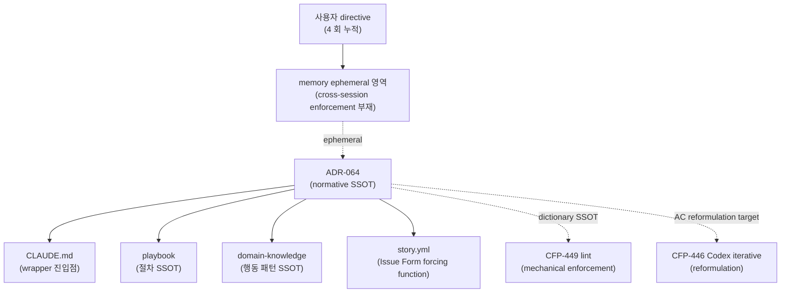

# ADR-064: codeforge 결정 원칙 mandate — 결정 내용·결정 제시·적용 속도 normative SSOT

## 상태

Accepted (2026-05-12). carrier_story = CFP-445.

## 컨텍스트

codeforge 의 결정 원칙은 다음 4 회 누적 사용자 directive (2026-05-11 ~ 2026-05-12, KST) 로 명문화 동인이 형성되었다:

1. (2026-05-11) "모든 작업의 결정은 best-effort 하고 많은 케이스를 커버할 수 있도록 선택한다. 전체적인 적용과 적극적인 개정을 지향하고 임시적인 것이나 떼우기식 변경은 선택지도 내지말라."
2. (2026-05-12) "전체적으로 이렇게 주는 내용이 사용자 친화적이지 않아서 선택을 오히려 방해한다. 이 부분도 함께 개선해야겠다."
3. (2026-05-12) "besteffort하라고 했던 개정과 함께 가능한 subagent를 통해 빠르게 적용할 수 있도록 해라. codeforge의 epic open부터 close까지의 시간이 단축되는 것이 베스트이다."
4. (Codex pre-review iterative reformulation directive — CFP-446 별도 carrier)

본 ADR 은 directive 1·2·3 의 normative SSOT 를 정립한다. directive 4 는 [CFP-446](https://github.com/mclayer/plugin-codeforge/issues/446) 별도 carrier 분리 (ADR-052 Amendment 2 target).

본 normative SSOT 가 부재하면:

- 결정 제안 시점 menu 자체에 forbid 영역 옵션이 reflex 로 진입 (band-aid 채택 risk)
- Orchestrator 의 LLM reasoning 이 sequential bias (안전 default) 를 활성화 → Epic lifecycle 지연
- 사용자 발화 directive 가 memory ephemeral 영역에 머무름 → cross-session enforcement 부재

선행 SSOT 정합:

- [ADR-039](ADR-039-orchestrator-subagent-default-for-codeforge-modification-work.md) — Orchestrator 가 codeforge 수정 작업 시 모든 work 를 Agent tool spawn 으로 수행. 분기 logic 자체 차단. 본 ADR Trace 4 의 직접 확장 모체.
- [ADR-058](ADR-058-adr-sunset-criteria-mandate.md) — ADR `is_transitional: true | false` frontmatter + `## 해소 기준` 섹션 의무. 본 ADR `is_transitional: false` 고정 영원 정책 — 외연 분리 anchor.
- [ADR-060](ADR-060-evidence-enforceable-promotion-framework.md) — 4-tier (warning / blocking-on-pr / blocking-on-merge / hotfix-bypass) evidence-enforceable 점진 승격 framework. CFP-449 forbid-list mechanical lint 가 본 framework 의 신규 warning-tier entry (`decision-principle-vocab`) 로 진입 — 기존 entry `adr-sunset-criteria` 와 병렬.
- [ADR-054](ADR-054-doc-only-story-fast-path.md) — doc-only Story fast-path 분류. 신규 ADR 도입 = full-lane 강제 — 본 carrier 가 그 패턴.
- [ADR-052](ADR-052-codex-proactive-check-touchpoints.md) — 6 touchpoint Codex proactive check. CFP-446 sibling Story 가 Amendment 2 target (touchpoint #1 single-shot → iterative reformulation).

## 결정

본 ADR 은 결정 원칙의 normative declaration. mechanical enforcement 는 CFP-449 (forbid-list lint warning tier 진입) / CFP-446 (Codex pre-review iterative reformulation) 별도 carrier 분리 — evidence-enforceable 점진 적용 절차 (ADR-060) 정합.

### 결정 1 — 4 어휘 운영적 정의 (Trace 1)

다음 4 어휘를 결정 원칙의 normative anchor 로 채택한다.

| 어휘 | 운영적 정의 |
|---|---|
| **best-effort** | 결정 제안 시점에 도달 가능한 최선의 안을 채택. 추후 보완 핑계로 도출된 약화 옵션 의존 금지. (Tech Debt Quadrant — Prudent Deliberate) |
| **broad coverage** | 결정 menu 작성 시점에 side effect / edge case / 외연 영역까지 후보 포함. (AWS Well-Architected — 5 pillar review) |
| **full-scope** | 결정의 scope 가 도메인 전체에 즉시 적용. partial / opt-in 분기 차단. |
| **active amendment** | normative SSOT 의 강화 방향 amendment 적극 발의. 강도 약화 방향은 ADR-058 §결정 5 sunset_justification 의무로 차단 (top-down ratchet). |

본 4 어휘는 결정 제안 시점 (proposing-time) 에 한정 적용. 외연 영역 (`hotfix-bypass:*` label, deprecation 사후 운영, source code fallback / safe-default 런타임 로직) 은 본 ADR scope 외.

### 결정 2 — forbid-list 어휘 dictionary (Trace 1)

다음 8 어휘를 결정 제안 시점 menu 에서 제거 의무 어휘로 고정한다.

| Forbid-list 어휘 | 운영적 범위 |
|---|---|
| 임시 | "임시 결정" / "임시 패치" 등 결정 후보 영역 |
| 단계적 | "단계적 도입" / "단계적 확장" 등 결정 후보 분기 |
| 일단 | "일단 도입" / "일단 시도" 등 결정 후보 |
| 우선 | 시간 우선순위 의미 한정 (예: "우선 채택 후 보완"). 일반 우선순위 (1순위 priority) 는 외연 |
| 잠정 | "잠정 결정" / "잠정 운영" 등 |
| 가벼운 | "가벼운 버전" / "가벼운 prototype" 등 |
| minimal viable | "minimal viable" / "MVP-only" 등 결정 후보 |
| quick win | "quick win" / "quick fix" 등 결정 후보 |

**Amendment 2 (CFP-610, 2026-05-13) — 4 어휘 추가** (사용자 frustration evidence 기반, 한국어 native + solo dev cold reader 가독성 영역):

| Forbid-list 어휘 (Amendment 2) | 운영적 범위 |
|---|---|
| 박제 | codeforge family 자체 신조어 — 의미 불투명 ("결정을 못 박듯 명문화 / 확정 / 기재" 다층 의미). Phase 1 dialog 사용자 발화 verbatim: "아니 니가 쓰는 표현이다. 나는 그 표현이 뭔지 모르겠다고" |
| 못 박기 | 결정 noise — 미합의 상태에 사용 시 가짜 합의 인상. 한국어 형태 변화 처리 의무 (못박기 / 못박는 / 못 박았다 등 — CFP-610 Story 2 lint script regex union 영역) |
| pin | 영어 jargon — 한국어 native 사용자 의미 불투명. 일반 영어 어휘 false-positive risk (예: "pin to top") — word-boundary regex + 5 scope 한정 + blockquote exempt 로 완화 |
| freezing | 영어 jargon — 동일. 외부 인용 영역 (blockquote `>` prefix) exempt |

본 dictionary 는 [CFP-449](https://github.com/mclayer/plugin-codeforge/issues/449) mechanical lint script (ADR-060 warning tier 신규 entry `decision-principle-vocab` — 기존 entry `adr-sunset-criteria` 와 병렬) 의 SSOT — Amendment 2 시점 12 어휘. lint scope 는 5 영역 한정 — `docs/adr/**` / `docs/change-plans/**` / `CLAUDE.md` / `docs/orchestrator-playbook.md` / `templates/**`. audit-trailed exempt channel = `hotfix-bypass:decision-principle-vocab` label (ADR-024 Amendment 3 정합).

**Dictionary SSOT 신설 (Amendment 2, CFP-610)**: `docs/wording-dictionary.md` — 2 카테고리:
- 카테고리 (a) **사용 금지 어휘 (forbid)**: 본 §결정 2 12 어휘 중 Amendment 2 4 어휘 (`박제` / `못 박기` / `pin` / `freezing`) 와 verbatim sync — dictionary 가 SSOT, 본 §결정 2 표 가 mirror. 변경 시 lockstep 갱신 의무.
- 카테고리 (b) **사용 허용 + 평문 정의 동반 의무** (codeforge 식별자 어휘): `normative` / `sibling sync` / `kind:contract` / `ratchet` / `mirrored field` — 시점 1 entry **5개 cap** (scope creep 차단). 사용 시 inline 평문 정의 동반 의무 (예: `normative ("강제 규칙")`). 정의 누락 시 lint advisory warning (exit 0 + console warn, baseline 폭증 risk 완화).

추가 entry 도입 = 별 CFP 의무 (ADR-064 §결정 5 CFP scope unitary 정합). lint mechanical enforcement = [CFP-610](https://github.com/mclayer/plugin-codeforge/issues/610) Story 2 Phase 2 PR (`scripts/check-wording-dictionary.sh` + `templates/github-workflows/wording-dictionary.yml` + ADR-060 39번째 warning-tier registry entry + `hotfix-bypass:wording-dictionary` 13번째 family member).

dictionary 확장 amendment 는 강화 방향 = 활성. dictionary 축소 amendment 는 약화 방향 = 차단 (ADR-058 §결정 5 sunset_justification 의무).

dictionary 본문 자체 또는 외부 인용 (사용자 발화 verbatim 영역) 영역에서 본 어휘 등장은 외연 허용.

### 결정 3 — 결정 제시 5 룰 (Trace 2)

Orchestrator 가 사용자에게 결정 제안 / 질문 시 다음 5 룰을 적용한다.

1. **Derived default 기본값 적용** — 컨텍스트로 합리적 default 도출 가능 시 `AskUserQuestion` 발화 생략. derived default 직접 declare + 결과 보고 (사용자가 정정 의무). 예외: 진짜 가치 판단 (사용자 선호도 / 가치 판단 기준) 또는 미공개 컨텍스트 (Orchestrator 가 알 수 없는 사용자 측 정보).
2. **옵션 dump 금지** — 결정 후보 N 종을 reflex 로 나열 금지. 후보가 2+ 이면 권장 1 안 + 대안 1 안 (최대 2) 까지 제시. 3+ 후보는 brainstorm 영역 (별도 Phase 0).
3. **식별자 사전 요약** — ADR / CFP / 코드 식별자 인용 시 핵심 결정 한 문장 요약을 대화 내에 사전 제시 후 질문 / 제안 본문 진입. memory `feedback_explain_before_ask` 의 normative 승격.
4. **질문 brevity** — 질문은 1 문장 단위. 다중 질문 시 numbered list (최대 3 항목). 컨텍스트 길이 < 핵심 질문 길이 의 비율 유지.
5. **`AskUserQuestion` 범위 제한** — 본 도구의 발화는 (a) 가치 판단 영역 (b) 미공개 컨텍스트 영역 2 종에 한정. derived default 도출 가능 영역에서 `AskUserQuestion` 발화 = 본 ADR 위반.
6. **표현 발화 전 맥락 파악 + 문장 구조 self-check (Amendment 2 신설, CFP-610)** — Orchestrator 가 사용자 응답 (= text turn) 발화 직전 의무 self-check.
   - **맥락 파악 항목**: 직전 turn 의 핵심 결정 / 미해결 분기점 / 사용자 발화 요지 (지금 무엇을 묻는가 / 무엇을 지시하는가) / 현재 진행 단계 (Phase 0 / Phase 1 / Phase 2 / spec 작성 / FIX 루프 / lane spawn 등).
   - **문장 구조 self-check 항목** (cold reader 가독성 — 사용자가 직전 컨텍스트 모른다는 가정):
     - 완전한 문장 (주어·서술어 완결)
     - 갑작스러운 jargon 등장 차단 (`docs/wording-dictionary.md` 카테고리 a/b 사전 확인)
     - 식별자 (ADR/CFP/SSOT) 인용 시 1줄 평문 요약 동반 (룰 3 강화 정합)
     - 다중 분기점 동시 발화 차단 (numbered list 분리, 룰 4 강화 정합)
   - **강제 강도**: behavioral directive only — mechanical enforce 불가 (Orchestrator runtime 영역, turn-final hook 부재). CLAUDE.md / `docs/orchestrator-playbook.md` 안 normative inscribe + retro audit signal (PMOAgent retro file §wording-discipline 표).
   - **적용 범위**: wrapper + 모든 consumer (CLAUDE.md L208 normative 정합).
   - **룰 1/3/4 와의 관계**: 룰 6 = 룰 1/3/4 발동 전 상위 self-check 단계 (룰 1 derived default 도출 / 룰 3 식별자 사전 요약 / 룰 4 질문 brevity 전 컨텍스트·구조 점검).

### 결정 4 — Multi-task spawn parallel default + sequential 강제 3 사유 (Trace 4)

Orchestrator 가 multi-task spawn 결정 시 default = **parallel** (단일 메시지에 다중 Agent tool call). sequential 선택은 다음 3 사유 중 1 종 명시 의무.

| Sequential 강제 사유 | 운영적 정의 |
|---|---|
| **state dependency** | task N+1 이 task N 의 출력 (Story file section / ADR 번호 / 합의 결과) 을 입력으로 의존 |
| **shared resource** | 동일 file write / 동일 GitHub label 변경 / 동일 branch commit 등 lock 필요 영역 |
| **ordering invariant** | 출력 ordering 자체가 의미 있는 영역 (예: ADR 번호 sequential append, FIX Ledger row append) |

3 사유 중 1 종도 부재하면 default = parallel. sequential 선택 시 spawn prompt 또는 commit message 에 사유 1 종 명시. ADR-039 §결정 7 `policy_violation_subdecision` 의 결정 영역 확장.

본 룰은 외부 분산 시스템 표준 패턴 (Amdahl's Law / Critical Path Method / MapReduce shuffle dependency) 과 정합.

### 결정 5 — CFP scope unitary 룰

한 CFP 안에서 "경량 → full" 단계 채택 금지. 별개 CFP 분리는 허용 (예: `CFP-N v0.1` + `CFP-N+1 v1.0` 가 독립 brainstorm + 독립 Story + 독립 PR).

본 룰은 결정 제안 시점 scope 폭발 방지 메커니즘 — PMOAgent vertical slice 분해 영역과 직교 (PMOAgent 는 한 CFP 안에서의 sub-task 분해, 본 룰은 CFP scope 단위 자체).

### 결정 6 — 결정 제시 시점 (proposing-time) 영역 정의

본 ADR 의 모든 결정은 다음 4 시점 영역에 적용한다.

| 영역 | 정의 |
|---|---|
| **brainstorm Phase 1 결정 제안** | `superpowers:brainstorming` / `codeforge:codeforge-brainstorm` skill 내부의 결정 제안 영역 |
| **writing-plans plan 작성** | `superpowers:writing-plans` skill 내부의 결정 영역 |
| **Issue Form 제출 시 의사결정** | `templates/github-issue-forms/story.yml` 입력 시점 |
| **lane 진입 직전 spawn prompt 작성** | Orchestrator 의 subagent spawn prompt 작성 영역 |

외연 영역:

- 운영 incident 의 5분 hotfix (operational-time, `hotfix-bypass:*` label 부착 PR)
- ADR-058 `is_transitional: true` 안전망 ADR 분류 영역 (의도된 안전망)
- deprecation path 사후 운영 (replacement 채택 자체는 in-scope)
- source code 의 fallback / safe-default 런타임 로직

### 결정 7 — Self-application top-down ratchet

본 ADR amendment 는 다음 방향만 허용:

- **scope 확장** — forbid-list dictionary 9 → 10 어휘 등
- **강도 강화** — sequential 강제 사유 3 → 2 축소 등

다음 방향 amendment 는 ADR-058 §결정 5 sunset_justification 의무로 차단:

- `is_transitional: false → true` 다운그레이드
- forbid-list dictionary 축소
- sequential 강제 사유 확장 (parallel default 약화 방향)
- 결정 제시 5 룰 (Trace 2) 약화

본 결정은 ADR-058 amendment ratchet 차단 메커니즘의 self-application.

### 결정 8 — Declaration only (기계적 강제 분리)

본 ADR 은 정책 declaration only. 다음 영역은 별도 carrier 분리 — evidence-enforceable 점진 적용 절차 (ADR-060) 정합.

- **CFP-449** — forbid-list mechanical lint (ADR-060 warning tier 신규 entry `decision-principle-vocab` — 기존 entry `adr-sunset-criteria` 와 병렬, 5 영역 scope 한정, `hotfix-bypass:decision-principle-vocab` label exempt channel)
- **CFP-446** — Codex pre-review iterative reformulation (ADR-052 Amendment 2 — touchpoint #1 single-shot → max 3 rounds)
- **CFP-609** — Amendment 1 carrier — parallel-dispatch-protocol-v1 registry 신설 + `parallel-dispatch-prompt-check` warning tier lint 신설 (Trace 4 implementation contract, execution-time enforcement)
- **CFP-α (잠재)** — 요구사항 traceability framework (본 ADR 인용 의무 1 순위 consumer)
- **CFP-β (잠재)** — Epic open→close KPI dashboard (`templates/epic-results.md` frontmatter 에 `opened_at` / `closed_at` field 신설 의무 — 현재 미존재, PMOAgent owner path / dashboard 구축 일체 carrier)
- **CFP-610 (Amendment 2 carrier)** — wording-dictionary 신설 + §결정 2 forbid-list 12 어휘 확장 + §결정 3 룰 6 신설 + §결정 9 신설 (본 amendment) + 39번째 ADR-060 warning-tier entry `wording-dictionary` + `hotfix-bypass:wording-dictionary` 13번째 family member

### 결정 9 — Stop-time 평문 정리 의무 (Amendment 2 신설, CFP-610)

Orchestrator 가 사용자 응답 (= text turn) 종료 시 평문 정리 step 의무 부착.

- **cap**: 300자 ± 50자 (사용자 directive 2026-05-13 verbatim "필요한말만 300자 수준에서"). I-5 dimensional empirical grounding 정합 — empirical-source = 사용자 directive verbatim.
- **포함 항목**: 직전 turn 의 핵심 결정 / 다음 step / 미해결 분기점.
- **생략 가능 영역**: tool_use only turn (사용자 응답 아닌 turn, 예: TodoWrite 단독 / Read Q&A 답변 / Status report 평문 자체) — ADR-039 Inline whitelist 4-entry 정합.
- **강제 강도**: behavioral directive only — mechanical enforce 불가 (turn-final output hook 부재, platform 한계 verified). CLAUDE.md / `docs/orchestrator-playbook.md` 안 normative inscribe + retro audit signal (PMOAgent retro file §wording-discipline 표).
- **적용 범위**: wrapper + 모든 consumer (CLAUDE.md L208 normative 정합).
- **카테고리 (b) entry 5개 cap (Amendment 2 신설)**: `docs/wording-dictionary.md` 카테고리 (b) "사용 허용 + 평문 정의 의무" entry 가 codeforge 식별자 전체로 확장 시 doc 작성 부담 폭증 risk. **시점 1 entry 5개 cap** (Amendment 2 시점 entry = `normative` / `sibling sync` / `kind:contract` / `ratchet` / `mirrored field`) + 추가 entry 도입 = 별 CFP 의무 (scope creep 차단).

본 결정은 결정 6 proposing-time scope 영역 **외** (Orchestrator output stop-time 영역). 외연 영역으로 본 ADR 의 다른 결정과 분리 운영 — 결정 1-5 (proposing-time 결정 menu 내용 + 제시) / 결정 6 (proposing-time scope 정의) / 결정 7 (ratchet) / 결정 8 (declaration only) / **결정 9 (stop-time wording output)** disjoint.

## Amendment 1 — §결정 4 Trace 4 Implementation Contract (CFP-609, 2026-05-13)

### 배경

§결정 4 (Trace 4) 는 normative declaration — "Orchestrator multi-task spawn default = parallel" 명문화. 그러나 실제 execution 에서 DeveloperPLAgent + 다른 lane PL agent 가 plan task 를 sequential 진행하는 bias 가 mctrader MCT-159 (codeforge consumer 데뷔작) Phase 2 실측에서 발견되었다 — 55min wall-clock (mctrader-data#49 PR merged sha 1bd50216), 의존성 부재 Task 8~14 sequential 진행 결과 ~40-45% wall-clock 손실 추정.

본 Amendment 는 §결정 4 normative 선언의 **implementation contract** 를 신설한다. 별 ADR 신설 차단 — duplicate registry + self-application top-down ratchet (§결정 7) 정합.

ratchet 방향 = scope 확장 + 강도 강화 (3 사유 정밀화 → 6 enum codeforge 도메인 instantiation + execution-time enforcement 박제). 약화 방향 0건.

### Amendment 결정 1 — parallel-dispatch-protocol-v1 registry 신설

`docs/inter-plugin-contracts/parallel-dispatch-protocol-v1.md` 를 **kind:registry** 로 신설한다. canonical SSOT = wrapper (`mclayer/plugin-codeforge`), sibling sync 면제 (ADR-008 §결정 2 + ADR-010 §결정 2 정합). MANIFEST.yaml `registries:` block row append 의무. lane-agnostic — 모든 lane PL agent (DeveloperPL / ArchitectPL / RequirementsPL / DesignReviewPL / CodeReviewPL / SecurityTestPL) 가 본 registry schema 준수.

선례 정합 = debate-protocol-v1 / severity-propagation-v1 / evidence-check-registry-v1 / label-registry-v2 / comment-prefix-registry-v1 / fix-event-v1 (wrapper-owned canonical + sibling sync 면제).

본 registry 는 다음 3 layer 를 정의한다:

**1. Plan task 의존성 DAG 3 field** — codeforge 가 plan 작성 시 각 task block 에 의무 박제:

| field | 의미 | 부재 시 default |
|---|---|---|
| `의존` (depends_on) | `"[Task N] 완료 후"` 형식 | `"없음"` 명시 |
| `병렬 가능` (parallel_with) | `"[Task M, Task K]"` 형식 | `"없음"` 명시 |
| `충돌 영역` (conflict_scope) | `"file:<path>"` 또는 `"method:<signature>"` | `"없음"` 명시 |
| `순차 의무 사유` (sequential_mandate_reason, 선택) | 6 enum 중 1 종 | 부재 = parallel default |

**2. 6 순차 의무 영역 enum** — ADR-064 §결정 4 의 3 사유 (state dependency / shared resource / ordering invariant) 의 codeforge 도메인 instantiation:

| Enum 값 | 사유 분류 | 운영적 정의 |
|---|---|---|
| `tdd_red_phase` | state dependency | red phase test 작성 → 실행 → 실패 확인 → green phase 진입 순서 의무 |
| `schema_migration` | state dependency | DB schema migration forward / backward / data backfill 순서 의무 |
| `adr_reservation_append` | ordering invariant | `docs/adr/ADR-RESERVATION.md` sequential append (ADR-050 §결정) |
| `fix_ledger_append` | ordering invariant | Story §10 FIX Ledger row append (fix-event-v1 contract, CFP-32 Orchestrator 독점) |
| `sibling_sync_ordering` | ordering invariant | canonical PR merge 완료 후 sibling sync PR open (ADR-010 §sibling sync PR) |
| `marketplace_sync_ordering` | ordering invariant | marketplace sync PR 선행 merge → plugin PR merge (ADR-063 §결정 2) |

**6 enum close-set assumption**: 6 enum 외 sequential 선택 시 = ADR-039 §결정 7 `policy_violation_subdecision` 발화 + spawn prompt 사유 명시 의무. enum 확장 (예: label-registry MINOR bump 의 shared resource 분류) 은 별 CFP carrier 신설 + amendment 의무.

**3. Orchestrator dispatch prompt 4 의무 항목** — lane PL agent spawn 시 prompt 에 반드시 포함:

1. plan DAG 분석 결과 박제 (parallel_with batches list verbatim)
2. PL 에 자율 병렬 권한 명시 (`pl_autonomous_parallel_authority: required`)
3. sequential 의무 영역만 명시 (6 enum 중 해당만)
4. file-level conflict resolution 패턴 박제 (same-file-different-method / same-file-different-section / same-file-same-method)

### Amendment 결정 2 — Lane PL agent 자율 병렬 결정 tree (4 분기, sibling sync)

lane PL agent (DeveloperPLAgent 외 확장 가능 — RequirementsPLAgent / ArchitectPLAgent / DesignReviewPL / CodeReviewPL / SecurityTestPL) 가 따르는 4-분기 결정 tree:

```
1. plan 의 parallel_with hint 있음
   → multi-instance subagent 병렬 dispatch (default)

2. parallel_with hint 부재 + 파일 disjoint + interface 의존 0
   → 자율 병렬 dispatch (default — PL 자체 판단, plan hint 부재 시)

3. same-file-different-method + commit atomic 분리 capability 보유
   → 병렬 dispatch + 완료 후 PL merge (commit atomic 분리 후 sync)
   → commit atomic 분리 capability 부재 시 분기 4 fallback

4. same-file-same-method 또는 schema_migration
   → sequential 의무 (6 enum 중 해당 명시)
```

codeforge-develop `agents/DeveloperPLAgent.md` 가 본 4-분기 결정 tree 를 self-write (sibling sync — Phase 2 carrier, ADR-010 §sibling sync PR 정합). 다른 lane PL agent 확장 = 별 CFP follow-up.

### Amendment 결정 3 — env=0 / env=1 동등성

| 환경 | dispatch 방식 | 금지 패턴 |
|---|---|---|
| `env=0` (default subagent context, ADR-039) | Orchestrator round-trip polyfill — PL 이 batch N task multi-instance subagent dispatch 를 1 round trip 안에 spawn | 재귀 spawn (platform inherent) / worker-to-worker SendMessage (codeforge policy) |
| `env=1` (agent teams, ADR-044) | TeamCreate + SendMessage continuous dialog — Lead ↔ Worker | nested team / team-of-teams / one-team-per-lead 위반 |

양 환경 동일 protocol schema 준수. env=0 round-trip polyfill 의 super-linear token cost 정량 측정 = MCT-160 retro 측정 의무 (broad coverage signal 보강 carrier).

### Amendment 결정 4 — Self-application 의무 (mechanical enforcement carrier)

본 Amendment 1 의 mechanical enforcement = `parallel-dispatch-prompt-check` warning tier lint (ADR-060 evidence-enforceable promotion framework 정합):

- detect_command: `bash scripts/check-parallel-dispatch-prompt.sh` (1-line shim → python script — ADR-061 python-script-writing-convention 정합)
- workflow: `templates/github-workflows/parallel-dispatch-prompt-check.yml` (`continue-on-error: true`, `hotfix-bypass:parallel-dispatch-prompt` label exempt channel)
- bypass channel: `hotfix-bypass:parallel-dispatch-prompt` label (ADR-024 Amendment 3 정합)
- entry name = frontmatter `mechanical_enforcement_actions[].action` verbatim (ADR-040 Amendment 3 §결정 7.A 정합)

본 CFP-609 자체가 Trace 4 default parallel 의 first applied case 자기 시연 — Phase 0 brainstorm 7 agent 병렬 + Phase 1 governance docs 7-way 병렬 (Tasks 1/2/4/5/7/11/12) + Phase 2 sibling sync 2-way 병렬 (Tasks 9/10). sequential 진행 시 self-application top-down ratchet (§결정 7) 위배 — PMOAgent retro 가 발화 의무.

### Amendment 결정 5 — review-verdict-v4 packet 영향 없음

본 Amendment 1 추가가 review-verdict-v4 `findings[]` enum 또는 `pl_recommendation` enum 영향 0건. ArchitectPL 자체 review-verdict packet 발화 시 본 protocol 박제 의무 영역 (mechanical enforcement = §Amendment 결정 4 의 warning tier lint) 만 인용. review-verdict-v4 schema MINOR bump 0건.

### Amendment 결정 6 — 약화 차단 (ratchet 정합)

본 Amendment 1 의 약화 방향 (예: `pl_autonomous_parallel_authority` `required → optional` 다운그레이드 / 6 enum 의 sequential 사유 확장 / `parallel-dispatch-prompt-check` warning tier 폐기) 은 §결정 7 self-application top-down ratchet 차단 영역 — ADR-058 §결정 5 sunset_justification 의무. 강화 방향 (예: 6 → 5 enum 축소 / warning → blocking-on-pr 승격 / `pl_autonomous_parallel_authority` `optional → required` 강화) 은 활성.

## 결과

### 긍정 효과

- 결정 시점 menu 자체에서 band-aid 옵션 차단 (Google SRE 사후 audit 보다 한 단계 위 forcing function)
- Orchestrator reflex 옵션 dump UX 차단 — 사용자 발화 directive 2 (UX 개선) 의 직접 해소
- parallel default 명문화로 sequential bias 자동 활성화 차단 — Epic open→close 시간 단축 measurable signal 확보
- memory ephemeral 영역의 cross-session enforcement 부재 문제 해소 — 사용자 directive 4 회 누적의 normative 승격

### 부정 효과 / Trade-off

- forbid-list dictionary false positive risk (예: "우선" 어휘 일반 의미) — scope 5 영역 한정 + audit-trailed exempt channel 로 완화
- derived default 룰의 LLM 한계 — 잘못된 default 도출 시 사용자 정정 의무 (재발 누적 시 CFP-γ amendment 후보)
- amendment top-down ratchet 의 false rigidity risk — ADR-058 §결정 5 sunset_justification 의무가 visibility 제공으로 완화

### 영향 영역

- `CLAUDE.md` 신규 단락 "결정 원칙" 추가 (위치 = "오케스트레이션 규칙" 직전)
- `docs/orchestrator-playbook.md` 적용 절차 checklist 추가
- `docs/domain-knowledge/domain/governance-principle/decision-style.md` 신설 (DomainAgent direct write 권한)
- `templates/github-issue-forms/story.yml` `decision_principle_compliance` advisory 체크박스 추가 (forcing function)
- 6 lane plugin + consumer overlay 전체 적용 (wrapper level normative SSOT)

### Marketplace / version bump 영향

본 ADR 도입 = CLAUDE.md 의미 변경 → ADR-037 룰에 의한 codeforge wrapper **MINOR 버전 bump** 발화. ADR-063 3-file atomic invariant 적용 의무: `.claude-plugin/plugin.json` + `CHANGELOG.md` + `mclayer/marketplace/.claude-plugin/marketplace.json` 동시 sync. version bump 자체 + atomic invariant 절차 결정은 본 ADR §결정 4 parallel default 정합 — ordering 은 ADR-063 §결정 2 정합 (marketplace sync PR 선행 merge → plugin PR merge). plugin PR 선행 merge 는 ADR-063 §결정 2 Anti-pattern.

## 해소 기준

N/A — permanent policy

본 ADR 은 governance carrier 영구 정책. self-defeat 회피 (recursive sunset 무한 후행 차단). 패턴 정합 사례 = ADR-042 / ADR-016 / ADR-013 / ADR-058 (governance carrier ADR 자기 분류 = `is_transitional: false`).

본 ADR 의 효력 종료 조건은 본 ADR 의 supersede 또는 codeforge 의 결정 원칙 governance 자체 폐지뿐.

## 다이어그램



## 관련 파일

- [ADR-039](ADR-039-orchestrator-subagent-default-for-codeforge-modification-work.md) — subagent default (Trace 4 모체)
- [ADR-052](ADR-052-codex-proactive-check-touchpoints.md) — Codex proactive check (CFP-446 Amendment 2 target)
- [ADR-053](ADR-053-structural-change-restart-prerequisite.md) — 구조적 변경 재구동 (본 ADR merge 후 marketplace sync 의무)
- [ADR-054](ADR-054-doc-only-story-fast-path.md) — doc-only Story fast-path (신규 ADR = full-lane 강제 anchor)
- [ADR-058](ADR-058-adr-sunset-criteria-mandate.md) — sunset criteria mandate (`is_transitional` 분류 + ratchet 차단)
- [ADR-060](ADR-060-evidence-enforceable-promotion-framework.md) — evidence-enforceable framework (CFP-449 warning tier 진입 base)
- [ADR-063](ADR-063-marketplace-atomic-invariant.md) — 3-file atomic invariant (본 ADR version bump 적용 의무)
- `CLAUDE.md` — wrapper 진입점 cross-link
- `docs/orchestrator-playbook.md` — 적용 절차 checklist
- `docs/domain-knowledge/domain/governance-principle/decision-style.md` — 행동 패턴 + 적용 사례 SSOT
- `templates/github-issue-forms/story.yml` — Issue Form forcing function
