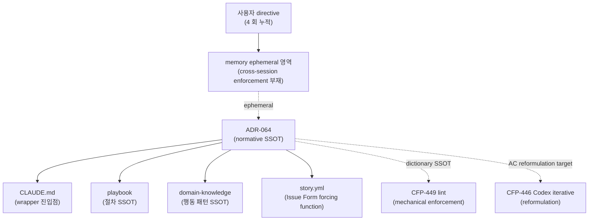

# ADR-064: codeforge 결정 원칙 mandate — 결정 내용·결정 제시·적용 속도 normative SSOT

## 상태

Accepted (2026-05-12). carrier_story = CFP-445.

## 컨텍스트

codeforge 의 결정 원칙은 다음 4 회 누적 사용자 directive (2026-05-11 ~ 2026-05-12, KST) 로 명문화 동인이 형성되었다:

1. (2026-05-11) "모든 작업의 결정은 best-effort 하고 많은 케이스를 커버할 수 있도록 선택한다. 전체적인 적용과 적극적인 개정을 지향하고 임시적인 것이나 떼우기식 변경은 선택지도 내지말라."
2. (2026-05-12) "전체적으로 이렇게 주는 내용이 사용자 친화적이지 않아서 선택을 오히려 방해한다. 이 부분도 함께 개선해야겠다."
3. (2026-05-12) "besteffort하라고 했던 개정과 함께 가능한 subagent를 통해 빠르게 적용할 수 있도록 해라. codeforge의 epic open부터 close까지의 시간이 단축되는 것이 베스트이다."
4. (Codex pre-review iterative reformulation directive — CFP-446 별도 carrier)

본 ADR 은 directive 1·2·3 의 normative SSOT 를 정립한다. directive 4 는 [CFP-446](https://github.com/mclayer/plugin-codeforge/issues/446) 별도 carrier 분리 (ADR-052 Amendment 2 target).

본 normative SSOT 가 부재하면:

- 결정 제안 시점 menu 자체에 forbid 영역 옵션이 reflex 로 진입 (band-aid 채택 risk)
- Orchestrator 의 LLM reasoning 이 sequential bias (안전 default) 를 활성화 → Epic lifecycle 지연
- 사용자 발화 directive 가 memory ephemeral 영역에 머무름 → cross-session enforcement 부재

선행 SSOT 정합:

- [ADR-039](ADR-039-orchestrator-subagent-default-for-codeforge-modification-work.md) — Orchestrator 가 codeforge 수정 작업 시 모든 work 를 Agent tool spawn 으로 수행. 분기 logic 자체 차단. 본 ADR Trace 4 의 직접 확장 모체.
- [ADR-058](ADR-058-adr-sunset-criteria-mandate.md) — ADR `is_transitional: true | false` frontmatter + `## 해소 기준` 섹션 의무. 본 ADR `is_transitional: false` 고정 영원 정책 — 외연 분리 anchor.
- [ADR-060](ADR-060-evidence-enforceable-promotion-framework.md) — 4-tier (warning / blocking-on-pr / blocking-on-merge / hotfix-bypass) evidence-enforceable 점진 승격 framework. CFP-449 forbid-list mechanical lint 가 본 framework 의 신규 warning-tier entry (`decision-principle-vocab`) 로 진입 — 기존 entry `adr-sunset-criteria` 와 병렬.
- [ADR-054](ADR-054-doc-only-story-fast-path.md) — doc-only Story fast-path 분류. 신규 ADR 도입 = full-lane 강제 — 본 carrier 가 그 패턴.
- [ADR-052](ADR-052-codex-proactive-check-touchpoints.md) — 6 touchpoint Codex proactive check. CFP-446 sibling Story 가 Amendment 2 target (touchpoint #1 single-shot → iterative reformulation).

## 결정

본 ADR 은 결정 원칙의 normative declaration. mechanical enforcement 는 CFP-449 (forbid-list lint warning tier 진입) / CFP-446 (Codex pre-review iterative reformulation) 별도 carrier 분리 — evidence-enforceable 점진 적용 절차 (ADR-060) 정합.

### 결정 1 — 4 어휘 운영적 정의 (Trace 1)

다음 4 어휘를 결정 원칙의 normative anchor 로 채택한다.

| 어휘 | 운영적 정의 |
|---|---|
| **best-effort** | 결정 제안 시점에 도달 가능한 최선의 안을 채택. 추후 보완 핑계로 도출된 약화 옵션 의존 금지. (Tech Debt Quadrant — Prudent Deliberate) |
| **broad coverage** | 결정 menu 작성 시점에 side effect / edge case / 외연 영역까지 후보 포함. (AWS Well-Architected — 5 pillar review) |
| **full-scope** | 결정의 scope 가 도메인 전체에 즉시 적용. partial / opt-in 분기 차단. |
| **active amendment** | normative SSOT 의 강화 방향 amendment 적극 발의. 강도 약화 방향은 ADR-058 §결정 5 sunset_justification 의무로 차단 (top-down ratchet). |

본 4 어휘는 결정 제안 시점 (proposing-time) 에 한정 적용. 외연 영역 (`hotfix-bypass:*` label, deprecation 사후 운영, source code fallback / safe-default 런타임 로직) 은 본 ADR scope 외.

### 결정 2 — forbid-list 어휘 dictionary (Trace 1)

다음 8 어휘를 결정 제안 시점 menu 에서 제거 의무 어휘로 고정한다.

| Forbid-list 어휘 | 운영적 범위 |
|---|---|
| 임시 | "임시 결정" / "임시 패치" 등 결정 후보 영역 |
| 단계적 | "단계적 도입" / "단계적 확장" 등 결정 후보 분기 |
| 일단 | "일단 도입" / "일단 시도" 등 결정 후보 |
| 우선 | 시간 우선순위 의미 한정 (예: "우선 채택 후 보완"). 일반 우선순위 (1순위 priority) 는 외연 |
| 잠정 | "잠정 결정" / "잠정 운영" 등 |
| 가벼운 | "가벼운 버전" / "가벼운 prototype" 등 |
| minimal viable | "minimal viable" / "MVP-only" 등 결정 후보 |
| quick win | "quick win" / "quick fix" 등 결정 후보 |

**Amendment 2 (CFP-610, 2026-05-13) — 4 어휘 추가 / Amendment 4 (CFP-672, 2026-05-14) — 5 어휘로 확장** (사용자 frustration evidence 기반, 한국어 native + solo dev cold reader 가독성 영역):

| Forbid-list 어휘 (Amendment 2 + Amendment 4) | 운영적 범위 |
|---|---|
| 박제 | codeforge family 자체 신조어 — 의미 불투명 ("결정을 못 박듯 명문화 / 확정 / 기재" 다층 의미). Phase 1 dialog 사용자 발화 verbatim: "아니 니가 쓰는 표현이다. 나는 그 표현이 뭔지 모르겠다고" |
| 못 박기 | 결정 noise — 미합의 상태에 사용 시 가짜 합의 인상. 한국어 형태 변화 처리 의무 (못박기 / 못박는 / 못 박았다 등 — CFP-610 Story 2 lint script regex union 영역) |
| pin | 영어 jargon — 한국어 native 사용자 의미 불투명. 일반 영어 어휘 false-positive risk (예: "pin to top") — word-boundary regex + 5 scope 한정 + blockquote exempt 로 완화 |
| freezing | 영어 jargon — 동일. 외부 인용 영역 (blockquote `>` prefix) exempt |
| 별 (standalone) | **Amendment 4 (CFP-672)** — native Korean reader 의미 confusion. standalone `별` 의 native 의미 = "star" (天文) / 한자어 `別` 의미 = "separate". 한국어 native solo dev 가독성 영역 의미 혼동 발화 evidence (CFP-620 Epic 진행 세션). 권장 대체 = `별도` / `별개` / `별 도리` 등 명확 form. 한국어 어휘 — substring match (POSIX `\b` ASCII boundary 의미 없음, blockquote / fenced-code exempt 로 false-positive 완화) |

본 dictionary 는 [CFP-449](https://github.com/mclayer/plugin-codeforge/issues/449) (Amendment 2 carrier `decision-principle-vocab` warning-tier entry) + [CFP-610](https://github.com/mclayer/plugin-codeforge/issues/610) Story 2 (Amendment 2 추가 4 어휘 carrier `wording-dictionary` warning-tier entry) + [CFP-672](https://github.com/mclayer/plugin-codeforge/issues/672) (Amendment 4 추가 5번째 어휘) 의 SSOT — Amendment 4 시점 **13 어휘** (CFP-449 8 + Amendment 2/4 5). audit-trailed exempt channel = `hotfix-bypass:decision-principle-vocab` label (CFP-449 8 어휘) + `hotfix-bypass:wording-dictionary` label (Amendment 2/4 5 어휘) (ADR-024 Amendment 3 정합).

**Lint scope (Amendment 5, CFP-750 — per-word scope decoupling)**: 어휘별 lint scope 가 분리됐다. 어휘 추가는 `FORBID_DICTIONARY` array 가 아닌 per-word `TARGETS` map 의 row append.

| 어휘 분류 | Lint scope | 근거 |
|---|---|---|
| **CFP-449 8 어휘** (`임시` / `단계적` / `일단` / `우선` / `잠정` / `가벼운` / `minimal viable` / `quick win`) | 5 영역 한정 — `docs/adr/**` / `docs/change-plans/**` / `CLAUDE.md` / `docs/orchestrator-playbook.md` / `templates/**` | CFP-449 originally tuned (Amendment 2 baseline, Amendment 5 변경 없음 — `decision-principle-vocab` warning-tier entry 영역) |
| **Amendment 2 4 어휘** (`박제` / `못 박기` / `pin` / `freezing`) | **확장 scope** — 거버넌스 문서 전체 + `docs/inter-plugin-contracts/**` + `CHANGELOG.md` | **Amendment 5 (CFP-750)** — registration ↔ enforcement 2-layer 분리의 enforcement scope 확장 (§Amendment 5 본문 참조) |
| **Amendment 4 1 어휘** (`별` standalone) | 5 영역 한정 (CFP-449 기준선 유지) | Amendment 5 자체 결정 — `별` standalone false-positive collateral (한자어 `別` / 분류 접미사 `~별` 의미 collision) 가 expanded scope 에서 증폭됨이 RequirementsPL 직접 lint verify 로 `[verified]`. `별` retroactive sweep PR carrier 분리 = Amendment 4 §Amendment 결정 6 (L536-538) `[verified]` + #718 F4 disjoint carrier. per-word scope decoupling 의 첫 instantiation — 어휘 추가 시 scope axis 독립 결정 forcing function |

per-word scope decoupling 의 운영 원리: lint script (`scripts/check-wording-dictionary.sh`) 가 어휘별 scope 를 분리 관리 (`TARGETS` map). 신규 어휘 추가 시 (a) scope 5 영역 기본 default (b) Amendment 별도 확장 trigger 명시 시 expanded scope. 어휘 추가 = scope 자동 확장 아님 — scope axis 독립 ratchet (§결정 7 정합).

**Dictionary SSOT 신설 (Amendment 2, CFP-610) + 카테고리 (a) 5 어휘로 확장 (Amendment 4, CFP-672)**: `docs/wording-dictionary.md` — 2 카테고리:
- 카테고리 (a) **사용 금지 어휘 (forbid)**: 본 §결정 2 13 어휘 중 Amendment 2/4 의 5 어휘 (`박제` / `못 박기` / `pin` / `freezing` / `별` standalone) 와 verbatim sync — dictionary 가 SSOT, 본 §결정 2 표 가 mirror. 변경 시 lockstep 갱신 의무.
- 카테고리 (b) **사용 허용 + 평문 정의 동반 의무** (codeforge 식별자 어휘): `normative` / `sibling sync` / `kind:contract` / `ratchet` / `mirrored field` — 시점 1 entry **5개 cap** (scope creep 차단). 사용 시 inline 평문 정의 동반 의무 (예: `normative ("강제 규칙")`). 정의 누락 시 lint advisory warning (exit 0 + console warn, baseline 폭증 risk 완화).

추가 entry 도입 = 새 CFP 의무 (ADR-064 §결정 5 CFP scope unitary 정합 — 본 Amendment 4 자체가 그 패턴 시연). lint mechanical enforcement = [CFP-610](https://github.com/mclayer/plugin-codeforge/issues/610) Story 2 Phase 2 PR (`scripts/check-wording-dictionary.sh` + `templates/github-workflows/wording-dictionary.yml` + ADR-060 warning-tier registry entry + `hotfix-bypass:wording-dictionary` family member). Amendment 4 (CFP-672) 가 이미 활성화된 본 framework 에 entry 1 추가 (framework 재사용 / 새 workflow 신설 0 / mechanical enforcement 비용 0).

dictionary 확장 amendment 는 강화 방향 = 활성. dictionary 축소 amendment 는 약화 방향 = 차단 (ADR-058 §결정 5 sunset_justification 의무).

dictionary 본문 자체 또는 외부 인용 (사용자 발화 verbatim 영역) 영역에서 본 어휘 등장은 외연 허용.

### 결정 3 — 결정 제시 5 룰 (Trace 2)

Orchestrator 가 사용자에게 결정 제안 / 질문 시 다음 5 룰을 적용한다.

1. **Derived default 기본값 적용** — 컨텍스트로 합리적 default 도출 가능 시 `AskUserQuestion` 발화 생략. derived default 직접 declare + 결과 보고 (사용자가 정정 의무). 예외: 진짜 가치 판단 (사용자 선호도 / 가치 판단 기준) 또는 미공개 컨텍스트 (Orchestrator 가 알 수 없는 사용자 측 정보).
2. **옵션 dump 금지** — 결정 후보 N 종을 reflex 로 나열 금지. 후보가 2+ 이면 권장 1 안 + 대안 1 안 (최대 2) 까지 제시. 3+ 후보는 brainstorm 영역 (별도 Phase 0).
3. **식별자 사전 요약** — ADR / CFP / 코드 식별자 인용 시 핵심 결정 한 문장 요약을 대화 내에 사전 제시 후 질문 / 제안 본문 진입. memory `feedback_explain_before_ask` 의 normative 승격.
4. **질문 brevity** — 질문은 1 문장 단위. 다중 질문 시 numbered list (최대 3 항목). 컨텍스트 길이 < 핵심 질문 길이 의 비율 유지.
5. **`AskUserQuestion` 범위 제한** — 본 도구의 발화는 (a) 가치 판단 영역 (b) 미공개 컨텍스트 영역 2 종에 한정. derived default 도출 가능 영역에서 `AskUserQuestion` 발화 = 본 ADR 위반.
6. **표현 발화 전 맥락 파악 + 문장 구조 self-check (Amendment 2 신설, CFP-610)** — Orchestrator 가 사용자 응답 (= text turn) 발화 직전 의무 self-check.
   - **맥락 파악 항목**: 직전 turn 의 핵심 결정 / 미해결 분기점 / 사용자 발화 요지 (지금 무엇을 묻는가 / 무엇을 지시하는가) / 현재 진행 단계 (Phase 0 / Phase 1 / Phase 2 / spec 작성 / FIX 루프 / lane spawn 등).
   - **문장 구조 self-check 항목** (cold reader 가독성 — 사용자가 직전 컨텍스트 모른다는 가정):
     - 완전한 문장 (주어·서술어 완결)
     - 갑작스러운 jargon 등장 차단 (`docs/wording-dictionary.md` 카테고리 a/b 사전 확인)
     - 식별자 (ADR/CFP/SSOT) 인용 시 1줄 평문 요약 동반 (룰 3 강화 정합)
     - 다중 분기점 동시 발화 차단 (numbered list 분리, 룰 4 강화 정합)
   - **강제 강도**: behavioral directive only — mechanical enforce 불가 (Orchestrator runtime 영역, turn-final hook 부재). CLAUDE.md / `docs/orchestrator-playbook.md` 안 normative inscribe + retro audit signal (PMOAgent retro file §wording-discipline 표).
   - **적용 범위**: wrapper + 모든 consumer (CLAUDE.md L208 normative 정합).
   - **룰 1/3/4 와의 관계**: 룰 6 = 룰 1/3/4 발동 전 상위 self-check 단계 (룰 1 derived default 도출 / 룰 3 식별자 사전 요약 / 룰 4 질문 brevity 전 컨텍스트·구조 점검).

### 결정 4 — Multi-task spawn parallel default + sequential 강제 3 사유 (Trace 4)

Orchestrator 가 multi-task spawn 결정 시 default = **parallel** (단일 메시지에 다중 Agent tool call). sequential 선택은 다음 3 사유 중 1 종 명시 의무.

| Sequential 강제 사유 | 운영적 정의 |
|---|---|
| **state dependency** | task N+1 이 task N 의 출력 (Story file section / ADR 번호 / 합의 결과) 을 입력으로 의존 |
| **shared resource** | 동일 file write / 동일 GitHub label 변경 / 동일 branch commit 등 lock 필요 영역 |
| **ordering invariant** | 출력 ordering 자체가 의미 있는 영역 (예: ADR 번호 sequential append, FIX Ledger row append) |

3 사유 중 1 종도 부재하면 default = parallel. sequential 선택 시 spawn prompt 또는 commit message 에 사유 1 종 명시. ADR-039 §결정 7 `policy_violation_subdecision` 의 결정 영역 확장.

본 룰은 외부 분산 시스템 표준 패턴 (Amdahl's Law / Critical Path Method / MapReduce shuffle dependency) 과 정합.

### 결정 5 — CFP scope unitary 룰

한 CFP 안에서 "경량 → full" 단계 채택 금지. 별개 CFP 분리는 허용 (예: `CFP-N v0.1` + `CFP-N+1 v1.0` 가 독립 brainstorm + 독립 Story + 독립 PR).

본 룰은 결정 제안 시점 scope 폭발 방지 메커니즘 — PMOAgent vertical slice 분해 영역과 직교 (PMOAgent 는 한 CFP 안에서의 sub-task 분해, 본 룰은 CFP scope 단위 자체).

### 결정 6 — 결정 제시 시점 (proposing-time) 영역 정의

본 ADR 의 모든 결정은 다음 4 시점 영역에 적용한다.

| 영역 | 정의 |
|---|---|
| **brainstorm Phase 1 결정 제안** | `superpowers:brainstorming` / `codeforge:codeforge-brainstorm` skill 내부의 결정 제안 영역 |
| **writing-plans plan 작성** | `superpowers:writing-plans` skill 내부의 결정 영역 |
| **Issue Form 제출 시 의사결정** | `templates/github-issue-forms/story.yml` 입력 시점 |
| **lane 진입 직전 spawn prompt 작성** | Orchestrator 의 subagent spawn prompt 작성 영역 |

외연 영역:

- 운영 incident 의 5분 hotfix (operational-time, `hotfix-bypass:*` label 부착 PR)
- ADR-058 `is_transitional: true` 안전망 ADR 분류 영역 (의도된 안전망)
- deprecation path 사후 운영 (replacement 채택 자체는 in-scope)
- source code 의 fallback / safe-default 런타임 로직

### 결정 7 — Self-application top-down ratchet

본 ADR amendment 는 다음 방향만 허용:

- **scope 확장** — forbid-list dictionary 9 → 10 어휘 등
- **강도 강화** — sequential 강제 사유 3 → 2 축소 등

다음 방향 amendment 는 ADR-058 §결정 5 sunset_justification 의무로 차단:

- `is_transitional: false → true` 다운그레이드
- forbid-list dictionary 축소
- sequential 강제 사유 확장 (parallel default 약화 방향)
- 결정 제시 5 룰 (Trace 2) 약화

본 결정은 ADR-058 amendment ratchet 차단 메커니즘의 self-application.

### 결정 8 — Declaration only (기계적 강제 분리)

본 ADR 은 정책 declaration only. 다음 영역은 별도 carrier 분리 — evidence-enforceable 점진 적용 절차 (ADR-060) 정합.

- **CFP-449** — forbid-list mechanical lint (ADR-060 warning tier 신규 entry `decision-principle-vocab` — 기존 entry `adr-sunset-criteria` 와 병렬, 5 영역 scope 한정, `hotfix-bypass:decision-principle-vocab` label exempt channel)
- **CFP-446** — Codex pre-review iterative reformulation (ADR-052 Amendment 2 — touchpoint #1 single-shot → max 3 rounds)
- **CFP-609** — Amendment 1 carrier — parallel-dispatch-protocol-v1 registry 신설 + `parallel-dispatch-prompt-check` warning tier lint 신설 (Trace 4 implementation contract, execution-time enforcement)
- **CFP-α (잠재)** — 요구사항 traceability framework (본 ADR 인용 의무 1 순위 consumer)
- **CFP-β (잠재)** — Epic open→close KPI dashboard (`templates/epic-results.md` frontmatter 에 `opened_at` / `closed_at` field 신설 의무 — 현재 미존재, PMOAgent owner path / dashboard 구축 일체 carrier)
- **CFP-610 (Amendment 2 carrier)** — wording-dictionary 신설 + §결정 2 forbid-list 12 어휘 확장 + §결정 3 룰 6 신설 + §결정 9 신설 (본 amendment) + 39번째 ADR-060 warning-tier entry `wording-dictionary` + `hotfix-bypass:wording-dictionary` 13번째 family member
- **CFP-637 (Amendment 3 carrier)** — over-questioning anti-pattern 차단: §결정 9 amendment (question quality 3-check) + §결정 10 신설 (Priority precedence) + skill body amend (codeforge:brainstorm). 3 memory entry normative 승격 (feedback_question_quality / feedback_explain_before_ask / feedback_subagent_driven_auto_select).
- **CFP-638 (Amendment 3 sister)** — Continuous "진행해" 패턴 mechanical detect (warning tier 후보, evidence-checks-registry 신규 entry)
- **CFP-639 (Amendment 3 sister)** — superpowers:brainstorming cross-plugin upstream PR
- **CFP-672 (Amendment 4 carrier)** — wording-dictionary 카테고리 (a) 4 → 5 어휘 (`별` standalone 추가). framework 재사용 (Amendment 2 carrier `wording-dictionary` warning-tier entry + `hotfix-bypass:wording-dictionary` label 그대로). self-application 두 번째 사례 (top-down ratchet, §결정 7 정합).
- **CFP-750 (Amendment 5 carrier)** — lint scope 확장 (5 영역 → 거버넌스 문서 전체 + `docs/inter-plugin-contracts/**` + `CHANGELOG.md`) + per-word scope decoupling (`FORBID_DICTIONARY` array → per-word `TARGETS` map) + `박제` 전수 sweep + EXEMPT framework 보존. framework 재사용 (warning-tier entry + `hotfix-bypass:wording-dictionary` label 그대로 — tier 승격 별도 트랙). self-application **scope 축** 첫 사례 (top-down ratchet, §결정 7 정합 — 어휘 축 Amendment 2/4 와 동형).

### 결정 9 — Stop-time 평문 정리 의무 + Question quality 3-check (Amendment 2 신설 CFP-610, Amendment 3 강화 CFP-637)

Orchestrator 가 사용자 응답 (= text turn) 종료 시 평문 정리 step 의무 부착.

- **cap**: 300자 ± 50자 (사용자 directive 2026-05-13 verbatim "필요한말만 300자 수준에서"). I-5 dimensional empirical grounding 정합 — empirical-source = 사용자 directive verbatim.
- **포함 항목**: 직전 turn 의 핵심 결정 / 다음 step / 미해결 분기점.
- **생략 가능 영역**: tool_use only turn (사용자 응답 아닌 turn, 예: TodoWrite 단독 / Read Q&A 답변 / Status report 평문 자체) — ADR-039 Inline whitelist 4-entry 정합.
- **강제 강도**: behavioral directive only — mechanical enforce 불가 (turn-final output hook 부재, platform 한계 verified). CLAUDE.md / `docs/orchestrator-playbook.md` 안 normative inscribe + retro audit signal (PMOAgent retro file §wording-discipline 표).
- **적용 범위**: wrapper + 모든 consumer (CLAUDE.md L208 normative 정합).
- **카테고리 (b) entry 5개 cap (Amendment 2 신설)**: `docs/wording-dictionary.md` 카테고리 (b) "사용 허용 + 평문 정의 의무" entry 가 codeforge 식별자 전체로 확장 시 doc 작성 부담 폭증 risk. **시점 1 entry 5개 cap** (Amendment 2 시점 entry = `normative` / `sibling sync` / `kind:contract` / `ratchet` / `mirrored field`) + 추가 entry 도입 = 별 CFP 의무 (scope creep 차단).

**Question quality 3-check (Amendment 3 신설, CFP-637)**: Orchestrator 가 사용자에게 발화하려는 평문이 질문 형식이거나 결정 option 발화일 때 (`AskUserQuestion` / numbered list "1./2./3. 권장 = ..." / dialog format / "그대로 진행할지?" 형식) 발화 직전 다음 3 self-check 의무.

1. **가치 판단 영역인가?** — 사용자 선호도 / 가치 판단 기준 / 미공개 컨텍스트 요구하는 질문인가, 아니면 컨텍스트로 derive 가능한 implementation 결정인가? (§결정 3 룰 5 정합)
2. **derived default 자명한가?** — Epic body / Story context / ADR / 사용자 직전 발화 누적에서 합리적 default 도출 가능한가? (§결정 3 룰 1 정합)
3. **1-option 만 있는데 묻는 것 아닌가?** — 옵션 분기 자체가 무의미한 영역에서 "그대로 진행할지?" 형식 발화인가?

판정 로직: 위 3 중 1+ 항목이 "묻지 말아야 함" 도출 → **발화 금지**. derived default declare + 결과 보고 + 진행 (사용자 정정 의무, §결정 3 룰 1 정합).

7 anti-pattern enumeration (Epic CFP-635 body §Anti-pattern enumeration verbatim): P1 (Implementation detail 결정 묻기) / P2 (Skill body 가이드라인 무비판 수렴) / P3 (1-option 만 있는데 "그대로 진행할지" 묻기) / P4 (Confirm-of-confirm — "진행해" 직후 또 묻기) / P5 (Status report 가 사실은 질문 — "미해결 분기" implicit confirm) / P6 (3-option 자동 발사 numbered list reflex) / P7 (Continuous "진행해" 패턴 인지 실패).

본 3-check 는 §결정 9 Stop-time 영역 + §결정 3 룰 1·5 (proposing-time) 양 영역 cross-cutting. 룰 6 (Amendment 2 신설 표현 발화 전 self-check) 의 연장.

mechanical enforce 불가 (AskUserQuestion 발화 직전 hook 부재). retro audit signal (PMOAgent retro file §wording-discipline + §over-questioning 표). sister Story CFP-638 (Continuous "진행해" 패턴 detect) 가 partial mechanical layer carrier.

**DialogFidelityAgent (외부 verifier) 와 disjoint scope 양자 cross-cutting 보강 (ADR-071 §결정 13, CFP-818)**: 본 Question quality 3-check = Orchestrator self-check (proposing-time + stop-time). DialogFidelityAgent (codeforge-pmo cross-cutting read-only verifier) = 외부 verifier (발화 entity ≠ 검증 entity 분리, self-referential trap 회피 — ADR-071 §결정 12 anchor 단락 가설 E 다층 방어 메커니즘 정합). disjoint scope — 3-check 가 cover 못하는 영역 (누적 결정 ledger drift / 세션 개시 요건 일관성) = DialogFidelityAgent cover, DialogFidelityAgent 가 cover 못하는 영역 (turn-internal cognitive frame / 7 anti-pattern P1-P7 detect) = 3-check cover. 양자 동시 활성 (3-check 의 anti-pattern 7종 + DialogFidelityAgent output 4-enum) 이 dialog fidelity 보장 강화 forcing function (additive — 양자 동시 활성).

본 결정은 결정 6 proposing-time scope 영역 **외** (Orchestrator output stop-time 영역). 외연 영역으로 본 ADR 의 다른 결정과 분리 운영 — 결정 1-5 (proposing-time 결정 menu 내용 + 제시) / 결정 6 (proposing-time scope 정의) / 결정 7 (ratchet) / 결정 8 (declaration only) / **결정 9 (stop-time wording output + question quality)** / **결정 10 (skill body precedence)** disjoint.

### 결정 10 — Skill body ↔ CLAUDE.md normative priority precedence (Amendment 3 신설, CFP-637)

Orchestrator 가 skill body 와 normative SSOT (CLAUDE.md / ADR) 충돌 영역 마주칠 시 다음 priority precedence 적용.

**Priority order**: CLAUDE.md normative > ADR > skill body > external (superpowers / claude-plugins-official / 외부 plugin) skill body.

**적용 영역**:

| Skill body 지시 | 충돌 normative | 우선 | 근거 |
|---|---|---|---|
| `AskUserQuestion` / 사용자 confirm 요청 (derived default 영역) | §결정 3 룰 1 (Derived default) + §결정 9 question quality 3-check | normative 우선 (skill body 무효) | CFP-358 / CFP-374 precedent |
| dialog format / numbered list 강조 | §결정 3 룰 2 (옵션 dump 금지) | normative 우선 | CFP-637 본 amendment |
| Phase 1 "강화된 brainstorming 대화" dialog reflex | §결정 3 룰 1 + §결정 9 3-check | normative 우선 | CFP-637 Story B `codeforge-brainstorm/SKILL.md` amend |
| 외부 plugin skill body "AskUserQuestion" | §결정 3 룰 1 + §결정 9 3-check | normative 우선 | CFP-639 sister (superpowers:brainstorming) |

**Generalized precedent** (CFP-358 / CFP-374):
- CFP-358 `superpowers:executing-plans` "구현 실행 방식 선택" 프롬프트 → Subagent-Driven 자동 선택 (CLAUDE.md §3.0.5)
- CFP-374 `superpowers:subagent-driven-development` 동일

본 §결정 10 = 위 2 carrier 의 generalized normative SSOT — skill body 어떤 부분이든 `AskUserQuestion` / 사용자 confirm / dialog format / 옵션 dump 지시 발견 시 동일 precedence 적용.

**Implementation pattern**:

1. Skill 호출 시 skill body 안 AskUserQuestion / confirm 지시 발견
2. §결정 9 3-check 적용 — derived default 자명한가?
3. 자명 → skill body 지시 무시, derived default declare + 진행
4. 비자명 + 진짜 가치 판단 영역 → skill body 지시 적용 (AskUserQuestion 발화 허용)

**적용 범위**: wrapper + 모든 consumer + 모든 skill (codeforge:* / superpowers:* / claude-plugins-official:* / 외부 plugin skill).

**강제 강도**: behavioral directive only. mechanical enforce 영역 partial carrier = CFP-638 (Continuous "진행해" 패턴 detect — 후속 turn dialog format 자동 차단). CFP-639 = cross-plugin upstream sync (superpowers:brainstorming skill body amend).

**Sunset criteria**: N/A (governance permanent, §결정 7 self-application top-down ratchet 정합). 약화 방향 (예: skill body 가 normative 와 동격, AskUserQuestion 발화 freedom 확장) 차단 = ADR-058 §결정 5 sunset_justification 의무.

## Amendment 1 — §결정 4 Trace 4 Implementation Contract (CFP-609, 2026-05-13)

### 배경

§결정 4 (Trace 4) 는 normative declaration — "Orchestrator multi-task spawn default = parallel" 명문화. 그러나 실제 execution 에서 DeveloperPLAgent + 다른 lane PL agent 가 plan task 를 sequential 진행하는 bias 가 mctrader MCT-159 (codeforge consumer 데뷔작) Phase 2 실측에서 발견되었다 — 55min wall-clock (mctrader-data#49 PR merged sha 1bd50216), 의존성 부재 Task 8~14 sequential 진행 결과 ~40-45% wall-clock 손실 추정.

본 Amendment 는 §결정 4 normative 선언의 **implementation contract** 를 신설한다. 별 ADR 신설 차단 — duplicate registry + self-application top-down ratchet (§결정 7) 정합.

ratchet 방향 = scope 확장 + 강도 강화 (3 사유 정밀화 → 6 enum codeforge 도메인 instantiation + execution-time enforcement 명시). 약화 방향 0건.

### Amendment 결정 1 — parallel-dispatch-protocol-v1 registry 신설

`docs/inter-plugin-contracts/parallel-dispatch-protocol-v1.md` 를 **kind:registry** 로 신설한다. canonical SSOT = wrapper (`mclayer/plugin-codeforge`), sibling sync 면제 (ADR-008 §결정 2 + ADR-010 §결정 2 정합). MANIFEST.yaml `registries:` block row append 의무. lane-agnostic — 모든 lane PL agent (DeveloperPL / ArchitectPL / RequirementsPL / DesignReviewPL / CodeReviewPL / SecurityTestPL) 가 본 registry schema 준수.

선례 정합 = debate-protocol-v1 / severity-propagation-v1 / evidence-check-registry-v1 / label-registry-v2 / comment-prefix-registry-v1 / fix-event-v1 (wrapper-owned canonical + sibling sync 면제).

본 registry 는 다음 3 layer 를 정의한다:

**1. Plan task 의존성 DAG 3 field** — codeforge 가 plan 작성 시 각 task block 에 의무 기재:

| field | 의미 | 부재 시 default |
|---|---|---|
| `의존` (depends_on) | `"[Task N] 완료 후"` 형식 | `"없음"` 명시 |
| `병렬 가능` (parallel_with) | `"[Task M, Task K]"` 형식 | `"없음"` 명시 |
| `충돌 영역` (conflict_scope) | `"file:<path>"` 또는 `"method:<signature>"` | `"없음"` 명시 |
| `순차 의무 사유` (sequential_mandate_reason, 선택) | 6 enum 중 1 종 | 부재 = parallel default |

**2. 6 순차 의무 영역 enum** — ADR-064 §결정 4 의 3 사유 (state dependency / shared resource / ordering invariant) 의 codeforge 도메인 instantiation:

| Enum 값 | 사유 분류 | 운영적 정의 |
|---|---|---|
| `tdd_red_phase` | state dependency | red phase test 작성 → 실행 → 실패 확인 → green phase 진입 순서 의무 |
| `schema_migration` | state dependency | DB schema migration forward / backward / data backfill 순서 의무 |
| `adr_reservation_append` | ordering invariant | `docs/adr/ADR-RESERVATION.md` sequential append (ADR-050 §결정) |
| `fix_ledger_append` | ordering invariant | Story §10 FIX Ledger row append (fix-event-v1 contract, CFP-32 Orchestrator 독점) |
| `sibling_sync_ordering` | ordering invariant | canonical PR merge 완료 후 sibling sync PR open (ADR-010 §sibling sync PR) |
| `marketplace_sync_ordering` | ordering invariant | marketplace sync PR 선행 merge → plugin PR merge (ADR-063 §결정 2) |

**6 enum close-set assumption**: 6 enum 외 sequential 선택 시 = ADR-039 §결정 7 `policy_violation_subdecision` 발화 + spawn prompt 사유 명시 의무. enum 확장 (예: label-registry MINOR bump 의 shared resource 분류) 은 별 CFP carrier 신설 + amendment 의무.

**3. Orchestrator dispatch prompt 4 의무 항목** — lane PL agent spawn 시 prompt 에 반드시 포함:

1. plan DAG 분석 결과 기재 (parallel_with batches list verbatim)
2. PL 에 자율 병렬 권한 명시 (`pl_autonomous_parallel_authority: required`)
3. sequential 의무 영역만 명시 (6 enum 중 해당만)
4. file-level conflict resolution 패턴 기재 (same-file-different-method / same-file-different-section / same-file-same-method)

### Amendment 결정 2 — Lane PL agent 자율 병렬 결정 tree (4 분기, sibling sync)

lane PL agent (DeveloperPLAgent 외 확장 가능 — RequirementsPLAgent / ArchitectPLAgent / DesignReviewPL / CodeReviewPL / SecurityTestPL) 가 따르는 4-분기 결정 tree:

```
1. plan 의 parallel_with hint 있음
   → multi-instance subagent 병렬 dispatch (default)

2. parallel_with hint 부재 + 파일 disjoint + interface 의존 0
   → 자율 병렬 dispatch (default — PL 자체 판단, plan hint 부재 시)

3. same-file-different-method + commit atomic 분리 capability 보유
   → 병렬 dispatch + 완료 후 PL merge (commit atomic 분리 후 sync)
   → commit atomic 분리 capability 부재 시 분기 4 fallback

4. same-file-same-method 또는 schema_migration
   → sequential 의무 (6 enum 중 해당 명시)
```

codeforge-develop `agents/DeveloperPLAgent.md` 가 본 4-분기 결정 tree 를 self-write (sibling sync — Phase 2 carrier, ADR-010 §sibling sync PR 정합). 다른 lane PL agent 확장 = 별 CFP follow-up.

### Amendment 결정 3 — env=0 / env=1 동등성

| 환경 | dispatch 방식 | 금지 패턴 |
|---|---|---|
| `env=0` (default subagent context, ADR-039) | Orchestrator round-trip polyfill — PL 이 batch N task multi-instance subagent dispatch 를 1 round trip 안에 spawn | 재귀 spawn (platform inherent) / worker-to-worker SendMessage (codeforge policy) |
| `env=1` (agent teams, ADR-044) | TeamCreate + SendMessage continuous dialog — Lead ↔ Worker | nested team / team-of-teams / one-team-per-lead 위반 |

양 환경 동일 protocol schema 준수. env=0 round-trip polyfill 의 super-linear token cost 정량 측정 = MCT-160 retro 측정 의무 (broad coverage signal 보강 carrier).

### Amendment 결정 4 — Self-application 의무 (mechanical enforcement carrier)

본 Amendment 1 의 mechanical enforcement = `parallel-dispatch-prompt-check` warning tier lint (ADR-060 evidence-enforceable promotion framework 정합):

- detect_command: `bash scripts/check-parallel-dispatch-prompt.sh` (1-line shim → python script — ADR-061 python-script-writing-convention 정합)
- workflow: `templates/github-workflows/parallel-dispatch-prompt-check.yml` (`continue-on-error: true`, `hotfix-bypass:parallel-dispatch-prompt` label exempt channel)
- bypass channel: `hotfix-bypass:parallel-dispatch-prompt` label (ADR-024 Amendment 3 정합)
- entry name = frontmatter `mechanical_enforcement_actions[].action` verbatim (ADR-040 Amendment 3 §결정 7.A 정합)

본 CFP-609 자체가 Trace 4 default parallel 의 first applied case 자기 시연 — Phase 0 brainstorm 7 agent 병렬 + Phase 1 governance docs 7-way 병렬 (Tasks 1/2/4/5/7/11/12) + Phase 2 sibling sync 2-way 병렬 (Tasks 9/10). sequential 진행 시 self-application top-down ratchet (§결정 7) 위배 — PMOAgent retro 가 발화 의무.

### Amendment 결정 5 — review-verdict-v4 packet 영향 없음

본 Amendment 1 추가가 review-verdict-v4 `findings[]` enum 또는 `pl_recommendation` enum 영향 0건. ArchitectPL 자체 review-verdict packet 발화 시 본 protocol 기재 의무 영역 (mechanical enforcement = §Amendment 결정 4 의 warning tier lint) 만 인용. review-verdict-v4 schema MINOR bump 0건.

### Amendment 결정 6 — 약화 차단 (ratchet 정합)

본 Amendment 1 의 약화 방향 (예: `pl_autonomous_parallel_authority` `required → optional` 다운그레이드 / 6 enum 의 sequential 사유 확장 / `parallel-dispatch-prompt-check` warning tier 폐기) 은 §결정 7 self-application top-down ratchet 차단 영역 — ADR-058 §결정 5 sunset_justification 의무. 강화 방향 (예: 6 → 5 enum 축소 / warning → blocking-on-pr 승격 / `pl_autonomous_parallel_authority` `optional → required` 강화) 은 활성.

## Amendment 3 — Over-questioning anti-pattern 차단 (CFP-637, 2026-05-14)

### 배경

2026-05-14 KST 세션 evidence — CFP-622 brainstorm Phase 1 진입 시 Orchestrator 가 3 항목 numbered list 형식 발화 (모두 derived default 자명 영역). 사용자 응답: "뭘 결정해야하지" → Orchestrator 인정: "결정할 항목 사실상 없음" → 사용자 directive (verbatim, Epic CFP-635 body §사용자 directive):

> 이렇게 물을 필요 없는 질문 방금 왜한거야? 이렇게 된 원인을 심층적으로 파악하고 이 외에도 의미없는질문으로 user stop 걸지 않아야한다. 반드시

본 세션 자체 누적: 19 turn 중 9 turn (47%) 가 Orchestrator 질문 응답 소비 — over-questioning evidence sample.

상세 4-layer root cause (Proximate / Distal / Structural / Meta) + 7 anti-pattern (P1-P7) enumeration = [Epic CFP-635](https://github.com/mclayer/plugin-codeforge/issues/635) body verbatim.

선행 attempt 누적:
- Memory `feedback_question_quality` ("당연한 질문·결정적 질문 금지...") — single-session scope, normative 효력 부재 (CLAUDE.md "behavioral directive → memory 금지" L150 normative 정합).
- Memory `feedback_explain_before_ask` ("ADR/CFP/코드 참조 시 사전 요약...") — Amendment 2 룰 6 carrier 흡수했으나 question quality 영역 미커버.
- Memory `feedback_subagent_driven_auto_select` (CFP-358 / CFP-374 carrier) — 특정 case 만 covered, generalized normative 부재.

본 Amendment 3 = 위 3 memory entry 의 normative 승격 carrier.

### Amendment 결정 1 — §결정 9 Question quality 3-check (Story A)

§결정 9 본문에 Stop-time pre-flight question quality 3-check 추가 (위 §결정 9 본문 verbatim — 3-check / 판정 로직 / 7 anti-pattern enumeration / mechanical enforce 불가 / retro audit signal).

ratchet 방향 = §결정 9 강도 강화 (Stop-time wording cap → wording + question quality dual-check 확장). 약화 방향 (예: 3-check 중 1 항목 축소) 차단 = ADR-058 §결정 5 sunset_justification 의무.

### Amendment 결정 2 — codeforge:brainstorm skill body amend (Story B)

`skills/codeforge-brainstorm/SKILL.md` "Phase 1: 강화된 brainstorming 대화" section 에 priority precedence 명시 추가:

> **CLAUDE.md ADR-064 결정 룰 1 + §결정 9 3-check 우선** — skill body 의 "AskUserQuestion" / "사용자 confirm" / dialog format 강조 지시는 derived default 자명한 영역에서 무효. dialog 진입은 가치 판단 영역 발견 시 + §결정 9 3-check 통과 시에만.

본 amend = §결정 10 의 first applied case — skill body 안 dialog reflex 차단.

### Amendment 결정 3 — §결정 10 Skill body ↔ CLAUDE.md normative priority precedence (Story C)

위 §결정 10 신설 본문 verbatim — Priority order / 적용 영역 표 / Generalized precedent (CFP-358 / CFP-374) / Implementation pattern.

본 결정 = CFP-358 / CFP-374 (Subagent-Driven 자동 선택) 의 generalized normative SSOT.

### Amendment 결정 4 — Memory entry normative 승격 (post-merge cleanup)

본 Amendment 3 merge 후 다음 3 memory entry 의 normative 승격 완료. 메모리 entry 삭제 (single source of truth, CLAUDE.md "behavioral directive → memory 금지" normative 정합).

| Memory entry | 승격 target | 정합 정책 |
|---|---|---|
| `feedback_question_quality` ("당연한 질문 금지...") | §결정 9 Question quality 3-check | Amendment 결정 1 |
| `feedback_explain_before_ask` ("ADR/CFP 사전 요약...") | §결정 3 룰 3 + 룰 6 (Amendment 2 carry, 본 amendment 검증 통과) | 이전 amendment 이미 흡수 — 본 Amendment 3 검증 완료 |
| `feedback_subagent_driven_auto_select` ("구현 실행 방식 자동 선택...") | §결정 10 Skill body precedence generalized precedent | Amendment 결정 3 |

post-merge step (Orchestrator 가 본 Story merge 후 memory cleanup 의무 — single-source-of-truth 보존).

### Amendment 결정 5 — Self-application + ratchet (§결정 7 정합)

본 Amendment 3 자체 = "over-questioning 차단" 의 first applied case 시연. Epic 처리 시 Phase 1 dialog 0 turn 강제 — Epic body 가 effective brainstorm + Story file 작성 시 codeforge:brainstorm Phase 0 fresh research 가치 낮음 derived default 자명 영역. 자기 적용 시연.

ratchet 방향 = 강화 (question quality bar 상향 + skill body precedence 명문화). 약화 방향 (예: 3-check 중 1 항목 축소, §결정 10 precedence 약화) 차단 = ADR-058 §결정 5 sunset_justification 의무.

### Amendment 결정 6 — review-verdict-v4 packet 영향 없음

본 Amendment 3 추가가 review-verdict-v4 `findings[]` enum 또는 `pl_recommendation` enum 영향 0건. ArchitectPL 자체 review-verdict packet 발화 시 본 amendment 박제 의무 영역 부재 (behavioral directive only, mechanical enforce 미시도 — sister Story CFP-638 carrier). review-verdict-v4 schema MINOR bump 0건.

### Amendment 결정 7 — sister Story (CFP-638 + CFP-639) cross-ref

본 Amendment 3 는 normative SSOT carrier (Story A+B+C). mechanical enforcement + cross-plugin 영역 sister Story 별 분리:

- **CFP-638 (Story D)** — Continuous "진행해" 패턴 mechanical detect. SessionStart hook 또는 Orchestrator self-check 또는 evidence-checks-registry 신규 warning-tier entry 후보. partial mechanical layer carrier.
- **CFP-639 (Story E)** — `superpowers:brainstorming` cross-plugin upstream PR. wrapper 측 mitigation = 본 §결정 10 (CLAUDE.md normative > skill body) 으로 covered. upstream PR 은 외부 plugin maintainer coordination 영역 분리.

### Marketplace / version bump 영향

본 Amendment 3 도입 = CLAUDE.md 의미 변경 (§결정 원칙 단락 §결정 9 갱신 + §결정 10 신설 mirror) + ADR-064 본문 amendment + skill body amend → ADR-037 룰에 의한 codeforge wrapper **MINOR 버전 bump** 발화 (5.47.0 → 5.48.0). ADR-063 3-file atomic invariant 적용 의무: `.claude-plugin/plugin.json` + `CHANGELOG.md` + `mclayer/marketplace/.claude-plugin/marketplace.json` 동시 sync. doc-only fast-path (ADR-054) 정합 — 단일 PR + marketplace sibling sync PR (ADR-063 §결정 5).

## Amendment 4 — wording-dictionary 카테고리 (a) 5번째 어휘 `별` standalone (CFP-672, 2026-05-14)

### 배경

2026-05-14 KST 진행 중인 CFP-620 Epic 세션에서 사용자 (한국어 native, solo dev) 가 standalone `별` 어휘 의미 confusion frustration 을 발화. native Korean reader 입장:

- standalone `별` = "star" (天文 / 별자리 / 별빛)
- 한자어 `別` = "separate" / "another" — codeforge family doc 안 의도된 의미 ("별 CFP" = "separate CFP" 의미)

두 의미가 동일 character form 으로 collision — cold reader 가독성 영역 의미 혼동. Amendment 2 dictionary 4 어휘 (`박제` / `못 박기` / `pin` / `freezing`) 와 동일 mitigation framework (한국어 native + solo dev cold reader 가독성 영역) 적용 가능 — entry 1 추가만으로 framework 재사용.

선행 attempt 0건 (memory entry 없음 — 본 Amendment 가 첫 normative inscribe). codeforge family doc 안 `별 CFP` / `별 도리` / `별 carrier` 등 패턴 누적 사용 → cold reader 의미 혼동 evidence 충분.

본 Amendment 4 = §결정 7 self-application top-down ratchet 두 번째 사례 (첫 사례 = Amendment 2 forbid-list 8 → 12 어휘 확장, 2026-05-13).

### Amendment 결정 1 — §결정 2 dictionary 카테고리 (a) 4 → 5 어휘

`docs/wording-dictionary.md` 카테고리 (a) 표 + `scripts/check-wording-dictionary.sh` `FORBID_DICTIONARY` array + 본 ADR §결정 2 Amendment 2 표 에 `별` (standalone) entry append. lockstep 갱신 의무 (INV-1 / ADR-068 I-1 wording SSOT 정합).

권장 대체:

- "별도" (separate) — 명확 한자어 form
- "별개" (distinct) — 명확 한자어 form
- "별 도리" (other way) — 명확 의미 (관용 표현, 다른 방법 의미)
- "또 다른" / "또 하나의" / "기타" — 한국어 native 어휘 (한자어 회피 영역)
- "추가" / "신규" — 분류 의미 영역

### Amendment 결정 2 — Regex 처리 (한국어 어휘 substring match)

`scripts/check-wording-dictionary.sh` 기존 dispatch logic 정합 — POSIX `\b` ASCII word-boundary 가 한국어 영역에서 의미 부재. Amendment 2 `박제` / `못 박기` 와 동일 substring match 처리. blockquote (`>` prefix) + fenced code block + EXEMPT_FILES (`docs/wording-dictionary.md` / `docs/adr/ADR-064-decision-principle-mandate.md`) false-positive 완화 framework 그대로 재사용.

본 ADR + dictionary file 안 의미 정의 표기 영역에서 `별` 어휘 등장 = EXEMPT_FILES 가 차단 — self-detection 회피.

### Amendment 결정 3 — Self-application + ratchet (§결정 7 정합)

본 Amendment 4 = top-down ratchet 두 번째 사례 시연 (Amendment 2 = 첫 사례 8 → 12 어휘 / 본 = 두 번째 사례 4 → 5 어휘 카테고리 a). 본 Amendment 4 자체 = 별 CFP carrier 의무 (§결정 5 CFP scope unitary 정합) 의 self-application 시연 — 4 → 5 어휘 cap ratchet 이 같은 CFP 안 "경량 → full" 채택 아닌 별개 Story (CFP-672) carrier.

ratchet 방향 = scope 확장 (entry 1 추가) + 강도 강화 (carrier-bootstrap-check framework 재사용 / 새 workflow 신설 0). 약화 방향 0건. 약화 amendment (예: 5 → 4 어휘 축소) = ADR-058 §결정 5 sunset_justification 의무.

### Amendment 결정 4 — review-verdict-v4 packet 영향 없음

본 Amendment 4 추가가 review-verdict-v4 `findings[]` enum 또는 `pl_recommendation` enum 영향 0건. lint script `FORBID_DICTIONARY` array 1 entry append + dictionary file 1 row append + 본 ADR 본문 amendment — schema MINOR bump 0건.

### Amendment 결정 5 — Marketplace / version bump 영향

본 Amendment 4 도입 = CLAUDE.md 의미 변경 (§결정 원칙 단락 §결정 2 "12 → 13 어휘" mirror) + ADR-064 본문 amendment + lint script behavior change (FORBID_DICTIONARY array 1 entry append → 신규 어휘 lint 발화) → ADR-037 룰에 의한 codeforge wrapper **MINOR 버전 bump** 발화 (5.60.0 → 5.61.0). ADR-063 3-file atomic invariant 적용 의무: `.claude-plugin/plugin.json` + `CHANGELOG.md` + `mclayer/marketplace/.claude-plugin/marketplace.json` 동시 sync. doc-only fast-path (ADR-054) 정합 — 단일 PR + marketplace sibling sync PR (ADR-063 §결정 5).

### Amendment 결정 6 — `별` 어휘 evidence track (Codex retro 영역)

`별` 어휘 lint warning 첫 발화 시점 (Phase 1 PR baseline) + sweep batch carrier (별 CFP 후보, codeforge family doc 안 기존 `별 CFP` / `별 도리` / `별 carrier` 패턴 일괄 정리) 영역 = PMOAgent retro 영역. 본 Amendment 4 PR merge 시점 lint sweep 미수행 (별 sweep PR carrier 분리 — ADR-064 §결정 5 CFP scope unitary 정합 시연).

## Amendment 5 — Lint scope 확장 + per-word scope decoupling + `박제` 전수 sweep (CFP-750, 2026-05-16)

### 배경

2026-05-16 KST 사용자 directive verbatim: **"박제라는 단어 쓰지 못하게 하라"**. `박제` 는 CFP-610 / ADR-064 Amendment 2 로 wording-dictionary 카테고리 (a) forbid-list 에 이미 등록 완료된 어휘 (Amendment 4 시점 13 어휘 중 9번째 entry). 그러나 거버넌스 문서 전반에서 실사용이 지속되고 있었다.

원인 분석 (RequirementsPL 직접 lint 실행 + sibling domain knowledge SSOT 정립 — `docs/domain-knowledge/domain/governance-principle/wording-discipline-enforcement.md`):

- **registration ↔ enforcement 2-layer 분리**: 어휘 등록 완료 ≠ 실사용 0. enforcement layer 3 변수 — (1) tier (ADR-060 4-tier) (2) lint scope coverage (3) 기존 occurrence 전수 sweep — 가 미충족이면 등록 어휘는 "선언적 금지" 상태로 잔존.
- **enforcement layer 2 공백**: (a) `scripts/check-wording-dictionary.sh` 가 ADR-060 warning tier (exit 1 경고만, PR merge 미차단) (b) lint scope 5 영역 (`docs/adr/**` / `docs/change-plans/**` / `CLAUDE.md` / `docs/orchestrator-playbook.md` / `templates/**`) 한정 — `docs/inter-plugin-contracts/parallel-dispatch-protocol-v1.md` 의 "의무 박제" 등 핵심 용어 ~10회 / `CHANGELOG.md` / `label-registry-v2.md` / `review-verdict-v4.md` 등 미커버.
- **사용자 directive 의도**: registration 신호 아닌 enforcement 강화 신호. 신규 Amendment 어휘 추가 아닌 enforcement scope 확장 + 전수 sweep + ADR amendment SSOT 갱신 = 단일 full Story (§결정 5 CFP scope unitary 정합).

본 Amendment 5 = §결정 7 self-application top-down ratchet **scope 축 첫 사례** (Amendment 2 8 → 12 + Amendment 4 4 → 5 = 어휘 축 ratchet 2 사례). 어휘 축 + scope 축 동형 — "등록 어휘가 실제로 사용 불가가 되는 정도가 단조 증가하는가" 판정 기준 정합.

### Amendment 결정 1 — Lint scope 확장 (5 영역 → 거버넌스 문서 전체 + `docs/inter-plugin-contracts/**` + `CHANGELOG.md`)

`scripts/check-wording-dictionary.sh` 기본 `TARGETS` + `templates/github-workflows/wording-dictionary.yml` `on.pull_request.paths` + lint invocation step + `.github/workflows/wording-dictionary.yml` byte-identical self-app + `docs/evidence-checks-registry.yaml` `wording-dictionary` entry `detect_command` + `description` + `docs/wording-dictionary.md` 사용 규칙 lint scope 문구 + `CLAUDE.md` mirror 문구 — **6면 lockstep 갱신 의무**.

**확장 scope 정확 enumeration** (§결정 2 SSOT — Amendment 2 4 어휘 expanded):

| Scope path | 포함 근거 |
|---|---|
| `docs/adr/**` | 기존 5-scope (CFP-449 baseline) |
| `docs/change-plans/**` | 기존 5-scope (CFP-449 baseline) |
| `CLAUDE.md` | 기존 5-scope (CFP-449 baseline) |
| `docs/orchestrator-playbook.md` | 기존 5-scope (CFP-449 baseline) |
| `templates/**` | 기존 5-scope (CFP-449 baseline) |
| **`docs/inter-plugin-contracts/**`** | Amendment 5 신규 — `parallel-dispatch-protocol-v1.md` 등 핵심 용어 10회 잔존 (RequirementsPL §4.2 verified). kind:registry contract 영역 — prose 층 치환, schema 불변 (§결정 5 의미 보존 sweep) |
| **`CHANGELOG.md`** | Amendment 5 신규 — append-only history 영역, 2건 잔존 verified (L676 메타-언급 + L758 sweep 대상) |
| **`docs/domain-knowledge/**`** | Amendment 5 신규 — `declarative-reconciliation.md` L41 "결정 트리 박제" 1건 잔존 verified. CFP-699 WHY 출처 annotation 보존 치환 |
| **`docs/retros/**`** | Amendment 5 신규 — PMOAgent retro file 영역. 거버넌스 doc 전체 정합. 신규 박제 사용 자동 감지 |
| **`docs/parallel-work/**`** | Amendment 5 신규 — section-ownership.yaml + ADR-050 Epic Scope Manifest 영역. 거버넌스 doc 전체 정합 |
| **`docs/security/**`** | Amendment 5 신규 — PAT rotation log 등 보안 정책 영역. 거버넌스 doc 전체 정합 |
| **`docs/kpi/**`** | Amendment 5 신규 — KPI dashboard 영역. 거버넌스 doc 전체 정합 |
| **`docs/upgrade-events/**`** | Amendment 5 신규 — upgrade event log 영역. 거버넌스 doc 전체 정합 |
| **`docs/evidence-checks-registry.yaml`** | Amendment 5 신규 — kind:registry. self-detection 차단 → EXEMPT_FILES append 의무 (메타-언급 처리) |
| **`docs/doc-locations.yaml`** | Amendment 5 신규 — doc taxonomy SSOT. 거버넌스 doc 전체 정합 |
| **`docs/consumer-guide.md`** | Amendment 5 신규 — consumer 가이드 영역. 거버넌스 doc 전체 정합 |
| **`docs/migration-guide.md`** | Amendment 5 신규 — migration 가이드 영역. 거버넌스 doc 전체 정합 |
| **`docs/superpowers-integration.md`** | Amendment 5 신규 — superpowers integration doc. 거버넌스 doc 전체 정합 |
| **`docs/plugin-design.md`** | Amendment 5 신규 — plugin design doc. 거버넌스 doc 전체 정합 |
| **`docs/hotfix-playbook.md`** | Amendment 5 신규 — hotfix playbook. 거버넌스 doc 전체 정합 |
| **`docs/project-config-schema.md`** | Amendment 5 신규 — project config schema doc. 거버넌스 doc 전체 정합 |
| **`docs/orchestrator-communication-incidents.md`** | Amendment 5 신규 — Orchestrator user-facing dialog incident archive (ADR-071). 거버넌스 doc 전체 정합 |

scope 단축 표현 (Amendment 5 본문 + lint script + workflow + registry mirror): **`docs/**` (전체) + `CLAUDE.md` + `CHANGELOG.md` + `templates/**`**. `docs/**` glob 가 `docs/inter-plugin-contracts/` / `docs/domain-knowledge/` / `docs/retros/` / `docs/parallel-work/` / `docs/security/` / `docs/kpi/` / `docs/upgrade-events/` / 기타 모든 sub-directory + top-level `docs/*.md` (consumer-guide / migration-guide / orchestrator-playbook 등) 전부 cover. AC-1-bis 하한 (`docs/inter-plugin-contracts/**` + `CHANGELOG.md`) 의 strict superset = 강화 방향 정합.

**EXEMPT_FILES (Amendment 5 갱신)**: 기존 2 entry (`docs/wording-dictionary.md` + `docs/adr/ADR-064-decision-principle-mandate.md`) 보존 + 신규 4 entry append (lint self-detection 차단 의무 영역):

| EXEMPT_FILES 신규 entry | 근거 |
|---|---|
| `docs/inter-plugin-contracts/label-registry-v2.md` (메타-언급 영역만) | L135 forbid 어휘 목록 인용 — dictionary 어휘 메타-언급. 치환 시 dictionary 설명 의미 파괴. 단 file 전체 EXEMPT 대신 inline code-span (`` `박제` ``) 화 권장 — lint inline-code strip 로직 추가 시 자동 처리 |
| `CHANGELOG.md` L676 영역 (메타-언급) | Amendment 4 / Amendment 5 history entry 안 forbid 어휘 목록 인용. inline code-span 화 권장 (file 전체 EXEMPT 금지 — sweep 대상 L758 보존 의무) |
| `docs/evidence-checks-registry.yaml` (메타-언급 영역만) | L1188 `wording-dictionary` entry `description` 안 어휘 인용. inline code-span 또는 YAML key quoting |

**처리 정책** (메타-언급 EXEMPT 방식 trade-off): (a) EXEMPT_FILES file 전체 append (강) (b) inline code-span (`` `박제` ``) 감싸기 + lint inline-code strip 로직 추가 (정밀) (c) blockquote (`> "박제"`) 화 (간단, 기존 mechanism 재사용). Amendment 5 채택 = **(b) + (c) 혼용** — 메타-언급 영역만 inline code-span 화 (정밀), file 전체 EXEMPT 차단 (sweep 대상 잔존 의무 보존). lint inline-code strip 로직 = Phase 2 PR 구현 영역.

### Amendment 결정 2 — Per-word scope decoupling (FORBID_DICTIONARY array → per-word TARGETS map)

**Issue**: `scripts/check-wording-dictionary.sh` 가 `박제` / `못 박기` / `pin` / `freezing` / `별` 5 어휘를 **공유 `FORBID_DICTIONARY` array** 로 관리. scope 확장 시 5 어휘 모두 동일 scope 적용 → `별` standalone false-positive collateral 동반.

**Evidence** (RequirementsPL §4.2 / §5 EC-7 / §6.2 `[verified]`): 확장 scope (`docs/inter-plugin-contracts/` + `CHANGELOG.md`) 안 `별` 11+ file 검출, 전량 정당 사용 — `각 packet 별` / `tier 별` / `별 layer` / `별 CFP` / `별 PR` = `別` 한자어 또는 분류 접미사 `~별`. `星` star 의미 차단 의도 0건. 현 5-scope baseline 자체에도 동일 class `별` fp 5 file 존재 — CFP-672 regex 는 5-scope 에서 fp 발생을 "warning-tier 라 용인 + sweep 별도 carrier 분리" 로 처리. scope 확장은 fp 를 **신규 발생이 아니라 inter-plugin-contracts 영역에서 증폭**.

**Decision**: `scripts/check-wording-dictionary.sh` 의 `FORBID_DICTIONARY` array → **per-word `TARGETS` map**. 어휘별 scope 독립 결정.

```bash
# AS-IS (Amendment 2/4 시점)
FORBID_DICTIONARY=("박제" "못 박기" "pin" "freezing" "별")
TARGETS=("docs/adr" "docs/change-plans" "CLAUDE.md" "docs/orchestrator-playbook.md" "templates")  # 5 영역 hardcode

# DELTA (Amendment 5 — per-word scope decoupling)
declare -A WORD_TARGETS=(
  ["박제"]="docs CLAUDE.md CHANGELOG.md templates"        # Amendment 5 expanded scope
  ["못 박기"]="docs CLAUDE.md CHANGELOG.md templates"     # Amendment 5 expanded scope
  ["pin"]="docs CLAUDE.md CHANGELOG.md templates"         # Amendment 5 expanded scope
  ["freezing"]="docs CLAUDE.md CHANGELOG.md templates"    # Amendment 5 expanded scope
  ["별"]="docs/adr docs/change-plans CLAUDE.md docs/orchestrator-playbook.md templates"  # 5-scope 유지 (별 fp carrier 분리, Amendment 4 §Amendment 결정 6)
)
```

**Bash 4+ 의무 + portability guard** (CFP-750 ArchitectPL 추가 verify-before-trust — codeforge 안 `declare -A` precedent 4 script `[verified]`): `scripts/check-codeforge-version-drift.sh:45` (`PLUGIN_MARKETPLACE`) / `scripts/measure-rate-limit-fallback.sh:312-313` (`SPAWN_MAP` + `FB_MAP`) / `scripts/migrate-label-to-issue-type.sh:44+143` (`LABEL_TO_TYPE` + `TYPE_IDS`) — 4 precedent consistency anchor. `declare -A` (associative array) = **Bash 4+ 전용** syntax. macOS default `/bin/bash` = Bash 3.2 (Apple licensing frozen) 라 `#!/usr/bin/env bash` shebang 이 Homebrew Bash 4 미설치 환경에서 즉시 `declare -A: unbound variable` 실패. CFP-750 Phase 2 PR 의 `scripts/check-wording-dictionary.sh` 상단 guard 의무:

```bash
((BASH_VERSINFO[0] < 4)) && { echo "Bash 4+ required for declare -A (codeforge precedent — 4 sibling scripts)" >&2; exit 1; }
```

**Documented expected state**: Linux CI (Ubuntu) PASS / macOS dev Homebrew bash 권장 / `/bin/bash` 3.2 fallback 미지원. codeforge 4 precedent script 와 consistency = ratchet 강화 정합 (mixed-runtime drift 차단). 약화 방향 (Bash 3.2 호환 회귀 / parallel array 대안 채택) = ADR-058 §결정 5 sunset_justification 의무.

**근거**:

1. **§1 scope 위반 차단**: `별` fp 흡수 = CFP-750 Story scope 위반 (§결정 5 CFP scope unitary 정합).
2. **Amendment 4 §Amendment 결정 6 carrier 분리 정합**: "본 Amendment 4 PR merge 시점 lint sweep 미수행 (별 sweep PR carrier 분리)" 명시 `[verified]`. `별` retroactive sweep = #718 F4 disjoint carrier.
3. **#718 F4 중복 차단**: #718 F4 (P2) = "ADR-064 Amendment 4 retroactive cleanup batch — `별` standalone sweep". CFP-750 흡수 시 중복 carrier.
4. **ratchet 강화 방향**: per-word scope decoupling = scope axis 정밀화 (어휘 추가 시 scope 자동 확장 차단). framework 보강이지 약화 아님.

**대안 (비채택)**: uniform expanded scope + `별` 동반 sweep 흡수 (≈ 50 file). 비채택 사유 = (a) §1 scope 폭증 (b) Amendment 4 §Amendment 결정 6 직접 위반 (c) #718 F4 중복 (d) CFP-672 ratchet 강화 방향 위반 (어휘 cap ratchet 과 sweep scope ratchet 의 conflation).

**Documented expected state** (silent baseline 폭증 오인 차단 — Orchestrator guardrail): `별` standalone false-positive 가 확장 scope 도입의 known collateral 임을 `docs/domain-knowledge/domain/governance-principle/wording-discipline-enforcement.md` + `docs/wording-dictionary.md` 사용 규칙 안 명시 의무. expected ≠ silent bug.

### Amendment 결정 3 — `박제` 전수 sweep (확장 scope 내 occurrence 0 달성 의무)

확장 scope 내 모든 in-scope `박제` occurrence = 0 달성. RequirementsPL §4.2 / §6.4 evidence (현 실측 12 file / 36 occurrence `.md`-only): Class-Q (사용자 verbatim quote, blockquote `>` prefix — sweep 절대 금지 + lint EXEMPT) / Class-B (non-quote body, 사용자 phrase 재서술 — `"결정 트리 박제" (CFP-699 §1 WHY verbatim)` 식 인용부호 + 출처 annotation 으로 표기 후 평문 재서술).

**의미 보존 치환** (§결정 2 표): 권장 대체 = 맥락별 `명시` / `확정` / `기재` / `포함` 선택. **단일 치환어 일괄 sed 금지** — 문맥별 분기 필수.

**계약 의미 불변** (§결정 5 의미 보존 sweep): `docs/inter-plugin-contracts/**` 영역 sweep 의 최우선 invariant. parallel-dispatch-protocol-v1.md 의 "의무 박제" / "반드시 박제한다" / "박제 여부" / "결과 박제" / "패턴 박제" 등 핵심 용어 (10회, kind:registry sibling-sync 면제 `[verified]`) = prose 층 치환, schema 층 (field/enum/invariant) 무변경. contract version bump 불요 (ADR-008 §2 backward-compatible 변경 룰 정합) + sibling sync 면제 (ADR-010 §6 Scope limitation L168 kind:registry — TP#4 iter1 citation anchor precision 정합, F-1 family same-session dogfooding).

**pre-existing baseline debt 동반 정리**: 기존 5-scope 내 `박제` baseline debt (ADR-027 L305/L363 / ADR-076 L72/L125/L261 (L61 blockquote 제외) / CLAUDE.md L290) 도 같은 sweep PR batch 정리 — `박제` 전수 sweep 완결성 + #718 F4 anti-pattern (sweep 미동반 baseline 폭증) 차단.

**Verification gate** (Phase 1 + Phase 2 PR — ArchitectAgent §3.6 mechanical self-check 영역): 확장 scope 내 `bash scripts/check-wording-dictionary.sh` 의 `박제` 카테고리 (a) occurrence = 0 (EXEMPT/blockquote/fenced 제외). PASS 미달성 = ADR-065 §결정 1 self-check FIX 의무.

### Amendment 결정 4 — Self-application + ratchet (§결정 7 정합)

본 Amendment 5 = top-down ratchet **scope 축 첫 사례** 시연:

- **Amendment 2 (CFP-610)** = 어휘 축 ratchet 첫 사례 (forbid-list 8 → 12 어휘)
- **Amendment 4 (CFP-672)** = 어휘 축 ratchet 두 번째 사례 (4 → 5 카테고리 a)
- **본 Amendment 5 (CFP-750)** = **scope 축 ratchet 첫 사례** (lint 검사 영역 5 → 전체 + per-word scope decoupling)

어휘 축 + scope 축 = **동형 ratchet** — "등록 어휘가 실제로 사용 불가가 되는 정도가 단조 증가하는가" 판정 기준 정합. 두 축 독립 트랙 (어휘 추가가 scope 자동 확장 아님 / scope 확장이 어휘 추가 아님 — per-word scope decoupling 정합).

**ratchet 방향 = 강화 only**:

- scope 확장 (5 → 전체) = forbid 강제 *범위* 확대 → 강화
- per-word scope decoupling (array → map) = scope axis 정밀화, framework 보강 → 강화 (framework 축소 0건)
- EXEMPT framework 보존 (blockquote / fenced / EXEMPT_FILES) = false-positive 완화 보존, 약화 아님
- 전수 sweep 동반 = retroactive 절반 완결 → 강화

**약화 방향** = ADR-058 §결정 5 sunset_justification 의무:

- lint scope 축소 (전체 → 5)
- per-word scope decoupling 폐기 (map → array 회귀)
- EXEMPT framework 축소 (blockquote 제거 등)

### Amendment 결정 5 — review-verdict-v4 packet 영향 없음

본 Amendment 5 추가 = lint script `TARGETS` 변경 + workflow scope 확장 + dictionary 문구 갱신 + ADR 본문 amendment — review-verdict-v4 `findings[]` enum 또는 `pl_recommendation` enum 영향 0건. schema MINOR bump 0건.

ArchitectAgent verdict packet `mechanical_self_check_passed` (ADR-065) + `boundary_completeness_self_check_passed` (ADR-068) + `dimensional_empirical_self_check_passed` (ADR-068 Amendment 1) 3 boolean field 채움 의무 (review-verdict-v4 v4.4 기존 optional field — 본 Amendment 5 신규 추가 아님).

### Amendment 결정 6 — Marketplace / version bump 영향

본 Amendment 5 도입 = CLAUDE.md 의미 변경 (§결정 원칙 단락 lint scope 문구 mirror 갱신) + ADR-064 본문 amendment + lint script behavior change (`FORBID_DICTIONARY` array → per-word `TARGETS` map + scope 확장) + workflow scope 확장 → ADR-037 룰에 의한 codeforge wrapper **MINOR 버전 bump** 발화. ADR-063 3-file atomic invariant 적용 의무: `.claude-plugin/plugin.json` + `CHANGELOG.md` + `mclayer/marketplace/.claude-plugin/marketplace.json` 동시 sync.

PR ordering (ADR-063 §결정 2): marketplace sync PR 선행 merge → plugin PR merge. plugin PR 선행 merge = Anti-pattern. ArchitectAgent §3.6 self-check (ADR-063 Amendment 1 / CFP-597) = `marketplace_sync_declared: bool` Change Plan §13 declarative declare 의무.

### Amendment 결정 7 — `박제` 어휘 evidence track + #718 F4 cross-ref

`박제` 어휘 sweep batch carrier = 본 Amendment 5 (CFP-750) 자체 — Amendment 4 §Amendment 결정 6 (L536-538) 의 `별` carrier 분리 패턴과 disjoint sister 관계. 즉:

- `별` retroactive sweep PR carrier = #718 F4 (P2) (Amendment 4 §Amendment 결정 6 verbatim 명시)
- `박제` retroactive sweep PR carrier = **본 Amendment 5 (CFP-750)** (본 Amendment 5 §Amendment 결정 3 verbatim 명시)

두 carrier 는 어휘·occurrence·scope axis disjoint = 충돌 0. 동형 retroactive-sweep family 의 두 instantiation. PMOAgent retro file `evidence-track` 표에 두 carrier 동반 기록 의무.

## 결과

### 긍정 효과

- 결정 시점 menu 자체에서 band-aid 옵션 차단 (Google SRE 사후 audit 보다 한 단계 위 forcing function)
- Orchestrator reflex 옵션 dump UX 차단 — 사용자 발화 directive 2 (UX 개선) 의 직접 해소
- parallel default 명문화로 sequential bias 자동 활성화 차단 — Epic open→close 시간 단축 measurable signal 확보
- memory ephemeral 영역의 cross-session enforcement 부재 문제 해소 — 사용자 directive 4 회 누적의 normative 승격

### 부정 효과 / Trade-off

- forbid-list dictionary false positive risk (예: "우선" 어휘 일반 의미) — scope 5 영역 한정 + audit-trailed exempt channel 로 완화
- derived default 룰의 LLM 한계 — 잘못된 default 도출 시 사용자 정정 의무 (재발 누적 시 CFP-γ amendment 후보)
- amendment top-down ratchet 의 false rigidity risk — ADR-058 §결정 5 sunset_justification 의무가 visibility 제공으로 완화

### 영향 영역

- `CLAUDE.md` 신규 단락 "결정 원칙" 추가 (위치 = "오케스트레이션 규칙" 직전)
- `docs/orchestrator-playbook.md` 적용 절차 checklist 추가
- `docs/domain-knowledge/domain/governance-principle/decision-style.md` 신설 (DomainAgent direct write 권한)
- `templates/github-issue-forms/story.yml` `decision_principle_compliance` advisory 체크박스 추가 (forcing function)
- 6 lane plugin + consumer overlay 전체 적용 (wrapper level normative SSOT)

### Marketplace / version bump 영향

본 ADR 도입 = CLAUDE.md 의미 변경 → ADR-037 룰에 의한 codeforge wrapper **MINOR 버전 bump** 발화. ADR-063 3-file atomic invariant 적용 의무: `.claude-plugin/plugin.json` + `CHANGELOG.md` + `mclayer/marketplace/.claude-plugin/marketplace.json` 동시 sync. version bump 자체 + atomic invariant 절차 결정은 본 ADR §결정 4 parallel default 정합 — ordering 은 ADR-063 §결정 2 정합 (marketplace sync PR 선행 merge → plugin PR merge). plugin PR 선행 merge 는 ADR-063 §결정 2 Anti-pattern.

## 해소 기준

N/A — permanent policy

본 ADR 은 governance carrier 영구 정책. self-defeat 회피 (recursive sunset 무한 후행 차단). 패턴 정합 사례 = ADR-042 / ADR-016 / ADR-013 / ADR-058 (governance carrier ADR 자기 분류 = `is_transitional: false`).

본 ADR 의 효력 종료 조건은 본 ADR 의 supersede 또는 codeforge 의 결정 원칙 governance 자체 폐지뿐.

## 다이어그램



## 관련 파일

- [ADR-039](ADR-039-orchestrator-subagent-default-for-codeforge-modification-work.md) — subagent default (Trace 4 모체)
- [ADR-052](ADR-052-codex-proactive-check-touchpoints.md) — Codex proactive check (CFP-446 Amendment 2 target)
- [ADR-053](ADR-053-structural-change-restart-prerequisite.md) — 구조적 변경 재구동 (본 ADR merge 후 marketplace sync 의무)
- [ADR-054](ADR-054-doc-only-story-fast-path.md) — doc-only Story fast-path (신규 ADR = full-lane 강제 anchor)
- [ADR-058](ADR-058-adr-sunset-criteria-mandate.md) — sunset criteria mandate (`is_transitional` 분류 + ratchet 차단)
- [ADR-060](ADR-060-evidence-enforceable-promotion-framework.md) — evidence-enforceable framework (CFP-449 warning tier 진입 base)
- [ADR-063](ADR-063-marketplace-atomic-invariant.md) — 3-file atomic invariant (본 ADR version bump 적용 의무)
- `CLAUDE.md` — wrapper 진입점 cross-link
- `docs/orchestrator-playbook.md` — 적용 절차 checklist
- `docs/domain-knowledge/domain/governance-principle/decision-style.md` — 행동 패턴 + 적용 사례 SSOT
- `templates/github-issue-forms/story.yml` — Issue Form forcing function
