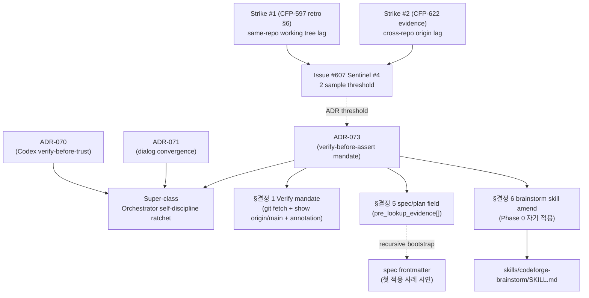

# ADR-073: Orchestrator verify-before-assert — cross-repo ground truth + assumption verify mandate

## 상태

Accepted (2026-05-14). carrier_story = CFP-622.

## 컨텍스트

Issue #607 Sentinel #4 strike #2 충족 — Orchestrator 가 cross-repo state 또는 assumption 단정 시 stale source 인용 anti-pattern 2회 누적.

**Strike #1 (CFP-597 retro §6 sentinel #4 origin)**:
- playbook §3.6 false alarm + CLAUDE.md 320 cap 위협 (working tree mutation lag)

**Strike #2 (본 carrier 2026-05-14 KST evidence — Issue #607 strike #2 comment 4446416751)**:
- CFP-613 abandoned: turn 6 verify `grep -c §3.6\|§5.7 c:/workspace/mclayer/plugin-codeforge-{design,pmo}/agents/...` → 0 hits (false-negative)
- 실제 origin/main = CFP-597 PR #41 (f608838 design) + #17 (f77766d pmo) sibling backfill 완료 상태
- Root cause: `git fetch origin` 누락 → local working tree stale 상태로 단정
- Cascade: spec/plan/4 worktree 가짜 작업 ~30분 + 사용자 cognitive load 3회 confirm + 4 worktree setup→prune

**Issue #607 §우선순위 verbatim**:
> sentinel (1회 sample) — next 3 Stories 영역 추적. **2번째 sample 발견 시 ADR 발의 임계 도달**.

→ ADR carrier 분리 의무 충족. 본 ADR = Sentinel #4 strike #2 carrier.

선행 SSOT 정합:
- [ADR-070](ADR-070-codex-verify-before-trust.md) — Codex external worker output verify-before-trust. 본 ADR-073 = **Orchestrator self-producer** 자매 layer (external worker ↔ self-assertion).
- [ADR-071](ADR-071-orchestrator-user-dialog-convergence.md) — Orchestrator-user dialog convergence (4 vulnerability + 4 layer). 본 ADR-073 = **사실 영역** 자매 (dialog 영역 ↔ fact 영역).
- [ADR-039](ADR-039-orchestrator-subagent-default-for-codeforge-modification-work.md) — Inline whitelist 4-entry. verify 액션은 inline 허용 (Read-only Q&A 답변 영역) — 본 ADR §결정 1 Inline scope 명확화.
- [ADR-064](ADR-064-decision-principle-mandate.md) — decision principle mandate. self-application top-down ratchet 정합 (강화 방향 only).
- [ADR-058](ADR-058-adr-sunset-criteria-mandate.md) — sunset_justification mandate. `is_transitional: false` 정합.
- [ADR-012](ADR-012-wrapper-claudemd-ssot-boundary.md) — CLAUDE.md SSOT boundary. cross-ref 추가 시 압축 plan 동반 (Amendment 1 cap 320).

## 결정

본 ADR 은 verify-before-assert mandate normative declaration. mechanical enforcement (pre-tool-use hook / evidence-checks-registry warning-tier) 은 별 follow-up CFP carrier 분리 — evidence-enforceable 점진 적용 절차 (ADR-060) 정합.

### 본질 선언

> **Orchestrator 가 cross-repo state 또는 assumption 을 단정할 때, ground truth 를 verify-before-assert 의무.**

→ ADR-070 (Codex external worker output verify) 의 **Orchestrator self-producer** 자매 layer. ADR-071 (사용자 dialog convergence) 의 **사실 영역** 자매. 3 ADR 모두 super-class "Orchestrator self-discipline ratchet" children.

### 결정 1 — Verify-before-assert mandate

Orchestrator (또는 subagent) 가 sibling plugin / cross-repo file path / state 에 대해 단정 발화 시 (예: "X file 안 §N section 부재", "Y issue closed 상태", "Z PR merged"), 다음 의무:

1. `cd <repo> && git fetch origin` 선행 (working tree stale 우려)
2. `git show origin/main:<path>` 또는 `gh issue/pr view --json state` direct verify
3. 인용 옆 `verified-via: <method>` annotation
4. spec/plan frontmatter 안 `pre_lookup_evidence[]` PL 수동 declaration (mechanical layer 부재 시)

**적용 영역**: cross-repo state + assumption 기술. Inline whitelist (ADR-039 §결정 2) 영역 안 단순 file stat (line count / section exist) 는 inline 허용 — **단정 발화 시만** verify 의무.

**예외 (verify 면제 영역)**:
- 본 wrapper repo working tree 안 file 직접 read (current branch state) — 이미 latest, fetch 불필요
- session 안 동일 file 의 반복 read (5분 cache window — 사용자 explicit mutation 신호 부재 시)
- `gh issue / pr view` API 결과 — eventual consistency 영역 (별 §결정 7 분리)

### 결정 2 — Mechanism enumeration (super-class anchor + extensible)

super-class = "stale source 인용 anti-pattern". 현재 mechanism 2 종, future append 가능:

| ID | Mechanism | Strike origin | 차단 mechanism |
|---|---|---|---|
| M1 | same-repo working tree mutation lag | CFP-597 retro §6 strike #1 (CLAUDE.md 320 cap stale read) | `wc -l <file>` 사전 측정 + 압축 plan 동반 (ADR-012 Amendment 1 정합) |
| M2 | cross-repo origin lag | 본 carrier strike #2 (git fetch 누락 → sibling backfill 인지 실패) | `git fetch origin` 선행 + `git show origin/main:<path>` direct verify |

future strike #3+ 발견 시 row append. Amendment 강화 방향만 (ADR-058 §결정 5 정합).

### 결정 3 — 3-layer coherence

verify-before-trust 원칙 3 layer:

| Layer | ADR | Producer | 적용 영역 |
|---|---|---|---|
| External worker output | ADR-070 | Codex (외부) | review-verdict-v4 finding evidence + verbatim attach |
| Orchestrator self-assertion | **ADR-073** (본 ADR) | Orchestrator (자기) | cross-repo state + file path 단정 |
| User dialog convergence | ADR-071 | Orchestrator (사용자 대화) | 4 vulnerability 차단 + 4 layer 검증 |

3 layer cross-ref 의무. layer 침범 금지 (각 layer scope 분리).

### 결정 4 — Subagent context packet staleness annotation

Orchestrator 가 subagent spawn 시 prompt 안 file path / cross-repo state 인용 영역에 metadata 첨부 의무:

```yaml
context_packet:
  cited_files:
    - path: "..."
      verified_at: "<ISO-8601>"
      git_fetch_sha: "<sha>"
```

subagent 가 Orchestrator 의 "지금" 가정 회피 — subagent context packet 자체가 staleness 영역.

### 결정 5 — spec/plan template `pre_lookup_evidence[]` field 신설

spec 작성 시 frontmatter field 신설 (codeforge-internal-docs `wrapper/specs/<date>-<slug>.md` SSOT 영역):

```yaml
pre_lookup_evidence:
  verified_files:
    - { path, repo, verified-via, sha (or commit) }
  cross_section_conflict_check:
    - { issue, scope, merge_order, conflict }
  last_git_fetch_timestamp: "<ISO-8601 KST>"  # ADR-073 §결정 1 의무
```

본 carrier spec frontmatter 자체가 첫 적용 사례 (recursive bootstrap mitigation — PL 수동 declare). spec/plan template canonical file 신설 = 별 follow-up CFP 분리 (현재 codeforge-internal-docs templates/ 안 spec.md / plan.md template 자체 부재).

### 결정 6 — Skill body amend (codeforge-brainstorm)

`skills/codeforge-brainstorm/SKILL.md` 본문 안 다음 추가:

> **자기 적용 의무 (ADR-073 §결정 1)**: Phase 0 4 agent prompt 안 file path / cross-repo state 인용 시 `git fetch origin` 선행 + `git show origin/main:<path>` direct verify + `verified-via` annotation 의무. agent prompt template 의 default behavior — Orchestrator 가 prompt 작성 시 사전 명시.

`superpowers:writing-plans` skill body amend = cross-plugin (claude-plugins-official) — 별 follow-up CFP carrier 분리 (CFP-622 scope 외, ADR-064 §결정 10 normative override 가 wrapper 측 mitigation 으로 covered).

### 결정 7 — GitHub API staleness 분리 (scope 외)

`gh issue / pr list / view` 결과도 GitHub API eventual consistency 영역 — local git state staleness 와 별 영역. **본 ADR scope = local git state 한정**. GitHub API staleness = 별 CFP carrier (cross-repo state SSOT 영역, non-blocking deferred).

### 결정 8 — hook automation 분리 (scope 외)

`pre-tool-use` hook 으로 file Read 직전 git fetch trigger = mechanical enforcement layer — 별 follow-up CFP carrier (evidence-checks-registry warning-tier entry 도입 동반). 본 ADR scope = behavioral directive layer only.

future mechanical enforcement carrier:
- evidence-checks-registry entry `verify-before-assert-spec-plan-frontmatter` (warning tier) — spec/plan frontmatter 안 `pre_lookup_evidence[]` field 존재 lint
- pre-tool-use hook `auto-git-fetch-before-cross-repo-read` — file Read tool call 직전 cross-repo path 감지 시 git fetch origin trigger
- 두 carrier 모두 본 ADR effective 후 follow-up CFP open (현재 deferred)

## Self-application 의무 (carrier Story 시연)

본 ADR 작성 / spec / plan / Change Plan / Story file 모두 verify-before-assert 적용 의무:

- **본 carrier spec frontmatter** (`wrapper/specs/2026-05-14-cfp-622-orchestrator-verify-before-assert.md`): `pre_lookup_evidence:` field 안 `verified_files[]` (path / repo / verified-via / sha) + `cross_section_conflict_check[]` + `last_git_fetch_timestamp` 모두 declare 완료
- **본 ADR 작성 시점** (2026-05-14 KST): ADR-RESERVATION row 72 verify (`git show origin/main:docs/adr/ADR-RESERVATION.md` → next available = 73), ADR-070 / ADR-071 cross-ref verify (`git ls-tree origin/main:docs/adr/`), CLAUDE.md line count verify (`wc -l CLAUDE.md`)

→ first applied case 자기 시연. ratchet 강화 방향 정합 (ADR-064 §결정 7 / ADR-058 §결정 5).

## 결과

### 긍정 효과

- Orchestrator stale source 인용 anti-pattern 차단 (M1 same-repo + M2 cross-repo 양 영역 covered)
- 가짜 작업 cascade 차단 (CFP-613 abandoned 같은 ~30분 가짜 작업 회피)
- 사용자 cognitive load 감소 (3회 confirm "진행해" → spec/plan cancel cascade 회피)
- spec/plan frontmatter `pre_lookup_evidence[]` 가 PR-time review 시 verifier 가 own verify 가능 — accountability 확보
- ADR-070 + ADR-073 + ADR-071 3-layer coherence 명문화 (super-class anchor)

### 부정 효과 / Trade-off

- `git fetch origin` overhead — 매 cross-repo Read 직전 발생 시 token / time cost 증가. 5분 cache window 완화 + Inline whitelist 영역 면제 명시.
- spec/plan frontmatter `pre_lookup_evidence[]` PL 수동 declare 부담 — mechanical layer 부재 시 PL judgment. follow-up CFP (evidence-checks-registry entry + pre-tool-use hook) 가 mitigation.
- ADR-064 §결정 9 Question quality 3-check 와 layer 침범 우려 — §결정 3 3-layer coherence 가 layer scope 분리 명시 (dialog convergence ≠ fact assertion).

### 영향 영역

- `CLAUDE.md` (결정 원칙 section 또는 ADR list 영역 cross-ref 1-2줄 추가, 압축 plan 동반)
- `skills/codeforge-brainstorm/SKILL.md` (Phase 0 자기 적용 의무 추가)
- `wrapper/specs/<date>-<slug>.md` SSOT (PL 수동 `pre_lookup_evidence[]` declare 의무)
- `wrapper/plans/<date>-<slug>.md` SSOT (동일)
- 6 lane plugin agent prompt 작성 (Orchestrator dispatch 시 cross-repo cite annotation 의무)

### Marketplace / version bump 영향

본 ADR 도입 = CLAUDE.md 의미 변경 + skill body amend → ADR-037 룰에 의한 codeforge wrapper **MINOR 버전 bump** 발화. ADR-063 3-file atomic invariant 적용 의무: `.claude-plugin/plugin.json` + `CHANGELOG.md` + `mclayer/marketplace/.claude-plugin/marketplace.json` 동시 sync. doc-only fast-path (ADR-054) 정합 — 단일 PR + marketplace sibling sync PR (ADR-063 §결정 5).

## 해소 기준

N/A — permanent policy

본 ADR 은 governance carrier 영구 정책. self-defeat 회피 (recursive sunset 무한 후행 차단). 패턴 정합 사례 = ADR-070 / ADR-071 / ADR-064 / ADR-058 (governance carrier ADR 자기 분류 = `is_transitional: false`).

본 ADR 의 효력 종료 조건은 본 ADR 의 supersede 또는 codeforge 의 verify-before-assert governance 자체 폐지뿐.

## 다이어그램



## 관련 파일

- [ADR-070](ADR-070-codex-verify-before-trust.md) — Codex external worker output verify (자매 layer)
- [ADR-071](ADR-071-orchestrator-user-dialog-convergence.md) — Orchestrator-user dialog convergence (자매 governance)
- [ADR-039](ADR-039-orchestrator-subagent-default-for-codeforge-modification-work.md) — Inline whitelist boundary
- [ADR-058](ADR-058-adr-sunset-criteria-mandate.md) — sunset criteria (`is_transitional: false`)
- [ADR-064](ADR-064-decision-principle-mandate.md) — decision principle (top-down ratchet)
- [ADR-012](ADR-012-wrapper-claudemd-ssot-boundary.md) — CLAUDE.md cap (cross-ref 추가 시 압축 plan)
- `CLAUDE.md` — 결정 원칙 section + ADR list 영역 cross-ref
- `skills/codeforge-brainstorm/SKILL.md` — Phase 0 자기 적용 의무
- Issue [#607](https://github.com/mclayer/plugin-codeforge/issues/607) — Sentinel #4 carrier (본 ADR trigger 출처)
- Issue [#622](https://github.com/mclayer/plugin-codeforge/issues/622) — 본 carrier Story
