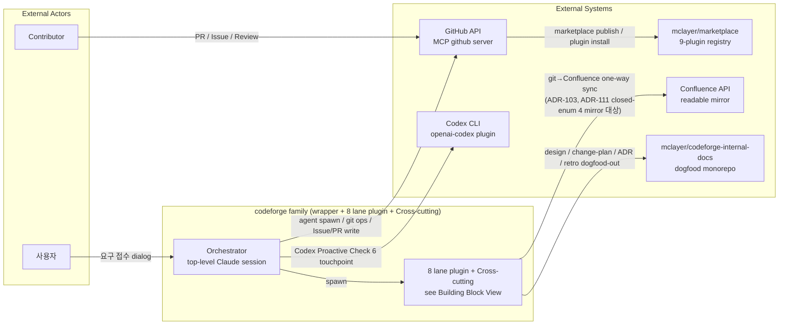
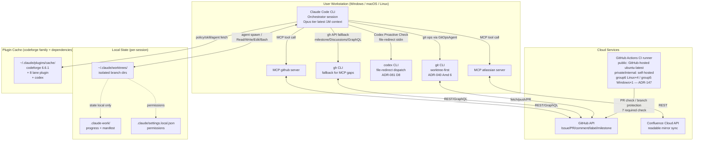

> **목표 invariant (ADR-078 §결정 1 verbatim)**: 코드 직접 read 없이 architecture_doc 1개 read 로 전체 구조 (모듈 + 경계 + 인터페이스 + 데이터 흐름) 파악.

<!-- 본 file = wrapper repo 1회 seed (CFP-920 / Epic B Story-2) + CFP-1427 5-anchor expand (Sub-C S3.3 / ADR-078 Amd 2).
     누적 현재 상태 SSOT (Story key 독립, 영속). 델타는 Change Plan SSOT (disjoint, ADR-078 §결정 3).
     8 lane plugin self-owned architecture_doc 는 모노레포 `plugins/<plugin>/docs/architecture/<plugin>.md` SSOT (ADR-118 D3)
     (CFP-949 Sub-Epic 6 lane plugin self-owned seed merged + CFP-1059 declarative 2 신규 plugin = follow-up sub-CFP 독립 carrier).
     본 doc = family overview (cross-link source) + 8 lane plugin enumeration + 5-anchor 시스템 현황 layer. -->

## 모듈

codeforge = Claude Code 범용 SW 개발 오케스트레이션 플러그인 family. **wrapper (codeforge) = 0 core agent** (wrapper-only, ADR-009 ζ arc) — Orchestrator (top-level Claude 세션) 가 8 lane plugin 의 agent 를 spawn.

`[verified: CLAUDE.md @ HEAD fb06a04 "Development Agent Team" table — agent counts cross-checked]` — 8 lane plugin (6 → 8 확장, CFP-1059 / ADR-087+088) + Cross-cutting + agent composition:

| 모듈 (plugin) | 책임 | agent 구성 | status |
|---|---|---|---|
| **codeforge** (wrapper) | family identity + cross-cutting policy SSOT + skill pointer. agent 0개 (Orchestrator 가 lane plugin agent spawn) | 0 (wrapper-only) | Active |
| **codeforge-requirements** | 요구사항 레인 — 사용자 요구 접수 → 통합 요구사항 명세 | 7 (PL + DomainAgent + RequirementsAnalyst + Researcher + ChangeImpactAgent + FeasibilityAgent + ContinuityAgent) | Active |
| **codeforge-design** | 설계 레인 — Change Plan + ADR 확정 | PL + ArchitectAgent chief + 6 permanent SubAgent + 3+1 CONDITIONAL + 4-tuple sub-tuple (CFP-1126 / ADR-042 Amd 10 — 6+3+1, AggregateArch deprecated + ModuleArch boundary axis unified) | Active |
| **codeforge-review** | 요구사항리뷰 / 설계리뷰 / 구현리뷰 / 보안테스트 레인 — 산출물 검수 (1 plugin 다 lane, CFP-2326 / ADR-125 요구사항리뷰 host 추가) | 6 (4 PL + 2 worker) | Active |
| **codeforge-develop** | 구현 레인 — TDD 구현 + QA | 5 (PL + QADev + 3 role:dev core) + preset/overlay 동적 | Active |
| **codeforge-test** | 통합테스트 레인 — Epic-level 통합 검증 | 1 (IntegrationTestAgent) | Active |
| **codeforge-deploy** (CFP-1059 / ADR-087) | 배포 레인 — Epic 묶음 종료 후 변경 repo blue-green + atomic swap + 3-시간 보존 + 자동 rollback | 2 (DeployPLAgent + DeployWorkerAgent, Sonnet) | Phase 1 declarative — plugin seed 신설 = S2 sub-Story carrier |
| **codeforge-deploy-review** (CFP-1059 / ADR-088) | 배포 검토 레인 — production smoke / 성능 비교 / cutover 사후 검증 + ProductionEvidenceDeputy 이관 owner | 3 (DeployReviewPLAgent Opus + DeployReviewWorkerAgent Sonnet + ProductionEvidenceDeputy 이관) | Phase 1 declarative — plugin seed 신설 = S3 sub-Story carrier |
| **codeforge-pmo** | Cross-cutting — Epic 창설 / Story 회고 / Git ops | 2 (PMOAgent + GitOpsAgent) | Active |

> 각 lane plugin agent 역할·동작 = 해당 plugin CLAUDE.md SSOT (lane plugin self-owned architecture_doc 안 `## 모듈` H2 = lane internal 상세). 본 표 = family composition map (plugin 단위, 라인 수준 0건).

> **model tier 정책 (ADR-141, CFP-2560 — 2026-07-03)**: codeforge family 의 **전 에이전트 + Orchestrator 세션 = 단일 tier `opus`(최신 Opus tier, 1M 컨텍스트 native, plain `model: opus` frontmatter)**. Opus/Sonnet/Haiku 3-tier 선택 기준(ADR-042 §결정 1)과 fable surgical tier(ADR-117)는 폐지됐다. 아래 다이어그램·표의 개별 노드 tier 표기(Sonnet/Opus/fable/fallback)는 **역사 서술(dated snapshot)** 이며 현행 tier SSOT 아님 — 현행 = 전 에이전트 opus 단일 tier. consumer overlay 는 opus 미만 down-tier 불허(보수 방향만, ADR-127 §결정 6). tier SSOT = ADR-141.

## 경계

**Lane self-write boundary** (각 모듈이 직접 갱신하는 Story file 섹션 — `codeforge:lane-self-write-boundary` SSOT 요약):

| 모듈 | self-write 영역 |
|---|---|
| codeforge-requirements | Story §2 · §5 · §6 |
| codeforge-design | Story §3 · §7 · §11 + `docs/change-plans/**` + `docs/adr/**` + `docs/architecture/<plugin>.md` 갱신 (ADR-078 §결정 4 + Amd 2 per-Epic 현행화 mandate) |
| codeforge-develop | Story §8 · §8.5 + Phase 2 PR |
| codeforge-deploy (CFP-1059) | Story §12 배포 manifest (Phase 2 PR 후 trigger, Phase 1 declarative — S2 sub-Story body wire) |
| codeforge-deploy-review (CFP-1059) | Story §13 배포 검증 evidence + ProductionEvidenceDeputy ownership (Phase 1 declarative — S3 sub-Story body wire) |
| codeforge-pmo | Story §11(retro 영역) + `docs/retros/**` + `docs/architecture/<plugin>.md` 갱신 (PMO lane 자체 변경 시) |
| Orchestrator | Story §9 (final verdict) · §10 (FIX Ledger, fix-event-v1 monopoly) · §14 (Lane Evidence) · phase 전환 label |

**owner agent direct write** (CFP-26 Phase 0a): `docs/{change-plans,adr,domain-knowledge,retros,architecture}/**` = owner agent 직접 write (Orchestrator monopoly 영역과 disjoint).

**scope partition**: dogfood artifacts (specs/plans/retros/stories/change-plans) = `mclayer/codeforge-internal-docs` monorepo SSOT (ADR-013). wrapper repo = policy/template/script SSOT. consumer overlay (`.claude/_overlay/`) = 정책 확장만 가능 (축소 불가).

**Consumer merge-gate boundary** (ADR-132 / CFP-2469): consumer repo 의 게이트 강제력 = **2-layer** — (a) advisory hook 層 (UserPromptSubmit warning-inject-only, block 아님) ↔ (b) mechanical branch protection 層 (GitHub native `required_status_checks` merge 실차단). dead-gate(게이트 workflow 가 PR 마다 돌지만 `required_status_checks.contexts[]` 미등록 = merge 차단력 0) 해소 = mechanical 層 자동 충전 (`scripts/wire-branch-protection.*` operator gh auth GET-merge-PUT). 권한 경계: 자동 배선 = operator org-admin gh auth (codeforge PAT 미사용 — ADR-066 §결정 2 6-scope 무손상). 형상: `enforce_admins:true`(admin 우회 무력화 차단) + `review_count` solo=0/team≥1(deadlock 회피). 등록 context set = consumer 실제 배포 workflow job 표시명 ∩ codeforge 게이트(정적 manifest 복사 금지 — wrapper-self context 영구 pending 차단).

## 인터페이스 계약

모듈 간 계약 surface = `docs/inter-plugin-contracts/` (wrapper 단일 원본 — ADR-118 D5, sibling sync 폐지). `[verified: MANIFEST.yaml @ HEAD fb06a04]`:

**kind:contract (9)** — lane 간 산출물 핸드오프 surface (CFP-1059 / ADR-087+088 신설 2종 placeholder):

| contract | producer plugin | 용도 | status |
|---|---|---|---|
| review_verdict | codeforge-review | 리뷰 verdict packet (pl_recommendation) | Active |
| requirements_output | codeforge-requirements | 요구사항 synthesis | Active |
| design_output | codeforge-design | 설계 산출물 | Active |
| develop_output | codeforge-develop | 구현 산출물 | Active |
| test_verdict | codeforge-test | 통합테스트 verdict | Active |
| pmo_output | codeforge-pmo | Epic/retro 산출물 | Active |
| git_ops_event | codeforge-pmo | GitOpsAgent 이벤트 | Active |
| **deploy_output** | codeforge-deploy | 배포 산출물 (Phase 2 PR merge 후 trigger 데이터) | Phase 1 placeholder — body wire = S2 sub-Story carrier |
| **deploy_review_output** | codeforge-deploy-review | 배포 검증 산출물 (smoke / 성능 비교 / cutover 사후 검증) | Phase 1 placeholder — body wire = S3 sub-Story carrier |

**kind:registry (sibling sync 면제 — ADR-010 §결정 2)**: label-registry-v2 / debate-protocol-v1 / evidence-check-registry-v1 / severity-propagation-v1 / parallel-dispatch-protocol-v1 / imperative-walker-protocol-v1 + chain-managed (comment-prefix-registry-v1 / fix-event-v1).

> 계약 schema field-level 상세 = 각 contract file SSOT + `MANIFEST.yaml`. 본 섹션 = surface enumeration (계약 이름 + SSOT pointer, 라인 수준 0건). version 값은 MANIFEST.yaml SSOT 가 권위 (본 doc 누적 현재 상태 — version drift 회피 위해 본 섹션 version literal 미박제).

## 데이터 흐름

**Story lane spawn flow** (Orchestrator 가 lane 진입 시 해당 lane plugin PL 1개 spawn — non-skippable. 10 lane (요구사항리뷰 CFP-2326 / ADR-125 + 배포 2 lane CFP-1059 / ADR-087+088)):

```
사용자 요구 접수
  → 요구사항 lane (codeforge-requirements:RequirementsPLAgent) → Story §1-§6 synthesis
  → 요구사항리뷰 lane (codeforge-review:RequirementsReviewPLAgent) → review_verdict [CFP-2326 / ADR-125, Phase 1 내부 sub-gate — 외부사실 의존성 게이트]
  → 설계 lane (codeforge-design:ArchitectPLAgent) → Change Plan + ADR + Story §3/§7/§11 + architecture_doc 갱신
  → 설계리뷰 lane (codeforge-review:DesignReviewPLAgent) → review_verdict
  → 구현 lane (codeforge-develop:DeveloperPLAgent) → Phase 2 PR
  → 구현리뷰 lane (codeforge-review:CodeReviewPLAgent) → review_verdict
  → CI gate (phase-gate-mergeable) → merge
  → [Epic 종료 시] 통합테스트 lane (codeforge-test:IntegrationTestAgent) → test_verdict
  → 보안테스트 lane (codeforge-review:SecurityTestPLAgent) → review_verdict
  → [Epic 묶음 종료 시] 배포 lane (codeforge-deploy:DeployPLAgent) → deploy_output [Phase 1 declarative]
  → 배포 검토 lane (codeforge-deploy-review:DeployReviewPLAgent) → deploy_review_output [Phase 1 declarative]
```

**Cross-cutting 흐름** (Story lane 게이트 비개입, 독립 spawn):
- PMOAgent — Epic 창설 / Story 완료 retro (Phase 2 PR merge 후 5분 grace 자동 trigger, ADR-045)
- GitOpsAgent — parallel epic conflict 검사 + scope_manifest intersection
- (DialogFidelityAgent — Orchestrator ↔ 사용자 dialog 3-anchor read-only verify = CFP-2236 sunset, ADR-071 Amendment 9. 검증 ground = Codex TP#2/TP#3 + ADR-064 Q-3check 보존.)

**artifact propagation**:
- Story file (`internal-docs/<plugin>/stories/<KEY>.md`) = lane 간 컨텍스트 SSOT (각 lane self-fetch)
- Change Plan (`docs/change-plans/<slug>.md`) = Story 단위 변경 델타 (1회, Story key 종속)
- architecture_doc (`docs/architecture/`) = 누적 현재 상태 (영속, Story key 독립) — Change Plan 과 disjoint 상보 (ADR-078 §결정 3). per-Epic 현행화 mandate (ADR-078 Amd 2 §결정 2)
- ADR (`docs/adr/`) = 단일 결정 단위 (불변). **번호 발급 flow**: wrapper(dogfood) 는 claim 채널(claim primitive OCC, `adr-reservation-state` state-branch — ADR-133)로 발급-시점 번호를 atomic 직렬화한 뒤 `ADR-RESERVATION.md` row append(audit 채널) — CFP-2563 실배선(built-but-unwired 해소); consumer 는 `Glob(docs/adr/) max+1` default(A1-1 비대칭)
- EPIC-RESULTS (`internal-docs/<plugin>/retros/`) = Epic close 1회 evidence aggregate

**요건 traceability zero-drop 게이트 (ADR-145 / CFP-2603, Epic CFP-2602 G1)**: `AC-N ↔ §8 명명 테스트 ↔ 실 테스트파일` zero-drop 을 강제하는 신규 fail-closed CI 게이트. 모듈 = Ports&Adapters — pure core (`scripts/lib/ac_id.py` leaf AC_ID_RE grammar + `scripts/lib/check_ac_traceability_matrix.py` 매핑 로직, network-0 offline-testable) + adapter I/O (`scripts/check-ac-traceability-matrix.sh` wrapper + `.github/workflows/ac-traceability-matrix.yml` workflow, fetch/cross-repo 전담). phase-aware 2-tier: Phase 1 = AC↔§8 명명 매핑 / Phase 2 = §8↔실 symbol born-missing(ast resolve, grep 금지). phase-gate-mergeable 흡수 기각 근거 = anchor 계층 warning-tier + fast-pass bypass 비호환(ADR-145 §결정 3, CONFLICT-C). **branch-protection 등록 = 사용자 결정 (A) 즉시 required 등록**(2026-07-11): G1 게이트 도입 Phase 2 PR 머지 시점에 `required_status_checks.contexts[]` 에 신규 context `ac-traceability-matrix` 즉시 추가(6→7-tuple). born-broken/false-red 위험은 게이트 self-test(execution-liveness L3 mutation-kill + F-fixture RED→GREEN)가 merge-precondition 이라 구조적 차단(born-broken 린터는 required 등재 불가 — ADR-145 §결정 3). shadow-required(B)는 미채택 대안(ADR-145 §대안, ADR-060 승격 evidence-gate 선례). Phase 2 PR 에서 본 doc C4(6→7) + CLAUDE.md 브랜치 보호 표(6→7-tuple) 동반 갱신.

**동적 테스트 최대화 게이트 (burden-flip) (ADR-146 / CFP-2605, Epic CFP-2602 G4)**: feasible 한 동적 검증(fuzz/property/load/concurrency)이 침묵 누락되면 §8.8 로스터 게이트가 구조적으로 차단하는 adequacy 강화(opt-in → do-it-unless-proven-infeasible burden-flip). 게이트 = `check_section_8_8` = 기존 `check_doc_section_schema.py` 확장(신규 module/workflow 0), 기존 strict required context `doc section schema (CFP-28 — strict)` 편승 → **신규 required context 0**(baseline branch-protection tuple 무관 — G1 6→7-tuple 등록 선착 시에도 G4 추가 0, EXTEND-path. G1 의 6→7 등록과 대조). fail-closed 범위 = 4기법 §8.8 applicability(DO|N/A) presence + 산출물 계약 필드 구조까지만(검출력 = G3 미강제 / soak·restart·replay = G2 disjoint — 정직 천장, ADR-119 정합). Phase 1 = 설계(본 doc data_flow + Open Decisions), 실 lint 함수 + self-test + template §8.8 + agent-md mandate = 동일 Story Phase 2.

**CI runner topology / self-hosted 이관 (ADR-147 / CFP-2607)**: mclayer org CI 실행 위치를 GitHub-hosted(`ubuntu-latest`)에서 org 소유 self-hosted runner 로 이관하는 boundary 변경. 배선 = repository variable `CI_RUNS_ON_LINUX_JSON`(JSON array) → `runs-on: ${{ fromJSON(vars.CI_RUNS_ON_LINUX_JSON || '["ubuntu-latest"]') }}` 단일 SSOT 표현식. public(plugin-codeforge/marketplace)은 var 미설정 → hosted coalesce(기능 불변), private/internal 18 repo 는 var SET → self-hosted(group6 Linux / group5 Windows). runner group `allows_public_repositories=false` fail-safe + byte-parity lockstep(`invariant-check.yml` templates↔.github blocking, `phase-gate-mergeable.yml` 포함) + provisioning invariant/unset fail-loud lint(billing-deadlock 차단). 6-tuple 필수 컨텍스트 문자열은 job id/name 이 `runs-on` 과 orthogonal 이라 **불변**. 제외 = public 2 + mctrader/deploy-k8s 3 ARC job. Phase 1 = 설계(본 Story), 실 배선 = Phase 2 child Story(카나리→웨이브, W0 부트스트랩).

**지속-liveness soak 게이트 (ADR-148 / CFP-2613, Epic CFP-2602 G2)**: 배포된 데몬이 CrashLoopBackOff·terminal-sink 동결로 "요건 미충족·미사용 결과물"이 되는 Gap B(런타임-현실 갭)를 게이트 도메인 불변식(INV-D1~D6)으로 재정의. **2-표면 module 경계 신설** — 표면 A(선언 fail-closed CI-lint: `check-operational-outcome-signal.sh` warning→blocking, wrapper runtime-0 dogfood, 전 Story normative) ⊥ 표면 B(런타임 soak: `IntegrationTestAgent` Deployability soak step, consumer normative / wrapper fixture-daemon self-test, declarative 면제). data_flow axis 1-node: 데몬 Story 선언(§7.4.7 sink_probes[]/daemon_type) → 표면 A blocking lint → 표면 B IntegrationTest boot-soak(생존 exit0∧restart0 ∧ terminal-sink monotone 전진, HTTP-200 아님) → `soak_liveness_results`(test-verdict-v2 v2.3 additive MINOR). interfaces axis = sink_probes[]/daemon_type schema 신설 + verdict-kernel 순수함수 seam(`evaluate_soak_sample`+reason-code enum 단일소스화, orchestration vehicle-local). soak/restart/replay = G2 단일소유(ADR-146 §결정3 g2_boundary_check). **신규 required context 0**(표면 A required 편입 = **LIVE 6→7-tuple 사용자 결정 유보**, shadow-first 권장 — [verified: gh api live=6-tuple 2026-07-12 / CLAUDE.md doc=7-tuple doc-ahead drift]. G1 `ac-traceability-matrix` = 문서상 즉시등록이나 live 미등록=dead-gate[CFP-2609 라우팅, sibling-disjoint] → shadow-first 지지, G4 편승 0 과도 대조). Open Decisions: required 편입 사용자 결정 / verdict-kernel 물리형태(templates/ 소script vs schema spec-embed) Phase 2 / 실배선 Phase 2 / G1 doc⊥live drift CFP-2609. Phase 1 = 설계(본 doc data_flow + ADR-148 + change-plan + Story §7), 실 lint 승격 + soak step + schema 신설 + fixture-daemon self-test = 동일 Story Phase 2.

**런타임 DAST 보안 동적 축 (ADR-150 / CFP-2612, Epic CFP-2602 G5)**: 보안테스트 lane 이 전면 정적(코드 층 SAST 9축)이라 실행 중에만 발동하는 취약점(런타임 injection·인증 우회·민감데이터 노출·설정 취약)이 조용히 미검증으로 남는 보안-adequacy 갭을 게이트 도메인 불변식(INV-G5-1~4)으로 재정의. G4 burden-flip 표준(ADR-146 §8 preamble)의 **보안 축 instantiation** — **§8.9 독립 로스터**(single `dast` axis, §8.8 4기법 편입 아님 — oracle 로 축 분리: G4-fuzz oracle=기능 crash/robustness ⊥ G5-DAST oracle=보안 취약 재현/attack). data_flow axis 1-node: 실행-보안 Story 선언(§8.9.0 dast applicability + 12 산출물 계약 필드 + `g_boundary_check`) → 표면① §8.9 presence doc-lint(`check_section_8_9` = `check_section_8_8` 동형 확장, 전 Story normative, `security_ai` 무관) → 표면② DAST 실 구동(consumer `test.yml`/`dast.yml` QADev — 앱 CI 기동→ZAP baseline/full/api-scan→SARIF `code-scanning/alerts?tool_name=zap` fetch, ADR-033 재사용) → 표면③ DAST 결과 AI-synthesis(보안 lane SecurityTestPL, `security_ai: true` opt-in, packet pointer 입력 — ADR-001 cross-ref, contract 무변경). **opt-in 비대칭 3-lane decouple**: presence mandate ⊥ opt-in(security_ai off 해도 §8.9 presence 게이트 유지). interfaces axis = §8.9 12 필드 + 2 cross-field normative 선언-정합(payload_class active/destructive⟹environment_ref non-prod ephemeral / authenticated∧unauth⟹infeasibility_reason) — enum-constrain(payload_class{passive,active,destructive}/auth_mode{unauthenticated,session,token}). 9축 category_enum **무변경**(DAST = 런타임 거울면, injection/auth/config/pii=YES·trust-boundary/credential/crypto=PARTIAL·dependency-cve/race=NO; security.md=pointer only, drift 회피). soak/restart/replay=G2·기능 fuzz=G4 단일소유 — `g_boundary_check`(dual G2∧G4 경계). **신규 required context 0**(기존 strict context `doc section schema (CFP-28 — strict)` 편승 — branch-protection **7-tuple**[verified: origin/main CLAUDE.md, CFP-2603/ADR-145 ac-traceability-matrix 6→7] **무변경**, G4 EXTEND-path 동형). 정직 천장(INV-G5-4): 게이트는 재현 시도·기록 presence/구조 + 2 cross-field 선언-정합까지만 — "취약점 실제 검출"은 강제 안 함(검출력=review/advisory/G3, detection-forcing=검사연극 ADR-119). §8.8 zero-touch 유일 예외 = `check_section_8_8` L355 region-slice `^###`→`^#{1,4}`(§8.9 sibling bleed 차단, 현행 동작 무변경). Phase 1 = 설계(본 doc data_flow + ADR-150 + change-plan + Story §7·§3), template §8.9 + `check_section_8_9` + `test-check-doc-section-8-9.sh` self-test + agent-md mandate = 동일 Story Phase 2.

**wrapper-self self-test execution-liveness 인벤토리/메타-게이트 (ADR-151 / CFP-2622, Epic CFP-2602 G6)**: wrapper-self `tests/scripts/*.sh` self-test corpus(35 = 22 wired + 1 inline-covered + 12 DEAD)에서 L3 discriminating fixture 는 작성됐으나 어느 workflow 에도 배선 안 돼 실행 안 되는(선언→실행 미승격) 표면 + 신규 self-test 침묵 un-run root 를, 게이트 실행-무결성(execution-liveness/adequacy) 갭으로 재정의. ADR-136 결정14 execution-liveness 3요건(L1/L2/L3)의 self-test corpus-wide 자기적용. data_flow axis 1-node: self-test 선언(`tests/scripts/*.sh` + `docs/selftest-execution-liveness-inventory.yaml` 8-field 레코드) → 정적 메타-게이트 `check_selftest_execution_liveness.py` presence/alive/형식 fail-closed(AC-1a 레코드 존재 / AC-2 channel 실재 or `manual_reason`≥30 / AC-3 `workflow:job` alive∧not `permanently_skipped` / AC-5 parity `both_copies` / AC-8 runtime N/A 3축 AND + `g_boundary_check` / AC-9 재귀 자기적용) → 신규 non-required wrapper-self-only workflow `selftest-execution-liveness-test.yml` 실행(actionlint-workflows-test.yml exemplar 답습). modules axis = 인벤토리 registry(SSOT, `evidence-checks-registry.yaml` 선례 위치) + 메타-게이트 pure-lint 층(정적 배선 presence 검사 — **신규 동적 러너 부활 아님, ADR-048 무충돌**). 12 DEAD 4-bucket 분류: A 진성 hollow-gate(doc-section 8-7/8-8/8-9 = required 게이트 `check-doc-section-schema.sh` mutation-kill fixture, 채널 죽음 — **우선 backfill**) / B agent-runtime(fix-replay·merge-gate·mutation disposition, `agent_runtime`+reason, "dead gate" hard-claim 금지) / C dead-path 존치(stakes-tier-gating, ADR-141 all-opus dormant) / D orphan·dedup(5, AC-10). soak(G2)/real-render(§8.7)/DAST(G5) runtime = wrapper-self 자연 N/A **3축 AND**(`g_boundary_check` 형제 축 참조). **신규 required context 0**(신규 non-required wrapper-self-only workflow — branch-protection 무변경, G6 추가 0). 정직 천장: presence/alive/형식까지만 — 검출력=G3 / 완결성=review / L1 blocking 승격=ADR-060 evidence-gate 미강제, "wrapper 동적검증 완전 봉인" hard-claim 금지(ADR-119). A2-5 판정 = ADR-136 원리 재정의 0 + corpus-wide 메타-게이트 신규 mechanism → **신규 ADR**(ADR-136 무수정 cross-ref, 형제 arc G1/G2/G4/G5 정합). Phase 1 = 설계(본 doc data_flow + ADR-151 + change-plan + Story §3·§7), 인벤토리 YAML(35 레코드) + 메타-게이트/self-test/workflow 실배선 + bucket A backfill = 동일 Story Phase 2.

**dark/born-missing forcing function 게이트 (ADR-152 / CFP-2624, Epic CFP-2602 G3)**: 기능이 default-off flag(예 mctrader `COMPACT_TIERED=0`) 뒤에 숨어 landing≠done 인 부실 산출물이 조용히 통과하는 병(dark-path adequacy 갭 + 요구-슬라이스 silent drop)을 게이트 도메인 불변식(INV-G3-1~4)으로 재정의. **(a) §8.10 독립 dark-path activation manifest 로스터**(`check_section_8_10` = `check_section_8_9` verbatim 동형, single `dark_path` axis) — 6 산출물 필드 + `g_boundary_check` region-token + 2 cross-field normative 선언-정합(activation-honesty: status=activated⟹activation_test_ref∧on_state_assertion≥15자 / infeasible⟹infeasibility_reason≥30자, declared-consistency ≠ detection). **(b) G3(b) Epic-close 요구-슬라이스 매핑**: EPIC-RESULTS `§requirement-slice-mapping` presence lint(`check_epic_results_slice_mapping`, 파일명 `EPIC-RESULTS-*.md` gate) + deferral 착지 = `§deferred` `source: req-slice-defer`(deferred-item-lifecycle 재사용, 단일-carrier, scanner 무변경). discriminating-A(meta/게이트 self-test mutation-kill, G6 소유) ⊥ discriminating-B(product/flag 활성화, G3 신설) 어휘 분리가 설계 핵심. sibling disjoint: G3(a) §8.10 ⊥ G4 §8.8(fuzz robustness) ⊥ G5 §8.9(DAST attack) ⊥ G2 §8.5(soak) ⊥ G6 self-test 인벤토리; G3(b) Epic-slice ⊥ G1 AC-level ⊥ §D-11 ⊥ ADR-137. 정직 천장(INV-G3-4): presence/구조 + 2 cross-field 선언-정합까지만 fail-closed — "flag 진짜 켜졌음"(discriminating-B 실검출)·열거 완결성·사유 타당성은 review/advisory(ADR-119 검사연극 금지). §8.8/§8.9 zero-touch(G5 L355 예외 불요 — §8.9 region-slice 종료 `^#{1,4}\s+\S`가 이미 4-hash `#### §8.10` 형제 종료). 신규 required context 0(기존 strict context 편승, branch-protection 무변경). Phase 1 = 설계(ADR-152 + change-plan + Story §3·§7 + 본 doc data_flow), Phase 2 = template §8.10 + `check_section_8_10`/`check_epic_results_slice_mapping` + `test-check-doc-section-8-10.sh` self-test + G6 인벤토리 등재 + epic-results §requirement-slice-mapping + PMOAgent/TestContractArch mandate.

**게이트 자기검증 forcing-function 메타-게이트 (ADR-154 / CFP-2684)**: hard gate/required job 가 green 이어도 검증 대상을 실제 실행/검출하는지 보장 안 되면 위양성이라는 super-class("hard-gate self-verification: green ≠ detection guarantee")를 명명하고, silent-green(검출력0)≠silent-fallback(경로 흡수)≠honest-degrade(의도적 fail-open+ceiling 선언, 정상) 3-way taxonomy 를 codify 하며, 신규 hard gate 가 self-verification 번들을 갖췄는지 presence/shape 로 fail-closed 검사하는 governance CI 층(신규 non-required wrapper-self-only 메타-게이트)을 추가. S3(CFP-2159 silent-green)/S5(CFP-2174 silent-fallback)/S6(CFP-2178 거짓 green) 위양성 계보(threshold N=2 초과) carrier. data_flow axis 1-node: 신규 hard gate 선언 → 신규 presence/shape 메타-게이트가 self-verification 번들(positive-control self-test 2-exit-differ shape[AC-1/2] + empty-target non-GREEN[AC-3] + unknown-input non-zero[AC-4] + execution-trace emit[AC-5] + internal-control identity-probe[AC-13] + honest-ceiling 선언[AC-8] + 3-way taxonomy[AC-6] + super-class cross-ref no-dup[AC-12] + 재귀 자기적용[AC-7])을 fail-closed 검사 → warning-tier(day-1) + ADR-151 인벤토리 1행 enroll(bijection cross-seal — 누락 시 selftest-execution-liveness 메타-게이트가 자기 FAIL = two-meta-gate mutual cross-seal). 2-control 계약: positive-control(sanity mutant, silent-green 방어) ⊕ internal-control(identity probe, 선언 대상=실행 대상 known-answer, silent-fallback 방어). archetype C(혼합): mechanical hard-floor(presence/shape normative) + review-tier(검출 sufficiency AC-9, undecidable) + advisory(전수 mutation-score AC-11). 정직 천장(INV-5 immutable, P0 불가침): 검출 sufficiency(L3 equivalent-mutant=halting-동치, oracle problem)는 원리상 기계강제 불가 → "universal detection 완전 봉인" hard-claim 금지(CFP-2680 over-claim 재범 = 설계리뷰 P0). 광역 silent-fallback scan 채택 안 함(honest-degrade FP 지뢰밭 26 script/127 occ) — taxonomy codify + per-new-gate fail-closed fixture 로 대응. A2-5 both-prong 기각(§결정1): ADR-082 Amendment 기각(declaration-only ↔ fail-closed 메타-게이트 신규 mechanism) + ADR-151 Amendment 기각(subject disjoint, axis-ii shape-scan = enum→shape 1단계 증분 cross-ref) → 신규 ADR-154. 신규 required context 0(branch-protection 7-tuple 무변경) / inter-plugin 계약 무변경 / 신규 category 0. Phase 1 = 설계(본 doc data_flow + ADR-154 + change-plan §8 RTM + Story §3·§7), Phase 2 = `scripts/lib/check_*.py` + `.sh` wrapper + byte-identical `templates/`↔`.github/` workflow mirror + `tests/scripts/test_*.sh` 재귀 self-test(M1-M6 positive-leak) + evidence-checks-registry warning-tier row + 인벤토리 enroll.

**dev-process observability substrate (ADR-155 / CFP-2687, Epic #2686 Story A 선행)**: codeforge 자기-개선 관측의 기반 증거층 — codeforge 자신의 10-lane **개발 과정**(lane전이·프롬프트·tool-call·verdict·diff·findings·FIX전이·최종산출물)을 typed append-only 증거 스트림으로 capture 하는 **9번째 Tier-3 persistent channel** `dev-process-event-v1`(new-sibling — stop/spawn/fix-event 무변경, ADR-042 Amd2 8→9 boundary). **interfaces axis 1-node**: 신규 kind:registry 통합 계약(Phase 2 실 파일, ADR-155 = 설계 SSOT) + §15.2 5th boundary invariant(semantic-evidence-aggregation — 상관ID cross-read JOIN 허용 / accounting payload re-record 금지 = SoT 이중화 차단). **data_flow axis 1-node**: capture 이원화(Port A hook-adapter: 프롬프트 PreToolUse·tool-call PreToolUse+PostToolUse net-new·diff PostToolUse net-new / Port B agent-emit: lane전이·verdict·findings·FIX전이·최종산출물, Orchestrator-owned delegate) → `emit_source` enum{hook,agent} discriminator(single-stream JOIN 보존, 2-channel 물리분리 기각) → 2계층(index allow-list-clean: enum/numeric/hash/상관ID/blob-ref only ⊥ evidence-blob-store: capture-time redaction 후 content-addressed redacted blob, INV-8a hash-over-redacted + INV-8b blob-before-index) → 4-ID freeze(story/lane/defect/fix, B·C 공유 — 결점 taxonomy family[CLOSED 7]·lane[CLOSED] / type[SEMI-OPEN] / ttd[DERIVED measure]) → retention 3-tier(hot JSONL index+loose blob → warm 압축 pack+gz → cold 아카이브, strict, AC-10∧AC-25 append-only∧GC 모순 화해 = tombstone[cold blob 삭제 시 index blob_ref 불변] + content-preserving hash-verified transform[decompress byte-identical, hash(decompressed)==blob_ref 재검증, index row 무rewrite]) → mining port `query_dev_process_event.py`(raw typed rows+blob deref, 집계/verdict 아님 — B/C disjoint consumer). **always-on 비대칭(α)**: wrapper-self dogfood = always-on(checkout-identity 파생, redaction-선행 무우회 INV-8) / consumer = opt-in default-false 무약화(ADR-064 §결정7 extend-only, ADR-043 Amd4). **scope-guard ⊥ ADR-104**: wrapper-N/A = 운영 phase 측정 한정, dev-process = disjoint axis(false-block 차단). tz freeze = UTC Z 저장/KST 표시(ADR-079). 정직 천장(ADR-119): taxonomy over-claim 금지 / resource-safety 무증거 ReDoS-safe 금지(born-safe bound만) / AC-23 계약↔구현 드리프트 자동해소 주장 금지. **신규 required context 0**(Phase 1 doc-only — 7-tuple 무변경). B(지표 #2688)·C(self-gate verdict #2689) = OOS. Phase 1 = 설계(본 doc interfaces+data_flow + ADR-155 + ADR-042 Amd2 + ADR-043 Amd4 + change-plan + Story §3·§7), Phase 2 = 실 계약 파일 + PostToolUse hook + append primitive(O_APPEND) + evidence-blob-store + redaction fn + mining script + lint/self-test(계약==구현 parity fail-closed) + playbook §15.1 8→9 co-land.

**dev-process metric aggregation + §D-9 dev-domain escalation feed circuit (ADR-156 / CFP-2688, Epic #2686 Story B)**: A(ADR-155)가 freeze 한 `dev-process-event-v1` substrate 위 **downstream 집계 = dev-process 지표**(B = 집계 ONLY; A substrate 재구축·capture 활성화 ⊥ C #2689 gate/verdict 판정 모두 OOS). **interfaces axis 1-node**: de-facto KPI snapshot/history schema-pin(§D-9 feed 필드 pattern_count/pattern_status/anchor_id/root_cause_class 포함) — **신규 formal inter-plugin 계약(dev-process-metric-v1) 미신설**(kpi = local file 표면, transport 아님 → MANIFEST registries 갱신 불요, doc-section §4-change-rules obligation 미발동). **data_flow axis 1-node**: `dev-process ledger → query_dev_process_event.query_with_stats()[B 유일 read 진입점, Path B 원장 직접 파싱 reject] → aggregate_dev_process_event.py[단일 신규 스크립트 + 6 pure compute_*(rows,stats)→dict fan-out] → KPI dual-file[docs/kpi/dev-process-<metric>-{history.jsonl content-hash-guarded append(generated_at 제외), snapshot.json overwrite-idempotent}, atomic write temp→os.replace] → §D-9 pattern_count PRODUCER(+ frozen N=2 eligibility 신호) → PMOAgent §D-9 escalation ACTION DECIDER`. **6 지표**: ① cycletime lane-residency(종료 앵커 우선순위 next-different-lane > final_artifact > verdict; 6-point subtype 부재 → "lane residency" NOT time-to-PASS; negative/reverse-duration EXCLUDE+count) / ② fixloop attempt·iteration 분리(distinct fix_id per-attempt ≠ §10 재진입 iteration) / ③ defect-attribution + should-have-caught(detecting_lane×family×type + review-responsibility heuristic; origin/expected-lane substrate 부재 → advisory·unattributed→uncomputable; 리뷰 lane vs 기계 게이트 capture-subject 축) / ④ selfref-recurrence(동일 defect_id 재출현 + 4-tuple{family,type,ttd,detecting_lane}; self-ref candidate heuristic ⊥ 일반 recurrence 기계) / ⑤ trend(forecast 금지 bucketed time-series) + §D-9(anchor_id/root_cause_class substrate 부재 → **AC-19 uncomputable_missing_key = PRIMARY 경로**, edge 아님) / ⑥ token-cost(spawn-event-v1 8th channel weighted 4-class via replay_spawn_event + spawn_event_pricing.cost_usd, event_id JOIN correlation-only; 3-gap[per-call/cache 5m·1h split/actuals null] + cache 1h-2× helper 미유도 → honest-null + upstream_gap_flags). **producer↔decider 분리**: B = pattern_count producer + eligibility 신호까지(escalation ACTION 미실행 = SoT 이중화 차단, INV-B3). **3-domain disjoint feed EXTEND**: retro(ADR-045 §D-9) / operational(ADR-106) / dev-process(ADR-156) — 같은 PMOAgent escalation 메커니즘(N=2 / escalation_action enum) 공유하되 입력 도메인 3-way disjoint. **ADR-045/ADR-106 본문 무변경**(§경계 disjoint 표에 dev-process row 추가만, ADR-106 NEW ADR precedent 동형). **★closure machinery 미복제**(ADR-106 divergence): dedup/max-depth/escalate_user = self-executing loop 발산 억제 기제 → PASSIVE read-time feeder 인 B 에 불필요(pmo-output-v1 `cross_story_pattern_adr_trigger` additive 재사용, 계약 amendment 불요). **honest-degrade 천장(ADR-119)**: measured-0 ≠ dormant(stats 로 구분) / exact-count·guaranteed-unique 주장 금지(query_with_stats 관측치 상속) / 인과 주장 금지 — self-referential dogfood 7연속 이력 대응. **신규 secret 표면 = NO**(include_blob=False / index-tier-derived only emit / cross-channel JOIN correlation-only). scope-guard ⊥ ADR-104(dev-process ⊥ operational-phase, false-block 방지). tz = 자체 UTC-Z parser(archetype naive-KST `_parse_iso_aware` clone 금지 — 9h silent skew 방지, ADR-061). **신규 required context 0**(Phase 1 doc/ADR only, 7-tuple 무변경). **C(self-gate verdict #2689) = OOS**. Phase 1 = 설계(본 doc interfaces+data_flow + ADR-156 + change-plan + Story §3·§7), Phase 2 = aggregate_dev_process_event.py + 6 compute fn + KPI dual write + honest-degrade/parity lint(execution-backed self-test + negative-control) + self-test wrapper + inventory enroll +1.

**author-time self-gate forcing function (ADR-158 / CFP-2689, Epic #2686 Story C)**: A(ADR-155)·B(ADR-156) 구축 중 **구조/위치 conformance 결점이 설계·구현 리뷰를 통과하고 기계 merge-gate 에서만 late 포착**(3회 firsthand)한 실병목을 저작시점 예방으로 제도화 — 이미 required 인 기계 게이트(ac-traceability/doc-section, 7-tuple 소속)를 **리뷰 lane 진입 前(저작 완료 직후)** 그 Story 자기 산출물에 **shift-left** 선실행. **data_flow axis 1-node**: `producing lane(요구/설계/구현) 저작완료 → authoring_self_gate.py[신규 runner]가 대상 게이트 실 로직을 정확 Phase 모드로 현 Story 실 아티팩트에 invoke(narrow re-impl 금지 — A/B miss 실원인=Phase-2 모드 미실행) → self-gate PASS/FAIL(내 아티팩트가 게이트 통과?) → 검출 conformance/self-ref 결점 emit_dev_process_event.emit(defect_finding, ...) → A ledger → B compute_selfref_recurrence 4-tuple + _capture_subject 소비`. **대상 게이트 집합(closed) + runnable/defer 정직 분류**: ac-traceability-matrix(Phase-aware) / doc-section-schema(strict) / doc-frontmatter-schema(strict, category closed_enum) / RTM format header signature + 동일 Story 신규 lint = runnable-now / cross-repo·runtime·CI-env 종속 = deferred-to-CI(silent-covered 주장 금지, capability boundary 정직). **enforcement = advisory lane-exit self-check day-1**(최소 불변식=실-게이트 실행 강제, 리뷰 판정이 실행 대체 금지; fail-open 정직=prompt 미준수 무차단·merge-gate 7-tuple backstop; mechanical hook=future pattern_count≥2). **detecting_lane honest-degrade(F1 정합)**: 저작 lane_label(유효 enum) + time_to_detection 근사, 비-멤버 `authoring-self-gate` emit 금지(append `_norm_enum(...,None)` → null coerce 신호소실 회피; `없음`=lane_label 전용 fallback·detecting_lane nullable → null; first-class 표현=A label-registry-v2/capture-mechanism amendment upstream flag, C scope 밖·A/B 계약 0 수정). **honest-ceiling(ADR-119)**: 저작시점 검출 축=구조/위치 conformance / 미검출 축=semantic claim-accuracy(substrate 사실·AC 의미·test-semantic 완결성)=review-tier 잔여 정직 declare; self-gate PASS=실 게이트 outcome ground-truth(proxy 아님, 2 판정면) / "결점 주입 완전 방지·exact detection·정밀 detecting_lane·guaranteed-unique defect_id" over-claim 금지. **dogfood 자기적용**: C self-gate를 C 자기 산출물(§5.3 AC표 header signature / Change Plan §8 RTM / doc-section 위치 / ADR frontmatter category)에 리뷰 前 선실행(self-ref born-red 예방, 8-11연속 이력 대응) + self-test 2축(독립 fixture oracle=CFP-2673 X⊆X tautology 금지 + 대칭 fail-closed=CFP-2680 present-null 비대칭 금지, mutation-revert negative-control). **경계 disjoint**: C(저작시점 self-적용) ⊥ #2684(ADR-154 게이트 자기검증/silent-green meta-gate) ⊥ #2322(gate provenance) ⊥ B(#2688 집계, C=producer/B=aggregator) ⊥ A(#2687 substrate 수정 금지). **5th boundary 무저촉**: self-gate PASS/FAIL ≠ review-verdict-v4 payload 재기록(defect_finding=semantic-evidence만 emit, SoT 이중화 차단). **신규 required context 0**(shift-left=기존 게이트 실행 시점 이동, branch-protection 7-tuple 무변경; 신규 lint=non-required day-1 hard-fail CI + selftest-execution-liveness inventory enroll +1). landing ≠ activation(ledger dormant → "self-gate 실행" ≠ "결점 ledger emit 성공" 구분, always-on α 의존). Phase 1 = 설계 SSOT(본 doc data_flow + ADR-158 + change-plan §1-13[§8.1.1 RTM 18 AC zero-drop gate-parseable] + Story §3/§7/§8/§11), Phase 2 = authoring_self_gate.py runner + advisory wiring + (조건부)신규 lint(실 게이트 round-trip·mock-seam 금지·negative-control) + self-test(독립 oracle + 대칭 fail-closed) + inventory enroll +1.

> 본 흐름 = lane spawn / event / artifact propagation 수준. 함수 호출 trace / 변수 전달 라인 0건 (anti-scope guard 준수).

---

## 시스템 현황 (ADR-078 Amendment 2 — 5-anchor section schema)

> ADR-078 Amendment 2 §결정 3 의 5-anchor "시스템 현황" section codify (closed-enum, open_extension: false). 본 family-level overview 의 ArchitectAnalystAgent as-is 설계 확인 시 자연 lookup target. lane-internal 상세 = 각 plugin self-owned architecture_doc 의 동일 5-anchor section 참조.
>
> 4 영역 closed-enum (모듈 / 경계 / 인터페이스 계약 / 데이터 흐름) 위 reading orientation layer 추가 (additive extension, 4 영역 약화 0건). 4 영역 → 5-anchor mapping = ADR-078 Amd 2 §결정 3 표 SSOT.

### arc42 §3 — Context & Scope

codeforge family 의 외부 경계 + 외부 시스템 / actor / interface enumeration. **무엇과 상호작용하는가**.



**Trust boundary**: 외부 입력 = (사용자 dialog / GitHub API webhook / Codex worker output / Marketplace registry data / Confluence API / **self-hosted runner host — private/internal repo CI 코드 실행 표면**). 모든 외부 입력은 verify-before-trust 4-layer 안전망 통과 (ADR-073 Orchestrator verify-before-assert / ADR-070 Codex verify-before-trust / ADR-082 write-time self-write verification / ADR-045 §D-9 PMOAgent retro forcing function). self-hosted runner host(ADR-147)는 fork PR 임의 코드 실행 표면이나 `allow_forking=false` ∧ `allows_public_repositories=false` ∧ fork PR self-hosted 미실행(ADR-147 §결정 8)으로 CLOSED — DooD(host root 등가) / persistent runner cross-job 오염은 non-privileged container·ephemeral/JIT·secret CLI-arg 금지로 완화.

**in-scope vs out-of-scope**:
- in-scope = SW 개발 라이프사이클 자동화 (요구사항 → 요구사항 리뷰 → 설계 → 설계 리뷰 → 구현 → 구현 리뷰 → 통합 테스트 → 보안 테스트 → 배포 → 배포 검토 10 lane — CFP-2326 / ADR-125 요구사항 리뷰 신설)
- out-of-scope = production runtime monitoring / live incident response / customer-facing UI / billing — codeforge 는 dev lifecycle plugin (operational lifecycle 영역 = consumer 책임)

### arc42 §5 — Building Block View

family 의 plugin / module decomposition. **무엇으로 구성되어 있는가**.

```mermaid
graph TB
    subgraph "wrapper (codeforge)"
        WrapperPolicy[CLAUDE.md<br/>+ playbook<br/>+ skill 정책]
        WrapperContracts[inter-plugin-contracts<br/>MANIFEST.yaml<br/>sibling sync mirror]
        WrapperRegistries[kind:registry 8종<br/>label / debate / evidence /<br/>severity / parallel-dispatch /<br/>walker / comment-prefix / fix-event]
        WrapperADR[docs/adr/<br/>ADR-001~ADR-111+]
        WrapperArch[docs/architecture/<br/>codeforge-family.md<br/>본 doc]
    end

    subgraph "Production lanes (6 active)"
        Req[codeforge-requirements<br/>7 agent]
        Design[codeforge-design<br/>PL + chief + 6+3+1 SubAgent + 3 sub-tuple]
        Review[codeforge-review<br/>4 PL + 2 worker]
        Develop[codeforge-develop<br/>5 + dynamic role:dev]
        Test[codeforge-test<br/>1 IntegrationTestAgent]
        PMO[codeforge-pmo<br/>2 PMO + GitOps]
    end

    subgraph "Deploy lanes (2 declarative — CFP-1059 Phase 1)"
        Deploy[codeforge-deploy<br/>2 Sonnet — Phase 2 seed S2]
        DeployReview[codeforge-deploy-review<br/>3 Opus+Sonnet — Phase 2 seed S3]
    end

    WrapperPolicy -.->|policy SSOT| Req
    WrapperPolicy -.->|policy SSOT| Design
    WrapperPolicy -.->|policy SSOT| Review
    WrapperPolicy -.->|policy SSOT| Develop
    WrapperPolicy -.->|policy SSOT| Test
    WrapperPolicy -.->|policy SSOT| PMO
    WrapperPolicy -.->|policy SSOT| Deploy
    WrapperPolicy -.->|policy SSOT| DeployReview
    WrapperContracts -.->|MANIFEST mirror| Design
    WrapperContracts -.->|MANIFEST mirror| Review
    WrapperContracts -.->|MANIFEST mirror| Develop
    WrapperContracts -.->|MANIFEST mirror| Test
    WrapperContracts -.->|MANIFEST mirror| PMO
    WrapperArch -.->|family overview cross-link| Req
    WrapperArch -.->|family overview cross-link| Design
    WrapperArch -.->|family overview cross-link| Review
    WrapperArch -.->|family overview cross-link| Develop
    WrapperArch -.->|family overview cross-link| Test
    WrapperArch -.->|family overview cross-link| PMO
```



**plugin family lifecycle phase**:
- **Active (6 production lanes)** = codeforge-{requirements,design,review,develop,test,pmo} 모두 모노레포 `plugins/<plugin>/` 동봉 (ADR-118 D3, 구 lane repo = 2026-06-12 GitHub archive — ADR-118 D1) + agent file + self-owned arch doc + marketplace 등록
- **Declarative Phase 1 (2 deploy lanes)** = codeforge-{deploy,deploy-review} = CFP-1059 / ADR-087+088 declarative seed 후 모노레포 `plugins/codeforge-{deploy,deploy-review}/` 동봉 (구 lane repo = 2026-06-12 GitHub archive)

### C4 Container

runtime topology — 각 plugin / external system 의 container-level deployment unit + 통신 protocol. **어떻게 동작하는가**.



**통신 protocol enumeration**:
- **Claude ↔ MCP server** = JSON-RPC over stdio (Claude Code harness)
- **Claude ↔ GitHub API** = REST + GraphQL via MCP github tool (PAT auth)
- **Claude ↔ Confluence API** = REST via MCP atlassian tool (consumer overlay project.yaml atlassian.* 주입, ADR-103)
- **Claude ↔ Codex CLI** = `codex exec --sandbox read-only < <promptfile>` file-redirect (ADR-081 Amd 6 D8 — direct stdin-pipe 차단 TTY 부재 0-byte stall 회피)
- **Claude ↔ git** = local git CLI (worktree-first invariant ADR-040 Amd 6 — `git -C <worktree_abs_path>` 강제)
- **Local state** = filesystem-only (no central state server, codeforge = stateless per-session orchestration)
- **Plugin distribution** = `~/.claude/plugins/cache/` (consumer install via `mclayer/marketplace` registry, 9 plugin atomic version 고정 per CFP-744)

### C4 Component

container 내부 component 의 logical unit + 책임 + 인접 component 관계. **각 lane plugin 내부 구조 (family-level overview)**.

```mermaid
graph TB
    subgraph "codeforge-requirements (Req lane)"
        ReqPL[RequirementsPLAgent<br/>PL synthesizer §2/§5/§6]
        ReqPL --> Domain[DomainAgent<br/>known knowns §2]
        ReqPL --> Analyst[RequirementsAnalystAgent<br/>ambiguity §5]
        ReqPL --> Researcher[ResearcherAgent<br/>concept §6 Opus]
        ReqPL --> ChangeImpact[ChangeImpactAgent §4.1]
        ReqPL --> Feasibility[FeasibilityAgent §4.2]
        ReqPL --> Continuity[ContinuityAgent §4.3]
    end

    subgraph "codeforge-design (Design lane)"
        DesignPL[ArchitectPLAgent<br/>supervisor + FIX 판정자]
        DesignPL --> Chief[ArchitectAgent chief<br/>multi-source synthesis]
        Chief --> Permanent[6 permanent SubAgent:<br/>Security/Module/APIContract/<br/>InfraOp/TestContract/Data]
        Chief --> Conditional[3+1 CONDITIONAL:<br/>LiveOps/LiveOrder/<br/>ProductionEvidence/<br/>Aggregate-applicability]
        Chief --> SubTuple[3 sub-tuple:<br/>CodebaseMapper/Refactor/<br/>ArchitectAnalyst]
    end

    subgraph "codeforge-review (Review lane × 4 — CFP-2326 / ADR-125)"
        ReviewBase[review-pl-base.md<br/>공통 SSOT]
        ReviewBase -.->|inherit| ReqReviewPL[RequirementsReviewPLAgent<br/>10번째 lane, 외부사실 의존성 게이트]
        ReviewBase -.->|inherit| DesignReviewPL[DesignReviewPLAgent]
        ReviewBase -.->|inherit| CodeReviewPL[CodeReviewPLAgent]
        ReviewBase -.->|inherit| SecurityTestPL[SecurityTestPLAgent]
        ReqReviewPL --> ClaudeWorker[ClaudeReviewAgent<br/>worker peer]
        ReqReviewPL --> CodexWorker[CodexReviewAgent<br/>worker peer]
        DesignReviewPL --> ClaudeWorker
        DesignReviewPL --> CodexWorker
        CodeReviewPL --> ClaudeWorker
        CodeReviewPL --> CodexWorker
        SecurityTestPL --> ClaudeWorker
        SecurityTestPL --> CodexWorker
    end

    subgraph "codeforge-develop (Develop lane)"
        DevPL[DeveloperPLAgent<br/>role:dev orchestrator]
        DevPL --> QADev[QADeveloperAgent<br/>test code + CI workflow]
        DevPL --> DevCore[DeveloperAgent<br/>+ DataEngineer + InfraEngineer<br/>+ preset/overlay role:dev]
    end

    subgraph "codeforge-test (Test lane)"
        IntegTest[IntegrationTestAgent<br/>Epic-level single-shot<br/>Sonnet → Opus fallback]
    end

    subgraph "codeforge-deploy (Deploy lane — Phase 1 declarative)"
        DeployPL[DeployPLAgent<br/>Sonnet — S2 seed]
        DeployPL --> DeployWorker[DeployWorkerAgent<br/>Sonnet — S2 seed]
    end

    subgraph "codeforge-deploy-review (Deploy Review lane — Phase 1 declarative)"
        DeployReviewPL[DeployReviewPLAgent<br/>Opus — S3 seed]
        DeployReviewPL --> DeployReviewWorker[DeployReviewWorkerAgent<br/>Sonnet — S3 seed]
        DeployReviewPL --> ProdEvidenceDeputy[ProductionEvidenceDeputy<br/>이관 from codeforge-design]
    end

    subgraph "codeforge-pmo (Cross-cutting)"
        PMO[PMOAgent<br/>Epic / retro / cross-Story]
        GitOps[GitOpsAgent<br/>long-running teammate]
    end

    subgraph "codeforge (wrapper infrastructure)"
        ReconcileOverlay["reconcile-overlay.sh<br/>ongoing-sync: overlay + workflow dual-channel<br/>(CFP-2440 Phase 2)"]
    end
```



**Component 책임 / 인접 관계 핵심 invariant**:
- **PL synthesis monopoly** = 각 lane PL 만 lane-owned Story section write (sub-agent / worker 는 PL 에 input 만 return, sub ↔ sub 직접 통신 0)
- **flat spawn invariant** = Orchestrator 가 모든 sub-agent / worker flat spawn (재귀 spawn 금지 ADR-039, nested team 금지 ADR-044). 4-tuple sub-tuple = 논리적 그룹핑일 뿐 spawn 계층 아님
- **Orchestrator inline-write mechanical block** (PreToolUse Write|Edit|MultiEdit, warning-tier, agent_id caller判정, CFP-2544) = Orchestrator 직접 repo 편집을 PreToolUse hook 이 물리 차단 후보로 검출해 subagent 위임을 강제 (ADR-039 §결정 9 slot 실현 Wave1 + ADR-115 §결정 6 이관). agent_id present-as-non-empty=subagent=ALLOW / absent·null·empty=Orchestrator=block-candidate. Wave1 = exit 0 + stderr (NEVER deny)
- **worker peer 필수** = review lane 의 Claude + Codex 양 worker 모두 spawn 의무 (단독 fallback 0, ADR-001)
- **CONDITIONAL deputy** = Live touching / production cutover Story 만 active (Backtest/Paper-only Story = 미spawn)
- **Cross-cutting boundary** = PMO / GitOps 는 Story lane gate 비개입 (sibling 책임 영역 disjoint)
- **Phase 1 declarative (deploy lanes)** = agent file / contract body / workflow 실 신설 = S2/S3 sub-Story carrier (본 declarative phase = 정책 anchor only)

### Open Decisions Pending

ADR 미합의 / Wave 미작성 / placeholder 집중 영역. **design lane 진입 시 모호성 즉시 visible**.

| 영역 | 상태 | carrier |
|---|---|---|
| **Mega-Epic CFP-1415 (Confluence-as-derived-mirror governance standardization) 진행 중** | 4 Sub-Epic split (Sub-A/B/C/D) — 본 Sub-C S3.3 = wrapper family.md 5-anchor expand carrier | Issue #1415 (Epic) + Sub-Epic #1418 (Sub-C) |
| **codeforge-deploy / codeforge-deploy-review 정식 승격 잔여** | CFP-1059 / ADR-087+088 declarative Phase 1 merged — 실 plugin seed 는 모노레포 `plugins/codeforge-{deploy,deploy-review}/` 동봉 (ADR-118 D3) | follow-up sub-CFP 2 (S2 codeforge-deploy seed / S3 codeforge-deploy-review seed) |
| **8 lane plugin self-owned arch doc 5-anchor expand** | 6 active plugin (CFP-949 baseline) = 4 H2 schema 보유 / 5-anchor section 미반영 — 모노레포 `plugins/` in-tree follow-up | follow-up sub-CFP 6 (codeforge-{requirements,design,develop,review,test,pmo} 각자 self-owned arch doc 5-anchor expand) |
| **ArchitectAnalystAgent dual-read path 실 wire** | ADR-078 Amd 2 §결정 1 declared (git primary + Confluence fallback) — 실 wire = codeforge-design plugin ArchitectAnalystAgent.md self-write 확장 | follow-up Sub-C S3.4 (다른 sub-CFP carrier) |
| **mechanical wire — review-verdict-v4 v4.10 `living_architecture_updated: bool`** | ADR-078 Amd 2 §결정 6 declared (Wave 1 declaration-only) — lint workflow + bats fixture + evidence-checks-registry row + hotfix-bypass label family member | follow-up Sub-C S3.5 / CFP-1429 carrier |
| **5 follow-up CFP (HIGH 2 + MEDIUM 2 + LOW-DEFER 1)** | Mega-Epic CFP-1415 진행 중 5 follow-up declared — defer / immediate split | (다른 CFP 발의 후 status 갱신) |
| **#1320 사용자 dependency** | 사용자 발화 영역의 hard dependency — 본 Sub-C 진행 중 absorb 필요 시 status update | Issue #1320 |
| **#1439 MCP labels bug** | MCP labels API 영역 known bug — codeforge family 안 cross-cutting 영향 (label-registry-v2 propagation 차단 가능) | Issue #1439 (독립 fix carrier) |
| **CFP-1126 / ADR-042 Amd 10 — AggregateArch deprecated 실 agent file 정리** | 정책 codify 완료 (CFP-1168 realized) — 실 agent file deprecate = `plugins/codeforge-design/` in-tree Wave 2 추후 CFP carrier (sibling sync 폐지 — ADR-118 D5) | follow-up sub-CFP (codeforge-design plugin agent file deprecation) |
| **observability Tier-3 spawn-event-v1 (per-agent token/cost attribution + replay) — LANDED (Phase 1 doc-only)** | CFP-2393 / Epic CFP-2391 S3. ADR-042(measurement) §결정 3 보류 해제 (Amendment 1) + ADR-043 Amendment 2. 8번째 observability channel. oh-my-claudecode(MIT) 차용. **Phase 2 미실현** = append_spawn_event.py (O_APPEND) + SubagentStop agent_id/agent_type capture wiring + replay script + §14↔spawn-event dedup script (ADR-042 §결정 13 precondition) + lint. token attribution 정확도 = transcript undercount caveat → attribution_confidence=unattributed default | follow-up Phase 2 PR (CFP-2393 S3 구현분) |
| **동적 테스트 최대화 게이트 G4 (ADR-146 / CFP-2605) — Phase 1 설계 landed** | burden-flip 표준(feasible 동적 검증 default 수행) + fuzz/property/load/concurrency §8.8 1급 로스터 설계 완료(Phase 1 = 본 doc data_flow + Open Decisions). **Phase 2 미실현** = template §8.8(change-plan.md + story-page-structure.md 미러) + `check_section_8_8` lint 함수(check_doc_section_schema.py 확장, 신규 workflow 0) + `test-check-doc-section-8-8.sh` self-test(L3 discriminating mutation-kill) + TestContractArch/QADev §8.8 agent-md mandate. Ports&Adapters lint 구조 정합 = Phase 2 ModuleArch 재검토 note(`check_section_8_8` = pure-lint 층, Phase 1 신규 boundary/module 0). 신규 required context 0(baseline tuple 무관 — G1 6→7 선착 시에도 G4 추가 0) | 본 Story Phase 2 PR (CFP-2605 §8-§11) |
| **지속-liveness soak 게이트 G2 (ADR-148 / CFP-2613) — Phase 1 설계 landed** | 2-표면(선언 fail-closed CI-lint ⊥ 런타임 IntegrationTest boot-soak) + verdict-kernel seam(`evaluate_soak_sample` 순수함수 + reason-code enum 단일소스화) + INV-D1~D6 + 정직 천장 설계 완료(Phase 1 = 본 doc + ADR-148 + change-plan + Story §7). **미결(사용자 결정)** = 표면 A required 편입(**LIVE 6→7-tuple** [verified gh api 2026-07-12; 최종 크기 = G1 등록순서 의존], 비가역+consumer mass-break=ask-trigger) — 설계리뷰 escalate, **권장 shadow-first**(blocking 승격하되 required 미편입 → bounded window 실 PR 신호 → 후속 CFP 편입 — G1 documented⊥live drift[dead-gate, CFP-2609 라우팅]가 shadow-first 지지). **미결(Phase 2 구현)** = verdict-kernel 물리형태(templates/ 소script vs schema spec-embed, §3.2) / 표면 A blocking(exit1) 승격 + sink_probes[]·daemon_type schema + test-verdict-v2 v2.3 + fixture-daemon self-test 실배선. soak/restart/replay = G2 단일소유(ADR-146 §결정3 g2_boundary_check). 신규 required context 0(사용자 결정 유보) | 본 Story Phase 2 PR (CFP-2613 §8-§11) + required 편입 = 사용자 결정 후속 CFP |
| **런타임 DAST 보안 동적 축 G5 (ADR-150 / CFP-2612) — Phase 1 설계 landed** | 보안테스트 lane 런타임 DAST §8.9 독립 로스터(single `dast` axis, oracle=attack ⊥ G4-fuzz robustness) + presence/구조 fail-closed 정직 천장(INV-G5-4, 검출 미강제) + 2 cross-field normative 선언-정합(blast-radius / authenticated 정합, declared-consistency ≠ detection) + opt-in 비대칭 3-lane decouple(§8.9 presence ⊥ consumer test.yml 실구동 ⊥ security_ai AI-synthesis) 설계 완료(Phase 1 = 본 doc data_flow + ADR-150 + change-plan + Story §7·§3). **Phase 2 미실현** = template §8.9(change-plan.md + story-page-structure.md 미러) + `check_section_8_9` lint(check_doc_section_schema.py 확장, 신규 workflow 0, **§8.8 L355 region-slice `^###`→`^#{1,4}` 유일 예외**) + `test-check-doc-section-8-9.sh` self-test(천장 실증 = 0검출 valid 레코드 PASS + 6 mutation MUT-A~G + LIVE ceiling_honesty_check) + security.md DAST pointer(category_enum 무변경) + SecurityTestPL/TestContractArch/QADev agent-md mandate. wrapper-self = 자연 N/A(deployable service 0, declarative). 신규 required context 0(7-tuple 무변경 — 기존 strict context 편승, G4 EXTEND-path 동형) / inter-plugin 계약 무변경(DAST 결과=packet pointer, ADR-001 cross-ref) / 신규 보안 category 0 | 본 Story Phase 2 PR (CFP-2612 §8-§11) |
| **wrapper-self self-test execution-liveness 게이트 G6 (ADR-151 / CFP-2622) — Phase 1 설계 landed** | wrapper-self `tests/scripts/*.sh` self-test corpus(35) 실행-liveness 인벤토리(8-field) + 정적 메타-게이트(presence/alive/형식 fail-closed, AC-1a/2/3/5/8/9) + 12 DEAD 4-bucket 분류(A 진성 hollow-gate doc-section 3 우선 / B agent-runtime 3 / C dead-path 존치 1 / D orphan·dedup 5) + 자연 N/A 3축 AND(soak/real-render/DAST) + 정직 천장(검출력=G3 미강제) + AC-9 재귀 자기적용 설계 완료(Phase 1 = 본 doc data_flow + ADR-151 + change-plan + Story §3·§7). **Phase 2 미실현** = `docs/selftest-execution-liveness-inventory.yaml`(35 레코드) + `scripts/lib/check_selftest_execution_liveness.py` + `scripts/check-selftest-execution-liveness.sh` + `tests/scripts/test_check-selftest-execution-liveness.sh`(재귀 L3 mutation-kill) + `.github/workflows/selftest-execution-liveness-test.yml`(wrapper-self-only non-required, bucket A doc-section 3 self-test 배선) + bucket D orphan remove/dedup 최종 판정 + `adr-sunset-criteria-pathagnostic` inline-cover 실측. **A2-5 = ADR-136 원리 재정의 0 + corpus-wide 메타-게이트 신규 mechanism → 신규 ADR**(ADR-136 무수정). 신규 required context 0(신규 non-required wrapper-self-only workflow — branch-protection 무변경) / inter-plugin 계약 무변경 / 신규 category 0 | 본 Story Phase 2 PR (CFP-2622 §8-§11) |
| **dark/born-missing forcing function 게이트 G3 (ADR-152 / CFP-2624) — Phase 1 설계 landed** | 기능이 default-off flag 뒤에 숨어 landing≠done 인 부실 산출물이 조용히 통과하는 병을 게이트 도메인 불변식(INV-G3-1~4)으로 재정의. **(a) §8.10 독립 dark-path activation manifest 로스터**(`check_section_8_10` = `check_section_8_9` 동형, single `dark_path` axis, 6 산출물 필드 + 2 cross-field activation-honesty 선언-정합) + **(b) G3(b) Epic-close 요구-슬라이스 매핑**(EPIC-RESULTS `§requirement-slice-mapping` presence lint `check_epic_results_slice_mapping` + deferral 착지 = `§deferred` `source: req-slice-defer`). discriminating-A(meta/self-test, G6 소유) ⊥ discriminating-B(product/flag 활성화, G3 신설) 어휘 분리 설계 핵심. 정직 천장(INV-G3-4): presence/구조 + 2 cross-field 선언-정합까지만 fail-closed — "flag 진짜 켜졌음" 실검출은 review/advisory(ADR-119). §8.8/§8.9 zero-touch(region-slice 종료 `^#{1,4}` 이미 §8.10 형제 종료, 신규 예외 0). 신규 required context 0(기존 strict `doc section schema (CFP-28 — strict)` 편승, branch-protection 무변경) | 본 Story Phase 2 PR (CFP-2624 §8-§11) — 실배선 완료(check_section_8_10/check_epic_results_slice_mapping + §8.10 template + self-test 42/42 + G6 인벤토리 37 레코드 alive) |

| **게이트 자기검증 forcing-function 메타-게이트 (ADR-154 / CFP-2684) — Phase 1 설계 landed** | hard gate/required job 의 silent-green·silent-fallback 위양성 차단 super-class 명명 + 3-way taxonomy(silent-green≠silent-fallback≠honest-degrade) + 2-control 계약(positive-control ⊕ internal-control identity-probe) + presence/shape fail-closed 신규 메타-게이트(warning-tier) + 재귀 자기적용(inventory bijection cross-seal) + honest-ceiling(검출 sufficiency=undecidable, INV-5 immutable) 설계 완료(Phase 1 = 본 doc data_flow + ADR-154 + change-plan §8 RTM 13 AC + Story §3·§7). archetype C(mechanical presence/shape normative ⊕ review-tier sufficiency AC-9 ⊕ advisory mutation-score AC-11). 광역 silent-fallback scan 미채택(honest-degrade FP 26/127) — taxonomy + per-new-gate fail-closed fixture. **Phase 2 미실현** = `scripts/lib/check_*.py`(presence/shape 메타-게이트) + `scripts/check-*.sh` + byte-identical `templates/github-workflows/*.yml`↔`.github/workflows/*.yml` + `tests/scripts/test_*.sh`(재귀 self-test TC-CLEAN-PASS + M1-M6 positive-leak + LIVE ceiling-honesty) + `docs/evidence-checks-registry.yaml` warning-tier row + `docs/selftest-execution-liveness-inventory.yaml` 1행 enroll. **★game-able residual 정직 공개**: AC-2 shape-scan 은 tautological same-path(inline hand-copy)에 속을 수 있음 — 기계 완전 봉인 불가, AC-8/AC-9 review-tier + CodeReviewPL tautology-smell grep cross-ref. A2-5 = ADR-082/151 both-prong 기각 → 신규 ADR. 신규 required context 0(7-tuple 무변경) | 본 Story Phase 2 PR (CFP-2684 §8-§11) |

| **dev-process observability substrate (ADR-155 / CFP-2687, Epic #2686 Story A 선행) — Phase 1 설계 landed** | codeforge 자기-개선 관측의 기반 증거층 + `dev-process-event-v1` 증거계약(9번째 Tier-3 channel, new-sibling) 설계 완료(Phase 1 = 본 doc interfaces+data_flow + ADR-155 + ADR-042 Amd2 + ADR-043 Amd4 + change-plan + Story §3·§7). 2계층(index allow-list-clean ⊥ evidence-blob-store redacted) + 8 event-type closed enum + 5 noise discard closed-list + 4-ID freeze(story/lane/defect/fix) + 결점 taxonomy 4-tuple(family/lane closed·type semi-open·ttd derived) + capture 이원화(hook3/agent-emit5 + emit_source) + retention 3-tier(AC-10∧AC-25 tombstone+hash-verified-transform 화해) + mining port + always-on 비대칭(α) + INV-8 redaction-선행. **Phase 2 미실현** = 실 `dev-process-event-v1.md` 계약 파일(kind:registry) + MANIFEST comment + playbook §15.1 8→9 row + §15.2 5th invariant co-land(dangling 회피) + PostToolUse hook 신설 + append primitive(O_APPEND) + evidence-blob-store + capture-time redaction fn(deny 6→7, hash-over-redacted) + `query_dev_process_event.py` mining + 계약==구현 parity self-test(impl-present fail-closed non-skippable; impl-absent born-drift 방어 = §8.10 activation-manifest 위임, landing≠activation). **B(지표 #2688)·C(self-gate verdict #2689) = OOS**(본 A = substrate·계약만). 정직 천장(ADR-119): taxonomy over-claim 금지 / resource-safety 무증거 ReDoS-safe 금지 / AC-23 드리프트 자동해소 주장 금지. scope-guard ⊥ ADR-104(dev-process ⊥ operational-phase). 신규 required context 0(Phase 1 doc-only, 7-tuple 무변경) / inter-plugin 계약 = new-sibling(기존 6 event 무변경) / 신규 category 0 | 본 Story Phase 2 PR (CFP-2687 §8-§11) + B(#2688)·C(#2689) 후속 Story |

| **dev-process metric aggregation + §D-9 dev-domain escalation feed (ADR-156 / CFP-2688, Epic #2686 Story B) — Phase 1 설계 landed** | A(ADR-155 dev-process-event-v1) substrate 위 downstream 집계 정책 설계 완료(Phase 1 = 본 doc interfaces+data_flow + ADR-156 + change-plan §1-13[§8.1.1 RTM 23 AC zero-drop] + Story §3·§7). 6 지표 산식·경계(cycletime lane-residency / fixloop attempt·iteration / defect-attribution+should-have-caught / selfref-recurrence 4-tuple / trend+§D-9 / token-cost weighted) + producer↔decider 분리(B=pattern_count producer / PMOAgent=escalation ACTION) + honest-degrade 천장(measured-0≠dormant, exact-count 금지) + 3-domain disjoint feed EXTEND(retro/operational/dev-process, ADR-045·106 본문 무변경, closure machinery 미복제=passive feeder) + de-facto KPI schema-pin(신규 formal 계약 미신설) + AC-19 uncomputable=PRIMARY 경로(anchor_id/root_cause_class substrate 부재). Path A(단일 스크립트+6 pure compute fn, aggregate_stop_event archetype 재사용) 채택 / Path B(원장 직접 파싱) reject. **Phase 2 미실현** = `scripts/lib/aggregate_dev_process_event.py`(단일 스크립트 + 6 compute_*(rows,stats)→dict + 자체 `_parse_utc_z`[archetype naive-KST clone 금지] + KPI dual-file write[atomic]) + `docs/kpi/dev-process-*-{history.jsonl,snapshot.json}` 6 지표 + honest-degrade/parity lint(execution-backed self-test + negative-control) + self-test wrapper + inventory enroll +1. **dormant 실측 부재**(landing≠activation — ledger 파일 부재 → honest-zero snapshot, 실 가치=capture activation 이후). 신규 required context 0(Phase 1 doc/ADR only, 7-tuple 무변경) / inter-plugin 계약 무변경(de-facto KPI schema-pin, MANIFEST 갱신 불요) / 신규 category 0. **C(self-gate verdict #2689) = OOS**(B ⊥ C disjoint) | 본 Story Phase 2 PR (CFP-2688 §8-§11) |
| **author-time self-gate forcing function (ADR-158 / CFP-2689, Epic #2686 Story C) — Phase 1 설계 landed** | 기존 required 기계 게이트(ac-traceability Phase-aware / doc-section / doc-frontmatter / RTM format header signature)를 리뷰 lane 진입 前 저작시점에 그 Story 자기 산출물에 shift-left 선실행(실 게이트 invoke, re-impl 금지) + 검출 결점 dev-process-event defect_finding emit(A 소비·B 집계) 설계 완료(Phase 1 = 본 doc data_flow + ADR-158 + change-plan §1-13[§8.1.1 RTM 18 AC zero-drop gate-parseable] + Story §3·§7·§8·§11). 9결정: 대상 게이트 closed 집합+runnable/defer 분류 / advisory lane-exit self-check day-1(실행 강제·판정 대체 금지·fail-open 정직) / emit port 소비만(A/B 0 수정) / detecting_lane honest-degrade(저작 lane_label+ttd, authoring-self-gate 비-멤버 null coerce 회피, first-class=A-amendment upstream flag) / self-test 2축(독립 oracle CFP-2673 X⊆X 금지 + 대칭 fail-closed CFP-2680 present-null 금지) / honest-ceiling(구조위치=검출 / semantic=review-tier 잔여 정직 declare) / dogfood 자기적용 / 7-tuple 무변경·신규 lint non-required / disjoint 경계(#2684·#2322·B·A)+5th boundary 무저촉. enforcement tier=advisory 채택(mechanical hook=future) / 신규 ADR vs ADR-145/060 amendment=신규 ADR 채택(shift-left+emit=신규 discipline, A/B new-sibling 선례). **Phase 2 미실현** = `scripts/lib/authoring_self_gate.py`(대상 게이트 orchestration invoke + defect_finding emit) + advisory lane-exit self-check wiring + (조건부)신규 lint(실 게이트 round-trip·mock-seam 금지·negative-control) + `tests/unit/test_authoring_self_gate.py`+`tests/scripts/test_authoring-self-gate.sh`(독립 oracle + 대칭 fail-closed + mutation-revert) + inventory enroll +1. **dormant 실측 부재**(landing≠activation — "self-gate 실행"≠"결점 ledger emit 성공" 구분, always-on α 의존). 신규 required context 0(shift-left=실행 시점 이동, 7-tuple 무변경) / inter-plugin 계약 무변경(emit port 소비만) / 신규 category 0(orchestration-discipline 기존 enum). #2684(게이트 자기검증)·#2322(provenance) = disjoint cross-ref | 본 Story Phase 2 PR (CFP-2689 §8-§11) |

> **본 Open Decisions 영역 = 매 ADR-078 Amd 2 §결정 2 per-Epic 현행화 시점에 갱신 의무**. ArchitectAnalystAgent / 신규 contributor / design lane 진입 시 본 표가 "지금 codeforge 의 모호성" 즉시 visible answer 의 single SSOT.

---

### anti-scope guard (ADR-078 §결정 1 verbatim — 작성자 필독)

본 doc 은 **구조 수준 only**. 4종 패턴 금지: (1) 클래스/함수/변수 라인 단위 열거 (2) import graph 라인-level (3) 함수 signature/parameter/return type (4) src/ 1:1 디렉터리 dump. 라인 수준 필요 시 = 코드/Change Plan/ADR 영역.

### ADR-076 declarative reconciliation 3-layer cross-ref

본 doc 의 architecture_doc 운용은 [ADR-076](../../archive/adr/ADR-076-declarative-reconciliation-upgrade.md) declarative reconciliation 3-layer 패턴을 도메인 disjoint 로 답습 (ADR-078 §결정 2):

- **desired state** = 본 doc 의 4 H2 closed-enum (모듈 + 경계 + 인터페이스 계약 + 데이터 흐름) + 5-anchor 시스템 현황 section (ADR-078 Amd 2 §결정 3) 누적 현재 상태 SSOT
- **current state** = wrapper repo (`CLAUDE.md` / `docs/inter-plugin-contracts/MANIFEST.yaml` / `plugins/<lane>/` 의 actual agent file + CLAUDE.md + arch doc) 의 실제 정의 상태
- **converge** = ArchitectAgent self-write 확장 (per-Epic 현행화 mandate, ADR-078 §결정 4 + Amd 2 §결정 2) + design lane verdict gate (drift lint architecture-drift, ADR-078 Amd 1)

> 본 cross-ref = 패턴 답습. 도메인 (upgrade flow ↔ family overview) 은 disjoint. wording SSOT = ADR-076 본문 + ADR-078 §결정 2 + Amd 2.
