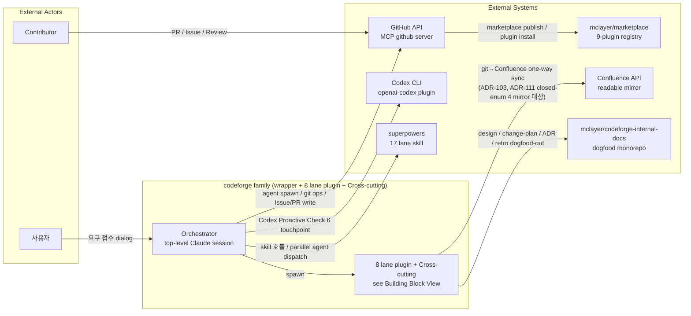
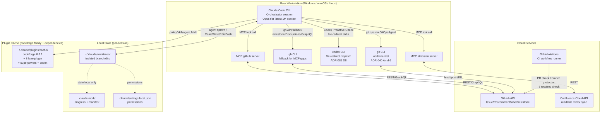

> **목표 invariant (ADR-078 §결정 1 verbatim)**: 코드 직접 read 없이 architecture_doc 1개 read 로 전체 구조 (모듈 + 경계 + 인터페이스 + 데이터 흐름) 파악.

<!-- 본 file = wrapper repo 1회 seed (CFP-920 / Epic B Story-2) + CFP-1427 5-anchor expand (Sub-C S3.3 / ADR-078 Amd 2).
     누적 현재 상태 SSOT (Story key 독립, 영속). 델타는 Change Plan SSOT (disjoint, ADR-078 §결정 3).
     8 lane plugin self-owned architecture_doc 는 각자 plugin repo `docs/architecture/<plugin>.md` SSOT
     (CFP-949 Sub-Epic 6 lane plugin self-owned seed merged + CFP-1059 declarative 2 신규 plugin = follow-up sub-CFP 독립 carrier).
     본 doc = family overview (cross-link source) + 8 lane plugin enumeration + 5-anchor 시스템 현황 layer. -->

## 모듈

codeforge = Claude Code 범용 SW 개발 오케스트레이션 플러그인 family. **wrapper (codeforge) = 0 core agent** (wrapper-only, ADR-009 ζ arc) — Orchestrator (top-level Claude 세션) 가 8 lane plugin 의 agent 를 spawn.

`[verified: CLAUDE.md @ HEAD fb06a04 "Development Agent Team" table — agent counts cross-checked]` — 8 lane plugin (6 → 8 확장, CFP-1059 / ADR-087+088) + Cross-cutting + agent composition:

| 모듈 (plugin) | 책임 | agent 구성 | status |
|---|---|---|---|
| **codeforge** (wrapper) | family identity + cross-cutting policy SSOT + skill pointer. agent 0개 (Orchestrator 가 lane plugin agent spawn) | 0 (wrapper-only) | Active |
| **codeforge-requirements** | 요구사항 레인 — 사용자 요구 접수 → 통합 요구사항 명세 | 7 (PL + DomainAgent + RequirementsAnalyst + Researcher + ChangeImpactAgent + FeasibilityAgent + ContinuityAgent) | Active |
| **codeforge-design** | 설계 레인 — Change Plan + ADR 확정 | PL + ArchitectAgent chief + 6 permanent SubAgent + 3+1 CONDITIONAL + 4-tuple sub-tuple (CFP-1126 / ADR-042 Amd 10 — 6+3+1, AggregateArch deprecated + ModuleArch boundary axis unified) | Active |
| **codeforge-review** | 설계리뷰 / 구현리뷰 / 보안테스트 레인 — 산출물 검수 | 5 (3 PL + 2 worker) | Active |
| **codeforge-develop** | 구현 레인 — TDD 구현 + QA | 5 (PL + QADev + 3 role:dev core) + preset/overlay 동적 | Active |
| **codeforge-test** | 통합테스트 레인 — Epic-level 통합 검증 | 1 (IntegrationTestAgent) | Active |
| **codeforge-deploy** (CFP-1059 / ADR-087) | 배포 레인 — Epic 묶음 종료 후 변경 repo blue-green + atomic swap + 3-시간 보존 + 자동 rollback | 2 (DeployPLAgent + DeployWorkerAgent, Sonnet) | Phase 1 declarative — plugin seed 신설 = S2 sub-Story carrier |
| **codeforge-deploy-review** (CFP-1059 / ADR-088) | 배포 검토 레인 — production smoke / 성능 비교 / cutover 사후 검증 + ProductionEvidenceDeputy 이관 owner | 3 (DeployReviewPLAgent Opus + DeployReviewWorkerAgent Sonnet + ProductionEvidenceDeputy 이관) | Phase 1 declarative — plugin seed 신설 = S3 sub-Story carrier |
| **codeforge-pmo** | Cross-cutting — Epic 창설 / Story 회고 / Git ops / Dialog fidelity | 3 (PMOAgent + GitOpsAgent + DialogFidelityAgent) | Active |

> 각 lane plugin agent 역할·동작 = 해당 plugin CLAUDE.md SSOT (lane plugin self-owned architecture_doc 안 `## 모듈` H2 = lane internal 상세). 본 표 = family composition map (plugin 단위, 라인 수준 0건).

## 경계

**Lane self-write boundary** (각 모듈이 직접 갱신하는 Story file 섹션 — `codeforge:lane-self-write-boundary` SSOT 요약):

| 모듈 | self-write 영역 |
|---|---|
| codeforge-requirements | Story §2 · §5 · §6 |
| codeforge-design | Story §3 · §7 · §11 + `docs/change-plans/**` + `docs/adr/**` + `docs/architecture/<plugin>.md` 갱신 (ADR-078 §결정 4 + Amd 2 per-Epic 현행화 mandate) |
| codeforge-develop | Story §8 · §8.5 + Phase 2 PR |
| codeforge-deploy (CFP-1059) | Story §12 배포 manifest (Phase 2 PR 후 trigger, Phase 1 declarative — S2 sub-Story body wire) |
| codeforge-deploy-review (CFP-1059) | Story §13 배포 검증 evidence + ProductionEvidenceDeputy ownership (Phase 1 declarative — S3 sub-Story body wire) |
| codeforge-pmo | Story §11(retro 영역) + `docs/retros/**` + `docs/architecture/<plugin>.md` 갱신 (PMO lane 자체 변경 시) |
| Orchestrator | Story §9 (final verdict) · §10 (FIX Ledger, fix-event-v1 monopoly) · §14 (Lane Evidence) · phase 전환 label |

**owner agent direct write** (CFP-26 Phase 0a): `docs/{change-plans,adr,domain-knowledge,retros,architecture}/**` = owner agent 직접 write (Orchestrator monopoly 영역과 disjoint).

**scope partition**: dogfood artifacts (specs/plans/retros/stories/change-plans) = `mclayer/codeforge-internal-docs` monorepo SSOT (ADR-013). wrapper repo = policy/template/script SSOT. consumer overlay (`.claude/_overlay/`) = 정책 확장만 가능 (축소 불가).

## 인터페이스 계약

모듈 간 계약 surface = `docs/inter-plugin-contracts/` (canonical = producer plugin repo, wrapper = sibling sync mirror — ADR-010). `[verified: MANIFEST.yaml @ HEAD fb06a04]`:

**kind:contract (9)** — lane 간 산출물 핸드오프 surface (CFP-1059 / ADR-087+088 신설 2종 placeholder):

| contract | producer plugin | 용도 | status |
|---|---|---|---|
| review_verdict | codeforge-review | 리뷰 verdict packet (pl_recommendation) | Active |
| requirements_output | codeforge-requirements | 요구사항 synthesis | Active |
| design_output | codeforge-design | 설계 산출물 | Active |
| develop_output | codeforge-develop | 구현 산출물 | Active |
| test_verdict | codeforge-test | 통합테스트 verdict | Active |
| pmo_output | codeforge-pmo | Epic/retro 산출물 | Active |
| git_ops_event | codeforge-pmo | GitOpsAgent 이벤트 | Active |
| **deploy_output** | codeforge-deploy | 배포 산출물 (Phase 2 PR merge 후 trigger 데이터) | Phase 1 placeholder — body wire = S2 sub-Story carrier |
| **deploy_review_output** | codeforge-deploy-review | 배포 검증 산출물 (smoke / 성능 비교 / cutover 사후 검증) | Phase 1 placeholder — body wire = S3 sub-Story carrier |

**kind:registry (sibling sync 면제 — ADR-010 §결정 2)**: label-registry-v2 / debate-protocol-v1 / evidence-check-registry-v1 / severity-propagation-v1 / parallel-dispatch-protocol-v1 / imperative-walker-protocol-v1 + chain-managed (comment-prefix-registry-v1 / fix-event-v1).

> 계약 schema field-level 상세 = 각 contract file SSOT + `MANIFEST.yaml`. 본 섹션 = surface enumeration (계약 이름 + SSOT pointer, 라인 수준 0건). version 값은 MANIFEST.yaml SSOT 가 권위 (본 doc 누적 현재 상태 — version drift 회피 위해 본 섹션 version literal 미박제).

## 데이터 흐름

**Story lane spawn flow** (Orchestrator 가 lane 진입 시 해당 lane plugin PL 1개 spawn — non-skippable. 8 lane 확장 CFP-1059 / ADR-087+088):

```
사용자 요구 접수
  → 요구사항 lane (codeforge-requirements:RequirementsPLAgent) → Story §1-§6 synthesis
  → 설계 lane (codeforge-design:ArchitectPLAgent) → Change Plan + ADR + Story §3/§7/§11 + architecture_doc 갱신
  → 설계리뷰 lane (codeforge-review:DesignReviewPLAgent) → review_verdict
  → 구현 lane (codeforge-develop:DeveloperPLAgent) → Phase 2 PR
  → 구현리뷰 lane (codeforge-review:CodeReviewPLAgent) → review_verdict
  → CI gate (phase-gate-mergeable) → merge
  → [Epic 종료 시] 통합테스트 lane (codeforge-test:IntegrationTestAgent) → test_verdict
  → 보안테스트 lane (codeforge-review:SecurityTestPLAgent) → review_verdict
  → [Epic 묶음 종료 시] 배포 lane (codeforge-deploy:DeployPLAgent) → deploy_output [Phase 1 declarative]
  → 배포 검토 lane (codeforge-deploy-review:DeployReviewPLAgent) → deploy_review_output [Phase 1 declarative]
```

**Cross-cutting 흐름** (Story lane 게이트 비개입, 독립 spawn):
- PMOAgent — Epic 창설 / Story 완료 retro (Phase 2 PR merge 후 5분 grace 자동 trigger, ADR-045)
- GitOpsAgent — parallel epic conflict 검사 + scope_manifest intersection
- DialogFidelityAgent — Orchestrator ↔ 사용자 dialog 3-anchor read-only verify

**artifact propagation**:
- Story file (`internal-docs/<plugin>/stories/<KEY>.md`) = lane 간 컨텍스트 SSOT (각 lane self-fetch)
- Change Plan (`docs/change-plans/<slug>.md`) = Story 단위 변경 델타 (1회, Story key 종속)
- architecture_doc (`docs/architecture/`) = 누적 현재 상태 (영속, Story key 독립) — Change Plan 과 disjoint 상보 (ADR-078 §결정 3). per-Epic 현행화 mandate (ADR-078 Amd 2 §결정 2)
- ADR (`docs/adr/`) = 단일 결정 단위 (불변)
- EPIC-RESULTS (`internal-docs/<plugin>/retros/`) = Epic close 1회 evidence aggregate

> 본 흐름 = lane spawn / event / artifact propagation 수준. 함수 호출 trace / 변수 전달 라인 0건 (anti-scope guard 준수).

---

## 시스템 현황 (ADR-078 Amendment 2 — 5-anchor section schema)

> ADR-078 Amendment 2 §결정 3 의 5-anchor "시스템 현황" section codify (closed-enum, open_extension: false). 본 family-level overview 의 ArchitectAnalystAgent as-is 설계 확인 시 자연 lookup target. lane-internal 상세 = 각 plugin self-owned architecture_doc 의 동일 5-anchor section 참조.
>
> 4 영역 closed-enum (모듈 / 경계 / 인터페이스 계약 / 데이터 흐름) 위 reading orientation layer 추가 (additive extension, 4 영역 약화 0건). 4 영역 → 5-anchor mapping = ADR-078 Amd 2 §결정 3 표 SSOT.

### arc42 §3 — Context & Scope

codeforge family 의 외부 경계 + 외부 시스템 / actor / interface enumeration. **무엇과 상호작용하는가**.



**Trust boundary**: 외부 입력 = (사용자 dialog / GitHub API webhook / Codex worker output / Superpowers skill body / Marketplace registry data / Confluence API). 모든 외부 입력은 verify-before-trust 4-layer 안전망 통과 (ADR-073 Orchestrator verify-before-assert / ADR-070 Codex verify-before-trust / ADR-082 write-time self-write verification / ADR-045 §D-9 PMOAgent retro forcing function).

**in-scope vs out-of-scope**:
- in-scope = SW 개발 라이프사이클 자동화 (요구사항 → 설계 → 리뷰 → 구현 → 통합 테스트 → 보안 테스트 → 배포 → 배포 검토 8 lane)
- out-of-scope = production runtime monitoring / live incident response / customer-facing UI / billing — codeforge 는 dev lifecycle plugin (operational lifecycle 영역 = consumer 책임)

### arc42 §5 — Building Block View

family 의 plugin / module decomposition. **무엇으로 구성되어 있는가**.

```mermaid
graph TB
    subgraph "wrapper (codeforge)"
        WrapperPolicy[CLAUDE.md<br/>+ playbook<br/>+ skill 정책]
        WrapperContracts[inter-plugin-contracts<br/>MANIFEST.yaml<br/>sibling sync mirror]
        WrapperRegistries[kind:registry 8종<br/>label / debate / evidence /<br/>severity / parallel-dispatch /<br/>walker / comment-prefix / fix-event]
        WrapperADR[docs/adr/<br/>ADR-001~ADR-111+]
        WrapperArch[docs/architecture/<br/>codeforge-family.md<br/>본 doc]
    end

    subgraph "Production lanes (6 active)"
        Req[codeforge-requirements<br/>7 agent]
        Design[codeforge-design<br/>PL + chief + 6+3+1 SubAgent + 3 sub-tuple]
        Review[codeforge-review<br/>3 PL + 2 worker]
        Develop[codeforge-develop<br/>5 + dynamic role:dev]
        Test[codeforge-test<br/>1 IntegrationTestAgent]
        PMO[codeforge-pmo<br/>3 PMO + GitOps + DialogFidelity]
    end

    subgraph "Deploy lanes (2 declarative — CFP-1059 Phase 1)"
        Deploy[codeforge-deploy<br/>2 Sonnet — Phase 2 seed S2]
        DeployReview[codeforge-deploy-review<br/>3 Opus+Sonnet — Phase 2 seed S3]
    end

    WrapperPolicy -.->|policy SSOT| Req
    WrapperPolicy -.->|policy SSOT| Design
    WrapperPolicy -.->|policy SSOT| Review
    WrapperPolicy -.->|policy SSOT| Develop
    WrapperPolicy -.->|policy SSOT| Test
    WrapperPolicy -.->|policy SSOT| PMO
    WrapperPolicy -.->|policy SSOT| Deploy
    WrapperPolicy -.->|policy SSOT| DeployReview
    WrapperContracts -.->|MANIFEST mirror| Design
    WrapperContracts -.->|MANIFEST mirror| Review
    WrapperContracts -.->|MANIFEST mirror| Develop
    WrapperContracts -.->|MANIFEST mirror| Test
    WrapperContracts -.->|MANIFEST mirror| PMO
    WrapperArch -.->|family overview cross-link| Req
    WrapperArch -.->|family overview cross-link| Design
    WrapperArch -.->|family overview cross-link| Review
    WrapperArch -.->|family overview cross-link| Develop
    WrapperArch -.->|family overview cross-link| Test
    WrapperArch -.->|family overview cross-link| PMO
```



**plugin family lifecycle phase**:
- **Active (6 production lanes)** = codeforge-{requirements,design,review,develop,test,pmo} 모두 정식 plugin repo 보유 + agent file + self-owned arch doc + marketplace 등록
- **Declarative Phase 1 (2 deploy lanes)** = codeforge-{deploy,deploy-review} = CFP-1059 / ADR-087+088 declarative seed only. plugin repo 신설 = S2/S3 sub-Story body wire carrier (본 Sub-C S3.3 scope 외)

### C4 Container

runtime topology — 각 plugin / external system 의 container-level deployment unit + 통신 protocol. **어떻게 동작하는가**.



**통신 protocol enumeration**:
- **Claude ↔ MCP server** = JSON-RPC over stdio (Claude Code harness)
- **Claude ↔ GitHub API** = REST + GraphQL via MCP github tool (PAT auth)
- **Claude ↔ Confluence API** = REST via MCP atlassian tool (consumer overlay project.yaml atlassian.* 주입, ADR-103)
- **Claude ↔ Codex CLI** = `codex exec --sandbox read-only < <promptfile>` file-redirect (ADR-081 Amd 6 D8 — direct stdin-pipe 차단 TTY 부재 0-byte stall 회피)
- **Claude ↔ git** = local git CLI (worktree-first invariant ADR-040 Amd 6 — `git -C <worktree_abs_path>` 강제)
- **Local state** = filesystem-only (no central state server, codeforge = stateless per-session orchestration)
- **Plugin distribution** = `~/.claude/plugins/cache/` (consumer install via `mclayer/marketplace` registry, 9 plugin atomic version 고정 per CFP-744)

### C4 Component

container 내부 component 의 logical unit + 책임 + 인접 component 관계. **각 lane plugin 내부 구조 (family-level overview)**.

```mermaid
graph TB
    subgraph "codeforge-requirements (Req lane)"
        ReqPL[RequirementsPLAgent<br/>PL synthesizer §2/§5/§6]
        ReqPL --> Domain[DomainAgent<br/>known knowns §2]
        ReqPL --> Analyst[RequirementsAnalystAgent<br/>ambiguity §5]
        ReqPL --> Researcher[ResearcherAgent<br/>concept §6 Opus]
        ReqPL --> ChangeImpact[ChangeImpactAgent §4.1]
        ReqPL --> Feasibility[FeasibilityAgent §4.2]
        ReqPL --> Continuity[ContinuityAgent §4.3]
    end

    subgraph "codeforge-design (Design lane)"
        DesignPL[ArchitectPLAgent<br/>supervisor + FIX 판정자]
        DesignPL --> Chief[ArchitectAgent chief<br/>multi-source synthesis]
        Chief --> Permanent[6 permanent SubAgent:<br/>Security/Module/APIContract/<br/>InfraOp/TestContract/Data]
        Chief --> Conditional[3+1 CONDITIONAL:<br/>LiveOps/LiveOrder/<br/>ProductionEvidence/<br/>Aggregate-applicability]
        Chief --> SubTuple[3 sub-tuple:<br/>CodebaseMapper/Refactor/<br/>ArchitectAnalyst]
    end

    subgraph "codeforge-review (Review lane × 3)"
        ReviewBase[review-pl-base.md<br/>공통 SSOT]
        ReviewBase -.->|inherit| DesignReviewPL[DesignReviewPLAgent]
        ReviewBase -.->|inherit| CodeReviewPL[CodeReviewPLAgent]
        ReviewBase -.->|inherit| SecurityTestPL[SecurityTestPLAgent]
        DesignReviewPL --> ClaudeWorker[ClaudeReviewAgent<br/>worker peer]
        DesignReviewPL --> CodexWorker[CodexReviewAgent<br/>worker peer]
        CodeReviewPL --> ClaudeWorker
        CodeReviewPL --> CodexWorker
        SecurityTestPL --> ClaudeWorker
        SecurityTestPL --> CodexWorker
    end

    subgraph "codeforge-develop (Develop lane)"
        DevPL[DeveloperPLAgent<br/>role:dev orchestrator]
        DevPL --> QADev[QADeveloperAgent<br/>test code + CI workflow]
        DevPL --> DevCore[DeveloperAgent<br/>+ DataEngineer + InfraEngineer<br/>+ preset/overlay role:dev]
    end

    subgraph "codeforge-test (Test lane)"
        IntegTest[IntegrationTestAgent<br/>Epic-level single-shot<br/>Sonnet → Opus fallback]
    end

    subgraph "codeforge-deploy (Deploy lane — Phase 1 declarative)"
        DeployPL[DeployPLAgent<br/>Sonnet — S2 seed]
        DeployPL --> DeployWorker[DeployWorkerAgent<br/>Sonnet — S2 seed]
    end

    subgraph "codeforge-deploy-review (Deploy Review lane — Phase 1 declarative)"
        DeployReviewPL[DeployReviewPLAgent<br/>Opus — S3 seed]
        DeployReviewPL --> DeployReviewWorker[DeployReviewWorkerAgent<br/>Sonnet — S3 seed]
        DeployReviewPL --> ProdEvidenceDeputy[ProductionEvidenceDeputy<br/>이관 from codeforge-design]
    end

    subgraph "codeforge-pmo (Cross-cutting)"
        PMO[PMOAgent<br/>Epic / retro / cross-Story]
        GitOps[GitOpsAgent<br/>long-running teammate]
        DialogFid[DialogFidelityAgent<br/>3-anchor verifier]
    end
```



**Component 책임 / 인접 관계 핵심 invariant**:
- **PL synthesis monopoly** = 각 lane PL 만 lane-owned Story section write (sub-agent / worker 는 PL 에 input 만 return, sub ↔ sub 직접 통신 0)
- **flat spawn invariant** = Orchestrator 가 모든 sub-agent / worker flat spawn (재귀 spawn 금지 ADR-039, nested team 금지 ADR-044). 4-tuple sub-tuple = 논리적 그룹핑일 뿐 spawn 계층 아님
- **worker peer 필수** = review lane 의 Claude + Codex 양 worker 모두 spawn 의무 (단독 fallback 0, ADR-001)
- **CONDITIONAL deputy** = Live touching / production cutover Story 만 active (Backtest/Paper-only Story = 미spawn)
- **Cross-cutting boundary** = PMO / GitOps / DialogFidelity 는 Story lane gate 비개입 (sibling 책임 영역 disjoint)
- **Phase 1 declarative (deploy lanes)** = agent file / contract body / workflow 실 신설 = S2/S3 sub-Story carrier (본 declarative phase = 정책 anchor only)

### Open Decisions Pending

ADR 미합의 / Wave 미작성 / placeholder 집중 영역. **design lane 진입 시 모호성 즉시 visible**.

| 영역 | 상태 | carrier |
|---|---|---|
| **Mega-Epic CFP-1415 (Confluence-as-derived-mirror governance standardization) 진행 중** | 4 Sub-Epic split (Sub-A/B/C/D) — 본 Sub-C S3.3 = wrapper family.md 5-anchor expand carrier | Issue #1415 (Epic) + Sub-Epic #1418 (Sub-C) |
| **codeforge-deploy / codeforge-deploy-review plugin repo 신설 미완** | CFP-1059 / ADR-087+088 declarative Phase 1 merged — 실 plugin seed (agent file / contract body / marketplace 등록) = S2/S3 sub-Story carrier | follow-up sub-CFP 2 (S2 codeforge-deploy seed / S3 codeforge-deploy-review seed) |
| **8 lane plugin self-owned arch doc 5-anchor expand** | 6 active plugin (CFP-949 baseline) = 4 H2 schema 보유 / 5-anchor section 미반영 — 본 Sub-C S3.3 의 cross-repo follow-up 영역 | follow-up sub-CFP 6 (codeforge-{requirements,design,develop,review,test,pmo} 각자 self-owned arch doc 5-anchor expand) |
| **ArchitectAnalystAgent dual-read path 실 wire** | ADR-078 Amd 2 §결정 1 declared (git primary + Confluence fallback) — 실 wire = codeforge-design plugin ArchitectAnalystAgent.md self-write 확장 | follow-up Sub-C S3.4 (다른 sub-CFP carrier) |
| **mechanical wire — review-verdict-v4 v4.10 `living_architecture_updated: bool`** | ADR-078 Amd 2 §결정 6 declared (Wave 1 declaration-only) — lint workflow + bats fixture + evidence-checks-registry row + hotfix-bypass label family member | follow-up Sub-C S3.5 / CFP-1429 carrier |
| **5 follow-up CFP (HIGH 2 + MEDIUM 2 + LOW-DEFER 1)** | Mega-Epic CFP-1415 진행 중 5 follow-up declared — defer / immediate split | (다른 CFP 발의 후 status 갱신) |
| **#1320 사용자 dependency** | 사용자 발화 영역의 hard dependency — 본 Sub-C 진행 중 absorb 필요 시 status update | Issue #1320 |
| **#1439 MCP labels bug** | MCP labels API 영역 known bug — codeforge family 안 cross-cutting 영향 (label-registry-v2 propagation 차단 가능) | Issue #1439 (독립 fix carrier) |
| **CFP-1126 / ADR-042 Amd 10 — AggregateArch deprecated 실 agent file 정리** | 정책 codify 완료 (CFP-1168 realized) — 실 agent file deprecate = codeforge-design plugin cross-repo sibling sync Wave 2 추후 CFP carrier | follow-up sub-CFP (codeforge-design plugin agent file deprecation) |

> **본 Open Decisions 영역 = 매 ADR-078 Amd 2 §결정 2 per-Epic 현행화 시점에 갱신 의무**. ArchitectAnalystAgent / 신규 contributor / design lane 진입 시 본 표가 "지금 codeforge 의 모호성" 즉시 visible answer 의 single SSOT.

---

### anti-scope guard (ADR-078 §결정 1 verbatim — 작성자 필독)

본 doc 은 **구조 수준 only**. 4종 패턴 금지: (1) 클래스/함수/변수 라인 단위 열거 (2) import graph 라인-level (3) 함수 signature/parameter/return type (4) src/ 1:1 디렉터리 dump. 라인 수준 필요 시 = 코드/Change Plan/ADR 영역.

### ADR-076 declarative reconciliation 3-layer cross-ref

본 doc 의 architecture_doc 운용은 [ADR-076](../adr/ADR-076-declarative-reconciliation-upgrade.md) declarative reconciliation 3-layer 패턴을 도메인 disjoint 로 답습 (ADR-078 §결정 2):

- **desired state** = 본 doc 의 4 H2 closed-enum (모듈 + 경계 + 인터페이스 계약 + 데이터 흐름) + 5-anchor 시스템 현황 section (ADR-078 Amd 2 §결정 3) 누적 현재 상태 SSOT
- **current state** = wrapper repo (`CLAUDE.md` / `docs/inter-plugin-contracts/MANIFEST.yaml` / 8 lane plugin repo 의 actual agent file + CLAUDE.md + arch doc) 의 실제 정의 상태
- **converge** = ArchitectAgent self-write 확장 (per-Epic 현행화 mandate, ADR-078 §결정 4 + Amd 2 §결정 2) + design lane verdict gate (drift lint architecture-drift, ADR-078 Amd 1)

> 본 cross-ref = 패턴 답습. 도메인 (upgrade flow ↔ family overview) 은 disjoint. wording SSOT = ADR-076 본문 + ADR-078 §결정 2 + Amd 2.
