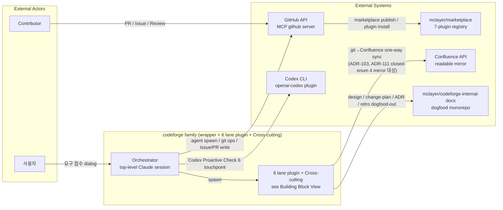

> **목표 invariant (ADR-078 §결정 1 verbatim)**: 코드 직접 read 없이 architecture_doc 1개 read 로 전체 구조 (모듈 + 경계 + 인터페이스 + 데이터 흐름) 파악.

<!-- 본 file = wrapper repo 1회 seed (CFP-920 / Epic B Story-2) + CFP-1427 5-anchor expand (Sub-C S3.3 / ADR-078 Amd 2).
     누적 현재 상태 SSOT (Story key 독립, 영속). 델타는 Change Plan SSOT (disjoint, ADR-078 §결정 3).
     6 lane plugin self-owned architecture_doc 는 모노레포 `plugins/<plugin>/docs/architecture/<plugin>.md` SSOT (ADR-118 D3)
     (CFP-949 Sub-Epic 6 lane plugin self-owned seed merged; deploy·deploy-review 2 lane = ADR-121 / CFP-2782 물리 제거).
     본 doc = family overview (cross-link source) + 6 lane plugin enumeration + 5-anchor 시스템 현황 layer. -->

## 모듈

codeforge = Claude Code 범용 SW 개발 오케스트레이션 플러그인 family. **wrapper (codeforge) = 0 core agent** (wrapper-only, ADR-009 ζ arc) — Orchestrator (top-level Claude 세션) 가 6 lane plugin 의 agent 를 spawn.

`[verified: CLAUDE.md @ HEAD fb06a04 "Development Agent Team" table — agent counts cross-checked]` — 6 lane plugin (deploy·deploy-review 2 lane 물리 제거 — ADR-121 / CFP-2782) + Cross-cutting + agent composition:

| 모듈 (plugin) | 책임 | agent 구성 | status |
|---|---|---|---|
| **codeforge** (wrapper) | family identity + cross-cutting policy SSOT + skill pointer. agent 0개 (Orchestrator 가 lane plugin agent spawn) | 0 (wrapper-only) | Active |
| **codeforge-requirements** | 요구사항 레인 — 사용자 요구 접수 → 통합 요구사항 명세 | 7 (PL + DomainAgent + RequirementsAnalyst + Researcher + ChangeImpactAgent + FeasibilityAgent + ContinuityAgent) | Active |
| **codeforge-design** | 설계 레인 — Change Plan + ADR 확정 | PL + ArchitectAgent chief + 6 permanent SubAgent + 3+1 CONDITIONAL + 4-tuple sub-tuple (CFP-1126 / ADR-042 Amd 10 — 6+3+1, AggregateArch deprecated + ModuleArch boundary axis unified) | Active |
| **codeforge-review** | 요구사항리뷰 / 설계리뷰 / 구현리뷰 / 보안테스트 레인 — 산출물 검수 (1 plugin 다 lane, CFP-2326 / ADR-125 요구사항리뷰 host 추가) | 6 (4 PL + 2 worker) | Active |
| **codeforge-develop** | 구현 레인 — TDD 구현 + QA | 5 (PL + QADev + 3 role:dev core) + preset/overlay 동적 | Active |
| **codeforge-test** | 통합테스트 레인 — Epic-level 통합 검증 | 1 (IntegrationTestAgent) | Active |
| **codeforge-pmo** | Cross-cutting — Epic 창설 / Story 회고 / Git ops | 2 (PMOAgent + GitOpsAgent) | Active |

> 각 lane plugin agent 역할·동작 = 해당 plugin CLAUDE.md SSOT (lane plugin self-owned architecture_doc 안 `## 모듈` H2 = lane internal 상세). 본 표 = family composition map (plugin 단위, 라인 수준 0건).

> **model tier 정책 (ADR-141 + Amendment 1 CFP-2735 + Amendment 2 CFP-2748 + Amendment 4 CFP-2803)**: codeforge family 의 **model tier = `opus` default + ADR-141 carve-out(Amendment 1: 외부위임·기계 워커 7종 = `model: haiku` / Amendment 2: 중간추론 14종 = `model: sonnet`; 1M native 는 opus 기준)**. Opus/Sonnet/Haiku 3-tier 선택 기준(ADR-042 §결정 1)·fable surgical tier(ADR-117)·rate-limit fallback 은 폐지됐다(ADR-141 §결정1/2/3) — haiku 7·sonnet 14 는 carve-out 로 의도 배정된 정상 tier 이다(누적 = non-opus haiku 7 + sonnet 14). **'전 에이전트 opus 단일 tier'·'Sonnet/Haiku 세션 중단' 규범은 Orchestrator 세션·거버넌스 default scope 이며, carve-out non-opus(haiku 7 + sonnet 10 + fable 10) subagent 는 정상 상태이다**(ADR-141 §A1-3/§A2-3, #846 정산). 아래 다이어그램·표의 개별 노드 tier 표기(Sonnet/Opus/fable/fallback)는 **역사 서술(dated snapshot)** 이며 현행 tier SSOT 아님 — 현행 = opus default + carve-out(haiku 7 + sonnet 10 + fable 10). consumer overlay 는 **각 에이전트 ADR-정의 tier(Amendment 1 carve-out 7=haiku / Amendment 2 carve-out 14=sonnet / Amendment 4 carve-out 10=fable / 그 외=opus) 미만 down-tier 불허**(4-clause 하한 (haiku/sonnet/fable/opus 각 하한), 보수 방향만, ADR-141 §A2-6 재해석 / ADR-127 §결정 6). tier SSOT = ADR-141(+Amendment 1·2·4).

## 경계

**Lane self-write boundary** (각 모듈이 직접 갱신하는 Story file 섹션 — `codeforge:lane-self-write-boundary` SSOT 요약):

| 모듈 | self-write 영역 |
|---|---|
| codeforge-requirements | Story §2 · §5 · §6 |
| codeforge-design | Story §3 · §7 · §11 + `docs/change-plans/**` + `docs/adr/**` + `docs/architecture/<plugin>.md` 갱신 (ADR-078 §결정 4 + Amd 3 per-PR 현행화 — 구 Amd 2 per-Epic mandate 의 granularity 확정, CFP-2813) |
| codeforge-develop | Story §8 · §8.5 + Phase 2 PR |
| codeforge-pmo | Story §11(retro 영역) + `docs/retros/**` + `docs/architecture/<plugin>.md` 갱신 (PMO lane 자체 변경 시) |
| Orchestrator | Story §9 (final verdict) · §10 (FIX Ledger, fix-event-v1 monopoly) · §14 (Lane Evidence) · phase 전환 label |

**owner agent direct write** (CFP-26 Phase 0a): `docs/{change-plans,adr,domain-knowledge,retros,architecture}/**` = owner agent 직접 write (Orchestrator monopoly 영역과 disjoint).

**scope partition**: dogfood artifacts (specs/plans/retros/stories/change-plans) = `mclayer/codeforge-internal-docs` monorepo SSOT (ADR-013). wrapper repo = policy/template/script SSOT. consumer overlay (`.claude/_overlay/`) = 정책 확장만 가능 (축소 불가).

**Runtime hook dispatcher 계층 경계** (ADR-115 / ADR-061 / CFP-2965): harness 가 발화하는 훅은 **3층**으로 분리된다 — **L1 dispatcher** (`hooks/run-hook.cmd` polyglot single-file: Unix 는 line-1 `exec bash`, Windows 는 cmd.exe 배치 본문 → Git-Bash 위임. bash 부재 시 `exit /b 0` fail-open) · **L2 thin wrapper** (`hooks/<name>` 셸 — bypass env audit · payload 수령 · 인터프리터 해소 `python3 → python → exit 0`) · **L3 판정 SSOT** (`scripts/lib/*.py` — 실제 deny/inject 판정). 경계 규율: L2 는 판정 로직을 갖지 않고(ADR-061 thin wrapper), L3 는 harness 계약(exit 0/2)만 방출하며, L1 은 종료 코드를 변형 없이 전파한다(괄호 블록 `%ERRORLEVEL%` parse-time 확장 금지 — 평탄화 시 deny 소실). 훅 간 관계는 **sibling disjoint** (ADR-115 §결정 3): 4 deny-gate + 1 injection 이 서로의 판정 표면을 읽지 않으며, `updatedInput` single-writer 는 injection 훅 1개뿐이다.

**게이트 결정론의 시간 예산 경계 (timeout fail-open)** (ADR-115 Amendment 2 / CFP-2965): 훅 판정은 무한 시간 안에서 결정론적인 것이 아니라 **명시 시간 예산 안에서만** 결정론적이다. `hooks/hooks.json` 의 26 leaf handler 는 각자 `timeout`(초, 값 공간 {1,5,10,15,30,60})을 선언하며, 만료는 **플랫폼-강제 fail-open**(해당 훅만 취소 + tool call 진행)이다 — 즉 "게이트가 켜져 있음"은 "예산 안에 판정이 끝났음"과 동치이고, 부하가 높을수록 게이트가 꺼질 확률이 커지는 **로드 상관 잔여 리스크**가 구조적으로 남는다(완화 불가 declare). 이 경계에서 파생되는 설계 규칙 3종: ① **하한 불변식** — 훅 timeout ≥ 내부 subprocess 예산 합 + 기동 여유 (예: 네트워크 훅의 gh 누적 예산 `GH_TOTAL_BUDGET_SEC=50` < timeout 60) ② **fail-open 계상 의무** — 값 결정은 "만료 1회 손실 심각도 × 만료 확률" 2축으로 산정하고 손실을 문서에 남긴다 ③ **차등 tier** — 균일값 금지(advisory·record-only 는 최단, 비가역 손실 게이트는 최장). 예산을 내부 로직으로 bound 하면 만료(무흔적 kill)가 **내부 fail-open(진단 stderr 1줄 + 흔적)** 으로 전환되어 관측성이 올라간다.

**Consumer merge-gate boundary** (ADR-132 / CFP-2469): consumer repo 의 게이트 강제력 = **2-layer** — (a) advisory hook 層 (UserPromptSubmit warning-inject-only, block 아님) ↔ (b) mechanical branch protection 層 (GitHub native `required_status_checks` merge 실차단). dead-gate(게이트 workflow 가 PR 마다 돌지만 `required_status_checks.contexts[]` 미등록 = merge 차단력 0) 해소 = mechanical 層 자동 충전 (`scripts/wire-branch-protection.*` operator gh auth GET-merge-PUT). 권한 경계: 자동 배선 = operator org-admin gh auth (codeforge PAT 미사용 — ADR-066 §결정 2 6-scope 무손상). 형상: `enforce_admins:true`(admin 우회 무력화 차단) + `review_count` solo=0/team≥1(deadlock 회피). 등록 context set = consumer 실제 배포 workflow job 표시명 ∩ codeforge 게이트(정적 manifest 복사 금지 — wrapper-self context 영구 pending 차단).

**수령 사실(receipt)의 기록 authority 경계** (ADR-139 Amendment 3 / ADR-170 Amendment 2 / CFP-2994): 기록 authority 는 **객체에 따라** 갈린다 — **verdict**(성과·liveness 판정)은 산출물·marker·rc 로 타자 검증이 가능하므로 lead 에 고정되고(ADR-139 INV-L4 — INV-L1~L4 및 §결정 1~7 무변경), **수령 사실**(통지·핸드오프 도달)은 상대 inbox 를 열거할 수단이 없어 타자 검증이 물리적으로 불가하므로 **수신 주체 단독 발행**이다. 두 객체는 disjoint 이며, 후자는 INV-L4 의 예외가 아니라 **그 정의역 밖 신설 entry** 다(약화 방향 없음 — ADR-064 §결정 7 symmetric ratchet 상 강화). 파생 규율: 수령 상태 표기(`receipt_state`)는 **도달(arrival) 전용** 경계 — 산출물 존재·귀속 기록은 허용하되 **충분성·품질·채택 가치 판정은 금지**(그 판정은 lead 잔존). 기록 귀속 위반 분류는 ADR-170 Amendment 2 가 저작 ⊥ 전사 축에 「타 주체 저작을 흡수하며 귀속을 자기로 표기」 형태를 추가해 확장한다(§결정 2 inline whitelist enumeration 무변경 — entry 신설·축소 없음).

**신뢰 밖 입력 × 신뢰 안 환경 신뢰경계 (ADR-172 / CFP-2949)**: 세션 독립 로컬 스케줄 작업 도입으로 codeforge 에 **신뢰 밖 입력(PUBLIC repo 의 외부 저작 텍스트)을 신뢰 안 환경(운영자 홈)에서 처리하는 최초 노드**가 생긴다. 지금까지 모든 기계 주체(GitHub Actions 러너)는 신뢰 밖 입력을 **신뢰 밖 환경**에서 처리했다 — 신뢰경계와 실행경계가 일치했고, 본 노드에서 그 일치가 깨진다(권한면 6종을 주입이 아니라 **상속·누적**). **도입기 완화 2축**: (a) 읽는 표면을 **코멘트 메타데이터 + 자기 마커 라인**으로 한정 (b) reconcile·dedup·마커·발화를 **결정론 CLI**(`scripts/lib/scheduled_task_reconcile.py`)에 귀속시켜 LLM 재량 축소. **정직 라벨**: 잔여가 남으며 **완전 차단은 불가**하다 — 이 형상에서 플랫폼 안티-인젝션 4종이 전건 무력하고(ADR-172 결과 5), 상속 자격증명은 회수 불가이며 채널 write 축은 도구층 `deny` 정의역 밖이다(결과 6·10). branch protection 8-tuple 무변경.

## 인터페이스 계약

모듈 간 계약 surface = `docs/inter-plugin-contracts/` (wrapper 단일 원본 — ADR-118 D5, sibling sync 폐지). `[verified: MANIFEST.yaml @ HEAD fb06a04]`:

**kind:contract (7)** — lane 간 산출물 핸드오프 surface:

| contract | producer plugin | 용도 | status |
|---|---|---|---|
| review_verdict | codeforge-review | 리뷰 verdict packet (pl_recommendation) | Active |
| requirements_output | codeforge-requirements | 요구사항 synthesis | Active |
| design_output | codeforge-design | 설계 산출물 | Active |
| develop_output | codeforge-develop | 구현 산출물 | Active |
| test_verdict | codeforge-test | 통합테스트 verdict | Active |
| pmo_output | codeforge-pmo | Epic/retro 산출물 | Active |
| git_ops_event | codeforge-pmo | GitOpsAgent 이벤트 | Active |

**kind:registry (sibling sync 면제 — ADR-010 §결정 2)**: label-registry-v2 / debate-protocol-v1 / evidence-check-registry-v1 / severity-propagation-v1 / parallel-dispatch-protocol-v1 / imperative-walker-protocol-v1 / gate-lane-map-v1 / spawn-event-v1 + chain-managed (comment-prefix-registry-v1 / fix-event-v1).

> **CFP-2914 (ADR-064 Amendment 16 / ADR-031 Amendment 3)** — registry 2건 MINOR: `parallel-dispatch-protocol-v1` (`worker_count_max` default 상향 = 순수 loosening) / `gate-lane-map-v1` (entry append). 두 계약 모두 **선언 surface 이며 현행 코드 소비자 0** 이다 — 계약 문면을 실재와 일치시키는 정합 변경이지 런타임 행위 변경이 아니다(정직 라벨). lane 열거 SSOT 는 `요구사항-리뷰` 편입으로 8종 정합(ADR-125 신설 lane 이 evidence 채널 4곳에 미반영이던 drift 정산).

> 계약 schema field-level 상세 = 각 contract file SSOT + `MANIFEST.yaml`. 본 섹션 = surface enumeration (계약 이름 + SSOT pointer, 라인 수준 0건). version 값은 MANIFEST.yaml SSOT 가 권위 (본 doc 누적 현재 상태 — version drift 회피 위해 본 섹션 version literal 미박제).

**infra-resource drift 스캔 게이트 CLI 계약 (ADR-157 D3 / CFP-2700 + CFP-2719 per-class census floor)**: `scripts/lib/check_infra_resource_drift.py`(Python SSOT, thin wrapper `scripts/check-infra-resource-drift.sh`) exit code **4-tier** — `0` = PASS(warning 방출 포함 — warning-tier 소비) / `1` = drift 검출(미선언 표면·orphan) · none-위장 · baseline growth 거부 / `2` = meta-error(manifest 부재·unreadable + usage 오류; malformed yaml 은 exit 2 **보장 없음** — 라인 파서 관용으로 부분 파싱되며 LIVE 표면 존재 시 none-disguise 경로 exit 1 로 표면화) / `3` = born-hollow(전역 candidates==0 ∧ inert==0 — OR per-class census floor: 선언 scan class(workflow/script/inert)의 glob 열거 파일 수 0, CFP-2719 §3.8) OR baseline substrate-failure(content_digest 불일치·필드부재). baseline 스키마 = `docs/infra-resource-baseline.yaml`(`--write-baseline` GENERATED) — `schema_version` / `generated_by` / `basis` / `content_digest`(sha256 (file, env_key) set-결박) / `grandfathered_undeclared_surfaces` 단일 section + growth 는 `--allow-baseline-growth --reason` 만 통과하며 사유가 `growth_reason` 에 각인(monotonic shrink).

**design-info read protocol 계약 (ADR-166 / CFP-2813)**: 신규 kind:registry 계약 `design-info-read-protocol-v1` (Phase 2 실 파일 + MANIFEST registries row — ADR-166 = 설계 SSOT). 표면 = G1-G5 소비자 분류 + G1+G2 mandatory 선행 read + `[Living-Arch-Read: <doc>, anchors=<list>, read_at=<sha|ts>]` traceability marker 스키마. 소비 = spawn packet / agent .md **in-band 주입** (파일 참조 아님 — marketplace 배포 시 lane plugin 패키지에 wrapper-root 파일 미포함이라 파일 참조는 consumer resolve 불가, 기존 계약 소비 방식과 동형). 짝 게이트 CLI exit-code 계약 (`check_living_architecture_update.py`): `0` PASS(명시 Success·honest no-op 포함) / `1` 위반 4-범주(missing-update / invalid-declare / mapping-miss / unknown-surface — 구조/비구조 양측 closed enum 미매칭 fail-closed [설계리뷰 F-1]) / `2` meta-error(unparseable 입력 fail-closed). review-verdict-v4 무변경 (`living_architecture_updated_self_check_passed` + `living-architecture-not-updated` v4.11 기존재 — bump 0, Phase 2 = DesignReviewPLAgent 소비 로직 배선만).

**parallel-work sentinel CLI 계약 (ADR-073 Amendment 2 / CFP-967 → CFP-2451 → CFP-2976)**: `scripts/lib/check_parallel_work_sentinel.py`(Python SSOT, thin wrapper `scripts/check-parallel-work-sentinel.sh`). 표면 = **mode 4종** — `title-search` / `epic-state-poll` / `head-compare-sibling-commits` / **`resource-scan`(CFP-2976 신설)**.

- **prefix 해석 계약 (CFP-2976 D-1)**: `STORY_KEY_PREFIX` env → `.claude/_overlay/project.yaml` `github.story_key_prefix` 유도 → **둘 다 실패 시 fail-closed(exit 2, `error_kind=prefix_undetermined`)**. ★구 계약의 조용한 `"CFP"` 기본값은 **제거**됐다 — consumer(prefix≠CFP)에서 정의상 공집합을 반환해 **판별력 0 게이트**가 되고, 그 빈 결과가 착수 통행증으로 소비되는 실사고를 냈다.
- **반환 계약 (CFP-2976 D-3)**: 성공 payload 에 `determined: true` 명시. 판정 불가 경로는 `determined: false` + `reason`. ⇒ **`matches: []` 단독으로는 "부재"를 주장할 수 없다** — 호출자는 `determined` 를 함께 읽어야 하며, `false` 인 실행은 통행증이 아니다(presence-only 오라클 구조적 차단).
- **`resource-scan` (CFP-2976 축4 · 어휘 무관)**: `--repo <owner/name> [--path <부분일치>]` → `branches` / `recent_commits` / `open_prs`. 어휘 검색은 *호출자가 고른 단어*에 의존해 선행 작업이 다른 어휘를 쓰면 원리적으로 미검출이나, 자원 지정 열거는 그 의존이 0 이다. **`excluded_self`(자기 브랜치·repo) 제외 필수** — 미제외 시 항상 1건 이상 반환되어 항진이 되고, 항진 게이트는 무시되어 판별력 0 과 동치가 된다. 절단은 `truncated[]` 로 표기(silent truncation 금지).

> 짝 테스트 = `tests/scripts/test_check-parallel-work-sentinel.sh`. CFP-2451 이 **코드 속성**("파라미터화됐나")을, CFP-2976 이 **배선 속성**("실제로 주입되나")을 각각 mutation-RED 로 고정한다 — 후자가 비어 실사고가 났다.

## 데이터 흐름

**Story lane spawn flow** (Orchestrator 가 lane 진입 시 해당 lane plugin PL 1개 spawn — non-skippable. 8 lane (요구사항리뷰 CFP-2326 / ADR-125; deploy·deploy-review 2 lane = ADR-121 / CFP-2782 물리 제거)):

```
사용자 요구 접수
  → 요구사항 lane (codeforge-requirements:RequirementsPLAgent) → Story §1-§6 synthesis
  → 요구사항리뷰 lane (codeforge-review:RequirementsReviewPLAgent) → review_verdict [CFP-2326 / ADR-125, Phase 1 내부 sub-gate — 외부사실 의존성 게이트]
  → 설계 lane (codeforge-design:ArchitectPLAgent) → Change Plan + ADR + Story §3/§7/§11 + architecture_doc 갱신
  → 설계리뷰 lane (codeforge-review:DesignReviewPLAgent) → review_verdict
  → 구현 lane (codeforge-develop:DeveloperPLAgent) → Phase 2 PR
  → 구현리뷰 lane (codeforge-review:CodeReviewPLAgent) → review_verdict
  → CI gate (phase-gate-mergeable) → merge
  → [Epic 종료 시] 통합테스트 lane (codeforge-test:IntegrationTestAgent) → test_verdict
  → 보안테스트 lane (codeforge-review:SecurityTestPLAgent) → review_verdict
```

**lane-spawn 관측 흐름** (CFP-2914 / ADR-064 Amendment 16 · ADR-031 Amendment 3) — 위 lane spawn flow 가 **실제로 규범대로 일어났는지**를 사후 관측하는 별개 흐름. **두 family 가 disjoint 하며 재통합 금지**:

```
[게이트 family — CI-reachable]
  Orchestrator lane spawn → Story §14 Lane Evidence (spawned_at 등 12 field) + PR body `## Lane evidence` 8-row
    → lane-evidence-check.yml (PR body format) + check-lane-evidence.sh
        ├ check_parallelization()      설계 lane 6-deputy co-dispatch  (기존, 무손상)
        └ check_peer_codispatch()      리뷰 peer 4 lane co-dispatch + 커버리지  (신설)
    → warning tier check-run  (required 미승격 — ADR-171 §결정 6 선결 미충족)

[진단 family — local-only]
  task-notification → Orchestrator 수기 append → .claude/ledger/spawn-event.jsonl (gitignored)
    → scripts/lib/analyze_spawn_concurrency.py  (co-dispatch 참고치 · 임계 경로 귀속)
    → 산출 결과는 커밋 문서에 값으로 박제 (원장 유실 = baseline 소멸 완화)
```

> **경계 불변식**: 원장은 gitignored + 로컬 단일본 + CI checkout 불가라 **어떤 workflow 에도 배선하지 않는다** — 배선 시 permanently-vacuous job 또는 보안 재심사 미이행. 반대로 게이트 family 는 원장을 **0건 참조**한다. 관측 채널의 입력 신뢰 등급은 **선언 기반**(저작자 self-report)이며 실행 이벤트 ground-truth 가 아니다 — 보장하는 것은 "선언된 값들이 60초 이내로 선언되었다"이지 "실제로 60초 이내에 spawn 되었다"가 아니다(advisory ceiling, ADR-143 동형).

**Cross-cutting 흐름** (Story lane 게이트 비개입, 독립 spawn):
- PMOAgent — Epic 창설 / Story 완료 retro (Phase 2 PR merge 후 5분 grace 자동 trigger, ADR-045)
- GitOpsAgent — parallel epic conflict 검사 + scope_manifest intersection
- (DialogFidelityAgent — Orchestrator ↔ 사용자 dialog 3-anchor read-only verify = CFP-2236 sunset, ADR-071 Amendment 9. 검증 ground = Codex TP#2/TP#3 + ADR-064 Q-3check 보존.)
- **branch-liveness watchdog** (ADR-164 / CFP-2772 — Phase 2 배선) — 병렬 브랜치가 coarse per-branch heartbeat(seq) emit → jira-progress-mirror Arc B-2 relay(per-branch pinned 코멘트, addComment 1종) → 외부 watchdog(GitHub Actions cron, ubuntu-latest hosted, session/host fault-independent) read-only poll → 3-state(신선/정체/미상, monotonic seq clock-무관, fail-open 금지) → verdict = GitHub durable(CI-native). observer-death(Orchestrator 자기사망) 외부 감지 = dead-man's-switch(meta-observer 자기 last-run marker). **경계 신규**: watchdog read-only Jira credential = infra-resource-baseline.yaml 선언 의무(ADR-157 drift gate). dev-process-event-v1 무접촉(new-sibling, liveness ⊥ granularity).
  - 방출 record 성장 (CFP-2995 / ADR-164 관측면 확장 — 판정·차단력 무변): fetch 단계 방출 record 가 triple(`fetch_status`·`collected_count`·`unobserved_reason`)에서 raw 스칼라 2종(`http_code`·`curl_rc`)을 더한 5필드로 자라고, `unobserved_reason` 값 공간 4→12 · `fetch_status` 4→5 로 확장된다. 동반 변경 강제 소비자 1(self-test 폐집합 `CONCRETE_REASONS`).

**축 C 산출물 보존·회수 흐름** (ADR-178 / CFP-2966 — Phase 1 규범, Phase 2 배선) — 세션 한도 등 비의지적 종료(축 C)에서 서브에이전트 진행 산출물이 소실되지 않도록 하는 handoff 흐름. 축 A(정지 적법성, CFP-2944)·축 B(생존 재개, CFP-2946)와 disjoint:

```
워커 작업 중 (상시)
  → 의미 단위 경계마다 progress-commit (P0 local commit, 단일 Bash 호출 — sub-worktree 보유 시)
  → D2 분석 텍스트 = cheap tier (Write, 파일-per-워커 — 공유 checkout lane · Bash 세금 0)
[세션 사망 후 — zero-notice]
  → 발견: 브랜치 네임스페이스 열거 + 잔재 스캐너 dirty|unpushed-N + ADR-172 세션-독립 관측 (git census — 신규 채널 0)
  → 판정: [WIP] 미완 표식 → inconclusive 취급 (ADR-170 §결정 20 INV-L2)
  → 인계: fresh 재스폰 packet 에 (브랜치·SHA·미완 표식) 3-tuple 주입 (ADR-141 Amd6 fresh-spawn only)
```

> tier = advisory (ceiling) — 종료 시점 lever 부재(StopFailure observe-only) + ADR-115 block 금지 + 권한 선언면 비집행. 마지막 의미 단위 경계 이후분 = 구조적 미완충 (정직 한계).

**salvage 회수·인계 흐름** (ADR-179 + ADR-109 Amd3 + ADR-141 Amd10 / CFP-2984 — Phase 1 규범, Phase 2 배선) — **위 블록의 disjoint 분기**다. 축 C 의 **보존·발견은 ADR-178 소관**(바로 위 블록, 재서술 0)이고, 본 블록은 그 위에 얹히는 **① 신호-발동 라우팅 ② 상위 생존 인계 ③ 재사용 판정** 만 서술한다:

```
[신호-발동 라우팅 — 실패 4-class 는 하나의 경로로 수렴하지 않는다. closed set SSOT = ADR-109 단일]
  한도류로 분류된 신호 (분류기 = 교체 가능 pointer)
    ├ 429 계열        → ADR-109 §결정 3 사다리 (step2 slot 현 tenant = ADR-141 Amd6; ordinal 1..4 frozen)
    │                    → skill body 3-step(탐지/대기/재시도) 안 "대기 진입 전 산출 고정"  [ADR-109 §결정 7 = Accepted 착지면]
    ├ 세션·주간 한도  → ADR-141 Amd6 fresh re-spawn(model:opus) + **Amd10 salvage 인계**
    ├ stall           → ADR-139 inconclusive 기록 → **비파괴 recovery 만** (kill/TaskStop 미배선)
    └ mid-run 사망    → ADR-179 §결정 2/5  ∥  전원 공멸이면 ADR-178 §결정 5-4 (pointer)

[상위 생존 인계 — Orchestrator 생존 ∧ 워커 사망 한정]
  census(ADR-178 발견 술어 재사용, 신규 관측 채널 0)
    → 번들 구성 (reference-first: branch@SHA · blob_ref · untracked=경로만·내용 0)
    → salvage-vs-redo 5문 게이트 (재현 / delta 폐쇄 / 잔여 선언 / base_sha re-pin / inconclusive 유지)
    → fresh Agent spawn 입력 패킷에 동봉 (SendMessage resume 금지 — A6-2 무변경)
        조각 = delimited untrusted block, 소비 등급 = inconclusive (자동 승격 금지)
    → 기록: §14 기존 태그 + ADR-170 entry 7 범위(numeric/enum/hash only) — 신규 채널·8번째 entry 0

[2축 분리]  무결성(usable|suspect, ADR-179 §결정 3)  ⊥  처분(inconclusive 단일, ADR-178 §결정 5-3)
[되먹임 ∅]  recovery 는 detection 관측면에 쓰지 않는다 (자기확증 liveness 차단 — ADR-139 INV-L1)
```

> **경계 불변식**: detection 재구현 0(ADR-139/164 소유) · 보존·발견 재서술 0(ADR-178 소유) · salvage 경로 재시도 예산 **0**(복구 절차가 스스로 예산을 곱하지 않는다). **정직 천장** — 절차 준수는 런타임 에이전트 행위라 PR diff 위 CI RED 불가(advisory ceiling, hook 강제도 ADR-115 로 차단). 실증 n=1(CFP-2840 fresh-spawn ∧ 산출 승계 양립)이며 회수율은 **미측정**. 현행 계약에 `salvage 성공 여부` 필드가 **부재**하고 재spawn 여부만 `recovery_action` enum 으로 **부분 표현** 가능 — 그 이상은 **기록 불가를 정직 declare**(스키마 확장 = BREAKING, 정의역 밖).

**artifact propagation**:
- Story file (`internal-docs/<plugin>/stories/<KEY>.md`) = lane 간 컨텍스트 SSOT (각 lane self-fetch)
- Change Plan (`docs/change-plans/<slug>.md`) = Story 단위 변경 델타 (1회, Story key 종속)
- architecture_doc (`docs/architecture/`) = 누적 현재 상태 (영속, Story key 독립) — Change Plan 과 disjoint 상보 (ADR-078 §결정 3). **per-PR 현행화** (ADR-078 Amd 3 / ADR-112 Amd 1 — 갱신 or `[living-arch-no-impact]` declare closed-binary, 게이트 = living-architecture-update blocking-on-pr(surfacing). 구 per-Epic mandate Amd 2 §결정 2 의 granularity 확정, CFP-2813). 소비 = design-info read protocol (ADR-166 — G1+G2 mandatory 선행 read)
- ADR (`docs/adr/`) = 단일 결정 단위 (결정 시점 고정 — 개정=supersede / 의미보존 위생편집 채널; ADR-058 §결정10). **번호 발급 flow**: wrapper(dogfood) 는 claim 채널(claim primitive OCC, `adr-reservation-state` state-branch — ADR-133)로 발급-시점 번호를 atomic 직렬화한 뒤 `ADR-RESERVATION.md` row append(audit 채널) — CFP-2563 실배선(built-but-unwired 해소); consumer 는 `Glob(docs/adr/) max+1` default(A1-1 비대칭)
- EPIC-RESULTS (`internal-docs/<plugin>/retros/`) = Epic close 1회 evidence aggregate

**요건 traceability zero-drop 게이트 (ADR-145 / CFP-2603, Epic CFP-2602 G1)**: `AC-N ↔ §8 명명 테스트 ↔ 실 테스트파일` zero-drop 을 강제하는 신규 fail-closed CI 게이트. 모듈 = Ports&Adapters — pure core (`scripts/lib/ac_id.py` leaf AC_ID_RE grammar + `scripts/lib/check_ac_traceability_matrix.py` 매핑 로직, network-0 offline-testable) + adapter I/O (`scripts/check-ac-traceability-matrix.sh` wrapper + `.github/workflows/ac-traceability-matrix.yml` workflow, fetch/cross-repo 전담). phase-aware 2-tier: Phase 1 = AC↔§8 명명 매핑 / Phase 2 = §8↔실 symbol born-missing(ast resolve, grep 금지). phase-gate-mergeable 흡수 기각 근거 = anchor 계층 warning-tier + fast-pass bypass 비호환(ADR-145 §결정 3, CONFLICT-C). **branch-protection 등록 = 사용자 결정 (A) 즉시 required 등록**(2026-07-11): G1 게이트 도입 Phase 2 PR 머지 시점에 `required_status_checks.contexts[]` 에 신규 context `ac-traceability-matrix` 즉시 추가(6→7-tuple). born-broken/false-red 위험은 게이트 self-test(execution-liveness L3 mutation-kill + F-fixture RED→GREEN)가 merge-precondition 이라 구조적 차단(born-broken 린터는 required 등재 불가 — ADR-145 §결정 3). shadow-required(B)는 미채택 대안(ADR-145 §대안, ADR-171 승격 evidence-gate 선례). Phase 2 PR 에서 본 doc C4(6→7) + CLAUDE.md 브랜치 보호 표(6→7-tuple) 동반 갱신.

**동적 테스트 최대화 게이트 (burden-flip) (ADR-146 / CFP-2605, Epic CFP-2602 G4)**: feasible 한 동적 검증(fuzz/property/load/concurrency)이 침묵 누락되면 §8.8 로스터 게이트가 구조적으로 차단하는 adequacy 강화(opt-in → do-it-unless-proven-infeasible burden-flip). 게이트 = `check_section_8_8` = 기존 `check_doc_section_schema.py` 확장(신규 module/workflow 0), 기존 strict required context `doc section schema (CFP-28 — strict)` 편승 → **신규 required context 0**(baseline branch-protection tuple 무관 — G1 6→7-tuple 등록 선착 시에도 G4 추가 0, EXTEND-path. G1 의 6→7 등록과 대조). fail-closed 범위 = 4기법 §8.8 applicability(DO|N/A) presence + 산출물 계약 필드 구조까지만(검출력 = G3 미강제 / soak·restart·replay = G2 disjoint — 정직 천장, ADR-119 정합). Phase 1 = 설계(본 doc data_flow + Open Decisions), 실 lint 함수 + self-test + template §8.8 + agent-md mandate = 동일 Story Phase 2.

**CI runner topology / self-hosted 이관 (ADR-147 / CFP-2607)**: mclayer org CI 실행 위치를 GitHub-hosted(`ubuntu-latest`)에서 org 소유 self-hosted runner 로 이관하는 boundary 변경. 배선 = repository variable `CI_RUNS_ON_LINUX_JSON`(JSON array) → `runs-on: ${{ fromJSON(vars.CI_RUNS_ON_LINUX_JSON || '["ubuntu-latest"]') }}` 단일 SSOT 표현식. public(plugin-codeforge/marketplace)은 var 미설정 → hosted coalesce(기능 불변), private/internal 18 repo 는 var SET → self-hosted(group6 Linux / group5 Windows). runner group `allows_public_repositories=false` fail-safe + byte-parity lockstep(`invariant-check.yml` templates↔.github blocking, `phase-gate-mergeable.yml` 포함) + provisioning invariant/unset fail-loud lint(billing-deadlock 차단). 필수 컨텍스트 문자열은 job id/name 이 `runs-on` 과 orthogonal 이라 **불변**. 제외 = public 2 + mctrader/deploy-k8s 3 ARC job. Phase 1 = 설계(본 Story), 실 배선 = Phase 2 child Story(카나리→웨이브, W0 부트스트랩). credential-sourcing 축(ADR-147 §결정 8 Amendment 1·2 / CFP-2821): org-wide PAT 소비 job 의 sanctioned path = hosted 유지 / OIDC / **runtime secret-manager JIT sourcing**(1Password, bounded 조건 7종 AND) 3택이 **default**(self-hosted 이관 시 write credential = least-privilege JIT materialize 우선). **단 operator 명시 risk-accept 하 Story-local static exception 허용**(§결정 8 Amendment 2 — CFP-2821 fix-ledger-sync 는 사용자 override 로 정적 `CODEFORGE_CROSS_REPO_PAT` 직접 env-bind 채택; 4-gate AND: operator risk-accept 기록 + fail-closed floor[pat-absent gate] 보존 + Story-local + green 실증). 정직 한정: 정적 exception = T4/T5 광역 노출 재수용(약화 방향, blast-radius JIT 대비 큼) — default 승격 아닌 per-Story operator-accepted deviation. **service-container 도달 축(§결정 8 Amendment 3 / CFP-2858)**: self-hosted DooD 러너의 sibling service-container(postgres·MinIO+etcd 등) 도달은 러너 launch 시 정적 `extra_hosts: host.docker.internal:host-gateway`(compose 층) 배선으로 결정론화(암묵 Docker Desktop runtime DNS 타이밍 의존 제거) — credential 축과 직교, workflow delta 0, 집행 = operator-convention(러너 compose 비-VC → §결정 4 fail-loud lint 상속 불가, PR-enforceable 기계 게이트 아님·durability gap 잔존). **durability 축(§결정 8 Amendment 4 / CFP-2890)**: 러너 infra(Dockerfile+compose+entrypoint)의 VC 편입(신규 **private** repo `mclayer/ci-runner-infra`, Amendment 3 declared durability-gap follow-up 이행) + `.rustup`(+`.cargo`) per-replica anonymous volume EXDEV(os error 18) 소거를 **설계 codify**(**Phase 1 = 본 Story 설계 / 실 repo 생성·편입·배선 = Phase 2 child Story**; named 금지=replicas:8 corruption, 빈 volume copy-up 으로 pre-bake 유지·workflow delta 0). §결정 5(웨이브별 toolchain=setup-* 주입)는 group6 Linux rust toolchain 한정 supersede-in-part(그 외 toolchain 무변경). 집행 = VC 편입으로 source 계층 PR-review/lint 가능성 확보하나 running fleet 반영은 여전히 operator `docker compose up -d --build`(source↔deploy 분리 ceiling — VC-backed reviewability 이지 PR-enforceable auto-deploy 아님). **용량(capacity) 축(§결정 2 Amendment 5 / CFP-2913)**: §결정 2 의 visibility 단일 축 분기는 **용량을 입력으로 갖지 않아** 고정 슬롯(group6 Linux **online 4대** 실측)을 초과하는 유입이 큐에 적체되고 §결정 7 24h 자동취소로 귀결됐다 → **용량 축 carve-out** additive codify: private/internal 의 특정 job 집합을 **커밋 시점에 정적으로 GitHub-hosted 로 배분**하되 총량을 hosted 무료 포함분 예산 상한 안으로 봉인(**예산-bounded 정적 배분**). **기본 배정(private/internal → self-hosted)은 불변** — 넘침은 예외 경로이지 새 default 가 아니며, default 대체 시점에는 supersede ADR 필수. 성립 조건 = **normative C1/C2'/C3**(C1 provisioning lint 를 presence→**값 검증** 승격[등록 러너 라벨 합집합 부분집합 ∧ 매칭 online 러너 1+ 실재 ∧ 로스터 정합] / C2' org-level 금지의 신규 키 상속 + **negative-presence 게이트 2축 AND**(상속 축 = 워크플로가 `vars` 컨텍스트를 관측해 `^CI_RUNS_ON_` 키 0 assert[credential 0 · public 표준 hosted 러너 무료라 예산 co-block 과 disjoint · **PR-enforceable**, 단 검사 워크플로 `runs-on` 은 리터럴 고정 필수 = 자기무력화 차단] ∧ 존재 축 = `gh api orgs/ORG/actions/variables/NEW_VAR`[404=PASS·200=FAIL-LOUD, org-admin 권한 요구라 **operator 층** 잔류] — 대체 아닌 AND: 어느 검사 repo 에도 상속되지 않는 `visibility: selected` 변종은 존재 축만 커버) + `visibility: private` 완화 불채택 / C3 라우팅 값 공간 폐쇄 + fork·`workflow_run` 유래 제외 + **통제-load-bearing pin 구조적 제외**) — 1+ advisory 강등 시 carve-out 무효·§결정 2 default 복귀. **제외 절 재귀속**: `mctrader/deploy-k8s.yml` 3 ARC job 의 제외 사유는 *"이미 self-hosted"*(매칭 online 러너 **0대** → 24h starvation 3건 반복 = affirmatively-FALSE)가 아니라 **C3 통제-load-bearing pin**(kubeconfig write step 제거 + ARC in-cluster SA 의존)이며, 매칭 러너 부재는 §결정 7 DR 사안으로 분리. **정직 한정**: 요구의 *결과*(고정 슬롯 초과분이 클라우드로)는 충족하나 *메커니즘*(런타임 busy 관측 동적 넘침)은 **미충족** — `runs-on` AND 매칭이라 OR fallback 표현 불가 ∧ 변수 flip 은 이미 큐에 든 job 미구제(양성대조 포함 라이브 실험 확정) ⇒ "동적 넘침 구현" 표기 금지. **보안 강화 선언 아님**(self-hosted 잔류 위험 ↔ hosted 예산 절벽의 교환, net 판정은 C1~C3 편입 전제 조건부). 집행(narrowing) = **C2' 상속 축만 PR-enforceable 승격**(public wrapper 기존 required 컨텍스트 편승)이고 그 외(존재 축 · C1 값-정합)는 operator/hub 스크립트 층(§결정 4(ii) billing-독립 배선 상속) — 전면 PR-enforceable 기계 게이트 아님.

**지속-liveness soak 게이트 (ADR-148 / CFP-2613, Epic CFP-2602 G2)**: 배포된 데몬이 CrashLoopBackOff·terminal-sink 동결로 "요건 미충족·미사용 결과물"이 되는 Gap B(런타임-현실 갭)를 게이트 도메인 불변식(INV-D1~D6)으로 재정의. **2-표면 module 경계 신설** — 표면 A(선언 fail-closed CI-lint: `check-operational-outcome-signal.sh` warning→blocking, wrapper runtime-0 dogfood, 전 Story normative) ⊥ 표면 B(런타임 soak: `IntegrationTestAgent` Deployability soak step, consumer normative / wrapper fixture-daemon self-test, declarative 면제). data_flow axis 1-node: 데몬 Story 선언(§7.4.7 sink_probes[]/daemon_type) → 표면 A blocking lint → 표면 B IntegrationTest boot-soak(생존 exit0∧restart0 ∧ terminal-sink monotone 전진, HTTP-200 아님) → `soak_liveness_results`(test-verdict-v2 v2.3 additive MINOR). interfaces axis = sink_probes[]/daemon_type schema 신설 + verdict-kernel 순수함수 seam(`evaluate_soak_sample`+reason-code enum 단일소스화, orchestration vehicle-local). soak/restart/replay = G2 단일소유(ADR-146 §결정3 g2_boundary_check). **신규 required context 0**(표면 A required 편입 = **LIVE 6→7-tuple 사용자 결정 유보**, shadow-first 권장 — [verified: gh api live=6-tuple 2026-07-12 / CLAUDE.md doc=7-tuple doc-ahead drift]. G1 `ac-traceability-matrix` = 문서상 즉시등록이나 live 미등록=dead-gate[CFP-2609 라우팅, sibling-disjoint] → shadow-first 지지, G4 편승 0 과도 대조). Open Decisions: required 편입 사용자 결정 / verdict-kernel 물리형태(templates/ 소script vs schema spec-embed) Phase 2 / 실배선 Phase 2 / G1 doc⊥live drift CFP-2609. Phase 1 = 설계(본 doc data_flow + ADR-148 + change-plan + Story §7), 실 lint 승격 + soak step + schema 신설 + fixture-daemon self-test = 동일 Story Phase 2.

**런타임 DAST 보안 동적 축 (ADR-150 / CFP-2612, Epic CFP-2602 G5)**: 보안테스트 lane 이 전면 정적(코드 층 SAST 9축)이라 실행 중에만 발동하는 취약점(런타임 injection·인증 우회·민감데이터 노출·설정 취약)이 조용히 미검증으로 남는 보안-adequacy 갭을 게이트 도메인 불변식(INV-G5-1~4)으로 재정의. G4 burden-flip 표준(ADR-146 §8 preamble)의 **보안 축 instantiation** — **§8.9 독립 로스터**(single `dast` axis, §8.8 4기법 편입 아님 — oracle 로 축 분리: G4-fuzz oracle=기능 crash/robustness ⊥ G5-DAST oracle=보안 취약 재현/attack). data_flow axis 1-node: 실행-보안 Story 선언(§8.9.0 dast applicability + 12 산출물 계약 필드 + `g_boundary_check`) → 표면① §8.9 presence doc-lint(`check_section_8_9` = `check_section_8_8` 동형 확장, 전 Story normative, `security_ai` 무관) → 표면② DAST 실 구동(consumer `test.yml`/`dast.yml` QADev — 앱 CI 기동→ZAP baseline/full/api-scan→SARIF `code-scanning/alerts?tool_name=zap` fetch, ADR-033 재사용) → 표면③ DAST 결과 AI-synthesis(보안 lane SecurityTestPL, `security_ai: true` opt-in, packet pointer 입력 — ADR-001 cross-ref, contract 무변경). **opt-in 비대칭 3-lane decouple**: presence mandate ⊥ opt-in(security_ai off 해도 §8.9 presence 게이트 유지). interfaces axis = §8.9 12 필드 + 2 cross-field normative 선언-정합(payload_class active/destructive⟹environment_ref non-prod ephemeral / authenticated∧unauth⟹infeasibility_reason) — enum-constrain(payload_class{passive,active,destructive}/auth_mode{unauthenticated,session,token}). 9축 category_enum **무변경**(DAST = 런타임 거울면, injection/auth/config/pii=YES·trust-boundary/credential/crypto=PARTIAL·dependency-cve/race=NO; security.md=pointer only, drift 회피). soak/restart/replay=G2·기능 fuzz=G4 단일소유 — `g_boundary_check`(dual G2∧G4 경계). **신규 required context 0**(기존 strict context `doc section schema (CFP-28 — strict)` 편승 — branch-protection **7-tuple**[verified: origin/main CLAUDE.md, CFP-2603/ADR-145 ac-traceability-matrix 6→7] **무변경**, G4 EXTEND-path 동형). 정직 천장(INV-G5-4): 게이트는 재현 시도·기록 presence/구조 + 2 cross-field 선언-정합까지만 — "취약점 실제 검출"은 강제 안 함(검출력=review/advisory/G3, detection-forcing=검사연극 ADR-119). §8.8 zero-touch 유일 예외 = `check_section_8_8` L355 region-slice `^###`→`^#{1,4}`(§8.9 sibling bleed 차단, 현행 동작 무변경). Phase 1 = 설계(본 doc data_flow + ADR-150 + change-plan + Story §7·§3), template §8.9 + `check_section_8_9` + `test-check-doc-section-8-9.sh` self-test + agent-md mandate = 동일 Story Phase 2.

**wrapper-self self-test execution-liveness 인벤토리/메타-게이트 (ADR-151 / CFP-2622, Epic CFP-2602 G6)**: wrapper-self `tests/scripts/*.sh` self-test corpus(35 = 22 wired + 1 inline-covered + 12 DEAD)에서 L3 discriminating fixture 는 작성됐으나 어느 workflow 에도 배선 안 돼 실행 안 되는(선언→실행 미승격) 표면 + 신규 self-test 침묵 un-run root 를, 게이트 실행-무결성(execution-liveness/adequacy) 갭으로 재정의. ADR-136 결정14 execution-liveness 3요건(L1/L2/L3)의 self-test corpus-wide 자기적용. data_flow axis 1-node: self-test 선언(`tests/scripts/*.sh` + `docs/selftest-execution-liveness-inventory.yaml` 8-field 레코드) → 정적 메타-게이트 `check_selftest_execution_liveness.py` presence/alive/형식 fail-closed(AC-1a 레코드 존재 / AC-2 channel 실재 or `manual_reason`≥30 / AC-3 `workflow:job` alive∧not `permanently_skipped` / AC-5 parity `both_copies` / AC-8 runtime N/A 3축 AND + `g_boundary_check` / AC-9 재귀 자기적용) → 신규 non-required wrapper-self-only workflow `selftest-execution-liveness-test.yml` 실행(actionlint-workflows-test.yml exemplar 답습). modules axis = 인벤토리 registry(SSOT, `evidence-checks-registry.yaml` 선례 위치) + 메타-게이트 pure-lint 층(정적 배선 presence 검사 — **신규 동적 러너 부활 아님, ADR-048 무충돌**). 12 DEAD 4-bucket 분류: A 진성 hollow-gate(doc-section 8-7/8-8/8-9 = required 게이트 `check-doc-section-schema.sh` mutation-kill fixture, 채널 죽음 — **우선 backfill**) / B agent-runtime(fix-replay·merge-gate·mutation disposition, `agent_runtime`+reason, "dead gate" hard-claim 금지) / C dead-path 존치(stakes-tier-gating, ADR-141 all-opus dormant) / D orphan·dedup(5, AC-10). soak(G2)/real-render(§8.7)/DAST(G5) runtime = wrapper-self 자연 N/A **3축 AND**(`g_boundary_check` 형제 축 참조). **신규 required context 0**(신규 non-required wrapper-self-only workflow — branch-protection 무변경, G6 추가 0). 정직 천장: presence/alive/형식까지만 — 검출력=G3 / 완결성=review / L1 blocking 승격=ADR-171 evidence-gate 미강제, "wrapper 동적검증 완전 봉인" hard-claim 금지(ADR-119). A2-5 판정 = ADR-136 원리 재정의 0 + corpus-wide 메타-게이트 신규 mechanism → **신규 ADR**(ADR-136 무수정 cross-ref, 형제 arc G1/G2/G4/G5 정합). Phase 1 = 설계(본 doc data_flow + ADR-151 + change-plan + Story §3·§7), 인벤토리 YAML(35 레코드) + 메타-게이트/self-test/workflow 실배선 + bucket A backfill = 동일 Story Phase 2.

**dark/born-missing forcing function 게이트 (ADR-152 / CFP-2624, Epic CFP-2602 G3)**: 기능이 default-off flag(예 mctrader `COMPACT_TIERED=0`) 뒤에 숨어 landing≠done 인 부실 산출물이 조용히 통과하는 병(dark-path adequacy 갭 + 요구-슬라이스 silent drop)을 게이트 도메인 불변식(INV-G3-1~4)으로 재정의. **(a) §8.10 독립 dark-path activation manifest 로스터**(`check_section_8_10` = `check_section_8_9` verbatim 동형, single `dark_path` axis) — 6 산출물 필드 + `g_boundary_check` region-token + 2 cross-field normative 선언-정합(activation-honesty: status=activated⟹activation_test_ref∧on_state_assertion≥15자 / infeasible⟹infeasibility_reason≥30자, declared-consistency ≠ detection). **(b) G3(b) Epic-close 요구-슬라이스 매핑**: EPIC-RESULTS `§requirement-slice-mapping` presence lint(`check_epic_results_slice_mapping`, 파일명 `EPIC-RESULTS-*.md` gate) + deferral 착지 = `§deferred` `source: req-slice-defer`(deferred-item-lifecycle 재사용, 단일-carrier, scanner 무변경). discriminating-A(meta/게이트 self-test mutation-kill, G6 소유) ⊥ discriminating-B(product/flag 활성화, G3 신설) 어휘 분리가 설계 핵심. sibling disjoint: G3(a) §8.10 ⊥ G4 §8.8(fuzz robustness) ⊥ G5 §8.9(DAST attack) ⊥ G2 §8.5(soak) ⊥ G6 self-test 인벤토리; G3(b) Epic-slice ⊥ G1 AC-level ⊥ §D-11 ⊥ ADR-137. 정직 천장(INV-G3-4): presence/구조 + 2 cross-field 선언-정합까지만 fail-closed — "flag 진짜 켜졌음"(discriminating-B 실검출)·열거 완결성·사유 타당성은 review/advisory(ADR-119 검사연극 금지). §8.8/§8.9 zero-touch(G5 L355 예외 불요 — §8.9 region-slice 종료 `^#{1,4}\s+\S`가 이미 4-hash `#### §8.10` 형제 종료). 신규 required context 0(기존 strict context 편승, branch-protection 무변경). Phase 1 = 설계(ADR-152 + change-plan + Story §3·§7 + 본 doc data_flow), Phase 2 = template §8.10 + `check_section_8_10`/`check_epic_results_slice_mapping` + `test-check-doc-section-8-10.sh` self-test + G6 인벤토리 등재 + epic-results §requirement-slice-mapping + PMOAgent/TestContractArch mandate.

**게이트 자기검증 forcing-function 메타-게이트 (ADR-154 / CFP-2684)**: hard gate/required job 가 green 이어도 검증 대상을 실제 실행/검출하는지 보장 안 되면 위양성이라는 super-class("hard-gate self-verification: green ≠ detection guarantee")를 명명하고, silent-green(검출력0)≠silent-fallback(경로 흡수)≠honest-degrade(의도적 fail-open+ceiling 선언, 정상) 3-way taxonomy 를 codify 하며, 신규 hard gate 가 self-verification 번들을 갖췄는지 presence/shape 로 fail-closed 검사하는 governance CI 층(신규 non-required wrapper-self-only 메타-게이트)을 추가. S3(CFP-2159 silent-green)/S5(CFP-2174 silent-fallback)/S6(CFP-2178 거짓 green) 위양성 계보(threshold N=2 초과) carrier. data_flow axis 1-node: 신규 hard gate 선언 → 신규 presence/shape 메타-게이트가 self-verification 번들(positive-control self-test 2-exit-differ shape[AC-1/2] + empty-target non-GREEN[AC-3] + unknown-input non-zero[AC-4] + execution-trace emit[AC-5] + internal-control identity-probe[AC-13] + honest-ceiling 선언[AC-8] + 3-way taxonomy[AC-6] + super-class cross-ref no-dup[AC-12] + 재귀 자기적용[AC-7])을 fail-closed 검사 → warning-tier(day-1) + ADR-151 인벤토리 1행 enroll(bijection cross-seal — 누락 시 selftest-execution-liveness 메타-게이트가 자기 FAIL = two-meta-gate mutual cross-seal). 2-control 계약: positive-control(sanity mutant, silent-green 방어) ⊕ internal-control(identity probe, 선언 대상=실행 대상 known-answer, silent-fallback 방어). archetype C(혼합): mechanical hard-floor(presence/shape normative) + review-tier(검출 sufficiency AC-9, undecidable) + advisory(전수 mutation-score AC-11). 정직 천장(INV-5 immutable, P0 불가침): 검출 sufficiency(L3 equivalent-mutant=halting-동치, oracle problem)는 원리상 기계강제 불가 → "universal detection 완전 봉인" hard-claim 금지(CFP-2680 over-claim 재범 = 설계리뷰 P0). 광역 silent-fallback scan 채택 안 함(honest-degrade FP 지뢰밭 26 script/127 occ) — taxonomy codify + per-new-gate fail-closed fixture 로 대응. A2-5 both-prong 기각(§결정1): ADR-082 Amendment 기각(declaration-only ↔ fail-closed 메타-게이트 신규 mechanism) + ADR-151 Amendment 기각(subject disjoint, axis-ii shape-scan = enum→shape 1단계 증분 cross-ref) → 신규 ADR-154. 신규 required context 0(branch-protection 7-tuple 무변경) / inter-plugin 계약 무변경 / 신규 category 0. Phase 1 = 설계(본 doc data_flow + ADR-154 + change-plan §8 RTM + Story §3·§7), Phase 2 = `scripts/lib/check_*.py` + `.sh` wrapper + byte-identical `templates/`↔`.github/` workflow mirror + `tests/scripts/test_*.sh` 재귀 self-test(M1-M6 positive-leak) + evidence-checks-registry warning-tier row + 인벤토리 enroll.

**dev-process observability substrate (ADR-155 / CFP-2687, Epic #2686 Story A 선행)**: codeforge 자기-개선 관측의 기반 증거층 — codeforge 자신의 10-lane **개발 과정**(lane전이·프롬프트·tool-call·verdict·diff·findings·FIX전이·최종산출물)을 typed append-only 증거 스트림으로 capture 하는 **9번째 Tier-3 persistent channel** `dev-process-event-v1`(new-sibling — stop/spawn/fix-event 무변경, ADR-163 Amd2 8→9 boundary). **interfaces axis 1-node**: 신규 kind:registry 통합 계약(Phase 2 실 파일, ADR-155 = 설계 SSOT) + §15.2 5th boundary invariant(semantic-evidence-aggregation — 상관ID cross-read JOIN 허용 / accounting payload re-record 금지 = SoT 이중화 차단). **data_flow axis 1-node**: capture 이원화(Port A hook-adapter: 프롬프트 PreToolUse·tool-call PreToolUse+PostToolUse net-new·diff PostToolUse net-new / Port B agent-emit: lane전이·verdict·findings·FIX전이·최종산출물, Orchestrator-owned delegate) → `emit_source` enum{hook,agent} discriminator(single-stream JOIN 보존, 2-channel 물리분리 기각) → 2계층(index allow-list-clean: enum/numeric/hash/상관ID/blob-ref only ⊥ evidence-blob-store: capture-time redaction 후 content-addressed redacted blob, INV-8a hash-over-redacted + INV-8b blob-before-index) → 4-ID freeze(story/lane/defect/fix, B·C 공유 — 결점 taxonomy family[CLOSED 7]·lane[CLOSED] / type[SEMI-OPEN] / ttd[DERIVED measure]) → retention 3-tier(hot JSONL index+loose blob → warm 압축 pack+gz → cold 아카이브, strict, AC-10∧AC-25 append-only∧GC 모순 화해 = tombstone[cold blob 삭제 시 index blob_ref 불변] + content-preserving hash-verified transform[decompress byte-identical, hash(decompressed)==blob_ref 재검증, index row 무rewrite]) → mining port `query_dev_process_event.py`(raw typed rows+blob deref, 집계/verdict 아님 — B/C disjoint consumer). **always-on 비대칭(α)**: wrapper-self dogfood = always-on(checkout-identity 파생, redaction-선행 무우회 INV-8) / consumer = opt-in default-false 무약화(ADR-064 §결정7 extend-only, ADR-043 Amd4). **scope-guard ⊥ ADR-104**: wrapper-N/A = 운영 phase 측정 한정, dev-process = disjoint axis(false-block 차단). tz freeze = UTC Z 저장/KST 표시(ADR-079). 정직 천장(ADR-119): taxonomy over-claim 금지 / resource-safety 무증거 ReDoS-safe 금지(born-safe bound만) / AC-23 계약↔구현 드리프트 자동해소 주장 금지. **신규 required context 0**(Phase 1 doc-only — 7-tuple 무변경). B(지표 #2688)·C(self-gate verdict #2689) = OOS. Phase 1 = 설계(본 doc interfaces+data_flow + ADR-155 + ADR-163 Amd2 + ADR-043 Amd4 + change-plan + Story §3·§7), Phase 2 = 실 계약 파일 + PostToolUse hook + append primitive(O_APPEND) + evidence-blob-store + redaction fn + mining script + lint/self-test(계약==구현 parity fail-closed) + playbook §15.1 8→9 co-land.

**dev-process metric aggregation + §D-9 dev-domain escalation feed circuit (ADR-156 / CFP-2688, Epic #2686 Story B)**: A(ADR-155)가 freeze 한 `dev-process-event-v1` substrate 위 **downstream 집계 = dev-process 지표**(B = 집계 ONLY; A substrate 재구축·capture 활성화 ⊥ C #2689 gate/verdict 판정 모두 OOS). **interfaces axis 1-node**: de-facto KPI snapshot/history schema-pin(§D-9 feed 필드 pattern_count/pattern_status/anchor_id/root_cause_class 포함) — **신규 formal inter-plugin 계약(dev-process-metric-v1) 미신설**(kpi = local file 표면, transport 아님 → MANIFEST registries 갱신 불요, doc-section §4-change-rules obligation 미발동). **data_flow axis 1-node**: `dev-process ledger → query_dev_process_event.query_with_stats()[B 유일 read 진입점, Path B 원장 직접 파싱 reject] → aggregate_dev_process_event.py[단일 신규 스크립트 + 6 pure compute_*(rows,stats)→dict fan-out] → KPI dual-file[docs/kpi/dev-process-<metric>-{history.jsonl content-hash-guarded append(generated_at 제외), snapshot.json overwrite-idempotent}, atomic write temp→os.replace] → §D-9 pattern_count PRODUCER(+ frozen N=2 eligibility 신호) → PMOAgent §D-9 escalation ACTION DECIDER`. **6 지표**: ① cycletime lane-residency(종료 앵커 우선순위 next-different-lane > final_artifact > verdict; 6-point subtype 부재 → "lane residency" NOT time-to-PASS; negative/reverse-duration EXCLUDE+count) / ② fixloop attempt·iteration 분리(distinct fix_id per-attempt ≠ §10 재진입 iteration) / ③ defect-attribution + should-have-caught(detecting_lane×family×type + review-responsibility heuristic; origin/expected-lane substrate 부재 → advisory·unattributed→uncomputable; 리뷰 lane vs 기계 게이트 capture-subject 축) / ④ selfref-recurrence(동일 defect_id 재출현 + 4-tuple{family,type,ttd,detecting_lane}; self-ref candidate heuristic ⊥ 일반 recurrence 기계) / ⑤ trend(forecast 금지 bucketed time-series) + §D-9(anchor_id/root_cause_class substrate 부재 → **AC-19 uncomputable_missing_key = PRIMARY 경로**, edge 아님) / ⑥ token-cost(spawn-event-v1 8th channel weighted 4-class via replay_spawn_event + spawn_event_pricing.cost_usd, event_id JOIN correlation-only; 3-gap[per-call/cache 5m·1h split/actuals null] + cache 1h-2× helper 미유도 → honest-null + upstream_gap_flags). **producer↔decider 분리**: B = pattern_count producer + eligibility 신호까지(escalation ACTION 미실행 = SoT 이중화 차단, INV-B3). **3-domain disjoint feed EXTEND**: retro(ADR-045 §D-9) / operational(ADR-106) / dev-process(ADR-156) — 같은 PMOAgent escalation 메커니즘(N=2 / escalation_action enum) 공유하되 입력 도메인 3-way disjoint. **ADR-045/ADR-106 본문 무변경**(§경계 disjoint 표에 dev-process row 추가만, ADR-106 NEW ADR precedent 동형). **★closure machinery 미복제**(ADR-106 divergence): dedup/max-depth/escalate_user = self-executing loop 발산 억제 기제 → PASSIVE read-time feeder 인 B 에 불필요(pmo-output-v1 `cross_story_pattern_adr_trigger` additive 재사용, 계약 amendment 불요). **honest-degrade 천장(ADR-119)**: measured-0 ≠ dormant(stats 로 구분) / exact-count·guaranteed-unique 주장 금지(query_with_stats 관측치 상속) / 인과 주장 금지 — self-referential dogfood 7연속 이력 대응. **신규 secret 표면 = NO**(include_blob=False / index-tier-derived only emit / cross-channel JOIN correlation-only). scope-guard ⊥ ADR-104(dev-process ⊥ operational-phase, false-block 방지). tz = 자체 UTC-Z parser(archetype naive-KST `_parse_iso_aware` clone 금지 — 9h silent skew 방지, ADR-061). **신규 required context 0**(Phase 1 doc/ADR only, 7-tuple 무변경). **C(self-gate verdict #2689) = OOS**. Phase 1 = 설계(본 doc interfaces+data_flow + ADR-156 + change-plan + Story §3·§7), Phase 2 = aggregate_dev_process_event.py + 6 compute fn + KPI dual write + honest-degrade/parity lint(execution-backed self-test + negative-control) + self-test wrapper + inventory enroll +1.

**author-time self-gate forcing function (ADR-158 / CFP-2689, Epic #2686 Story C)**: A(ADR-155)·B(ADR-156) 구축 중 **구조/위치 conformance 결점이 설계·구현 리뷰를 통과하고 기계 merge-gate 에서만 late 포착**(3회 firsthand)한 실병목을 저작시점 예방으로 제도화 — 이미 required 인 기계 게이트(ac-traceability/doc-section, 7-tuple 소속)를 **리뷰 lane 진입 前(저작 완료 직후)** 그 Story 자기 산출물에 **shift-left** 선실행. **data_flow axis 1-node**: `producing lane(요구/설계/구현) 저작완료 → authoring_self_gate.py[신규 runner]가 대상 게이트 실 로직을 정확 Phase 모드로 현 Story 실 아티팩트에 invoke(narrow re-impl 금지 — A/B miss 실원인=Phase-2 모드 미실행) → self-gate PASS/FAIL(내 아티팩트가 게이트 통과?) → 검출 conformance/self-ref 결점 emit_dev_process_event.emit(defect_finding, ...) → A ledger → B compute_selfref_recurrence 4-tuple + _capture_subject 소비`. **대상 게이트 집합(closed) + runnable/defer 정직 분류**: ac-traceability-matrix(Phase-aware) / doc-section-schema(strict) / doc-frontmatter-schema(strict, category closed_enum) / RTM format header signature + 동일 Story 신규 lint = runnable-now / cross-repo·runtime·CI-env 종속 = deferred-to-CI(silent-covered 주장 금지, capability boundary 정직). **enforcement = advisory lane-exit self-check day-1**(최소 불변식=실-게이트 실행 강제, 리뷰 판정이 실행 대체 금지; fail-open 정직=prompt 미준수 무차단·merge-gate 7-tuple backstop; mechanical hook=future pattern_count≥2). **detecting_lane honest-degrade(F1 정합)**: 저작 lane_label(유효 enum) + time_to_detection 근사, 비-멤버 `authoring-self-gate` emit 금지(append `_norm_enum(...,None)` → null coerce 신호소실 회피; `없음`=lane_label 전용 fallback·detecting_lane nullable → null; first-class 표현=A label-registry-v2/capture-mechanism amendment upstream flag, C scope 밖·A/B 계약 0 수정). **honest-ceiling(ADR-119)**: 저작시점 검출 축=구조/위치 conformance / 미검출 축=semantic claim-accuracy(substrate 사실·AC 의미·test-semantic 완결성)=review-tier 잔여 정직 declare; self-gate PASS=실 게이트 outcome ground-truth(proxy 아님, 2 판정면) / "결점 주입 완전 방지·exact detection·정밀 detecting_lane·guaranteed-unique defect_id" over-claim 금지. **dogfood 자기적용**: C self-gate를 C 자기 산출물(§5.3 AC표 header signature / Change Plan §8 RTM / doc-section 위치 / ADR frontmatter category)에 리뷰 前 선실행(self-ref born-red 예방, 8-11연속 이력 대응) + self-test 2축(독립 fixture oracle=CFP-2673 X⊆X tautology 금지 + 대칭 fail-closed=CFP-2680 present-null 비대칭 금지, mutation-revert negative-control). **경계 disjoint**: C(저작시점 self-적용) ⊥ #2684(ADR-154 게이트 자기검증/silent-green meta-gate) ⊥ #2322(gate provenance) ⊥ B(#2688 집계, C=producer/B=aggregator) ⊥ A(#2687 substrate 수정 금지). **5th boundary 무저촉**: self-gate PASS/FAIL ≠ review-verdict-v4 payload 재기록(defect_finding=semantic-evidence만 emit, SoT 이중화 차단). **신규 required context 0**(shift-left=기존 게이트 실행 시점 이동, branch-protection 7-tuple 무변경; 신규 lint=non-required day-1 hard-fail CI + selftest-execution-liveness inventory enroll +1). landing ≠ activation(ledger dormant → "self-gate 실행" ≠ "결점 ledger emit 성공" 구분, always-on α 의존). Phase 1 = 설계 SSOT(본 doc data_flow + ADR-158 + change-plan §1-13[§8.1.1 RTM 18 AC zero-drop gate-parseable] + Story §3/§7/§8/§11), Phase 2 = authoring_self_gate.py runner + advisory wiring + (조건부)신규 lint(실 게이트 round-trip·mock-seam 금지·negative-control) + self-test(독립 oracle + 대칭 fail-closed) + inventory enroll +1.

**Living Architecture 1차 소스 승격 — per-PR 최신성 게이트 + read protocol (ADR-078 Amd3 / ADR-112 Amd1 / ADR-166 / CFP-2813)**: 사용자 확정 진단("단편적으로 읽어 잘못된 정보" = layer 오용 — 현재상태 질문에 append-only 이력을 재구성해 읽음)의 2축 해소. **write/freshness 흐름 (a)**: PR 변경 표면 → 구조 표면 closed path-class 분류(`plugins/<X>/**` / wrapper 구조표면[hooks/**·overlay/**·.claude/agents/** 포함] / 비구조 — **양측 closed enum**, 미분류 = unknown-surface fail-closed, 저작시점 repo-root 전수 bijection 실측 = Change Plan §3.2 증적 [F-1/F-4]) → glob self-discovery 로 대응 arch doc 집합 도출(`plugins/<X>/docs/architecture/<X>.md` + family.md, mapping-miss = FAIL = 신규 plugin seed forcing) → per-doc closed-binary(frontmatter 외 본문 diff 갱신 OR `[living-arch-no-impact]` declare) → 위반 = job RED(blocking-on-pr(surfacing) day-1 — required 미편입·8-tuple 무변경, 구 게이트 2기가 warning 인 채 잊혀 제거된 rot evidence #1972/#2110 carve-out) → L3 substance = DesignReviewPL `living-architecture-not-updated`(기존 v4.16 채널). **read 흐름 (b)**: G1+G2 lane spawn(요구 4 + Mapper + 리뷰 PL 4 전원 + ArchitectAnalyst) → agent .md/review-pl-base in-band 지시 → 자기주도 부분집합 read(floor = arc42 §5 Building Block, 2-doc ceiling, 5-anchor 부재 doc = 4 H2 fallback, 전문 pre-embed 금지 — context rot) → 산출물 `[Living-Arch-Read]` marker(advisory ceiling 정직 — read 기계 증명 아님). rollout 순서 invariant: (b) mandatory 발효 = (a) 게이트 활성 + 6 lane doc stale 실갱신(ArchitectAgent write monopoly) 이후 — stale 소스 중앙집중화 자기모순 방지. Orchestrator = read 강제 제외(ADR-142 L1 정합). consumer = capability-conditional(`docs/architecture/*.md` 보유 시 fallback 모드, 미보유 = honest no-op). 신규 required context 0. Phase 1 = 설계 SSOT(ADR 3건 + change-plan + Story §3/§7 + 본 doc), 실 게이트 5-piece chain + registry/인벤토리 row + 계약 파일 + 10-agent 대상/주입 파일 7 + 6 lane doc 실갱신 = Phase 2(Change Plan §5 22-항목).

**ADR amendment 누적 임계 재제정(compaction) ratchet (ADR-167 / CFP-2812)**: ADR corpus 의 append-only 누적 부채(Amendment 헤딩 539건/75문서, 상위 5문서 46%)에 대해 사후 sweep(REACTIVE, CFP-2697/2799/2804 계열)이 아닌 임계 트리거(PREVENTIVE)로 재제정(compaction — 실효 규범을 의미 무변경으로 신규 record 에 재작성 + 구본 동결 퇴역, 이력 삭제 아님)을 유도하는 governance ratchet. **이원 트리거**: (a) 기계 count 축 `effective_count >= N`(CI 게이트 판정, N operational SSOT = 게이트 스크립트 상수 1곳) (b) 리뷰 판정 축 재해석 self-declare marker(`reinterpretation: true` + 인간 판정, 기계 게이트 비대상). **data_flow axis 1-node**: `archive/adr/ADR-*.md corpus 스캔(ADR-RESERVATION.md EXEMPT) → effective_count = max(본문 헤딩 count, frontmatter amendment_log+amendments 합산 count) 산정 → grandfather baseline(docs/adr-amendment-threshold-baseline.yaml) 대조(미등재·grandfathered_at 초과 = RED / 단조 비증가 B-1·B-2 무결성) → PR 판정 exit 0/1 → workflow job verdict(threshold job) ∥ parity job(신규 amendment heading↔fm 정합 + reinterpretation marker presence)`. **modules axis** = 신규 governance 게이트 pure-lint 층(`scripts/lib/check_adr_amendment_threshold.py` 순수 함수 6종 + thin wrapper 2 + grandfather baseline registry — 기존 scripts/lib lint 계층 additive, 신규 동적 러너 0, 기존 count 파서 byte 무접촉). **재제정 경로 = 기존 supersede + 능동 일몰 mechanics 재사용**(신규 절차 발명 0 — adr-active-sunset-procedure G1 6단계 + `status: Superseded by ADR-Y` + RESERVATION `archived` 전이). **warning-tier 2 job**(threshold/parity job-per-check 격리) + evidence-checks-registry 2 entry + `permissions: contents: read` 단독(annotation-only) + byte-parity workflow 쌍. **신규 required context 0**(branch-protection 8-tuple 무변경, required 승격 = 별도 carrier). 정직 천장(ADR-119/ADR-136): 기계 보증 = count 산식 + marker presence/type + baseline 무결성까지 — 재해석 의미 판정·prose-only 양 표면 우회(E11)는 리뷰 판정 축 잔존, "모든 재해석 기계 검출·stale drift 근절" hard-claim 금지. modules=Y·boundaries=N·interfaces=N·data_flow=Y (ADR-151 동급 wrapper-self CI 거버넌스 게이트 로깅 선례 동형). Phase 1 = 설계(본 doc modules+data_flow + ADR-167 draft + change-plan + Story §3/§7), Phase 2 = 게이트 스크립트 + baseline atomic 동봉 + byte-parity workflow 쌍 + self-test + registry/ADR-151 인벤토리 enroll + ADR-167 claim.

**세션 잔재 수명 규약 — worktree GC 집행 격차 해소 + 발견 스캐너 (ADR-169 / CFP-2822)**: 사용자 why("찌꺼기가 쌓이지 않도록 표준 정립")를 생성-시점 수명 규약 + 자동 회수 + 완료 게이트 검증 3부작으로 제도화. 기존 "registered worktree lifecycle"(ADR-040) 인접·상위집합인 신규 bounded context "session ephemeral residue lifecycle"(잔재 4분류: 도구-등록형/규약-위치형/미등록 orphan/제3자-소유) 정립 — "지워도 되는가" 최종 판정은 각 클래스 오너 위임(anti-corruption layer). **경계 신규 (boundaries axis)**: PreToolUse(Bash) matcher 배열에 `git worktree add` 표준 위치(`~/.claude/worktrees/`) 밖 target 을 warn(도입기)→block(승격기) 하는 신규 로컬 blocking hook `worktree-location-guard` 도입(repo-confinement / git-branch-delete-merge-gate sibling — CFP-2544 Orchestrator inline-write mechanical block 선례 동형, tier 파라미터 + fail-open). matcher 회피(비-Bash 경로)·난독화로 완전차단 구조적 불가 → 1차 예방(best-effort) ⊕ 2차 검출(discovery 스캐너 AC-11 사후 가시화) 2중방어(over-claim 금지). **data_flow axis 1-node**: `잔재 발견(discovery) 스캔[등록 worktree = 기존 스크립트 subprocess 위임 anti-corruption + scratch/Temp/workspace-root/홈-직하 multi-root walk] → 분류(orphan 3축, 신호로만) → 판정(judge: 상태신호 dirty/unpushed/locked/pin/INCONCLUSIVE 한정 보존, 등록·존재 여부 자체 ≠ 보존 사유) → 집행(execute: git-mediated ↔ filesystem-direct 이분, Temp observe-only) → aging report(사유+나이 가시화 + 지수 backoff 재알림, TTL 강제삭제 아님) → phase:완료 residue-clean self-check(§결정9 Story-scoped 리포트 확인)`. 크래시 보완 = SessionEnd best-effort eager + SessionStart detached lazy GC primary(ADR-169 §결정 4 재해석 = 무거운 동기 full-scan 한정 배제, detached fire-and-forget carve-out; §결정 4 가 ADR-040 §결정 5·ADR-128 §결정 3 단일-wire sub-claim scoped-supersede). 신규 required context 0(branch protection 8-tuple 무변경) / agent 신설 0(전부 스크립트/hook, INV-8). Phase 1 = 설계 SSOT(ADR-169(§결정 4 scoped-supersede + §결정 9 residue-clean 완료-게이트) + change-plan + Story §3/§7 + 본 doc boundaries+data_flow), 실 발견 스캐너 5-함수 파이프라인 + 위치 가드 + scratch TTL purge + lock/멱등 guard + 완료-게이트 확장 = Phase 2. anti-scope: 모듈/경계/흐름 서술만(클래스/함수/import graph/src 1:1 mirror 0).

**backward 파생 sync (신규, flag CFP2829_BACKWARD_SYNC_ENABLED default OFF — CFP-2829 S2 / Epic #2800 R2)**: 기존 forward(git→Confluence one-way sync, 위 arc42 §3 mermaid edge) 의 방향 반전 파생 축. Confluence 편집 → poll감지 → MCP READ → ADF→md → structure-gate-bridge(fail-closed) → git PR 제안(INV-A: PR-only, direct git write 0, 자동머지 금지). **실질 canonical = git-substrate 보존**(SoR-work invariant 무손상, ADR-100 §결정 1) — 명목 저작 표면만 역전. flag OFF default 라 S2 는 엔진 + guardrail 만 landing(무활성, forward 무파괴). live 저작 loop = S3 / ADR·doc-locations immutable flip = S6 gated.

**spawn-event 실측 append 활성화(P0-2) + agent outcome 분류(N9) (CFP-2850 / Epic #2814 W1-B)**: 8번째 Tier-3 measurement channel `spawn-event-v1`(CFP-2393 S3 substrate landed)의 landed-but-vacuous(파일 부재=0 rows) 상태를 실측 append 배선으로 활성화 + agent outcome 2 직교축 additive 도입. **interfaces axis 1-node**: spawn-event-v1 v1.1→**v1.2 MINOR** Amendment 4 — 19→**23-field**(4 additive optional: `total_tokens`[task-notification subagent_tokens aggregate] · `model`[enum semi-open, pricing roster ∪ unknown-model fallback] · `outcome`[enum {success,inconclusive,failure,partial}] · `termination_cause`[enum {normal,timeout,zero_output,error,cancelled}] — 전부 numeric/enum, free-form 0[T-INFO-8]) + **writer topology** = `append_rules.writer` SubagentStop hook single-write → **Orchestrator task-notification 수신 시점 single-write**(producer-normative amendment; ADR-043 Allow-list Amendment + ADR-039 §결정 2 7th inline-whitelist entry[Tier-3 measurement args-file invocation]). **data_flow axis 1-node**: `task-notification <usage> block(harness) → Orchestrator 파싱 + T-TAMP-2 validation → UTF-8 args-file(ASCII path, 한국어 lane_label content 는 파일 내부 — argv string-interp injection 회피) → append_spawn_event.py(--args-file) → .claude/ledger/spawn-event.jsonl(numeric/enum/hash only)`. **writer 이동 = hook → Orchestrator**: hooks/subagent-stop 의 spawn-event row-write(구 L199-237) retire(single-writer 로 이중 append 구조적 제거) + 경량 spawn-completion COUNTER 보존(row-writer 아님·disjoint 채널, INV-3 무위반 — recorded row COUNT 와 reconcile 로 survivorship gap crash-safe 관측). self-context-v1 append 는 disjoint 채널로 SubagentStop 잔존. agent outcome = **completion-quality(outcome) ⊥ termination-mechanism(termination_cause) 2 직교축**(stop-event-v1 outcome 3값 REUSE + inconclusive additive / RESPAWN=recovery_action REUSE by reference, 3번째 divergent vocab 0 / record-only INV-5) — taxonomy 정립 `docs/domain-knowledge/concept/subagent-outcome-terminal-state-taxonomy.md`(신규, C1-C6). token attribution = task-notification aggregate 실측(4-way 분해 부재 시 honest-null, ADR-119 추정 저장 금지). **완료 = 실 attributed row≥1(activation≠landing, 코드 머지 아님)**. modules=N·boundaries=N·interfaces=Y·data_flow=Y. Phase 2 = append_spawn_event.py 4-field + args-file 채널 + hook row-write retire + COUNT reconcile + playbook §14 emit 배선 + 계약/ADR amendment 적용 + concept 파일(본 doc 동반).

**로컬 잔재 사실 → 보고 채널 흐름 (ADR-172 / CFP-2949)**: 세션과 독립된 관측자가 로컬 잔재를 관측해 **사실만** 보고 채널에 착지시키는 신규 흐름 — ADR-169 잔여 4클래스 중 **crash 미발화(observer-death)** 1건을 겨냥. `로컬 스케줄 작업(Daily 기동) → scripts/lib/scheduled_task_reconcile.py 가 잔재 스캐너 3종(check_workspace_residue_discovery / check_codeforge_scratch_ttl / check_harness_temp_residue)을 관측-only(mode=observe-only ∧ GC_DRY_RUN=1 ∧ TEMP_GC_DELETE_ENABLED unset)로 호출 → dedup 키(class + 홈-상대 경로)를 대상에서 유도(상태 파일 0 — 상태 파일 자신이 잔재가 되는 자기참조 회피) → 보고 채널 전량 조회 후 자기 마커 매치분만 취해 신규분 필터(조회 실패 = fail-closed, 다음 실행이 자기치유) → 선언값·실측값·불일치 사실 3-tuple + 마커 2종 렌더 → CLI 가 채널에 append → 정상 종료 시 heartbeat 기록`. **발화 주체 = 본 CLI 단일이며 LLM 세션은 채널에 쓰지 않는다**(ADR-172 §결정 5 — 렌더에서 끊고 발화만 세션에 넘기면 오라클이 확률적 대상을 겨누고 채널 write 가 `deny` 에 막혀 무음 사망). 역방향으로 SessionStart watchdog(`hooks/session-start-scheduled-task-watchdog`)이 그 heartbeat 를 **판독만** 해 경과 사실을 발화한다 — **기록 주체 ≠ 판독 주체**(세션이 기록하면 CLI 를 기동조차 못한 실행도 fresh 기록을 남겨 구조적 false-negative, §결정 6). 매 실행이 `g(현재 상태)` 를 재관측하고 상태를 이월하지 않는다(누락 실행 회수의 단일 catch-up 정책에 대한 상태 무의존). **도입기 삭제·상태변경 0건** — 관측·보고까지이며 판정·집행 0(ADR-106 4단계 중 앞 2단계). modules=N·boundaries=Y·interfaces=N·data_flow=Y.

> 본 흐름 = lane spawn / event / artifact propagation 수준. 함수 호출 trace / 변수 전달 라인 0건 (anti-scope guard 준수).

---

## 시스템 현황 (ADR-078 Amendment 2 — 5-anchor section schema)

> ADR-078 Amendment 2 §결정 3 의 5-anchor "시스템 현황" section codify (closed-enum, open_extension: false). 본 family-level overview 의 ArchitectAnalystAgent as-is 설계 확인 시 자연 lookup target. lane-internal 상세 = 각 plugin self-owned architecture_doc 의 동일 5-anchor section 참조.
>
> 4 영역 closed-enum (모듈 / 경계 / 인터페이스 계약 / 데이터 흐름) 위 reading orientation layer 추가 (additive extension, 4 영역 약화 0건). 4 영역 → 5-anchor mapping = ADR-078 Amd 2 §결정 3 표 SSOT.

### arc42 §3 — Context & Scope

codeforge family 의 외부 경계 + 외부 시스템 / actor / interface enumeration. **무엇과 상호작용하는가**.


```mermaid
graph LR
    subgraph "External Actors"
        User[사용자]
        Contributor[Contributor]
    end

    subgraph "External Systems"
        GitHub[GitHub API<br/>MCP github server]
        Codex[Codex CLI<br/>openai-codex plugin]
        Marketplace[mclayer/marketplace<br/>7-plugin registry]
        Confluence[Confluence API<br/>readable mirror]
        InternalDocs[mclayer/codeforge-internal-docs<br/>dogfood monorepo]
    end

    subgraph "codeforge family (wrapper + 6 lane plugin + Cross-cutting)"
        Orchestrator[Orchestrator<br/>top-level Claude session]
        Family[6 lane plugin + Cross-cutting<br/>see Building Block View]
    end

    User -- "요구 접수 dialog" --> Orchestrator
    Contributor -- "PR / Issue / Review" --> GitHub
    Orchestrator -- "agent spawn / git ops / Issue/PR write" --> GitHub
    Orchestrator -- "Codex Proactive Check 6 touchpoint" --> Codex
    Orchestrator -- "spawn" --> Family
    GitHub -- "marketplace publish / plugin install" --> Marketplace
    Family -- "design / change-plan / ADR / retro dogfood-out" --> InternalDocs
    Family -- "git→Confluence one-way sync<br/>(ADR-103, ADR-111 closed-enum 4 mirror 대상)" --> Confluence
```

**CI 실행면 substrate 분기 (ADR-174 / CFP-2963 — 호스트 compose fleet → MCLATS ARC 이관 설계 codify, 실 컷오버 = Phase 2)**: private/internal repo 의 self-hosted CI 실행면이 MCCHO-DESKTOP 호스트 DooD compose fleet 에서 MCLATS(mctrader 실거래 운영 K8s 클러스터) ARC(gha-runner-scale-set, containerMode=kubernetes, 0.12.1 pin — 배포용 CRD 무접촉) 로 이관된다. 이는 실행 모델 전환(1 job = 1 ephemeral pod)이며 라우팅 계약(ADR-147 §결정1 vars 표현식)은 무변경(값 shape 라벨→scale-set 이름 `["mclats-ci-linux"]`). **신규 trust boundary 3개**: B3(CI 실행 ns — 러너 pod ↔ job pod 권한 분리, REQUIRE_JOB_CONTAINER=true) / B4(apiserver RBAC — 자기 ns 한정 hook 4-resource, deploy-runner SA 미재사용) / B5(커널·노드 — 운영 Kafka·트레이딩과 동일 커널 공유, privileged 0 + PSA baseline). **CI ARC ⊥ 배포 ARC**(mctrader-deploy scale-set 무접촉 — 별 ns/group/scale-set/SA, CRD·노드풀·CNI 만 구조적 공유). **S-1 구조 잔여(제거 불가)**: 러너 SA 는 hook 요구 `secrets get/list` 로 자기 ns 전체 Secret(GitHub App private key 포함) read 가능 — RBAC 로 차단 불가, 완화 = org-scope App + CI ns 자격증명 App key 외 0개 + 회전. DooD docker.sock host-root-equiv 는 ARC kubernetes mode 에서 소멸(privileged 불요). **운영 동거 = honest ceiling**: PriorityClass 음수+preemptionPolicy Never + ResourceQuota + nodeAffinity mclats02 로 bounded degradation 확보하나 지연 tail(page cache·NVMe io·커널 preemption)은 본 Story 미측정(OUT-9).

**Trust boundary**: 외부 입력 = (사용자 dialog / GitHub API webhook / Codex worker output / Marketplace registry data / Confluence API / **self-hosted runner host — private/internal repo CI 코드 실행 표면**). 모든 외부 입력은 verify-before-trust 4-layer 안전망 통과 (ADR-073 Orchestrator verify-before-assert / ADR-070 Codex verify-before-trust / ADR-168 write-time self-write verification (구 ADR-082, 재제정 CFP-2840) / ADR-045 §D-9 PMOAgent retro forcing function). self-hosted runner host(ADR-147)는 fork PR 임의 코드 실행 표면이나 `allow_forking=false` ∧ `allows_public_repositories=false` ∧ fork PR self-hosted 미실행(ADR-147 §결정 8)으로 CLOSED — DooD(host root 등가) / persistent runner cross-job 오염은 non-privileged container·ephemeral/JIT·secret CLI-arg 금지로 완화. org-wide PAT 소비 job 의 self-hosted 상주는 **runtime secret-manager JIT sourcing(1Password load-secrets-action, env-only·auto-mask·read-only single-vault SA bootstrap)** 을 sanctioned 완화 default 로 허용(ADR-147 §결정 8 Amendment 1 — bounded 적격 조건 7종 AND, 정직 한정: standing-credential-0 아님·T4/T5 residual 은 전 credential 모델 공통 limb). **operator 명시 risk-accept 하 Story-local static exception**(§결정 8 Amendment 2 / CFP-2821 fix-ledger-sync): 정적 org-wide `CODEFORGE_CROSS_REPO_PAT` 직접 env-bind 를 사용자 override 로 채택 — 4-gate AND(operator risk-accept 기록 + fail-closed floor[pat-absent gate → cross-repo write 前 red] 보존 + Story-local scope + green 실증)로 gated, default 승격 아닌 per-Story deviation(T4/T5 광역 노출 재수용 = 약화 방향 정직 declare). DooD sibling service-container 도달성은 러너 launch 시 정적 `extra_hosts: host.docker.internal:host-gateway` 배선으로 암묵 Docker Desktop runtime DNS 의존을 제거해 결정론화(ADR-147 §결정 8 Amendment 3 / CFP-2858) — 네트워크 identity 결정성 속성이며 신규 외부입력 표면 아님(networking 완결, 보안 강화 아님). 러너 infra 는 §결정 8 Amendment 4 / CFP-2890 로 신규 private repo `mclayer/ci-runner-infra` VC 편입 + `.rustup`(+`.cargo`) per-replica anonymous volume EXDEV-hardening 을 **설계 codify(Phase 1) / 실 편입=Phase 2**하되 **신규 trust boundary 0**(infra durability 축 — RUNNER_TOKEN=runtime env 무접촉, anonymous volume=기존 docker.sock host-root-equiv 공격표면 부분집합). **용량 축(§결정 2 Amendment 5 / CFP-2913)의 경계 이동**: private/internal job 일부가 hosted 로 정적 배분되면 그 job 에 한해 **persistent 러너 job 간 순차 잔류**(`_work/`·tool-cache·프로세스 env — ADR-147 §결과 부정-(c) 자인 표면)와 **`docker.sock` host blast radius** 가 소멸하고 고가치 secret residence 가 축소된다(강화 방향). 대신 **예산 경계가 신규 도입**된다 — hosted 소비가 무료 포함분을 초과하면 `prevent_further_usage: true` 가 **org 전체 private CI 를 정지**시켜 실패 모드가 degradation→outage 로 승격하며, billing 반영 D-2 지연으로 **실시간 fail-closed 가드가 성립하지 않는다**(미완화 declare — 예산 가드 배선을 안전성 단정으로 사용 금지, 유일한 구조적 완화 = 넘침 총량 정적 상한 봉인). **정적 배분이므로 "라우팅 결정 경계"·"실행면 비결정성" 경계는 발생하지 않는다** — 실행면이 커밋 시점 상수라 코드 리뷰 대상으로 남고 감사 질의(`job → 실행면`)가 성립한다(동적 판정 후보였다면 발생했을 injection·감사 공백·blast radius 산정 불가가 구조적으로 배제됨). 넘침 적격성은 4조건 AND — host-affinity 0 ∧ **미설정 secret 에 gated 된 step 0**(skip 은 green 이 아님) ∧ 특권 트리거(`workflow_run`) 비유래 ∧ 통제-load-bearing pin 아님.

**in-scope vs out-of-scope**:
- in-scope = SW 개발 라이프사이클 자동화 (요구사항 → 요구사항 리뷰 → 설계 → 설계 리뷰 → 구현 → 구현 리뷰 → 통합 테스트 → 보안 테스트 8 lane — CFP-2326 / ADR-125 요구사항 리뷰 신설; deploy·deploy-review 2 lane = ADR-121 / CFP-2782 물리 제거)
- out-of-scope = production runtime monitoring / live incident response / customer-facing UI / billing — codeforge 는 dev lifecycle plugin (operational lifecycle 영역 = consumer 책임)

### arc42 §5 — Building Block View

family 의 plugin / module decomposition. **무엇으로 구성되어 있는가**.


```mermaid
graph TB
    subgraph "wrapper (codeforge)"
        WrapperPolicy[CLAUDE.md<br/>+ playbook<br/>+ skill 정책]
        WrapperContracts[inter-plugin-contracts<br/>MANIFEST.yaml<br/>sibling sync mirror]
        WrapperRegistries[kind:registry 8종<br/>label / debate / evidence /<br/>severity / parallel-dispatch /<br/>walker / comment-prefix / fix-event]
        WrapperADR[docs/adr/<br/>ADR-001~ADR-111+]
        WrapperArch[docs/architecture/<br/>codeforge-family.md<br/>본 doc]
    end

    subgraph "Production lanes (6 active)"
        Req[codeforge-requirements<br/>7 agent]
        Design[codeforge-design<br/>PL + chief + 6+3+1 SubAgent + 3 sub-tuple]
        Review[codeforge-review<br/>4 PL + 2 worker]
        Develop[codeforge-develop<br/>5 + dynamic role:dev]
        Test[codeforge-test<br/>1 IntegrationTestAgent]
        PMO[codeforge-pmo<br/>2 PMO + GitOps]
    end

    WrapperPolicy -.->|policy SSOT| Req
    WrapperPolicy -.->|policy SSOT| Design
    WrapperPolicy -.->|policy SSOT| Review
    WrapperPolicy -.->|policy SSOT| Develop
    WrapperPolicy -.->|policy SSOT| Test
    WrapperPolicy -.->|policy SSOT| PMO
    WrapperContracts -.->|MANIFEST mirror| Design
    WrapperContracts -.->|MANIFEST mirror| Review
    WrapperContracts -.->|MANIFEST mirror| Develop
    WrapperContracts -.->|MANIFEST mirror| Test
    WrapperContracts -.->|MANIFEST mirror| PMO
    WrapperArch -.->|family overview cross-link| Req
    WrapperArch -.->|family overview cross-link| Design
    WrapperArch -.->|family overview cross-link| Review
    WrapperArch -.->|family overview cross-link| Develop
    WrapperArch -.->|family overview cross-link| Test
    WrapperArch -.->|family overview cross-link| PMO
```

**plugin family lifecycle phase**:
- **Active (6 production lanes)** = codeforge-{requirements,design,review,develop,test,pmo} 모두 모노레포 `plugins/<plugin>/` 동봉 (ADR-118 D3, 구 lane repo = 2026-06-12 GitHub archive — ADR-118 D1) + agent file + self-owned arch doc + marketplace 등록
- **deploy·deploy-review 2 lane = 물리 제거** (ADR-121 / CFP-2782) — 배포는 consumer GitHub Actions + Environments 완전 위임 (codeforge lane 0)

### C4 Container

runtime topology — 각 plugin / external system 의 container-level deployment unit + 통신 protocol. **어떻게 동작하는가**.

```mermaid
graph TB
    subgraph "User Workstation (Windows / macOS / Linux)"
        ClaudeCode[Claude Code CLI<br/>Orchestrator session<br/>fable tier latest 1M context]
        MCP_GitHub[MCP github server]
        MCP_Atlassian[MCP atlassian server]
        CodexCLI[codex CLI<br/>file-redirect dispatch<br/>ADR-081 D8]
        GHCli[gh CLI<br/>fallback for MCP gaps]
        Git[git CLI<br/>worktree-first<br/>ADR-040 Amd 6]
        ScheduledTask["Desktop 로컬 스케줄 작업<br/>Daily · 관측-only"]
    end

    subgraph "Cloud Services"
        GHAPI[GitHub API<br/>Issue/PR/comment/label/milestone]
        GHActions[GitHub Actions CI runner<br/>public: GitHub-hosted ubuntu-latest<br/>private/internal: self-hosted default + 예산-bounded hosted 넘침<br/>실행면 이관 진행 — 호스트 compose fleet(MCCHO-DESKTOP, Q-8 폐기 예정) → MCLATS ARC scale-set(mclats-ci-linux, containerMode kubernetes, 0.12.1 pin) — ADR-174/CFP-2963<br/>과도기 실측 2026-08-14: group6 Linux 9대(online 4 재가동/offline 5) / group5 Windows×1]
        ConfluenceAPI[Confluence Cloud API<br/>readable mirror sync]
    end

    subgraph "Local State (per-session)"
        Worktrees[~/.claude/worktrees/<br/>isolated branch dirs]
        WorkProgress[.claude-work/<br/>progress + manifest]
        SettingsLocal[.claude/settings.local.json<br/>permissions]
    end

    subgraph "Plugin Cache (codeforge family + dependencies)"
        PluginCache[~/.claude/plugins/cache/<br/>codeforge 6.6.1<br/>+ 6 lane plugin<br/>+ codex]
    end

    ClaudeCode <-- "agent spawn / Read/Write/Edit/Bash" --> Worktrees
    ClaudeCode -- "MCP tool call" --> MCP_GitHub
    ClaudeCode -- "MCP tool call" --> MCP_Atlassian
    ClaudeCode -- "Codex Proactive Check<br/>file-redirect stdin" --> CodexCLI
    ClaudeCode -- "gh API fallback<br/>milestone/Discussions/GraphQL" --> GHCli
    ClaudeCode -- "git ops via GitOpsAgent" --> Git
    ClaudeCode -- "policy/skill/agent fetch" --> PluginCache
    MCP_GitHub <-- "REST/GraphQL" --> GHAPI
    MCP_Atlassian <-- "REST" --> ConfluenceAPI
    GHCli <-- "REST/GraphQL" --> GHAPI
    Git <-- "fetch/push/PR" --> GHAPI
    GHActions -- "PR check / branch protection<br/>7 required check" --> GHAPI
    Worktrees -.->|state local only| WorkProgress
    Worktrees -.->|permissions| SettingsLocal
    ScheduledTask -- "로컬 상태 스캔<br/>관측-only · 삭제 0" --> Worktrees
    ScheduledTask -- "보고 채널 append<br/>scheduled_task_reconcile.py" --> GHAPI
```

**통신 protocol enumeration**:
- **Claude ↔ MCP server** = JSON-RPC over stdio (Claude Code harness)
- **Claude ↔ GitHub API** = REST + GraphQL via MCP github tool (PAT auth)
- **Claude ↔ Confluence API** = REST via MCP atlassian tool (consumer overlay project.yaml atlassian.* 주입, ADR-103)
- **Claude ↔ Codex CLI** = `codex exec --sandbox read-only < <promptfile>` file-redirect (ADR-081 Amd 6 D8 — direct stdin-pipe 차단 TTY 부재 0-byte stall 회피). 리뷰 dispatch (CodexReviewAgent 4 lane) = D8 canonical 계승 + `--output-schema <schema> -o <out.json>` 구조화 출력 — verdict 정본 = out.json field read + 소비 시점 schema 재검증 fail-closed (ADR-081 Amd 14 D15, CFP-2828 — companion 브로커 경유 폐지). **promptfile 내용 계약 = dispatch 표면 공통 규약** (ADR-081 Amd 15 D16, CFP-2884): ⓐ **3-구획 언어 경계** — 구획 A(지시문 = 영어 강제, 한글 예외 = whitelist 등재 리터럴 verbatim 한정) / 구획 B(delimited untrusted block 안 인용 원문 = verbatim 보존·번역 금지) / 구획 C(리뷰 결과 = 영어 원문 슬롯 무변경 + 한글 요약 additive 병기) ⓑ **UTF-8 round-trip fail-closed** — dispatch 직전 조립 원본 ↔ 파일 re-read 내용 동일성 + 한글 앵커(provenance = repo 소스 직접 디코드 한정) + 구획 경계 assert 를 helper `scripts/lib/check_promptfile_utf8_roundtrip.py` 로 판정, rc≠0 = codex 미호출·dispatch 중단(verdict=inconclusive). 적용 표면 = promptfile class 전건(CodexReviewAgent 조립부 + codex-proactive-check 조립부) 공용 adapter 의무 — 표면별 자체 검증 재구현 금지. honest-ceiling: 보증 = L1 산출물 내용 동일성 + 노출 표면 축소이지 상류 codex CLI 오디코딩 완전 차단 아님
- **Claude ↔ git** = local git CLI (worktree-first invariant ADR-040 Amd 6 — `git -C <worktree_abs_path>` 강제)
- **Local state** = filesystem-only (no central state server, codeforge = stateless per-session orchestration)
- **Plugin distribution** = `~/.claude/plugins/cache/` (consumer install via `mclayer/marketplace` registry, 7 plugin atomic version 고정 per CFP-744)

### C4 Component

container 내부 component 의 logical unit + 책임 + 인접 component 관계. **각 lane plugin 내부 구조 (family-level overview)**.


```mermaid
graph TB
    subgraph "codeforge-requirements (Req lane)"
        ReqPL[RequirementsPLAgent<br/>PL synthesizer §2/§5/§6]
        ReqPL --> Domain[DomainAgent<br/>known knowns §2]
        ReqPL --> Analyst[RequirementsAnalystAgent<br/>ambiguity §5]
        ReqPL --> Researcher[ResearcherAgent<br/>concept §6 Opus]
        ReqPL --> ChangeImpact[ChangeImpactAgent §4.1]
        ReqPL --> Feasibility[FeasibilityAgent §4.2]
        ReqPL --> Continuity[ContinuityAgent §4.3]
    end

    subgraph "codeforge-design (Design lane)"
        DesignPL[ArchitectPLAgent<br/>supervisor + FIX 판정자]
        DesignPL --> Chief[ArchitectAgent chief<br/>multi-source synthesis]
        Chief --> Permanent[6 permanent SubAgent:<br/>Security/Module/APIContract/<br/>InfraOp/TestContract/Data]
        Chief --> Conditional[3+1 CONDITIONAL:<br/>LiveOps/LiveOrder/<br/>ProductionEvidence/<br/>Aggregate-applicability]
        Chief --> SubTuple[3 sub-tuple:<br/>CodebaseMapper/Refactor/<br/>ArchitectAnalyst]
    end

    subgraph "codeforge-review (Review lane × 4 — CFP-2326 / ADR-125)"
        ReviewBase[review-pl-base.md<br/>공통 SSOT]
        ReviewBase -.->|inherit| ReqReviewPL[RequirementsReviewPLAgent<br/>외부사실 의존성 게이트]
        ReviewBase -.->|inherit| DesignReviewPL[DesignReviewPLAgent]
        ReviewBase -.->|inherit| CodeReviewPL[CodeReviewPLAgent]
        ReviewBase -.->|inherit| SecurityTestPL[SecurityTestPLAgent]
        ReqReviewPL --> ClaudeWorker[ClaudeReviewAgent<br/>worker peer]
        ReqReviewPL --> CodexWorker[CodexReviewAgent<br/>worker peer]
        DesignReviewPL --> ClaudeWorker
        DesignReviewPL --> CodexWorker
        CodeReviewPL --> ClaudeWorker
        CodeReviewPL --> CodexWorker
        SecurityTestPL --> ClaudeWorker
        SecurityTestPL --> CodexWorker
    end

    subgraph "codeforge-develop (Develop lane)"
        DevPL[DeveloperPLAgent<br/>role:dev orchestrator]
        DevPL --> QADev[QADeveloperAgent<br/>test code + CI workflow]
        DevPL --> DevCore[DeveloperAgent<br/>+ DataEngineer + InfraEngineer<br/>+ preset/overlay role:dev]
    end

    subgraph "codeforge-test (Test lane)"
        IntegTest[IntegrationTestAgent<br/>Epic-level single-shot<br/>Sonnet]
    end

    subgraph "codeforge-pmo (Cross-cutting)"
        PMO[PMOAgent<br/>Epic / retro / cross-Story]
        GitOps[GitOpsAgent<br/>long-running teammate]
    end

    subgraph "codeforge (wrapper infrastructure)"
        ReconcileOverlay["reconcile-overlay.sh<br/>ongoing-sync: overlay + workflow dual-channel<br/>(CFP-2440 Phase 2)"]
        ScriptsManifest["templates/consumer-scripts.manifest<br/>scripts 전파 <b>선언면</b> (asset:dep_workflow)"]
        BootstrapStage7["bootstrap-consumer.sh Stage 7<br/>scripts <b>초기 배포</b> — create-only<br/>(L440 `[ ! -f target ]`)"]
        RegenScripts["regen-agents.sh scripts 루프<br/>세션별 <b>자동</b> 배포 — create-only<br/>(L195 `cp -n` no-clobber)"]
        BootstrapWorkflows["bootstrap-consumer.sh workflow 루프<br/>(L297 templates/github-workflows/*)"]
        CurrencyGate["consumer-side currency 게이트<br/>pin + Q1 로컬 ⊥ Q2 상류(blob sha)<br/>(ADR-176, CFP-2978)"]
        ScriptsManifest --> BootstrapStage7
        ScriptsManifest --> RegenScripts
        BootstrapStage7 -.->|"갱신 불가 (기존 file skip)"| CurrencyGate
        RegenScripts -.->|"갱신 불가 (기존 file skip)"| CurrencyGate
    end
```

**Component 책임 / 인접 관계 핵심 invariant**:
- **PL synthesis monopoly** = 각 lane PL 만 lane-owned Story section write (sub-agent / worker 는 PL 에 input 만 return, sub ↔ sub 직접 통신 0)
- **flat spawn invariant** = Orchestrator 가 모든 sub-agent / worker flat spawn (재귀 spawn 금지 ADR-170, nested team 금지 ADR-044). 4-tuple sub-tuple = 논리적 그룹핑일 뿐 spawn 계층 아님
- **Orchestrator inline-write mechanical block** (PreToolUse Write|Edit|MultiEdit, warning-tier, agent_id caller判정, CFP-2544) = Orchestrator 직접 repo 편집을 PreToolUse hook 이 물리 차단 후보로 검출해 subagent 위임을 강제 (ADR-170 §결정 9 slot 실현 Wave1 + ADR-115 §결정 6 이관). agent_id present-as-non-empty=subagent=ALLOW / absent·null·empty=Orchestrator=block-candidate. Wave1 = exit 0 + stderr (NEVER deny)
- **worker peer 필수** = review lane 의 Claude + Codex 양 worker 모두 spawn 의무 (단독 fallback 0, ADR-001)
- **CONDITIONAL deputy** = Live touching / production cutover Story 만 active (Backtest/Paper-only Story = 미spawn)
- **Cross-cutting boundary** = PMO / GitOps 는 Story lane gate 비개입 (sibling 책임 영역 disjoint)
- **consumer 자산 전파 채널의 3축 비대칭** (ADR-176 / CFP-2978, 전건 firsthand `ecfe62d63`) — 하나의 "consumer 전파"가 아니라 **채널·기전·검사 정의역이 서로 다른 3개**다. (i) **overlay·workflow 채널**은 `reconcile-overlay.sh` 로 **지속 sync 가능**하나 (ii) **scripts 채널**은 `bootstrap-consumer.sh` Stage 7(L440 `[ ! -f "$target" ]`)과 `regen-agents.sh`(L195 `cp -n`) 둘 다 **create-only** 라 배포 후 갱신이 원리적으로 불가하고, `reconcile-overlay.sh` 에 `consumer-scripts.manifest` 참조가 **0건**이라 수렴 대상도 아니다 (iii) **workflow 는 `bootstrap-consumer.sh`(L297) 경유로만 도달**한다 — `regen-agents.sh` 에는 workflow 배포 로직이 **0건**이라 세션별 자동 채널이 스크립트에만 걸려 있다. ⇒ 선언(manifest)·존재(closure)만 검사하는 기존 게이트는 이 채널의 **currency** 를 구조적으로 볼 수 없으며, 그 공백을 consumer-side currency 게이트(ADR-176 §결정 2, pin + Q1⊥Q2)가 수령한다. **정직 한계**: 그 게이트의 실강제 정의역은 CFP-2978 §5.5 확정으로 py 1개 파일이며 workflow 계층 drift 는 미포착이다 (ADR-176 §결정 6 H4)

### Open Decisions Pending

ADR 미합의 / Wave 미작성 / placeholder 집중 영역. **design lane 진입 시 모호성 즉시 visible**.

| 영역 | 상태 | carrier |
|---|---|---|
| **Mega-Epic CFP-1415 (Confluence-as-derived-mirror governance standardization) 진행 중** | 4 Sub-Epic split (Sub-A/B/C/D) — 본 Sub-C S3.3 = wrapper family.md 5-anchor expand carrier | Issue #1415 (Epic) + Sub-Epic #1418 (Sub-C) |
| **6 lane plugin self-owned arch doc 5-anchor expand** | 6 active plugin (CFP-949 baseline) = 4 H2 schema 보유 / 5-anchor section 미반영 — 모노레포 `plugins/` in-tree follow-up | follow-up sub-CFP 6 (codeforge-{requirements,design,develop,review,test,pmo} 각자 self-owned arch doc 5-anchor expand) |
| **consumer 자산 currency 강제 정의역** — 축은 일반, 강제는 py 1개 파일 | ADR-176 이 currency 축을 3번째 직교 축으로 정의(Proposed). 실강제 = `scripts/lib/check_parallel_work_sentinel.py` 단일 (§5.5 사용자 확정, manifest 81 자산 전면 적용 기각). **미해소 잔여** = workflow 계층 drift 영구 미검출 / 미도달 12 consumer repo 신규 배포 / composite action 추출 재논의 | CFP-2978 (Phase 1 = ADR-176) |
| **ArchitectAnalystAgent dual-read path 실 wire** | ADR-078 Amd 2 §결정 1 declared (git primary + Confluence fallback) — 실 wire = codeforge-design plugin ArchitectAnalystAgent.md self-write 확장 | follow-up Sub-C S3.4 (다른 sub-CFP carrier) |
| **mechanical wire — review-verdict-v4 v4.10 `living_architecture_updated: bool`** | ADR-078 Amd 2 §결정 6 declared (Wave 1 declaration-only) — lint workflow + bats fixture + evidence-checks-registry row + hotfix-bypass label family member | follow-up Sub-C S3.5 / CFP-1429 carrier |
| **5 follow-up CFP (HIGH 2 + MEDIUM 2 + LOW-DEFER 1)** | Mega-Epic CFP-1415 진행 중 5 follow-up declared — defer / immediate split | (다른 CFP 발의 후 status 갱신) |
| **#1320 사용자 dependency** | 사용자 발화 영역의 hard dependency — 본 Sub-C 진행 중 absorb 필요 시 status update | Issue #1320 |
| **#1439 MCP labels bug** | MCP labels API 영역 known bug — codeforge family 안 cross-cutting 영향 (label-registry-v2 propagation 차단 가능) | Issue #1439 (독립 fix carrier) |
| **lane-spawn 관측의 ground-truth 부재 (CFP-2914 미해소)** | spawn 실측 채널이 **자기보고 opt-in 원장 1개**뿐이라 "미스폰 vs 미기록"이 확정 불가하고(AC-7 4축 전건 판별 불가), `agent_type: "claude"` generic 워커와 review peer 를 구별할 필드도 없다(±18%p). 관측 강도 천장 = **선언 기반 검출 + advisory** — spawn 사전 차단은 ADR-115 Wave 2, required 승격은 ADR-171 §결정 6 선결. `duration_ms` provenance 부재(두 측정량 혼재)도 미해소 | CFP-2914 (ADR-064 Amd 16 / ADR-031 Amd 3) — 구조적 해소 경로 = §14 `spawned_at` 직접 기록 복원 후 baseline 재적립 |
| **observability Tier-3 spawn-event-v1 (per-agent token/cost attribution + replay + agent outcome) — ACTIVE 배선 (CFP-2850 P0-2+N9, activation≠landing)** | CFP-2393 / Epic CFP-2391 S3 substrate **LANDED**(append_spawn_event.py[O_APPEND] + replay script + §14↔spawn-event dedup script[ADR-163 §결정 13] + lint + pricing 전부 실재) → CFP-2393 시점 landed-but-vacuous(파일 부재=0 rows). ADR-163(measurement) §결정 3 보류 해제(Amendment 1) + ADR-043 Amendment 2. 8번째 observability channel. oh-my-claudecode(MIT) 차용. **CFP-2850(Epic #2814 W1-B) = vacuous 해소 activation**: writer topology = SubagentStop hook single-write → **Orchestrator task-notification 수신 시점 single-write**(hook spawn-event row-write retire + 경량 spawn-completion COUNTER disjoint 보존) + 실측값(subagent_tokens aggregate·tool_uses·duration_ms) + lane-context(story_key/lane_label) 주입 → §14↔spawn-event non-vacuous reconcile 실현. **N9 additive**(19→23-field): total_tokens·model·outcome·termination_cause 4 optional field(spawn-event-v1 v1.1→v1.2 MINOR; ADR-043 Allow-list Amendment + ADR-039 §결정 2 7th inline-whitelist entry). agent outcome = completion-quality ⊥ termination-mechanism 2 직교축(record-only, taxonomy=concept/subagent-outcome-terminal-state-taxonomy.md 신설). token attribution = task-notification aggregate 실측(4-way 부재 시 honest-null, transcript undercount 배제). **완료 = 실 attributed row≥1**(activation≠landing) | 본 Story Phase 2 PR (CFP-2850 §5) |
| **동적 테스트 최대화 게이트 G4 (ADR-146 / CFP-2605) — Phase 1 설계 landed** | burden-flip 표준(feasible 동적 검증 default 수행) + fuzz/property/load/concurrency §8.8 1급 로스터 설계 완료(Phase 1 = 본 doc data_flow + Open Decisions). **Phase 2 미실현** = template §8.8(change-plan.md + story-page-structure.md 미러) + `check_section_8_8` lint 함수(check_doc_section_schema.py 확장, 신규 workflow 0) + `test-check-doc-section-8-8.sh` self-test(L3 discriminating mutation-kill) + TestContractArch/QADev §8.8 agent-md mandate. Ports&Adapters lint 구조 정합 = Phase 2 ModuleArch 재검토 note(`check_section_8_8` = pure-lint 층, Phase 1 신규 boundary/module 0). 신규 required context 0(baseline tuple 무관 — G1 6→7 선착 시에도 G4 추가 0) | 본 Story Phase 2 PR (CFP-2605 §8-§11) |
| **지속-liveness soak 게이트 G2 (ADR-148 / CFP-2613) — Phase 1 설계 landed** | 2-표면(선언 fail-closed CI-lint ⊥ 런타임 IntegrationTest boot-soak) + verdict-kernel seam(`evaluate_soak_sample` 순수함수 + reason-code enum 단일소스화) + INV-D1~D6 + 정직 천장 설계 완료(Phase 1 = 본 doc + ADR-148 + change-plan + Story §7). **미결(사용자 결정)** = 표면 A required 편입(**LIVE 6→7-tuple** [verified gh api 2026-07-12; 최종 크기 = G1 등록순서 의존], 비가역+consumer mass-break=ask-trigger) — 설계리뷰 escalate, **권장 shadow-first**(blocking 승격하되 required 미편입 → bounded window 실 PR 신호 → 후속 CFP 편입 — G1 documented⊥live drift[dead-gate, CFP-2609 라우팅]가 shadow-first 지지). **미결(Phase 2 구현)** = verdict-kernel 물리형태(templates/ 소script vs schema spec-embed, §3.2) / 표면 A blocking(exit1) 승격 + sink_probes[]·daemon_type schema + test-verdict-v2 v2.3 + fixture-daemon self-test 실배선. soak/restart/replay = G2 단일소유(ADR-146 §결정3 g2_boundary_check). 신규 required context 0(사용자 결정 유보) | 본 Story Phase 2 PR (CFP-2613 §8-§11) + required 편입 = 사용자 결정 후속 CFP |
| **런타임 DAST 보안 동적 축 G5 (ADR-150 / CFP-2612) — Phase 1 설계 landed** | 보안테스트 lane 런타임 DAST §8.9 독립 로스터(single `dast` axis, oracle=attack ⊥ G4-fuzz robustness) + presence/구조 fail-closed 정직 천장(INV-G5-4, 검출 미강제) + 2 cross-field normative 선언-정합(blast-radius / authenticated 정합, declared-consistency ≠ detection) + opt-in 비대칭 3-lane decouple(§8.9 presence ⊥ consumer test.yml 실구동 ⊥ security_ai AI-synthesis) 설계 완료(Phase 1 = 본 doc data_flow + ADR-150 + change-plan + Story §7·§3). **Phase 2 미실현** = template §8.9(change-plan.md + story-page-structure.md 미러) + `check_section_8_9` lint(check_doc_section_schema.py 확장, 신규 workflow 0, **§8.8 L355 region-slice `^###`→`^#{1,4}` 유일 예외**) + `test-check-doc-section-8-9.sh` self-test(천장 실증 = 0검출 valid 레코드 PASS + 6 mutation MUT-A~G + LIVE ceiling_honesty_check) + security.md DAST pointer(category_enum 무변경) + SecurityTestPL/TestContractArch/QADev agent-md mandate. wrapper-self = 자연 N/A(deployable service 0, declarative). 신규 required context 0(7-tuple 무변경 — 기존 strict context 편승, G4 EXTEND-path 동형) / inter-plugin 계약 무변경(DAST 결과=packet pointer, ADR-001 cross-ref) / 신규 보안 category 0 | 본 Story Phase 2 PR (CFP-2612 §8-§11) |
| **wrapper-self self-test execution-liveness 게이트 G6 (ADR-151 / CFP-2622) — Phase 1 설계 landed** | wrapper-self `tests/scripts/*.sh` self-test corpus(35) 실행-liveness 인벤토리(8-field) + 정적 메타-게이트(presence/alive/형식 fail-closed, AC-1a/2/3/5/8/9) + 12 DEAD 4-bucket 분류(A 진성 hollow-gate doc-section 3 우선 / B agent-runtime 3 / C dead-path 존치 1 / D orphan·dedup 5) + 자연 N/A 3축 AND(soak/real-render/DAST) + 정직 천장(검출력=G3 미강제) + AC-9 재귀 자기적용 설계 완료(Phase 1 = 본 doc data_flow + ADR-151 + change-plan + Story §3·§7). **Phase 2 미실현** = `docs/selftest-execution-liveness-inventory.yaml`(35 레코드) + `scripts/lib/check_selftest_execution_liveness.py` + `scripts/check-selftest-execution-liveness.sh` + `tests/scripts/test_check-selftest-execution-liveness.sh`(재귀 L3 mutation-kill) + `.github/workflows/selftest-execution-liveness-test.yml`(wrapper-self-only non-required, bucket A doc-section 3 self-test 배선) + bucket D orphan remove/dedup 최종 판정 + `adr-sunset-criteria-pathagnostic` inline-cover 실측. **A2-5 = ADR-136 원리 재정의 0 + corpus-wide 메타-게이트 신규 mechanism → 신규 ADR**(ADR-136 무수정). 신규 required context 0(신규 non-required wrapper-self-only workflow — branch-protection 무변경) / inter-plugin 계약 무변경 / 신규 category 0 | 본 Story Phase 2 PR (CFP-2622 §8-§11) |
| **dark/born-missing forcing function 게이트 G3 (ADR-152 / CFP-2624) — Phase 1 설계 landed** | 기능이 default-off flag 뒤에 숨어 landing≠done 인 부실 산출물이 조용히 통과하는 병을 게이트 도메인 불변식(INV-G3-1~4)으로 재정의. **(a) §8.10 독립 dark-path activation manifest 로스터**(`check_section_8_10` = `check_section_8_9` 동형, single `dark_path` axis, 6 산출물 필드 + 2 cross-field activation-honesty 선언-정합) + **(b) G3(b) Epic-close 요구-슬라이스 매핑**(EPIC-RESULTS `§requirement-slice-mapping` presence lint `check_epic_results_slice_mapping` + deferral 착지 = `§deferred` `source: req-slice-defer`). discriminating-A(meta/self-test, G6 소유) ⊥ discriminating-B(product/flag 활성화, G3 신설) 어휘 분리 설계 핵심. 정직 천장(INV-G3-4): presence/구조 + 2 cross-field 선언-정합까지만 fail-closed — "flag 진짜 켜졌음" 실검출은 review/advisory(ADR-119). §8.8/§8.9 zero-touch(region-slice 종료 `^#{1,4}` 이미 §8.10 형제 종료, 신규 예외 0). 신규 required context 0(기존 strict `doc section schema (CFP-28 — strict)` 편승, branch-protection 무변경) | 본 Story Phase 2 PR (CFP-2624 §8-§11) — 실배선 완료(check_section_8_10/check_epic_results_slice_mapping + §8.10 template + self-test 42/42 + G6 인벤토리 37 레코드 alive) |

| **게이트 자기검증 forcing-function 메타-게이트 (ADR-154 / CFP-2684) — Phase 1 설계 landed** | hard gate/required job 의 silent-green·silent-fallback 위양성 차단 super-class 명명 + 3-way taxonomy(silent-green≠silent-fallback≠honest-degrade) + 2-control 계약(positive-control ⊕ internal-control identity-probe) + presence/shape fail-closed 신규 메타-게이트(warning-tier) + 재귀 자기적용(inventory bijection cross-seal) + honest-ceiling(검출 sufficiency=undecidable, INV-5 immutable) 설계 완료(Phase 1 = 본 doc data_flow + ADR-154 + change-plan §8 RTM 13 AC + Story §3·§7). archetype C(mechanical presence/shape normative ⊕ review-tier sufficiency AC-9 ⊕ advisory mutation-score AC-11). 광역 silent-fallback scan 미채택(honest-degrade FP 26/127) — taxonomy + per-new-gate fail-closed fixture. **Phase 2 미실현** = `scripts/lib/check_*.py`(presence/shape 메타-게이트) + `scripts/check-*.sh` + byte-identical `templates/github-workflows/*.yml`↔`.github/workflows/*.yml` + `tests/scripts/test_*.sh`(재귀 self-test TC-CLEAN-PASS + M1-M6 positive-leak + LIVE ceiling-honesty) + `docs/evidence-checks-registry.yaml` warning-tier row + `docs/selftest-execution-liveness-inventory.yaml` 1행 enroll. **★game-able residual 정직 공개**: AC-2 shape-scan 은 tautological same-path(inline hand-copy)에 속을 수 있음 — 기계 완전 봉인 불가, AC-8/AC-9 review-tier + CodeReviewPL tautology-smell grep cross-ref. A2-5 = ADR-082/151 both-prong 기각 → 신규 ADR. 신규 required context 0(7-tuple 무변경) | 본 Story Phase 2 PR (CFP-2684 §8-§11) |

| **dev-process observability substrate (ADR-155 / CFP-2687, Epic #2686 Story A 선행) — Phase 1 설계 landed** | codeforge 자기-개선 관측의 기반 증거층 + `dev-process-event-v1` 증거계약(9번째 Tier-3 channel, new-sibling) 설계 완료(Phase 1 = 본 doc interfaces+data_flow + ADR-155 + ADR-163 Amd2 + ADR-043 Amd4 + change-plan + Story §3·§7). 2계층(index allow-list-clean ⊥ evidence-blob-store redacted) + 8 event-type closed enum + 5 noise discard closed-list + 4-ID freeze(story/lane/defect/fix) + 결점 taxonomy 4-tuple(family/lane closed·type semi-open·ttd derived) + capture 이원화(hook3/agent-emit5 + emit_source) + retention 3-tier(AC-10∧AC-25 tombstone+hash-verified-transform 화해) + mining port + always-on 비대칭(α) + INV-8 redaction-선행. **Phase 2 landed (#2687 closed — 아래 산출물 전부 실재)** = 실 `dev-process-event-v1.md` 계약 파일(kind:registry) + MANIFEST comment + playbook §15.1 8→9 row + §15.2 5th invariant + PostToolUse hook + append primitive(O_APPEND) + evidence-blob-store + capture-time redaction fn(deny 6→7, hash-over-redacted) + `query_dev_process_event.py` mining + 계약==구현 parity self-test + §8.10 activation-manifest. **★Port-B agent-emit 활성 = CFP-2817 (Epic #2814 W1 P0-1)** — Orchestrator 가 ADR-038 6-point 전이·verdict·defect_finding 시점에 실제로 emit 하도록 배선: `emit_dev_process_event.derive_seq` causal-state seq 채번 규율(계약 amendment_log A1, 18필드·event_id 산식 무변경) + D6-a CLI(emit() 경유·`--timestamp` 부재) + playbook §14.7 step 5.5 + manifest ACT-3(Port-B 배선 present + call-site containment 정적 판정, honesty ceiling: runtime 무결 아님). **landing≠activation**: CFP-2817 이전 원장 = 전부 hook Port-A(agent-emit 0행) → 완료 판정 = 실 세션 3축(emit_source=agent 행≥1 ∧ KPI≥1종 non-null ∧ fail-VISIBLE). **B(지표 #2688 landed)·C(self-gate verdict #2689) = 본 A 활성의 downstream consumer**(본 A = substrate·계약·emit 배선). 정직 천장(ADR-119): taxonomy over-claim 금지 / resource-safety 무증거 ReDoS-safe 금지 / AC-23 드리프트 자동해소 주장 금지. scope-guard ⊥ ADR-104(dev-process ⊥ operational-phase). 신규 required context 0(Phase 1 doc-only, 7-tuple 무변경) / inter-plugin 계약 = new-sibling(기존 6 event 무변경) / 신규 category 0 | 본 Story Phase 2 PR (CFP-2687 §8-§11) + B(#2688)·C(#2689) 후속 Story |

| **dev-process metric aggregation + §D-9 dev-domain escalation feed (ADR-156 / CFP-2688, Epic #2686 Story B) — Phase 1 설계 landed** | A(ADR-155 dev-process-event-v1) substrate 위 downstream 집계 정책 설계 완료(Phase 1 = 본 doc interfaces+data_flow + ADR-156 + change-plan §1-13[§8.1.1 RTM 23 AC zero-drop] + Story §3·§7). 6 지표 산식·경계(cycletime lane-residency / fixloop attempt·iteration / defect-attribution+should-have-caught / selfref-recurrence 4-tuple / trend+§D-9 / token-cost weighted) + producer↔decider 분리(B=pattern_count producer / PMOAgent=escalation ACTION) + honest-degrade 천장(measured-0≠dormant, exact-count 금지) + 3-domain disjoint feed EXTEND(retro/operational/dev-process, ADR-045·106 본문 무변경, closure machinery 미복제=passive feeder) + de-facto KPI schema-pin(신규 formal 계약 미신설) + AC-19 uncomputable=PRIMARY 경로(anchor_id/root_cause_class substrate 부재). Path A(단일 스크립트+6 pure compute fn, aggregate_stop_event archetype 재사용) 채택 / Path B(원장 직접 파싱) reject. **Phase 2 landed (#2688 closed)** = `scripts/lib/aggregate_dev_process_event.py`(단일 스크립트 + 6 compute_*(rows,stats)→dict + 자체 `_parse_utc_z`[archetype naive-KST clone 금지] + KPI dual-file write[atomic]) + `docs/kpi/dev-process-*-{history.jsonl,snapshot.json}` 6 지표 + honest-degrade/parity lint(execution-backed self-test + negative-control) + self-test wrapper + inventory enroll +1 **전부 landed**(집계기 완성 — agent-emit 5종 소비 가능, emit 부재로 honest-null). **CFP-2817(Epic #2814 W1 P0-1)** Port-B agent-emit 활성으로 실 데이터 공급 개시 → 집계기 즉시 non-null 산출 가능(집계 산식·경계 무변경 — B 지표 로직 미접촉). 잔여 dormant caveat = capture activation 이후 실 세션 누적 의존. 신규 required context 0(Phase 1 doc/ADR only, 7-tuple 무변경) / inter-plugin 계약 무변경(de-facto KPI schema-pin, MANIFEST 갱신 불요) / 신규 category 0. **C(self-gate verdict #2689) = OOS**(B ⊥ C disjoint) | 본 Story Phase 2 PR (CFP-2688 §8-§11) |
| **author-time self-gate forcing function (ADR-158 / CFP-2689, Epic #2686 Story C) — Phase 1 설계 landed** | 기존 required 기계 게이트(ac-traceability Phase-aware / doc-section / doc-frontmatter / RTM format header signature)를 리뷰 lane 진입 前 저작시점에 그 Story 자기 산출물에 shift-left 선실행(실 게이트 invoke, re-impl 금지) + 검출 결점 dev-process-event defect_finding emit(A 소비·B 집계) 설계 완료(Phase 1 = 본 doc data_flow + ADR-158 + change-plan §1-13[§8.1.1 RTM 18 AC zero-drop gate-parseable] + Story §3·§7·§8·§11). 9결정: 대상 게이트 closed 집합+runnable/defer 분류 / advisory lane-exit self-check day-1(실행 강제·판정 대체 금지·fail-open 정직) / emit port 소비만(A/B 0 수정) / detecting_lane honest-degrade(저작 lane_label+ttd, authoring-self-gate 비-멤버 null coerce 회피, first-class=A-amendment upstream flag) / self-test 2축(독립 oracle CFP-2673 X⊆X 금지 + 대칭 fail-closed CFP-2680 present-null 금지) / honest-ceiling(구조위치=검출 / semantic=review-tier 잔여 정직 declare) / dogfood 자기적용 / 7-tuple 무변경·신규 lint non-required / disjoint 경계(#2684·#2322·B·A)+5th boundary 무저촉. enforcement tier=advisory 채택(mechanical hook=future) / 신규 ADR vs ADR-145/060 amendment=신규 ADR 채택(shift-left+emit=신규 discipline, A/B new-sibling 선례). **Phase 2 미실현** = `scripts/lib/authoring_self_gate.py`(대상 게이트 orchestration invoke + defect_finding emit) + advisory lane-exit self-check wiring + (조건부)신규 lint(실 게이트 round-trip·mock-seam 금지·negative-control) + `tests/unit/test_authoring_self_gate.py`+`tests/scripts/test_authoring-self-gate.sh`(독립 oracle + 대칭 fail-closed + mutation-revert) + inventory enroll +1. **dormant 실측 부재**(landing≠activation — "self-gate 실행"≠"결점 ledger emit 성공" 구분, always-on α 의존). 신규 required context 0(shift-left=실행 시점 이동, 7-tuple 무변경) / inter-plugin 계약 무변경(emit port 소비만) / 신규 category 0(orchestration-discipline 기존 enum). #2684(게이트 자기검증)·#2322(provenance) = disjoint cross-ref. **Amendment 2(2026-07-27 KST, carrier CFP-2817)**: AC-6 enforcement 의 subject 정합화 + substrate-amendment 동반 carve-out — 결정 3(주어=C, subject-국한 계약)의 Phase 2 test(test_ac6 git-실측 leg)가 모든 브랜치를 무조건 RED 로 과일반화한 cross-Epic 게이트 충돌(Epic #2814 substrate activation, CFP-2817=ADR-155 Amd1 동승)을 봉합. A/B substrate 접촉은 같은 diff 에 소관 계약 ADR lineage(A 파일=ADR-155·B aggregator=ADR-156, per-file 매핑) 동반 시 sanctioned, 무단 drive-by·소관 불일치는 여전히 위반(discriminating 보존); shallow-checkout git base 미확보 시 visible skip(AC-17 정합). 결정 1-9 무supersede(append-only) | 본 Story Phase 2 PR (CFP-2689 §8-§11) |
| **backward 파생 sync 엔진 (Epic #2800 R2 — 문서 SoR 명목 역전, CFP-2829 S2) — Phase 1 설계 landed** | S2 = 엔진 + guardrail(flag CFP2829_BACKWARD_SYNC_ENABLED default OFF, 무활성) 완료 / **잔여 실측 4건(AC-11/12/13) = CFP-2889 정산 carrier (설계 landed — v2 id-CRUD upsert 정합·CR-C2 envelope·예산 단일화·verdict 정직화·측정 전용 client 분리, 실측+부모 tier 정산 = Phase 2)** / live 저작 + 승인 loop = S3 / ADR-103·111 supersede + doc-locations immutable flip = S6 gated (DR-3). 실질 canonical = git-substrate 보존, 명목 저작 표면만 역전(INV-A PR-only, direct write 0). | Epic #2800 (R2) + 본 Story CFP-2829 (S2 landed / S3 / S6 후속 carrier) + CFP-2889 (실측 정산) |
| **cross-story 사후편집 LEGITIMATE 5-AND 경계 (재사용 규범 영속 pointer)** | 완료/merged Story file 사후 편집의 적법 조건 5-AND + 기록 규칙 R-1~R-5 = CFP-2889 change-plan §3.11 codify (신규 ADR 불요 — ADR-119 §결정 9 3문 게이트 ② 미충족). 재발 카운터 = 3건째 (`6125e758`·`e4f38151`·본 건) | 4번째 재발 시 ADR-031 amendment 승격 후보 (Story-file governance 최근접 carrier) |

> **본 Open Decisions 영역 = 매 ADR-078 Amd 2 §결정 2 per-Epic 현행화 시점에 갱신 의무**. ArchitectAnalystAgent / 신규 contributor / design lane 진입 시 본 표가 "지금 codeforge 의 모호성" 즉시 visible answer 의 single SSOT.

---

### anti-scope guard (ADR-078 §결정 1 verbatim — 작성자 필독)

본 doc 은 **구조 수준 only**. 4종 패턴 금지: (1) 클래스/함수/변수 라인 단위 열거 (2) import graph 라인-level (3) 함수 signature/parameter/return type (4) src/ 1:1 디렉터리 dump. 라인 수준 필요 시 = 코드/Change Plan/ADR 영역.

### ADR-076 declarative reconciliation 3-layer cross-ref

본 doc 의 architecture_doc 운용은 [ADR-076](../../archive/adr/ADR-076-declarative-reconciliation-upgrade.md) declarative reconciliation 3-layer 패턴을 도메인 disjoint 로 답습 (ADR-078 §결정 2):

- **desired state** = 본 doc 의 4 H2 closed-enum (모듈 + 경계 + 인터페이스 계약 + 데이터 흐름) + 5-anchor 시스템 현황 section (ADR-078 Amd 2 §결정 3) 누적 현재 상태 SSOT
- **current state** = wrapper repo (`CLAUDE.md` / `docs/inter-plugin-contracts/MANIFEST.yaml` / `plugins/<lane>/` 의 actual agent file + CLAUDE.md + arch doc) 의 실제 정의 상태
- **converge** = ArchitectAgent self-write 확장 (per-Epic 현행화 mandate, ADR-078 §결정 4 + Amd 2 §결정 2) + design lane verdict gate (drift lint architecture-drift, ADR-078 Amd 1)

> 본 cross-ref = 패턴 답습. 도메인 (upgrade flow ↔ family overview) 은 disjoint. wording SSOT = ADR-076 본문 + ADR-078 §결정 2 + Amd 2.
