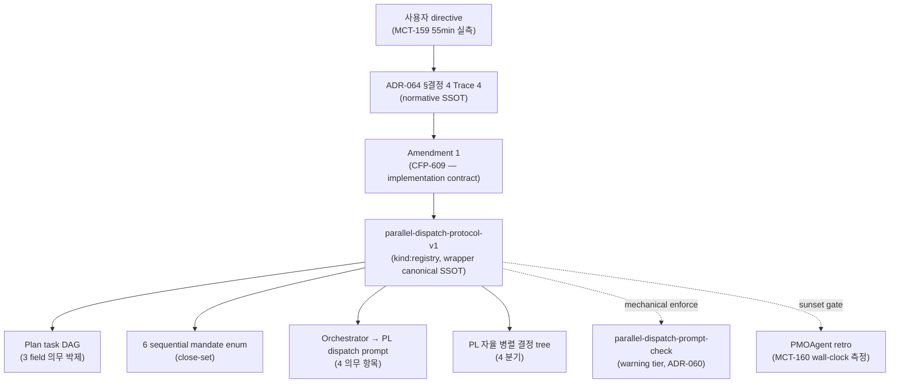

# parallel-dispatch-protocol-v1 registry

## 상위 SSOT 위치

본 파일이 canonical SSOT — wrapper-owned, lane-agnostic registry. sibling repo (codeforge-develop / codeforge-requirements / codeforge-design / codeforge-review / codeforge-test / codeforge-pmo) 에서 verbatim mirror 없음 — wrapper canonical 1곳만 존재 (kind:registry 패턴, kind:contract 와 구분). **SSOT for registry exemption from MANIFEST sibling sync** = ADR-010 §3 verbatim ("kind:registry 파일은 MANIFEST 범위 밖. 기존 check-doc-frontmatter.sh + check-doc-section-schema.sh 가 검증"). ADR-008 = contract versioning 룰 SSOT (registry 면제 정의 영역 아님).

선례 정합 = debate-protocol-v1 / severity-propagation-v1 / evidence-check-registry-v1 / label-registry-v2 / comment-prefix-registry-v1 / fix-event-v1.

## 1. 목적

codeforge 내 모든 lane PL agent 가 plan task 를 dispatch 할 때 **의존성 그래프(DAG) 기반 병렬 dispatch default** 를 구조적으로 강제하는 행동 registry. ADR-064 §결정 4 (Trace 4) "Orchestrator multi-task spawn default = parallel" normative declaration 의 execution-time enforcement carrier.

근본 동기: mctrader (codeforge consumer 데뷔작) MCT-159 Phase 2 55min wall-clock 실측 — 의존성 부재 Task 8~14 sequential 진행으로 ~40-45% wall-clock 손실 추정 (잠재 30min 감축 가능). 6 영역 root cause 중 F2 (Orchestrator dispatch prompt sequential lock) / F3 (DeveloperPLAgent default sequential bias) / F6 (consumer overlay default sequential bias) = 본 registry scope. F1 / F4 / F5 (외부 superpowers skill 영역) = 본 registry scope 외.

## 2. Schema

### Plan Task DAG 3 Field (의무 기재)

codeforge 가 plan 작성 시 각 task block 에 아래 3 field (+ 선택 1 field) 를 반드시 기재한다. field 부재 = parallel default 추정 → spawn prompt 시 audit 위반.

```yaml
### Task N: [Component Name]

**Dependencies:**
- 의존: "[Task M] 완료 후"      # depends_on — 선행 task 명시. 부재 시 "없음"
- 병렬 가능: "[Task K, Task L]"  # parallel_with — 동시 dispatch 가능 task. 부재 시 "없음"
- 충돌 영역: "file:<path>"       # conflict_scope — commit 분리 의무 대상. 부재 시 "없음"
- 순차 의무 사유: "<6 enum 중 1>" # sequential_mandate_reason — 선택 (sequential 선택 시 의무)
```

## 3. 항목

### 6 순차 의무 영역 Enum (close-set)

ADR-064 §결정 4 의 3 사유 (state dependency / shared resource / ordering invariant) 의 codeforge 도메인 instantiation. sequential 선택 시 아래 6 enum 중 1 종 명시 의무.

| Enum 값 | 사유 분류 | 운영적 정의 |
|---|---|---|
| `tdd_red_phase` | state dependency | red phase test 작성 → 실행 → 실패 확인 → green phase 진입 순서 의무 |
| `schema_migration` | state dependency | DB schema migration forward / backward / data backfill 순서 의무 |
| `adr_reservation_append` | ordering invariant | `docs/adr/ADR-RESERVATION.md` sequential append (ADR-050 §결정) |
| `fix_ledger_append` | ordering invariant | Story §10 FIX Ledger row append (fix-event-v1 contract, CFP-32 Orchestrator 독점) |
| `sibling_sync_ordering` | ordering invariant | canonical PR merge 완료 후 sibling sync PR open (ADR-010 §sibling sync PR) |
| `marketplace_sync_ordering` | ordering invariant | marketplace sync PR 선행 merge → plugin PR merge (ADR-063 §결정 2) |

**Close-set assumption**: 6 enum 외 sequential 선택 = ADR-064 §결정 4 위반. ADR-039 §결정 7 `policy_violation_subdecision` 발화 채널. enum 확장 (예: label-registry MINOR bump 의 shared resource 분류 후보) 은 별 CFP carrier 신설 + ADR-064 Amendment N 의무.

## 4. 변경 규칙

### Orchestrator → PL Dispatch Prompt 4 의무 항목

lane PL agent spawn 시 Orchestrator 가 prompt 에 반드시 포함해야 하는 4 항목.

### §4.1 Plan DAG 분석 결과 기재 (parallel_with batches list verbatim)

```text
[Parallel Dispatch Hint]
batch-1 (병렬): Task A ∥ Task B ∥ Task C  (의존 없음, file disjoint)
batch-2 (병렬, batch-1 완료 후): Task D ∥ Task E  (Task A 출력 의존)
batch-3 (순차 의무): Task F → Task G  (sequential_mandate_reason: marketplace_sync_ordering)
```

### §4.2 PL agent 자율 병렬 권한 명시

```text
plan DAG hint 기반 multi-instance 병렬 default. 각 batch 안 task 를 동시 dispatch 가능.
pl_autonomous_parallel_authority: required
```

`pl_autonomous_parallel_authority` enum 3-value (consumer overlay 축소 차단 영역 schema validator 정합):

| 값 | 의미 |
|---|---|
| `required` | ADR-064 §결정 4 default parallel 준수 — consumer overlay 축소 불허 |
| `optional` | consumer overlay 명시적 opt-in 시 fallback to sequential 허용 (확장 channel — 강화 방향 default required 유지). **consumer overlay 가 `optional` 채택 시 같은 overlay file 안 `sunset_justification` 3-tuple (metric / who / how — ADR-058 §결정 5 정합) 기재 의무**. lint 영역 §8 5번 검사 추가 (heuristic — same-file keyword 영역 detect) |
| `disabled` | consumer overlay 명시적 opt-out — broken-baseline 회피 advisory only (ADR-064 §결정 7 ratchet 차단 영역, `sunset_justification` 의무 동일 적용). lint 영역 §8 2번 검사 영역 위반 발화 |

### §4.3 Sequential 의무 영역만 명시

```text
sequential 의무 task 만 명시 (6 enum 중 해당):
- Task G → Task H: marketplace_sync_ordering (ADR-063 §결정 2)
```

### §4.4 File-level Conflict Resolution 패턴 기재

```text
충돌 패턴 처리:
- same-file-different-method: commit atomic 분리 후 PL merge
- same-file-different-section: 병렬 작업 후 PL merge (충돌 영역 명시)
- same-file-same-method: sequential 의무 (shared_resource → sequential_mandate_reason 영역 manual override)
```

**`shared_resource` manual override 패턴 정의 (close-set 6 enum 보존 의무)**:

§3 6 enum (`tdd_red_phase` / `schema_migration` / `adr_reservation_append` / `fix_ledger_append` / `sibling_sync_ordering` / `marketplace_sync_ordering`) = close-set 보존 — `shared_resource` 는 7번째 enum 신설 아님. ADR-064 §결정 4 의 normative SSOT 3 사유 (`state dependency` / `shared resource` / `ordering invariant`) 중 `shared resource` 가 codeforge 도메인에서 instantiation 되는 사례 = same-file-same-method. 6 enum 외에서 sequential 선택 시 = ADR-039 §결정 7 `policy_violation_subdecision` 발화. 다만 `shared_resource` 패턴이 plan author 에게 매핑되는 방식:

| 패턴 | 6 enum 매핑 | 비고 |
|---|---|---|
| same-file-different-method | 매핑 불요 | commit atomic 분리 + PL merge (병렬 default 유지, §5 분기 3) |
| same-file-different-section | 매핑 불요 | 병렬 작업 + PL merge (병렬 default 유지) |
| **same-file-same-method (shared resource)** | `sequential_mandate_reason: <6 enum 중 해당>` 매핑 영역 plan author 의무. **6 enum 외 영역 매핑 불가 시 = 별 CFP carrier enum 확장 amendment 발의 의무** | sequential 의무 발화 (§5 분기 4) |

7번째 enum 신설 영역 = ADR-064 Amendment N 별 carrier (close-set 영역 ratchet 강화 방향 — §결정 7 정합).

## §5. Lane PL agent 자율 병렬 결정 Tree (4-분기)

lane PL agent (DeveloperPLAgent + ArchitectPLAgent + RequirementsPLAgent + DesignReviewPL + CodeReviewPL + SecurityTestPL) 가 따르는 4-분기 결정 tree:

```
1. plan 의 parallel_with hint 있음
   → multi-instance subagent 병렬 dispatch (default)

2. parallel_with hint 부재 + 파일 disjoint + interface 의존 0
   → 자율 병렬 dispatch (default — PL 자체 판단, plan hint 부재 시)

3. same-file-different-method + commit atomic 분리 capability 보유
   → 병렬 dispatch + 완료 후 PL merge (commit atomic 분리 후 sync)
   → commit atomic 분리 capability 부재 시 분기 4 fallback

4. same-file-same-method 또는 schema_migration
   → sequential 의무 (6 enum 중 해당 명시)
```

codeforge-develop `agents/DeveloperPLAgent.md` 가 본 4-분기 결정 tree 를 self-write (sibling sync — Phase 2 carrier).

## §6. Dispatch Packet Schema (YAML)

### §6.1 orchestrator_to_pl_packet

```yaml
orchestrator_to_pl_packet:
  story_key: str             # CFP-NNN | <CONSUMER>-NNN
  lane: enum                 # [requirements | design | design-review | develop | code-review | security-test | integration-test | pmo]
  phase: enum                # [phase-1 | phase-2]
  plan_dag_analysis:
    batches:
      - batch_id: str                          # "B-1"
        tasks: list[str]                       # ["Task 1", "Task 2", "Task 4"]
        depends_on_batches: list[str]          # [] (batch-1 은 의존 없음)
        sequential_mandate_reasons: list[str]  # 6 enum close-set (§3) — 해당 task 만.
                                               # `shared_resource` 영역 같은 7번째 enum 영역 신설 영역 아님 —
                                               # 6 enum 영역 매핑 의무. 매핑 불가 시 별 CFP carrier enum 확장 amendment 발의.
                                               # 6 enum 외 영역 발견 시 = ADR-039 §결정 7 policy_violation_subdecision 발화.
        estimated_wall_clock_minutes: int      # optional
  pl_autonomous_parallel_authority: enum  # [required | optional | disabled]
  file_conflict_resolution_patterns:
    - pattern_id: "same-file-different-method"
      resolution: "commit atomic 분리 후 PL merge"
    - pattern_id: "same-file-different-section"
      resolution: "병렬 작업 후 PL merge (충돌 영역 명시)"
    - pattern_id: "same-file-same-method"
      resolution: "sequential 의무 (shared_resource enum)"
```

### §6.2 pl_to_worker_packet

```yaml
pl_to_worker_packet:
  batch_id: str
  worker_count: int             # batch tasks count 와 동일 또는 ≤ worker_count_max
  worker_count_max: int         # default 7 (codeforge-brainstorm 7-way 자기 시연 정합 + OperationalRiskArchitect §7.4.4 rate-limit consult)
  worker_assignments:
    - task_ref: str
      subagent_kind: str        # role:dev preset OR named agent
      conflict_scope: str       # file path or method signature
      sequential_mandate: bool
```

### §6.3 pl_integration_review

```yaml
pl_integration_review:
  batch_id: str
  worker_outcomes: list         # [PASS | FIX-N | CRASH]
  merge_strategy: enum          # [pl_local_merge | escalate_to_orchestrator]
  # crash recovery / fail-mode protocol = 별 CFP follow-up scope (본 registry 영역 외)
```

`merge_strategy` 2-value enum — fail-mode protocol (crash recovery / atomic batch vs individual recovery / circuit breaker / max retry) 은 본 registry scope 외, 별 CFP follow-up 영역 (OperationalRiskArchitect §11.6 consult 정합).

### §6.4 env_invariants

```yaml
env_invariants:
  env_0_default_subagent_context:
    description: "Orchestrator round-trip polyfill — PL 이 batch N task multi-instance subagent dispatch 1 round trip 안에 spawn"
    forbidden:
      - recursive_spawn       # platform inherent
      - worker_to_worker_send_message  # codeforge policy
  env_1_agent_teams_enabled:
    description: "TeamCreate + SendMessage continuous dialog — Lead ↔ Worker"
    forbidden:
      - nested_team           # team-of-teams 차단
      - team_of_teams         # one-team-per-lead 강제
```

env=0 round-trip polyfill 의 super-linear token cost 정량 측정 = MCT-160 retro 측정 의무 (broad coverage signal 보강 carrier).

## §7. Idempotency Invariants 6종 (OperationalRiskArchitect §11.6 consult)

batch dispatch 의 재실행 / crash recovery / cross-batch state 영역 invariant 6종. fail-mode protocol full schema (circuit breaker / max retry / atomic batch vs individual recovery) 는 본 registry scope 외 — 별 CFP follow-up carrier.

| ID | 영역 | 정의 |
|---|---|---|
| **I-6.1** | Worker subagent retry idempotency | 동일 worker subagent 재 dispatch 시 결과 deterministic — input packet hash 동일 → output deterministic. 부수 효과 (Git commit / file write / GitHub issue comment) 의 idempotency 는 각 subagent 영역 책무. |
| **I-6.2** | File-level conflict resolution determinism (same-file-different-method) | same-file-different-method 패턴 = commit atomic 분리 후 PL merge → 동일 input 동일 output. PL merge 시 conflict resolution 결과 deterministic (Git 3-way merge auto-resolution 영역 정합). |
| **I-6.3** | Sequential mandate ordering invariant (6 enum) | 6 enum 영역 sequential dispatch 시 ordering 결과 deterministic — ADR / FIX Ledger / sibling sync / marketplace sync row 의 append order 가 dispatch 영역 ordering 반영. |
| **I-6.4** | PL integration review idempotency | batch 완료 후 PL 의 worker_outcomes 통합 review 가 동일 input 동일 verdict — `merge_strategy` 결정 deterministic. |
| **I-6.5** | Crash recovery idempotency | worker subagent crash / timeout 시 그 task 만 re-dispatch (default). re-dispatch 의 결과 동일 input 동일 output (I-6.1 정합). 부수 효과 (이미 partial write 된 file) 의 cleanup 영역 책무 = subagent self-write. |
| **I-6.6** | Cross-batch state isolation | batch N+1 의 dispatch 시점 = batch N 의 all worker_outcomes PASS 확인 후. batch 간 state leak 차단 (batch-1 worker subagent state 가 batch-2 worker subagent input 에 영향 주지 않음). |

## §8. Mechanical Enforcement (warning tier)

ADR-060 evidence-enforceable promotion framework 정합 warning tier entry:

- **detect**: `bash scripts/check-parallel-dispatch-prompt.sh` (1-line shim → `python scripts/check_parallel_dispatch_prompt.py` — ADR-061 python-script-writing-convention 정합)
- **workflow**: `templates/github-workflows/parallel-dispatch-prompt-check.yml` (`continue-on-error: true`)
- **bypass**: `hotfix-bypass:parallel-dispatch-prompt` label (ADR-024 Amendment 3 정합)
- **registry entry**: `docs/evidence-checks-registry.yaml` (`parallel-dispatch-prompt-check` entry, owner_adr: ADR-064, carrier_adr: ADR-060)

검사 항목 5종:

1. plan DAG batches list 기재 여부 (§4.1)
2. `pl_autonomous_parallel_authority: required` 또는 `enum [required]` 기재 여부 (§4.2 — `disabled` 차단 영역)
3. `sequential_mandate_reasons` 6 enum 외 영역 발견 시 위반 (§4.3 / §3)
4. `file_conflict_resolution_patterns` 기재 여부 (§4.4)
5. `worker_count <= worker_count_max` (default 7) 검증 (§6.2 / OperationalRiskArchitect §7.4.4 rate-limit consult 정합)

## §9. Backward Compatibility

기존 plan / Story / packet / overlay 영향 0건:

- 구 plan (의존 / 병렬 가능 / 충돌 영역 field 부재) = warning tier lint 만 발화 (block 0건)
- 구 Story §14 Lane Evidence = backward-compat (신규 row append 의 spawned_at diff < 60s 측정 영역만 추가)
- 구 dispatch packet = backward-compat (신규 field optional, default value 자연 추정)
- 구 consumer overlay = backward-compat (신규 `parallel_dispatch:` block 부재 시 default value 추정)

## §10. Sibling Sync Exempt 사유

kind:registry = sibling sync 면제 (ADR-010 §결정 2). sibling repo (codeforge-develop / codeforge-design / codeforge-requirements / codeforge-review / codeforge-test / codeforge-pmo) 에서 본 registry verbatim mirror 0건. wrapper canonical 1곳만 SSOT.

다만 sibling repo agent file (예: `codeforge-develop/agents/DeveloperPLAgent.md`) 가 본 registry §5 4-분기 결정 tree 를 self-write — 본 registry 본문 mirror 가 아닌, registry SSOT 참조 + 4 분기 decision tree 기재. 변경 시 ADR-010 §sibling sync PR 발화 (sibling repo agent file 변경 trigger 이며, 본 registry 변경 trigger 가 아님).

## §11. 검증 지표 (sunset gate)

ADR-064 Amendment 1 §결정 4 self-application 의무 영역 — broad coverage signal:

- **Primary**: MCT-160 Phase 2 wall-clock ≤ MCT-159 baseline (55min) × 0.8 (= ≤ 44min)
- **Broad coverage extension**: subsequent 3 consumer Story (MCT-161 / MCT-162 / MCT-163) median wall-clock ≤ MCT-159 baseline × 0.8

PMOAgent retro file `§wall-clock 표` 가 measurement carrier (Story 단위 timestamp delta).

## §12. References

- ADR-064 §결정 4 Trace 4 + Amendment 1 (carrier)
- ADR-039 §결정 7 `policy_violation_subdecision`
- ADR-044 §결정 2 `dispatch_mode` enum (env=1 직교 차원)
- ADR-056 (team-spec teammates gap absorb — `templates/team-spec-requirements.yaml` 6-way)
- ADR-008 §결정 2 (kind:registry sibling sync 면제)
- ADR-010 §결정 2 (sibling sync 책임 분리)
- ADR-063 §결정 2 (marketplace_sync_ordering enum 정합)
- ADR-060 (evidence-enforceable promotion framework — warning tier entry)
- ADR-040 (worktree convention — 1 Story = 1 worktree, env isolation)
- ADR-061 (Python script-writing convention — lint shim ≤ 5 lines)
- ADR-024 Amendment 3 (hotfix-bypass label family)
- CFP-609 Story §1-§6 (RequirementsPL synthesis) + §7 (ArchitectPL design narrative)
- mctrader-data#49 (Phase 2 PR, 55min wall-clock, merged sha 1bd50216)
- mctrader-hub#281 (Phase 1 PR, merged sha 670d118)
- mctrader-hub finding SSOT: `docs/findings/2026-05-13-parallel-execution-failure-MCT-159.md`
- mctrader-hub retro `RETRO-MCT-159.md`

## §13. 다이어그램


