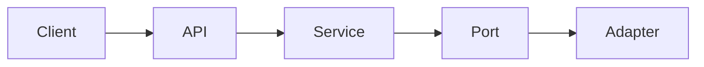

# ADR (Architecture Decision Record) 템플릿

설계 결정마다 Confluence `<SPACE_KEY>` 공간의 "ADR" 트리 아래 카테고리 parent 페이지에 신규 ADR 페이지를 생성. **레포 내 ADR markdown 중복 관리 금지** — Confluence가 유일한 원본.

**사용 대상**: ArchitectAgent (DocsAgent 경유 의뢰), PMOAgent (ADR 후보 발의 — `status=Proposed` draft), DocsAgent (생성·갱신 단독 실행)

---

## 페이지 메타

- **제목**: `ADR-NNN: <결정>` (번호 = 기존 최대 + 1)
- **label**: `adr` 필수. 카테고리별 보조 label(예: `adr-architecture`, `adr-data-storage`) 병기 가능
- **Parent page**: 카테고리 parent (Team & Process / Architecture / Data & Storage / Infrastructure / UX / `<domain-category>`)
- **신규 ADR 없이 기존 ADR 결정 변경 금지** — 변경하려면 새 ADR에서 이전 ADR을 supersede

---

## 페이지 상단 메타데이터 테이블 (필수)

| 항목 | 값 |
|------|----|
| ADR 번호 | NNN |
| 상태 | Proposed / Accepted / Deprecated / Superseded-by-ADR-MMM |
| 카테고리 | Architecture / Data & Storage / Infrastructure / Team & Process / UX / `<domain-category>` |
| 결정일 | YYYY-MM-DD |
| 관련 파일 | `path/to/file.ext`, `path/to/other.ext` |
| Related Stories | `<PROJECT_KEY>-N`, `<PROJECT_KEY>-M` |

---

## 본문 섹션 (고정 순서)

### ## 상태
`Proposed` / `Accepted` / `Deprecated` / `Superseded by ADR-MMM`
(하단 "Superseded by ..." 명시 시 새 ADR 링크 추가)

### ## 컨텍스트
결정의 배경 · 문제 정의 · 제약 조건. Why this decision is needed now.

### ## 결정
구체 결정안. **동사·능동태**로 서술 ("X를 도입한다" / "Y를 금지한다"). 모호한 표현(고려·지향) 금지.

### ## 결과
결정의 긍정·부정·trade-off. 영향 받는 코드·레이어·운영 경계.

### ## 다이어그램 (선택)
Confluence code block `language=mermaid`:

````markdown

````

### ## 관련 파일
변경 또는 참조되는 파일 경로. Consumer project 기준 relative path.

---

## DocsAgent 작성 절차

```
1. 카테고리 판정 — 결정 성격에 따라 Architecture / Data & Storage / Infrastructure / Team & Process / UX / <domain> 중 선택
2. 카테고리 parent pageId 조회 (searchConfluenceUsingCql)
3. 기존 최대 ADR 번호 + 1 (searchConfluenceUsingCql "label='adr'" ORDER BY ID DESC)
4. createConfluencePage(parentId=<category-parent>, title="ADR-NNN: <결정>", labels=["adr", "<category-label>"])
5. 본문: 위 메타 테이블 + 상태/컨텍스트/결정/결과/다이어그램/관련 파일 섹션
6. 관련 Story 페이지 §3 "관련 ADR" 항목에 링크 추가 (updateConfluencePage)
```

## PMOAgent ADR 후보 발의

패턴 분석에서 "설계 지침 부재" 반복 감지 시:

```markdown
---
type: adr-draft
category: Architecture | Data & Storage | ...
title: "ADR-NNN: <제안 결정>"
trigger: "최근 N Story에서 반복 발견된 {패턴}"
---

## 배경
{반복된 FIX 사례 인용 — Story 키·iteration·finding}

## 문제
{지침·패턴 부재로 인한 설계 재발명 비용}

## 제안 결정
{구체 결정안}

## 예상 결과
...
```

DocsAgent가 write queue 파일을 drain → `status=Proposed`로 ADR 페이지 생성. 다음 Story 설계 진입 시 Architect가 검토해 `status=Accepted` 전이 또는 기각.
